# Consolidated Pilot Reporting and Visualization

**Reporting ID:** `analysis_reporting_all_NA_20260429T032103Z`
**Generated at UTC:** `2026-04-29T03:21:03.257749+00:00`

## Purpose

This report provides advisor-facing visual summaries of the consolidated LocalAI worker-mode pilot campaigns. It is generated after technical diagnosis and before completion-gate evaluation, so that the benchmark cycle is not considered closed until its results are readable and inspectable.

The report combines **measurement CSV data** for quantitative charts with **technical diagnosis outputs** for interpretation, unsupported-scenario evidence and family-level judgments.

## Baseline context

| Dimension | Baseline value |
|---|---|
| Baseline ID | B0 |
| Model | llama-3.2-1b-instruct:q4_k_m |
| Worker count | 2 |
| Placement | colocated_sc_app_02 |
| Workload | users=2, spawnRate=1, runTime=2m |
| Prompt | Reply with only READY. |
| Request timeout | 120 s |

## Data sources

| Layer | Primary use | Source |
|---|---|---|
| Measurement CSV | Quantitative charts and scenario summary metrics | `results/pilot/consolidated/**/_stats.csv` |
| Technical diagnosis | Interpretation, family judgments, findings, unsupported-scenario context | `results/diagnosis/analysis_diagnosis_all_NA_20260429T032056Z_diagnosis.json` |
| Scenario configuration | Fixed/varied dimensions and scenario labels | `config/scenarios/**` |
| Cluster-side artifacts | CPU/memory snapshots and placement evidence | `*_cluster_post_*` files |

## Sweep-specific reports

The global report below provides the advisor-facing overview. Each sweep also has a dedicated report for focused inspection of one varied dimension.

| Sweep | Dedicated HTML report | Execution status | Coverage | Varied dimension |
|---|---|---|---|---|
| Worker-count sweep | [worker-count](sweeps/worker-count/index.html) | partially_measured | measured=2, unsupported=2, missing=0 | number of LocalAI RPC workers |
| Workload sweep | [workload](sweeps/workload/index.html) | fully_measured | measured=3, unsupported=0, missing=0 | synthetic client-side workload pattern |
| Model sweep | [models](sweeps/models/index.html) | fully_measured | measured=4, unsupported=0, missing=0 | model served by the LocalAI worker-mode cluster |
| Placement sweep | [placement](sweeps/placement/index.html) | fully_measured | measured=2, unsupported=0, missing=0 | Kubernetes placement strategy for LocalAI server and workers |

## Diagnosis coverage snapshot

| Family | Scenarios | Observed | Measured | Unsupported | Samples |
|---|---|---|---|---|---|
| worker-count | 4 | 4 | 2 | 2 | 6 |
| workload | 3 | 3 | 3 | 0 | 9 |
| models | 4 | 4 | 4 | 0 | 12 |
| placement | 2 | 2 | 2 | 0 | 6 |

## Worker-count sweep

**Execution status:** `partially_measured`

**Execution note:** At least one configured scenario has measured benchmark samples, while other scenarios are missing or unsupported.

**Varied dimension:** number of LocalAI RPC workers

**Fixed dimensions:** baseline model, baseline workload, baseline placement, baseline protocol.

**Reference scenario within the sweep:** `W2`

| Scenario count | Measured | Unsupported | Missing |
|---|---|---|---|
| 4 | 2 | 2 | 0 |

### Fixed baseline parameters

| Fixed dimension | Value inherited from baseline |
|---|---|
| Model | llama-3.2-1b-instruct:q4_k_m |
| Placement | colocated_sc_app_02 |
| Workload | users=2, spawnRate=1, runTime=2m |
| Prompt | Reply with only READY. |
| Temperature | 0.1 |
| Request timeout | 120 s |

### Scenario parameter matrix

| Scenario | Status | Varied value (number of LocalAI RPC workers) | Model | Workers | Placement | Workload | Timeout (s) |
|---|---|---|---|---|---|---|---|
| `W1` | measured | 1 | llama-3.2-1b-instruct:q4_k_m | 1 | colocated_sc_app_02 | users=2, spawnRate=1, runTime=2m | 120 |
| `W2` | measured | 2 | llama-3.2-1b-instruct:q4_k_m | 2 | colocated_sc_app_02 | users=2, spawnRate=1, runTime=2m | 120 |
| `W3` | unsupported_under_current_constraints | 3 | llama-3.2-1b-instruct:q4_k_m | 3 | colocated_sc_app_02 | users=2, spawnRate=1, runTime=2m | 120 |
| `W4` | unsupported_under_current_constraints | 4 | llama-3.2-1b-instruct:q4_k_m | 4 | colocated_sc_app_02 | users=2, spawnRate=1, runTime=2m | 120 |

### Measurement summary

This compact table reports the core indicators used to read the sweep at a glance. Detailed percentiles, deltas and resource snapshots are reported in the following extended table.

| Scenario | Description | Status | Sample count | Mean response time (ms) | P95 response time (ms) | Throughput (requests/s) | Unsupported evidence |
|---|---|---|---|---|---|---|---|
| `W1` | W1 (1 worker) | measured | 3 | 1507.36 | 1600.00 | 0.5709 |  |
| `W2` | W2 (2 worker) | measured | 3 | 1504.10 | 1600.00 | 0.5715 |  |
| `W3` | W3 (3 worker) | unsupported_under_current_constraints | 0 | n/a | n/a | n/a | failed_scheduling, insufficient_cpu, insufficient_memory, no_preemption_victims_found, node_affinity_selector_mismatch, pending_pod, preemption_not_helpful |
| `W4` | W4 (4 worker) | unsupported_under_current_constraints | 0 | n/a | n/a | n/a | failed_scheduling, insufficient_cpu, insufficient_memory, no_preemption_victims_found, node_affinity_selector_mismatch, pending_pod, preemption_not_helpful |

### Extended measurement metrics

This secondary table keeps the additional metrics aligned with the technical diagnosis while avoiding an excessively wide primary summary table.

| Scenario | P50 response time (ms) | P99 response time (ms) | Mean response time delta (%) | P95 response time delta (%) | Throughput delta (%) | Max node CPU snapshot (%) | Max node memory snapshot (%) |
|---|---|---|---|---|---|---|---|
| `W1` | 1500.00 | 1700.00 | 0.22 | 0.00 | -0.10 | 33.67 | 37.33 |
| `W2` | 1500.00 | 1700.00 | 0.00 | 0.00 | 0.00 | 34.67 | 37.33 |
| `W3` | n/a | n/a | n/a | n/a | n/a | n/a | n/a |
| `W4` | n/a | n/a | n/a | n/a | n/a | n/a | n/a |

### Diagnosis-based reading

- **Nel confronto iniziale tra configurazioni misurate il numero di worker non produce un miglioramento abbastanza marcato.** (status: `weak_signal`, confidence: `low`).
  - Implication: Il passaggio da W1 a W2 è stato osservato, ma il beneficio sulla latenza media resta sotto la soglia diagnostica configurata; eventuali scenari superiori unsupported limitano inoltre la valutazione oltre il perimetro misurato.

### Charts

#### Mean response time

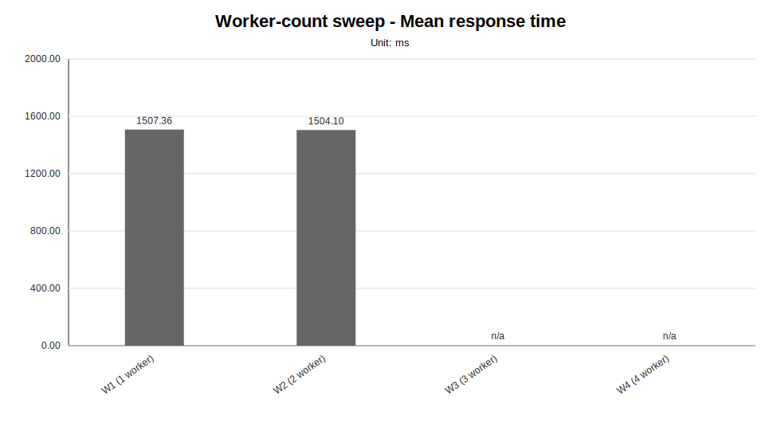

#### P50 response time

#### P95 response time

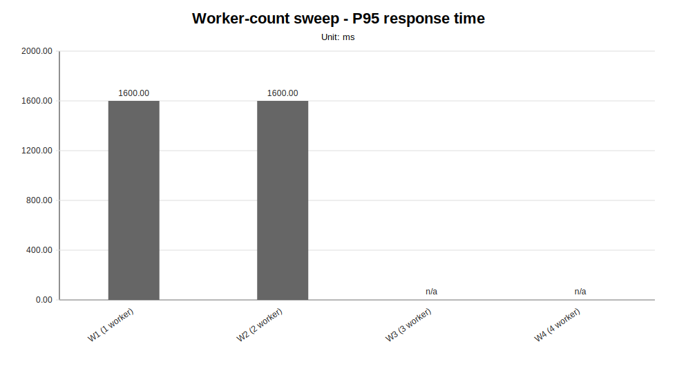

#### P99 response time

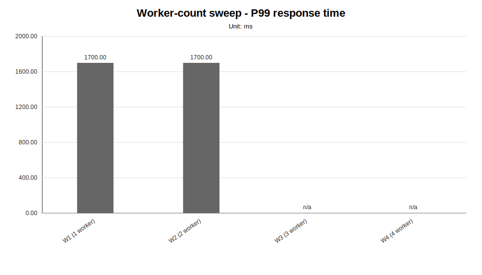

#### Throughput

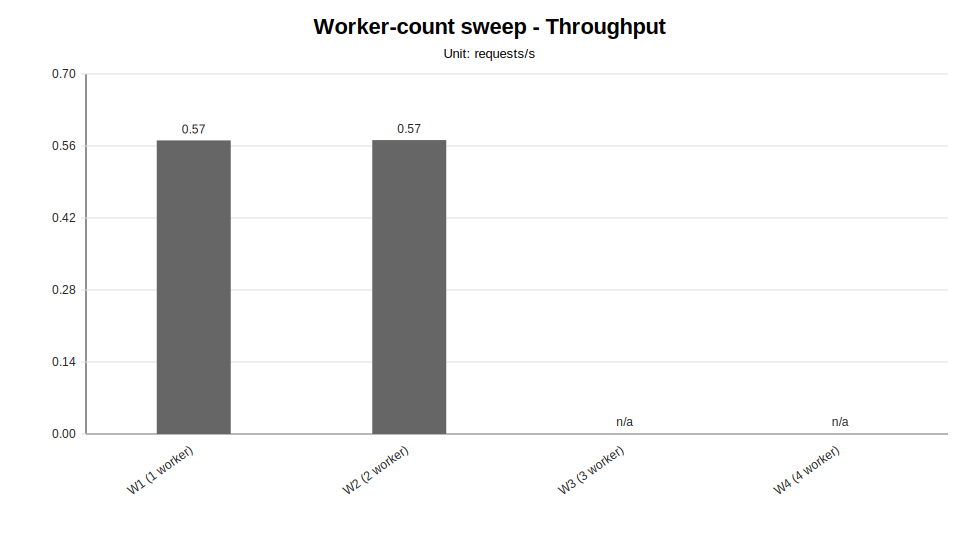

#### Maximum node CPU snapshot

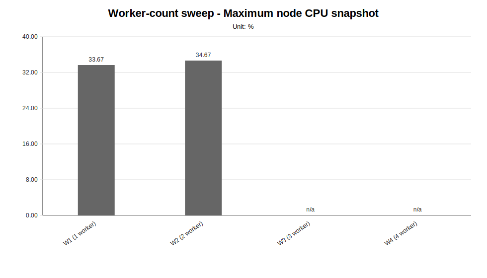

#### Maximum node memory snapshot

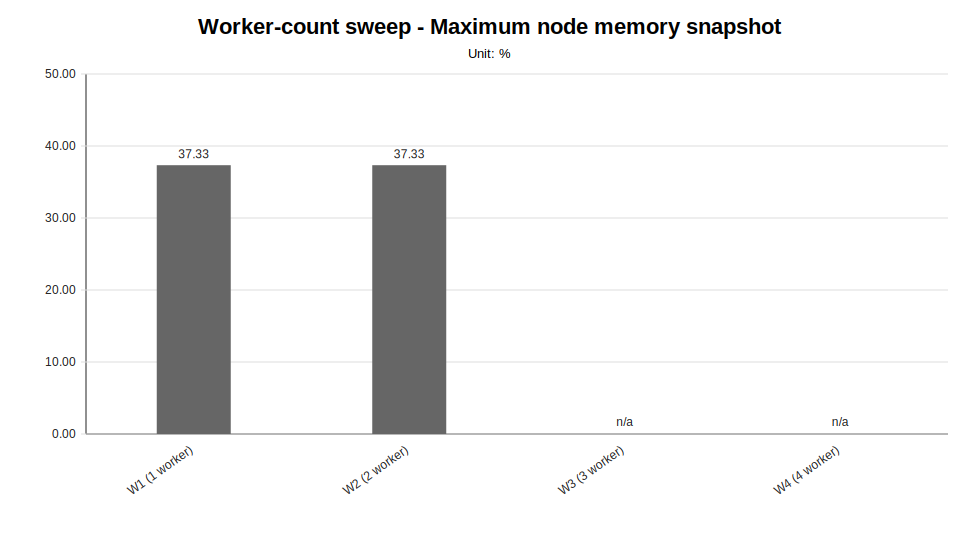

### Reading notes

- Measured scenarios: **2**.
- Unsupported scenarios under current constraints: **2**.
- Percentage deltas are computed against the family reference scenario; positive latency deltas indicate worse response time, while positive throughput deltas indicate higher request throughput.
- Unsupported scenarios are infrastructure/constraint observations and must not be interpreted as measured latency regressions.
- A `not_executed` sweep means that neither measurement CSV files nor unsupported-scenario evidence were found for any configured scenario in that family.

## Workload sweep

**Execution status:** `fully_measured`

**Execution note:** All configured scenarios in this sweep have measured benchmark samples.

**Varied dimension:** synthetic client-side workload pattern

**Fixed dimensions:** baseline model, baseline worker count, baseline placement, baseline protocol.

**Reference scenario within the sweep:** `WL2`

| Scenario count | Measured | Unsupported | Missing |
|---|---|---|---|
| 3 | 3 | 0 | 0 |

### Fixed baseline parameters

| Fixed dimension | Value inherited from baseline |
|---|---|
| Model | llama-3.2-1b-instruct:q4_k_m |
| Worker count | 2 |
| Placement | colocated_sc_app_02 |
| Prompt | Reply with only READY. |
| Temperature | 0.1 |
| Request timeout | 120 s |

### Scenario parameter matrix

| Scenario | Status | Varied value (synthetic client-side workload pattern) | Model | Workers | Placement | Workload | Timeout (s) |
|---|---|---|---|---|---|---|---|
| `WL1` | measured | users=1, spawnRate=1, runTime=2m | llama-3.2-1b-instruct:q4_k_m | 2 | colocated_sc_app_02 | users=1, spawnRate=1, runTime=2m | 120 |
| `WL2` | measured | users=2, spawnRate=1, runTime=2m | llama-3.2-1b-instruct:q4_k_m | 2 | colocated_sc_app_02 | users=2, spawnRate=1, runTime=2m | 120 |
| `WL3` | measured | users=4, spawnRate=2, runTime=2m | llama-3.2-1b-instruct:q4_k_m | 2 | colocated_sc_app_02 | users=4, spawnRate=2, runTime=2m | 120 |

### Measurement summary

This compact table reports the core indicators used to read the sweep at a glance. Detailed percentiles, deltas and resource snapshots are reported in the following extended table.

| Scenario | Description | Status | Sample count | Mean response time (ms) | P95 response time (ms) | Throughput (requests/s) | Unsupported evidence |
|---|---|---|---|---|---|---|---|
| `WL1` | WL1 (1 users, spawn 1) | measured | 3 | 1457.79 | 1500.00 | 0.2918 |  |
| `WL2` | WL2 (2 users, spawn 1) | measured | 3 | 1493.44 | 1600.00 | 0.5732 |  |
| `WL3` | WL3 (4 users, spawn 2) | measured | 3 | 3269.69 | 3300.00 | 0.7559 |  |

### Extended measurement metrics

This secondary table keeps the additional metrics aligned with the technical diagnosis while avoiding an excessively wide primary summary table.

| Scenario | P50 response time (ms) | P99 response time (ms) | Mean response time delta (%) | P95 response time delta (%) | Throughput delta (%) | Max node CPU snapshot (%) | Max node memory snapshot (%) |
|---|---|---|---|---|---|---|---|
| `WL1` | 1466.67 | 1533.33 | -2.39 | -6.25 | -49.09 | 17.33 | 37.33 |
| `WL2` | 1500.00 | 1700.00 | 0.00 | 0.00 | 0.00 | 34.67 | 37.33 |
| `WL3` | 3300.00 | 3633.33 | 118.94 | 106.25 | 31.87 | 50.00 | 37.00 |

### Diagnosis-based reading

- **La famiglia workload mostra un segnale netto di deterioramento prestazionale all'aumentare del carico.** (status: `strong_signal`, confidence: `medium`).
  - Implication: Nel cluster corrente il workload è un driver rilevante della latenza e suggerisce una soglia di fragilità più evidente nelle configurazioni più spinte.
- **Il workload più intenso aumenta sensibilmente la latenza, segnalando possibile saturazione del sistema.** (confidence: `medium`).
  - Implication: Il cluster appare più fragile quando cresce la concorrenza; la sola crescita del carico non si traduce necessariamente in aumento proporzionale del throughput utile.

### Charts

#### Mean response time

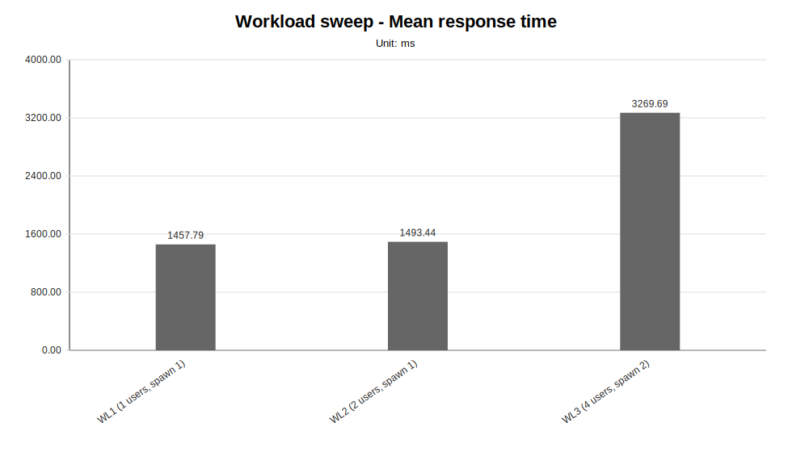

#### P50 response time

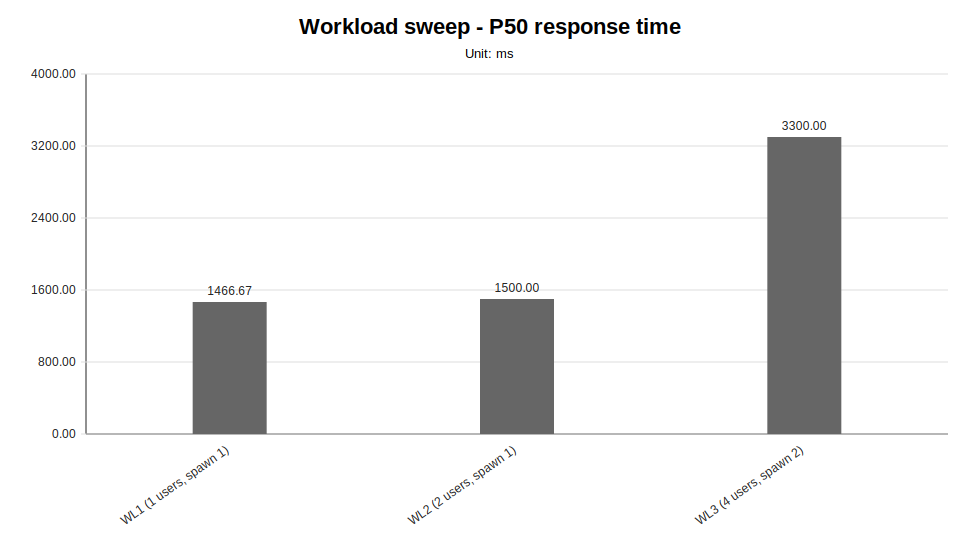

#### P95 response time

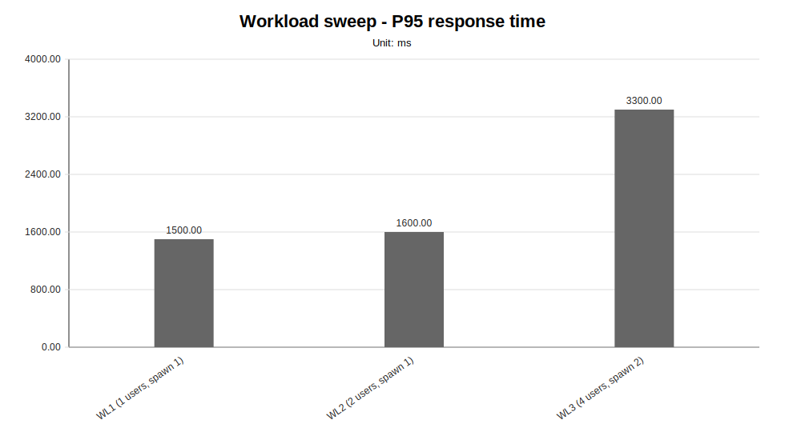

#### P99 response time

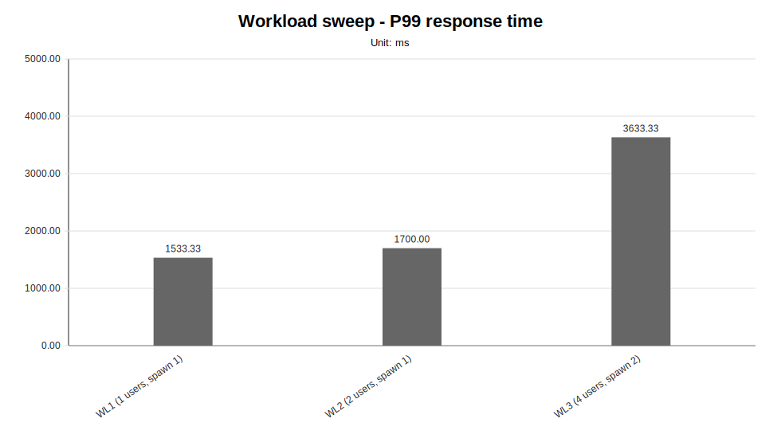

#### Throughput

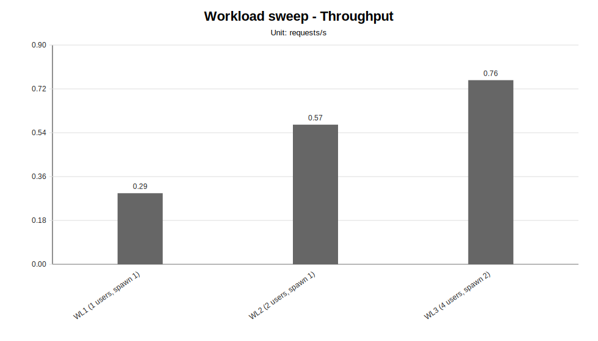

#### Maximum node CPU snapshot

#### Maximum node memory snapshot

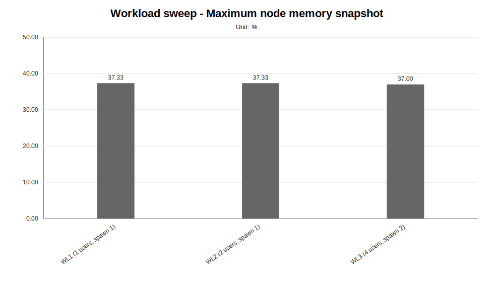

### Reading notes

- Measured scenarios: **3**.
- Unsupported scenarios under current constraints: **0**.
- Percentage deltas are computed against the family reference scenario; positive latency deltas indicate worse response time, while positive throughput deltas indicate higher request throughput.
- Unsupported scenarios are infrastructure/constraint observations and must not be interpreted as measured latency regressions.
- A `not_executed` sweep means that neither measurement CSV files nor unsupported-scenario evidence were found for any configured scenario in that family.

## Model sweep

**Execution status:** `fully_measured`

**Execution note:** All configured scenarios in this sweep have measured benchmark samples.

**Varied dimension:** model served by the LocalAI worker-mode cluster

**Fixed dimensions:** baseline worker count, baseline workload, baseline placement, baseline protocol.

**Reference scenario within the sweep:** `M1`

| Scenario count | Measured | Unsupported | Missing |
|---|---|---|---|
| 4 | 4 | 0 | 0 |

### Fixed baseline parameters

| Fixed dimension | Value inherited from baseline |
|---|---|
| Worker count | 2 |
| Placement | colocated_sc_app_02 |
| Workload | users=2, spawnRate=1, runTime=2m |
| Prompt | Reply with only READY. |
| Temperature | 0.1 |
| Request timeout | 120 s |

### Scenario parameter matrix

| Scenario | Status | Varied value (model served by the LocalAI worker-mode cluster) | Model | Workers | Placement | Workload | Timeout (s) |
|---|---|---|---|---|---|---|---|
| `M1` | measured | llama-3.2-1b-instruct:q4_k_m | llama-3.2-1b-instruct:q4_k_m | 2 | colocated_sc_app_02 | users=2, spawnRate=1, runTime=2m | 120 |
| `M2` | measured | llama-3.2-1b-instruct:q8_0 | llama-3.2-1b-instruct:q8_0 | 2 | colocated_sc_app_02 | users=2, spawnRate=1, runTime=2m | 120 |
| `M3` | measured | llama-3.2-3b-instruct:q4_k_m | llama-3.2-3b-instruct:q4_k_m | 2 | colocated_sc_app_02 | users=2, spawnRate=1, runTime=2m | 120 |
| `M4` | measured | llama-3.2-3b-instruct:q8_0 | llama-3.2-3b-instruct:q8_0 | 2 | colocated_sc_app_02 | users=2, spawnRate=1, runTime=2m | 120 |

### Measurement summary

This compact table reports the core indicators used to read the sweep at a glance. Detailed percentiles, deltas and resource snapshots are reported in the following extended table.

| Scenario | Description | Status | Sample count | Mean response time (ms) | P95 response time (ms) | Throughput (requests/s) | Unsupported evidence |
|---|---|---|---|---|---|---|---|
| `M1` | M1 (llama-3.2-1b-instruct:q4_k_m) | measured | 3 | 1497.13 | 1600.00 | 0.5725 |  |
| `M2` | M2 (llama-3.2-1b-instruct:q8_0) | measured | 3 | 1381.22 | 1400.00 | 0.5927 |  |
| `M3` | M3 (llama-3.2-3b-instruct:q4_k_m) | measured | 3 | 5168.81 | 5100.00 | 0.2782 |  |
| `M4` | M4 (llama-3.2-3b-instruct:q8_0) | measured | 3 | 4345.21 | 4400.00 | 0.3146 |  |

### Extended measurement metrics

This secondary table keeps the additional metrics aligned with the technical diagnosis while avoiding an excessively wide primary summary table.

| Scenario | P50 response time (ms) | P99 response time (ms) | Mean response time delta (%) | P95 response time delta (%) | Throughput delta (%) | Max node CPU snapshot (%) | Max node memory snapshot (%) |
|---|---|---|---|---|---|---|---|
| `M1` | 1500.00 | 1700.00 | 0.00 | 0.00 | 0.00 | 34.00 | 37.67 |
| `M2` | 1400.00 | 1500.00 | -7.74 | -12.50 | 3.53 | 32.67 | 35.00 |
| `M3` | 5000.00 | 9300.00 | 245.25 | 218.75 | -51.41 | 52.00 | 43.00 |
| `M4` | 4300.00 | 6400.00 | 190.24 | 175.00 | -45.05 | 52.00 | 52.00 |

### Diagnosis-based reading

- **La famiglia models mostra una penalità dimensionale netta e dominante sulla latenza media.** (status: `strong_signal`, confidence: `high`).
  - Implication: Nel cluster corrente la scelta del modello incide fortemente sul comportamento del servizio e rappresenta uno dei driver principali della performance osservata.

### Charts

#### Mean response time

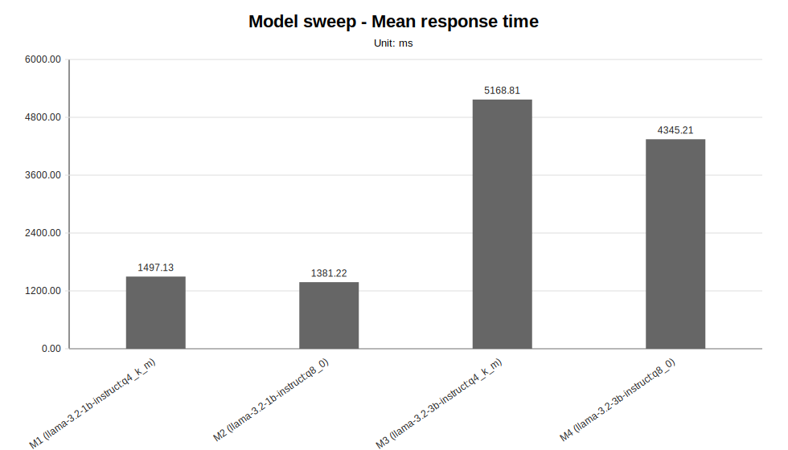

#### P50 response time

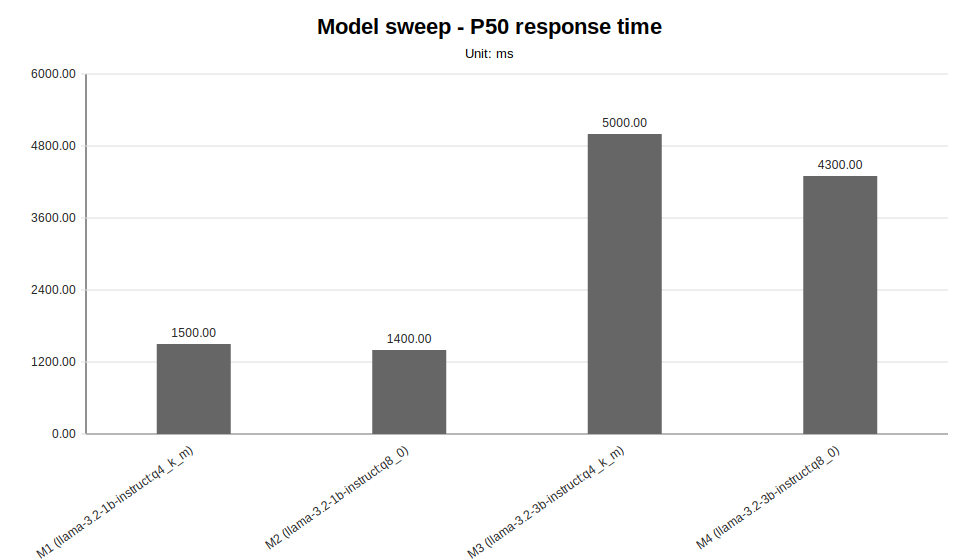

#### P95 response time

#### P99 response time

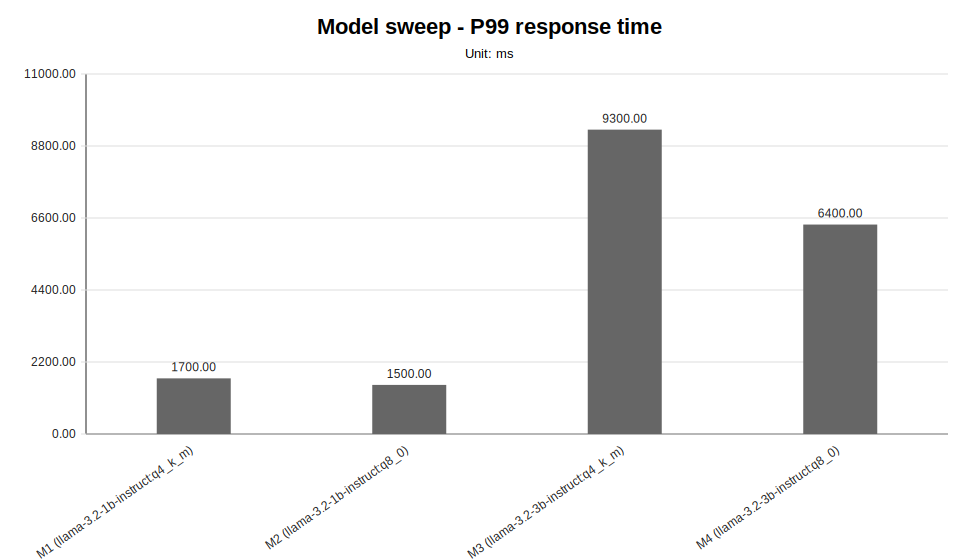

#### Throughput

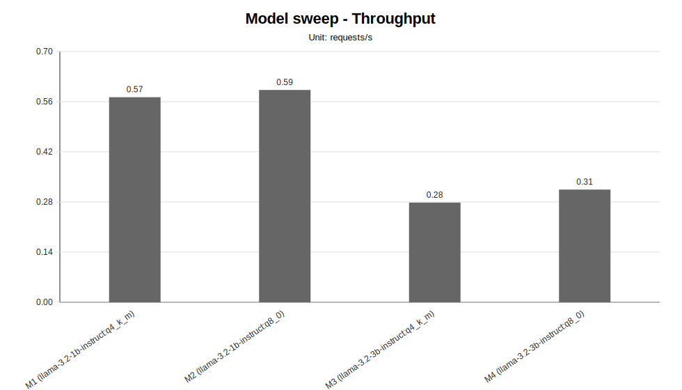

#### Maximum node CPU snapshot

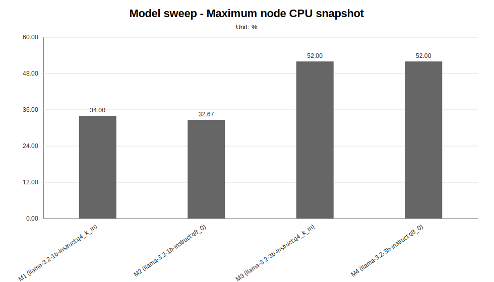

#### Maximum node memory snapshot

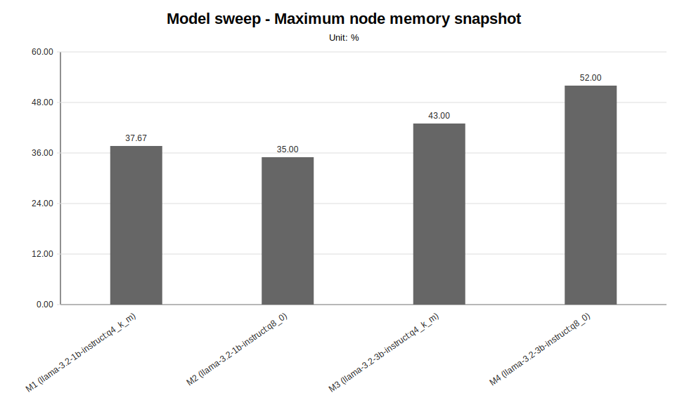

### Reading notes

- Measured scenarios: **4**.
- Unsupported scenarios under current constraints: **0**.
- Percentage deltas are computed against the family reference scenario; positive latency deltas indicate worse response time, while positive throughput deltas indicate higher request throughput.
- Unsupported scenarios are infrastructure/constraint observations and must not be interpreted as measured latency regressions.
- A `not_executed` sweep means that neither measurement CSV files nor unsupported-scenario evidence were found for any configured scenario in that family.

## Placement sweep

**Execution status:** `fully_measured`

**Execution note:** All configured scenarios in this sweep have measured benchmark samples.

**Varied dimension:** Kubernetes placement strategy for LocalAI server and workers

**Fixed dimensions:** baseline model, baseline worker count, baseline workload, baseline protocol.

**Reference scenario within the sweep:** `PL1`

| Scenario count | Measured | Unsupported | Missing |
|---|---|---|---|
| 2 | 2 | 0 | 0 |

### Fixed baseline parameters

| Fixed dimension | Value inherited from baseline |
|---|---|
| Model | llama-3.2-1b-instruct:q4_k_m |
| Worker count | 2 |
| Workload | users=2, spawnRate=1, runTime=2m |
| Prompt | Reply with only READY. |
| Temperature | 0.1 |
| Request timeout | 120 s |

### Scenario parameter matrix

| Scenario | Status | Varied value (Kubernetes placement strategy for LocalAI server and workers) | Model | Workers | Placement | Workload | Timeout (s) |
|---|---|---|---|---|---|---|---|
| `PL1` | measured | colocated_sc_app_02 | llama-3.2-1b-instruct:q4_k_m | 2 | colocated_sc_app_02 | users=2, spawnRate=1, runTime=2m | 120 |
| `PL2` | measured | distributed | llama-3.2-1b-instruct:q4_k_m | 2 | distributed | users=2, spawnRate=1, runTime=2m | 120 |

### Measurement summary

This compact table reports the core indicators used to read the sweep at a glance. Detailed percentiles, deltas and resource snapshots are reported in the following extended table.

| Scenario | Description | Status | Sample count | Mean response time (ms) | P95 response time (ms) | Throughput (requests/s) | Unsupported evidence |
|---|---|---|---|---|---|---|---|
| `PL1` | PL1 (colocated_sc_app_02) | measured | 3 | 1483.75 | 1500.00 | 0.5749 |  |
| `PL2` | PL2 (distributed) | measured | 3 | 1538.32 | 1600.00 | 0.5656 |  |

### Extended measurement metrics

This secondary table keeps the additional metrics aligned with the technical diagnosis while avoiding an excessively wide primary summary table.

| Scenario | P50 response time (ms) | P99 response time (ms) | Mean response time delta (%) | P95 response time delta (%) | Throughput delta (%) | Max node CPU snapshot (%) | Max node memory snapshot (%) |
|---|---|---|---|---|---|---|---|
| `PL1` | 1500.00 | 1633.33 | 0.00 | 0.00 | 0.00 | 35.00 | 32.67 |
| `PL2` | 1500.00 | 1633.33 | 3.68 | 6.67 | -1.62 | 21.00 | 33.67 |

### Diagnosis-based reading

- **Nel perimetro osservato la famiglia placement non mostra ancora un effetto abbastanza marcato da essere considerato dominante.** (status: `weak_signal`, confidence: `low`).
  - Implication: Le configurazioni di placement sono state confrontate rispetto alla baseline co-located PL1, ma la differenza di latenza resta sotto la soglia diagnostica configurata; nel cluster corrente il placement non emerge ancora come driver principale delle performance.

### Charts

#### Mean response time

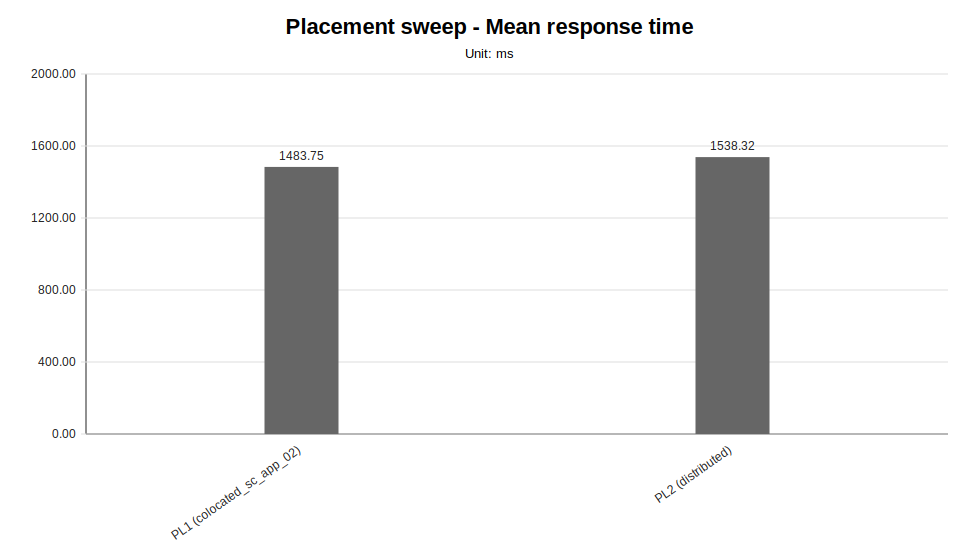

#### P50 response time

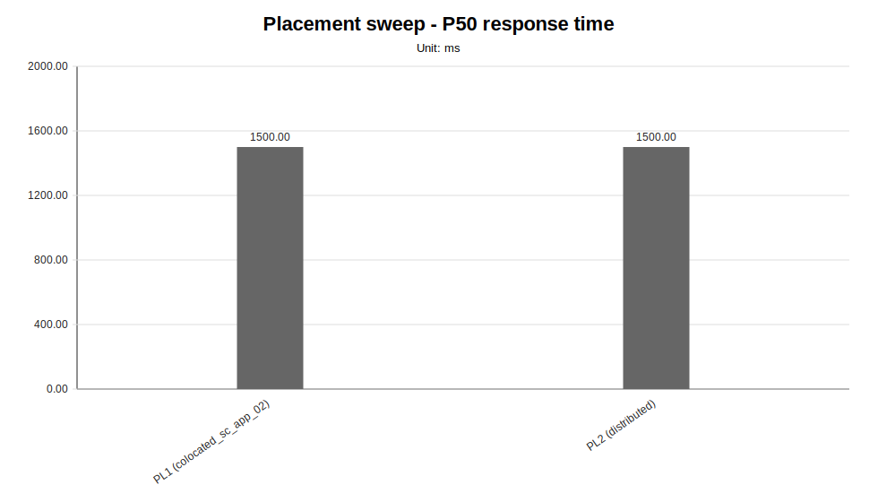

#### P95 response time

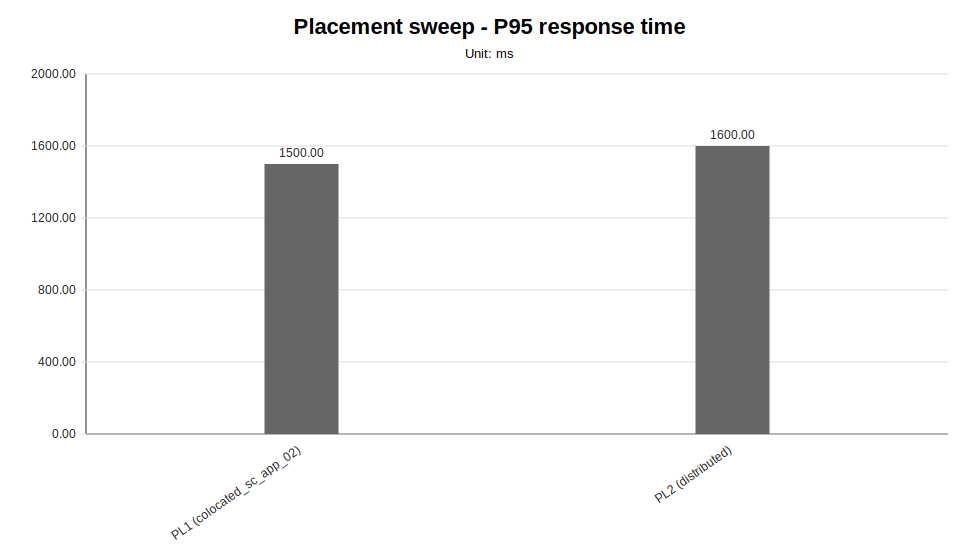

#### P99 response time

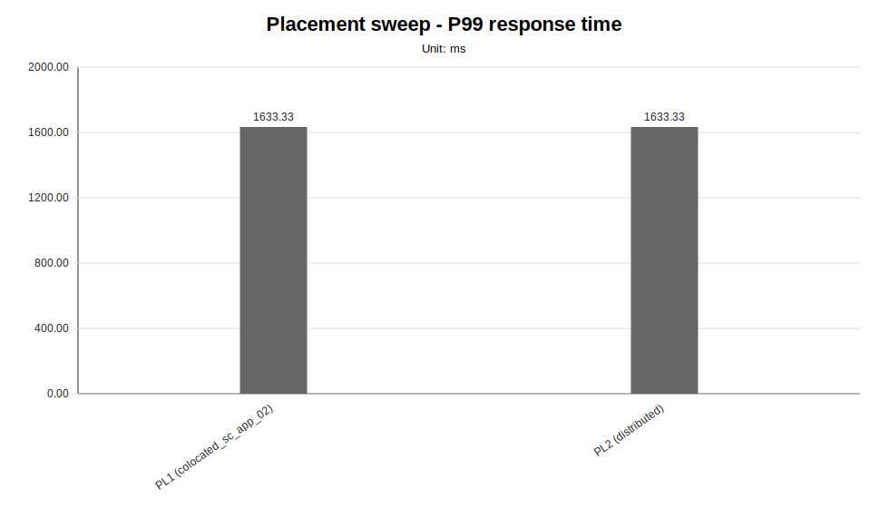

#### Throughput

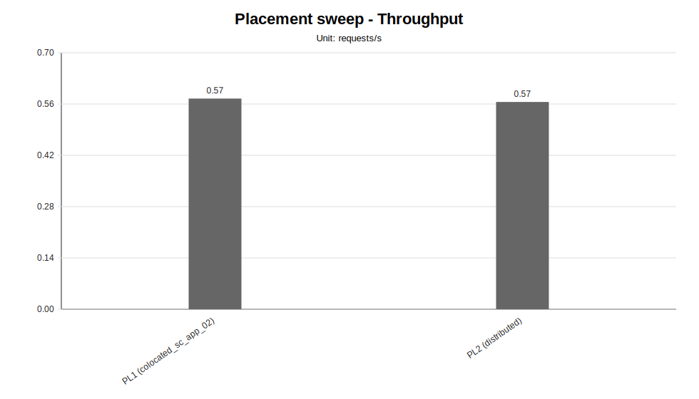

#### Maximum node CPU snapshot

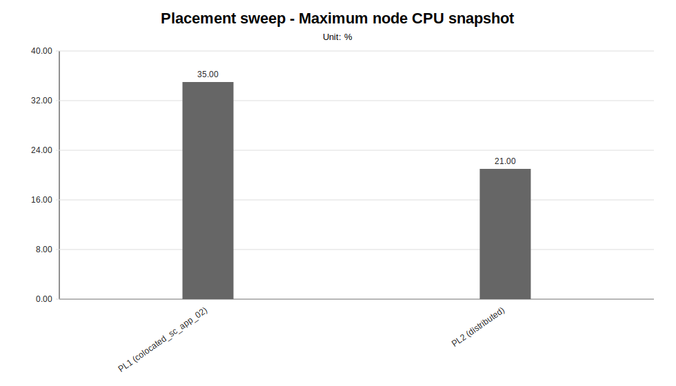

#### Maximum node memory snapshot

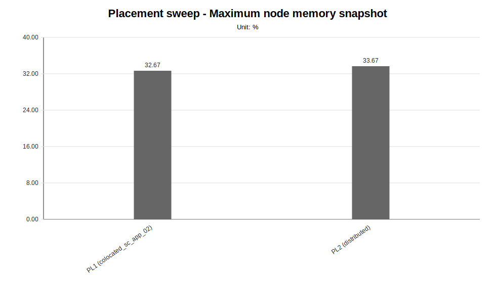

### Reading notes

- Measured scenarios: **2**.
- Unsupported scenarios under current constraints: **0**.
- Percentage deltas are computed against the family reference scenario; positive latency deltas indicate worse response time, while positive throughput deltas indicate higher request throughput.
- Unsupported scenarios are infrastructure/constraint observations and must not be interpreted as measured latency regressions.
- A `not_executed` sweep means that neither measurement CSV files nor unsupported-scenario evidence were found for any configured scenario in that family.

> Reporting is a static post-processing artifact: rerun the reporting launcher after producing new benchmark and diagnosis outputs.
> The current global report is written directly under results/reporting/ and managed artifacts are overwritten on each execution.
> Optional archiving can preserve either the newly generated report package or the already generated current report under results/reporting/archive/<reporting-id>/ without changing the stable current report path.
> Each benchmark family also receives a dedicated report under results/reporting/sweeps/<family>/.
> Quantitative charts are generated from measurement CSV files whenever available; technical diagnosis is used as contextual and interpretative evidence.
> Unsupported scenarios are reported explicitly and are not treated as measured performance regressions.
