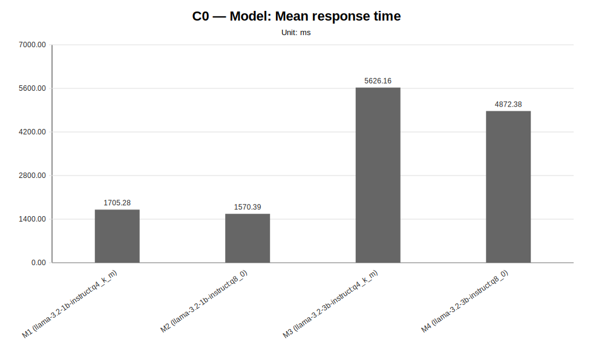
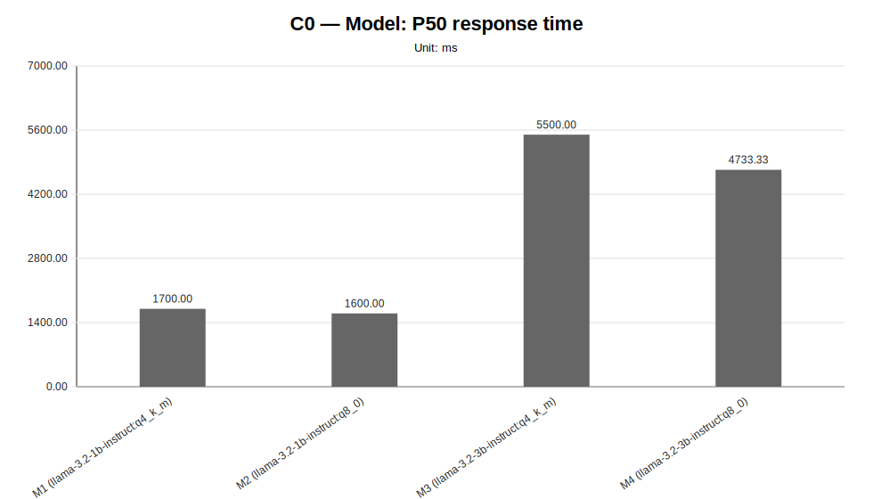
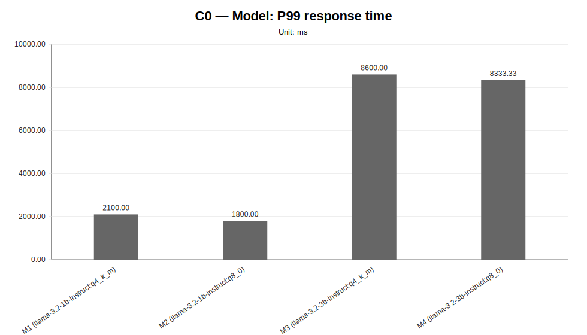
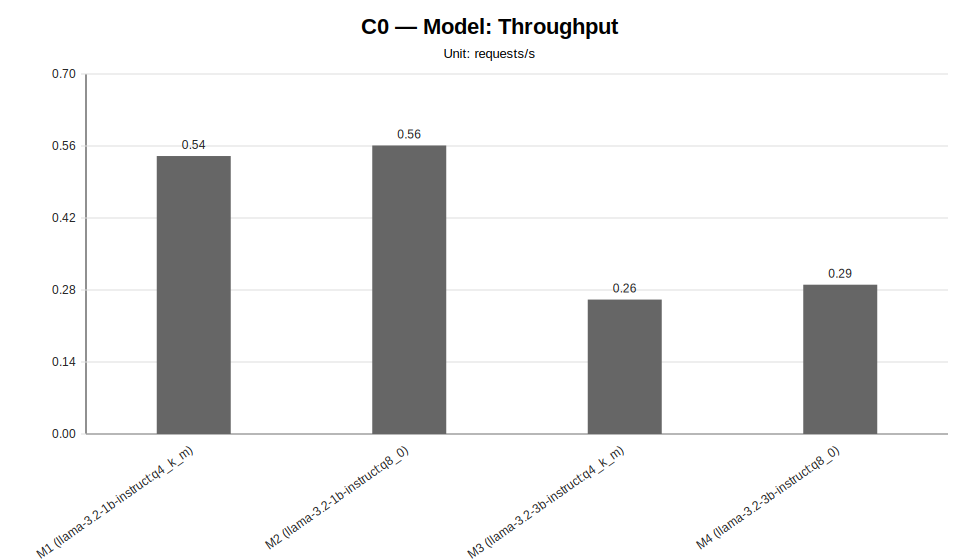
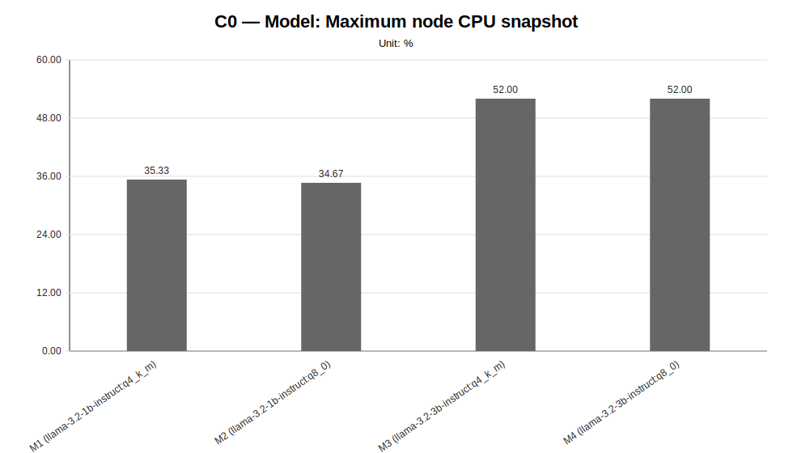
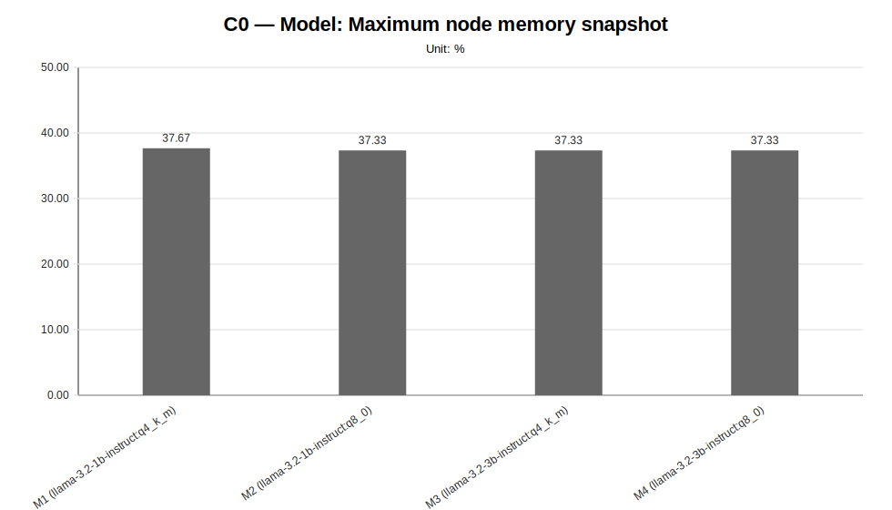
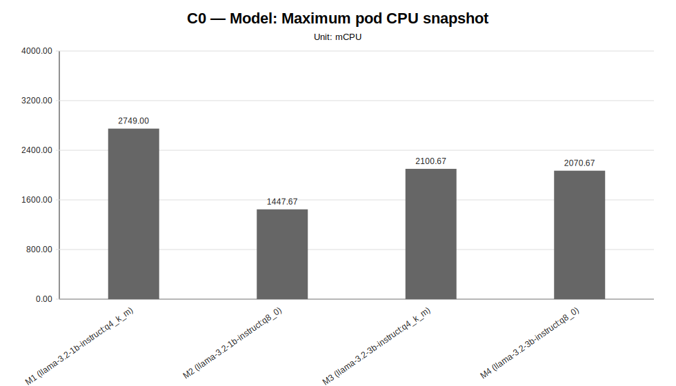
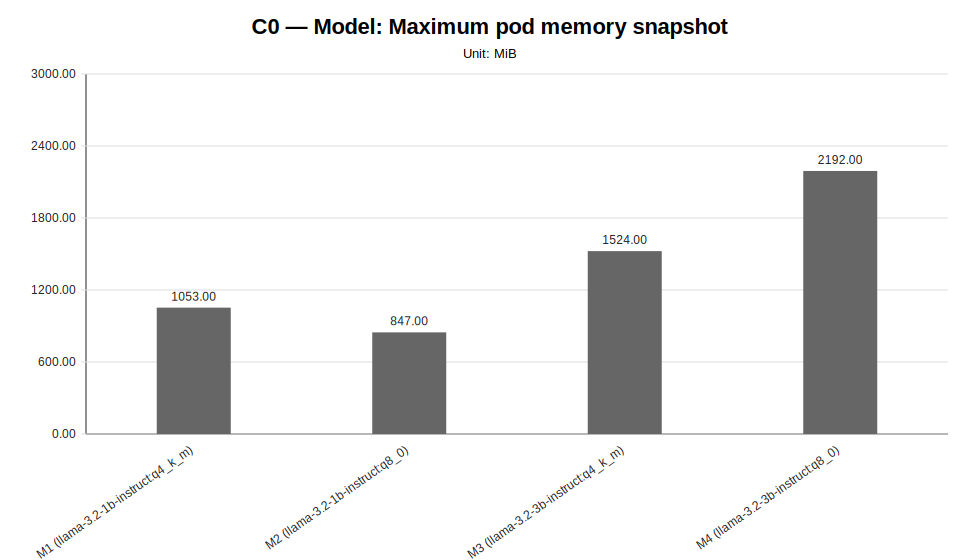

# C0 — Historical Fixed-Cluster Report

**Cycle ID:** `C0`
**Reporting Profile:** `RP_C0_HISTORICAL_FIXED_CLUSTER`
**Reporting ID:** `REP_C0_20260619T174611Z`
**Generated at UTC:** `2026-06-19T17:46:12Z`

## Purpose

This report provides a consolidated view of the historical fixed-cluster LocalAI worker-mode characterization evidence. It preserves the original benchmark families as reference evidence while the provider-backed pipeline evolves independently.

The report combines **measurement CSV data**, **cluster-capture evidence**, **scenario configuration metadata** and **technical diagnosis context** when those artifacts are available.

[Back to cycle report index](../../index.html)

## Cross-cycle baseline reference

The values below describe the global baseline configuration used as a cross-cycle reference. Scenario-specific and sweep-local sections report the effective infrastructure, placement, worker count and runtime configuration used by each scenario. Percentage deltas are computed against the family-local reference scenario when one is defined for the sweep.

| Dimension | Reference value |
|---|---|
| Baseline ID | B0 |
| Model | llama-3.2-1b-instruct:q4_k_m |
| Worker count | 2 |
| Placement | colocated_sc_app_02 |
| Workload | users=2, spawnRate=1, runTime=2m |
| Prompt | Reply with only READY. |
| Request timeout | 120 s |
| Infrastructure profile | INFRA_ORIGINAL_1CP_2W_8C16G |
| Placement profile | PL_COLOCATED |

## Family-local reference scenarios

The scenarios below are the sweep-local references used to interpret percentage deltas within each family. They may differ from the cross-cycle baseline when a campaign intentionally varies infrastructure, placement, latency or tenancy.

| Sweep | Reference scenario | Description | Status | Varied dimension |
|---|---|---|---|---|
| Worker-Count | `W2` | W2 (2 worker) | measured | number of LocalAI RPC workers |
| Workload | `WL2` | WL2 (2 users, spawn 1) | measured | synthetic client-side workload pattern |
| Model | `M1` | M1 (llama-3.2-1b-instruct:q4_k_m) | measured | model served by the LocalAI worker-mode cluster |
| Placement | `PL1` | PL1 (colocated_sc_app_02) | measured | Kubernetes placement strategy for LocalAI server and workers |

## Data sources

| Layer | Primary use | Source |
|---|---|---|
| Measurement CSV | Quantitative charts and scenario summary metrics | `{"worker-count": "results/experimental-cycles/C0/benchmark/pilot-consolidated/worker-count", "workload": "results/experimental-cycles/C0/benchmark/pilot-consolidated/workload", "models": "results/experimental-cycles/C0/benchmark/pilot-consolidated/models", "placement": "results/experimental-cycles/C0/benchmark/pilot-consolidated/placement"}` |
| Technical diagnosis | Interpretation, family judgments, findings, unsupported-scenario context | `results/experimental-cycles/C0/diagnosis/analysis_diagnosis_all_NA_20260619T174612Z_diagnosis.json` |
| Scenario configuration | Fixed/varied dimensions and scenario labels | `config/scenarios/**` |
| Cluster-side artifacts | CPU/memory snapshots, pod placement and event evidence | `cluster capture artifacts` |
| Reporting output | Current generated report package | `results/experimental-cycles/C0/reporting` |

## Historical Fixed-Cluster Context

This cycle preserves fixed-cluster benchmark evidence. Provider-specific sections are intentionally omitted because the cycle is not materialized through a provider-backed infrastructure profile.

| Field | Value |
|---|---|
| Cycle ID | C0 |
| Baseline ID | B0 |
| Reporting profile | RP_C0_HISTORICAL_FIXED_CLUSTER |
| Cycle role | historical fixed-cluster evidence |
| Benchmark families | Worker-Count, Workload, Model, Placement |
| Configured scenarios | 13 |
| Measured scenarios | 11 |
| Unsupported scenarios | 2 |
| Missing scenarios | 0 |
| Diagnosis profile | TD_C0_HISTORICAL_FIXED_CLUSTER |
| Diagnosis root | results/experimental-cycles/C0/diagnosis |
| Reporting output | results/experimental-cycles/C0/reporting |
| Request target | POST /v1/chat/completions |

## Historical Evidence Scope

The report keeps the historical benchmark families readable and comparable while avoiding provider-oriented fields that do not apply to this cycle.

## Sweep-specific reports

The global report below provides the stakeholder-facing overview. Each sweep also has a dedicated report for focused inspection of one varied dimension.

| Sweep | Dedicated HTML report | Execution status | Coverage | Varied dimension |
|---|---|---|---|---|
| Worker-Count | [worker-count](sweeps/worker-count/index.html) | partially_measured | measured=2, unsupported=2, missing=0 | number of LocalAI RPC workers |
| Workload | [workload](sweeps/workload/index.html) | fully_measured | measured=3, unsupported=0, missing=0 | synthetic client-side workload pattern |
| Model | [models](sweeps/models/index.html) | fully_measured | measured=4, unsupported=0, missing=0 | model served by the LocalAI worker-mode cluster |
| Placement | [placement](sweeps/placement/index.html) | fully_measured | measured=2, unsupported=0, missing=0 | Kubernetes placement strategy for LocalAI server and workers |

## Diagnosis coverage snapshot

| Family | Scenarios | Observed | Measured | Unsupported | Samples |
|---|---|---|---|---|---|
| worker-count | 4 | 4 | 2 | 2 | 6 |
| workload | 3 | 3 | 3 | 0 | 9 |
| models | 4 | 4 | 4 | 0 | 12 |
| placement | 2 | 2 | 2 | 0 | 6 |

## Worker-Count

**Execution status:** `partially_measured`

**Execution note:** At least one configured scenario has measured benchmark samples, while other scenarios are missing or unsupported.

**Varied dimension:** number of LocalAI RPC workers

**Fixed dimensions:** baseline model, baseline workload, baseline placement, baseline protocol.

**Reference scenario within the sweep:** `W2`

| Scenario count | Measured | Unsupported | Missing |
|---|---|---|---|
| 4 | 2 | 2 | 0 |

### Controlled scenario parameters

This table is derived from resolved scenario metadata. A parameter is marked as controlled only when it has the same effective value across all scenarios in the sweep.

| Parameter | Resolved value | Interpretation |
|---|---|---|
| Model | llama-3.2-1b-instruct:q4_k_m | controlled |
| Worker count | varies across scenarios (4 values) | varied or scenario-specific |
| Placement | colocated_sc_app_02 | controlled |
| Workload | users=2, spawnRate=1, runTime=2m | controlled |
| Topology | varies across scenarios (4 values) | varied or scenario-specific |
| Server manifest | infra/k8s/compositions/server/models/m1 | controlled |
| Prompt | Reply with only READY. | controlled |
| Temperature | 0.1 | controlled |
| Request timeout (s) | 120 | controlled |

### Scenario parameter matrix

| Scenario | Status | Varied value (number of LocalAI RPC workers) | Model | Worker count | Placement | Workload | Timeout (s) |
|---|---|---|---|---|---|---|---|
| `W1` | measured | 1 | llama-3.2-1b-instruct:q4_k_m | 1 | colocated_sc_app_02 | users=2, spawnRate=1, runTime=2m | 120 |
| `W2` | measured | 2 | llama-3.2-1b-instruct:q4_k_m | 2 | colocated_sc_app_02 | users=2, spawnRate=1, runTime=2m | 120 |
| `W3` | unsupported_under_current_constraints | 3 | llama-3.2-1b-instruct:q4_k_m | 3 | colocated_sc_app_02 | users=2, spawnRate=1, runTime=2m | 120 |
| `W4` | unsupported_under_current_constraints | 4 | llama-3.2-1b-instruct:q4_k_m | 4 | colocated_sc_app_02 | users=2, spawnRate=1, runTime=2m | 120 |

### Measurement summary

This compact table reports the core indicators used to read the sweep at a glance. Detailed percentiles, deltas and resource snapshots are reported in the following extended table.

| Scenario | Description | Status | Sample count | Mean response time (ms) | P95 response time (ms) | Throughput (requests/s) | Unsupported evidence |
|---|---|---|---|---|---|---|---|
| `W1` | W1 (1 worker) | measured | 3 | 1708.96 | 1800.00 | 0.5397 |  |
| `W2` | W2 (2 worker) | measured | 3 | 1704.00 | 1800.00 | 0.5406 |  |
| `W3` | W3 (3 worker) | unsupported_under_current_constraints | 0 | n/a | n/a | n/a | failed_scheduling, insufficient_cpu, insufficient_memory, latency_injection, no_preemption_victims_found, node_affinity_selector_mismatch, pending_pod, preemption_not_helpful |
| `W4` | W4 (4 worker) | unsupported_under_current_constraints | 0 | n/a | n/a | n/a | failed_scheduling, insufficient_cpu, insufficient_memory, latency_injection, no_preemption_victims_found, node_affinity_selector_mismatch, pending_pod, preemption_not_helpful |

### Extended measurement metrics

This secondary table keeps the additional metrics aligned with the technical diagnosis while avoiding an excessively wide primary summary table.

| Scenario | P50 response time (ms) | P99 response time (ms) | Mean response time delta (%) | P95 response time delta (%) | Throughput delta (%) | Max node CPU snapshot (%) | Max node memory snapshot (%) | Max pod CPU snapshot (mCPU) | Max pod memory snapshot (MiB) |
|---|---|---|---|---|---|---|---|---|---|
| `W1` | 1700.00 | 2133.33 | 0.29 | 0.00 | -0.17 | 35.00 | 38.67 | 2708.00 | 1053.00 |
| `W2` | 1700.00 | 2100.00 | 0.00 | 0.00 | 0.00 | 37.00 | 37.33 | 2720.67 | 1053.00 |
| `W3` | n/a | n/a | n/a | n/a | n/a | n/a | n/a | n/a | n/a |
| `W4` | n/a | n/a | n/a | n/a | n/a | n/a | n/a | n/a | n/a |

### Diagnosis-based reading

- **In the initial comparison between measured configurations, worker count does not produce a strong enough improvement.** (status: `weak_signal`, confidence: `low`).
  - Implication: The transition from W1 to W2 was observed, but the mean-latency benefit remains below the configured diagnostic threshold; additional unsupported scenarios also limit assessment beyond the measured scope.

### Charts

#### Mean response time

#### P50 response time

#### P95 response time

#### P99 response time

#### Throughput

#### Maximum node CPU snapshot

#### Maximum node memory snapshot

#### Maximum pod CPU snapshot

#### Maximum pod memory snapshot

### Reading notes

- Measured scenarios: **2**.
- Unsupported scenarios under current constraints: **2**.
- Percentage deltas are computed against the family reference scenario; positive latency deltas indicate worse response time, while positive throughput deltas indicate higher request throughput.
- Unsupported scenarios are infrastructure/constraint observations and must not be interpreted as measured latency regressions.
- A `not_executed` sweep means that neither measurement CSV files nor unsupported-scenario evidence were found for any configured scenario in that family.

## Workload

**Execution status:** `fully_measured`

**Execution note:** All configured scenarios in this sweep have measured benchmark samples.

**Varied dimension:** synthetic client-side workload pattern

**Fixed dimensions:** baseline model, baseline worker count, baseline placement, baseline protocol.

**Reference scenario within the sweep:** `WL2`

| Scenario count | Measured | Unsupported | Missing |
|---|---|---|---|
| 3 | 3 | 0 | 0 |

### Controlled scenario parameters

This table is derived from resolved scenario metadata. A parameter is marked as controlled only when it has the same effective value across all scenarios in the sweep.

| Parameter | Resolved value | Interpretation |
|---|---|---|
| Model | llama-3.2-1b-instruct:q4_k_m | controlled |
| Worker count | 2 | controlled |
| Placement | colocated_sc_app_02 | controlled |
| Workload | varies across scenarios (3 values) | varied or scenario-specific |
| Topology | infra/k8s/compositions/topology/colocated-sc-app-02-w2 | controlled |
| Server manifest | infra/k8s/compositions/server/models/m1 | controlled |
| Prompt | Reply with only READY. | controlled |
| Temperature | 0.1 | controlled |
| Request timeout (s) | 120 | controlled |

### Scenario parameter matrix

| Scenario | Status | Varied value (synthetic client-side workload pattern) | Model | Worker count | Placement | Workload | Timeout (s) |
|---|---|---|---|---|---|---|---|
| `WL1` | measured | users=1, spawnRate=1, runTime=2m | llama-3.2-1b-instruct:q4_k_m | 2 | colocated_sc_app_02 | users=1, spawnRate=1, runTime=2m | 120 |
| `WL2` | measured | users=2, spawnRate=1, runTime=2m | llama-3.2-1b-instruct:q4_k_m | 2 | colocated_sc_app_02 | users=2, spawnRate=1, runTime=2m | 120 |
| `WL3` | measured | users=4, spawnRate=2, runTime=2m | llama-3.2-1b-instruct:q4_k_m | 2 | colocated_sc_app_02 | users=4, spawnRate=2, runTime=2m | 120 |

### Measurement summary

This compact table reports the core indicators used to read the sweep at a glance. Detailed percentiles, deltas and resource snapshots are reported in the following extended table.

| Scenario | Description | Status | Sample count | Mean response time (ms) | P95 response time (ms) | Throughput (requests/s) | Unsupported evidence |
|---|---|---|---|---|---|---|---|
| `WL1` | WL1 (1 users, spawn 1) | measured | 3 | 1589.17 | 1666.67 | 0.2812 |  |
| `WL2` | WL2 (2 users, spawn 1) | measured | 3 | 1701.29 | 1800.00 | 0.5408 |  |
| `WL3` | WL3 (4 users, spawn 2) | measured | 3 | 3311.63 | 3500.00 | 0.7499 |  |

### Extended measurement metrics

This secondary table keeps the additional metrics aligned with the technical diagnosis while avoiding an excessively wide primary summary table.

| Scenario | P50 response time (ms) | P99 response time (ms) | Mean response time delta (%) | P95 response time delta (%) | Throughput delta (%) | Max node CPU snapshot (%) | Max node memory snapshot (%) | Max pod CPU snapshot (mCPU) | Max pod memory snapshot (MiB) |
|---|---|---|---|---|---|---|---|---|---|
| `WL1` | 1600.00 | 1766.67 | -6.59 | -7.41 | -48.00 | 17.33 | 37.00 | 1323.67 | 1053.00 |
| `WL2` | 1700.00 | 2000.00 | 0.00 | 0.00 | 0.00 | 36.67 | 37.33 | 2636.33 | 1053.00 |
| `WL3` | 3300.00 | 4200.00 | 94.65 | 94.44 | 38.66 | 54.67 | 38.67 | 3985.00 | 1053.00 |

### Diagnosis-based reading

- **The workload family shows a clear performance degradation signal as load increases.** (status: `strong_signal`, confidence: `medium`).
  - Implication: In the current cluster, workload is a relevant latency driver and suggests a clearer fragility threshold in the more demanding configurations.
- **The heavier workload substantially increases latency, suggesting possible system saturation.** (confidence: `medium`).
  - Implication: The cluster appears more fragile as concurrency increases; higher load alone does not necessarily translate into a proportional increase in useful throughput.

### Charts

#### Mean response time

#### P50 response time

#### P95 response time

#### P99 response time

#### Throughput

#### Maximum node CPU snapshot

#### Maximum node memory snapshot

#### Maximum pod CPU snapshot

#### Maximum pod memory snapshot

### Reading notes

- Measured scenarios: **3**.
- Unsupported scenarios under current constraints: **0**.
- Percentage deltas are computed against the family reference scenario; positive latency deltas indicate worse response time, while positive throughput deltas indicate higher request throughput.
- Unsupported scenarios are infrastructure/constraint observations and must not be interpreted as measured latency regressions.
- A `not_executed` sweep means that neither measurement CSV files nor unsupported-scenario evidence were found for any configured scenario in that family.

## Model

**Execution status:** `fully_measured`

**Execution note:** All configured scenarios in this sweep have measured benchmark samples.

**Varied dimension:** model served by the LocalAI worker-mode cluster

**Fixed dimensions:** baseline worker count, baseline workload, baseline placement, baseline protocol.

**Reference scenario within the sweep:** `M1`

| Scenario count | Measured | Unsupported | Missing |
|---|---|---|---|
| 4 | 4 | 0 | 0 |

### Controlled scenario parameters

This table is derived from resolved scenario metadata. A parameter is marked as controlled only when it has the same effective value across all scenarios in the sweep.

| Parameter | Resolved value | Interpretation |
|---|---|---|
| Model | varies across scenarios (4 values) | varied or scenario-specific |
| Worker count | 2 | controlled |
| Placement | colocated_sc_app_02 | controlled |
| Workload | users=2, spawnRate=1, runTime=2m | controlled |
| Topology | infra/k8s/compositions/topology/colocated-sc-app-02-w2 | controlled |
| Server manifest | varies across scenarios (4 values) | varied or scenario-specific |
| Prompt | Reply with only READY. | controlled |
| Temperature | 0.1 | controlled |
| Request timeout (s) | 120 | controlled |

### Scenario parameter matrix

| Scenario | Status | Varied value (model served by the LocalAI worker-mode cluster) | Model | Worker count | Placement | Workload | Timeout (s) |
|---|---|---|---|---|---|---|---|
| `M1` | measured | llama-3.2-1b-instruct:q4_k_m | llama-3.2-1b-instruct:q4_k_m | 2 | colocated_sc_app_02 | users=2, spawnRate=1, runTime=2m | 120 |
| `M2` | measured | llama-3.2-1b-instruct:q8_0 | llama-3.2-1b-instruct:q8_0 | 2 | colocated_sc_app_02 | users=2, spawnRate=1, runTime=2m | 120 |
| `M3` | measured | llama-3.2-3b-instruct:q4_k_m | llama-3.2-3b-instruct:q4_k_m | 2 | colocated_sc_app_02 | users=2, spawnRate=1, runTime=2m | 120 |
| `M4` | measured | llama-3.2-3b-instruct:q8_0 | llama-3.2-3b-instruct:q8_0 | 2 | colocated_sc_app_02 | users=2, spawnRate=1, runTime=2m | 120 |

### Measurement summary

This compact table reports the core indicators used to read the sweep at a glance. Detailed percentiles, deltas and resource snapshots are reported in the following extended table.

| Scenario | Description | Status | Sample count | Mean response time (ms) | P95 response time (ms) | Throughput (requests/s) | Unsupported evidence |
|---|---|---|---|---|---|---|---|
| `M1` | M1 (llama-3.2-1b-instruct:q4_k_m) | measured | 3 | 1705.28 | 1766.67 | 0.5405 |  |
| `M2` | M2 (llama-3.2-1b-instruct:q8_0) | measured | 3 | 1570.39 | 1633.33 | 0.5610 |  |
| `M3` | M3 (llama-3.2-3b-instruct:q4_k_m) | measured | 3 | 5626.16 | 5766.67 | 0.2614 |  |
| `M4` | M4 (llama-3.2-3b-instruct:q8_0) | measured | 3 | 4872.38 | 5000.00 | 0.2903 |  |

### Extended measurement metrics

This secondary table keeps the additional metrics aligned with the technical diagnosis while avoiding an excessively wide primary summary table.

| Scenario | P50 response time (ms) | P99 response time (ms) | Mean response time delta (%) | P95 response time delta (%) | Throughput delta (%) | Max node CPU snapshot (%) | Max node memory snapshot (%) | Max pod CPU snapshot (mCPU) | Max pod memory snapshot (MiB) |
|---|---|---|---|---|---|---|---|---|---|
| `M1` | 1700.00 | 2100.00 | 0.00 | 0.00 | 0.00 | 35.33 | 37.67 | 2749.00 | 1053.00 |
| `M2` | 1600.00 | 1800.00 | -7.91 | -7.55 | 3.79 | 34.67 | 37.33 | 1447.67 | 847.00 |
| `M3` | 5500.00 | 8600.00 | 229.93 | 226.42 | -51.64 | 52.00 | 37.33 | 2100.67 | 1524.00 |
| `M4` | 4733.33 | 8333.33 | 185.72 | 183.02 | -46.29 | 52.00 | 37.33 | 2070.67 | 2192.00 |

### Diagnosis-based reading

- **The models family shows a clear and dominant size penalty on mean latency.** (status: `strong_signal`, confidence: `high`).
  - Implication: In the current cluster, model selection strongly affects service behavior and represents one of the main drivers of observed performance.
- **Model size emerges as a dominant driver of mean latency.** (confidence: `high`).
  - Implication: In the current CPU-only cluster, moving to larger models appears to matter much more than fine-grained topology variation or light workload changes.

### Charts

#### Mean response time

#### P50 response time

#### P95 response time

#### P99 response time

#### Throughput

#### Maximum node CPU snapshot

#### Maximum node memory snapshot

#### Maximum pod CPU snapshot

#### Maximum pod memory snapshot

### Reading notes

- Measured scenarios: **4**.
- Unsupported scenarios under current constraints: **0**.
- Percentage deltas are computed against the family reference scenario; positive latency deltas indicate worse response time, while positive throughput deltas indicate higher request throughput.
- Unsupported scenarios are infrastructure/constraint observations and must not be interpreted as measured latency regressions.
- A `not_executed` sweep means that neither measurement CSV files nor unsupported-scenario evidence were found for any configured scenario in that family.

## Placement

**Execution status:** `fully_measured`

**Execution note:** All configured scenarios in this sweep have measured benchmark samples.

**Varied dimension:** Kubernetes placement strategy for LocalAI server and workers

**Fixed dimensions:** baseline model, baseline worker count, baseline workload, baseline protocol.

**Reference scenario within the sweep:** `PL1`

| Scenario count | Measured | Unsupported | Missing |
|---|---|---|---|
| 2 | 2 | 0 | 0 |

### Controlled scenario parameters

This table is derived from resolved scenario metadata. A parameter is marked as controlled only when it has the same effective value across all scenarios in the sweep.

| Parameter | Resolved value | Interpretation |
|---|---|---|
| Model | llama-3.2-1b-instruct:q4_k_m | controlled |
| Worker count | 2 | controlled |
| Placement | varies across scenarios (2 values) | varied or scenario-specific |
| Workload | users=2, spawnRate=1, runTime=2m | controlled |
| Topology | varies across scenarios (2 values) | varied or scenario-specific |
| Server manifest | infra/k8s/compositions/server/models/m1 | controlled |
| Prompt | Reply with only READY. | controlled |
| Temperature | 0.1 | controlled |
| Request timeout (s) | 120 | controlled |

### Scenario parameter matrix

| Scenario | Status | Varied value (Kubernetes placement strategy for LocalAI server and workers) | Model | Worker count | Placement | Workload | Timeout (s) |
|---|---|---|---|---|---|---|---|
| `PL1` | measured | colocated_sc_app_02 | llama-3.2-1b-instruct:q4_k_m | 2 | colocated_sc_app_02 | users=2, spawnRate=1, runTime=2m | 120 |
| `PL2` | measured | distributed | llama-3.2-1b-instruct:q4_k_m | 2 | distributed | users=2, spawnRate=1, runTime=2m | 120 |

### Measurement summary

This compact table reports the core indicators used to read the sweep at a glance. Detailed percentiles, deltas and resource snapshots are reported in the following extended table.

| Scenario | Description | Status | Sample count | Mean response time (ms) | P95 response time (ms) | Throughput (requests/s) | Unsupported evidence |
|---|---|---|---|---|---|---|---|
| `PL1` | PL1 (colocated_sc_app_02) | measured | 3 | 1718.21 | 1800.00 | 0.5386 |  |
| `PL2` | PL2 (distributed) | measured | 3 | 1718.58 | 1800.00 | 0.5384 |  |

### Extended measurement metrics

This secondary table keeps the additional metrics aligned with the technical diagnosis while avoiding an excessively wide primary summary table.

| Scenario | P50 response time (ms) | P99 response time (ms) | Mean response time delta (%) | P95 response time delta (%) | Throughput delta (%) | Max node CPU snapshot (%) | Max node memory snapshot (%) | Max pod CPU snapshot (mCPU) | Max pod memory snapshot (MiB) |
|---|---|---|---|---|---|---|---|---|---|
| `PL1` | 1700.00 | 2100.00 | 0.00 | 0.00 | 0.00 | 36.67 | 39.00 | 1577.00 | 606.00 |
| `PL2` | 1700.00 | 2133.33 | 0.02 | 0.00 | -0.04 | 21.33 | 38.67 | 1577.33 | 606.00 |

### Diagnosis-based reading

- **Within the observed scope, the placement family does not yet show a strong enough effect to be considered dominant.** (status: `weak_signal`, confidence: `low`).
  - Implication: Placement configurations were compared against the historical co-located placement resolved to the canonical PL_COLOCATED placement profile, but the latency difference remains below the configured diagnostic threshold; in the current cluster, placement does not yet emerge as the primary performance driver.

### Charts

#### Mean response time

#### P50 response time

#### P95 response time

#### P99 response time

#### Throughput

#### Maximum node CPU snapshot

#### Maximum node memory snapshot

#### Maximum pod CPU snapshot

#### Maximum pod memory snapshot

### Reading notes

- Measured scenarios: **2**.
- Unsupported scenarios under current constraints: **0**.
- Percentage deltas are computed against the family reference scenario; positive latency deltas indicate worse response time, while positive throughput deltas indicate higher request throughput.
- Unsupported scenarios are infrastructure/constraint observations and must not be interpreted as measured latency regressions.
- A `not_executed` sweep means that neither measurement CSV files nor unsupported-scenario evidence were found for any configured scenario in that family.

> Reporting is a static post-processing artifact: rerun the reporting launcher after producing new benchmark and diagnosis outputs.
> The current global report is written directly under results/experimental-cycles/C0/reporting/ and managed artifacts are overwritten on each execution.
> Optional archiving can preserve either the newly generated report package or the already generated current report under results/experimental-cycles/C0/reporting/archive/<reporting-id>/ without changing the stable current report path.
> Each benchmark family also receives a dedicated report under results/experimental-cycles/C0/reporting/sweeps/<family>/.
> Quantitative charts are generated from measurement CSV files whenever available; technical diagnosis is used as contextual and interpretative evidence.
> Unsupported scenarios are reported explicitly and are not treated as measured performance regressions.
