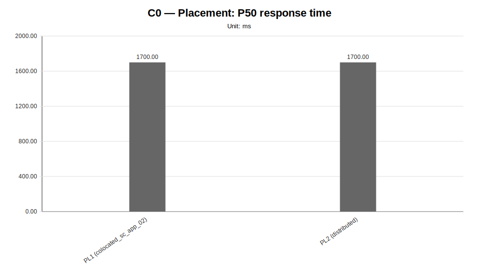
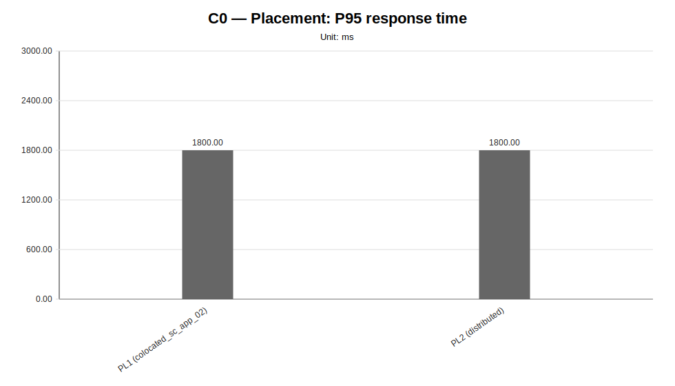
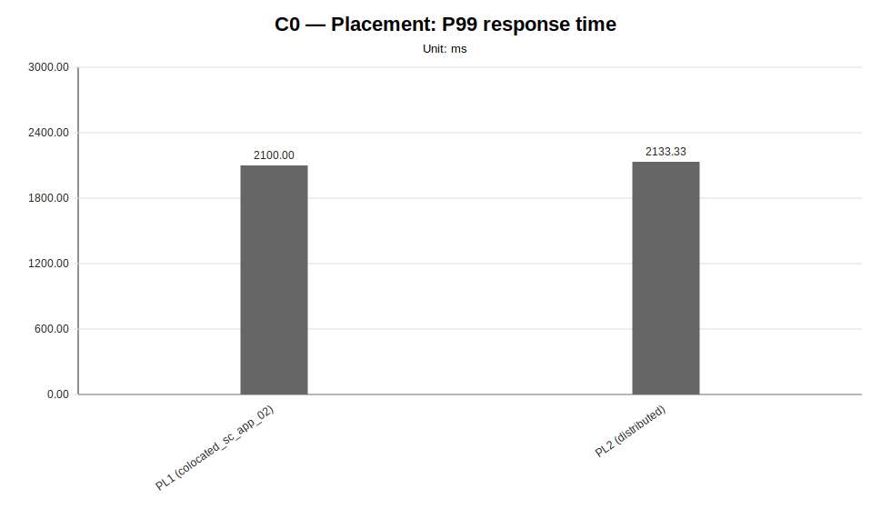
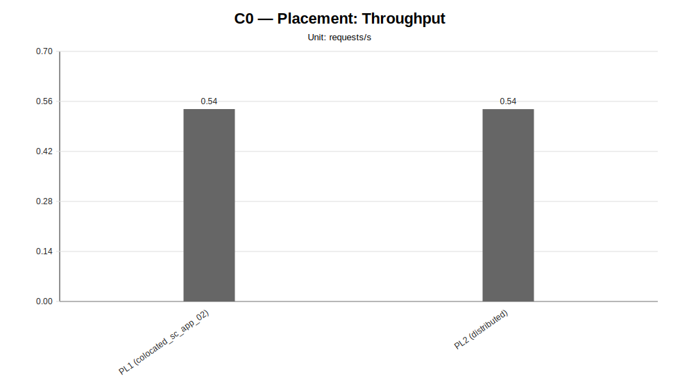
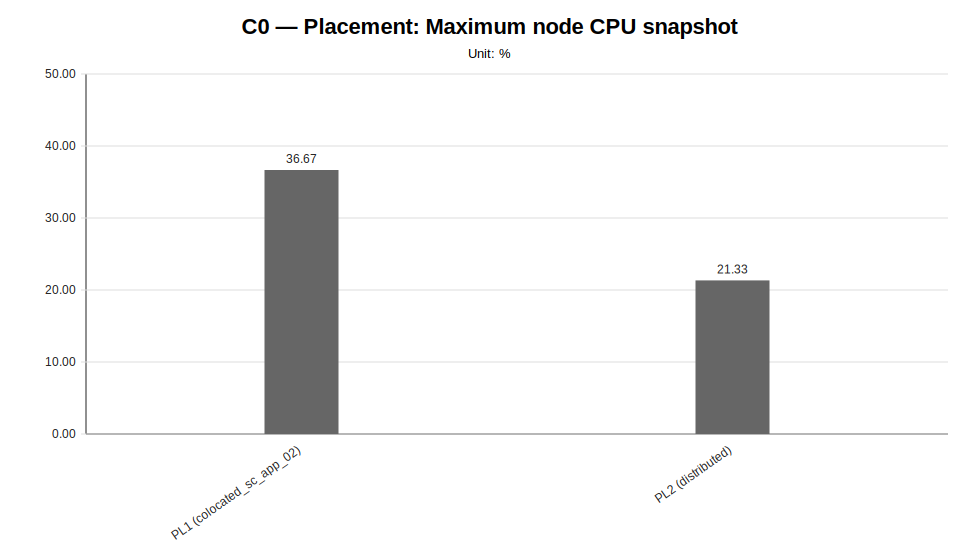
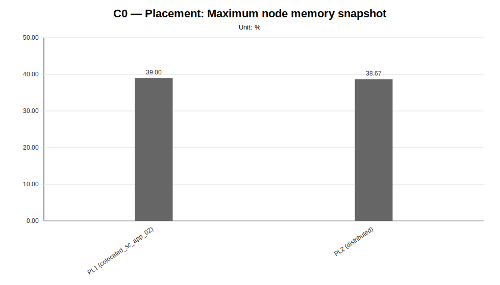
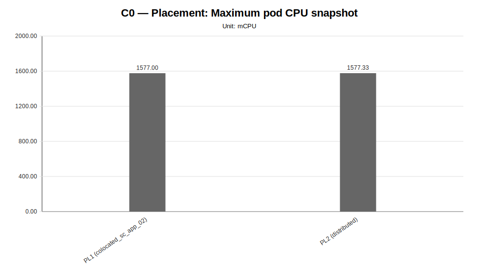
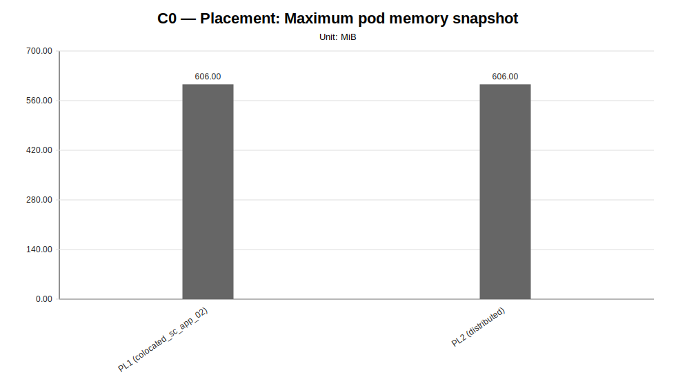

# C0 — Placement Sweep Report

**Cycle ID:** `C0`
**Sweep:** `placement`
**Reporting Profile:** `RP_C0_HISTORICAL_FIXED_CLUSTER`
**Reporting ID:** `REP_C0_20260619T174611Z`
**Generated at UTC:** `2026-06-19T17:46:12Z`

[Back to cycle report](../../index.html)

## Scope

This sweep-specific report isolates **Placement** so that the varied dimension, fixed dimensions, measured values, unsupported evidence and diagnosis-based reading can be inspected without navigating the full consolidated report.

## Placement

**Execution status:** `fully_measured`

**Execution note:** All configured scenarios in this sweep have measured benchmark samples.

**Varied dimension:** Kubernetes placement strategy for LocalAI server and workers

**Fixed dimensions:** baseline model, baseline worker count, baseline workload, baseline protocol.

**Reference scenario within the sweep:** `PL1`

| Scenario count | Measured | Unsupported | Missing |
|---|---|---|---|
| 2 | 2 | 0 | 0 |

### Controlled scenario parameters

This table is derived from resolved scenario metadata. A parameter is marked as controlled only when it has the same effective value across all scenarios in the sweep.

| Parameter | Resolved value | Interpretation |
|---|---|---|
| Model | llama-3.2-1b-instruct:q4_k_m | controlled |
| Worker count | 2 | controlled |
| Placement | varies across scenarios (2 values) | varied or scenario-specific |
| Workload | users=2, spawnRate=1, runTime=2m | controlled |
| Topology | varies across scenarios (2 values) | varied or scenario-specific |
| Server manifest | infra/k8s/compositions/server/models/m1 | controlled |
| Prompt | Reply with only READY. | controlled |
| Temperature | 0.1 | controlled |
| Request timeout (s) | 120 | controlled |

### Scenario parameter matrix

| Scenario | Status | Varied value (Kubernetes placement strategy for LocalAI server and workers) | Model | Worker count | Placement | Workload | Timeout (s) |
|---|---|---|---|---|---|---|---|
| `PL1` | measured | colocated_sc_app_02 | llama-3.2-1b-instruct:q4_k_m | 2 | colocated_sc_app_02 | users=2, spawnRate=1, runTime=2m | 120 |
| `PL2` | measured | distributed | llama-3.2-1b-instruct:q4_k_m | 2 | distributed | users=2, spawnRate=1, runTime=2m | 120 |

### Measurement summary

This compact table reports the core indicators used to read the sweep at a glance. Detailed percentiles, deltas and resource snapshots are reported in the following extended table.

| Scenario | Description | Status | Sample count | Mean response time (ms) | P95 response time (ms) | Throughput (requests/s) | Unsupported evidence |
|---|---|---|---|---|---|---|---|
| `PL1` | PL1 (colocated_sc_app_02) | measured | 3 | 1718.21 | 1800.00 | 0.5386 |  |
| `PL2` | PL2 (distributed) | measured | 3 | 1718.58 | 1800.00 | 0.5384 |  |

### Extended measurement metrics

This secondary table keeps the additional metrics aligned with the technical diagnosis while avoiding an excessively wide primary summary table.

| Scenario | P50 response time (ms) | P99 response time (ms) | Mean response time delta (%) | P95 response time delta (%) | Throughput delta (%) | Max node CPU snapshot (%) | Max node memory snapshot (%) | Max pod CPU snapshot (mCPU) | Max pod memory snapshot (MiB) |
|---|---|---|---|---|---|---|---|---|---|
| `PL1` | 1700.00 | 2100.00 | 0.00 | 0.00 | 0.00 | 36.67 | 39.00 | 1577.00 | 606.00 |
| `PL2` | 1700.00 | 2133.33 | 0.02 | 0.00 | -0.04 | 21.33 | 38.67 | 1577.33 | 606.00 |

### Diagnosis-based reading

- **Within the observed scope, the placement family does not yet show a strong enough effect to be considered dominant.** (status: `weak_signal`, confidence: `low`).
  - Implication: Placement configurations were compared against the historical co-located placement resolved to the canonical PL_COLOCATED placement profile, but the latency difference remains below the configured diagnostic threshold; in the current cluster, placement does not yet emerge as the primary performance driver.

### Charts

#### Mean response time

#### P50 response time

#### P95 response time

#### P99 response time

#### Throughput

#### Maximum node CPU snapshot

#### Maximum node memory snapshot

#### Maximum pod CPU snapshot

#### Maximum pod memory snapshot

### Reading notes

- Measured scenarios: **2**.
- Unsupported scenarios under current constraints: **0**.
- Percentage deltas are computed against the family reference scenario; positive latency deltas indicate worse response time, while positive throughput deltas indicate higher request throughput.
- Unsupported scenarios are infrastructure/constraint observations and must not be interpreted as measured latency regressions.
- A `not_executed` sweep means that neither measurement CSV files nor unsupported-scenario evidence were found for any configured scenario in that family.
