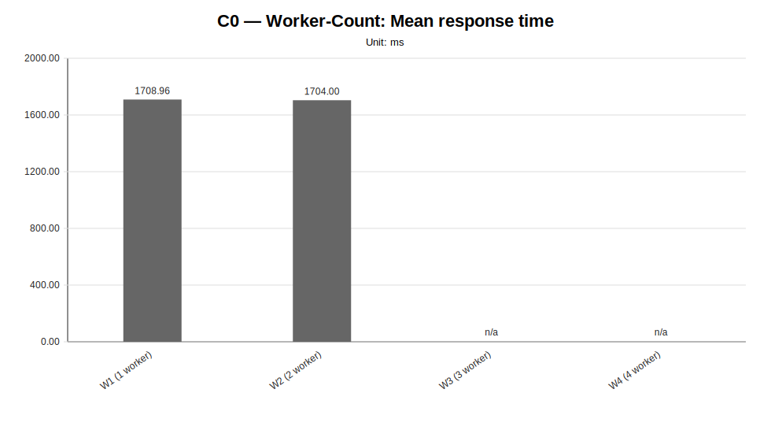
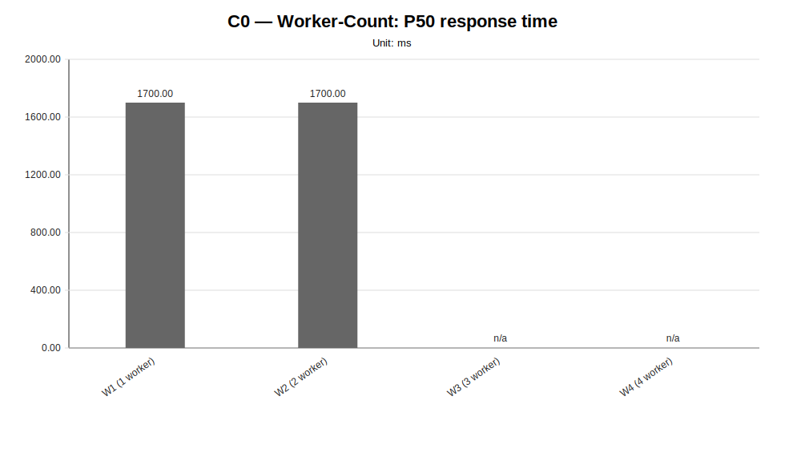
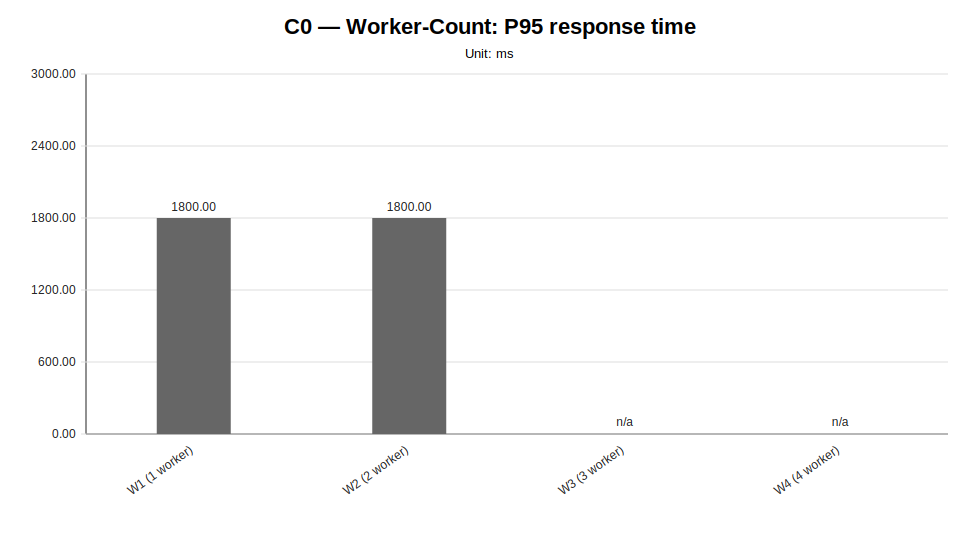
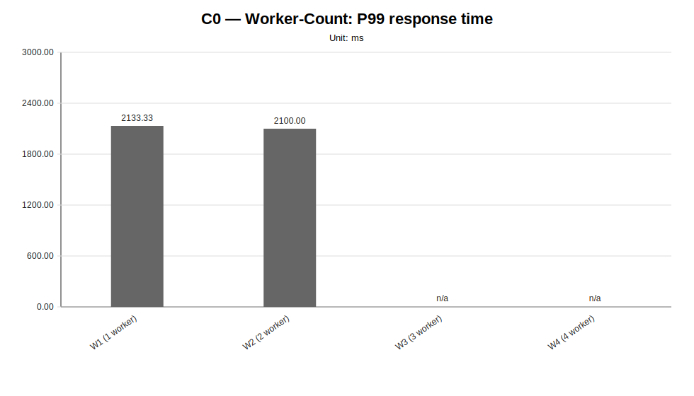
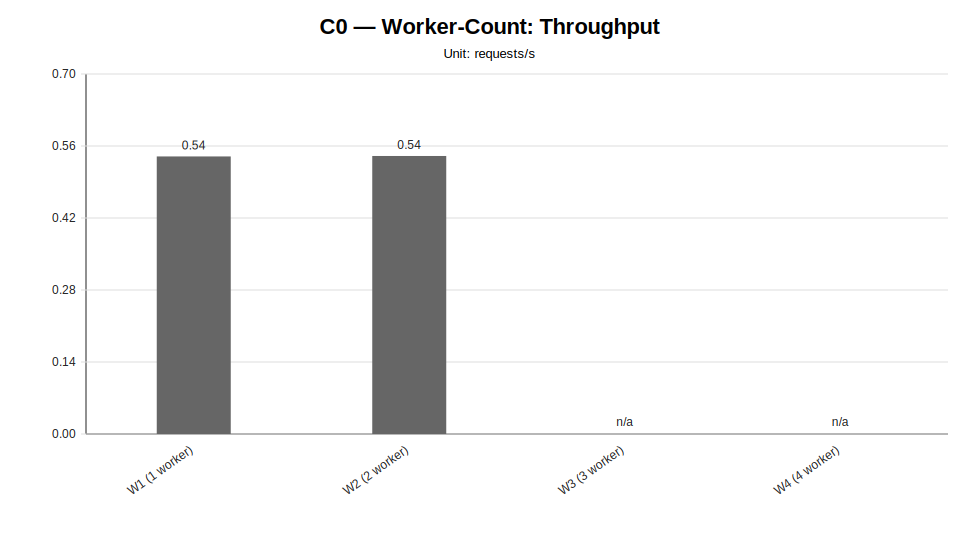
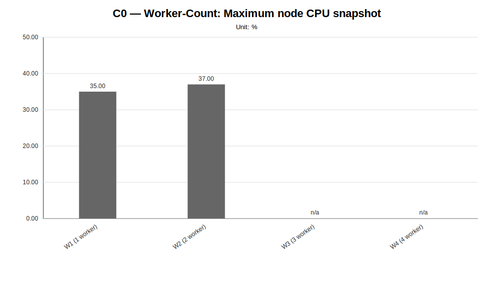
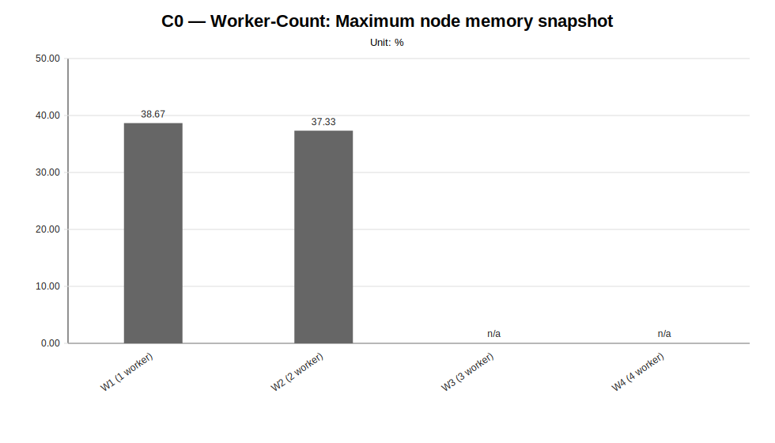
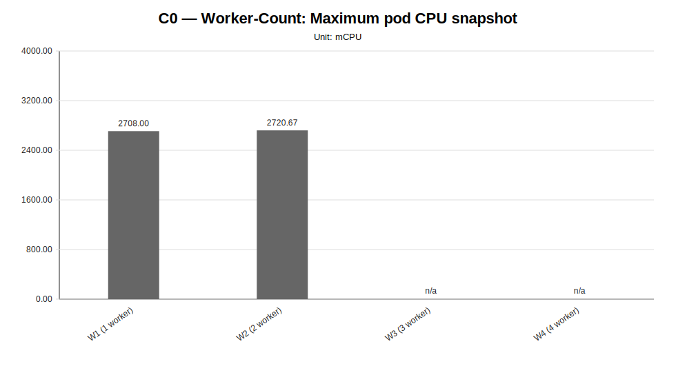
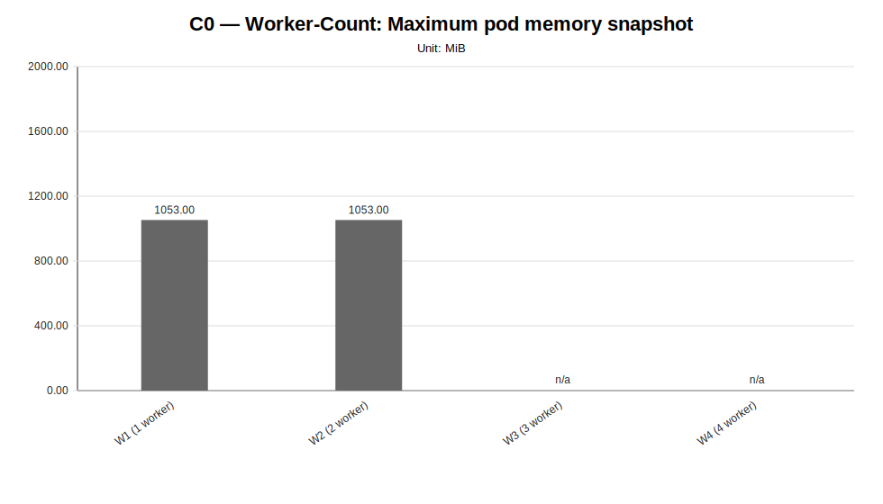

# C0 — Worker-Count Sweep Report

**Cycle ID:** `C0`
**Sweep:** `worker-count`
**Reporting Profile:** `RP_C0_HISTORICAL_FIXED_CLUSTER`
**Reporting ID:** `REP_C0_20260619T174611Z`
**Generated at UTC:** `2026-06-19T17:46:12Z`

[Back to cycle report](../../index.html)

## Scope

This sweep-specific report isolates **Worker-Count** so that the varied dimension, fixed dimensions, measured values, unsupported evidence and diagnosis-based reading can be inspected without navigating the full consolidated report.

## Worker-Count

**Execution status:** `partially_measured`

**Execution note:** At least one configured scenario has measured benchmark samples, while other scenarios are missing or unsupported.

**Varied dimension:** number of LocalAI RPC workers

**Fixed dimensions:** baseline model, baseline workload, baseline placement, baseline protocol.

**Reference scenario within the sweep:** `W2`

| Scenario count | Measured | Unsupported | Missing |
|---|---|---|---|
| 4 | 2 | 2 | 0 |

### Controlled scenario parameters

This table is derived from resolved scenario metadata. A parameter is marked as controlled only when it has the same effective value across all scenarios in the sweep.

| Parameter | Resolved value | Interpretation |
|---|---|---|
| Model | llama-3.2-1b-instruct:q4_k_m | controlled |
| Worker count | varies across scenarios (4 values) | varied or scenario-specific |
| Placement | colocated_sc_app_02 | controlled |
| Workload | users=2, spawnRate=1, runTime=2m | controlled |
| Topology | varies across scenarios (4 values) | varied or scenario-specific |
| Server manifest | infra/k8s/compositions/server/models/m1 | controlled |
| Prompt | Reply with only READY. | controlled |
| Temperature | 0.1 | controlled |
| Request timeout (s) | 120 | controlled |

### Scenario parameter matrix

| Scenario | Status | Varied value (number of LocalAI RPC workers) | Model | Worker count | Placement | Workload | Timeout (s) |
|---|---|---|---|---|---|---|---|
| `W1` | measured | 1 | llama-3.2-1b-instruct:q4_k_m | 1 | colocated_sc_app_02 | users=2, spawnRate=1, runTime=2m | 120 |
| `W2` | measured | 2 | llama-3.2-1b-instruct:q4_k_m | 2 | colocated_sc_app_02 | users=2, spawnRate=1, runTime=2m | 120 |
| `W3` | unsupported_under_current_constraints | 3 | llama-3.2-1b-instruct:q4_k_m | 3 | colocated_sc_app_02 | users=2, spawnRate=1, runTime=2m | 120 |
| `W4` | unsupported_under_current_constraints | 4 | llama-3.2-1b-instruct:q4_k_m | 4 | colocated_sc_app_02 | users=2, spawnRate=1, runTime=2m | 120 |

### Measurement summary

This compact table reports the core indicators used to read the sweep at a glance. Detailed percentiles, deltas and resource snapshots are reported in the following extended table.

| Scenario | Description | Status | Sample count | Mean response time (ms) | P95 response time (ms) | Throughput (requests/s) | Unsupported evidence |
|---|---|---|---|---|---|---|---|
| `W1` | W1 (1 worker) | measured | 3 | 1708.96 | 1800.00 | 0.5397 |  |
| `W2` | W2 (2 worker) | measured | 3 | 1704.00 | 1800.00 | 0.5406 |  |
| `W3` | W3 (3 worker) | unsupported_under_current_constraints | 0 | n/a | n/a | n/a | failed_scheduling, insufficient_cpu, insufficient_memory, latency_injection, no_preemption_victims_found, node_affinity_selector_mismatch, pending_pod, preemption_not_helpful |
| `W4` | W4 (4 worker) | unsupported_under_current_constraints | 0 | n/a | n/a | n/a | failed_scheduling, insufficient_cpu, insufficient_memory, latency_injection, no_preemption_victims_found, node_affinity_selector_mismatch, pending_pod, preemption_not_helpful |

### Extended measurement metrics

This secondary table keeps the additional metrics aligned with the technical diagnosis while avoiding an excessively wide primary summary table.

| Scenario | P50 response time (ms) | P99 response time (ms) | Mean response time delta (%) | P95 response time delta (%) | Throughput delta (%) | Max node CPU snapshot (%) | Max node memory snapshot (%) | Max pod CPU snapshot (mCPU) | Max pod memory snapshot (MiB) |
|---|---|---|---|---|---|---|---|---|---|
| `W1` | 1700.00 | 2133.33 | 0.29 | 0.00 | -0.17 | 35.00 | 38.67 | 2708.00 | 1053.00 |
| `W2` | 1700.00 | 2100.00 | 0.00 | 0.00 | 0.00 | 37.00 | 37.33 | 2720.67 | 1053.00 |
| `W3` | n/a | n/a | n/a | n/a | n/a | n/a | n/a | n/a | n/a |
| `W4` | n/a | n/a | n/a | n/a | n/a | n/a | n/a | n/a | n/a |

### Diagnosis-based reading

- **In the initial comparison between measured configurations, worker count does not produce a strong enough improvement.** (status: `weak_signal`, confidence: `low`).
  - Implication: The transition from W1 to W2 was observed, but the mean-latency benefit remains below the configured diagnostic threshold; additional unsupported scenarios also limit assessment beyond the measured scope.

### Charts

#### Mean response time

#### P50 response time

#### P95 response time

#### P99 response time

#### Throughput

#### Maximum node CPU snapshot

#### Maximum node memory snapshot

#### Maximum pod CPU snapshot

#### Maximum pod memory snapshot

### Reading notes

- Measured scenarios: **2**.
- Unsupported scenarios under current constraints: **2**.
- Percentage deltas are computed against the family reference scenario; positive latency deltas indicate worse response time, while positive throughput deltas indicate higher request throughput.
- Unsupported scenarios are infrastructure/constraint observations and must not be interpreted as measured latency regressions.
- A `not_executed` sweep means that neither measurement CSV files nor unsupported-scenario evidence were found for any configured scenario in that family.
