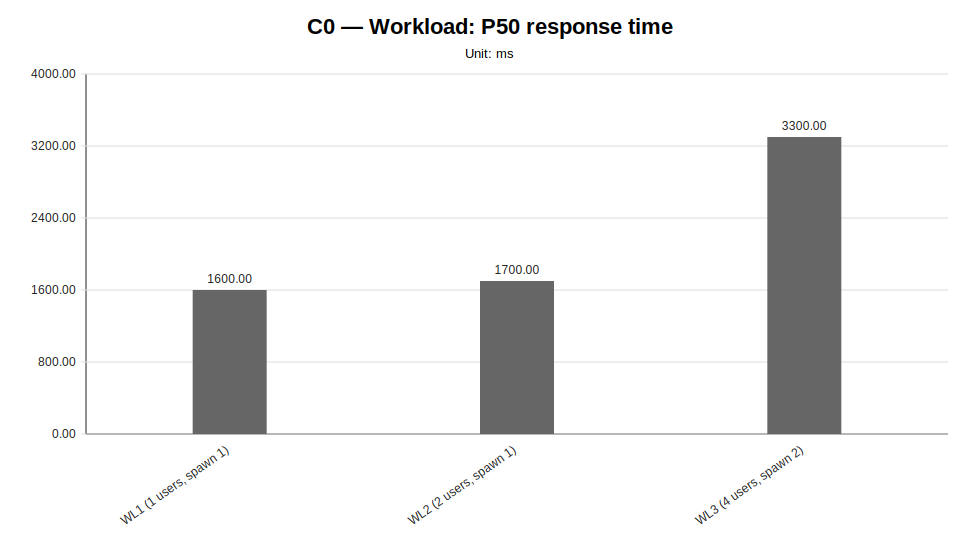
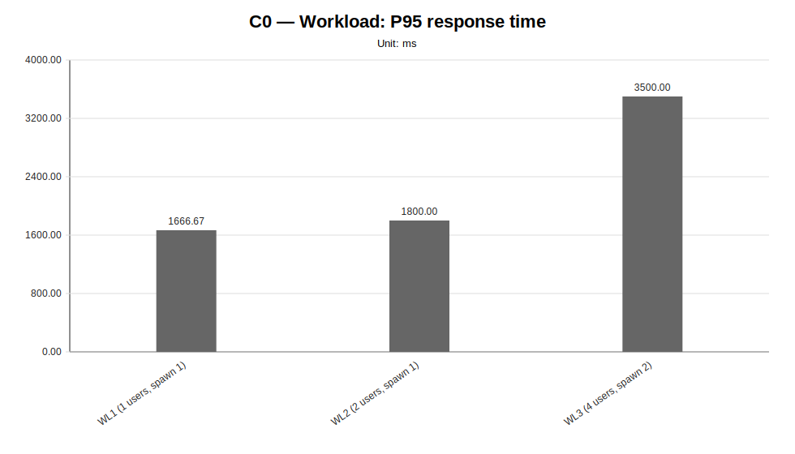
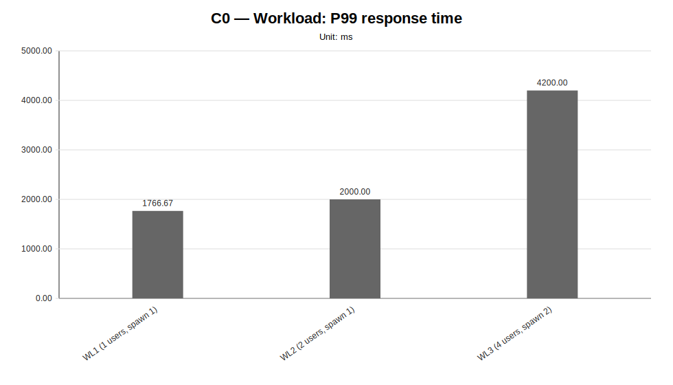
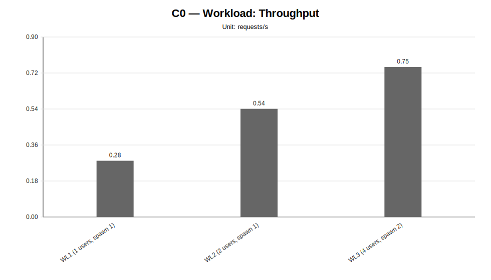
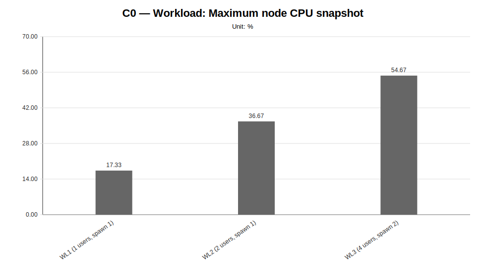
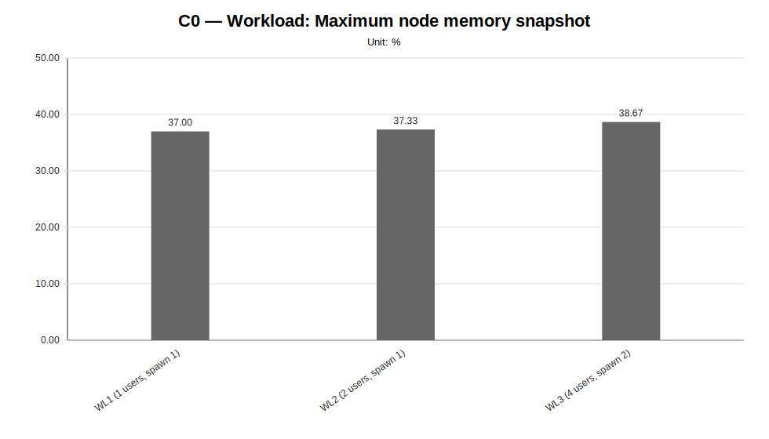
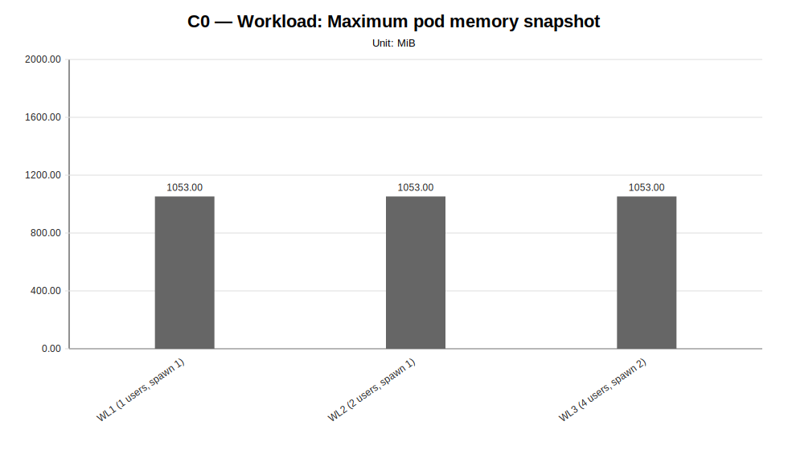

# C0 — Workload Sweep Report

**Cycle ID:** `C0`
**Sweep:** `workload`
**Reporting Profile:** `RP_C0_HISTORICAL_FIXED_CLUSTER`
**Reporting ID:** `REP_C0_20260619T174611Z`
**Generated at UTC:** `2026-06-19T17:46:12Z`

[Back to cycle report](../../index.html)

## Scope

This sweep-specific report isolates **Workload** so that the varied dimension, fixed dimensions, measured values, unsupported evidence and diagnosis-based reading can be inspected without navigating the full consolidated report.

## Workload

**Execution status:** `fully_measured`

**Execution note:** All configured scenarios in this sweep have measured benchmark samples.

**Varied dimension:** synthetic client-side workload pattern

**Fixed dimensions:** baseline model, baseline worker count, baseline placement, baseline protocol.

**Reference scenario within the sweep:** `WL2`

| Scenario count | Measured | Unsupported | Missing |
|---|---|---|---|
| 3 | 3 | 0 | 0 |

### Controlled scenario parameters

This table is derived from resolved scenario metadata. A parameter is marked as controlled only when it has the same effective value across all scenarios in the sweep.

| Parameter | Resolved value | Interpretation |
|---|---|---|
| Model | llama-3.2-1b-instruct:q4_k_m | controlled |
| Worker count | 2 | controlled |
| Placement | colocated_sc_app_02 | controlled |
| Workload | varies across scenarios (3 values) | varied or scenario-specific |
| Topology | infra/k8s/compositions/topology/colocated-sc-app-02-w2 | controlled |
| Server manifest | infra/k8s/compositions/server/models/m1 | controlled |
| Prompt | Reply with only READY. | controlled |
| Temperature | 0.1 | controlled |
| Request timeout (s) | 120 | controlled |

### Scenario parameter matrix

| Scenario | Status | Varied value (synthetic client-side workload pattern) | Model | Worker count | Placement | Workload | Timeout (s) |
|---|---|---|---|---|---|---|---|
| `WL1` | measured | users=1, spawnRate=1, runTime=2m | llama-3.2-1b-instruct:q4_k_m | 2 | colocated_sc_app_02 | users=1, spawnRate=1, runTime=2m | 120 |
| `WL2` | measured | users=2, spawnRate=1, runTime=2m | llama-3.2-1b-instruct:q4_k_m | 2 | colocated_sc_app_02 | users=2, spawnRate=1, runTime=2m | 120 |
| `WL3` | measured | users=4, spawnRate=2, runTime=2m | llama-3.2-1b-instruct:q4_k_m | 2 | colocated_sc_app_02 | users=4, spawnRate=2, runTime=2m | 120 |

### Measurement summary

This compact table reports the core indicators used to read the sweep at a glance. Detailed percentiles, deltas and resource snapshots are reported in the following extended table.

| Scenario | Description | Status | Sample count | Mean response time (ms) | P95 response time (ms) | Throughput (requests/s) | Unsupported evidence |
|---|---|---|---|---|---|---|---|
| `WL1` | WL1 (1 users, spawn 1) | measured | 3 | 1589.17 | 1666.67 | 0.2812 |  |
| `WL2` | WL2 (2 users, spawn 1) | measured | 3 | 1701.29 | 1800.00 | 0.5408 |  |
| `WL3` | WL3 (4 users, spawn 2) | measured | 3 | 3311.63 | 3500.00 | 0.7499 |  |

### Extended measurement metrics

This secondary table keeps the additional metrics aligned with the technical diagnosis while avoiding an excessively wide primary summary table.

| Scenario | P50 response time (ms) | P99 response time (ms) | Mean response time delta (%) | P95 response time delta (%) | Throughput delta (%) | Max node CPU snapshot (%) | Max node memory snapshot (%) | Max pod CPU snapshot (mCPU) | Max pod memory snapshot (MiB) |
|---|---|---|---|---|---|---|---|---|---|
| `WL1` | 1600.00 | 1766.67 | -6.59 | -7.41 | -48.00 | 17.33 | 37.00 | 1323.67 | 1053.00 |
| `WL2` | 1700.00 | 2000.00 | 0.00 | 0.00 | 0.00 | 36.67 | 37.33 | 2636.33 | 1053.00 |
| `WL3` | 3300.00 | 4200.00 | 94.65 | 94.44 | 38.66 | 54.67 | 38.67 | 3985.00 | 1053.00 |

### Diagnosis-based reading

- **The workload family shows a clear performance degradation signal as load increases.** (status: `strong_signal`, confidence: `medium`).
  - Implication: In the current cluster, workload is a relevant latency driver and suggests a clearer fragility threshold in the more demanding configurations.
- **The heavier workload substantially increases latency, suggesting possible system saturation.** (confidence: `medium`).
  - Implication: The cluster appears more fragile as concurrency increases; higher load alone does not necessarily translate into a proportional increase in useful throughput.

### Charts

#### Mean response time

#### P50 response time

#### P95 response time

#### P99 response time

#### Throughput

#### Maximum node CPU snapshot

#### Maximum node memory snapshot

#### Maximum pod CPU snapshot

#### Maximum pod memory snapshot

### Reading notes

- Measured scenarios: **3**.
- Unsupported scenarios under current constraints: **0**.
- Percentage deltas are computed against the family reference scenario; positive latency deltas indicate worse response time, while positive throughput deltas indicate higher request throughput.
- Unsupported scenarios are infrastructure/constraint observations and must not be interpreted as measured latency regressions.
- A `not_executed` sweep means that neither measurement CSV files nor unsupported-scenario evidence were found for any configured scenario in that family.
