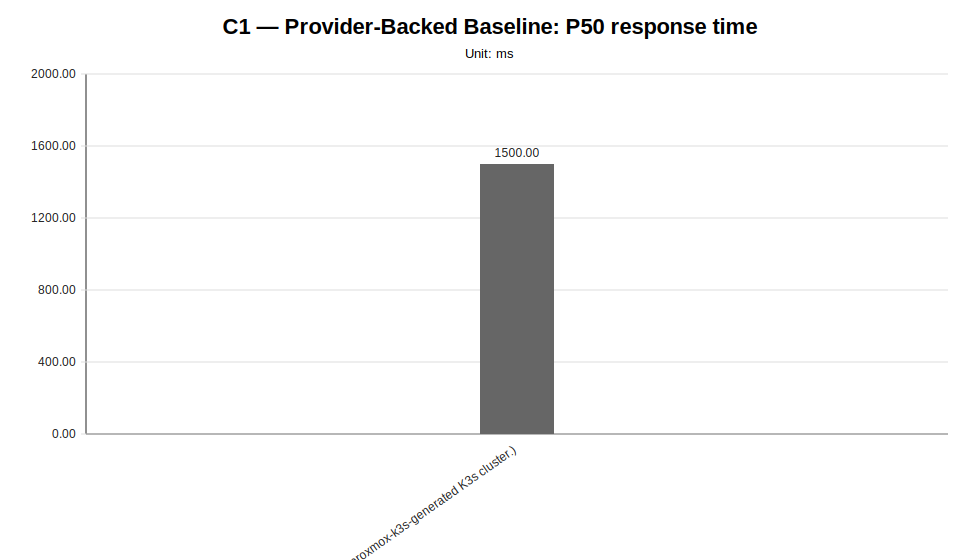
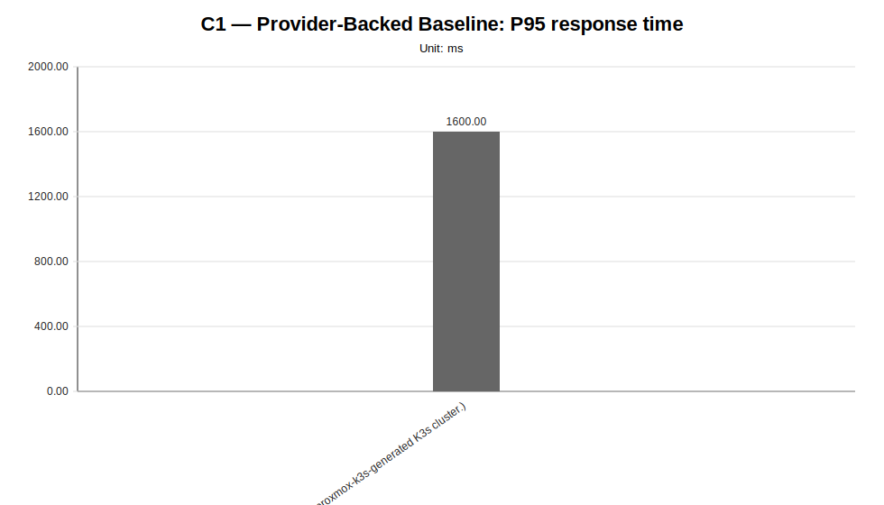
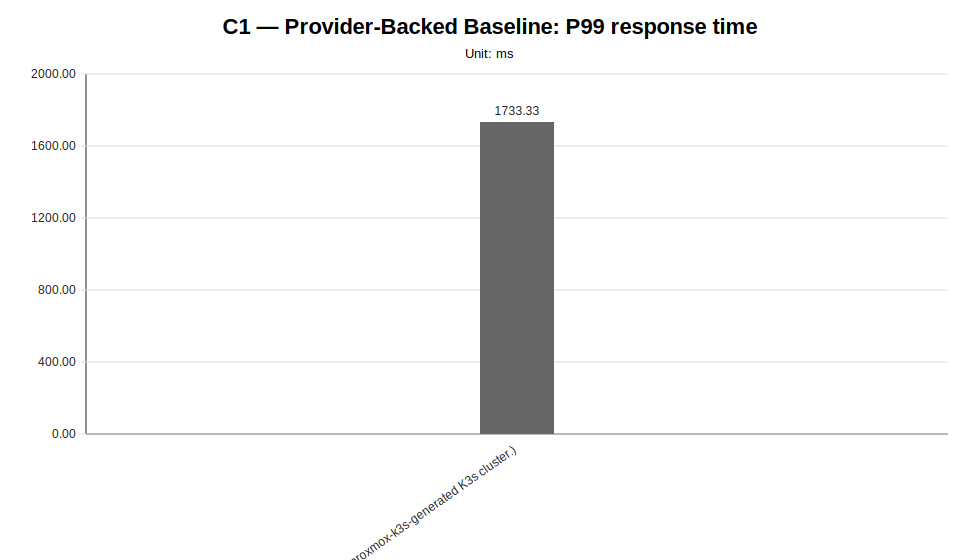
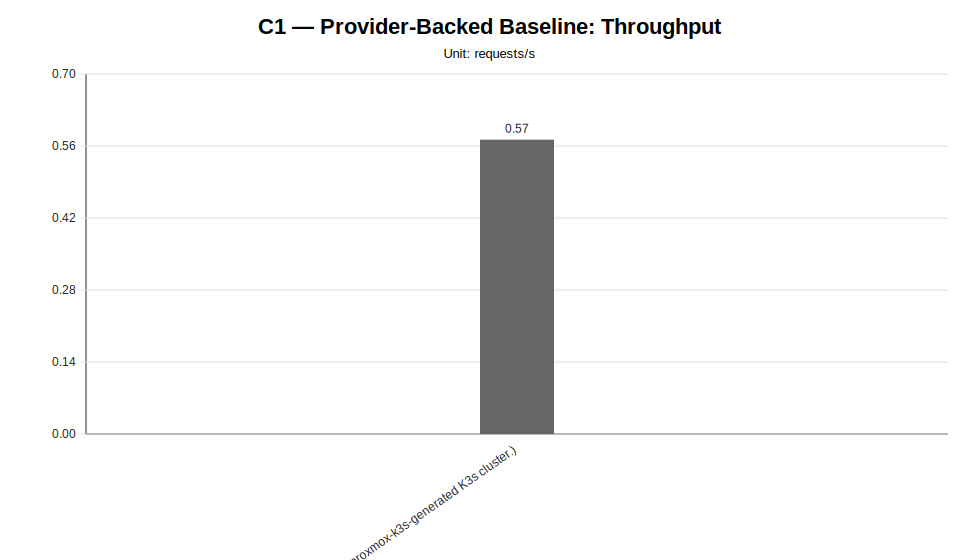
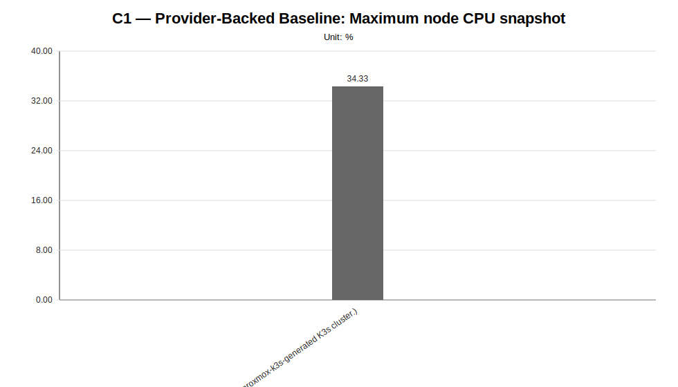
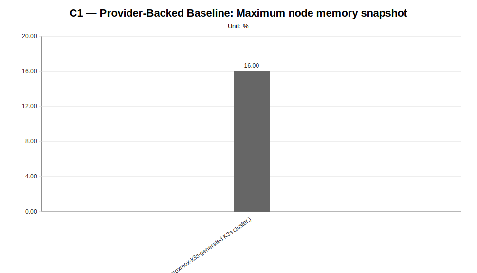
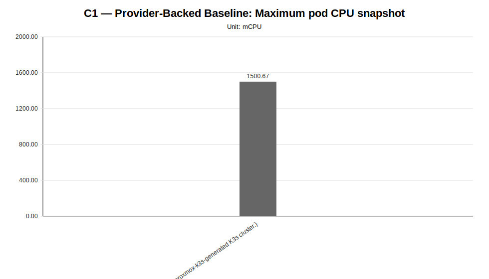
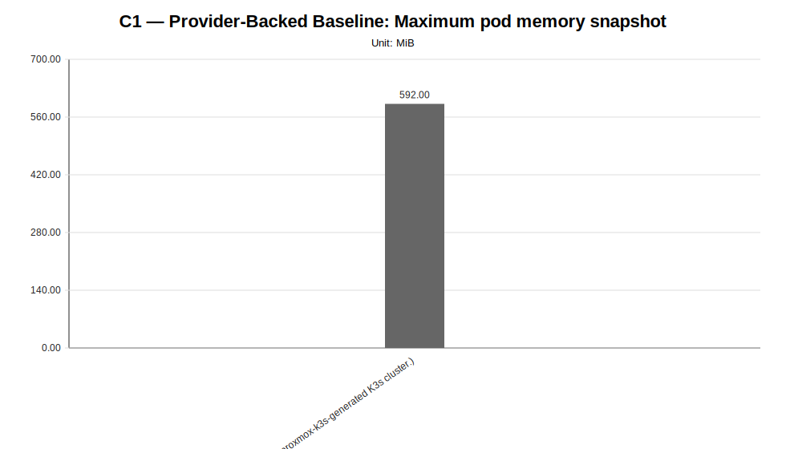

# C1 — Provider-Backed Baseline Detail Report

**Cycle ID:** `C1`
**Sweep:** `baseline`
**Reporting Profile:** `RP_C1_PROVIDER_BACKED_BASELINE`
**Reporting ID:** `REP_C1_20260619T174611Z`
**Generated at UTC:** `2026-06-19T17:46:34Z`

[Back to cycle report](../../index.html)

## Scope

This sweep-specific report isolates **Provider-Backed Baseline** so that the varied dimension, fixed dimensions, measured values, unsupported evidence and diagnosis-based reading can be inspected without navigating the full consolidated report.

## Provider-Backed Baseline

**Execution status:** `fully_measured`

**Execution note:** All configured scenarios in this sweep have measured benchmark samples.

**Varied dimension:** provider-backed baseline validation

**Fixed dimensions:** model, worker_count, placement, workload, infrastructure_profile, provider_binding.

**Reference scenario within the sweep:** `B1`

| Scenario count | Measured | Unsupported | Missing |
|---|---|---|---|
| 1 | 1 | 0 | 0 |

### Controlled scenario parameters

This table is derived from resolved scenario metadata. A parameter is marked as controlled only when it has the same effective value across all scenarios in the sweep.

| Parameter | Resolved value | Interpretation |
|---|---|---|
| Model | llama-3.2-1b-instruct:q4_k_m | controlled |
| Worker count | 2 | controlled |
| Placement | colocated_genai_pb_worker_02 | controlled |
| Workload | users=2, spawnRate=1, runTime=2m | controlled |
| Topology | infra/k8s/compositions/topology/colocated-genai-pb-worker-02-w2 | controlled |
| Server manifest | infra/k8s/compositions/server/models/m1-provider-backed | controlled |
| Prompt | Reply with only READY. | controlled |
| Temperature | 0.1 | controlled |
| Request timeout (s) | 120 | controlled |

### Scenario parameter matrix

| Scenario | Status | Varied value (provider-backed baseline validation) | Model | Worker count | Placement | Workload | Timeout (s) |
|---|---|---|---|---|---|---|---|
| `B1` | measured | B1 | llama-3.2-1b-instruct:q4_k_m | 2 | colocated_genai_pb_worker_02 | users=2, spawnRate=1, runTime=2m | 120 |

### Measurement summary

This compact table reports the core indicators used to read the sweep at a glance. Detailed percentiles, deltas and resource snapshots are reported in the following extended table.

| Scenario | Description | Status | Sample count | Mean response time (ms) | P95 response time (ms) | Throughput (requests/s) | Unsupported evidence |
|---|---|---|---|---|---|---|---|
| `B1` | B1 (Provider-backed baseline for LocalAI worker-mode characterization on a proxmox-k3s-generated K3s cluster.) | measured | 3 | 1507.76 | 1600.00 | 0.5723 |  |

### Extended measurement metrics

This secondary table keeps the additional metrics aligned with the technical diagnosis while avoiding an excessively wide primary summary table.

| Scenario | P50 response time (ms) | P99 response time (ms) | Mean response time delta (%) | P95 response time delta (%) | Throughput delta (%) | Max node CPU snapshot (%) | Max node memory snapshot (%) | Max pod CPU snapshot (mCPU) | Max pod memory snapshot (MiB) |
|---|---|---|---|---|---|---|---|---|---|
| `B1` | 1500.00 | 1733.33 | 0.00 | 0.00 | 0.00 | 34.33 | 16.00 | 1500.67 | 592.00 |

### Diagnosis-based reading

- **The provider-backed baseline is measurable and ready for controlled comparisons.** (status: `provider_backed_baseline_available`, confidence: `high`).
  - Implication: Baseline evidence is available for the provider-backed cycle and can be used as the reference point for later resource, node-count and placement comparisons.
- **Minimum end-to-end validation is available as a functional reliability baseline.** (confidence: `high`).
  - Implication: The benchmark pipeline starts from a verified functional baseline rather than from a purely theoretical setup.
- **The provider-backed baseline produced measurable request-level evidence.** (confidence: `high`).
  - Implication: The provider-backed workflow is ready to act as the reference baseline for subsequent controlled comparisons.

### Charts

#### Mean response time

#### P50 response time

#### P95 response time

#### P99 response time

#### Throughput

#### Maximum node CPU snapshot

#### Maximum node memory snapshot

#### Maximum pod CPU snapshot

#### Maximum pod memory snapshot

### Reading notes

- Measured scenarios: **1**.
- Unsupported scenarios under current constraints: **0**.
- Percentage deltas are computed against the family reference scenario; positive latency deltas indicate worse response time, while positive throughput deltas indicate higher request throughput.
- Unsupported scenarios are infrastructure/constraint observations and must not be interpreted as measured latency regressions.
- A `not_executed` sweep means that neither measurement CSV files nor unsupported-scenario evidence were found for any configured scenario in that family.
