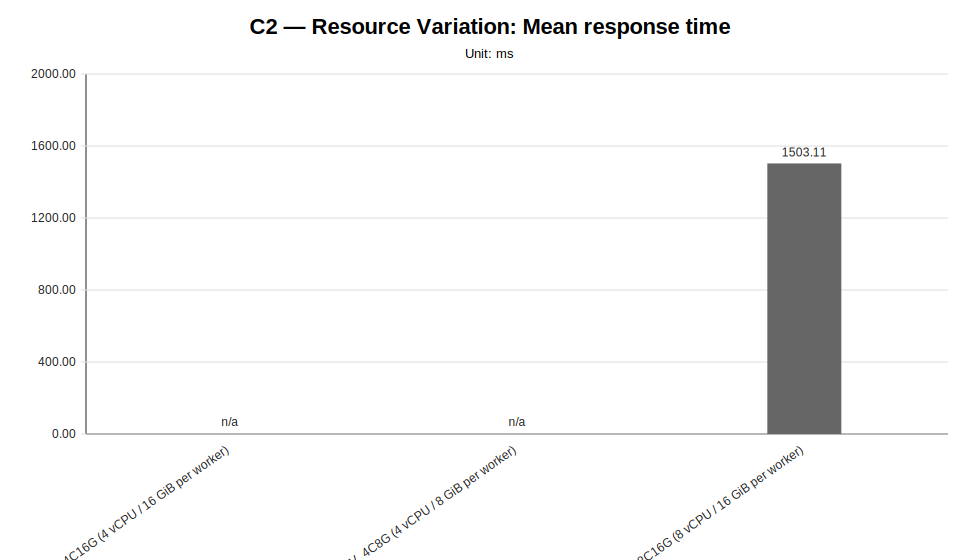
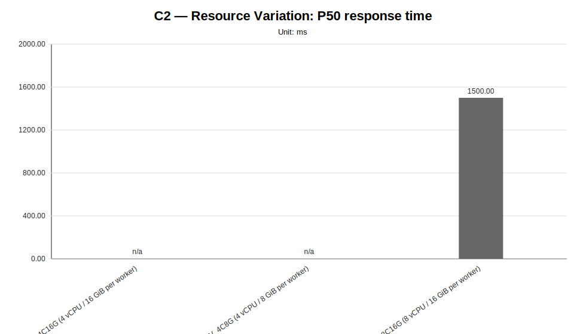
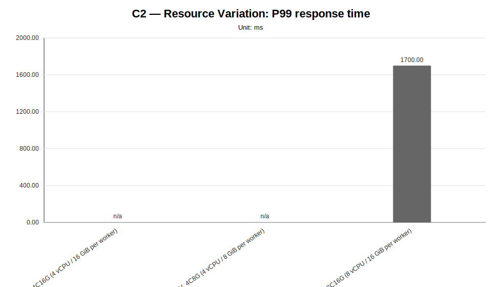
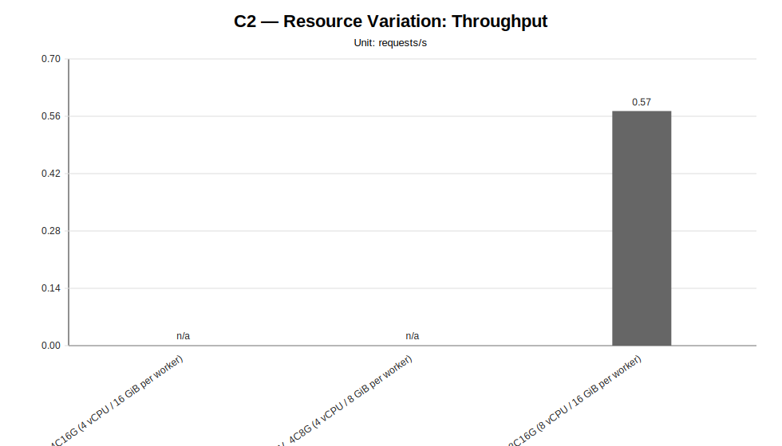
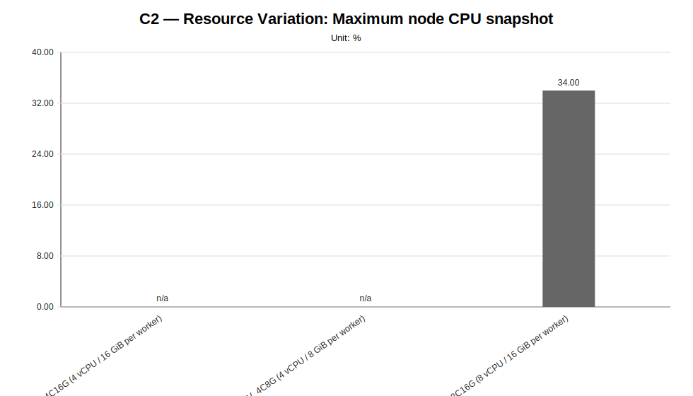
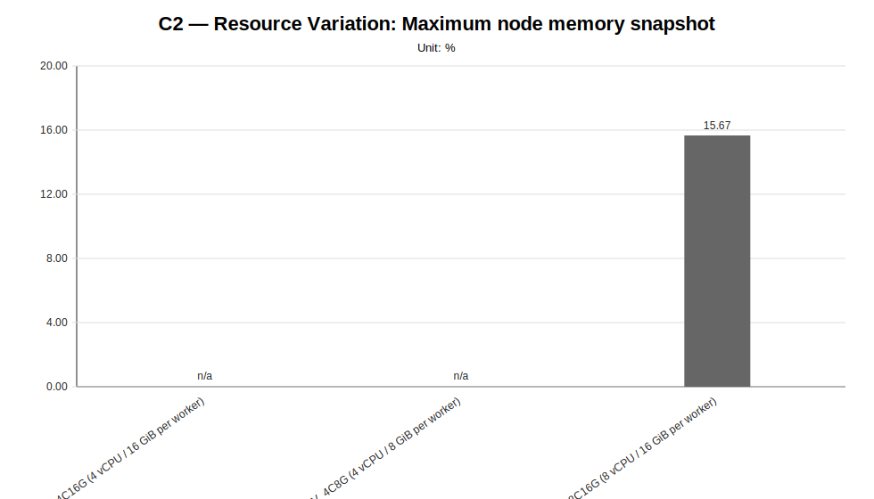
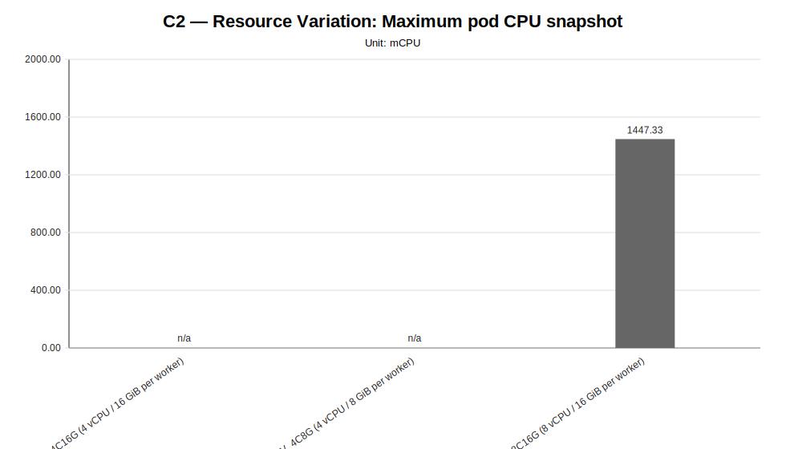
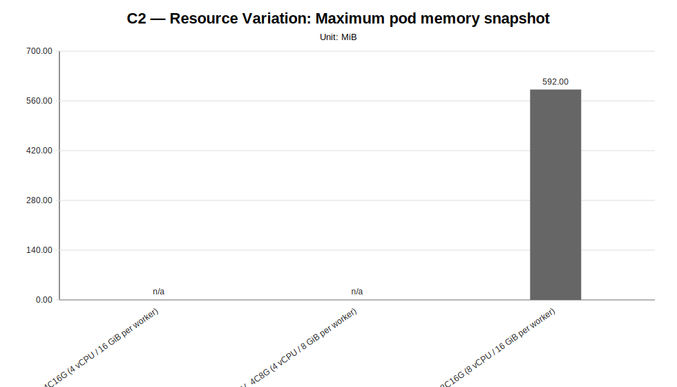

# C2 — Resource Variation Report

**Cycle ID:** `C2`
**Reporting Profile:** `RP_C2_RESOURCE_VARIATION`
**Reporting ID:** `REP_C2_20260619T174611Z`
**Generated at UTC:** `2026-06-19T17:46:38Z`

## Purpose

This report compares worker CPU and memory variants under fixed LocalAI workload, model, worker-count and placement conditions. It is intended to expose whether resource capacity materially affects latency, throughput and cluster-side pressure.

The report combines **measurement CSV data**, **minimal observability evidence**, **cluster validation outputs**, **application topology metadata** and **technical diagnosis context** when those artifacts are available.

[Back to cycle report index](../../index.html)

## Cross-cycle baseline reference

The values below describe the global baseline configuration used as a cross-cycle reference. Scenario-specific and sweep-local sections report the effective infrastructure, placement, worker count and runtime configuration used by each scenario. Percentage deltas are computed against the family-local reference scenario when one is defined for the sweep.

| Dimension | Reference value |
|---|---|
| Baseline ID | B1 |
| Model | llama-3.2-1b-instruct:q4_k_m |
| Worker count | 2 |
| Placement | colocated_genai_pb_worker_02 |
| Workload | users=2, spawnRate=1, runTime=2m |
| Prompt | Reply with only READY. |
| Request timeout | 120 s |
| Infrastructure profile | INFRA_C1_1CP_2W_8C16G |
| Placement profile | PL_COLOCATED |

## Family-local reference scenarios

The scenarios below are the sweep-local references used to interpret percentage deltas within each family. They may differ from the cross-cycle baseline when a campaign intentionally varies infrastructure, placement, latency or tenancy.

| Sweep | Reference scenario | Description | Status | Varied dimension |
|---|---|---|---|---|
| Resource Variation | `RV_8C16G` | RV_8C16G (8 vCPU / 16 GiB per worker) | measured | worker CPU and memory capacity |

## Data sources

| Layer | Primary use | Source |
|---|---|---|
| Measurement CSV | Quantitative charts and scenario summary metrics | `{"resource-variation": "results/experimental-cycles/C2/benchmark/resource-variation"}` |
| Technical diagnosis | Interpretation, family judgments, findings, unsupported-scenario context | `results/experimental-cycles/C2/diagnosis/analysis_diagnosis_all_NA_20260619T174638Z_diagnosis.json` |
| Scenario configuration | Fixed/varied dimensions and scenario labels | `config/scenarios/**` |
| Cluster-side artifacts | CPU/memory snapshots, pod placement and event evidence | `minimal observability and cluster capture artifacts` |
| Reporting output | Current generated report package | `results/experimental-cycles/C2/reporting` |

## Infrastructure Summary

This reporting profile uses variant-scoped infrastructure: infrastructure profiles are attached to individual scenarios rather than to one fixed cycle-level cluster shape.

| Scenario | Family | Infrastructure profile | Infrastructure profile path | Provider | Provider binding | Worker nodes | Worker vCPU/node | Worker memory/node | Lifecycle mode |
|---|---|---|---|---|---|---|---|---|---|
| `RV_4C16G` | resource-variation | INFRA_C2_1CP_2W_4C16G | config/infrastructure/profiles/INFRA_C2_1CP_2W_4C16G.json | proxmox-k3s | BINDING_INFRA_C2_1CP_2W_4C16G_PROXMOX_K3S | 2 | 4 vCPU | 16 GiB | ephemeral |
| `RV_4C8G` | resource-variation | INFRA_C2_1CP_2W_4C8G | config/infrastructure/profiles/INFRA_C2_1CP_2W_4C8G.json | proxmox-k3s | BINDING_INFRA_C2_1CP_2W_4C8G_PROXMOX_K3S | 2 | 4 vCPU | 8 GiB | ephemeral |
| `RV_8C16G` | resource-variation | INFRA_C2_1CP_2W_8C16G | config/infrastructure/profiles/INFRA_C2_1CP_2W_8C16G.json | proxmox-k3s | BINDING_INFRA_C2_1CP_2W_8C16G_PROXMOX_K3S | 2 | 8 vCPU | 16 GiB | ephemeral |

## Provider Summary

This campaign may resolve provider configuration at scenario or variant level. The table below exposes provider bindings and concrete configuration paths per scenario whenever available.

| Scenario | Family | Provider | Provider binding | Provider binding path | Example config | Local config | Kubeconfig |
|---|---|---|---|---|---|---|---|
| `RV_4C16G` | resource-variation | proxmox-k3s | BINDING_INFRA_C2_1CP_2W_4C16G_PROXMOX_K3S | config/infrastructure/providers/proxmox-k3s/bindings/BINDING_INFRA_C2_1CP_2W_4C16G_PROXMOX_K3S.json | config/infrastructure/providers/proxmox-k3s/examples/cluster.c2-1cp-2w-4c16g.example.yaml | config/infrastructure/providers/proxmox-k3s/local/cluster.c2-1cp-2w-4c16g.local.yaml | config/cluster-access/generated/proxmox-k3s/c2-1cp-2w-4c16g/kubeconfig |
| `RV_4C8G` | resource-variation | proxmox-k3s | BINDING_INFRA_C2_1CP_2W_4C8G_PROXMOX_K3S | config/infrastructure/providers/proxmox-k3s/bindings/BINDING_INFRA_C2_1CP_2W_4C8G_PROXMOX_K3S.json | config/infrastructure/providers/proxmox-k3s/examples/cluster.c2-1cp-2w-4c8g.example.yaml | config/infrastructure/providers/proxmox-k3s/local/cluster.c2-1cp-2w-4c8g.local.yaml | config/cluster-access/generated/proxmox-k3s/c2-1cp-2w-4c8g/kubeconfig |
| `RV_8C16G` | resource-variation | proxmox-k3s | BINDING_INFRA_C2_1CP_2W_8C16G_PROXMOX_K3S | config/infrastructure/providers/proxmox-k3s/bindings/BINDING_INFRA_C2_1CP_2W_8C16G_PROXMOX_K3S.json | config/infrastructure/providers/proxmox-k3s/examples/cluster.c2-1cp-2w-8c16g.example.yaml | config/infrastructure/providers/proxmox-k3s/local/cluster.c2-1cp-2w-8c16g.local.yaml | config/cluster-access/generated/proxmox-k3s/c2-1cp-2w-8c16g/kubeconfig |

## Cluster Validation Summary

| Item | Value |
|---|---|
| Validation profile | CV_PROVIDER_BACKED_VALIDATION_TEMPLATE |
| Profile file | config/cluster-validation/templates/CV_PROVIDER_BACKED_VALIDATION_TEMPLATE.json |
| Latest manifest | variant-scoped validation manifests (3 available) |
| Current status | variant-scoped validation available (3/3 validated) |
| Variant validation statuses | validated=3 |
| Latest raw validation | variant-scoped validation evidence is recorded in the campaign execution manifest and generated runtime profiles under results/experimental-cycles/C2/execution/generated-runtime-configs |
| Accepted provisioning statuses | completed |
| Required kubeconfig status | verified |
| Artifact root | results/experimental-cycles/C2/execution/generated-runtime-configs |

## Runtime Profile Variant Summary

This table links each scenario to the runtime-generated profiles used for precheck, application deployment and minimal observability evidence.

| Scenario | Family | Precheck profile | Precheck profile path | Application deployment profile | Application deployment profile path | Minimal observability profile | Minimal observability profile path | Cluster validation evidence |
|---|---|---|---|---|---|---|---|---|
| `RV_4C16G` | resource-variation | TC_C2_RV_4C16G | results/experimental-cycles/C2/execution/generated-runtime-configs/RV_4C16G/TC_RV_4C16G.json | AD_C2_RV_4C16G | results/experimental-cycles/C2/execution/generated-runtime-configs/RV_4C16G/AD_RV_4C16G.json | MO_C2_RV_4C16G | results/experimental-cycles/C2/execution/generated-runtime-configs/RV_4C16G/MO_RV_4C16G.json | results/experimental-cycles/C2/variants/RV_4C16G/infrastructure/validation/latest-cluster-validation-manifest.json (validated) |
| `RV_4C8G` | resource-variation | TC_C2_RV_4C8G | results/experimental-cycles/C2/execution/generated-runtime-configs/RV_4C8G/TC_RV_4C8G.json | AD_C2_RV_4C8G | results/experimental-cycles/C2/execution/generated-runtime-configs/RV_4C8G/AD_RV_4C8G.json | MO_C2_RV_4C8G | results/experimental-cycles/C2/execution/generated-runtime-configs/RV_4C8G/MO_RV_4C8G.json | results/experimental-cycles/C2/variants/RV_4C8G/infrastructure/validation/latest-cluster-validation-manifest.json (validated) |
| `RV_8C16G` | resource-variation | TC_C2_RV_8C16G | results/experimental-cycles/C2/execution/generated-runtime-configs/RV_8C16G/TC_RV_8C16G.json | AD_C2_RV_8C16G | results/experimental-cycles/C2/execution/generated-runtime-configs/RV_8C16G/AD_RV_8C16G.json | MO_C2_RV_8C16G | results/experimental-cycles/C2/execution/generated-runtime-configs/RV_8C16G/MO_RV_8C16G.json | results/experimental-cycles/C2/variants/RV_8C16G/infrastructure/validation/latest-cluster-validation-manifest.json (validated) |

## Application Topology Summary

This campaign may vary placement, tenancy, latency profile or generated deployment profiles at scenario level. The table below exposes the scenario-level application topology used by each configured variant.

| Scenario | Family | Placement profile | Placement type | Topology dir | Server manifest | Worker count | Active RPC workers | Expected server node | Expected worker nodes | Latency profile | Tenancy profile | Generated deployment profile |
|---|---|---|---|---|---|---|---|---|---|---|---|---|
| `RV_4C16G` | resource-variation | PL_COLOCATED | colocated_genai_pb_worker_02 | infra/k8s/compositions/topology/colocated-genai-pb-worker-02-w2 | infra/k8s/compositions/server/models/m1-provider-backed | 2 | localai-rpc-a, localai-rpc-b | genai-pb-worker-02 | localai-rpc-a=genai-pb-worker-02, localai-rpc-b=genai-pb-worker-02 | not_applicable | not_declared | results/experimental-cycles/C2/execution/generated-runtime-configs/RV_4C16G/AD_RV_4C16G.json |
| `RV_4C8G` | resource-variation | PL_COLOCATED | colocated_genai_pb_worker_02 | infra/k8s/compositions/topology/colocated-genai-pb-worker-02-w2 | infra/k8s/compositions/server/models/m1-provider-backed | 2 | localai-rpc-a, localai-rpc-b | genai-pb-worker-02 | localai-rpc-a=genai-pb-worker-02, localai-rpc-b=genai-pb-worker-02 | not_applicable | not_declared | results/experimental-cycles/C2/execution/generated-runtime-configs/RV_4C8G/AD_RV_4C8G.json |
| `RV_8C16G` | resource-variation | PL_COLOCATED | colocated_genai_pb_worker_02 | infra/k8s/compositions/topology/colocated-genai-pb-worker-02-w2 | infra/k8s/compositions/server/models/m1-provider-backed | 2 | localai-rpc-a, localai-rpc-b | genai-pb-worker-02 | localai-rpc-a=genai-pb-worker-02, localai-rpc-b=genai-pb-worker-02 | not_applicable | not_declared | results/experimental-cycles/C2/execution/generated-runtime-configs/RV_8C16G/AD_RV_8C16G.json |

## Scenario Summary

The following table summarizes the currently available measurement and constraint evidence for all configured reporting families.

| Family | Scenario | Status | Samples | Mean ms | P95 ms | RPS | Unsupported evidence |
|---|---|---|---|---|---|---|---|
| resource-variation | RV_4C16G | unsupported_under_current_constraints | 0 | NA | NA | NA | application_not_ready,failed_scheduling,insufficient_cpu,latency_injection,localai_deployment,no_preemption_victims_found,node_affinity_selector_mismatch,pending_pod,preemption_not_helpful,rollout_timeout |
| resource-variation | RV_4C8G | unsupported_under_current_constraints | 0 | NA | NA | NA | application_not_ready,failed_scheduling,insufficient_memory,latency_injection,localai_deployment,no_preemption_victims_found,node_affinity_selector_mismatch,pending_pod,preemption_not_helpful,rollout_timeout |
| resource-variation | RV_8C16G | measured | 3 | 1503.11 | 1500.00 | 0.5728 | NA |

## Metrics Summary

The reporting generator first uses minimal observability metrics when available; missing values are filled from scenario-summary aggregates derived from benchmark CSV files and cluster-capture artifacts whenever possible. Values marked as `not_available` were not derivable from the available artifact set and are intentionally distinguished from measured zero values.

| Metric | Value | Source |
|---|---|---|
| request_count | 67.6667 | scenario summary aggregation fallback |
| success_rate_percent | 100.0 | scenario summary aggregation fallback |
| failure_count | 0 | scenario summary aggregation fallback |
| mean_response_time_ms | 1503.1079 | scenario summary aggregation fallback |
| p50_response_time_ms | 1500.0 | scenario summary aggregation fallback |
| p95_response_time_ms | 1500.0 | scenario summary aggregation fallback |
| p99_response_time_ms | 1700.0 | scenario summary aggregation fallback |
| throughput_rps | 0.5728 | scenario summary aggregation fallback |
| max_node_cpu_percent | 34.0 | scenario summary aggregation fallback |
| max_node_memory_percent | 15.6667 | scenario summary aggregation fallback |
| max_pod_cpu_millicores | 1447.3333 | scenario summary aggregation fallback |
| max_pod_memory_mib | 592.0 | scenario summary aggregation fallback |
| pod_restart_count | 0 | scenario summary aggregation fallback |
| pending_pods_count | 0 | scenario summary aggregation fallback |
| failed_pods_count | 0 | scenario summary aggregation fallback |
| not_ready_pods_count | 0 | scenario summary aggregation fallback |
| kubernetes_events_count | 24 | scenario summary aggregation fallback |
| kubernetes_warning_events_count | 0 | scenario summary aggregation fallback |

## Unsupported Scenario Summary

| Family | Scenario | Status | Evidence | Source |
|---|---|---|---|---|
| resource-variation | RV_4C16G | unsupported_under_current_constraints | application_not_ready, failed_scheduling, insufficient_cpu, latency_injection, localai_deployment, no_preemption_victims_found, node_affinity_selector_mismatch, pending_pod, ... (+2) | results/experimental-cycles/C2/benchmark/resource-variation/RV_4C16G_official_locked/RV_4C16G_runA_unsupported.json, results/experimental-cycles/C2/benchmark/resource-variation/RV_4C16G_official_locked/RV_4C16G_runB_unsupported.json, results/experimental-cycles/C2/benchmark/resource-variation/RV_4C16G_official_locked/RV_4C16G_runC_unsupported.json |
| resource-variation | RV_4C8G | unsupported_under_current_constraints | application_not_ready, failed_scheduling, insufficient_memory, latency_injection, localai_deployment, no_preemption_victims_found, node_affinity_selector_mismatch, pending_pod, ... (+2) | results/experimental-cycles/C2/benchmark/resource-variation/RV_4C8G_official_locked/RV_4C8G_runA_unsupported.json, results/experimental-cycles/C2/benchmark/resource-variation/RV_4C8G_official_locked/RV_4C8G_runB_unsupported.json, results/experimental-cycles/C2/benchmark/resource-variation/RV_4C8G_official_locked/RV_4C8G_runC_unsupported.json |

## Main Findings

| Family | Finding | Status | Confidence | Implication |
|---|---|---|---|---|
| resource-variation | The resource-variation family provides deployability-boundary evidence, but not yet a full latency/throughput comparison. | capacity_boundary_signal_available | medium | At least two measured resource shapes are still required for a robust performance comparison; however, the campaign already identifies which lower resource shapes cannot host the fixed LocalAI topology under the current constraints. |
| resource-variation | The resource-variation campaign identifies a deployability boundary under fixed application-level conditions. | NA | high | The campaign should be read as capacity-feasibility evidence: lower worker-node shapes are not benchmark-ready under the fixed co-located topology and current LocalAI resource requests, while the reference shape is measurable. |
| resource-variation | Unsupported resource-variation variants expose Kubernetes scheduler resource constraints. | NA | high | The unsupported variants provide concrete evidence about CPU and memory feasibility limits and should not be treated as ordinary benchmark failures. |
| baseline | Minimum end-to-end validation is available as a functional reliability baseline. | NA | high | The benchmark pipeline starts from a verified functional baseline rather than from a purely theoretical setup. |

## Sweep-specific reports

The global report below provides the stakeholder-facing overview. Each sweep also has a dedicated report for focused inspection of one varied dimension.

| Sweep | Dedicated HTML report | Execution status | Coverage | Varied dimension |
|---|---|---|---|---|
| Resource Variation | [resource-variation](sweeps/resource-variation/index.html) | partially_measured | measured=1, unsupported=2, missing=0 | worker CPU and memory capacity |

## Diagnosis coverage snapshot

| Family | Scenarios | Observed | Measured | Unsupported | Samples |
|---|---|---|---|---|---|
| resource-variation | 3 | 3 | 1 | 2 | 3 |

## Resource Variation

**Execution status:** `partially_measured`

**Execution note:** At least one configured scenario has measured benchmark samples, while other scenarios are missing or unsupported.

**Varied dimension:** worker CPU and memory capacity

**Fixed dimensions:** model=M1, workload=WL2, LocalAI worker count=W2, placement=PL_COLOCATED, request payload.

**Reference scenario within the sweep:** `RV_8C16G`

| Scenario count | Measured | Unsupported | Missing |
|---|---|---|---|
| 3 | 1 | 2 | 0 |

### Controlled scenario parameters

This table is derived from resolved scenario metadata. A parameter is marked as controlled only when it has the same effective value across all scenarios in the sweep.

| Parameter | Resolved value | Interpretation |
|---|---|---|
| Model | llama-3.2-1b-instruct:q4_k_m | controlled |
| Worker count | 2 | controlled |
| Placement | colocated_genai_pb_worker_02 | controlled |
| Workload | users=2, spawnRate=1, runTime=2m | controlled |
| Topology | infra/k8s/compositions/topology/colocated-genai-pb-worker-02-w2 | controlled |
| Server manifest | infra/k8s/compositions/server/models/m1-provider-backed | controlled |
| Prompt | Reply with only READY. | controlled |
| Temperature | 0.1 | controlled |
| Request timeout (s) | 120 | controlled |

### Scenario parameter matrix

| Scenario | Status | Varied value (worker CPU and memory capacity) | Model | Worker count | Placement | Workload | Timeout (s) |
|---|---|---|---|---|---|---|---|
| `RV_4C16G` | unsupported_under_current_constraints | 4 vCPU / 16 GiB per worker | llama-3.2-1b-instruct:q4_k_m | 2 | colocated_genai_pb_worker_02 | users=2, spawnRate=1, runTime=2m | 120 |
| `RV_4C8G` | unsupported_under_current_constraints | 4 vCPU / 8 GiB per worker | llama-3.2-1b-instruct:q4_k_m | 2 | colocated_genai_pb_worker_02 | users=2, spawnRate=1, runTime=2m | 120 |
| `RV_8C16G` | measured | 8 vCPU / 16 GiB per worker | llama-3.2-1b-instruct:q4_k_m | 2 | colocated_genai_pb_worker_02 | users=2, spawnRate=1, runTime=2m | 120 |

### Measurement summary

This compact table reports the core indicators used to read the sweep at a glance. Detailed percentiles, deltas and resource snapshots are reported in the following extended table.

| Scenario | Description | Status | Sample count | Mean response time (ms) | P95 response time (ms) | Throughput (requests/s) | Unsupported evidence |
|---|---|---|---|---|---|---|---|
| `RV_4C16G` | RV_4C16G (4 vCPU / 16 GiB per worker) | unsupported_under_current_constraints | 0 | n/a | n/a | n/a | application_not_ready, failed_scheduling, insufficient_cpu, latency_injection, localai_deployment, no_preemption_victims_found, node_affinity_selector_mismatch, pending_pod, preemption_not_helpful, rollout_timeout |
| `RV_4C8G` | RV_4C8G (4 vCPU / 8 GiB per worker) | unsupported_under_current_constraints | 0 | n/a | n/a | n/a | application_not_ready, failed_scheduling, insufficient_memory, latency_injection, localai_deployment, no_preemption_victims_found, node_affinity_selector_mismatch, pending_pod, preemption_not_helpful, rollout_timeout |
| `RV_8C16G` | RV_8C16G (8 vCPU / 16 GiB per worker) | measured | 3 | 1503.11 | 1500.00 | 0.5728 |  |

### Extended measurement metrics

This secondary table keeps the additional metrics aligned with the technical diagnosis while avoiding an excessively wide primary summary table.

| Scenario | P50 response time (ms) | P99 response time (ms) | Mean response time delta (%) | P95 response time delta (%) | Throughput delta (%) | Max node CPU snapshot (%) | Max node memory snapshot (%) | Max pod CPU snapshot (mCPU) | Max pod memory snapshot (MiB) |
|---|---|---|---|---|---|---|---|---|---|
| `RV_4C16G` | n/a | n/a | n/a | n/a | n/a | n/a | n/a | n/a | n/a |
| `RV_4C8G` | n/a | n/a | n/a | n/a | n/a | n/a | n/a | n/a | n/a |
| `RV_8C16G` | 1500.00 | 1700.00 | 0.00 | 0.00 | 0.00 | 34.00 | 15.67 | 1447.33 | 592.00 |

### Resource-capacity context

This table makes the resource-capacity dimension explicit. Model, workload, LocalAI worker count and placement are kept fixed while worker-node CPU and memory capacity change; unsupported variants are reported in the same context to preserve capacity-boundary evidence without introducing a separate asymmetric section.

| Scenario | Worker nodes | Worker-node shape | Total worker CPU | Total worker memory | Reference shape | Execution status | Unsupported reason |
|---|---|---|---|---|---|---|---|
| `RV_4C16G` | 2 | 4 vCPU / 16 GiB | 8 vCPU | 32 GiB | no | unsupported_under_current_constraints | localai_deployment_not_ready, localai_deployment_not_ready, localai_deployment_not_ready |
| `RV_4C8G` | 2 | 4 vCPU / 8 GiB | 8 vCPU | 16 GiB | no | unsupported_under_current_constraints | localai_deployment_not_ready, localai_deployment_not_ready, localai_deployment_not_ready |
| `RV_8C16G` | 2 | 8 vCPU / 16 GiB | 16 vCPU | 32 GiB | yes | measured | none |

### Diagnosis-based reading

- **The resource-variation family provides deployability-boundary evidence, but not yet a full latency/throughput comparison.** (status: `capacity_boundary_signal_available`, confidence: `medium`).
  - Implication: At least two measured resource shapes are still required for a robust performance comparison; however, the campaign already identifies which lower resource shapes cannot host the fixed LocalAI topology under the current constraints.
- **The resource-variation campaign identifies a deployability boundary under fixed application-level conditions.** (confidence: `high`).
  - Implication: The campaign should be read as capacity-feasibility evidence: lower worker-node shapes are not benchmark-ready under the fixed co-located topology and current LocalAI resource requests, while the reference shape is measurable.
- **Unsupported resource-variation variants expose Kubernetes scheduler resource constraints.** (confidence: `high`).
  - Implication: The unsupported variants provide concrete evidence about CPU and memory feasibility limits and should not be treated as ordinary benchmark failures.

### Charts

#### Mean response time

#### P50 response time

#### P95 response time

#### P99 response time

#### Throughput

#### Maximum node CPU snapshot

#### Maximum node memory snapshot

#### Maximum pod CPU snapshot

#### Maximum pod memory snapshot

### Reading notes

- Measured scenarios: **1**.
- Unsupported scenarios under current constraints: **2**.
- Percentage deltas are computed against the family reference scenario; positive latency deltas indicate worse response time, while positive throughput deltas indicate higher request throughput.
- Unsupported scenarios are infrastructure/constraint observations and must not be interpreted as measured latency regressions.
- A `not_executed` sweep means that neither measurement CSV files nor unsupported-scenario evidence were found for any configured scenario in that family.

> Only resource capacity is varied in this campaign; application-level differences must not be inferred from the variant labels.
> Unsupported variants remain meaningful evidence when they expose provider, scheduling or capacity constraints.
> When only one resource variant is measured, the report must present C2 as capacity-boundary evidence rather than as a completed performance-sensitivity comparison.
