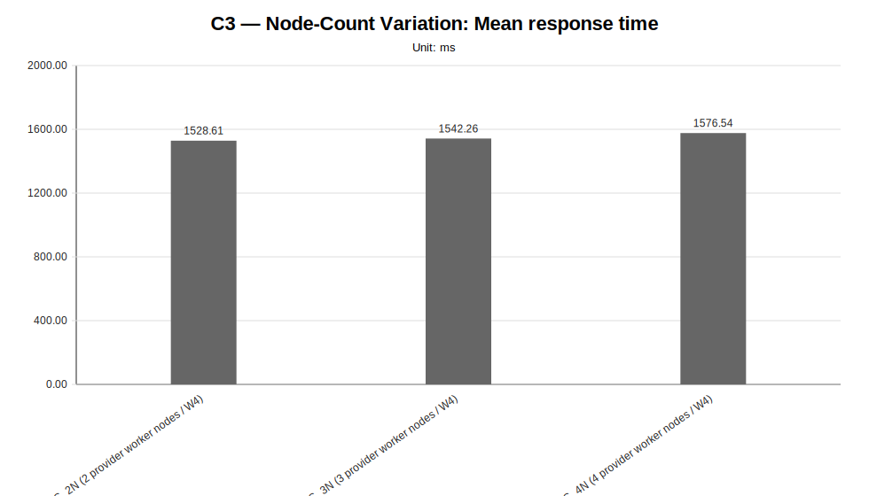
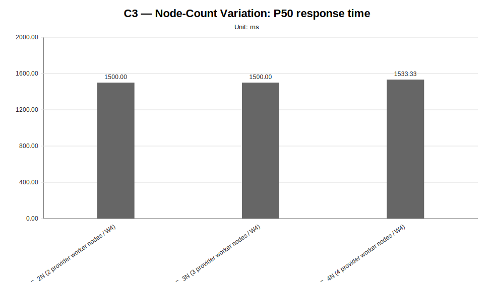
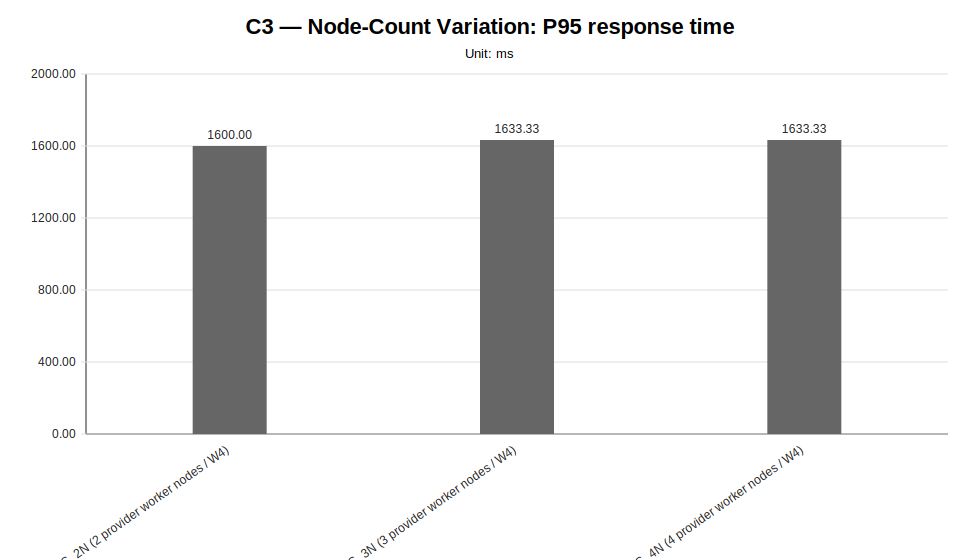
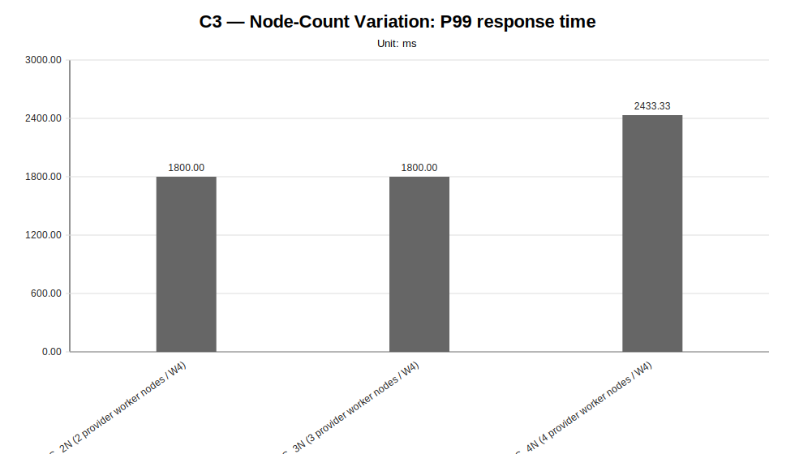
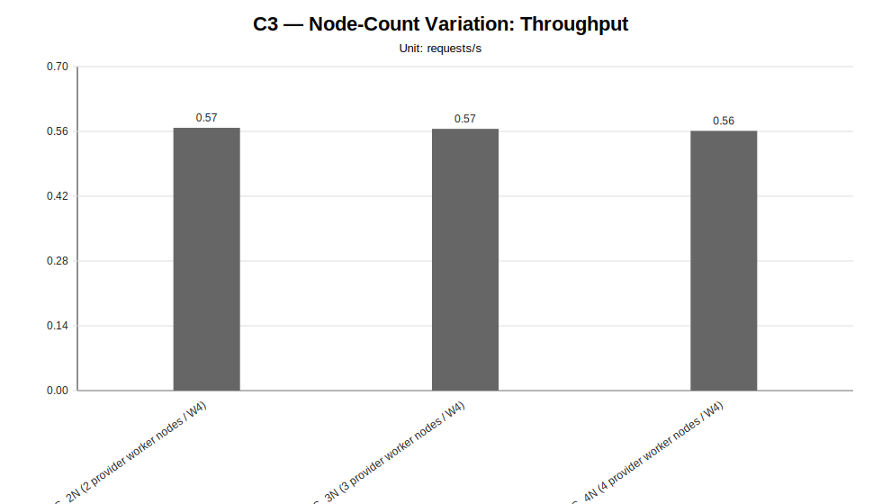
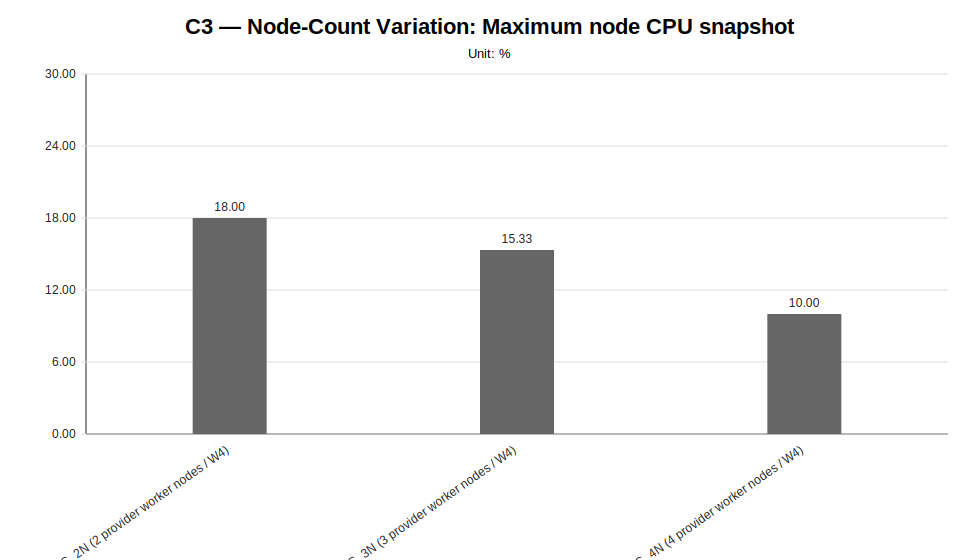
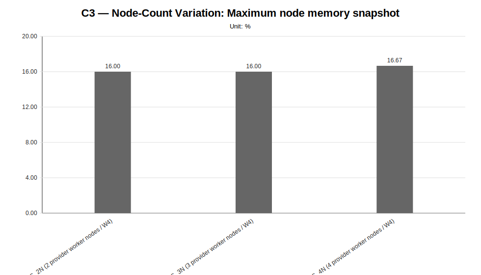
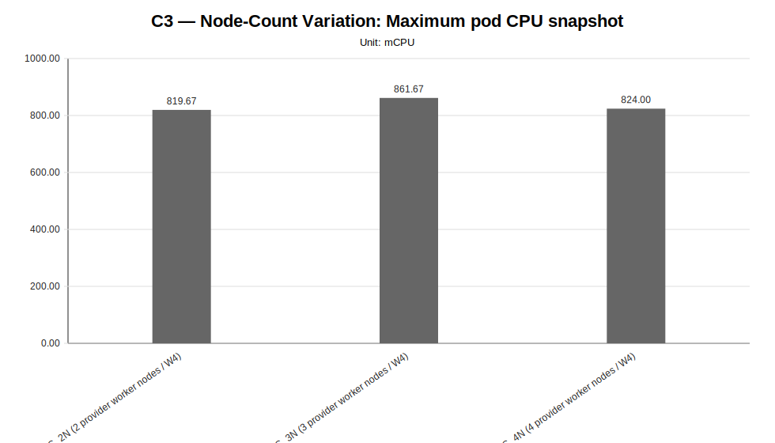
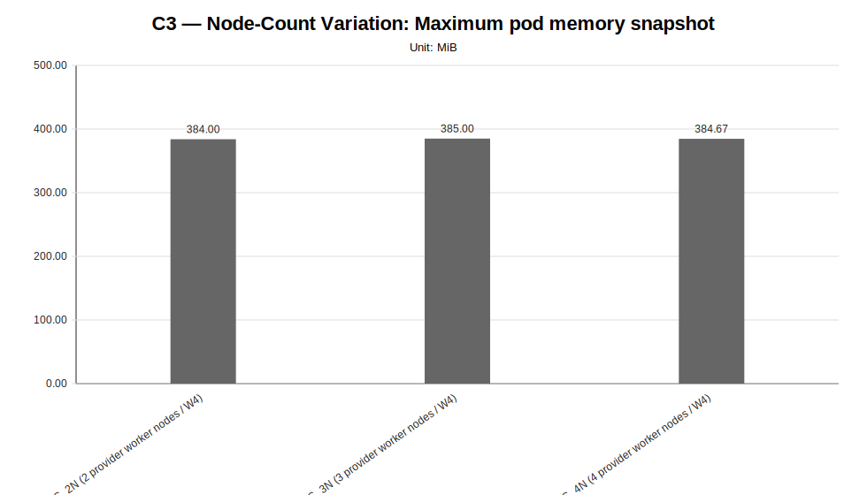

# C3 — Node-Count Variation Report

**Cycle ID:** `C3`
**Reporting Profile:** `RP_C3_NODE_COUNT_VARIATION`
**Reporting ID:** `REP_C3_20260619T174611Z`
**Generated at UTC:** `2026-06-19T17:46:44Z`

## Purpose

This report compares provider worker-node-count variants under fixed LocalAI workload, model, LocalAI worker-count, per-node capacity and placement policy. It is intended to expose whether additional provider worker nodes reduce local contention, remain unused, or introduce distribution overhead.

The report combines **measurement CSV data**, **minimal observability evidence**, **cluster validation outputs**, **application topology metadata** and **technical diagnosis context** when those artifacts are available.

[Back to cycle report index](../../index.html)

## Cross-cycle baseline reference

The values below describe the global baseline configuration used as a cross-cycle reference. Scenario-specific and sweep-local sections report the effective infrastructure, placement, worker count and runtime configuration used by each scenario. Percentage deltas are computed against the family-local reference scenario when one is defined for the sweep.

| Dimension | Reference value |
|---|---|
| Baseline ID | B1 |
| Model | llama-3.2-1b-instruct:q4_k_m |
| Worker count | 2 |
| Placement | colocated_genai_pb_worker_02 |
| Workload | users=2, spawnRate=1, runTime=2m |
| Prompt | Reply with only READY. |
| Request timeout | 120 s |
| Infrastructure profile | INFRA_C1_1CP_2W_8C16G |
| Placement profile | PL_COLOCATED |

## Family-local reference scenarios

The scenarios below are the sweep-local references used to interpret percentage deltas within each family. They may differ from the cross-cycle baseline when a campaign intentionally varies infrastructure, placement, latency or tenancy.

| Sweep | Reference scenario | Description | Status | Varied dimension |
|---|---|---|---|---|
| Node-Count Variation | `NC_2N` | NC_2N (2 provider worker nodes / W4) | measured | provider worker node count |

## Data sources

| Layer | Primary use | Source |
|---|---|---|
| Measurement CSV | Quantitative charts and scenario summary metrics | `{"node-count-variation": "results/experimental-cycles/C3/benchmark/node-count-variation"}` |
| Technical diagnosis | Interpretation, family judgments, findings, unsupported-scenario context | `results/experimental-cycles/C3/diagnosis/analysis_diagnosis_all_NA_20260619T174644Z_diagnosis.json` |
| Scenario configuration | Fixed/varied dimensions and scenario labels | `config/scenarios/**` |
| Cluster-side artifacts | CPU/memory snapshots, pod placement and event evidence | `minimal observability and cluster capture artifacts` |
| Reporting output | Current generated report package | `results/experimental-cycles/C3/reporting` |

## Infrastructure Summary

This reporting profile uses variant-scoped infrastructure: infrastructure profiles are attached to individual scenarios rather than to one fixed cycle-level cluster shape.

| Scenario | Family | Infrastructure profile | Infrastructure profile path | Provider | Provider binding | Worker nodes | Worker vCPU/node | Worker memory/node | Lifecycle mode |
|---|---|---|---|---|---|---|---|---|---|
| `NC_2N` | node-count-variation | INFRA_C3_1CP_2W_8C16G | config/infrastructure/profiles/INFRA_C3_1CP_2W_8C16G.json | proxmox-k3s | BINDING_INFRA_C3_1CP_2W_8C16G_PROXMOX_K3S | 2 | 8 vCPU | 16 GiB | ephemeral |
| `NC_3N` | node-count-variation | INFRA_C3_1CP_3W_8C16G | config/infrastructure/profiles/INFRA_C3_1CP_3W_8C16G.json | proxmox-k3s | BINDING_INFRA_C3_1CP_3W_8C16G_PROXMOX_K3S | 3 | 8 vCPU | 16 GiB | ephemeral |
| `NC_4N` | node-count-variation | INFRA_C3_1CP_4W_8C16G | config/infrastructure/profiles/INFRA_C3_1CP_4W_8C16G.json | proxmox-k3s | BINDING_INFRA_C3_1CP_4W_8C16G_PROXMOX_K3S | 4 | 8 vCPU | 16 GiB | ephemeral |

## Provider Summary

This campaign may resolve provider configuration at scenario or variant level. The table below exposes provider bindings and concrete configuration paths per scenario whenever available.

| Scenario | Family | Provider | Provider binding | Provider binding path | Example config | Local config | Kubeconfig |
|---|---|---|---|---|---|---|---|
| `NC_2N` | node-count-variation | proxmox-k3s | BINDING_INFRA_C3_1CP_2W_8C16G_PROXMOX_K3S | config/infrastructure/providers/proxmox-k3s/bindings/BINDING_INFRA_C3_1CP_2W_8C16G_PROXMOX_K3S.json | config/infrastructure/providers/proxmox-k3s/examples/cluster.c3-1cp-2w-8c16g.example.yaml | config/infrastructure/providers/proxmox-k3s/local/cluster.c3-1cp-2w-8c16g.local.yaml | config/cluster-access/generated/proxmox-k3s/c3-1cp-2w-8c16g/kubeconfig |
| `NC_3N` | node-count-variation | proxmox-k3s | BINDING_INFRA_C3_1CP_3W_8C16G_PROXMOX_K3S | config/infrastructure/providers/proxmox-k3s/bindings/BINDING_INFRA_C3_1CP_3W_8C16G_PROXMOX_K3S.json | config/infrastructure/providers/proxmox-k3s/examples/cluster.c3-1cp-3w-8c16g.example.yaml | config/infrastructure/providers/proxmox-k3s/local/cluster.c3-1cp-3w-8c16g.local.yaml | config/cluster-access/generated/proxmox-k3s/c3-1cp-3w-8c16g/kubeconfig |
| `NC_4N` | node-count-variation | proxmox-k3s | BINDING_INFRA_C3_1CP_4W_8C16G_PROXMOX_K3S | config/infrastructure/providers/proxmox-k3s/bindings/BINDING_INFRA_C3_1CP_4W_8C16G_PROXMOX_K3S.json | config/infrastructure/providers/proxmox-k3s/examples/cluster.c3-1cp-4w-8c16g.example.yaml | config/infrastructure/providers/proxmox-k3s/local/cluster.c3-1cp-4w-8c16g.local.yaml | config/cluster-access/generated/proxmox-k3s/c3-1cp-4w-8c16g/kubeconfig |

## Cluster Validation Summary

| Item | Value |
|---|---|
| Validation profile | CV_PROVIDER_BACKED_VALIDATION_TEMPLATE |
| Profile file | config/cluster-validation/templates/CV_PROVIDER_BACKED_VALIDATION_TEMPLATE.json |
| Latest manifest | variant-scoped validation manifests (3 available) |
| Current status | variant-scoped validation available (3/3 validated) |
| Variant validation statuses | validated=3 |
| Latest raw validation | variant-scoped validation evidence is recorded in the campaign execution manifest and generated runtime profiles under results/experimental-cycles/C3/execution/generated-runtime-configs |
| Accepted provisioning statuses | completed |
| Required kubeconfig status | verified |
| Artifact root | results/experimental-cycles/C3/execution/generated-runtime-configs |

## Runtime Profile Variant Summary

This table links each scenario to the runtime-generated profiles used for precheck, application deployment and minimal observability evidence.

| Scenario | Family | Precheck profile | Precheck profile path | Application deployment profile | Application deployment profile path | Minimal observability profile | Minimal observability profile path | Cluster validation evidence |
|---|---|---|---|---|---|---|---|---|
| `NC_2N` | node-count-variation | TC_C3_NC_2N | results/experimental-cycles/C3/execution/generated-runtime-configs/NC_2N/TC_NC_2N.json | AD_C3_NC_2N | results/experimental-cycles/C3/execution/generated-runtime-configs/NC_2N/AD_NC_2N.json | MO_C3_NC_2N | results/experimental-cycles/C3/execution/generated-runtime-configs/NC_2N/MO_NC_2N.json | results/experimental-cycles/C3/variants/NC_2N/infrastructure/validation/latest-cluster-validation-manifest.json (validated) |
| `NC_3N` | node-count-variation | TC_C3_NC_3N | results/experimental-cycles/C3/execution/generated-runtime-configs/NC_3N/TC_NC_3N.json | AD_C3_NC_3N | results/experimental-cycles/C3/execution/generated-runtime-configs/NC_3N/AD_NC_3N.json | MO_C3_NC_3N | results/experimental-cycles/C3/execution/generated-runtime-configs/NC_3N/MO_NC_3N.json | results/experimental-cycles/C3/variants/NC_3N/infrastructure/validation/latest-cluster-validation-manifest.json (validated) |
| `NC_4N` | node-count-variation | TC_C3_NC_4N | results/experimental-cycles/C3/execution/generated-runtime-configs/NC_4N/TC_NC_4N.json | AD_C3_NC_4N | results/experimental-cycles/C3/execution/generated-runtime-configs/NC_4N/AD_NC_4N.json | MO_C3_NC_4N | results/experimental-cycles/C3/execution/generated-runtime-configs/NC_4N/MO_NC_4N.json | results/experimental-cycles/C3/variants/NC_4N/infrastructure/validation/latest-cluster-validation-manifest.json (validated) |

## Application Topology Summary

This campaign may vary placement, tenancy, latency profile or generated deployment profiles at scenario level. The table below exposes the scenario-level application topology used by each configured variant.

| Scenario | Family | Placement profile | Placement type | Topology dir | Server manifest | Worker count | Active RPC workers | Expected server node | Expected worker nodes | Latency profile | Tenancy profile | Generated deployment profile |
|---|---|---|---|---|---|---|---|---|---|---|---|---|
| `NC_2N` | node-count-variation | PL_SPREAD_WORKERS | spread_workers_across_2_provider_worker_nodes | infra/k8s/compositions/topology/spread-genai-pb-2-worker-nodes-w4 | infra/k8s/compositions/server/models/m1-provider-backed | 4 | localai-rpc-a, localai-rpc-b, localai-rpc-c, localai-rpc-d | genai-pb-worker-02 | localai-rpc-a=genai-pb-worker-01, localai-rpc-b=genai-pb-worker-02, localai-rpc-c=genai-pb-worker-01, localai-rpc-d=genai-pb-worker-02 | not_applicable | not_declared | results/experimental-cycles/C3/execution/generated-runtime-configs/NC_2N/AD_NC_2N.json |
| `NC_3N` | node-count-variation | PL_SPREAD_WORKERS | spread_workers_across_3_provider_worker_nodes | infra/k8s/compositions/topology/spread-genai-pb-3-worker-nodes-w4 | infra/k8s/compositions/server/models/m1-provider-backed | 4 | localai-rpc-a, localai-rpc-b, localai-rpc-c, localai-rpc-d | genai-pb-worker-02 | localai-rpc-a=genai-pb-worker-01, localai-rpc-b=genai-pb-worker-02, localai-rpc-c=genai-pb-worker-03, localai-rpc-d=genai-pb-worker-01 | not_applicable | not_declared | results/experimental-cycles/C3/execution/generated-runtime-configs/NC_3N/AD_NC_3N.json |
| `NC_4N` | node-count-variation | PL_SPREAD_WORKERS | spread_workers_across_4_provider_worker_nodes | infra/k8s/compositions/topology/spread-genai-pb-4-worker-nodes-w4 | infra/k8s/compositions/server/models/m1-provider-backed | 4 | localai-rpc-a, localai-rpc-b, localai-rpc-c, localai-rpc-d | genai-pb-worker-02 | localai-rpc-a=genai-pb-worker-01, localai-rpc-b=genai-pb-worker-02, localai-rpc-c=genai-pb-worker-03, localai-rpc-d=genai-pb-worker-04 | not_applicable | not_declared | results/experimental-cycles/C3/execution/generated-runtime-configs/NC_4N/AD_NC_4N.json |

## Scenario Summary

The following table summarizes the currently available measurement and constraint evidence for all configured reporting families.

| Family | Scenario | Status | Samples | Mean ms | P95 ms | RPS | Unsupported evidence |
|---|---|---|---|---|---|---|---|
| node-count-variation | NC_2N | measured | 3 | 1528.61 | 1600.00 | 0.5677 | NA |
| node-count-variation | NC_3N | measured | 3 | 1542.26 | 1633.33 | 0.5655 | NA |
| node-count-variation | NC_4N | measured | 3 | 1576.54 | 1633.33 | 0.5611 | NA |

## Metrics Summary

The reporting generator first uses minimal observability metrics when available; missing values are filled from scenario-summary aggregates derived from benchmark CSV files and cluster-capture artifacts whenever possible. Values marked as `not_available` were not derivable from the available artifact set and are intentionally distinguished from measured zero values.

| Metric | Value | Source |
|---|---|---|
| request_count | 66.6667 | scenario summary aggregation fallback |
| success_rate_percent | 100.0 | scenario summary aggregation fallback |
| failure_count | 0 | scenario summary aggregation fallback |
| mean_response_time_ms | 1549.1354 | scenario summary aggregation fallback |
| p50_response_time_ms | 1511.1111 | scenario summary aggregation fallback |
| p95_response_time_ms | 1622.2222 | scenario summary aggregation fallback |
| p99_response_time_ms | 2011.1111 | scenario summary aggregation fallback |
| throughput_rps | 0.5648 | scenario summary aggregation fallback |
| max_node_cpu_percent | 14.4444 | scenario summary aggregation fallback |
| max_node_memory_percent | 16.2222 | scenario summary aggregation fallback |
| max_pod_cpu_millicores | 835.1111 | scenario summary aggregation fallback |
| max_pod_memory_mib | 384.5556 | scenario summary aggregation fallback |
| pod_restart_count | 0 | scenario summary aggregation fallback |
| pending_pods_count | 0 | scenario summary aggregation fallback |
| failed_pods_count | 0 | scenario summary aggregation fallback |
| not_ready_pods_count | 0 | scenario summary aggregation fallback |
| kubernetes_events_count | 39 | scenario summary aggregation fallback |
| kubernetes_warning_events_count | 0.3333 | scenario summary aggregation fallback |

## Unsupported Scenario Summary

| Family | Scenario | Status | Evidence | Source |
|---|---|---|---|---|
| all | NA | not_applicable | No unsupported or missing scenario evidence detected in the current reporting inputs. | NA |

## Main Findings

| Family | Finding | Status | Confidence | Implication |
|---|---|---|---|---|
| node-count-variation | The node-count variation family provides comparable infrastructure-size evidence. | comparative_signal_available | medium | The campaign can be used to reason about whether adding provider worker nodes improves distribution and performance, or introduces overhead, while per-node capacity and application-level dimensions remain fixed. |
| node-count-variation | The node-count campaign provides measured evidence across multiple infrastructure sizes. | NA | medium | The evidence can be used to evaluate whether additional provider worker nodes reduce LocalAI contention, introduce communication overhead, or remain unused by the fixed application topology. |
| node-count-variation | The node-count campaign identifies the lowest-latency infrastructure worker-node count among measured variants. | NA | medium | This result provides a controlled signal for the node-count dimension under fixed model, workload, LocalAI worker count, per-node resources and placement policy. |
| baseline | Minimum end-to-end validation is available as a functional reliability baseline. | NA | high | The benchmark pipeline starts from a verified functional baseline rather than from a purely theoretical setup. |

## Sweep-specific reports

The global report below provides the stakeholder-facing overview. Each sweep also has a dedicated report for focused inspection of one varied dimension.

| Sweep | Dedicated HTML report | Execution status | Coverage | Varied dimension |
|---|---|---|---|---|
| Node-Count Variation | [node-count-variation](sweeps/node-count-variation/index.html) | fully_measured | measured=3, unsupported=0, missing=0 | provider worker node count |

## Diagnosis coverage snapshot

| Family | Scenarios | Observed | Measured | Unsupported | Samples |
|---|---|---|---|---|---|
| node-count-variation | 3 | 3 | 3 | 0 | 9 |

## Node-Count Variation

**Execution status:** `fully_measured`

**Execution note:** All configured scenarios in this sweep have measured benchmark samples.

**Varied dimension:** provider worker node count

**Fixed dimensions:** model=M1, LocalAI worker-count=W4, placement=PL_SPREAD_WORKERS, workload=WL2, worker node capacity=8 vCPU / 16 GiB.

**Reference scenario within the sweep:** `NC_2N`

| Scenario count | Measured | Unsupported | Missing |
|---|---|---|---|
| 3 | 3 | 0 | 0 |

### Controlled scenario parameters

This table is derived from resolved scenario metadata. A parameter is marked as controlled only when it has the same effective value across all scenarios in the sweep.

| Parameter | Resolved value | Interpretation |
|---|---|---|
| Model | llama-3.2-1b-instruct:q4_k_m | controlled |
| Worker count | 4 | controlled |
| Placement | varies across scenarios (3 values) | varied or scenario-specific |
| Workload | users=2, spawnRate=1, runTime=2m | controlled |
| Topology | varies across scenarios (3 values) | varied or scenario-specific |
| Server manifest | infra/k8s/compositions/server/models/m1-provider-backed | controlled |
| Prompt | Reply with only READY. | controlled |
| Temperature | 0.1 | controlled |
| Request timeout (s) | 120 | controlled |

### Scenario parameter matrix

| Scenario | Status | Varied value (provider worker node count) | Model | Worker count | Placement | Workload | Timeout (s) |
|---|---|---|---|---|---|---|---|
| `NC_2N` | measured | 2 provider worker nodes / W4 | llama-3.2-1b-instruct:q4_k_m | 4 | spread_workers_across_2_provider_worker_nodes | users=2, spawnRate=1, runTime=2m | 120 |
| `NC_3N` | measured | 3 provider worker nodes / W4 | llama-3.2-1b-instruct:q4_k_m | 4 | spread_workers_across_3_provider_worker_nodes | users=2, spawnRate=1, runTime=2m | 120 |
| `NC_4N` | measured | 4 provider worker nodes / W4 | llama-3.2-1b-instruct:q4_k_m | 4 | spread_workers_across_4_provider_worker_nodes | users=2, spawnRate=1, runTime=2m | 120 |

### Measurement summary

This compact table reports the core indicators used to read the sweep at a glance. Detailed percentiles, deltas and resource snapshots are reported in the following extended table.

| Scenario | Description | Status | Sample count | Mean response time (ms) | P95 response time (ms) | Throughput (requests/s) | Unsupported evidence |
|---|---|---|---|---|---|---|---|
| `NC_2N` | NC_2N (2 provider worker nodes / W4) | measured | 3 | 1528.61 | 1600.00 | 0.5677 |  |
| `NC_3N` | NC_3N (3 provider worker nodes / W4) | measured | 3 | 1542.26 | 1633.33 | 0.5655 |  |
| `NC_4N` | NC_4N (4 provider worker nodes / W4) | measured | 3 | 1576.54 | 1633.33 | 0.5611 |  |

### Extended measurement metrics

This secondary table keeps the additional metrics aligned with the technical diagnosis while avoiding an excessively wide primary summary table.

| Scenario | P50 response time (ms) | P99 response time (ms) | Mean response time delta (%) | P95 response time delta (%) | Throughput delta (%) | Max node CPU snapshot (%) | Max node memory snapshot (%) | Max pod CPU snapshot (mCPU) | Max pod memory snapshot (MiB) |
|---|---|---|---|---|---|---|---|---|---|
| `NC_2N` | 1500.00 | 1800.00 | 0.00 | 0.00 | 0.00 | 18.00 | 16.00 | 819.67 | 384.00 |
| `NC_3N` | 1500.00 | 1800.00 | 0.89 | 2.08 | -0.39 | 15.33 | 16.00 | 861.67 | 385.00 |
| `NC_4N` | 1533.33 | 2433.33 | 3.13 | 2.08 | -1.16 | 10.00 | 16.67 | 824.00 | 384.67 |

### Node-count context

This table makes the infrastructure dimension explicit. The LocalAI worker count, per-node capacity and placement policy are kept fixed while the number of provider worker nodes changes.

| Scenario | Provider worker nodes | LocalAI RPC workers | Per-node capacity | Topology | Observed placement nodes |
|---|---|---|---|---|---|
| `NC_2N` | 2 | 4 | 8 vCPU / 16 GiB | infra/k8s/compositions/topology/spread-genai-pb-2-worker-nodes-w4 | genai-pb-worker-01, genai-pb-worker-02 |
| `NC_3N` | 3 | 4 | 8 vCPU / 16 GiB | infra/k8s/compositions/topology/spread-genai-pb-3-worker-nodes-w4 | genai-pb-worker-01, genai-pb-worker-02, genai-pb-worker-03 |
| `NC_4N` | 4 | 4 | 8 vCPU / 16 GiB | infra/k8s/compositions/topology/spread-genai-pb-4-worker-nodes-w4 | genai-pb-worker-01, genai-pb-worker-02, genai-pb-worker-03, genai-pb-worker-04 |

### Diagnosis-based reading

- **The node-count variation family provides comparable infrastructure-size evidence.** (status: `comparative_signal_available`, confidence: `medium`).
  - Implication: The campaign can be used to reason about whether adding provider worker nodes improves distribution and performance, or introduces overhead, while per-node capacity and application-level dimensions remain fixed.
- **The node-count campaign provides measured evidence across multiple infrastructure sizes.** (confidence: `medium`).
  - Implication: The evidence can be used to evaluate whether additional provider worker nodes reduce LocalAI contention, introduce communication overhead, or remain unused by the fixed application topology.
- **The node-count campaign identifies the lowest-latency infrastructure worker-node count among measured variants.** (confidence: `medium`).
  - Implication: This result provides a controlled signal for the node-count dimension under fixed model, workload, LocalAI worker count, per-node resources and placement policy.

### Charts

#### Mean response time

#### P50 response time

#### P95 response time

#### P99 response time

#### Throughput

#### Maximum node CPU snapshot

#### Maximum node memory snapshot

#### Maximum pod CPU snapshot

#### Maximum pod memory snapshot

### Reading notes

- Measured scenarios: **3**.
- Unsupported scenarios under current constraints: **0**.
- Percentage deltas are computed against the family reference scenario; positive latency deltas indicate worse response time, while positive throughput deltas indicate higher request throughput.
- Unsupported scenarios are infrastructure/constraint observations and must not be interpreted as measured latency regressions.
- A `not_executed` sweep means that neither measurement CSV files nor unsupported-scenario evidence were found for any configured scenario in that family.

> Only provider worker-node count is varied in this campaign; model, workload, LocalAI worker-count, per-node capacity and placement policy remain fixed.
> The fixed W4 application topology is spread over the available provider worker nodes so the infrastructure-size dimension can produce observable distribution differences.
> If fewer than two node-count variants are measured, the report must present the campaign as insufficient comparative evidence while preserving unsupported variants as capacity or scheduling evidence.
