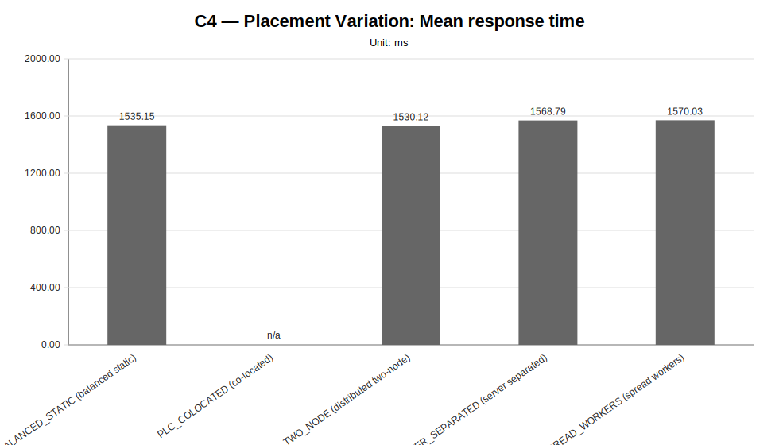
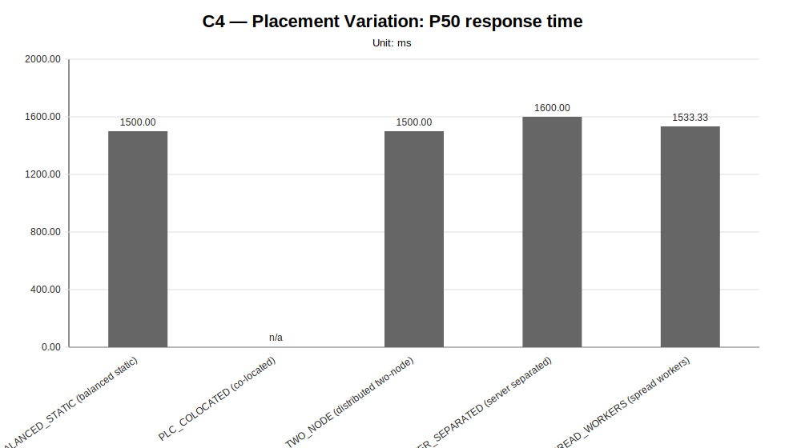
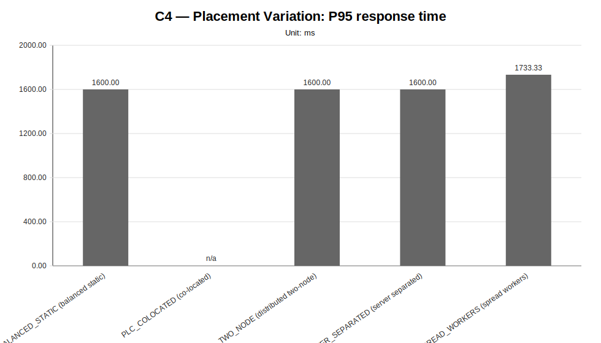
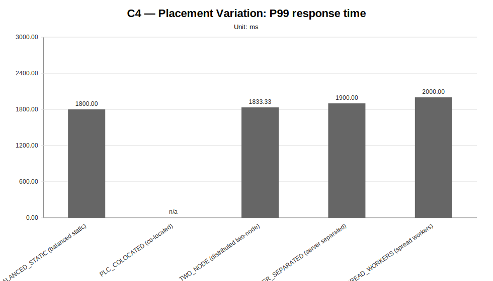
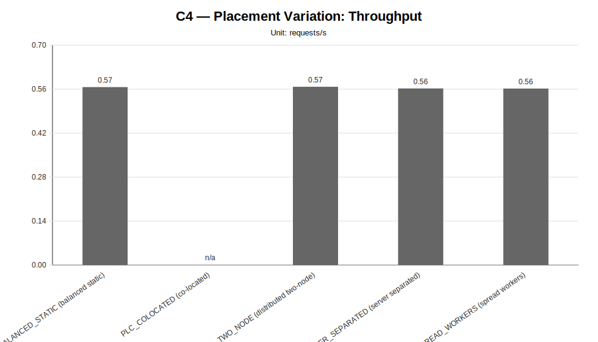
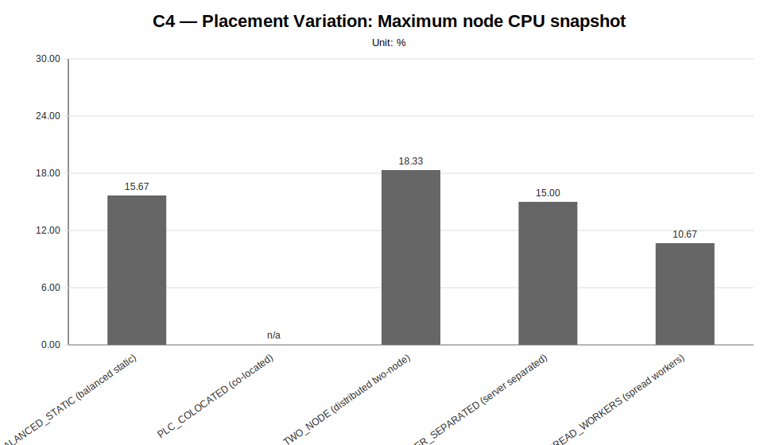
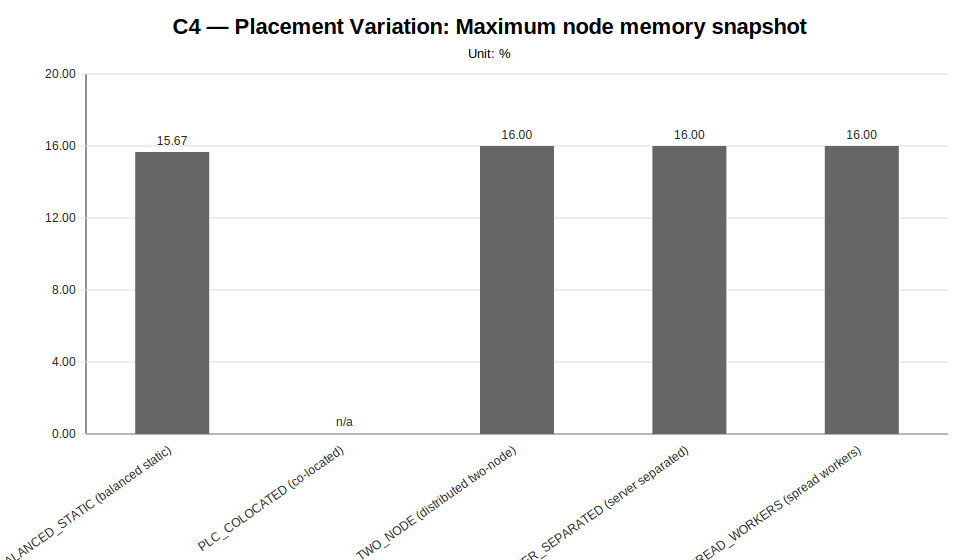
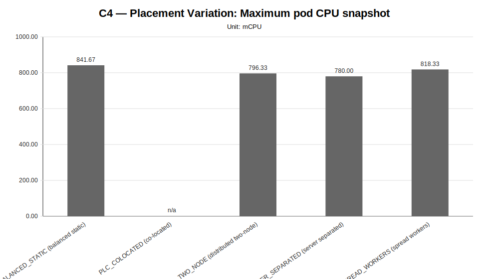
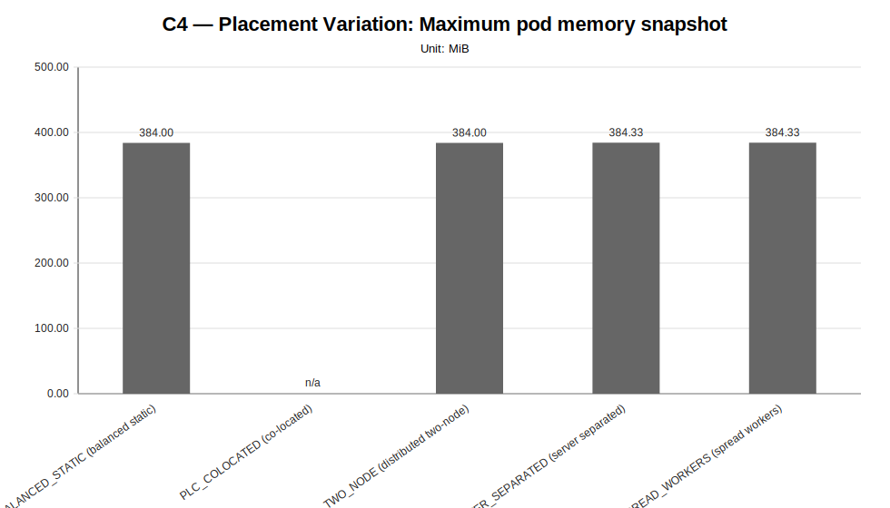

# C4 — Placement Variation Sweep Report

**Cycle ID:** `C4`
**Sweep:** `placement-variation`
**Reporting Profile:** `RP_C4_PLACEMENT_VARIATION`
**Reporting ID:** `REP_C4_20260619T174611Z`
**Generated at UTC:** `2026-06-19T17:46:54Z`

[Back to cycle report](../../index.html)

## Scope

This sweep-specific report isolates **Placement Variation** so that the varied dimension, fixed dimensions, measured values, unsupported evidence and diagnosis-based reading can be inspected without navigating the full consolidated report.

## Placement Variation

**Execution status:** `partially_measured`

**Execution note:** At least one configured scenario has measured benchmark samples, while other scenarios are missing or unsupported.

**Varied dimension:** placement profile

**Fixed dimensions:** infrastructure=INFRA_C4_1CP_4W_8C16G, model=M1, LocalAI worker-count=W4, workload=WL2, worker node capacity=8 vCPU / 16 GiB.

**Reference scenario within the sweep:** `PLC_SPREAD_WORKERS`

| Scenario count | Measured | Unsupported | Missing |
|---|---|---|---|
| 5 | 4 | 1 | 0 |

### Controlled scenario parameters

This table is derived from resolved scenario metadata. A parameter is marked as controlled only when it has the same effective value across all scenarios in the sweep.

| Parameter | Resolved value | Interpretation |
|---|---|---|
| Model | llama-3.2-1b-instruct:q4_k_m | controlled |
| Worker count | 4 | controlled |
| Placement | varies across scenarios (5 values) | varied or scenario-specific |
| Workload | users=2, spawnRate=1, runTime=2m | controlled |
| Topology | varies across scenarios (5 values) | varied or scenario-specific |
| Server manifest | varies across scenarios (2 values) | varied or scenario-specific |
| Prompt | Reply with only READY. | controlled |
| Temperature | 0.1 | controlled |
| Request timeout (s) | 120 | controlled |

### Scenario parameter matrix

| Scenario | Status | Varied value (placement profile) | Model | Worker count | Placement | Workload | Timeout (s) |
|---|---|---|---|---|---|---|---|
| `PLC_BALANCED_STATIC` | measured | balanced static | llama-3.2-1b-instruct:q4_k_m | 4 | balanced_static_server_with_partial_worker_colocation | users=2, spawnRate=1, runTime=2m | 120 |
| `PLC_COLOCATED` | unsupported_under_current_constraints | co-located | llama-3.2-1b-instruct:q4_k_m | 4 | colocated_server_and_workers_on_genai_pb_worker_02 | users=2, spawnRate=1, runTime=2m | 120 |
| `PLC_DISTRIBUTED_TWO_NODE` | measured | distributed two-node | llama-3.2-1b-instruct:q4_k_m | 4 | distributed_workers_across_two_provider_worker_nodes | users=2, spawnRate=1, runTime=2m | 120 |
| `PLC_SERVER_SEPARATED` | measured | server separated | llama-3.2-1b-instruct:q4_k_m | 4 | server_separated_from_spread_workers | users=2, spawnRate=1, runTime=2m | 120 |
| `PLC_SPREAD_WORKERS` | measured | spread workers | llama-3.2-1b-instruct:q4_k_m | 4 | spread_workers_across_four_provider_worker_nodes | users=2, spawnRate=1, runTime=2m | 120 |

### Measurement summary

This compact table reports the core indicators used to read the sweep at a glance. Detailed percentiles, deltas and resource snapshots are reported in the following extended table.

| Scenario | Description | Status | Sample count | Mean response time (ms) | P95 response time (ms) | Throughput (requests/s) | Unsupported evidence |
|---|---|---|---|---|---|---|---|
| `PLC_BALANCED_STATIC` | PLC_BALANCED_STATIC (balanced static) | measured | 3 | 1535.15 | 1600.00 | 0.5666 |  |
| `PLC_COLOCATED` | PLC_COLOCATED (co-located) | unsupported_under_current_constraints | 0 | n/a | n/a | n/a | benchmark_precheck, cluster_nodes_ready, metrics_api_and_capacity, namespace_active, namespace_pods_healthy, none_or_within_strict_threshold, pending_pod, service_endpoint_and_model, worker_nodes_expected |
| `PLC_DISTRIBUTED_TWO_NODE` | PLC_DISTRIBUTED_TWO_NODE (distributed two-node) | measured | 3 | 1530.12 | 1600.00 | 0.5676 |  |
| `PLC_SERVER_SEPARATED` | PLC_SERVER_SEPARATED (server separated) | measured | 3 | 1568.79 | 1600.00 | 0.5623 |  |
| `PLC_SPREAD_WORKERS` | PLC_SPREAD_WORKERS (spread workers) | measured | 3 | 1570.03 | 1733.33 | 0.5619 |  |

### Extended measurement metrics

This secondary table keeps the additional metrics aligned with the technical diagnosis while avoiding an excessively wide primary summary table.

| Scenario | P50 response time (ms) | P99 response time (ms) | Mean response time delta (%) | P95 response time delta (%) | Throughput delta (%) | Max node CPU snapshot (%) | Max node memory snapshot (%) | Max pod CPU snapshot (mCPU) | Max pod memory snapshot (MiB) |
|---|---|---|---|---|---|---|---|---|---|
| `PLC_BALANCED_STATIC` | 1500.00 | 1800.00 | -2.22 | -7.69 | 0.84 | 15.67 | 15.67 | 841.67 | 384.00 |
| `PLC_COLOCATED` | n/a | n/a | n/a | n/a | n/a | n/a | n/a | n/a | n/a |
| `PLC_DISTRIBUTED_TWO_NODE` | 1500.00 | 1833.33 | -2.54 | -7.69 | 1.01 | 18.33 | 16.00 | 796.33 | 384.00 |
| `PLC_SERVER_SEPARATED` | 1600.00 | 1900.00 | -0.08 | -7.69 | 0.07 | 15.00 | 16.00 | 780.00 | 384.33 |
| `PLC_SPREAD_WORKERS` | 1533.33 | 2000.00 | 0.00 | 0.00 | 0.00 | 10.67 | 16.00 | 818.33 | 384.33 |

### Placement context

This table makes the placement dimension explicit. Infrastructure, model, workload and LocalAI worker count are kept fixed while server and RPC-worker placement changes.

| Scenario | Placement | Profile | Server node | Worker node map | Communication distance | Resource contention |
|---|---|---|---|---|---|---|
| `PLC_BALANCED_STATIC` | balanced static | PL_BALANCED_STATIC | genai-pb-worker-02 | localai-rpc-a=genai-pb-worker-01, localai-rpc-b=genai-pb-worker-02, localai-rpc-c=genai-pb-worker-03, localai-rpc-d=genai-pb-worker-02 | medium | medium |
| `PLC_COLOCATED` | co-located | PL_COLOCATED | genai-pb-worker-02 | localai-rpc-a=genai-pb-worker-02, localai-rpc-b=genai-pb-worker-02, localai-rpc-c=genai-pb-worker-02, localai-rpc-d=genai-pb-worker-02 | minimal | highest |
| `PLC_DISTRIBUTED_TWO_NODE` | distributed two-node | PL_DISTRIBUTED_TWO_NODE | genai-pb-worker-02 | localai-rpc-a=genai-pb-worker-01, localai-rpc-b=genai-pb-worker-02, localai-rpc-c=genai-pb-worker-01, localai-rpc-d=genai-pb-worker-02 | medium | medium_high |
| `PLC_SERVER_SEPARATED` | server separated | PL_SERVER_SEPARATED | genai-pb-worker-01 | localai-rpc-a=genai-pb-worker-02, localai-rpc-b=genai-pb-worker-03, localai-rpc-c=genai-pb-worker-04, localai-rpc-d=genai-pb-worker-02 | highest | low |
| `PLC_SPREAD_WORKERS` | spread workers | PL_SPREAD_WORKERS | genai-pb-worker-02 | localai-rpc-a=genai-pb-worker-01, localai-rpc-b=genai-pb-worker-02, localai-rpc-c=genai-pb-worker-03, localai-rpc-d=genai-pb-worker-04 | higher | lowest |

### Diagnosis-based reading

- **The placement variation family provides comparable placement evidence.** (status: `comparative_signal_available`, confidence: `medium`).
  - Implication: The campaign can be used to reason about the communication-vs-contention trade-off because infrastructure, model, workload and LocalAI worker count remain fixed while only placement changes.
- **The placement campaign provides measured evidence across multiple placement policies.** (confidence: `medium`).
  - Implication: The evidence can be used to evaluate whether communication-distance reduction or resource-contention reduction dominates under the fixed infrastructure and workload.
- **The placement campaign identifies the lowest-latency placement among measured variants.** (confidence: `medium`).
  - Implication: This result provides a controlled signal for placement selection under fixed infrastructure, model, workload and LocalAI worker count.
- **At least one placement scenario produced unsupported evidence under the current constraints.** (confidence: `medium`).
  - Implication: Unsupported placement variants should be treated as contention, capacity or scheduling evidence and not as measured performance regressions.

### Charts

#### Mean response time

#### P50 response time

#### P95 response time

#### P99 response time

#### Throughput

#### Maximum node CPU snapshot

#### Maximum node memory snapshot

#### Maximum pod CPU snapshot

#### Maximum pod memory snapshot

### Reading notes

- Measured scenarios: **4**.
- Unsupported scenarios under current constraints: **1**.
- Percentage deltas are computed against the family reference scenario; positive latency deltas indicate worse response time, while positive throughput deltas indicate higher request throughput.
- Unsupported scenarios are infrastructure/constraint observations and must not be interpreted as measured latency regressions.
- A `not_executed` sweep means that neither measurement CSV files nor unsupported-scenario evidence were found for any configured scenario in that family.
