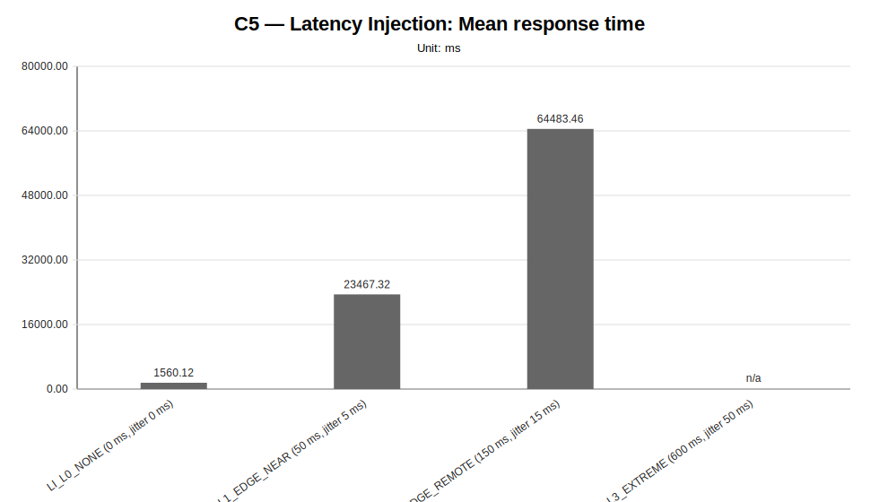
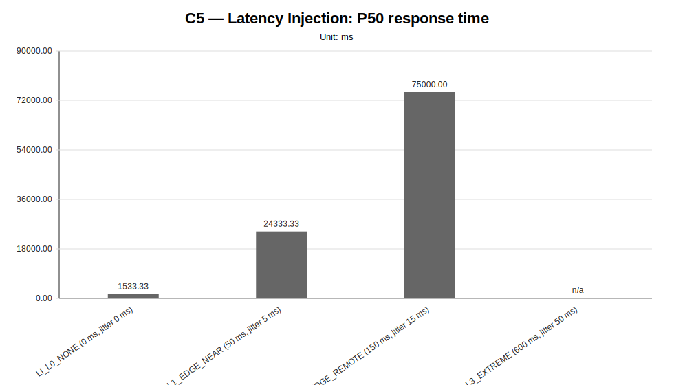
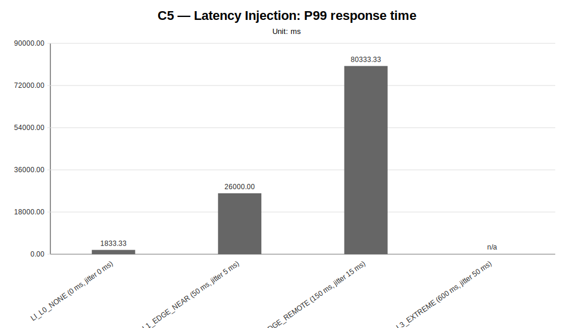
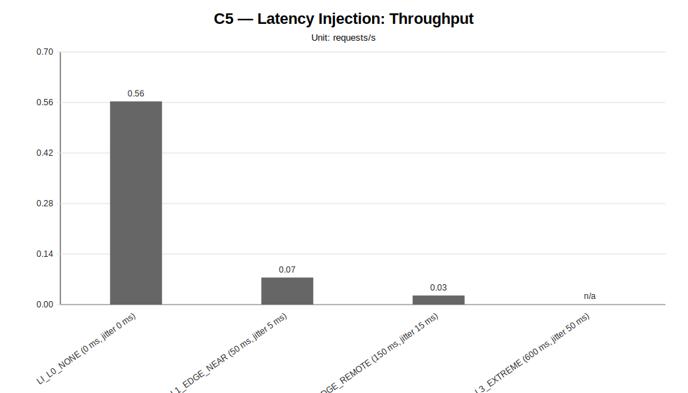
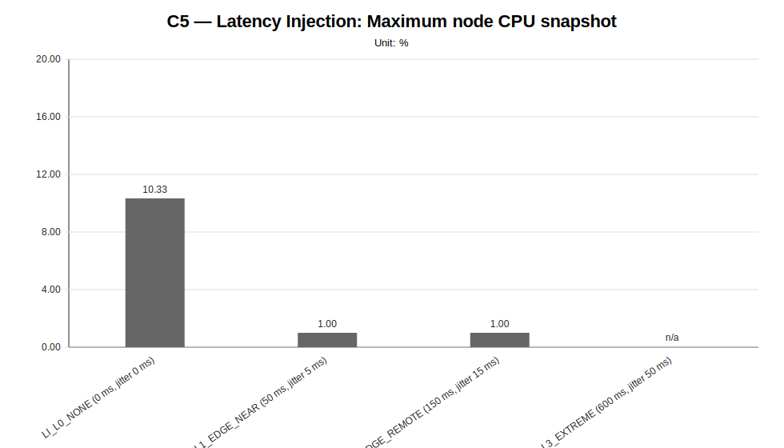
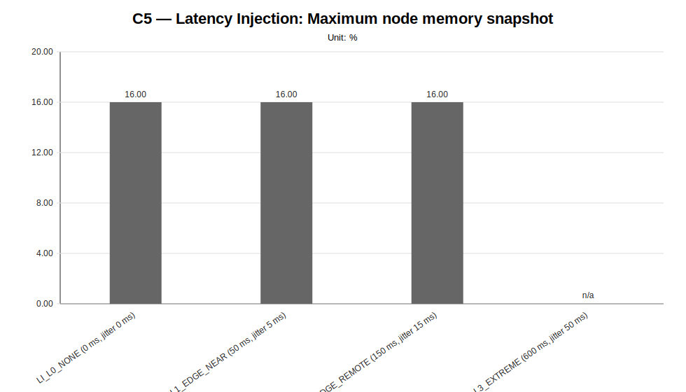
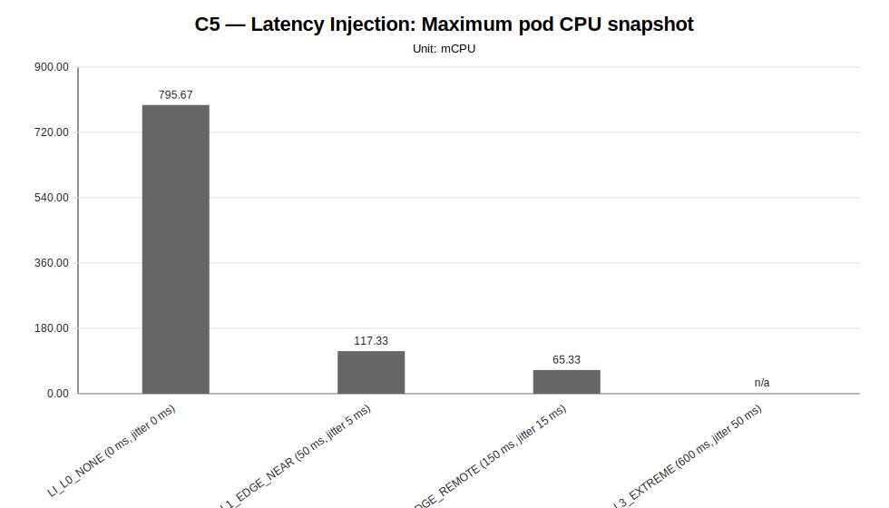
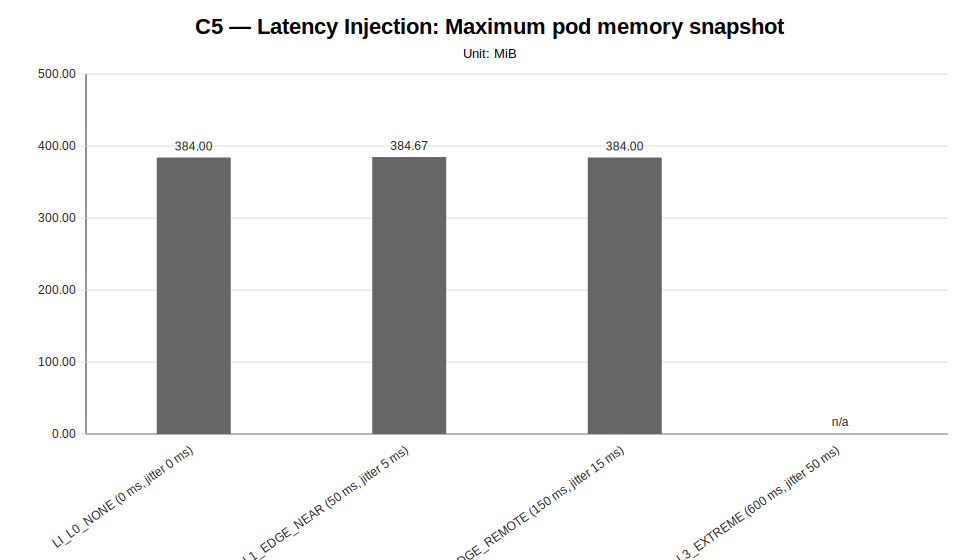

# C5 — Latency Injection Sweep Report

**Cycle ID:** `C5`
**Sweep:** `latency-injection`
**Reporting Profile:** `RP_C5_LATENCY_INJECTION`
**Reporting ID:** `REP_C5_20260619T174611Z`
**Generated at UTC:** `2026-06-19T17:47:11Z`

[Back to cycle report](../../index.html)

## Scope

This sweep-specific report isolates **Latency Injection** so that the varied dimension, fixed dimensions, measured values, unsupported evidence and diagnosis-based reading can be inspected without navigating the full consolidated report.

## Latency Injection

**Execution status:** `partially_measured`

**Execution note:** At least one configured scenario has measured benchmark samples, while other scenarios are missing or unsupported.

**Varied dimension:** latency profile

**Fixed dimensions:** infrastructure=INFRA_C5_1CP_4W_8C16G, model=M1, LocalAI worker-count=W4, workload=WL2, placement=PL_SPREAD_WORKERS, worker node capacity=8 vCPU / 16 GiB.

**Reference scenario within the sweep:** `LI_L0_NONE`

| Scenario count | Measured | Unsupported | Missing |
|---|---|---|---|
| 4 | 3 | 1 | 0 |

### Controlled scenario parameters

This table is derived from resolved scenario metadata. A parameter is marked as controlled only when it has the same effective value across all scenarios in the sweep.

| Parameter | Resolved value | Interpretation |
|---|---|---|
| Model | llama-3.2-1b-instruct:q4_k_m | controlled |
| Worker count | 4 | controlled |
| Placement | spread_workers_across_four_provider_worker_nodes | controlled |
| Workload | users=2, spawnRate=1, runTime=2m | controlled |
| Topology | infra/k8s/compositions/topology/spread-genai-pb-4-worker-nodes-w4 | controlled |
| Server manifest | infra/k8s/compositions/server/models/m1-provider-backed | controlled |
| Prompt | Reply with only READY. | controlled |
| Temperature | 0.1 | controlled |
| Request timeout (s) | 120 | controlled |

### Scenario parameter matrix

| Scenario | Status | Varied value (latency profile) | Model | Worker count | Placement | Workload | Timeout (s) |
|---|---|---|---|---|---|---|---|
| `LI_L0_NONE` | measured | 0 ms delay / 0 ms jitter / 0.0% loss | llama-3.2-1b-instruct:q4_k_m | 4 | spread_workers_across_four_provider_worker_nodes | users=2, spawnRate=1, runTime=2m | 120 |
| `LI_L1_EDGE_NEAR` | measured | 50 ms delay / 5 ms jitter / 0.0% loss | llama-3.2-1b-instruct:q4_k_m | 4 | spread_workers_across_four_provider_worker_nodes | users=2, spawnRate=1, runTime=2m | 120 |
| `LI_L2_EDGE_REMOTE` | measured | 150 ms delay / 15 ms jitter / 0.0% loss | llama-3.2-1b-instruct:q4_k_m | 4 | spread_workers_across_four_provider_worker_nodes | users=2, spawnRate=1, runTime=2m | 120 |
| `LI_L3_EXTREME` | unsupported_under_current_constraints | 600 ms delay / 50 ms jitter / 0.0% loss | llama-3.2-1b-instruct:q4_k_m | 4 | spread_workers_across_four_provider_worker_nodes | users=2, spawnRate=1, runTime=2m | 120 |

### Measurement summary

This compact table reports the core indicators used to read the sweep at a glance. Detailed percentiles, deltas and resource snapshots are reported in the following extended table.

| Scenario | Description | Status | Sample count | Mean response time (ms) | P95 response time (ms) | Throughput (requests/s) | Unsupported evidence |
|---|---|---|---|---|---|---|---|
| `LI_L0_NONE` | LI_L0_NONE (0 ms, jitter 0 ms) | measured | 3 | 1560.12 | 1600.00 | 0.5630 |  |
| `LI_L1_EDGE_NEAR` | LI_L1_EDGE_NEAR (50 ms, jitter 5 ms) | measured | 3 | 23467.32 | 26000.00 | 0.0749 |  |
| `LI_L2_EDGE_REMOTE` | LI_L2_EDGE_REMOTE (150 ms, jitter 15 ms) | measured | 3 | 64483.46 | 80333.33 | 0.0251 |  |
| `LI_L3_EXTREME` | LI_L3_EXTREME (600 ms, jitter 50 ms) | unsupported_under_current_constraints | 0 | n/a | n/a | n/a | all_worker_nodes_from_infrastructure_profile, api_smoke_failed, api_smoke_or_pre_benchmark_api_unavailable, latency_injection, latency_injection_pre_benchmark, measurement_stats_csv_missing, pre_benchmark_failure |

### Extended measurement metrics

This secondary table keeps the additional metrics aligned with the technical diagnosis while avoiding an excessively wide primary summary table.

| Scenario | P50 response time (ms) | P99 response time (ms) | Mean response time delta (%) | P95 response time delta (%) | Throughput delta (%) | Max node CPU snapshot (%) | Max node memory snapshot (%) | Max pod CPU snapshot (mCPU) | Max pod memory snapshot (MiB) |
|---|---|---|---|---|---|---|---|---|---|
| `LI_L0_NONE` | 1533.33 | 1833.33 | 0.00 | 0.00 | 0.00 | 10.33 | 16.00 | 795.67 | 384.00 |
| `LI_L1_EDGE_NEAR` | 24333.33 | 26000.00 | 1404.20 | 1525.00 | -86.70 | 1.00 | 16.00 | 117.33 | 384.67 |
| `LI_L2_EDGE_REMOTE` | 75000.00 | 80333.33 | 4033.24 | 4920.83 | -95.54 | 1.00 | 16.00 | 65.33 | 384.00 |
| `LI_L3_EXTREME` | n/a | n/a | n/a | n/a | n/a | n/a | n/a | n/a | n/a |

### Latency-injection context

This table makes the network-emulation dimension explicit. Infrastructure, model, workload, LocalAI worker count and placement are kept fixed while the injected latency profile changes.

| Scenario | Latency profile | Category | Target node policy | Delay (ms) | Jitter (ms) | Packet loss (%) | Interface | Reset after benchmark | Execution status | Unsupported reason |
|---|---|---|---|---|---|---|---|---|---|---|
| `LI_L0_NONE` | L0_NONE | none | all_worker_nodes_from_infrastructure_profile | 0 | 0 | 0.0 | eth0 | yes | measured | none |
| `LI_L1_EDGE_NEAR` | L1_EDGE_NEAR | edge_near | all_worker_nodes_from_infrastructure_profile | 50 | 5 | 0.0 | eth0 | yes | measured | none |
| `LI_L2_EDGE_REMOTE` | L2_EDGE_REMOTE | edge_remote | all_worker_nodes_from_infrastructure_profile | 150 | 15 | 0.0 | eth0 | yes | measured | none |
| `LI_L3_EXTREME` | L3_EXTREME | extreme | all_worker_nodes_from_infrastructure_profile | 600 | 50 | 0.0 | eth0 | yes | unsupported_under_current_constraints | latency_profile_pre_benchmark_api_unavailable, latency_profile_pre_benchmark_api_unavailable, latency_profile_pre_benchmark_api_unavailable |

### Diagnosis-based reading

- **The latency-injection family provides comparable network-sensitivity evidence.** (status: `comparative_signal_available`, confidence: `medium`).
  - Implication: The campaign can be used to reason about when injected inter-node latency degrades LocalAI worker-mode behavior because infrastructure, model, workload, worker count and placement remain fixed while only latency changes.
- **The latency-injection campaign provides measured evidence across multiple network-latency profiles.** (confidence: `medium`).
  - Implication: The evidence can be used to evaluate whether inter-node communication delay becomes a dominant factor under the fixed distributed placement.
- **The latency-injection campaign identifies the highest-latency measured profile.** (confidence: `medium`).
  - Implication: This result provides a controlled signal for deciding when distributed worker placement becomes sensitive to network delay.
- **At least one latency-injection scenario produced unsupported evidence under the current constraints.** (confidence: `medium`).
  - Implication: Unsupported latency variants should be treated as instrumentation, timeout or network-sensitivity evidence and not as ordinary benchmark failures.

### Charts

#### Mean response time

#### P50 response time

#### P95 response time

#### P99 response time

#### Throughput

#### Maximum node CPU snapshot

#### Maximum node memory snapshot

#### Maximum pod CPU snapshot

#### Maximum pod memory snapshot

### Reading notes

- Measured scenarios: **3**.
- Unsupported scenarios under current constraints: **1**.
- Percentage deltas are computed against the family reference scenario; positive latency deltas indicate worse response time, while positive throughput deltas indicate higher request throughput.
- Unsupported scenarios are infrastructure/constraint observations and must not be interpreted as measured latency regressions.
- A `not_executed` sweep means that neither measurement CSV files nor unsupported-scenario evidence were found for any configured scenario in that family.
