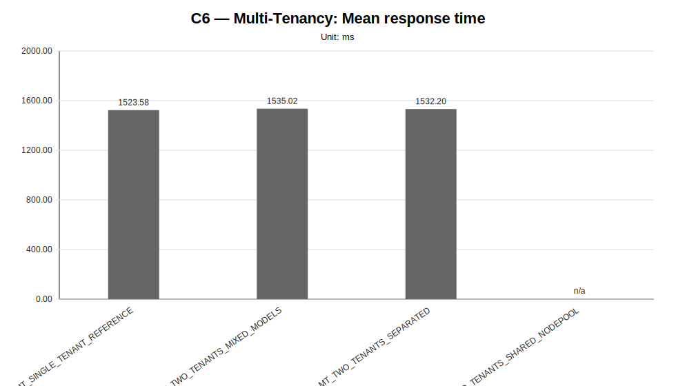
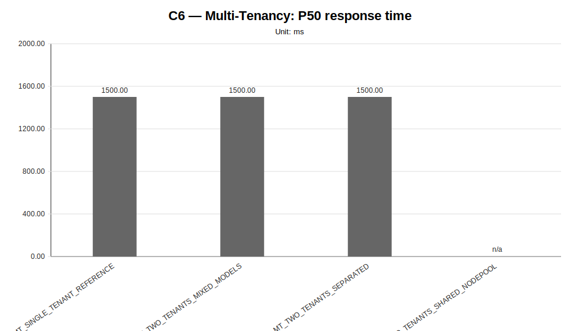
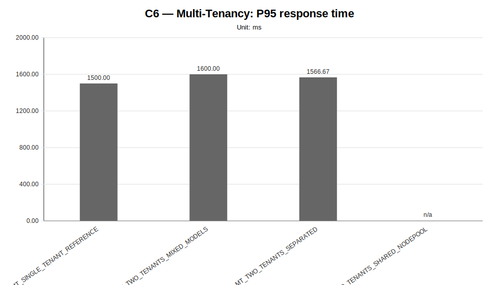
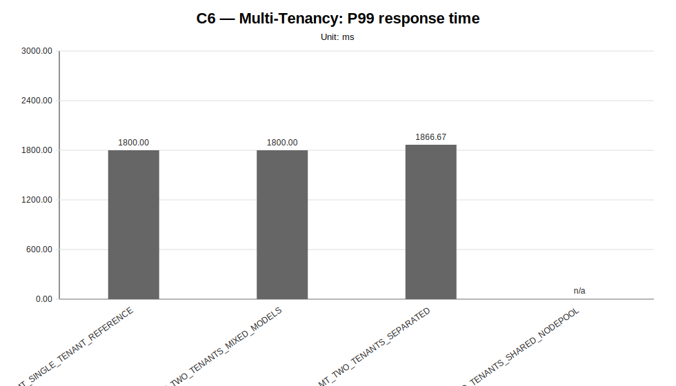
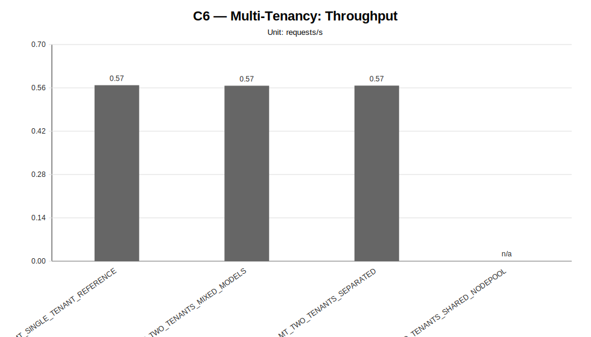
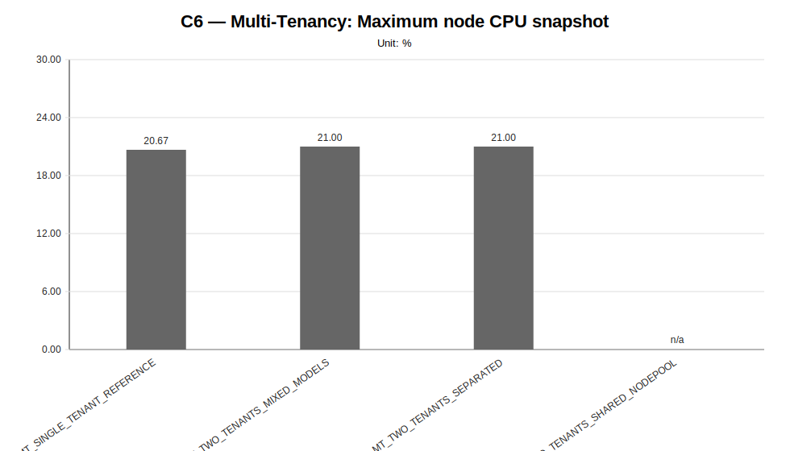
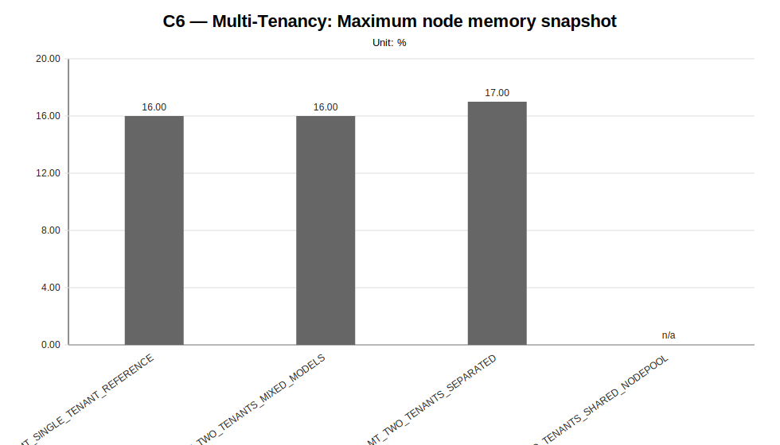
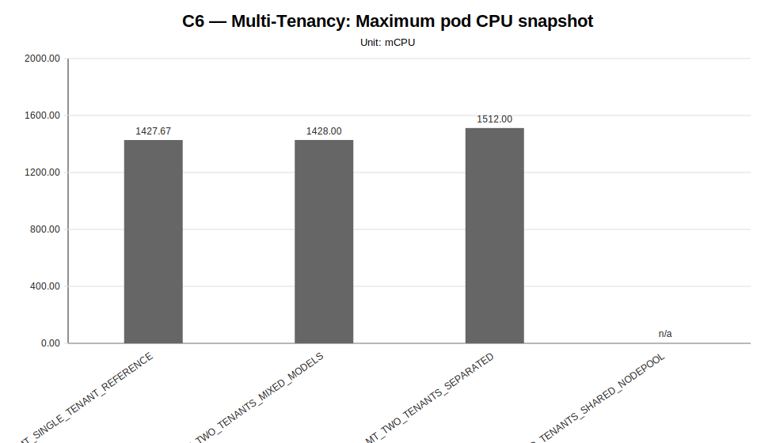
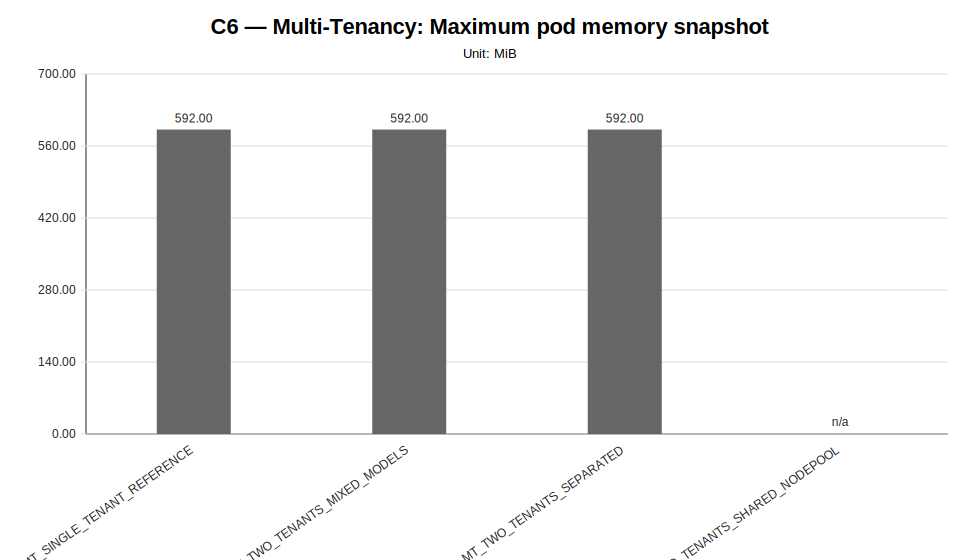

# C6 — Multi-Tenancy Sweep Report

**Cycle ID:** `C6`
**Sweep:** `multi-tenancy`
**Reporting Profile:** `RP_C6_MULTI_TENANCY`
**Reporting ID:** `REP_C6_20260619T174611Z`
**Generated at UTC:** `2026-06-19T17:47:25Z`

[Back to cycle report](../../index.html)

## Scope

This sweep-specific report isolates **Multi-Tenancy** so that the varied dimension, fixed dimensions, measured values, unsupported evidence and diagnosis-based reading can be inspected without navigating the full consolidated report.

## Multi-Tenancy

**Execution status:** `partially_measured`

**Execution note:** At least one configured scenario has measured benchmark samples, while other scenarios are missing or unsupported.

**Varied dimension:** tenant topology

**Fixed dimensions:** infrastructure=INFRA_C6_1CP_4W_8C16G, benchmark tenant=tenant-a, primary model=M1, primary worker-count=W2, workload=WL2.

**Reference scenario within the sweep:** `MT_SINGLE_TENANT_REFERENCE`

| Scenario count | Measured | Unsupported | Missing |
|---|---|---|---|
| 4 | 3 | 1 | 0 |

### Controlled scenario parameters

This table is derived from resolved scenario metadata. A parameter is marked as controlled only when it has the same effective value across all scenarios in the sweep.

| Parameter | Resolved value | Interpretation |
|---|---|---|
| Model | varies across scenarios (2 values) | varied or scenario-specific |
| Worker count | 2 | controlled |
| Placement | tenant_primary_distributed_two_node | controlled |
| Workload | users=2, spawnRate=1, runTime=2m | controlled |
| Topology | varies across scenarios (4 values) | varied or scenario-specific |
| Server manifest | varies across scenarios (4 values) | varied or scenario-specific |
| Prompt | Reply with only READY. | controlled |
| Temperature | 0.1 | controlled |
| Request timeout (s) | 120 | controlled |

### Scenario parameter matrix

| Scenario | Status | Varied value (tenant topology) | Model | Worker count | Placement | Workload | Timeout (s) |
|---|---|---|---|---|---|---|---|
| `MT_SINGLE_TENANT_REFERENCE` | measured | single tenant reference | llama-3.2-1b-instruct:q4_k_m | 2 | tenant_primary_distributed_two_node | users=2, spawnRate=1, runTime=2m | 120 |
| `MT_TWO_TENANTS_MIXED_MODELS` | measured | two tenants mixed models | tenant-a=llama-3.2-1b-instruct:q4_k_m; tenant-b=llama-3.2-1b-instruct:q8_0 | 2 | tenant_primary_distributed_two_node | users=2, spawnRate=1, runTime=2m | 120 |
| `MT_TWO_TENANTS_SEPARATED` | measured | two tenants separated | llama-3.2-1b-instruct:q4_k_m | 2 | tenant_primary_distributed_two_node | users=2, spawnRate=1, runTime=2m | 120 |
| `MT_TWO_TENANTS_SHARED_NODEPOOL` | unsupported_under_current_constraints | two tenants shared node pool | tenant-a=llama-3.2-1b-instruct:q4_k_m; tenant-b=llama-3.2-1b-instruct:q8_0 | 2 | tenant_primary_distributed_two_node | users=2, spawnRate=1, runTime=2m | 120 |

### Measurement summary

This compact table reports the core indicators used to read the sweep at a glance. Detailed percentiles, deltas and resource snapshots are reported in the following extended table.

| Scenario | Description | Status | Sample count | Mean response time (ms) | P95 response time (ms) | Throughput (requests/s) | Unsupported evidence |
|---|---|---|---|---|---|---|---|
| `MT_SINGLE_TENANT_REFERENCE` | MT_SINGLE_TENANT_REFERENCE | measured | 3 | 1523.58 | 1500.00 | 0.5686 |  |
| `MT_TWO_TENANTS_MIXED_MODELS` | MT_TWO_TENANTS_MIXED_MODELS | measured | 3 | 1535.02 | 1600.00 | 0.5669 |  |
| `MT_TWO_TENANTS_SEPARATED` | MT_TWO_TENANTS_SEPARATED | measured | 3 | 1532.20 | 1566.67 | 0.5673 |  |
| `MT_TWO_TENANTS_SHARED_NODEPOOL` | MT_TWO_TENANTS_SHARED_NODEPOOL | unsupported_under_current_constraints | 0 | n/a | n/a | n/a | application_not_ready, failed_scheduling, insufficient_memory, latency_injection, localai_deployment, no_preemption_victims_found, node_affinity_selector_mismatch, pending_pod, preemption_not_helpful, rollout_timeout |

### Extended measurement metrics

This secondary table keeps the additional metrics aligned with the technical diagnosis while avoiding an excessively wide primary summary table.

| Scenario | P50 response time (ms) | P99 response time (ms) | Mean response time delta (%) | P95 response time delta (%) | Throughput delta (%) | Max node CPU snapshot (%) | Max node memory snapshot (%) | Max pod CPU snapshot (mCPU) | Max pod memory snapshot (MiB) |
|---|---|---|---|---|---|---|---|---|---|
| `MT_SINGLE_TENANT_REFERENCE` | 1500.00 | 1800.00 | 0.00 | 0.00 | 0.00 | 20.67 | 16.00 | 1427.67 | 592.00 |
| `MT_TWO_TENANTS_MIXED_MODELS` | 1500.00 | 1800.00 | 0.75 | 6.67 | -0.30 | 21.00 | 16.00 | 1428.00 | 592.00 |
| `MT_TWO_TENANTS_SEPARATED` | 1500.00 | 1866.67 | 0.57 | 4.44 | -0.23 | 21.00 | 17.00 | 1512.00 | 592.00 |
| `MT_TWO_TENANTS_SHARED_NODEPOOL` | n/a | n/a | n/a | n/a | n/a | n/a | n/a | n/a | n/a |

### Tenant topology context

This table makes the tenant composition explicit. The benchmark target remains the declared primary tenant, while co-tenant clusters expose model-mix, placement and resource-contention context.

| Scenario | Tenant | Namespace | Role | Benchmarked | Model scenario | Model | Worker scenario | Worker count | Placement |
|---|---|---|---|---|---|---|---|---|---|
| `MT_SINGLE_TENANT_REFERENCE` | `tenant-a` | genai-tenant-a | benchmark_tenant | yes | M1 | llama-3.2-1b-instruct:q4_k_m | W2 | 2 | primary_workers_01_02 |
| `MT_TWO_TENANTS_MIXED_MODELS` | `tenant-a` | genai-tenant-a | benchmark_tenant | yes | M1 | llama-3.2-1b-instruct:q4_k_m | W2 | 2 | workers_01_02 |
| `MT_TWO_TENANTS_MIXED_MODELS` | `tenant-b` | genai-tenant-b | co_tenant | no | M2 | llama-3.2-1b-instruct:q8_0 | W2 | 2 | workers_03_04 |
| `MT_TWO_TENANTS_SEPARATED` | `tenant-a` | genai-tenant-a | benchmark_tenant | yes | M1 | llama-3.2-1b-instruct:q4_k_m | W2 | 2 | workers_01_02 |
| `MT_TWO_TENANTS_SEPARATED` | `tenant-b` | genai-tenant-b | co_tenant | no | M1 | llama-3.2-1b-instruct:q4_k_m | W2 | 2 | workers_03_04 |
| `MT_TWO_TENANTS_SHARED_NODEPOOL` | `tenant-a` | genai-tenant-a | benchmark_tenant | yes | M1 | llama-3.2-1b-instruct:q4_k_m | W2 | 2 | workers_01_02 |
| `MT_TWO_TENANTS_SHARED_NODEPOOL` | `tenant-b` | genai-tenant-b | co_tenant | no | M2 | llama-3.2-1b-instruct:q8_0 | W2 | 2 | workers_01_02 |

### Diagnosis-based reading

- **The multi-tenancy family provides comparable tenant-coexistence evidence.** (status: `comparative_signal_available`, confidence: `medium`).
  - Implication: The campaign can be used to reason about tenant-count, model-mix and placement effects because infrastructure and primary benchmark workload remain fixed while tenant topology changes.
- **The multi-tenancy campaign provides measured evidence across tenant-topology variants.** (confidence: `medium`).
  - Implication: The evidence can be used to reason about co-tenant contention and placement effects under fixed infrastructure and primary benchmark workload.
- **At least one multi-tenant topology produced unsupported evidence under the current constraints.** (confidence: `medium`).
  - Implication: Unsupported tenant topologies should be treated as capacity, placement or rollout evidence and not as missing measurements.

### Charts

#### Mean response time

#### P50 response time

#### P95 response time

#### P99 response time

#### Throughput

#### Maximum node CPU snapshot

#### Maximum node memory snapshot

#### Maximum pod CPU snapshot

#### Maximum pod memory snapshot

### Reading notes

- Measured scenarios: **3**.
- Unsupported scenarios under current constraints: **1**.
- Percentage deltas are computed against the family reference scenario; positive latency deltas indicate worse response time, while positive throughput deltas indicate higher request throughput.
- Unsupported scenarios are infrastructure/constraint observations and must not be interpreted as measured latency regressions.
- A `not_executed` sweep means that neither measurement CSV files nor unsupported-scenario evidence were found for any configured scenario in that family.
