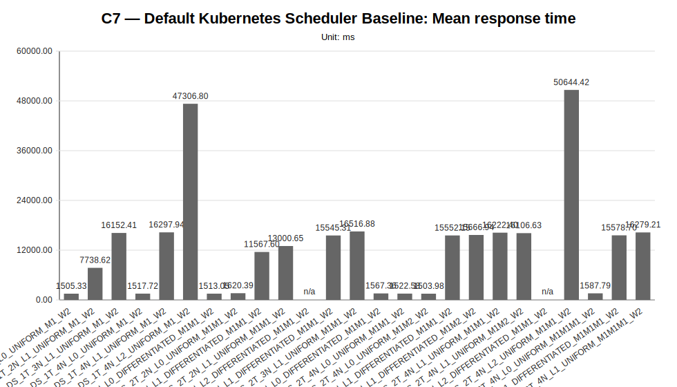
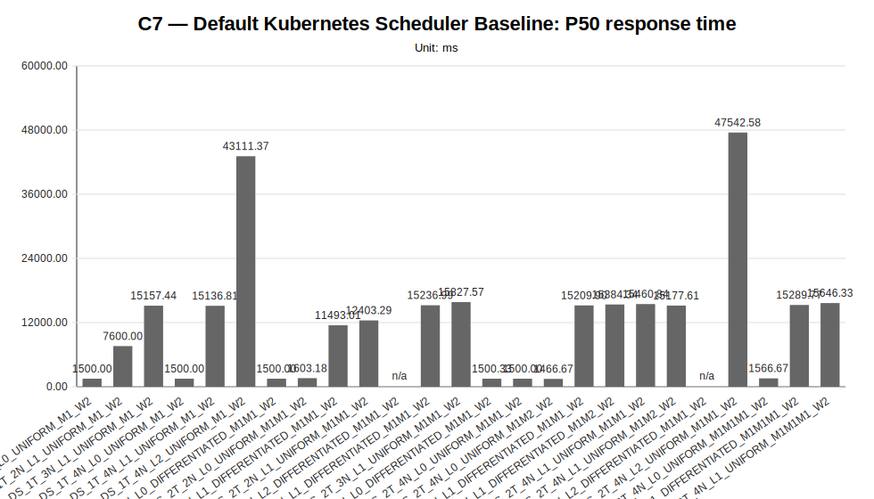
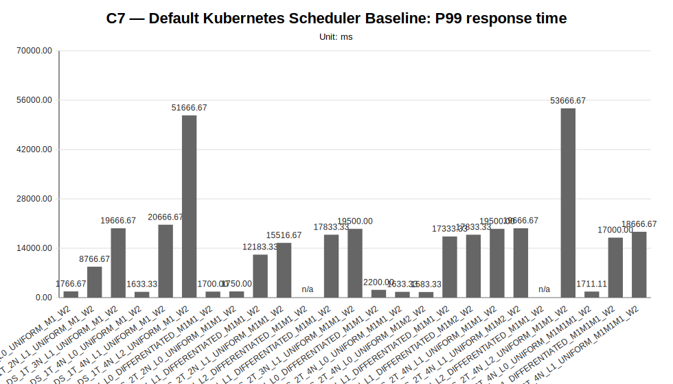
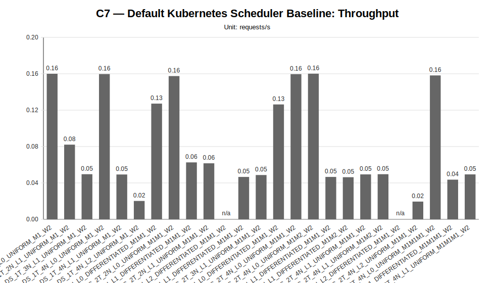
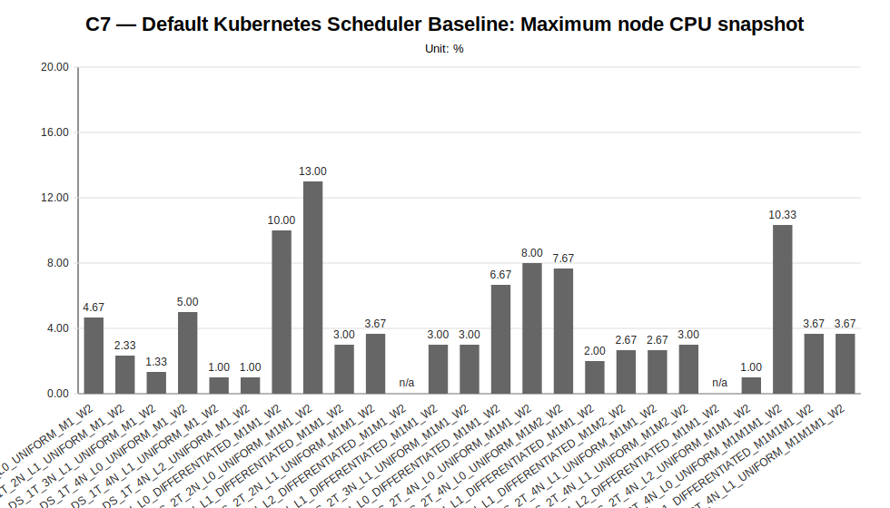
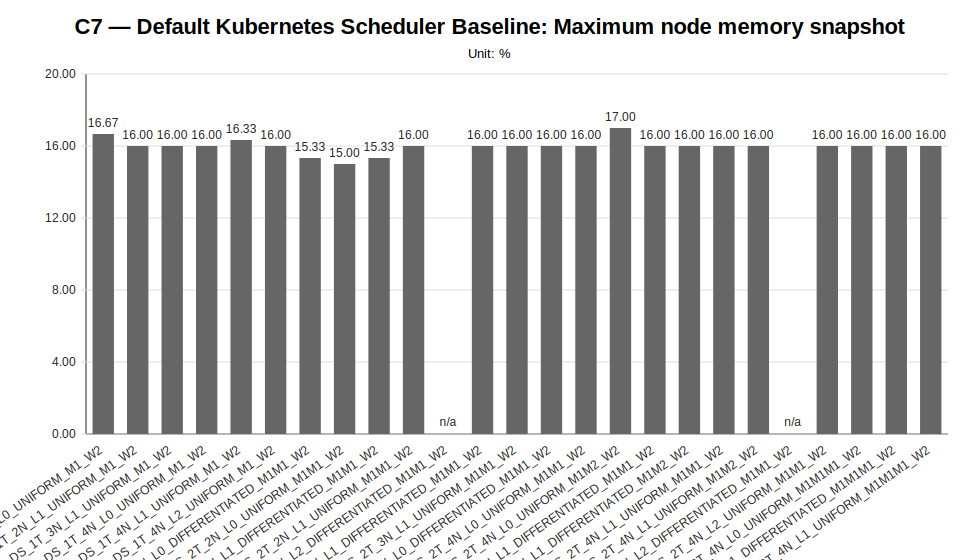
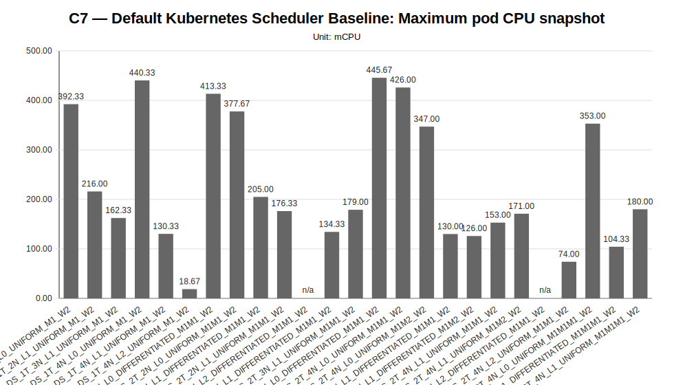
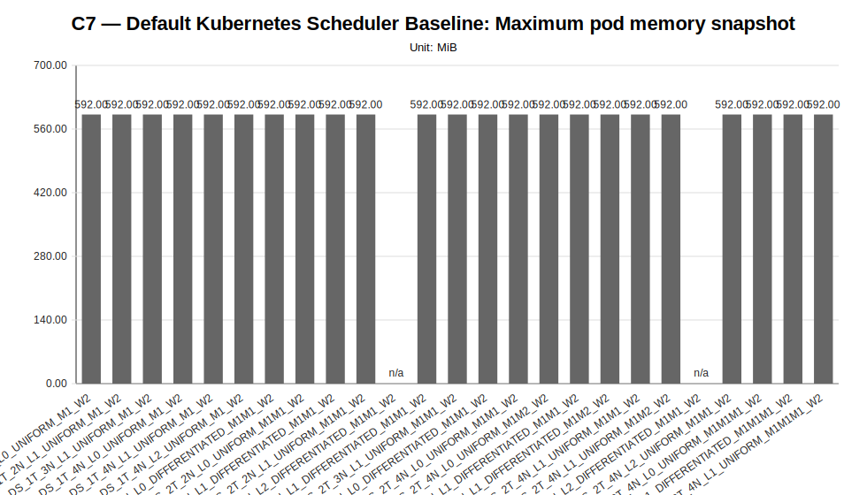

# C7 — Default Kubernetes Scheduler Baseline Sweep Report

**Cycle ID:** `C7`
**Sweep:** `default-scheduler`
**Reporting Profile:** `RP_C7_DEFAULT_SCHEDULER_BASELINE`
**Reporting ID:** `REP_C7_20260619T174611Z`
**Generated at UTC:** `2026-06-19T17:47:51Z`

[Back to cycle report](../../index.html)

## Scope

This sweep-specific report isolates **Default Kubernetes Scheduler Baseline** so that the varied dimension, fixed dimensions, measured values, unsupported evidence and diagnosis-based reading can be inspected without navigating the full consolidated report.

## Default Kubernetes Scheduler Baseline

**Execution status:** `partially_measured`

**Execution note:** At least one configured scenario has measured benchmark samples, while other scenarios are missing or unsupported.

**Varied dimension:** tenant count, worker-node count, latency profile, tenant traffic profile, model mix

**Fixed dimensions:** application=LocalAI worker-mode, scheduler=Kubernetes default scheduler, hard-placement-controls=disabled, worker-count-per-tenant=W2, worker capacity=8 vCPU / 16 GiB / 35 GiB per worker node, request target=POST /v1/chat/completions.

**Reference scenario within the sweep:** `DS_1T_4N_L0_UNIFORM_M1_W2`

| Scenario count | Measured | Unsupported | Missing |
|---|---|---|---|
| 25 | 23 | 2 | 0 |

### Controlled scenario parameters

This table is derived from resolved scenario metadata. A parameter is marked as controlled only when it has the same effective value across all scenarios in the sweep.

| Parameter | Resolved value | Interpretation |
|---|---|---|
| Model | varies across scenarios (2 values) | varied or scenario-specific |
| Worker count | 2 | controlled |
| Placement | runtime_default_scheduler_decision | controlled |
| Workload | varies across scenarios (3 values) | varied or scenario-specific |
| Topology | varies across scenarios (4 values) | varied or scenario-specific |
| Server manifest | varies across scenarios (4 values) | varied or scenario-specific |
| Prompt | Reply with only READY. | controlled |
| Temperature | 0.1 | controlled |
| Request timeout (s) | 120 | controlled |

### Scenario parameter matrix

| Scenario | Status | Varied value (tenant count, worker-node count, latency profile, tenant traffic profile, model mix) | Model | Worker count | Placement | Workload | Timeout (s) |
|---|---|---|---|---|---|---|---|
| `DS_1T_2N_L0_UNIFORM_M1_W2` | measured | DS_1T_2N_L0_UNIFORM_M1_W2 | llama-3.2-1b-instruct:q4_k_m | 2 | runtime_default_scheduler_decision | users=1, spawnRate=1, runTime=2m | 120 |
| `DS_1T_2N_L1_UNIFORM_M1_W2` | measured | DS_1T_2N_L1_UNIFORM_M1_W2 | llama-3.2-1b-instruct:q4_k_m | 2 | runtime_default_scheduler_decision | users=1, spawnRate=1, runTime=2m | 120 |
| `DS_1T_3N_L1_UNIFORM_M1_W2` | measured | DS_1T_3N_L1_UNIFORM_M1_W2 | llama-3.2-1b-instruct:q4_k_m | 2 | runtime_default_scheduler_decision | users=1, spawnRate=1, runTime=2m | 120 |
| `DS_1T_4N_L0_UNIFORM_M1_W2` | measured | DS_1T_4N_L0_UNIFORM_M1_W2 | llama-3.2-1b-instruct:q4_k_m | 2 | runtime_default_scheduler_decision | users=1, spawnRate=1, runTime=2m | 120 |
| `DS_1T_4N_L1_UNIFORM_M1_W2` | measured | DS_1T_4N_L1_UNIFORM_M1_W2 | llama-3.2-1b-instruct:q4_k_m | 2 | runtime_default_scheduler_decision | users=1, spawnRate=1, runTime=2m | 120 |
| `DS_1T_4N_L2_UNIFORM_M1_W2` | measured | DS_1T_4N_L2_UNIFORM_M1_W2 | llama-3.2-1b-instruct:q4_k_m | 2 | runtime_default_scheduler_decision | users=1, spawnRate=1, runTime=2m | 120 |
| `DS_2T_2N_L0_DIFFERENTIATED_M1M1_W2` | measured | DS_2T_2N_L0_DIFFERENTIATED_M1M1_W2 | llama-3.2-1b-instruct:q4_k_m | 2 | runtime_default_scheduler_decision | users=2, spawnRate=2, runTime=2m | 120 |
| `DS_2T_2N_L0_UNIFORM_M1M1_W2` | measured | DS_2T_2N_L0_UNIFORM_M1M1_W2 | llama-3.2-1b-instruct:q4_k_m | 2 | runtime_default_scheduler_decision | users=2, spawnRate=2, runTime=2m | 120 |
| `DS_2T_2N_L1_DIFFERENTIATED_M1M1_W2` | measured | DS_2T_2N_L1_DIFFERENTIATED_M1M1_W2 | llama-3.2-1b-instruct:q4_k_m | 2 | runtime_default_scheduler_decision | users=2, spawnRate=2, runTime=2m | 120 |
| `DS_2T_2N_L1_UNIFORM_M1M1_W2` | measured | DS_2T_2N_L1_UNIFORM_M1M1_W2 | llama-3.2-1b-instruct:q4_k_m | 2 | runtime_default_scheduler_decision | users=2, spawnRate=2, runTime=2m | 120 |
| `DS_2T_2N_L2_DIFFERENTIATED_M1M1_W2` | unsupported_under_current_constraints | DS_2T_2N_L2_DIFFERENTIATED_M1M1_W2 | llama-3.2-1b-instruct:q4_k_m | 2 | runtime_default_scheduler_decision | users=2, spawnRate=2, runTime=2m | 120 |
| `DS_2T_3N_L1_DIFFERENTIATED_M1M1_W2` | measured | DS_2T_3N_L1_DIFFERENTIATED_M1M1_W2 | llama-3.2-1b-instruct:q4_k_m | 2 | runtime_default_scheduler_decision | users=2, spawnRate=2, runTime=2m | 120 |
| `DS_2T_3N_L1_UNIFORM_M1M1_W2` | measured | DS_2T_3N_L1_UNIFORM_M1M1_W2 | llama-3.2-1b-instruct:q4_k_m | 2 | runtime_default_scheduler_decision | users=2, spawnRate=2, runTime=2m | 120 |
| `DS_2T_4N_L0_DIFFERENTIATED_M1M1_W2` | measured | DS_2T_4N_L0_DIFFERENTIATED_M1M1_W2 | llama-3.2-1b-instruct:q4_k_m | 2 | runtime_default_scheduler_decision | users=2, spawnRate=2, runTime=2m | 120 |
| `DS_2T_4N_L0_UNIFORM_M1M1_W2` | measured | DS_2T_4N_L0_UNIFORM_M1M1_W2 | llama-3.2-1b-instruct:q4_k_m | 2 | runtime_default_scheduler_decision | users=2, spawnRate=2, runTime=2m | 120 |
| `DS_2T_4N_L0_UNIFORM_M1M2_W2` | measured | DS_2T_4N_L0_UNIFORM_M1M2_W2 | tenant-a=llama-3.2-1b-instruct:q4_k_m; tenant-b=llama-3.2-1b-instruct:q8_0 | 2 | runtime_default_scheduler_decision | users=2, spawnRate=2, runTime=2m | 120 |
| `DS_2T_4N_L1_DIFFERENTIATED_M1M1_W2` | measured | DS_2T_4N_L1_DIFFERENTIATED_M1M1_W2 | llama-3.2-1b-instruct:q4_k_m | 2 | runtime_default_scheduler_decision | users=2, spawnRate=2, runTime=2m | 120 |
| `DS_2T_4N_L1_DIFFERENTIATED_M1M2_W2` | measured | DS_2T_4N_L1_DIFFERENTIATED_M1M2_W2 | tenant-a=llama-3.2-1b-instruct:q4_k_m; tenant-b=llama-3.2-1b-instruct:q8_0 | 2 | runtime_default_scheduler_decision | users=2, spawnRate=2, runTime=2m | 120 |
| `DS_2T_4N_L1_UNIFORM_M1M1_W2` | measured | DS_2T_4N_L1_UNIFORM_M1M1_W2 | llama-3.2-1b-instruct:q4_k_m | 2 | runtime_default_scheduler_decision | users=2, spawnRate=2, runTime=2m | 120 |
| `DS_2T_4N_L1_UNIFORM_M1M2_W2` | measured | DS_2T_4N_L1_UNIFORM_M1M2_W2 | tenant-a=llama-3.2-1b-instruct:q4_k_m; tenant-b=llama-3.2-1b-instruct:q8_0 | 2 | runtime_default_scheduler_decision | users=2, spawnRate=2, runTime=2m | 120 |
| `DS_2T_4N_L2_DIFFERENTIATED_M1M1_W2` | unsupported_under_current_constraints | DS_2T_4N_L2_DIFFERENTIATED_M1M1_W2 | llama-3.2-1b-instruct:q4_k_m | 2 | runtime_default_scheduler_decision | users=2, spawnRate=2, runTime=2m | 120 |
| `DS_2T_4N_L2_UNIFORM_M1M1_W2` | measured | DS_2T_4N_L2_UNIFORM_M1M1_W2 | llama-3.2-1b-instruct:q4_k_m | 2 | runtime_default_scheduler_decision | users=2, spawnRate=2, runTime=2m | 120 |
| `DS_3T_4N_L0_UNIFORM_M1M1M1_W2` | measured | DS_3T_4N_L0_UNIFORM_M1M1M1_W2 | llama-3.2-1b-instruct:q4_k_m | 2 | runtime_default_scheduler_decision | users=3, spawnRate=3, runTime=2m | 120 |
| `DS_3T_4N_L1_DIFFERENTIATED_M1M1M1_W2` | measured | DS_3T_4N_L1_DIFFERENTIATED_M1M1M1_W2 | llama-3.2-1b-instruct:q4_k_m | 2 | runtime_default_scheduler_decision | users=3, spawnRate=3, runTime=2m | 120 |
| `DS_3T_4N_L1_UNIFORM_M1M1M1_W2` | measured | DS_3T_4N_L1_UNIFORM_M1M1M1_W2 | llama-3.2-1b-instruct:q4_k_m | 2 | runtime_default_scheduler_decision | users=3, spawnRate=3, runTime=2m | 120 |

### Measurement summary

This compact table reports the core indicators used to read the sweep at a glance. Detailed percentiles, deltas and resource snapshots are reported in the following extended table.

| Scenario | Description | Status | Sample count | Mean response time (ms) | P95 response time (ms) | Throughput (requests/s) | Unsupported evidence |
|---|---|---|---|---|---|---|---|
| `DS_1T_2N_L0_UNIFORM_M1_W2` | DS_1T_2N_L0_UNIFORM_M1_W2 | measured | 3 | 1505.33 | 1766.67 | 0.1600 |  |
| `DS_1T_2N_L1_UNIFORM_M1_W2` | DS_1T_2N_L1_UNIFORM_M1_W2 | measured | 3 | 7738.62 | 8766.67 | 0.0821 |  |
| `DS_1T_3N_L1_UNIFORM_M1_W2` | DS_1T_3N_L1_UNIFORM_M1_W2 | measured | 3 | 16152.41 | 19666.67 | 0.0496 |  |
| `DS_1T_4N_L0_UNIFORM_M1_W2` | DS_1T_4N_L0_UNIFORM_M1_W2 | measured | 3 | 1517.72 | 1633.33 | 0.1597 |  |
| `DS_1T_4N_L1_UNIFORM_M1_W2` | DS_1T_4N_L1_UNIFORM_M1_W2 | measured | 3 | 16297.94 | 20666.67 | 0.0493 |  |
| `DS_1T_4N_L2_UNIFORM_M1_W2` | DS_1T_4N_L2_UNIFORM_M1_W2 | measured | 3 | 47306.80 | 51666.67 | 0.0202 |  |
| `DS_2T_2N_L0_DIFFERENTIATED_M1M1_W2` | DS_2T_2N_L0_DIFFERENTIATED_M1M1_W2 | measured | 6 | 1513.05 | 1700.00 | 0.1272 |  |
| `DS_2T_2N_L0_UNIFORM_M1M1_W2` | DS_2T_2N_L0_UNIFORM_M1M1_W2 | measured | 6 | 1620.39 | 1750.00 | 0.1575 |  |
| `DS_2T_2N_L1_DIFFERENTIATED_M1M1_W2` | DS_2T_2N_L1_DIFFERENTIATED_M1M1_W2 | measured | 6 | 11567.60 | 12183.33 | 0.0626 |  |
| `DS_2T_2N_L1_UNIFORM_M1M1_W2` | DS_2T_2N_L1_UNIFORM_M1M1_W2 | measured | 6 | 13000.65 | 15516.67 | 0.0616 |  |
| `DS_2T_2N_L2_DIFFERENTIATED_M1M1_W2` | DS_2T_2N_L2_DIFFERENTIATED_M1M1_W2 | unsupported_under_current_constraints | 0 | n/a | n/a | n/a | application_not_ready, localai_deployment, smoke_validation_failure |
| `DS_2T_3N_L1_DIFFERENTIATED_M1M1_W2` | DS_2T_3N_L1_DIFFERENTIATED_M1M1_W2 | measured | 6 | 15545.31 | 17833.33 | 0.0466 |  |
| `DS_2T_3N_L1_UNIFORM_M1M1_W2` | DS_2T_3N_L1_UNIFORM_M1M1_W2 | measured | 6 | 16516.88 | 19500.00 | 0.0487 |  |
| `DS_2T_4N_L0_DIFFERENTIATED_M1M1_W2` | DS_2T_4N_L0_DIFFERENTIATED_M1M1_W2 | measured | 6 | 1567.36 | 2200.00 | 0.1263 |  |
| `DS_2T_4N_L0_UNIFORM_M1M1_W2` | DS_2T_4N_L0_UNIFORM_M1M1_W2 | measured | 6 | 1522.58 | 1633.33 | 0.1596 |  |
| `DS_2T_4N_L0_UNIFORM_M1M2_W2` | DS_2T_4N_L0_UNIFORM_M1M2_W2 | measured | 6 | 1503.98 | 1583.33 | 0.1601 |  |
| `DS_2T_4N_L1_DIFFERENTIATED_M1M1_W2` | DS_2T_4N_L1_DIFFERENTIATED_M1M1_W2 | measured | 6 | 15552.15 | 17333.33 | 0.0466 |  |
| `DS_2T_4N_L1_DIFFERENTIATED_M1M2_W2` | DS_2T_4N_L1_DIFFERENTIATED_M1M2_W2 | measured | 6 | 15666.94 | 17833.33 | 0.0463 |  |
| `DS_2T_4N_L1_UNIFORM_M1M1_W2` | DS_2T_4N_L1_UNIFORM_M1M1_W2 | measured | 6 | 16222.40 | 19500.00 | 0.0494 |  |
| `DS_2T_4N_L1_UNIFORM_M1M2_W2` | DS_2T_4N_L1_UNIFORM_M1M2_W2 | measured | 6 | 16106.63 | 19666.67 | 0.0496 |  |
| `DS_2T_4N_L2_DIFFERENTIATED_M1M1_W2` | DS_2T_4N_L2_DIFFERENTIATED_M1M1_W2 | unsupported_under_current_constraints | 0 | n/a | n/a | n/a | application_not_ready, localai_deployment, smoke_validation_failure |
| `DS_2T_4N_L2_UNIFORM_M1M1_W2` | DS_2T_4N_L2_UNIFORM_M1M1_W2 | measured | 6 | 50644.42 | 53666.67 | 0.0195 |  |
| `DS_3T_4N_L0_UNIFORM_M1M1M1_W2` | DS_3T_4N_L0_UNIFORM_M1M1M1_W2 | measured | 9 | 1587.79 | 1711.11 | 0.1582 |  |
| `DS_3T_4N_L1_DIFFERENTIATED_M1M1M1_W2` | DS_3T_4N_L1_DIFFERENTIATED_M1M1M1_W2 | measured | 9 | 15578.70 | 17000.00 | 0.0436 |  |
| `DS_3T_4N_L1_UNIFORM_M1M1M1_W2` | DS_3T_4N_L1_UNIFORM_M1M1M1_W2 | measured | 9 | 16279.21 | 18666.67 | 0.0494 |  |

### Extended measurement metrics

This secondary table keeps the additional metrics aligned with the technical diagnosis while avoiding an excessively wide primary summary table.

| Scenario | P50 response time (ms) | P99 response time (ms) | Mean response time delta (%) | P95 response time delta (%) | Throughput delta (%) | Max node CPU snapshot (%) | Max node memory snapshot (%) | Max pod CPU snapshot (mCPU) | Max pod memory snapshot (MiB) |
|---|---|---|---|---|---|---|---|---|---|
| `DS_1T_2N_L0_UNIFORM_M1_W2` | 1500.00 | 1766.67 | -0.82 | 8.16 | 0.19 | 4.67 | 16.67 | 392.33 | 592.00 |
| `DS_1T_2N_L1_UNIFORM_M1_W2` | 7600.00 | 8766.67 | 409.88 | 436.73 | -48.59 | 2.33 | 16.00 | 216.00 | 592.00 |
| `DS_1T_3N_L1_UNIFORM_M1_W2` | 15157.44 | 19666.67 | 964.25 | 1104.08 | -68.94 | 1.33 | 16.00 | 162.33 | 592.00 |
| `DS_1T_4N_L0_UNIFORM_M1_W2` | 1500.00 | 1633.33 | 0.00 | 0.00 | 0.00 | 5.00 | 16.00 | 440.33 | 592.00 |
| `DS_1T_4N_L1_UNIFORM_M1_W2` | 15136.81 | 20666.67 | 973.84 | 1165.31 | -69.13 | 1.00 | 16.33 | 130.33 | 592.00 |
| `DS_1T_4N_L2_UNIFORM_M1_W2` | 43111.37 | 51666.67 | 3016.96 | 3063.27 | -87.35 | 1.00 | 16.00 | 18.67 | 592.00 |
| `DS_2T_2N_L0_DIFFERENTIATED_M1M1_W2` | 1500.00 | 1700.00 | -0.31 | 4.08 | -20.35 | 10.00 | 15.33 | 413.33 | 592.00 |
| `DS_2T_2N_L0_UNIFORM_M1M1_W2` | 1603.18 | 1750.00 | 6.76 | 7.14 | -1.38 | 13.00 | 15.00 | 377.67 | 592.00 |
| `DS_2T_2N_L1_DIFFERENTIATED_M1M1_W2` | 11493.01 | 12183.33 | 662.17 | 645.92 | -60.80 | 3.00 | 15.33 | 205.00 | 592.00 |
| `DS_2T_2N_L1_UNIFORM_M1M1_W2` | 12403.29 | 15516.67 | 756.59 | 850.00 | -61.43 | 3.67 | 16.00 | 176.33 | 592.00 |
| `DS_2T_2N_L2_DIFFERENTIATED_M1M1_W2` | n/a | n/a | n/a | n/a | n/a | n/a | n/a | n/a | n/a |
| `DS_2T_3N_L1_DIFFERENTIATED_M1M1_W2` | 15236.99 | 17833.33 | 924.25 | 991.84 | -70.82 | 3.00 | 16.00 | 134.33 | 592.00 |
| `DS_2T_3N_L1_UNIFORM_M1M1_W2` | 15827.57 | 19500.00 | 988.27 | 1093.88 | -69.51 | 3.00 | 16.00 | 179.00 | 592.00 |
| `DS_2T_4N_L0_DIFFERENTIATED_M1M1_W2` | 1500.33 | 2200.00 | 3.27 | 34.69 | -20.91 | 6.67 | 16.00 | 445.67 | 592.00 |
| `DS_2T_4N_L0_UNIFORM_M1M1_W2` | 1500.00 | 1633.33 | 0.32 | 0.00 | -0.06 | 8.00 | 16.00 | 426.00 | 592.00 |
| `DS_2T_4N_L0_UNIFORM_M1M2_W2` | 1466.67 | 1583.33 | -0.91 | -3.06 | 0.25 | 7.67 | 17.00 | 347.00 | 592.00 |
| `DS_2T_4N_L1_DIFFERENTIATED_M1M1_W2` | 15209.90 | 17333.33 | 924.70 | 961.22 | -70.82 | 2.00 | 16.00 | 130.00 | 592.00 |
| `DS_2T_4N_L1_DIFFERENTIATED_M1M2_W2` | 15384.34 | 17833.33 | 932.27 | 991.84 | -71.01 | 2.67 | 16.00 | 126.00 | 592.00 |
| `DS_2T_4N_L1_UNIFORM_M1M1_W2` | 15460.84 | 19500.00 | 968.86 | 1093.88 | -69.07 | 2.67 | 16.00 | 153.00 | 592.00 |
| `DS_2T_4N_L1_UNIFORM_M1M2_W2` | 15177.61 | 19666.67 | 961.24 | 1104.08 | -68.94 | 3.00 | 16.00 | 171.00 | 592.00 |
| `DS_2T_4N_L2_DIFFERENTIATED_M1M1_W2` | n/a | n/a | n/a | n/a | n/a | n/a | n/a | n/a | n/a |
| `DS_2T_4N_L2_UNIFORM_M1M1_W2` | 47542.58 | 53666.67 | 3236.87 | 3185.71 | -87.79 | 1.00 | 16.00 | 74.00 | 592.00 |
| `DS_3T_4N_L0_UNIFORM_M1M1M1_W2` | 1566.67 | 1711.11 | 4.62 | 4.76 | -0.94 | 10.33 | 16.00 | 353.00 | 592.00 |
| `DS_3T_4N_L1_DIFFERENTIATED_M1M1M1_W2` | 15289.77 | 17000.00 | 926.45 | 940.82 | -72.70 | 3.67 | 16.00 | 104.33 | 592.00 |
| `DS_3T_4N_L1_UNIFORM_M1M1M1_W2` | 15646.33 | 18666.67 | 972.61 | 1042.86 | -69.07 | 3.67 | 16.00 | 180.00 | 592.00 |

### Default-scheduler scenario context

This table keeps the default-scheduler experimental dimensions explicit: tenant count, worker-node count, latency profile, traffic profile and model mix vary, while hard placement controls remain disabled.

| Scenario | Class | Tenants | Worker nodes | Latency profile | Traffic profile | Model mix | Workers per tenant | Scheduler/placement profile | Composition | Execution status |
|---|---|---|---|---|---|---|---|---|---|---|
| `DS_1T_2N_L0_UNIFORM_M1_W2` | official | 1 | 2 | L0_NONE | TR_1T_UNIFORM_LOW | M1 | 2 | DEFAULT_KUBERNETES_SCHEDULER | infra/k8s/compositions/default-scheduler/single-tenant | measured |
| `DS_1T_2N_L1_UNIFORM_M1_W2` | official | 1 | 2 | L1_EDGE_NEAR | TR_1T_UNIFORM_LOW | M1 | 2 | DEFAULT_KUBERNETES_SCHEDULER | infra/k8s/compositions/default-scheduler/single-tenant | measured |
| `DS_1T_3N_L1_UNIFORM_M1_W2` | diagnostic | 1 | 3 | L1_EDGE_NEAR | TR_1T_UNIFORM_LOW | M1 | 2 | DEFAULT_KUBERNETES_SCHEDULER | infra/k8s/compositions/default-scheduler/single-tenant | measured |
| `DS_1T_4N_L0_UNIFORM_M1_W2` | official | 1 | 4 | L0_NONE | TR_1T_UNIFORM_LOW | M1 | 2 | DEFAULT_KUBERNETES_SCHEDULER | infra/k8s/compositions/default-scheduler/single-tenant | measured |
| `DS_1T_4N_L1_UNIFORM_M1_W2` | official | 1 | 4 | L1_EDGE_NEAR | TR_1T_UNIFORM_LOW | M1 | 2 | DEFAULT_KUBERNETES_SCHEDULER | infra/k8s/compositions/default-scheduler/single-tenant | measured |
| `DS_1T_4N_L2_UNIFORM_M1_W2` | diagnostic | 1 | 4 | L2_EDGE_REMOTE | TR_1T_UNIFORM_LOW | M1 | 2 | DEFAULT_KUBERNETES_SCHEDULER | infra/k8s/compositions/default-scheduler/single-tenant | measured |
| `DS_2T_2N_L0_DIFFERENTIATED_M1M1_W2` | official | 2 | 2 | L0_NONE | TR_2T_DIFFERENTIATED_LOW | M1M1 | 2 | DEFAULT_KUBERNETES_SCHEDULER | infra/k8s/compositions/default-scheduler/two-tenants | measured |
| `DS_2T_2N_L0_UNIFORM_M1M1_W2` | official | 2 | 2 | L0_NONE | TR_2T_UNIFORM_LOW | M1M1 | 2 | DEFAULT_KUBERNETES_SCHEDULER | infra/k8s/compositions/default-scheduler/two-tenants | measured |
| `DS_2T_2N_L1_DIFFERENTIATED_M1M1_W2` | official | 2 | 2 | L1_EDGE_NEAR | TR_2T_DIFFERENTIATED_LOW | M1M1 | 2 | DEFAULT_KUBERNETES_SCHEDULER | infra/k8s/compositions/default-scheduler/two-tenants | measured |
| `DS_2T_2N_L1_UNIFORM_M1M1_W2` | official | 2 | 2 | L1_EDGE_NEAR | TR_2T_UNIFORM_LOW | M1M1 | 2 | DEFAULT_KUBERNETES_SCHEDULER | infra/k8s/compositions/default-scheduler/two-tenants | measured |
| `DS_2T_2N_L2_DIFFERENTIATED_M1M1_W2` | diagnostic | 2 | 2 | L2_EDGE_REMOTE | TR_2T_DIFFERENTIATED_LOW | M1M1 | 2 | DEFAULT_KUBERNETES_SCHEDULER | infra/k8s/compositions/default-scheduler/two-tenants | unsupported_under_current_constraints |
| `DS_2T_3N_L1_DIFFERENTIATED_M1M1_W2` | diagnostic | 2 | 3 | L1_EDGE_NEAR | TR_2T_DIFFERENTIATED_LOW | M1M1 | 2 | DEFAULT_KUBERNETES_SCHEDULER | infra/k8s/compositions/default-scheduler/two-tenants | measured |
| `DS_2T_3N_L1_UNIFORM_M1M1_W2` | diagnostic | 2 | 3 | L1_EDGE_NEAR | TR_2T_UNIFORM_LOW | M1M1 | 2 | DEFAULT_KUBERNETES_SCHEDULER | infra/k8s/compositions/default-scheduler/two-tenants | measured |
| `DS_2T_4N_L0_DIFFERENTIATED_M1M1_W2` | official | 2 | 4 | L0_NONE | TR_2T_DIFFERENTIATED_LOW | M1M1 | 2 | DEFAULT_KUBERNETES_SCHEDULER | infra/k8s/compositions/default-scheduler/two-tenants | measured |
| `DS_2T_4N_L0_UNIFORM_M1M1_W2` | official | 2 | 4 | L0_NONE | TR_2T_UNIFORM_LOW | M1M1 | 2 | DEFAULT_KUBERNETES_SCHEDULER | infra/k8s/compositions/default-scheduler/two-tenants | measured |
| `DS_2T_4N_L0_UNIFORM_M1M2_W2` | stress | 2 | 4 | L0_NONE | TR_2T_UNIFORM_LOW | M1M2 | 2 | DEFAULT_KUBERNETES_SCHEDULER | infra/k8s/compositions/default-scheduler/two-tenants-mixed-models | measured |
| `DS_2T_4N_L1_DIFFERENTIATED_M1M1_W2` | official | 2 | 4 | L1_EDGE_NEAR | TR_2T_DIFFERENTIATED_LOW | M1M1 | 2 | DEFAULT_KUBERNETES_SCHEDULER | infra/k8s/compositions/default-scheduler/two-tenants | measured |
| `DS_2T_4N_L1_DIFFERENTIATED_M1M2_W2` | stress | 2 | 4 | L1_EDGE_NEAR | TR_2T_DIFFERENTIATED_LOW | M1M2 | 2 | DEFAULT_KUBERNETES_SCHEDULER | infra/k8s/compositions/default-scheduler/two-tenants-mixed-models | measured |
| `DS_2T_4N_L1_UNIFORM_M1M1_W2` | official | 2 | 4 | L1_EDGE_NEAR | TR_2T_UNIFORM_LOW | M1M1 | 2 | DEFAULT_KUBERNETES_SCHEDULER | infra/k8s/compositions/default-scheduler/two-tenants | measured |
| `DS_2T_4N_L1_UNIFORM_M1M2_W2` | stress | 2 | 4 | L1_EDGE_NEAR | TR_2T_UNIFORM_LOW | M1M2 | 2 | DEFAULT_KUBERNETES_SCHEDULER | infra/k8s/compositions/default-scheduler/two-tenants-mixed-models | measured |
| `DS_2T_4N_L2_DIFFERENTIATED_M1M1_W2` | diagnostic | 2 | 4 | L2_EDGE_REMOTE | TR_2T_DIFFERENTIATED_LOW | M1M1 | 2 | DEFAULT_KUBERNETES_SCHEDULER | infra/k8s/compositions/default-scheduler/two-tenants | unsupported_under_current_constraints |
| `DS_2T_4N_L2_UNIFORM_M1M1_W2` | diagnostic | 2 | 4 | L2_EDGE_REMOTE | TR_2T_UNIFORM_LOW | M1M1 | 2 | DEFAULT_KUBERNETES_SCHEDULER | infra/k8s/compositions/default-scheduler/two-tenants | measured |
| `DS_3T_4N_L0_UNIFORM_M1M1M1_W2` | stress | 3 | 4 | L0_NONE | TR_3T_UNIFORM_LOW | M1M1M1 | 2 | DEFAULT_KUBERNETES_SCHEDULER | infra/k8s/compositions/default-scheduler/three-tenants | measured |
| `DS_3T_4N_L1_DIFFERENTIATED_M1M1M1_W2` | stress | 3 | 4 | L1_EDGE_NEAR | TR_3T_DIFFERENTIATED_LOW | M1M1M1 | 2 | DEFAULT_KUBERNETES_SCHEDULER | infra/k8s/compositions/default-scheduler/three-tenants | measured |
| `DS_3T_4N_L1_UNIFORM_M1M1M1_W2` | stress | 3 | 4 | L1_EDGE_NEAR | TR_3T_UNIFORM_LOW | M1M1M1 | 2 | DEFAULT_KUBERNETES_SCHEDULER | infra/k8s/compositions/default-scheduler/three-tenants | measured |

### Tenant traffic context

This table exposes the tenant-level traffic configuration used by the multi-tenant Locust runner. It is essential for reading differentiated-traffic scenarios without collapsing tenants into a single aggregate.

| Scenario | Tenant | Namespace | Role | Model scenario | Model | Workers | Users | Spawn rate | Run time | Wait time (s) |
|---|---|---|---|---|---|---|---|---|---|---|
| `DS_1T_2N_L0_UNIFORM_M1_W2` | `tenant-a` | genai-tenant-a | primary_benchmark_tenant | M1 | llama-3.2-1b-instruct:q4_k_m | 2 | 1 | 1 | 2m | 5 |
| `DS_1T_2N_L1_UNIFORM_M1_W2` | `tenant-a` | genai-tenant-a | primary_benchmark_tenant | M1 | llama-3.2-1b-instruct:q4_k_m | 2 | 1 | 1 | 2m | 5 |
| `DS_1T_3N_L1_UNIFORM_M1_W2` | `tenant-a` | genai-tenant-a | primary_benchmark_tenant | M1 | llama-3.2-1b-instruct:q4_k_m | 2 | 1 | 1 | 2m | 5 |
| `DS_1T_4N_L0_UNIFORM_M1_W2` | `tenant-a` | genai-tenant-a | primary_benchmark_tenant | M1 | llama-3.2-1b-instruct:q4_k_m | 2 | 1 | 1 | 2m | 5 |
| `DS_1T_4N_L1_UNIFORM_M1_W2` | `tenant-a` | genai-tenant-a | primary_benchmark_tenant | M1 | llama-3.2-1b-instruct:q4_k_m | 2 | 1 | 1 | 2m | 5 |
| `DS_1T_4N_L2_UNIFORM_M1_W2` | `tenant-a` | genai-tenant-a | primary_benchmark_tenant | M1 | llama-3.2-1b-instruct:q4_k_m | 2 | 1 | 1 | 2m | 5 |
| `DS_2T_2N_L0_DIFFERENTIATED_M1M1_W2` | `tenant-a` | genai-tenant-a | primary_benchmark_tenant | M1 | llama-3.2-1b-instruct:q4_k_m | 2 | 1 | 1 | 2m | 5 |
| `DS_2T_2N_L0_DIFFERENTIATED_M1M1_W2` | `tenant-b` | genai-tenant-b | concurrent_tenant | M1 | llama-3.2-1b-instruct:q4_k_m | 2 | 1 | 1 | 2m | 10 |
| `DS_2T_2N_L0_UNIFORM_M1M1_W2` | `tenant-a` | genai-tenant-a | primary_benchmark_tenant | M1 | llama-3.2-1b-instruct:q4_k_m | 2 | 1 | 1 | 2m | 5 |
| `DS_2T_2N_L0_UNIFORM_M1M1_W2` | `tenant-b` | genai-tenant-b | concurrent_tenant | M1 | llama-3.2-1b-instruct:q4_k_m | 2 | 1 | 1 | 2m | 5 |
| `DS_2T_2N_L1_DIFFERENTIATED_M1M1_W2` | `tenant-a` | genai-tenant-a | primary_benchmark_tenant | M1 | llama-3.2-1b-instruct:q4_k_m | 2 | 1 | 1 | 2m | 5 |
| `DS_2T_2N_L1_DIFFERENTIATED_M1M1_W2` | `tenant-b` | genai-tenant-b | concurrent_tenant | M1 | llama-3.2-1b-instruct:q4_k_m | 2 | 1 | 1 | 2m | 10 |
| `DS_2T_2N_L1_UNIFORM_M1M1_W2` | `tenant-a` | genai-tenant-a | primary_benchmark_tenant | M1 | llama-3.2-1b-instruct:q4_k_m | 2 | 1 | 1 | 2m | 5 |
| `DS_2T_2N_L1_UNIFORM_M1M1_W2` | `tenant-b` | genai-tenant-b | concurrent_tenant | M1 | llama-3.2-1b-instruct:q4_k_m | 2 | 1 | 1 | 2m | 5 |
| `DS_2T_2N_L2_DIFFERENTIATED_M1M1_W2` | `tenant-a` | genai-tenant-a | primary_benchmark_tenant | M1 | llama-3.2-1b-instruct:q4_k_m | 2 | 1 | 1 | 2m | 5 |
| `DS_2T_2N_L2_DIFFERENTIATED_M1M1_W2` | `tenant-b` | genai-tenant-b | concurrent_tenant | M1 | llama-3.2-1b-instruct:q4_k_m | 2 | 1 | 1 | 2m | 10 |
| `DS_2T_3N_L1_DIFFERENTIATED_M1M1_W2` | `tenant-a` | genai-tenant-a | primary_benchmark_tenant | M1 | llama-3.2-1b-instruct:q4_k_m | 2 | 1 | 1 | 2m | 5 |
| `DS_2T_3N_L1_DIFFERENTIATED_M1M1_W2` | `tenant-b` | genai-tenant-b | concurrent_tenant | M1 | llama-3.2-1b-instruct:q4_k_m | 2 | 1 | 1 | 2m | 10 |
| `DS_2T_3N_L1_UNIFORM_M1M1_W2` | `tenant-a` | genai-tenant-a | primary_benchmark_tenant | M1 | llama-3.2-1b-instruct:q4_k_m | 2 | 1 | 1 | 2m | 5 |
| `DS_2T_3N_L1_UNIFORM_M1M1_W2` | `tenant-b` | genai-tenant-b | concurrent_tenant | M1 | llama-3.2-1b-instruct:q4_k_m | 2 | 1 | 1 | 2m | 5 |
| `DS_2T_4N_L0_DIFFERENTIATED_M1M1_W2` | `tenant-a` | genai-tenant-a | primary_benchmark_tenant | M1 | llama-3.2-1b-instruct:q4_k_m | 2 | 1 | 1 | 2m | 5 |
| `DS_2T_4N_L0_DIFFERENTIATED_M1M1_W2` | `tenant-b` | genai-tenant-b | concurrent_tenant | M1 | llama-3.2-1b-instruct:q4_k_m | 2 | 1 | 1 | 2m | 10 |
| `DS_2T_4N_L0_UNIFORM_M1M1_W2` | `tenant-a` | genai-tenant-a | primary_benchmark_tenant | M1 | llama-3.2-1b-instruct:q4_k_m | 2 | 1 | 1 | 2m | 5 |
| `DS_2T_4N_L0_UNIFORM_M1M1_W2` | `tenant-b` | genai-tenant-b | concurrent_tenant | M1 | llama-3.2-1b-instruct:q4_k_m | 2 | 1 | 1 | 2m | 5 |
| `DS_2T_4N_L0_UNIFORM_M1M2_W2` | `tenant-a` | genai-tenant-a | primary_benchmark_tenant | M1 | llama-3.2-1b-instruct:q4_k_m | 2 | 1 | 1 | 2m | 5 |
| `DS_2T_4N_L0_UNIFORM_M1M2_W2` | `tenant-b` | genai-tenant-b | concurrent_tenant | M2 | llama-3.2-1b-instruct:q8_0 | 2 | 1 | 1 | 2m | 5 |
| `DS_2T_4N_L1_DIFFERENTIATED_M1M1_W2` | `tenant-a` | genai-tenant-a | primary_benchmark_tenant | M1 | llama-3.2-1b-instruct:q4_k_m | 2 | 1 | 1 | 2m | 5 |
| `DS_2T_4N_L1_DIFFERENTIATED_M1M1_W2` | `tenant-b` | genai-tenant-b | concurrent_tenant | M1 | llama-3.2-1b-instruct:q4_k_m | 2 | 1 | 1 | 2m | 10 |
| `DS_2T_4N_L1_DIFFERENTIATED_M1M2_W2` | `tenant-a` | genai-tenant-a | primary_benchmark_tenant | M1 | llama-3.2-1b-instruct:q4_k_m | 2 | 1 | 1 | 2m | 5 |
| `DS_2T_4N_L1_DIFFERENTIATED_M1M2_W2` | `tenant-b` | genai-tenant-b | concurrent_tenant | M2 | llama-3.2-1b-instruct:q8_0 | 2 | 1 | 1 | 2m | 10 |
| `DS_2T_4N_L1_UNIFORM_M1M1_W2` | `tenant-a` | genai-tenant-a | primary_benchmark_tenant | M1 | llama-3.2-1b-instruct:q4_k_m | 2 | 1 | 1 | 2m | 5 |
| `DS_2T_4N_L1_UNIFORM_M1M1_W2` | `tenant-b` | genai-tenant-b | concurrent_tenant | M1 | llama-3.2-1b-instruct:q4_k_m | 2 | 1 | 1 | 2m | 5 |
| `DS_2T_4N_L1_UNIFORM_M1M2_W2` | `tenant-a` | genai-tenant-a | primary_benchmark_tenant | M1 | llama-3.2-1b-instruct:q4_k_m | 2 | 1 | 1 | 2m | 5 |
| `DS_2T_4N_L1_UNIFORM_M1M2_W2` | `tenant-b` | genai-tenant-b | concurrent_tenant | M2 | llama-3.2-1b-instruct:q8_0 | 2 | 1 | 1 | 2m | 5 |
| `DS_2T_4N_L2_DIFFERENTIATED_M1M1_W2` | `tenant-a` | genai-tenant-a | primary_benchmark_tenant | M1 | llama-3.2-1b-instruct:q4_k_m | 2 | 1 | 1 | 2m | 5 |
| `DS_2T_4N_L2_DIFFERENTIATED_M1M1_W2` | `tenant-b` | genai-tenant-b | concurrent_tenant | M1 | llama-3.2-1b-instruct:q4_k_m | 2 | 1 | 1 | 2m | 10 |
| `DS_2T_4N_L2_UNIFORM_M1M1_W2` | `tenant-a` | genai-tenant-a | primary_benchmark_tenant | M1 | llama-3.2-1b-instruct:q4_k_m | 2 | 1 | 1 | 2m | 5 |
| `DS_2T_4N_L2_UNIFORM_M1M1_W2` | `tenant-b` | genai-tenant-b | concurrent_tenant | M1 | llama-3.2-1b-instruct:q4_k_m | 2 | 1 | 1 | 2m | 5 |
| `DS_3T_4N_L0_UNIFORM_M1M1M1_W2` | `tenant-a` | genai-tenant-a | primary_benchmark_tenant | M1 | llama-3.2-1b-instruct:q4_k_m | 2 | 1 | 1 | 2m | 5 |
| `DS_3T_4N_L0_UNIFORM_M1M1M1_W2` | `tenant-b` | genai-tenant-b | concurrent_tenant | M1 | llama-3.2-1b-instruct:q4_k_m | 2 | 1 | 1 | 2m | 5 |
| `DS_3T_4N_L0_UNIFORM_M1M1M1_W2` | `tenant-c` | genai-tenant-c | concurrent_tenant | M1 | llama-3.2-1b-instruct:q4_k_m | 2 | 1 | 1 | 2m | 5 |
| `DS_3T_4N_L1_DIFFERENTIATED_M1M1M1_W2` | `tenant-a` | genai-tenant-a | primary_benchmark_tenant | M1 | llama-3.2-1b-instruct:q4_k_m | 2 | 1 | 1 | 2m | 5 |
| `DS_3T_4N_L1_DIFFERENTIATED_M1M1M1_W2` | `tenant-b` | genai-tenant-b | concurrent_tenant | M1 | llama-3.2-1b-instruct:q4_k_m | 2 | 1 | 1 | 2m | 10 |
| `DS_3T_4N_L1_DIFFERENTIATED_M1M1M1_W2` | `tenant-c` | genai-tenant-c | concurrent_tenant | M1 | llama-3.2-1b-instruct:q4_k_m | 2 | 1 | 1 | 2m | 15 |
| `DS_3T_4N_L1_UNIFORM_M1M1M1_W2` | `tenant-a` | genai-tenant-a | primary_benchmark_tenant | M1 | llama-3.2-1b-instruct:q4_k_m | 2 | 1 | 1 | 2m | 5 |
| `DS_3T_4N_L1_UNIFORM_M1M1M1_W2` | `tenant-b` | genai-tenant-b | concurrent_tenant | M1 | llama-3.2-1b-instruct:q4_k_m | 2 | 1 | 1 | 2m | 5 |
| `DS_3T_4N_L1_UNIFORM_M1M1M1_W2` | `tenant-c` | genai-tenant-c | concurrent_tenant | M1 | llama-3.2-1b-instruct:q4_k_m | 2 | 1 | 1 | 2m | 5 |

### Scheduler decision table

This table reports the runtime pod-to-node mapping captured from Kubernetes. It is the primary evidence that links scheduler decisions to latency, throughput and contention observations.

| Scenario | Tenant | Namespace | Deployment | Pod | Role | Node | Phase | Restarts | Placement categories | Risk |
|---|---|---|---|---|---|---|---|---|---|---|
| `DS_1T_2N_L0_UNIFORM_M1_W2` | `tenant-a` | genai-tenant-a | localai-rpc-a | localai-rpc-a-66df69795f-9srk2 | rpc-worker | genai-pb-worker-01 | Running | 0 | server_worker_colocated, server_worker_partially_colocated, server_worker_split | warning |
| `DS_1T_2N_L0_UNIFORM_M1_W2` | `tenant-a` | genai-tenant-a | localai-rpc-b | localai-rpc-b-79494498fd-8rqb6 | rpc-worker | genai-pb-worker-02 | Running | 0 | server_worker_partially_colocated, server_worker_split | warning |
| `DS_1T_2N_L0_UNIFORM_M1_W2` | `tenant-a` | genai-tenant-a | localai-server | localai-server-7c9b744b7-lm947 | server | genai-pb-worker-01 | Running | 0 | server_worker_colocated, server_worker_partially_colocated, server_worker_split | warning |
| `DS_1T_2N_L1_UNIFORM_M1_W2` | `tenant-a` | genai-tenant-a | localai-rpc-a | localai-rpc-a-66df69795f-6hhx8 | rpc-worker | genai-pb-worker-01 | Running | 0 | latency_sensitive_split, server_worker_colocated, server_worker_partially_colocated, server_worker_split | critical |
| `DS_1T_2N_L1_UNIFORM_M1_W2` | `tenant-a` | genai-tenant-a | localai-rpc-b | localai-rpc-b-79494498fd-rjx2f | rpc-worker | genai-pb-worker-02 | Running | 0 | latency_sensitive_split, server_worker_partially_colocated, server_worker_split | critical |
| `DS_1T_2N_L1_UNIFORM_M1_W2` | `tenant-a` | genai-tenant-a | localai-server | localai-server-7c9b744b7-7plrm | server | genai-pb-worker-01 | Running | 0 | latency_sensitive_split, server_worker_colocated, server_worker_partially_colocated, server_worker_split | critical |
| `DS_1T_3N_L1_UNIFORM_M1_W2` | `tenant-a` | genai-tenant-a | localai-rpc-a | localai-rpc-a-66df69795f-d6tml | rpc-worker | genai-pb-worker-01 | Running | 0 | fully_spread, latency_sensitive_split, server_worker_split | critical |
| `DS_1T_3N_L1_UNIFORM_M1_W2` | `tenant-a` | genai-tenant-a | localai-rpc-b | localai-rpc-b-79494498fd-5cnkl | rpc-worker | genai-pb-worker-02 | Running | 0 | fully_spread, latency_sensitive_split, server_worker_split | critical |
| `DS_1T_3N_L1_UNIFORM_M1_W2` | `tenant-a` | genai-tenant-a | localai-server | localai-server-7c9b744b7-wv288 | server | genai-pb-worker-03 | Running | 0 | fully_spread, latency_sensitive_split, server_worker_split | critical |
| `DS_1T_4N_L0_UNIFORM_M1_W2` | `tenant-a` | genai-tenant-a | localai-rpc-a | localai-rpc-a-66df69795f-ffzfw | rpc-worker | genai-pb-worker-01 | Running | 0 | fully_spread, server_worker_split | warning |
| `DS_1T_4N_L0_UNIFORM_M1_W2` | `tenant-a` | genai-tenant-a | localai-rpc-b | localai-rpc-b-79494498fd-28ch7 | rpc-worker | genai-pb-worker-02 | Running | 0 | fully_spread, server_worker_split | warning |
| `DS_1T_4N_L0_UNIFORM_M1_W2` | `tenant-a` | genai-tenant-a | localai-server | localai-server-7c9b744b7-zvsfp | server | genai-pb-worker-04 | Running | 0 | fully_spread, server_worker_split | warning |
| `DS_1T_4N_L1_UNIFORM_M1_W2` | `tenant-a` | genai-tenant-a | localai-rpc-a | localai-rpc-a-66df69795f-x2gt9 | rpc-worker | genai-pb-worker-01 | Running | 0 | fully_spread, latency_sensitive_split, server_worker_split | critical |
| `DS_1T_4N_L1_UNIFORM_M1_W2` | `tenant-a` | genai-tenant-a | localai-rpc-b | localai-rpc-b-79494498fd-mm47r | rpc-worker | genai-pb-worker-02 | Running | 0 | fully_spread, latency_sensitive_split, server_worker_split | critical |
| `DS_1T_4N_L1_UNIFORM_M1_W2` | `tenant-a` | genai-tenant-a | localai-server | localai-server-7c9b744b7-ffq6f | server | genai-pb-worker-04 | Running | 0 | fully_spread, latency_sensitive_split, server_worker_split | critical |
| `DS_1T_4N_L2_UNIFORM_M1_W2` | `tenant-a` | genai-tenant-a | localai-rpc-a | localai-rpc-a-66df69795f-h8zll | rpc-worker | genai-pb-worker-01 | Running | 0 | fully_spread, latency_sensitive_split, server_worker_split | critical |
| `DS_1T_4N_L2_UNIFORM_M1_W2` | `tenant-a` | genai-tenant-a | localai-rpc-b | localai-rpc-b-79494498fd-bncft | rpc-worker | genai-pb-worker-02 | Running | 0 | fully_spread, latency_sensitive_split, server_worker_split | critical |
| `DS_1T_4N_L2_UNIFORM_M1_W2` | `tenant-a` | genai-tenant-a | localai-server | localai-server-7c9b744b7-cbfbq | server | genai-pb-worker-04 | Running | 0 | fully_spread, latency_sensitive_split, server_worker_split | critical |
| `DS_2T_2N_L0_DIFFERENTIATED_M1M1_W2` | `tenant-a` | genai-tenant-a | localai-rpc-a | localai-rpc-a-66df69795f-8wpnw | rpc-worker | genai-pb-worker-01 | Running | 0 | resource_contention_risk, server_worker_colocated, server_worker_partially_colocated, server_worker_split, tenant_interference_risk | warning |
| `DS_2T_2N_L0_DIFFERENTIATED_M1M1_W2` | `tenant-a` | genai-tenant-a | localai-rpc-b | localai-rpc-b-79494498fd-bmj88 | rpc-worker | genai-pb-worker-02 | Running | 0 | resource_contention_risk, server_worker_partially_colocated, server_worker_split, tenant_interference_risk | warning |
| `DS_2T_2N_L0_DIFFERENTIATED_M1M1_W2` | `tenant-a` | genai-tenant-a | localai-server | localai-server-7c9b744b7-8mqqb | server | genai-pb-worker-01 | Running | 0 | resource_contention_risk, server_worker_colocated, server_worker_partially_colocated, server_worker_split, tenant_interference_risk | warning |
| `DS_2T_2N_L0_DIFFERENTIATED_M1M1_W2` | `tenant-b` | genai-tenant-b | localai-rpc-a | localai-rpc-a-5dcb7684b4-524gk | rpc-worker | genai-pb-worker-02 | Running | 0 | resource_contention_risk, server_worker_split, tenant_interference_risk | warning |
| `DS_2T_2N_L0_DIFFERENTIATED_M1M1_W2` | `tenant-b` | genai-tenant-b | localai-rpc-b | localai-rpc-b-8599f484c7-sx5vj | rpc-worker | genai-pb-worker-02 | Running | 0 | resource_contention_risk, server_worker_split, tenant_interference_risk | warning |
| `DS_2T_2N_L0_DIFFERENTIATED_M1M1_W2` | `tenant-b` | genai-tenant-b | localai-server | localai-server-8669b76d94-2r7w9 | server | genai-pb-worker-01 | Running | 0 | resource_contention_risk, server_worker_colocated, server_worker_split, tenant_interference_risk | warning |
| `DS_2T_2N_L0_UNIFORM_M1M1_W2` | `tenant-a` | genai-tenant-a | localai-rpc-a | localai-rpc-a-66df69795f-w9dsm | rpc-worker | genai-pb-worker-01 | Running | 0 | resource_contention_risk, server_worker_colocated, server_worker_partially_colocated, server_worker_split, tenant_interference_risk | warning |
| `DS_2T_2N_L0_UNIFORM_M1M1_W2` | `tenant-a` | genai-tenant-a | localai-rpc-b | localai-rpc-b-79494498fd-tdmm7 | rpc-worker | genai-pb-worker-02 | Running | 0 | resource_contention_risk, server_worker_partially_colocated, server_worker_split, tenant_interference_risk | warning |
| `DS_2T_2N_L0_UNIFORM_M1M1_W2` | `tenant-a` | genai-tenant-a | localai-server | localai-server-7c9b744b7-swhl4 | server | genai-pb-worker-01 | Running | 0 | resource_contention_risk, server_worker_colocated, server_worker_partially_colocated, server_worker_split, tenant_interference_risk | warning |
| `DS_2T_2N_L0_UNIFORM_M1M1_W2` | `tenant-b` | genai-tenant-b | localai-rpc-a | localai-rpc-a-5dcb7684b4-zjqmn | rpc-worker | genai-pb-worker-02 | Running | 0 | resource_contention_risk, server_worker_split, tenant_interference_risk | warning |
| `DS_2T_2N_L0_UNIFORM_M1M1_W2` | `tenant-b` | genai-tenant-b | localai-rpc-b | localai-rpc-b-8599f484c7-ktfb5 | rpc-worker | genai-pb-worker-02 | Running | 0 | resource_contention_risk, server_worker_split, tenant_interference_risk | warning |
| `DS_2T_2N_L0_UNIFORM_M1M1_W2` | `tenant-b` | genai-tenant-b | localai-server | localai-server-8669b76d94-wkdzd | server | genai-pb-worker-01 | Running | 0 | resource_contention_risk, server_worker_colocated, server_worker_split, tenant_interference_risk | warning |
| `DS_2T_2N_L1_DIFFERENTIATED_M1M1_W2` | `tenant-a` | genai-tenant-a | localai-rpc-a | localai-rpc-a-66df69795f-hqdhj | rpc-worker | genai-pb-worker-01 | Running | 0 | latency_sensitive_split, resource_contention_risk, server_worker_colocated, server_worker_partially_colocated, server_worker_split, tenant_interference_risk | critical |
| `DS_2T_2N_L1_DIFFERENTIATED_M1M1_W2` | `tenant-a` | genai-tenant-a | localai-rpc-b | localai-rpc-b-79494498fd-k7pdz | rpc-worker | genai-pb-worker-02 | Running | 0 | latency_sensitive_split, resource_contention_risk, server_worker_partially_colocated, server_worker_split, tenant_interference_risk | critical |
| `DS_2T_2N_L1_DIFFERENTIATED_M1M1_W2` | `tenant-a` | genai-tenant-a | localai-server | localai-server-7c9b744b7-26xvh | server | genai-pb-worker-01 | Running | 0 | latency_sensitive_split, resource_contention_risk, server_worker_colocated, server_worker_partially_colocated, server_worker_split, tenant_interference_risk | critical |
| `DS_2T_2N_L1_DIFFERENTIATED_M1M1_W2` | `tenant-b` | genai-tenant-b | localai-rpc-a | localai-rpc-a-5dcb7684b4-42tkc | rpc-worker | genai-pb-worker-02 | Running | 0 | latency_sensitive_split, resource_contention_risk, server_worker_split, tenant_interference_risk | critical |
| `DS_2T_2N_L1_DIFFERENTIATED_M1M1_W2` | `tenant-b` | genai-tenant-b | localai-rpc-b | localai-rpc-b-8599f484c7-l4xlw | rpc-worker | genai-pb-worker-02 | Running | 0 | latency_sensitive_split, resource_contention_risk, server_worker_split, tenant_interference_risk | critical |
| `DS_2T_2N_L1_DIFFERENTIATED_M1M1_W2` | `tenant-b` | genai-tenant-b | localai-server | localai-server-8669b76d94-hhgvc | server | genai-pb-worker-01 | Running | 0 | latency_sensitive_split, resource_contention_risk, server_worker_colocated, server_worker_split, tenant_interference_risk | critical |
| `DS_2T_2N_L1_UNIFORM_M1M1_W2` | `tenant-a` | genai-tenant-a | localai-rpc-a | localai-rpc-a-66df69795f-4wh55 | rpc-worker | genai-pb-worker-01 | Running | 0 | latency_sensitive_split, resource_contention_risk, server_worker_colocated, server_worker_partially_colocated, server_worker_split, tenant_interference_risk | critical |
| `DS_2T_2N_L1_UNIFORM_M1M1_W2` | `tenant-a` | genai-tenant-a | localai-rpc-b | localai-rpc-b-79494498fd-446t8 | rpc-worker | genai-pb-worker-02 | Running | 0 | latency_sensitive_split, resource_contention_risk, server_worker_partially_colocated, server_worker_split, tenant_interference_risk | critical |
| `DS_2T_2N_L1_UNIFORM_M1M1_W2` | `tenant-a` | genai-tenant-a | localai-server | localai-server-7c9b744b7-zjkp5 | server | genai-pb-worker-01 | Running | 0 | latency_sensitive_split, resource_contention_risk, server_worker_colocated, server_worker_partially_colocated, server_worker_split, tenant_interference_risk | critical |
| `DS_2T_2N_L1_UNIFORM_M1M1_W2` | `tenant-b` | genai-tenant-b | localai-rpc-a | localai-rpc-a-5dcb7684b4-vrw5k | rpc-worker | genai-pb-worker-02 | Running | 0 | latency_sensitive_split, resource_contention_risk, server_worker_split, tenant_interference_risk | critical |
| `DS_2T_2N_L1_UNIFORM_M1M1_W2` | `tenant-b` | genai-tenant-b | localai-rpc-b | localai-rpc-b-8599f484c7-zrrf2 | rpc-worker | genai-pb-worker-02 | Running | 0 | latency_sensitive_split, resource_contention_risk, server_worker_split, tenant_interference_risk | critical |
| `DS_2T_2N_L1_UNIFORM_M1M1_W2` | `tenant-b` | genai-tenant-b | localai-server | localai-server-8669b76d94-vdl4x | server | genai-pb-worker-01 | Running | 0 | latency_sensitive_split, resource_contention_risk, server_worker_colocated, server_worker_split, tenant_interference_risk | critical |
| `DS_2T_3N_L1_DIFFERENTIATED_M1M1_W2` | `tenant-a` | genai-tenant-a | localai-rpc-a | localai-rpc-a-66df69795f-9bn7t | rpc-worker | genai-pb-worker-01 | Running | 0 | fully_spread, latency_sensitive_split, server_worker_split, tenant_interference_risk | critical |
| `DS_2T_3N_L1_DIFFERENTIATED_M1M1_W2` | `tenant-a` | genai-tenant-a | localai-rpc-b | localai-rpc-b-79494498fd-56krq | rpc-worker | genai-pb-worker-02 | Running | 0 | fully_spread, latency_sensitive_split, server_worker_split, tenant_interference_risk | critical |
| `DS_2T_3N_L1_DIFFERENTIATED_M1M1_W2` | `tenant-a` | genai-tenant-a | localai-server | localai-server-7c9b744b7-w6mns | server | genai-pb-worker-03 | Running | 0 | fully_spread, latency_sensitive_split, server_worker_split, tenant_interference_risk | critical |
| `DS_2T_3N_L1_DIFFERENTIATED_M1M1_W2` | `tenant-b` | genai-tenant-b | localai-rpc-a | localai-rpc-a-5dcb7684b4-f688r | rpc-worker | genai-pb-worker-01 | Running | 0 | fully_spread, latency_sensitive_split, server_worker_split, tenant_interference_risk | critical |
| `DS_2T_3N_L1_DIFFERENTIATED_M1M1_W2` | `tenant-b` | genai-tenant-b | localai-rpc-b | localai-rpc-b-8599f484c7-ssrbh | rpc-worker | genai-pb-worker-02 | Running | 0 | fully_spread, latency_sensitive_split, server_worker_split, tenant_interference_risk | critical |
| `DS_2T_3N_L1_DIFFERENTIATED_M1M1_W2` | `tenant-b` | genai-tenant-b | localai-server | localai-server-8669b76d94-bw8sd | server | genai-pb-worker-03 | Running | 0 | fully_spread, latency_sensitive_split, server_worker_split, tenant_interference_risk | critical |
| `DS_2T_3N_L1_UNIFORM_M1M1_W2` | `tenant-a` | genai-tenant-a | localai-rpc-a | localai-rpc-a-66df69795f-mj66x | rpc-worker | genai-pb-worker-01 | Running | 0 | fully_spread, latency_sensitive_split, server_worker_split, tenant_interference_risk | critical |
| `DS_2T_3N_L1_UNIFORM_M1M1_W2` | `tenant-a` | genai-tenant-a | localai-rpc-b | localai-rpc-b-79494498fd-x857r | rpc-worker | genai-pb-worker-02 | Running | 0 | fully_spread, latency_sensitive_split, server_worker_split, tenant_interference_risk | critical |
| `DS_2T_3N_L1_UNIFORM_M1M1_W2` | `tenant-a` | genai-tenant-a | localai-server | localai-server-7c9b744b7-tlptt | server | genai-pb-worker-03 | Running | 0 | fully_spread, latency_sensitive_split, server_worker_split, tenant_interference_risk | critical |
| `DS_2T_3N_L1_UNIFORM_M1M1_W2` | `tenant-b` | genai-tenant-b | localai-rpc-a | localai-rpc-a-5dcb7684b4-nv422 | rpc-worker | genai-pb-worker-01 | Running | 0 | fully_spread, latency_sensitive_split, server_worker_split, tenant_interference_risk | critical |
| `DS_2T_3N_L1_UNIFORM_M1M1_W2` | `tenant-b` | genai-tenant-b | localai-rpc-b | localai-rpc-b-8599f484c7-8pbrj | rpc-worker | genai-pb-worker-02 | Running | 0 | fully_spread, latency_sensitive_split, server_worker_split, tenant_interference_risk | critical |
| `DS_2T_3N_L1_UNIFORM_M1M1_W2` | `tenant-b` | genai-tenant-b | localai-server | localai-server-8669b76d94-n6nrh | server | genai-pb-worker-03 | Running | 0 | fully_spread, latency_sensitive_split, server_worker_split, tenant_interference_risk | critical |
| `DS_2T_4N_L0_DIFFERENTIATED_M1M1_W2` | `tenant-a` | genai-tenant-a | localai-rpc-a | localai-rpc-a-66df69795f-lgxfj | rpc-worker | genai-pb-worker-01 | Running | 0 | fully_spread, server_worker_split, tenant_interference_risk | warning |
| `DS_2T_4N_L0_DIFFERENTIATED_M1M1_W2` | `tenant-a` | genai-tenant-a | localai-rpc-b | localai-rpc-b-79494498fd-vf6n7 | rpc-worker | genai-pb-worker-02 | Running | 0 | fully_spread, server_worker_split, tenant_interference_risk | warning |
| `DS_2T_4N_L0_DIFFERENTIATED_M1M1_W2` | `tenant-a` | genai-tenant-a | localai-server | localai-server-7c9b744b7-2p7wp | server | genai-pb-worker-04 | Running | 0 | fully_spread, server_worker_split, tenant_interference_risk | warning |
| `DS_2T_4N_L0_DIFFERENTIATED_M1M1_W2` | `tenant-b` | genai-tenant-b | localai-rpc-a | localai-rpc-a-5dcb7684b4-x2rph | rpc-worker | genai-pb-worker-03 | Running | 0 | fully_spread, server_worker_split, tenant_interference_risk | warning |
| `DS_2T_4N_L0_DIFFERENTIATED_M1M1_W2` | `tenant-b` | genai-tenant-b | localai-rpc-b | localai-rpc-b-8599f484c7-5jzpj | rpc-worker | genai-pb-worker-01 | Running | 0 | fully_spread, server_worker_split, tenant_interference_risk | warning |
| `DS_2T_4N_L0_DIFFERENTIATED_M1M1_W2` | `tenant-b` | genai-tenant-b | localai-server | localai-server-8669b76d94-79pjg | server | genai-pb-worker-02 | Running | 0 | fully_spread, server_worker_split, tenant_interference_risk | warning |
| `DS_2T_4N_L0_UNIFORM_M1M1_W2` | `tenant-a` | genai-tenant-a | localai-rpc-a | localai-rpc-a-66df69795f-4t6kh | rpc-worker | genai-pb-worker-01 | Running | 0 | fully_spread, server_worker_split, tenant_interference_risk | warning |
| `DS_2T_4N_L0_UNIFORM_M1M1_W2` | `tenant-a` | genai-tenant-a | localai-rpc-b | localai-rpc-b-79494498fd-6bvwf | rpc-worker | genai-pb-worker-02 | Running | 0 | fully_spread, server_worker_split, tenant_interference_risk | warning |
| `DS_2T_4N_L0_UNIFORM_M1M1_W2` | `tenant-a` | genai-tenant-a | localai-server | localai-server-7c9b744b7-csntl | server | genai-pb-worker-04 | Running | 0 | fully_spread, server_worker_split, tenant_interference_risk | warning |
| `DS_2T_4N_L0_UNIFORM_M1M1_W2` | `tenant-b` | genai-tenant-b | localai-rpc-a | localai-rpc-a-5dcb7684b4-wrvtg | rpc-worker | genai-pb-worker-03 | Running | 0 | fully_spread, server_worker_split, tenant_interference_risk | warning |
| `DS_2T_4N_L0_UNIFORM_M1M1_W2` | `tenant-b` | genai-tenant-b | localai-rpc-b | localai-rpc-b-8599f484c7-479qh | rpc-worker | genai-pb-worker-01 | Running | 0 | fully_spread, server_worker_split, tenant_interference_risk | warning |
| `DS_2T_4N_L0_UNIFORM_M1M1_W2` | `tenant-b` | genai-tenant-b | localai-server | localai-server-8669b76d94-78h2m | server | genai-pb-worker-02 | Running | 0 | fully_spread, server_worker_split, tenant_interference_risk | warning |
| `DS_2T_4N_L0_UNIFORM_M1M2_W2` | `tenant-a` | genai-tenant-a | localai-rpc-a | localai-rpc-a-66df69795f-tc5hh | rpc-worker | genai-pb-worker-01 | Running | 0 | fully_spread, server_worker_split, tenant_interference_risk | warning |
| `DS_2T_4N_L0_UNIFORM_M1M2_W2` | `tenant-a` | genai-tenant-a | localai-rpc-b | localai-rpc-b-79494498fd-c7gdf | rpc-worker | genai-pb-worker-02 | Running | 0 | fully_spread, server_worker_split, tenant_interference_risk | warning |
| `DS_2T_4N_L0_UNIFORM_M1M2_W2` | `tenant-a` | genai-tenant-a | localai-server | localai-server-7c9b744b7-sdpdb | server | genai-pb-worker-04 | Running | 0 | fully_spread, server_worker_split, tenant_interference_risk | warning |
| `DS_2T_4N_L0_UNIFORM_M1M2_W2` | `tenant-b` | genai-tenant-b | localai-rpc-a | localai-rpc-a-5dcb7684b4-75sk5 | rpc-worker | genai-pb-worker-03 | Running | 0 | fully_spread, server_worker_split, tenant_interference_risk | warning |
| `DS_2T_4N_L0_UNIFORM_M1M2_W2` | `tenant-b` | genai-tenant-b | localai-rpc-b | localai-rpc-b-8599f484c7-w2vsl | rpc-worker | genai-pb-worker-01 | Running | 0 | fully_spread, server_worker_split, tenant_interference_risk | warning |
| `DS_2T_4N_L0_UNIFORM_M1M2_W2` | `tenant-b` | genai-tenant-b | localai-server | localai-server-bb5c6fc95-kvjd9 | server | genai-pb-worker-02 | Running | 0 | fully_spread, server_worker_split, tenant_interference_risk | warning |
| `DS_2T_4N_L1_DIFFERENTIATED_M1M1_W2` | `tenant-a` | genai-tenant-a | localai-rpc-a | localai-rpc-a-66df69795f-fv4z6 | rpc-worker | genai-pb-worker-01 | Running | 0 | fully_spread, latency_sensitive_split, server_worker_split, tenant_interference_risk | critical |
| `DS_2T_4N_L1_DIFFERENTIATED_M1M1_W2` | `tenant-a` | genai-tenant-a | localai-rpc-b | localai-rpc-b-79494498fd-snvpw | rpc-worker | genai-pb-worker-02 | Running | 0 | fully_spread, latency_sensitive_split, server_worker_split, tenant_interference_risk | critical |
| `DS_2T_4N_L1_DIFFERENTIATED_M1M1_W2` | `tenant-a` | genai-tenant-a | localai-server | localai-server-7c9b744b7-nfz52 | server | genai-pb-worker-04 | Running | 0 | fully_spread, latency_sensitive_split, server_worker_split, tenant_interference_risk | critical |
| `DS_2T_4N_L1_DIFFERENTIATED_M1M1_W2` | `tenant-b` | genai-tenant-b | localai-rpc-a | localai-rpc-a-5dcb7684b4-qm59s | rpc-worker | genai-pb-worker-03 | Running | 0 | fully_spread, latency_sensitive_split, server_worker_split, tenant_interference_risk | critical |
| `DS_2T_4N_L1_DIFFERENTIATED_M1M1_W2` | `tenant-b` | genai-tenant-b | localai-rpc-b | localai-rpc-b-8599f484c7-7bgmm | rpc-worker | genai-pb-worker-01 | Running | 0 | fully_spread, latency_sensitive_split, server_worker_split, tenant_interference_risk | critical |
| `DS_2T_4N_L1_DIFFERENTIATED_M1M1_W2` | `tenant-b` | genai-tenant-b | localai-server | localai-server-8669b76d94-wtcnd | server | genai-pb-worker-02 | Running | 0 | fully_spread, latency_sensitive_split, server_worker_split, tenant_interference_risk | critical |
| `DS_2T_4N_L1_DIFFERENTIATED_M1M2_W2` | `tenant-a` | genai-tenant-a | localai-rpc-a | localai-rpc-a-66df69795f-tgdvh | rpc-worker | genai-pb-worker-01 | Running | 0 | fully_spread, latency_sensitive_split, server_worker_split, tenant_interference_risk | critical |
| `DS_2T_4N_L1_DIFFERENTIATED_M1M2_W2` | `tenant-a` | genai-tenant-a | localai-rpc-b | localai-rpc-b-79494498fd-ppkb2 | rpc-worker | genai-pb-worker-02 | Running | 0 | fully_spread, latency_sensitive_split, server_worker_split, tenant_interference_risk | critical |
| `DS_2T_4N_L1_DIFFERENTIATED_M1M2_W2` | `tenant-a` | genai-tenant-a | localai-server | localai-server-7c9b744b7-fn2qh | server | genai-pb-worker-04 | Running | 0 | fully_spread, latency_sensitive_split, server_worker_split, tenant_interference_risk | critical |
| `DS_2T_4N_L1_DIFFERENTIATED_M1M2_W2` | `tenant-b` | genai-tenant-b | localai-rpc-a | localai-rpc-a-5dcb7684b4-8cjs5 | rpc-worker | genai-pb-worker-03 | Running | 0 | fully_spread, latency_sensitive_split, server_worker_split, tenant_interference_risk | critical |
| `DS_2T_4N_L1_DIFFERENTIATED_M1M2_W2` | `tenant-b` | genai-tenant-b | localai-rpc-b | localai-rpc-b-8599f484c7-r8cxs | rpc-worker | genai-pb-worker-01 | Running | 0 | fully_spread, latency_sensitive_split, server_worker_split, tenant_interference_risk | critical |
| `DS_2T_4N_L1_DIFFERENTIATED_M1M2_W2` | `tenant-b` | genai-tenant-b | localai-server | localai-server-bb5c6fc95-mnfv8 | server | genai-pb-worker-02 | Running | 0 | fully_spread, latency_sensitive_split, server_worker_split, tenant_interference_risk | critical |
| `DS_2T_4N_L1_UNIFORM_M1M1_W2` | `tenant-a` | genai-tenant-a | localai-rpc-a | localai-rpc-a-66df69795f-lj6vd | rpc-worker | genai-pb-worker-01 | Running | 0 | fully_spread, latency_sensitive_split, server_worker_split, tenant_interference_risk | critical |
| `DS_2T_4N_L1_UNIFORM_M1M1_W2` | `tenant-a` | genai-tenant-a | localai-rpc-b | localai-rpc-b-79494498fd-bxzft | rpc-worker | genai-pb-worker-02 | Running | 0 | fully_spread, latency_sensitive_split, server_worker_split, tenant_interference_risk | critical |
| `DS_2T_4N_L1_UNIFORM_M1M1_W2` | `tenant-a` | genai-tenant-a | localai-server | localai-server-7c9b744b7-p4vzd | server | genai-pb-worker-04 | Running | 0 | fully_spread, latency_sensitive_split, server_worker_split, tenant_interference_risk | critical |
| `DS_2T_4N_L1_UNIFORM_M1M1_W2` | `tenant-b` | genai-tenant-b | localai-rpc-a | localai-rpc-a-5dcb7684b4-cgt2h | rpc-worker | genai-pb-worker-03 | Running | 0 | fully_spread, latency_sensitive_split, server_worker_split, tenant_interference_risk | critical |
| `DS_2T_4N_L1_UNIFORM_M1M1_W2` | `tenant-b` | genai-tenant-b | localai-rpc-b | localai-rpc-b-8599f484c7-6dxfx | rpc-worker | genai-pb-worker-01 | Running | 0 | fully_spread, latency_sensitive_split, server_worker_split, tenant_interference_risk | critical |
| `DS_2T_4N_L1_UNIFORM_M1M1_W2` | `tenant-b` | genai-tenant-b | localai-server | localai-server-8669b76d94-tp82k | server | genai-pb-worker-02 | Running | 0 | fully_spread, latency_sensitive_split, server_worker_split, tenant_interference_risk | critical |
| `DS_2T_4N_L1_UNIFORM_M1M2_W2` | `tenant-a` | genai-tenant-a | localai-rpc-a | localai-rpc-a-66df69795f-2d7q2 | rpc-worker | genai-pb-worker-01 | Running | 0 | fully_spread, latency_sensitive_split, server_worker_split, tenant_interference_risk | critical |
| `DS_2T_4N_L1_UNIFORM_M1M2_W2` | `tenant-a` | genai-tenant-a | localai-rpc-b | localai-rpc-b-79494498fd-5b85b | rpc-worker | genai-pb-worker-02 | Running | 0 | fully_spread, latency_sensitive_split, server_worker_split, tenant_interference_risk | critical |
| `DS_2T_4N_L1_UNIFORM_M1M2_W2` | `tenant-a` | genai-tenant-a | localai-server | localai-server-7c9b744b7-8kkdh | server | genai-pb-worker-04 | Running | 0 | fully_spread, latency_sensitive_split, server_worker_split, tenant_interference_risk | critical |
| `DS_2T_4N_L1_UNIFORM_M1M2_W2` | `tenant-b` | genai-tenant-b | localai-rpc-a | localai-rpc-a-5dcb7684b4-rnr9t | rpc-worker | genai-pb-worker-03 | Running | 0 | fully_spread, latency_sensitive_split, server_worker_split, tenant_interference_risk | critical |
| `DS_2T_4N_L1_UNIFORM_M1M2_W2` | `tenant-b` | genai-tenant-b | localai-rpc-b | localai-rpc-b-8599f484c7-4fqh7 | rpc-worker | genai-pb-worker-01 | Running | 0 | fully_spread, latency_sensitive_split, server_worker_split, tenant_interference_risk | critical |
| `DS_2T_4N_L1_UNIFORM_M1M2_W2` | `tenant-b` | genai-tenant-b | localai-server | localai-server-bb5c6fc95-zdkmh | server | genai-pb-worker-02 | Running | 0 | fully_spread, latency_sensitive_split, server_worker_split, tenant_interference_risk | critical |
| `DS_2T_4N_L2_UNIFORM_M1M1_W2` | `tenant-a` | genai-tenant-a | localai-rpc-a | localai-rpc-a-66df69795f-9v894 | rpc-worker | genai-pb-worker-01 | Running | 0 | fully_spread, latency_sensitive_split, server_worker_split, tenant_interference_risk | critical |
| `DS_2T_4N_L2_UNIFORM_M1M1_W2` | `tenant-a` | genai-tenant-a | localai-rpc-b | localai-rpc-b-79494498fd-5d58b | rpc-worker | genai-pb-worker-02 | Running | 0 | fully_spread, latency_sensitive_split, server_worker_split, tenant_interference_risk | critical |
| `DS_2T_4N_L2_UNIFORM_M1M1_W2` | `tenant-a` | genai-tenant-a | localai-server | localai-server-7c9b744b7-dpm5q | server | genai-pb-worker-04 | Running | 0 | fully_spread, latency_sensitive_split, server_worker_split, tenant_interference_risk | critical |
| `DS_2T_4N_L2_UNIFORM_M1M1_W2` | `tenant-b` | genai-tenant-b | localai-rpc-a | localai-rpc-a-5dcb7684b4-tqbzb | rpc-worker | genai-pb-worker-03 | Running | 0 | fully_spread, latency_sensitive_split, server_worker_split, tenant_interference_risk | critical |
| `DS_2T_4N_L2_UNIFORM_M1M1_W2` | `tenant-b` | genai-tenant-b | localai-rpc-b | localai-rpc-b-8599f484c7-kfw6r | rpc-worker | genai-pb-worker-01 | Running | 0 | fully_spread, latency_sensitive_split, server_worker_split, tenant_interference_risk | critical |
| `DS_2T_4N_L2_UNIFORM_M1M1_W2` | `tenant-b` | genai-tenant-b | localai-server | localai-server-8669b76d94-xbh4v | server | genai-pb-worker-02 | Running | 0 | fully_spread, latency_sensitive_split, server_worker_split, tenant_interference_risk | critical |
| `DS_3T_4N_L0_UNIFORM_M1M1M1_W2` | `tenant-a` | genai-tenant-a | localai-rpc-a | localai-rpc-a-66df69795f-466b6 | rpc-worker | genai-pb-worker-01 | Running | 0 | fully_spread, resource_contention_risk, server_worker_split, tenant_interference_risk | warning |
| `DS_3T_4N_L0_UNIFORM_M1M1M1_W2` | `tenant-a` | genai-tenant-a | localai-rpc-b | localai-rpc-b-79494498fd-npvlm | rpc-worker | genai-pb-worker-02 | Running | 0 | fully_spread, resource_contention_risk, server_worker_split, tenant_interference_risk | warning |
| `DS_3T_4N_L0_UNIFORM_M1M1M1_W2` | `tenant-a` | genai-tenant-a | localai-server | localai-server-7c9b744b7-ltnr5 | server | genai-pb-worker-04 | Running | 0 | fully_spread, resource_contention_risk, server_worker_split, tenant_interference_risk | warning |
| `DS_3T_4N_L0_UNIFORM_M1M1M1_W2` | `tenant-b` | genai-tenant-b | localai-rpc-a | localai-rpc-a-5dcb7684b4-gx2gg | rpc-worker | genai-pb-worker-03 | Running | 0 | fully_spread, resource_contention_risk, server_worker_split, tenant_interference_risk | warning |
| `DS_3T_4N_L0_UNIFORM_M1M1M1_W2` | `tenant-b` | genai-tenant-b | localai-rpc-b | localai-rpc-b-8599f484c7-l7j8r | rpc-worker | genai-pb-worker-01 | Running | 0 | fully_spread, resource_contention_risk, server_worker_split, tenant_interference_risk | warning |
| `DS_3T_4N_L0_UNIFORM_M1M1M1_W2` | `tenant-b` | genai-tenant-b | localai-server | localai-server-8669b76d94-hm6cv | server | genai-pb-worker-02 | Running | 0 | fully_spread, resource_contention_risk, server_worker_split, tenant_interference_risk | warning |
| `DS_3T_4N_L0_UNIFORM_M1M1M1_W2` | `tenant-c` | genai-tenant-c | localai-rpc-a | localai-rpc-a-5564cf645-lqggf | rpc-worker | genai-pb-worker-03 | Running | 0 | fully_spread, resource_contention_risk, server_worker_split, tenant_interference_risk | warning |
| `DS_3T_4N_L0_UNIFORM_M1M1M1_W2` | `tenant-c` | genai-tenant-c | localai-rpc-b | localai-rpc-b-846d88bbb4-qxfxh | rpc-worker | genai-pb-worker-04 | Running | 0 | fully_spread, resource_contention_risk, server_worker_split, tenant_interference_risk | warning |
| `DS_3T_4N_L0_UNIFORM_M1M1M1_W2` | `tenant-c` | genai-tenant-c | localai-server | localai-server-bd6dfcd9-5kcpf | server | genai-pb-worker-01 | Running | 0 | fully_spread, resource_contention_risk, server_worker_split, tenant_interference_risk | warning |
| `DS_3T_4N_L1_DIFFERENTIATED_M1M1M1_W2` | `tenant-a` | genai-tenant-a | localai-rpc-a | localai-rpc-a-66df69795f-r7skw | rpc-worker | genai-pb-worker-01 | Running | 0 | fully_spread, latency_sensitive_split, resource_contention_risk, server_worker_split, tenant_interference_risk | critical |
| `DS_3T_4N_L1_DIFFERENTIATED_M1M1M1_W2` | `tenant-a` | genai-tenant-a | localai-rpc-b | localai-rpc-b-79494498fd-pwhmc | rpc-worker | genai-pb-worker-02 | Running | 0 | fully_spread, latency_sensitive_split, resource_contention_risk, server_worker_split, tenant_interference_risk | critical |
| `DS_3T_4N_L1_DIFFERENTIATED_M1M1M1_W2` | `tenant-a` | genai-tenant-a | localai-server | localai-server-7c9b744b7-qz42s | server | genai-pb-worker-04 | Running | 0 | fully_spread, latency_sensitive_split, resource_contention_risk, server_worker_split, tenant_interference_risk | critical |
| `DS_3T_4N_L1_DIFFERENTIATED_M1M1M1_W2` | `tenant-b` | genai-tenant-b | localai-rpc-a | localai-rpc-a-5dcb7684b4-tp92f | rpc-worker | genai-pb-worker-03 | Running | 0 | fully_spread, latency_sensitive_split, resource_contention_risk, server_worker_split, tenant_interference_risk | critical |
| `DS_3T_4N_L1_DIFFERENTIATED_M1M1M1_W2` | `tenant-b` | genai-tenant-b | localai-rpc-b | localai-rpc-b-8599f484c7-svxvx | rpc-worker | genai-pb-worker-01 | Running | 0 | fully_spread, latency_sensitive_split, resource_contention_risk, server_worker_split, tenant_interference_risk | critical |
| `DS_3T_4N_L1_DIFFERENTIATED_M1M1M1_W2` | `tenant-b` | genai-tenant-b | localai-server | localai-server-8669b76d94-6n8vq | server | genai-pb-worker-02 | Running | 0 | fully_spread, latency_sensitive_split, resource_contention_risk, server_worker_split, tenant_interference_risk | critical |
| `DS_3T_4N_L1_DIFFERENTIATED_M1M1M1_W2` | `tenant-c` | genai-tenant-c | localai-rpc-a | localai-rpc-a-5564cf645-k4dxn | rpc-worker | genai-pb-worker-03 | Running | 0 | fully_spread, latency_sensitive_split, resource_contention_risk, server_worker_split, tenant_interference_risk | critical |
| `DS_3T_4N_L1_DIFFERENTIATED_M1M1M1_W2` | `tenant-c` | genai-tenant-c | localai-rpc-b | localai-rpc-b-846d88bbb4-p7grl | rpc-worker | genai-pb-worker-04 | Running | 0 | fully_spread, latency_sensitive_split, resource_contention_risk, server_worker_split, tenant_interference_risk | critical |
| `DS_3T_4N_L1_DIFFERENTIATED_M1M1M1_W2` | `tenant-c` | genai-tenant-c | localai-server | localai-server-bd6dfcd9-d5k96 | server | genai-pb-worker-01 | Running | 0 | fully_spread, latency_sensitive_split, resource_contention_risk, server_worker_split, tenant_interference_risk | critical |
| `DS_3T_4N_L1_UNIFORM_M1M1M1_W2` | `tenant-a` | genai-tenant-a | localai-rpc-a | localai-rpc-a-66df69795f-5pjqg | rpc-worker | genai-pb-worker-01 | Running | 0 | fully_spread, latency_sensitive_split, resource_contention_risk, server_worker_split, tenant_interference_risk | critical |
| `DS_3T_4N_L1_UNIFORM_M1M1M1_W2` | `tenant-a` | genai-tenant-a | localai-rpc-b | localai-rpc-b-79494498fd-bhkvt | rpc-worker | genai-pb-worker-02 | Running | 0 | fully_spread, latency_sensitive_split, resource_contention_risk, server_worker_split, tenant_interference_risk | critical |
| `DS_3T_4N_L1_UNIFORM_M1M1M1_W2` | `tenant-a` | genai-tenant-a | localai-server | localai-server-7c9b744b7-xv9rl | server | genai-pb-worker-04 | Running | 0 | fully_spread, latency_sensitive_split, resource_contention_risk, server_worker_split, tenant_interference_risk | critical |
| `DS_3T_4N_L1_UNIFORM_M1M1M1_W2` | `tenant-b` | genai-tenant-b | localai-rpc-a | localai-rpc-a-5dcb7684b4-kpq8t | rpc-worker | genai-pb-worker-03 | Running | 0 | fully_spread, latency_sensitive_split, resource_contention_risk, server_worker_split, tenant_interference_risk | critical |
| `DS_3T_4N_L1_UNIFORM_M1M1M1_W2` | `tenant-b` | genai-tenant-b | localai-rpc-b | localai-rpc-b-8599f484c7-jfdsp | rpc-worker | genai-pb-worker-01 | Running | 0 | fully_spread, latency_sensitive_split, resource_contention_risk, server_worker_split, tenant_interference_risk | critical |
| `DS_3T_4N_L1_UNIFORM_M1M1M1_W2` | `tenant-b` | genai-tenant-b | localai-server | localai-server-8669b76d94-fbbp2 | server | genai-pb-worker-02 | Running | 0 | fully_spread, latency_sensitive_split, resource_contention_risk, server_worker_split, tenant_interference_risk | critical |
| `DS_3T_4N_L1_UNIFORM_M1M1M1_W2` | `tenant-c` | genai-tenant-c | localai-rpc-a | localai-rpc-a-5564cf645-g42rf | rpc-worker | genai-pb-worker-03 | Running | 0 | fully_spread, latency_sensitive_split, resource_contention_risk, server_worker_split, tenant_interference_risk | critical |
| `DS_3T_4N_L1_UNIFORM_M1M1M1_W2` | `tenant-c` | genai-tenant-c | localai-rpc-b | localai-rpc-b-846d88bbb4-mwhps | rpc-worker | genai-pb-worker-04 | Running | 0 | fully_spread, latency_sensitive_split, resource_contention_risk, server_worker_split, tenant_interference_risk | critical |
| `DS_3T_4N_L1_UNIFORM_M1M1M1_W2` | `tenant-c` | genai-tenant-c | localai-server | localai-server-bd6dfcd9-p4d4b | server | genai-pb-worker-01 | Running | 0 | fully_spread, latency_sensitive_split, resource_contention_risk, server_worker_split, tenant_interference_risk | critical |

### Placement classification summary

This table summarizes placement categories and risk levels derived from scheduler evidence. It is intentionally separate from performance metrics because formally valid placements may still be inefficient for distributed GenAI workloads.

| Scenario | Evidence status | Capture mode | Risk level | Scenario categories | Scheduled pods | Unscheduled pods | Nodes with LocalAI pods | Negative evidence items | Evidence artifact |
|---|---|---|---|---|---|---|---|---|---|
| `DS_1T_2N_L0_UNIFORM_M1_W2` | captured | kubectl_runtime_capture | warning | server_worker_colocated, server_worker_partially_colocated, server_worker_split | 3 | 0 | 2 | 2 | results/experimental-cycles/C7/scheduler/DS_1T_2N_L0_UNIFORM_M1_W2/default-scheduler-decision-evidence.json |
| `DS_1T_2N_L1_UNIFORM_M1_W2` | captured | kubectl_runtime_capture | critical | latency_sensitive_split, server_worker_colocated, server_worker_partially_colocated, server_worker_split | 3 | 0 | 2 | 3 | results/experimental-cycles/C7/scheduler/DS_1T_2N_L1_UNIFORM_M1_W2/default-scheduler-decision-evidence.json |
| `DS_1T_3N_L1_UNIFORM_M1_W2` | captured | kubectl_runtime_capture | critical | fully_spread, latency_sensitive_split, server_worker_split | 3 | 0 | 3 | 2 | results/experimental-cycles/C7/scheduler/DS_1T_3N_L1_UNIFORM_M1_W2/default-scheduler-decision-evidence.json |
| `DS_1T_4N_L0_UNIFORM_M1_W2` | captured | kubectl_runtime_capture | warning | fully_spread, server_worker_split | 3 | 0 | 3 | 1 | results/experimental-cycles/C7/scheduler/DS_1T_4N_L0_UNIFORM_M1_W2/default-scheduler-decision-evidence.json |
| `DS_1T_4N_L1_UNIFORM_M1_W2` | captured | kubectl_runtime_capture | critical | fully_spread, latency_sensitive_split, server_worker_split | 3 | 0 | 3 | 2 | results/experimental-cycles/C7/scheduler/DS_1T_4N_L1_UNIFORM_M1_W2/default-scheduler-decision-evidence.json |
| `DS_1T_4N_L2_UNIFORM_M1_W2` | captured | kubectl_runtime_capture | critical | fully_spread, latency_sensitive_split, server_worker_split | 3 | 0 | 3 | 2 | results/experimental-cycles/C7/scheduler/DS_1T_4N_L2_UNIFORM_M1_W2/default-scheduler-decision-evidence.json |
| `DS_2T_2N_L0_DIFFERENTIATED_M1M1_W2` | captured | kubectl_runtime_capture | warning | resource_contention_risk, server_worker_colocated, server_worker_partially_colocated, server_worker_split, tenant_interference_risk | 6 | 0 | 2 | 11 | results/experimental-cycles/C7/scheduler/DS_2T_2N_L0_DIFFERENTIATED_M1M1_W2/default-scheduler-decision-evidence.json |
| `DS_2T_2N_L0_UNIFORM_M1M1_W2` | captured | kubectl_runtime_capture | warning | resource_contention_risk, server_worker_colocated, server_worker_partially_colocated, server_worker_split, tenant_interference_risk | 6 | 0 | 2 | 11 | results/experimental-cycles/C7/scheduler/DS_2T_2N_L0_UNIFORM_M1M1_W2/default-scheduler-decision-evidence.json |
| `DS_2T_2N_L1_DIFFERENTIATED_M1M1_W2` | captured | kubectl_runtime_capture | critical | latency_sensitive_split, resource_contention_risk, server_worker_colocated, server_worker_partially_colocated, server_worker_split, tenant_interference_risk | 6 | 0 | 2 | 13 | results/experimental-cycles/C7/scheduler/DS_2T_2N_L1_DIFFERENTIATED_M1M1_W2/default-scheduler-decision-evidence.json |
| `DS_2T_2N_L1_UNIFORM_M1M1_W2` | captured | kubectl_runtime_capture | critical | latency_sensitive_split, resource_contention_risk, server_worker_colocated, server_worker_partially_colocated, server_worker_split, tenant_interference_risk | 6 | 0 | 2 | 13 | results/experimental-cycles/C7/scheduler/DS_2T_2N_L1_UNIFORM_M1M1_W2/default-scheduler-decision-evidence.json |
| `DS_2T_2N_L2_DIFFERENTIATED_M1M1_W2` | not_collected | not_collected | not_classified | not_classified | not_collected | not_collected | not_collected | 0 | not_available |
| `DS_2T_3N_L1_DIFFERENTIATED_M1M1_W2` | captured | kubectl_runtime_capture | critical | fully_spread, latency_sensitive_split, server_worker_split, tenant_interference_risk | 6 | 0 | 3 | 9 | results/experimental-cycles/C7/scheduler/DS_2T_3N_L1_DIFFERENTIATED_M1M1_W2/default-scheduler-decision-evidence.json |
| `DS_2T_3N_L1_UNIFORM_M1M1_W2` | captured | kubectl_runtime_capture | critical | fully_spread, latency_sensitive_split, server_worker_split, tenant_interference_risk | 6 | 0 | 3 | 9 | results/experimental-cycles/C7/scheduler/DS_2T_3N_L1_UNIFORM_M1M1_W2/default-scheduler-decision-evidence.json |
| `DS_2T_4N_L0_DIFFERENTIATED_M1M1_W2` | captured | kubectl_runtime_capture | warning | fully_spread, server_worker_split, tenant_interference_risk | 6 | 0 | 4 | 6 | results/experimental-cycles/C7/scheduler/DS_2T_4N_L0_DIFFERENTIATED_M1M1_W2/default-scheduler-decision-evidence.json |
| `DS_2T_4N_L0_UNIFORM_M1M1_W2` | captured | kubectl_runtime_capture | warning | fully_spread, server_worker_split, tenant_interference_risk | 6 | 0 | 4 | 6 | results/experimental-cycles/C7/scheduler/DS_2T_4N_L0_UNIFORM_M1M1_W2/default-scheduler-decision-evidence.json |
| `DS_2T_4N_L0_UNIFORM_M1M2_W2` | captured | kubectl_runtime_capture | warning | fully_spread, server_worker_split, tenant_interference_risk | 6 | 0 | 4 | 6 | results/experimental-cycles/C7/scheduler/DS_2T_4N_L0_UNIFORM_M1M2_W2/default-scheduler-decision-evidence.json |
| `DS_2T_4N_L1_DIFFERENTIATED_M1M1_W2` | captured | kubectl_runtime_capture | critical | fully_spread, latency_sensitive_split, server_worker_split, tenant_interference_risk | 6 | 0 | 4 | 8 | results/experimental-cycles/C7/scheduler/DS_2T_4N_L1_DIFFERENTIATED_M1M1_W2/default-scheduler-decision-evidence.json |
| `DS_2T_4N_L1_DIFFERENTIATED_M1M2_W2` | captured | kubectl_runtime_capture | critical | fully_spread, latency_sensitive_split, server_worker_split, tenant_interference_risk | 6 | 0 | 4 | 8 | results/experimental-cycles/C7/scheduler/DS_2T_4N_L1_DIFFERENTIATED_M1M2_W2/default-scheduler-decision-evidence.json |
| `DS_2T_4N_L1_UNIFORM_M1M1_W2` | captured | kubectl_runtime_capture | critical | fully_spread, latency_sensitive_split, server_worker_split, tenant_interference_risk | 6 | 0 | 4 | 8 | results/experimental-cycles/C7/scheduler/DS_2T_4N_L1_UNIFORM_M1M1_W2/default-scheduler-decision-evidence.json |
| `DS_2T_4N_L1_UNIFORM_M1M2_W2` | captured | kubectl_runtime_capture | critical | fully_spread, latency_sensitive_split, server_worker_split, tenant_interference_risk | 6 | 0 | 4 | 8 | results/experimental-cycles/C7/scheduler/DS_2T_4N_L1_UNIFORM_M1M2_W2/default-scheduler-decision-evidence.json |
| `DS_2T_4N_L2_DIFFERENTIATED_M1M1_W2` | not_collected | not_collected | not_classified | not_classified | not_collected | not_collected | not_collected | 0 | not_available |
| `DS_2T_4N_L2_UNIFORM_M1M1_W2` | captured | kubectl_runtime_capture | critical | fully_spread, latency_sensitive_split, server_worker_split, tenant_interference_risk | 6 | 0 | 4 | 8 | results/experimental-cycles/C7/scheduler/DS_2T_4N_L2_UNIFORM_M1M1_W2/default-scheduler-decision-evidence.json |
| `DS_3T_4N_L0_UNIFORM_M1M1M1_W2` | captured | kubectl_runtime_capture | warning | fully_spread, resource_contention_risk, server_worker_split, tenant_interference_risk | 9 | 0 | 4 | 14 | results/experimental-cycles/C7/scheduler/DS_3T_4N_L0_UNIFORM_M1M1M1_W2/default-scheduler-decision-evidence.json |
| `DS_3T_4N_L1_DIFFERENTIATED_M1M1M1_W2` | captured | kubectl_runtime_capture | critical | fully_spread, latency_sensitive_split, resource_contention_risk, server_worker_split, tenant_interference_risk | 9 | 0 | 4 | 17 | results/experimental-cycles/C7/scheduler/DS_3T_4N_L1_DIFFERENTIATED_M1M1M1_W2/default-scheduler-decision-evidence.json |
| `DS_3T_4N_L1_UNIFORM_M1M1M1_W2` | captured | kubectl_runtime_capture | critical | fully_spread, latency_sensitive_split, resource_contention_risk, server_worker_split, tenant_interference_risk | 9 | 0 | 4 | 17 | results/experimental-cycles/C7/scheduler/DS_3T_4N_L1_UNIFORM_M1M1M1_W2/default-scheduler-decision-evidence.json |

### Per-tenant benchmark metrics

This table reports tenant-scoped Locust measurements when multi-tenant summaries are available. The aggregate scenario tables remain useful, but tenant-level rows are required to detect asymmetric impact.

| Scenario | Tenant | Namespace | Locust status | Users | Spawn rate | Run time | Wait time (s) | Requests | Failures | Mean response time (ms) | P95 response time (ms) | P99 response time (ms) | Throughput (requests/s) |
|---|---|---|---|---|---|---|---|---|---|---|---|---|---|
| `DS_1T_2N_L0_UNIFORM_M1_W2` | `tenant-a` | genai-tenant-a | passed | 1 | 1.0 | 2m | 5.0 | 19 | 0 | 1527.66 | 1800.00 | 1800.00 | 0.1595 |
| `DS_1T_2N_L0_UNIFORM_M1_W2` | `tenant-a` | genai-tenant-a | passed | 1 | 1.0 | 2m | 5.0 | 19 | 0 | 1489.67 | 1600.00 | 1600.00 | 0.1604 |
| `DS_1T_2N_L0_UNIFORM_M1_W2` | `tenant-a` | genai-tenant-a | passed | 1 | 1.0 | 2m | 5.0 | 19 | 0 | 1498.68 | 1900.00 | 1900.00 | 0.1602 |
| `DS_1T_2N_L1_UNIFORM_M1_W2` | `tenant-a` | genai-tenant-a | passed | 1 | 1.0 | 2m | 5.0 | 9 | 0 | 8031.63 | 10000.00 | 10000.00 | 0.0801 |
| `DS_1T_2N_L1_UNIFORM_M1_W2` | `tenant-a` | genai-tenant-a | passed | 1 | 1.0 | 2m | 5.0 | 9 | 0 | 7668.21 | 7900.00 | 7900.00 | 0.0825 |
| `DS_1T_2N_L1_UNIFORM_M1_W2` | `tenant-a` | genai-tenant-a | passed | 1 | 1.0 | 2m | 5.0 | 9 | 0 | 7516.03 | 8400.00 | 8400.00 | 0.0836 |
| `DS_1T_3N_L1_UNIFORM_M1_W2` | `tenant-a` | genai-tenant-a | passed | 1 | 1.0 | 2m | 5.0 | 5 | 0 | 16303.09 | 20000.00 | 20000.00 | 0.0492 |
| `DS_1T_3N_L1_UNIFORM_M1_W2` | `tenant-a` | genai-tenant-a | passed | 1 | 1.0 | 2m | 5.0 | 5 | 0 | 16110.46 | 20000.00 | 20000.00 | 0.0497 |
| `DS_1T_3N_L1_UNIFORM_M1_W2` | `tenant-a` | genai-tenant-a | passed | 1 | 1.0 | 2m | 5.0 | 5 | 0 | 16043.67 | 19000.00 | 19000.00 | 0.0499 |
| `DS_1T_4N_L0_UNIFORM_M1_W2` | `tenant-a` | genai-tenant-a | passed | 1 | 1.0 | 2m | 5.0 | 19 | 0 | 1519.15 | 1600.00 | 1600.00 | 0.1597 |
| `DS_1T_4N_L0_UNIFORM_M1_W2` | `tenant-a` | genai-tenant-a | passed | 1 | 1.0 | 2m | 5.0 | 19 | 0 | 1515.96 | 1700.00 | 1700.00 | 0.1597 |
| `DS_1T_4N_L0_UNIFORM_M1_W2` | `tenant-a` | genai-tenant-a | passed | 1 | 1.0 | 2m | 5.0 | 19 | 0 | 1518.06 | 1600.00 | 1600.00 | 0.1597 |
| `DS_1T_4N_L1_UNIFORM_M1_W2` | `tenant-a` | genai-tenant-a | passed | 1 | 1.0 | 2m | 5.0 | 5 | 0 | 16239.06 | 20000.00 | 20000.00 | 0.0494 |
| `DS_1T_4N_L1_UNIFORM_M1_W2` | `tenant-a` | genai-tenant-a | passed | 1 | 1.0 | 2m | 5.0 | 5 | 0 | 16612.12 | 22000.00 | 22000.00 | 0.0485 |
| `DS_1T_4N_L1_UNIFORM_M1_W2` | `tenant-a` | genai-tenant-a | passed | 1 | 1.0 | 2m | 5.0 | 5 | 0 | 16042.64 | 20000.00 | 20000.00 | 0.0499 |
| `DS_1T_4N_L2_UNIFORM_M1_W2` | `tenant-a` | genai-tenant-a | passed | 1 | 1.0 | 2m | 5.0 | 2 | 0 | 49684.43 | 56000.00 | 56000.00 | 0.0192 |
| `DS_1T_4N_L2_UNIFORM_M1_W2` | `tenant-a` | genai-tenant-a | passed | 1 | 1.0 | 2m | 5.0 | 2 | 0 | 42966.15 | 43000.00 | 43000.00 | 0.0220 |
| `DS_1T_4N_L2_UNIFORM_M1_W2` | `tenant-a` | genai-tenant-a | passed | 1 | 1.0 | 2m | 5.0 | 2 | 0 | 49269.81 | 56000.00 | 56000.00 | 0.0193 |
| `DS_2T_2N_L0_DIFFERENTIATED_M1M1_W2` | `tenant-a` | genai-tenant-a | passed | 1 | 1.0 | 2m | 5.0 | 19 | 0 | 1499.64 | 1700.00 | 1700.00 | 0.1602 |
| `DS_2T_2N_L0_DIFFERENTIATED_M1M1_W2` | `tenant-b` | genai-tenant-b | passed | 1 | 1.0 | 2m | 10.0 | 11 | 0 | 1529.77 | 1700.00 | 1700.00 | 0.0941 |
| `DS_2T_2N_L0_DIFFERENTIATED_M1M1_W2` | `tenant-a` | genai-tenant-a | passed | 1 | 1.0 | 2m | 5.0 | 19 | 0 | 1490.69 | 1700.00 | 1700.00 | 0.1604 |
| `DS_2T_2N_L0_DIFFERENTIATED_M1M1_W2` | `tenant-b` | genai-tenant-b | passed | 1 | 1.0 | 2m | 10.0 | 11 | 0 | 1536.32 | 1700.00 | 1700.00 | 0.0940 |
| `DS_2T_2N_L0_DIFFERENTIATED_M1M1_W2` | `tenant-a` | genai-tenant-a | passed | 1 | 1.0 | 2m | 5.0 | 19 | 0 | 1491.41 | 1700.00 | 1700.00 | 0.1603 |
| `DS_2T_2N_L0_DIFFERENTIATED_M1M1_W2` | `tenant-b` | genai-tenant-b | passed | 1 | 1.0 | 2m | 10.0 | 11 | 0 | 1530.48 | 1700.00 | 1700.00 | 0.0941 |
| `DS_2T_2N_L0_UNIFORM_M1M1_W2` | `tenant-a` | genai-tenant-a | passed | 1 | 1.0 | 2m | 5.0 | 18 | 0 | 1635.17 | 1700.00 | 1700.00 | 0.1571 |
| `DS_2T_2N_L0_UNIFORM_M1M1_W2` | `tenant-b` | genai-tenant-b | passed | 1 | 1.0 | 2m | 5.0 | 18 | 0 | 1647.11 | 1700.00 | 1700.00 | 0.1568 |
| `DS_2T_2N_L0_UNIFORM_M1M1_W2` | `tenant-a` | genai-tenant-a | passed | 1 | 1.0 | 2m | 5.0 | 18 | 0 | 1615.38 | 1800.00 | 1800.00 | 0.1576 |
| `DS_2T_2N_L0_UNIFORM_M1M1_W2` | `tenant-b` | genai-tenant-b | passed | 1 | 1.0 | 2m | 5.0 | 18 | 0 | 1609.60 | 1700.00 | 1700.00 | 0.1578 |
| `DS_2T_2N_L0_UNIFORM_M1M1_W2` | `tenant-a` | genai-tenant-a | passed | 1 | 1.0 | 2m | 5.0 | 18 | 0 | 1611.64 | 1800.00 | 1800.00 | 0.1576 |
| `DS_2T_2N_L0_UNIFORM_M1M1_W2` | `tenant-b` | genai-tenant-b | passed | 1 | 1.0 | 2m | 5.0 | 18 | 0 | 1603.45 | 1800.00 | 1800.00 | 0.1579 |
| `DS_2T_2N_L1_DIFFERENTIATED_M1M1_W2` | `tenant-a` | genai-tenant-a | passed | 1 | 1.0 | 2m | 5.0 | 9 | 0 | 8087.42 | 10000.00 | 10000.00 | 0.0798 |
| `DS_2T_2N_L1_DIFFERENTIATED_M1M1_W2` | `tenant-b` | genai-tenant-b | passed | 1 | 1.0 | 2m | 10.0 | 4 | 0 | 16161.22 | 16000.00 | 16000.00 | 0.0423 |
| `DS_2T_2N_L1_DIFFERENTIATED_M1M1_W2` | `tenant-a` | genai-tenant-a | passed | 1 | 1.0 | 2m | 5.0 | 9 | 0 | 7530.77 | 8000.00 | 8000.00 | 0.0835 |
| `DS_2T_2N_L1_DIFFERENTIATED_M1M1_W2` | `tenant-b` | genai-tenant-b | passed | 1 | 1.0 | 2m | 10.0 | 5 | 0 | 15505.73 | 16000.00 | 16000.00 | 0.0425 |
| `DS_2T_2N_L1_DIFFERENTIATED_M1M1_W2` | `tenant-a` | genai-tenant-a | passed | 1 | 1.0 | 2m | 5.0 | 10 | 0 | 7416.49 | 8100.00 | 8100.00 | 0.0838 |
| `DS_2T_2N_L1_DIFFERENTIATED_M1M1_W2` | `tenant-b` | genai-tenant-b | passed | 1 | 1.0 | 2m | 10.0 | 5 | 0 | 14703.98 | 15000.00 | 15000.00 | 0.0440 |
| `DS_2T_2N_L1_UNIFORM_M1M1_W2` | `tenant-a` | genai-tenant-a | passed | 1 | 1.0 | 2m | 5.0 | 7 | 0 | 12258.50 | 14000.00 | 14000.00 | 0.0604 |
| `DS_2T_2N_L1_UNIFORM_M1M1_W2` | `tenant-b` | genai-tenant-b | passed | 1 | 1.0 | 2m | 5.0 | 5 | 0 | 18493.69 | 25000.00 | 25000.00 | 0.0444 |
| `DS_2T_2N_L1_UNIFORM_M1M1_W2` | `tenant-a` | genai-tenant-a | passed | 1 | 1.0 | 2m | 5.0 | 9 | 0 | 7817.40 | 8800.00 | 8800.00 | 0.0815 |
| `DS_2T_2N_L1_UNIFORM_M1M1_W2` | `tenant-b` | genai-tenant-b | passed | 1 | 1.0 | 2m | 5.0 | 6 | 0 | 15794.62 | 18000.00 | 18000.00 | 0.0501 |
| `DS_2T_2N_L1_UNIFORM_M1M1_W2` | `tenant-a` | genai-tenant-a | passed | 1 | 1.0 | 2m | 5.0 | 9 | 0 | 7587.55 | 8300.00 | 8300.00 | 0.0831 |
| `DS_2T_2N_L1_UNIFORM_M1M1_W2` | `tenant-b` | genai-tenant-b | passed | 1 | 1.0 | 2m | 5.0 | 5 | 0 | 16052.12 | 19000.00 | 19000.00 | 0.0499 |
| `DS_2T_3N_L1_DIFFERENTIATED_M1M1_W2` | `tenant-a` | genai-tenant-a | passed | 1 | 1.0 | 2m | 5.0 | 5 | 0 | 16595.13 | 21000.00 | 21000.00 | 0.0485 |
| `DS_2T_3N_L1_DIFFERENTIATED_M1M1_W2` | `tenant-b` | genai-tenant-b | passed | 1 | 1.0 | 2m | 10.0 | 5 | 0 | 14913.38 | 16000.00 | 16000.00 | 0.0436 |
| `DS_2T_3N_L1_DIFFERENTIATED_M1M1_W2` | `tenant-a` | genai-tenant-a | passed | 1 | 1.0 | 2m | 5.0 | 5 | 0 | 16279.04 | 20000.00 | 20000.00 | 0.0493 |
| `DS_2T_3N_L1_DIFFERENTIATED_M1M1_W2` | `tenant-b` | genai-tenant-b | passed | 1 | 1.0 | 2m | 10.0 | 5 | 0 | 14730.82 | 15000.00 | 15000.00 | 0.0440 |
| `DS_2T_3N_L1_DIFFERENTIATED_M1M1_W2` | `tenant-a` | genai-tenant-a | passed | 1 | 1.0 | 2m | 5.0 | 5 | 0 | 16060.06 | 20000.00 | 20000.00 | 0.0498 |
| `DS_2T_3N_L1_DIFFERENTIATED_M1M1_W2` | `tenant-b` | genai-tenant-b | passed | 1 | 1.0 | 2m | 10.0 | 5 | 0 | 14693.43 | 15000.00 | 15000.00 | 0.0440 |
| `DS_2T_3N_L1_UNIFORM_M1M1_W2` | `tenant-a` | genai-tenant-a | passed | 1 | 1.0 | 2m | 5.0 | 5 | 0 | 16667.46 | 21000.00 | 21000.00 | 0.0484 |
| `DS_2T_3N_L1_UNIFORM_M1M1_W2` | `tenant-b` | genai-tenant-b | passed | 1 | 1.0 | 2m | 5.0 | 5 | 0 | 18062.14 | 18000.00 | 18000.00 | 0.0453 |
| `DS_2T_3N_L1_UNIFORM_M1M1_W2` | `tenant-a` | genai-tenant-a | passed | 1 | 1.0 | 2m | 5.0 | 5 | 0 | 16389.02 | 21000.00 | 21000.00 | 0.0490 |
| `DS_2T_3N_L1_UNIFORM_M1M1_W2` | `tenant-b` | genai-tenant-b | passed | 1 | 1.0 | 2m | 5.0 | 6 | 0 | 15434.02 | 17000.00 | 17000.00 | 0.0510 |
| `DS_2T_3N_L1_UNIFORM_M1M1_W2` | `tenant-a` | genai-tenant-a | passed | 1 | 1.0 | 2m | 5.0 | 5 | 0 | 16259.33 | 20000.00 | 20000.00 | 0.0493 |
| `DS_2T_3N_L1_UNIFORM_M1M1_W2` | `tenant-b` | genai-tenant-b | passed | 1 | 1.0 | 2m | 5.0 | 5 | 0 | 16289.31 | 20000.00 | 20000.00 | 0.0493 |
| `DS_2T_4N_L0_DIFFERENTIATED_M1M1_W2` | `tenant-a` | genai-tenant-a | passed | 1 | 1.0 | 2m | 5.0 | 19 | 0 | 1516.95 | 1600.00 | 1600.00 | 0.1597 |
| `DS_2T_4N_L0_DIFFERENTIATED_M1M1_W2` | `tenant-b` | genai-tenant-b | passed | 1 | 1.0 | 2m | 10.0 | 11 | 0 | 1548.17 | 1600.00 | 1600.00 | 0.0939 |
| `DS_2T_4N_L0_DIFFERENTIATED_M1M1_W2` | `tenant-a` | genai-tenant-a | passed | 1 | 1.0 | 2m | 5.0 | 19 | 0 | 1517.34 | 1600.00 | 1600.00 | 0.1597 |
| `DS_2T_4N_L0_DIFFERENTIATED_M1M1_W2` | `tenant-b` | genai-tenant-b | passed | 1 | 1.0 | 2m | 10.0 | 11 | 0 | 1542.75 | 1700.00 | 1700.00 | 0.0940 |
| `DS_2T_4N_L0_DIFFERENTIATED_M1M1_W2` | `tenant-a` | genai-tenant-a | passed | 1 | 1.0 | 2m | 5.0 | 18 | 0 | 1623.63 | 3600.00 | 3600.00 | 0.1574 |
| `DS_2T_4N_L0_DIFFERENTIATED_M1M1_W2` | `tenant-b` | genai-tenant-b | passed | 1 | 1.0 | 2m | 10.0 | 11 | 0 | 1655.34 | 3100.00 | 3100.00 | 0.0930 |
| `DS_2T_4N_L0_UNIFORM_M1M1_W2` | `tenant-a` | genai-tenant-a | passed | 1 | 1.0 | 2m | 5.0 | 19 | 0 | 1521.43 | 1600.00 | 1600.00 | 0.1596 |
| `DS_2T_4N_L0_UNIFORM_M1M1_W2` | `tenant-b` | genai-tenant-b | passed | 1 | 1.0 | 2m | 5.0 | 19 | 0 | 1522.51 | 1600.00 | 1600.00 | 0.1596 |
| `DS_2T_4N_L0_UNIFORM_M1M1_W2` | `tenant-a` | genai-tenant-a | passed | 1 | 1.0 | 2m | 5.0 | 19 | 0 | 1518.20 | 1600.00 | 1600.00 | 0.1596 |
| `DS_2T_4N_L0_UNIFORM_M1M1_W2` | `tenant-b` | genai-tenant-b | passed | 1 | 1.0 | 2m | 5.0 | 19 | 0 | 1520.11 | 1600.00 | 1600.00 | 0.1596 |
| `DS_2T_4N_L0_UNIFORM_M1M1_W2` | `tenant-a` | genai-tenant-a | passed | 1 | 1.0 | 2m | 5.0 | 18 | 0 | 1528.51 | 1700.00 | 1700.00 | 0.1598 |
| `DS_2T_4N_L0_UNIFORM_M1M1_W2` | `tenant-b` | genai-tenant-b | passed | 1 | 1.0 | 2m | 5.0 | 19 | 0 | 1524.74 | 1700.00 | 1700.00 | 0.1595 |
| `DS_2T_4N_L0_UNIFORM_M1M2_W2` | `tenant-a` | genai-tenant-a | passed | 1 | 1.0 | 2m | 5.0 | 19 | 0 | 1544.80 | 1600.00 | 1600.00 | 0.1590 |
| `DS_2T_4N_L0_UNIFORM_M1M2_W2` | `tenant-b` | genai-tenant-b | passed | 1 | 1.0 | 2m | 5.0 | 19 | 0 | 1449.62 | 1500.00 | 1500.00 | 0.1614 |
| `DS_2T_4N_L0_UNIFORM_M1M2_W2` | `tenant-a` | genai-tenant-a | passed | 1 | 1.0 | 2m | 5.0 | 18 | 0 | 1559.12 | 1600.00 | 1600.00 | 0.1590 |
| `DS_2T_4N_L0_UNIFORM_M1M2_W2` | `tenant-b` | genai-tenant-b | passed | 1 | 1.0 | 2m | 5.0 | 19 | 0 | 1466.06 | 1600.00 | 1600.00 | 0.1610 |
| `DS_2T_4N_L0_UNIFORM_M1M2_W2` | `tenant-a` | genai-tenant-a | passed | 1 | 1.0 | 2m | 5.0 | 19 | 0 | 1549.43 | 1600.00 | 1600.00 | 0.1588 |
| `DS_2T_4N_L0_UNIFORM_M1M2_W2` | `tenant-b` | genai-tenant-b | passed | 1 | 1.0 | 2m | 5.0 | 19 | 0 | 1454.83 | 1600.00 | 1600.00 | 0.1613 |
| `DS_2T_4N_L1_DIFFERENTIATED_M1M1_W2` | `tenant-a` | genai-tenant-a | passed | 1 | 1.0 | 2m | 5.0 | 5 | 0 | 16135.25 | 20000.00 | 20000.00 | 0.0497 |
| `DS_2T_4N_L1_DIFFERENTIATED_M1M1_W2` | `tenant-b` | genai-tenant-b | passed | 1 | 1.0 | 2m | 10.0 | 5 | 0 | 15577.72 | 16000.00 | 16000.00 | 0.0424 |
| `DS_2T_4N_L1_DIFFERENTIATED_M1M1_W2` | `tenant-a` | genai-tenant-a | passed | 1 | 1.0 | 2m | 5.0 | 5 | 0 | 16053.54 | 19000.00 | 19000.00 | 0.0499 |
| `DS_2T_4N_L1_DIFFERENTIATED_M1M1_W2` | `tenant-b` | genai-tenant-b | passed | 1 | 1.0 | 2m | 10.0 | 5 | 0 | 14953.36 | 15000.00 | 15000.00 | 0.0436 |
| `DS_2T_4N_L1_DIFFERENTIATED_M1M1_W2` | `tenant-a` | genai-tenant-a | passed | 1 | 1.0 | 2m | 5.0 | 5 | 0 | 15983.60 | 19000.00 | 19000.00 | 0.0500 |
| `DS_2T_4N_L1_DIFFERENTIATED_M1M1_W2` | `tenant-b` | genai-tenant-b | passed | 1 | 1.0 | 2m | 10.0 | 5 | 0 | 14609.46 | 15000.00 | 15000.00 | 0.0442 |
| `DS_2T_4N_L1_DIFFERENTIATED_M1M2_W2` | `tenant-a` | genai-tenant-a | passed | 1 | 1.0 | 2m | 5.0 | 5 | 0 | 17456.36 | 21000.00 | 21000.00 | 0.0466 |
| `DS_2T_4N_L1_DIFFERENTIATED_M1M2_W2` | `tenant-b` | genai-tenant-b | passed | 1 | 1.0 | 2m | 10.0 | 5 | 0 | 14937.84 | 16000.00 | 16000.00 | 0.0436 |
| `DS_2T_4N_L1_DIFFERENTIATED_M1M2_W2` | `tenant-a` | genai-tenant-a | passed | 1 | 1.0 | 2m | 5.0 | 5 | 0 | 16327.85 | 21000.00 | 21000.00 | 0.0492 |
| `DS_2T_4N_L1_DIFFERENTIATED_M1M2_W2` | `tenant-b` | genai-tenant-b | passed | 1 | 1.0 | 2m | 10.0 | 5 | 0 | 14706.24 | 15000.00 | 15000.00 | 0.0440 |
| `DS_2T_4N_L1_DIFFERENTIATED_M1M2_W2` | `tenant-a` | genai-tenant-a | passed | 1 | 1.0 | 2m | 5.0 | 5 | 0 | 16021.55 | 19000.00 | 19000.00 | 0.0499 |
| `DS_2T_4N_L1_DIFFERENTIATED_M1M2_W2` | `tenant-b` | genai-tenant-b | passed | 1 | 1.0 | 2m | 10.0 | 5 | 0 | 14551.81 | 15000.00 | 15000.00 | 0.0443 |
| `DS_2T_4N_L1_UNIFORM_M1M1_W2` | `tenant-a` | genai-tenant-a | passed | 1 | 1.0 | 2m | 5.0 | 5 | 0 | 16744.42 | 18000.00 | 18000.00 | 0.0482 |
| `DS_2T_4N_L1_UNIFORM_M1M1_W2` | `tenant-b` | genai-tenant-b | passed | 1 | 1.0 | 2m | 5.0 | 5 | 0 | 16260.89 | 20000.00 | 20000.00 | 0.0493 |
| `DS_2T_4N_L1_UNIFORM_M1M1_W2` | `tenant-a` | genai-tenant-a | passed | 1 | 1.0 | 2m | 5.0 | 5 | 0 | 16282.96 | 21000.00 | 21000.00 | 0.0493 |
| `DS_2T_4N_L1_UNIFORM_M1M1_W2` | `tenant-b` | genai-tenant-b | passed | 1 | 1.0 | 2m | 5.0 | 5 | 0 | 16096.08 | 20000.00 | 20000.00 | 0.0497 |
| `DS_2T_4N_L1_UNIFORM_M1M1_W2` | `tenant-a` | genai-tenant-a | passed | 1 | 1.0 | 2m | 5.0 | 5 | 0 | 16007.65 | 19000.00 | 19000.00 | 0.0500 |
| `DS_2T_4N_L1_UNIFORM_M1M1_W2` | `tenant-b` | genai-tenant-b | passed | 1 | 1.0 | 2m | 5.0 | 5 | 0 | 15942.40 | 19000.00 | 19000.00 | 0.0501 |
| `DS_2T_4N_L1_UNIFORM_M1M2_W2` | `tenant-a` | genai-tenant-a | passed | 1 | 1.0 | 2m | 5.0 | 5 | 0 | 16234.16 | 20000.00 | 20000.00 | 0.0494 |
| `DS_2T_4N_L1_UNIFORM_M1M2_W2` | `tenant-b` | genai-tenant-b | passed | 1 | 1.0 | 2m | 5.0 | 5 | 0 | 16296.39 | 20000.00 | 20000.00 | 0.0492 |
| `DS_2T_4N_L1_UNIFORM_M1M2_W2` | `tenant-a` | genai-tenant-a | passed | 1 | 1.0 | 2m | 5.0 | 5 | 0 | 16076.90 | 19000.00 | 19000.00 | 0.0498 |
| `DS_2T_4N_L1_UNIFORM_M1M2_W2` | `tenant-b` | genai-tenant-b | passed | 1 | 1.0 | 2m | 5.0 | 5 | 0 | 16117.01 | 20000.00 | 20000.00 | 0.0497 |
| `DS_2T_4N_L1_UNIFORM_M1M2_W2` | `tenant-a` | genai-tenant-a | passed | 1 | 1.0 | 2m | 5.0 | 5 | 0 | 16090.54 | 20000.00 | 20000.00 | 0.0498 |
| `DS_2T_4N_L1_UNIFORM_M1M2_W2` | `tenant-b` | genai-tenant-b | passed | 1 | 1.0 | 2m | 5.0 | 6 | 0 | 15824.80 | 19000.00 | 19000.00 | 0.0500 |
| `DS_2T_4N_L2_UNIFORM_M1M1_W2` | `tenant-a` | genai-tenant-a | passed | 1 | 1.0 | 2m | 5.0 | 1 | 0 | 72973.17 | 73000.00 | 73000.00 | 0.0137 |
| `DS_2T_4N_L2_UNIFORM_M1M1_W2` | `tenant-b` | genai-tenant-b | passed | 1 | 1.0 | 2m | 5.0 | 2 | 0 | 49737.20 | 56000.00 | 56000.00 | 0.0191 |
| `DS_2T_4N_L2_UNIFORM_M1M1_W2` | `tenant-a` | genai-tenant-a | passed | 1 | 1.0 | 2m | 5.0 | 2 | 0 | 48260.38 | 54000.00 | 54000.00 | 0.0197 |
| `DS_2T_4N_L2_UNIFORM_M1M1_W2` | `tenant-b` | genai-tenant-b | passed | 1 | 1.0 | 2m | 5.0 | 2 | 0 | 42558.84 | 43000.00 | 43000.00 | 0.0222 |
| `DS_2T_4N_L2_UNIFORM_M1M1_W2` | `tenant-a` | genai-tenant-a | passed | 1 | 1.0 | 2m | 5.0 | 2 | 0 | 42505.85 | 43000.00 | 43000.00 | 0.0222 |
| `DS_2T_4N_L2_UNIFORM_M1M1_W2` | `tenant-b` | genai-tenant-b | passed | 1 | 1.0 | 2m | 5.0 | 2 | 0 | 47831.09 | 53000.00 | 53000.00 | 0.0199 |
| `DS_3T_4N_L0_UNIFORM_M1M1M1_W2` | `tenant-a` | genai-tenant-a | passed | 1 | 1.0 | 2m | 5.0 | 19 | 0 | 1517.52 | 1600.00 | 1600.00 | 0.1597 |
| `DS_3T_4N_L0_UNIFORM_M1M1M1_W2` | `tenant-b` | genai-tenant-b | passed | 1 | 1.0 | 2m | 5.0 | 18 | 0 | 1604.53 | 1800.00 | 1800.00 | 0.1578 |
| `DS_3T_4N_L0_UNIFORM_M1M1M1_W2` | `tenant-c` | genai-tenant-c | passed | 1 | 1.0 | 2m | 5.0 | 18 | 0 | 1627.49 | 1800.00 | 1800.00 | 0.1573 |
| `DS_3T_4N_L0_UNIFORM_M1M1M1_W2` | `tenant-a` | genai-tenant-a | passed | 1 | 1.0 | 2m | 5.0 | 19 | 0 | 1509.94 | 1600.00 | 1600.00 | 0.1598 |
| `DS_3T_4N_L0_UNIFORM_M1M1M1_W2` | `tenant-b` | genai-tenant-b | passed | 1 | 1.0 | 2m | 5.0 | 18 | 0 | 1622.74 | 1700.00 | 1700.00 | 0.1575 |
| `DS_3T_4N_L0_UNIFORM_M1M1M1_W2` | `tenant-c` | genai-tenant-c | passed | 1 | 1.0 | 2m | 5.0 | 18 | 0 | 1643.45 | 1800.00 | 1800.00 | 0.1569 |
| `DS_3T_4N_L0_UNIFORM_M1M1M1_W2` | `tenant-a` | genai-tenant-a | passed | 1 | 1.0 | 2m | 5.0 | 19 | 0 | 1517.04 | 1600.00 | 1600.00 | 0.1597 |
| `DS_3T_4N_L0_UNIFORM_M1M1M1_W2` | `tenant-b` | genai-tenant-b | passed | 1 | 1.0 | 2m | 5.0 | 18 | 0 | 1616.12 | 1800.00 | 1800.00 | 0.1575 |
| `DS_3T_4N_L0_UNIFORM_M1M1M1_W2` | `tenant-c` | genai-tenant-c | passed | 1 | 1.0 | 2m | 5.0 | 18 | 0 | 1631.24 | 1700.00 | 1700.00 | 0.1572 |
| `DS_3T_4N_L1_DIFFERENTIATED_M1M1M1_W2` | `tenant-a` | genai-tenant-a | passed | 1 | 1.0 | 2m | 5.0 | 5 | 0 | 16105.73 | 20000.00 | 20000.00 | 0.0497 |
| `DS_3T_4N_L1_DIFFERENTIATED_M1M1M1_W2` | `tenant-b` | genai-tenant-b | passed | 1 | 1.0 | 2m | 10.0 | 4 | 0 | 15898.06 | 18000.00 | 18000.00 | 0.0427 |
| `DS_3T_4N_L1_DIFFERENTIATED_M1M1M1_W2` | `tenant-c` | genai-tenant-c | passed | 1 | 1.0 | 2m | 15.0 | 4 | 0 | 15747.83 | 16000.00 | 16000.00 | 0.0370 |
| `DS_3T_4N_L1_DIFFERENTIATED_M1M1M1_W2` | `tenant-a` | genai-tenant-a | passed | 1 | 1.0 | 2m | 5.0 | 5 | 0 | 16006.15 | 19000.00 | 19000.00 | 0.0500 |
| `DS_3T_4N_L1_DIFFERENTIATED_M1M1M1_W2` | `tenant-b` | genai-tenant-b | passed | 1 | 1.0 | 2m | 10.0 | 5 | 0 | 14959.00 | 15000.00 | 15000.00 | 0.0435 |
| `DS_3T_4N_L1_DIFFERENTIATED_M1M1M1_W2` | `tenant-c` | genai-tenant-c | passed | 1 | 1.0 | 2m | 15.0 | 4 | 0 | 15444.30 | 16000.00 | 16000.00 | 0.0375 |
| `DS_3T_4N_L1_DIFFERENTIATED_M1M1M1_W2` | `tenant-a` | genai-tenant-a | passed | 1 | 1.0 | 2m | 5.0 | 5 | 0 | 16015.07 | 19000.00 | 19000.00 | 0.0499 |
| `DS_3T_4N_L1_DIFFERENTIATED_M1M1M1_W2` | `tenant-b` | genai-tenant-b | passed | 1 | 1.0 | 2m | 10.0 | 5 | 0 | 14723.52 | 15000.00 | 15000.00 | 0.0440 |
| `DS_3T_4N_L1_DIFFERENTIATED_M1M1M1_W2` | `tenant-c` | genai-tenant-c | passed | 1 | 1.0 | 2m | 15.0 | 4 | 0 | 15308.60 | 15000.00 | 15000.00 | 0.0376 |
| `DS_3T_4N_L1_UNIFORM_M1M1M1_W2` | `tenant-a` | genai-tenant-a | passed | 1 | 1.0 | 2m | 5.0 | 5 | 0 | 16300.48 | 20000.00 | 20000.00 | 0.0492 |
| `DS_3T_4N_L1_UNIFORM_M1M1M1_W2` | `tenant-b` | genai-tenant-b | passed | 1 | 1.0 | 2m | 5.0 | 5 | 0 | 17052.35 | 20000.00 | 20000.00 | 0.0475 |
| `DS_3T_4N_L1_UNIFORM_M1M1M1_W2` | `tenant-c` | genai-tenant-c | passed | 1 | 1.0 | 2m | 5.0 | 5 | 0 | 19366.48 | 21000.00 | 21000.00 | 0.0428 |
| `DS_3T_4N_L1_UNIFORM_M1M1M1_W2` | `tenant-a` | genai-tenant-a | passed | 1 | 1.0 | 2m | 5.0 | 5 | 0 | 16023.63 | 19000.00 | 19000.00 | 0.0499 |
| `DS_3T_4N_L1_UNIFORM_M1M1M1_W2` | `tenant-b` | genai-tenant-b | passed | 1 | 1.0 | 2m | 5.0 | 5 | 0 | 15991.87 | 19000.00 | 19000.00 | 0.0500 |
| `DS_3T_4N_L1_UNIFORM_M1M1M1_W2` | `tenant-c` | genai-tenant-c | passed | 1 | 1.0 | 2m | 5.0 | 6 | 0 | 14650.06 | 16000.00 | 16000.00 | 0.0531 |
| `DS_3T_4N_L1_UNIFORM_M1M1M1_W2` | `tenant-a` | genai-tenant-a | passed | 1 | 1.0 | 2m | 5.0 | 5 | 0 | 15978.04 | 19000.00 | 19000.00 | 0.0500 |
| `DS_3T_4N_L1_UNIFORM_M1M1M1_W2` | `tenant-b` | genai-tenant-b | passed | 1 | 1.0 | 2m | 5.0 | 5 | 0 | 15965.76 | 19000.00 | 19000.00 | 0.0501 |
| `DS_3T_4N_L1_UNIFORM_M1M1M1_W2` | `tenant-c` | genai-tenant-c | passed | 1 | 1.0 | 2m | 5.0 | 6 | 0 | 15184.23 | 15000.00 | 15000.00 | 0.0517 |

### Placement negative evidence

This table lists warning or critical scheduler-placement evidence such as latency-sensitive splits, tenant interference risk, resource-contention risk, missing workers or unscheduled pods.

| Scenario | Category | Severity | Message | Tenant | Node |
|---|---|---|---|---|---|
| `DS_1T_2N_L0_UNIFORM_M1_W2` | server_worker_split | warning | At least one tenant RPC worker is scheduled on a node that does not host the tenant server. | tenant-a | not_declared |
| `DS_1T_2N_L0_UNIFORM_M1_W2` | server_worker_partially_colocated | warning | Some RPC workers are colocated with the server while others are remote. | tenant-a | not_declared |
| `DS_1T_2N_L1_UNIFORM_M1_W2` | server_worker_split | warning | At least one tenant RPC worker is scheduled on a node that does not host the tenant server. | tenant-a | not_declared |
| `DS_1T_2N_L1_UNIFORM_M1_W2` | server_worker_partially_colocated | warning | Some RPC workers are colocated with the server while others are remote. | tenant-a | not_declared |
| `DS_1T_2N_L1_UNIFORM_M1_W2` | latency_sensitive_split | critical | Latency injection is enabled while server and RPC workers are split across nodes. | tenant-a | not_declared |
| `DS_1T_3N_L1_UNIFORM_M1_W2` | server_worker_split | warning | At least one tenant RPC worker is scheduled on a node that does not host the tenant server. | tenant-a | not_declared |
| `DS_1T_3N_L1_UNIFORM_M1_W2` | latency_sensitive_split | critical | Latency injection is enabled while server and RPC workers are split across nodes. | tenant-a | not_declared |
| `DS_1T_4N_L0_UNIFORM_M1_W2` | server_worker_split | warning | At least one tenant RPC worker is scheduled on a node that does not host the tenant server. | tenant-a | not_declared |
| `DS_1T_4N_L1_UNIFORM_M1_W2` | server_worker_split | warning | At least one tenant RPC worker is scheduled on a node that does not host the tenant server. | tenant-a | not_declared |
| `DS_1T_4N_L1_UNIFORM_M1_W2` | latency_sensitive_split | critical | Latency injection is enabled while server and RPC workers are split across nodes. | tenant-a | not_declared |
| `DS_1T_4N_L2_UNIFORM_M1_W2` | server_worker_split | warning | At least one tenant RPC worker is scheduled on a node that does not host the tenant server. | tenant-a | not_declared |
| `DS_1T_4N_L2_UNIFORM_M1_W2` | latency_sensitive_split | critical | Latency injection is enabled while server and RPC workers are split across nodes. | tenant-a | not_declared |
| `DS_2T_2N_L0_DIFFERENTIATED_M1M1_W2` | server_worker_split | warning | At least one tenant RPC worker is scheduled on a node that does not host the tenant server. | tenant-a | not_declared |
| `DS_2T_2N_L0_DIFFERENTIATED_M1M1_W2` | server_worker_partially_colocated | warning | Some RPC workers are colocated with the server while others are remote. | tenant-a | not_declared |
| `DS_2T_2N_L0_DIFFERENTIATED_M1M1_W2` | tenant_interference_risk | warning | The tenant shares at least one node with other tenants. | tenant-a | not_declared |
| `DS_2T_2N_L0_DIFFERENTIATED_M1M1_W2` | resource_contention_risk | warning | The tenant has pods on nodes with high LocalAI pod density. | tenant-a | not_declared |
| `DS_2T_2N_L0_DIFFERENTIATED_M1M1_W2` | server_worker_split | warning | At least one tenant RPC worker is scheduled on a node that does not host the tenant server. | tenant-b | not_declared |
| `DS_2T_2N_L0_DIFFERENTIATED_M1M1_W2` | tenant_interference_risk | warning | The tenant shares at least one node with other tenants. | tenant-b | not_declared |
| `DS_2T_2N_L0_DIFFERENTIATED_M1M1_W2` | resource_contention_risk | warning | The tenant has pods on nodes with high LocalAI pod density. | tenant-b | not_declared |
| `DS_2T_2N_L0_DIFFERENTIATED_M1M1_W2` | tenant_interference_risk | warning | The node hosts LocalAI pods from multiple tenants. | all_or_not_declared | genai-pb-worker-01 |
| `DS_2T_2N_L0_DIFFERENTIATED_M1M1_W2` | resource_contention_risk | warning | The node hosts a high number of LocalAI server/RPC worker pods. | all_or_not_declared | genai-pb-worker-01 |
| `DS_2T_2N_L0_DIFFERENTIATED_M1M1_W2` | tenant_interference_risk | warning | The node hosts LocalAI pods from multiple tenants. | all_or_not_declared | genai-pb-worker-02 |
| `DS_2T_2N_L0_DIFFERENTIATED_M1M1_W2` | resource_contention_risk | warning | The node hosts a high number of LocalAI server/RPC worker pods. | all_or_not_declared | genai-pb-worker-02 |
| `DS_2T_2N_L0_UNIFORM_M1M1_W2` | server_worker_split | warning | At least one tenant RPC worker is scheduled on a node that does not host the tenant server. | tenant-a | not_declared |
| `DS_2T_2N_L0_UNIFORM_M1M1_W2` | server_worker_partially_colocated | warning | Some RPC workers are colocated with the server while others are remote. | tenant-a | not_declared |
| `DS_2T_2N_L0_UNIFORM_M1M1_W2` | tenant_interference_risk | warning | The tenant shares at least one node with other tenants. | tenant-a | not_declared |
| `DS_2T_2N_L0_UNIFORM_M1M1_W2` | resource_contention_risk | warning | The tenant has pods on nodes with high LocalAI pod density. | tenant-a | not_declared |
| `DS_2T_2N_L0_UNIFORM_M1M1_W2` | server_worker_split | warning | At least one tenant RPC worker is scheduled on a node that does not host the tenant server. | tenant-b | not_declared |
| `DS_2T_2N_L0_UNIFORM_M1M1_W2` | tenant_interference_risk | warning | The tenant shares at least one node with other tenants. | tenant-b | not_declared |
| `DS_2T_2N_L0_UNIFORM_M1M1_W2` | resource_contention_risk | warning | The tenant has pods on nodes with high LocalAI pod density. | tenant-b | not_declared |
| `DS_2T_2N_L0_UNIFORM_M1M1_W2` | tenant_interference_risk | warning | The node hosts LocalAI pods from multiple tenants. | all_or_not_declared | genai-pb-worker-01 |
| `DS_2T_2N_L0_UNIFORM_M1M1_W2` | resource_contention_risk | warning | The node hosts a high number of LocalAI server/RPC worker pods. | all_or_not_declared | genai-pb-worker-01 |
| `DS_2T_2N_L0_UNIFORM_M1M1_W2` | tenant_interference_risk | warning | The node hosts LocalAI pods from multiple tenants. | all_or_not_declared | genai-pb-worker-02 |
| `DS_2T_2N_L0_UNIFORM_M1M1_W2` | resource_contention_risk | warning | The node hosts a high number of LocalAI server/RPC worker pods. | all_or_not_declared | genai-pb-worker-02 |
| `DS_2T_2N_L1_DIFFERENTIATED_M1M1_W2` | server_worker_split | warning | At least one tenant RPC worker is scheduled on a node that does not host the tenant server. | tenant-a | not_declared |
| `DS_2T_2N_L1_DIFFERENTIATED_M1M1_W2` | server_worker_partially_colocated | warning | Some RPC workers are colocated with the server while others are remote. | tenant-a | not_declared |
| `DS_2T_2N_L1_DIFFERENTIATED_M1M1_W2` | latency_sensitive_split | critical | Latency injection is enabled while server and RPC workers are split across nodes. | tenant-a | not_declared |
| `DS_2T_2N_L1_DIFFERENTIATED_M1M1_W2` | tenant_interference_risk | warning | The tenant shares at least one node with other tenants. | tenant-a | not_declared |
| `DS_2T_2N_L1_DIFFERENTIATED_M1M1_W2` | resource_contention_risk | warning | The tenant has pods on nodes with high LocalAI pod density. | tenant-a | not_declared |
| `DS_2T_2N_L1_DIFFERENTIATED_M1M1_W2` | server_worker_split | warning | At least one tenant RPC worker is scheduled on a node that does not host the tenant server. | tenant-b | not_declared |

### Diagnosis-based reading

- **The default-scheduler family provides direct negative placement evidence.** (status: `suboptimal_placement_signal_available`, confidence: `high`).
  - Implication: The captured scheduler decisions include warning or critical placement categories, supporting the claim that default Kubernetes placement can become inadequate for distributed GenAI tenant workloads.
- **Default-scheduler decision evidence is available for at least one C7 scenario.** (confidence: `high`).
  - Implication: The diagnosis can interpret runtime pod-to-node assignments instead of relying only on benchmark latency and throughput metrics.
- **At least one default-scheduler scenario produced warning or critical placement-classification evidence.** (confidence: `high`).
  - Implication: Warning or critical placement categories provide direct evidence that formally valid default-scheduler placements may be suboptimal for the observed GenAI workload topology.
- **Benchmark evidence is available for the default-scheduler baseline family.** (confidence: `medium`).
  - Implication: Performance evidence can be interpreted together with scheduler placement evidence to identify when multi-tenancy, latency and traffic differentiation correlate with degraded behavior.
- **Default-scheduler scenarios include differentiated tenant traffic profiles.** (confidence: `medium`).
  - Implication: Differentiated traffic makes it possible to evaluate whether the default scheduler treats heterogeneous tenants as equivalent from a placement perspective.
- **Default-scheduler scenarios include latency-aware runtime contexts.** (confidence: `medium`).
  - Implication: Latency-enabled scenarios are the primary context for identifying whether communicating LocalAI components are placed across network paths that may amplify response time.
- **At least one default-scheduler scenario produced unsupported evidence under current constraints.** (confidence: `medium`).
  - Implication: Unsupported C7 scenarios should be retained as capacity, scheduling, readiness or measurement evidence rather than treated as ordinary script failures.

### Charts

#### Mean response time

#### P50 response time

#### P95 response time

#### P99 response time

#### Throughput

#### Maximum node CPU snapshot

#### Maximum node memory snapshot

#### Maximum pod CPU snapshot

#### Maximum pod memory snapshot

### Reading notes

- Measured scenarios: **23**.
- Unsupported scenarios under current constraints: **2**.
- Percentage deltas are computed against the family reference scenario; positive latency deltas indicate worse response time, while positive throughput deltas indicate higher request throughput.
- Unsupported scenarios are infrastructure/constraint observations and must not be interpreted as measured latency regressions.
- A `not_executed` sweep means that neither measurement CSV files nor unsupported-scenario evidence were found for any configured scenario in that family.
