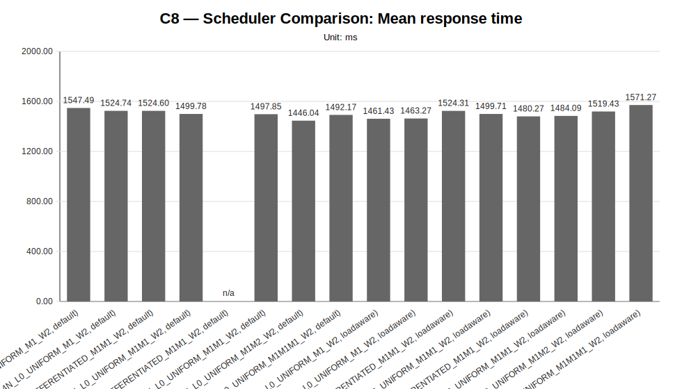
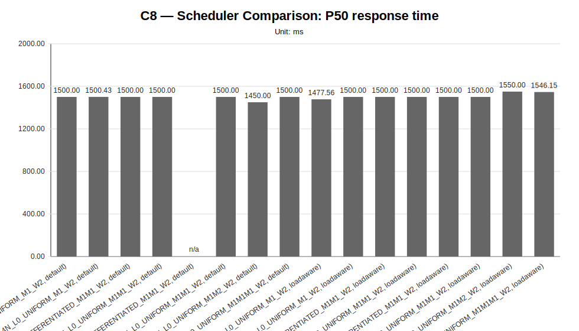
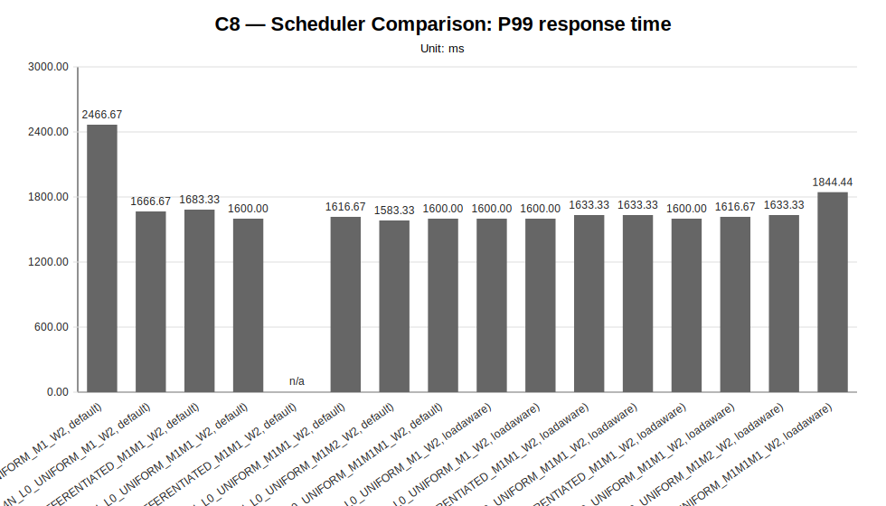
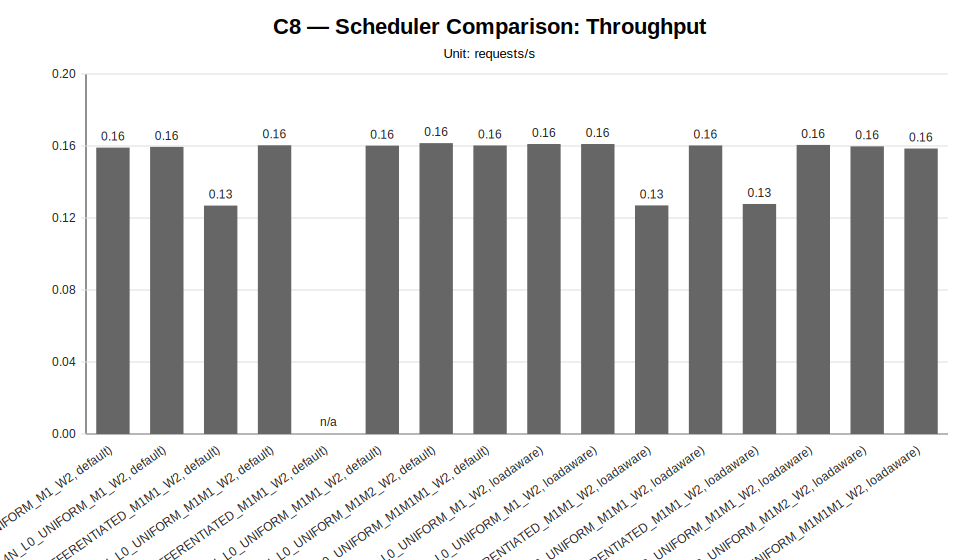
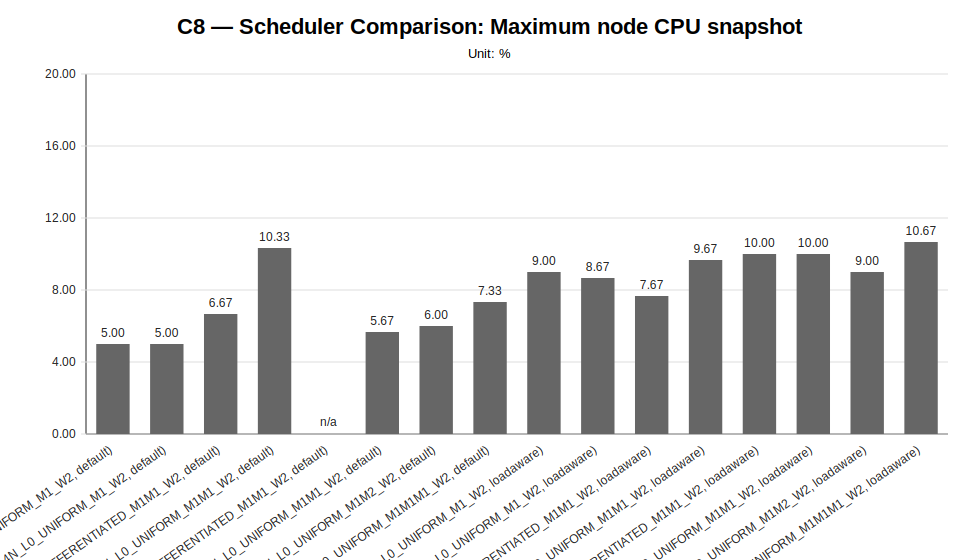
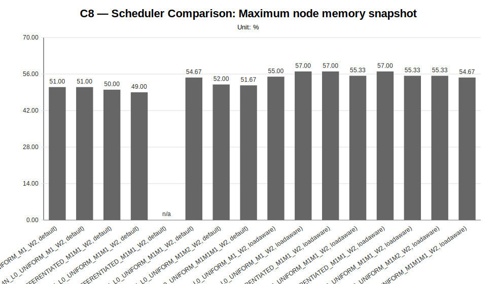
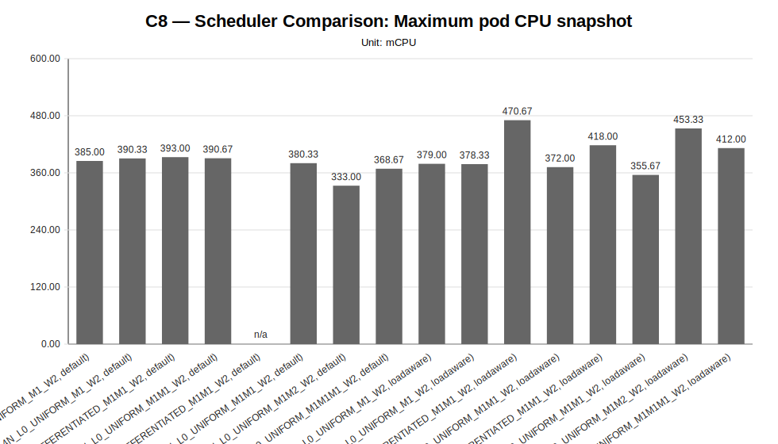
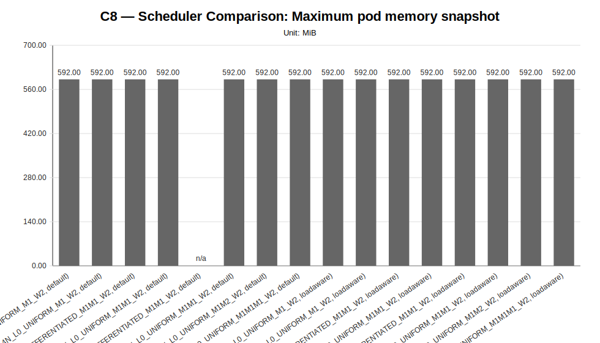

# C8 — Scheduler Comparison Report

**Cycle ID:** `C8`
**Reporting Profile:** `RP_C8_SCHEDULER_COMPARISON`
**Reporting ID:** `REP_C8_20260619T174611Z`
**Generated at UTC:** `2026-06-19T17:50:31Z`

## Purpose

This report compares Kubernetes default scheduling and the load-aware custom scheduler for paired LocalAI worker-mode scenarios. It summarizes performance, runtime placement, resource balance, annotation evidence and supported or unsupported outcomes.

The report combines **measurement CSV data**, **minimal observability evidence**, **cluster validation outputs**, **application topology metadata** and **technical diagnosis context** when those artifacts are available.

[Back to cycle report index](../../index.html)

## Cross-cycle baseline reference

The values below describe the global baseline configuration used as a cross-cycle reference. Scenario-specific and sweep-local sections report the effective infrastructure, placement, worker count and runtime configuration used by each scenario. Percentage deltas are computed against the family-local reference scenario when one is defined for the sweep.

| Dimension | Reference value |
|---|---|
| Baseline ID | B1 |
| Model | llama-3.2-1b-instruct:q4_k_m |
| Worker count | 2 |
| Placement | colocated_genai_pb_worker_02 |
| Workload | users=2, spawnRate=1, runTime=2m |
| Prompt | Reply with only READY. |
| Request timeout | 120 s |
| Infrastructure profile | INFRA_C1_1CP_2W_8C16G |
| Placement profile | PL_COLOCATED |

## Family-local reference scenarios

The scenarios below are the sweep-local references used to interpret percentage deltas within each family. They may differ from the cross-cycle baseline when a campaign intentionally varies infrastructure, placement, latency or tenancy.

| Sweep | Reference scenario | Description | Status | Varied dimension |
|---|---|---|---|---|
| Scheduler Comparison | `SC_DEFAULT_1T_4N_L0_UNIFORM_M1_W2` | SC_DEFAULT_1T_4N_L0_UNIFORM_M1_W2 (1T_4N_L0_UNIFORM_M1_W2, default) | measured | scheduler mode, tenant count, worker-node count, tenant traffic profile and model mix |

## Data sources

| Layer | Primary use | Source |
|---|---|---|
| Measurement CSV | Quantitative charts and scenario summary metrics | `{"scheduler-comparison": "results/experimental-cycles/C8/benchmark/scheduler-comparison"}` |
| Technical diagnosis | Interpretation, family judgments, findings, unsupported-scenario context | `results/experimental-cycles/C8/diagnosis/analysis_diagnosis_all_NA_20260619T175029Z_diagnosis.json` |
| Scenario configuration | Fixed/varied dimensions and scenario labels | `config/scenarios/**` |
| Cluster-side artifacts | CPU/memory snapshots, pod placement and event evidence | `minimal observability and cluster capture artifacts` |
| Reporting output | Current generated report package | `results/experimental-cycles/C8/reporting` |

## Infrastructure Summary

This reporting profile uses variant-scoped infrastructure: infrastructure profiles are attached to individual scenarios rather than to one fixed cycle-level cluster shape.

| Scenario | Family | Infrastructure profile | Infrastructure profile path | Provider | Provider binding | Worker nodes | Worker vCPU/node | Worker memory/node | Lifecycle mode |
|---|---|---|---|---|---|---|---|---|---|
| `SC_DEFAULT_1T_2N_L0_UNIFORM_M1_W2` | scheduler-comparison | INFRA_C8_1CP_2W_8C16G | config/infrastructure/profiles/INFRA_C8_1CP_2W_8C16G.json | proxmox-k3s | BINDING_INFRA_C8_1CP_2W_8C16G_PROXMOX_K3S | 2 | 8 vCPU | 16 GiB | ephemeral |
| `SC_DEFAULT_1T_4N_L0_UNIFORM_M1_W2` | scheduler-comparison | INFRA_C8_1CP_4W_8C16G | config/infrastructure/profiles/INFRA_C8_1CP_4W_8C16G.json | proxmox-k3s | BINDING_INFRA_C8_1CP_4W_8C16G_PROXMOX_K3S | 4 | 8 vCPU | 16 GiB | ephemeral |
| `SC_DEFAULT_2T_2N_L0_DIFFERENTIATED_M1M1_W2` | scheduler-comparison | INFRA_C8_1CP_2W_8C16G | config/infrastructure/profiles/INFRA_C8_1CP_2W_8C16G.json | proxmox-k3s | BINDING_INFRA_C8_1CP_2W_8C16G_PROXMOX_K3S | 2 | 8 vCPU | 16 GiB | ephemeral |
| `SC_DEFAULT_2T_2N_L0_UNIFORM_M1M1_W2` | scheduler-comparison | INFRA_C8_1CP_2W_8C16G | config/infrastructure/profiles/INFRA_C8_1CP_2W_8C16G.json | proxmox-k3s | BINDING_INFRA_C8_1CP_2W_8C16G_PROXMOX_K3S | 2 | 8 vCPU | 16 GiB | ephemeral |
| `SC_DEFAULT_2T_4N_L0_DIFFERENTIATED_M1M1_W2` | scheduler-comparison | INFRA_C8_1CP_4W_8C16G | config/infrastructure/profiles/INFRA_C8_1CP_4W_8C16G.json | proxmox-k3s | BINDING_INFRA_C8_1CP_4W_8C16G_PROXMOX_K3S | 4 | 8 vCPU | 16 GiB | ephemeral |
| `SC_DEFAULT_2T_4N_L0_UNIFORM_M1M1_W2` | scheduler-comparison | INFRA_C8_1CP_4W_8C16G | config/infrastructure/profiles/INFRA_C8_1CP_4W_8C16G.json | proxmox-k3s | BINDING_INFRA_C8_1CP_4W_8C16G_PROXMOX_K3S | 4 | 8 vCPU | 16 GiB | ephemeral |
| `SC_DEFAULT_2T_4N_L0_UNIFORM_M1M2_W2` | scheduler-comparison | INFRA_C8_1CP_4W_8C16G | config/infrastructure/profiles/INFRA_C8_1CP_4W_8C16G.json | proxmox-k3s | BINDING_INFRA_C8_1CP_4W_8C16G_PROXMOX_K3S | 4 | 8 vCPU | 16 GiB | ephemeral |
| `SC_DEFAULT_3T_4N_L0_UNIFORM_M1M1M1_W2` | scheduler-comparison | INFRA_C8_1CP_4W_8C16G | config/infrastructure/profiles/INFRA_C8_1CP_4W_8C16G.json | proxmox-k3s | BINDING_INFRA_C8_1CP_4W_8C16G_PROXMOX_K3S | 4 | 8 vCPU | 16 GiB | ephemeral |
| `SC_LOADAWARE_1T_2N_L0_UNIFORM_M1_W2` | scheduler-comparison | INFRA_C8_1CP_2W_8C16G | config/infrastructure/profiles/INFRA_C8_1CP_2W_8C16G.json | proxmox-k3s | BINDING_INFRA_C8_1CP_2W_8C16G_PROXMOX_K3S | 2 | 8 vCPU | 16 GiB | ephemeral |
| `SC_LOADAWARE_1T_4N_L0_UNIFORM_M1_W2` | scheduler-comparison | INFRA_C8_1CP_4W_8C16G | config/infrastructure/profiles/INFRA_C8_1CP_4W_8C16G.json | proxmox-k3s | BINDING_INFRA_C8_1CP_4W_8C16G_PROXMOX_K3S | 4 | 8 vCPU | 16 GiB | ephemeral |
| `SC_LOADAWARE_2T_2N_L0_DIFFERENTIATED_M1M1_W2` | scheduler-comparison | INFRA_C8_1CP_2W_8C16G | config/infrastructure/profiles/INFRA_C8_1CP_2W_8C16G.json | proxmox-k3s | BINDING_INFRA_C8_1CP_2W_8C16G_PROXMOX_K3S | 2 | 8 vCPU | 16 GiB | ephemeral |
| `SC_LOADAWARE_2T_2N_L0_UNIFORM_M1M1_W2` | scheduler-comparison | INFRA_C8_1CP_2W_8C16G | config/infrastructure/profiles/INFRA_C8_1CP_2W_8C16G.json | proxmox-k3s | BINDING_INFRA_C8_1CP_2W_8C16G_PROXMOX_K3S | 2 | 8 vCPU | 16 GiB | ephemeral |
| `SC_LOADAWARE_2T_4N_L0_DIFFERENTIATED_M1M1_W2` | scheduler-comparison | INFRA_C8_1CP_4W_8C16G | config/infrastructure/profiles/INFRA_C8_1CP_4W_8C16G.json | proxmox-k3s | BINDING_INFRA_C8_1CP_4W_8C16G_PROXMOX_K3S | 4 | 8 vCPU | 16 GiB | ephemeral |
| `SC_LOADAWARE_2T_4N_L0_UNIFORM_M1M1_W2` | scheduler-comparison | INFRA_C8_1CP_4W_8C16G | config/infrastructure/profiles/INFRA_C8_1CP_4W_8C16G.json | proxmox-k3s | BINDING_INFRA_C8_1CP_4W_8C16G_PROXMOX_K3S | 4 | 8 vCPU | 16 GiB | ephemeral |
| `SC_LOADAWARE_2T_4N_L0_UNIFORM_M1M2_W2` | scheduler-comparison | INFRA_C8_1CP_4W_8C16G | config/infrastructure/profiles/INFRA_C8_1CP_4W_8C16G.json | proxmox-k3s | BINDING_INFRA_C8_1CP_4W_8C16G_PROXMOX_K3S | 4 | 8 vCPU | 16 GiB | ephemeral |
| `SC_LOADAWARE_3T_4N_L0_UNIFORM_M1M1M1_W2` | scheduler-comparison | INFRA_C8_1CP_4W_8C16G | config/infrastructure/profiles/INFRA_C8_1CP_4W_8C16G.json | proxmox-k3s | BINDING_INFRA_C8_1CP_4W_8C16G_PROXMOX_K3S | 4 | 8 vCPU | 16 GiB | ephemeral |

## Provider Summary

This campaign may resolve provider configuration at scenario or variant level. The table below exposes provider bindings and concrete configuration paths per scenario whenever available.

| Scenario | Family | Provider | Provider binding | Provider binding path | Example config | Local config | Kubeconfig |
|---|---|---|---|---|---|---|---|
| `SC_DEFAULT_1T_2N_L0_UNIFORM_M1_W2` | scheduler-comparison | proxmox-k3s | BINDING_INFRA_C8_1CP_2W_8C16G_PROXMOX_K3S | config/infrastructure/providers/proxmox-k3s/bindings/BINDING_INFRA_C8_1CP_2W_8C16G_PROXMOX_K3S.json | config/infrastructure/providers/proxmox-k3s/examples/cluster.c8-1cp-2w-8c16g.example.yaml | config/infrastructure/providers/proxmox-k3s/local/cluster.c8-1cp-2w-8c16g.local.yaml | config/cluster-access/generated/proxmox-k3s/c8-1cp-2w-8c16g/kubeconfig |
| `SC_DEFAULT_1T_4N_L0_UNIFORM_M1_W2` | scheduler-comparison | proxmox-k3s | BINDING_INFRA_C8_1CP_4W_8C16G_PROXMOX_K3S | config/infrastructure/providers/proxmox-k3s/bindings/BINDING_INFRA_C8_1CP_4W_8C16G_PROXMOX_K3S.json | config/infrastructure/providers/proxmox-k3s/examples/cluster.c8-1cp-4w-8c16g.example.yaml | config/infrastructure/providers/proxmox-k3s/local/cluster.c8-1cp-4w-8c16g.local.yaml | config/cluster-access/generated/proxmox-k3s/c8-1cp-4w-8c16g/kubeconfig |
| `SC_DEFAULT_2T_2N_L0_DIFFERENTIATED_M1M1_W2` | scheduler-comparison | proxmox-k3s | BINDING_INFRA_C8_1CP_2W_8C16G_PROXMOX_K3S | config/infrastructure/providers/proxmox-k3s/bindings/BINDING_INFRA_C8_1CP_2W_8C16G_PROXMOX_K3S.json | config/infrastructure/providers/proxmox-k3s/examples/cluster.c8-1cp-2w-8c16g.example.yaml | config/infrastructure/providers/proxmox-k3s/local/cluster.c8-1cp-2w-8c16g.local.yaml | config/cluster-access/generated/proxmox-k3s/c8-1cp-2w-8c16g/kubeconfig |
| `SC_DEFAULT_2T_2N_L0_UNIFORM_M1M1_W2` | scheduler-comparison | proxmox-k3s | BINDING_INFRA_C8_1CP_2W_8C16G_PROXMOX_K3S | config/infrastructure/providers/proxmox-k3s/bindings/BINDING_INFRA_C8_1CP_2W_8C16G_PROXMOX_K3S.json | config/infrastructure/providers/proxmox-k3s/examples/cluster.c8-1cp-2w-8c16g.example.yaml | config/infrastructure/providers/proxmox-k3s/local/cluster.c8-1cp-2w-8c16g.local.yaml | config/cluster-access/generated/proxmox-k3s/c8-1cp-2w-8c16g/kubeconfig |
| `SC_DEFAULT_2T_4N_L0_DIFFERENTIATED_M1M1_W2` | scheduler-comparison | proxmox-k3s | BINDING_INFRA_C8_1CP_4W_8C16G_PROXMOX_K3S | config/infrastructure/providers/proxmox-k3s/bindings/BINDING_INFRA_C8_1CP_4W_8C16G_PROXMOX_K3S.json | config/infrastructure/providers/proxmox-k3s/examples/cluster.c8-1cp-4w-8c16g.example.yaml | config/infrastructure/providers/proxmox-k3s/local/cluster.c8-1cp-4w-8c16g.local.yaml | config/cluster-access/generated/proxmox-k3s/c8-1cp-4w-8c16g/kubeconfig |
| `SC_DEFAULT_2T_4N_L0_UNIFORM_M1M1_W2` | scheduler-comparison | proxmox-k3s | BINDING_INFRA_C8_1CP_4W_8C16G_PROXMOX_K3S | config/infrastructure/providers/proxmox-k3s/bindings/BINDING_INFRA_C8_1CP_4W_8C16G_PROXMOX_K3S.json | config/infrastructure/providers/proxmox-k3s/examples/cluster.c8-1cp-4w-8c16g.example.yaml | config/infrastructure/providers/proxmox-k3s/local/cluster.c8-1cp-4w-8c16g.local.yaml | config/cluster-access/generated/proxmox-k3s/c8-1cp-4w-8c16g/kubeconfig |
| `SC_DEFAULT_2T_4N_L0_UNIFORM_M1M2_W2` | scheduler-comparison | proxmox-k3s | BINDING_INFRA_C8_1CP_4W_8C16G_PROXMOX_K3S | config/infrastructure/providers/proxmox-k3s/bindings/BINDING_INFRA_C8_1CP_4W_8C16G_PROXMOX_K3S.json | config/infrastructure/providers/proxmox-k3s/examples/cluster.c8-1cp-4w-8c16g.example.yaml | config/infrastructure/providers/proxmox-k3s/local/cluster.c8-1cp-4w-8c16g.local.yaml | config/cluster-access/generated/proxmox-k3s/c8-1cp-4w-8c16g/kubeconfig |
| `SC_DEFAULT_3T_4N_L0_UNIFORM_M1M1M1_W2` | scheduler-comparison | proxmox-k3s | BINDING_INFRA_C8_1CP_4W_8C16G_PROXMOX_K3S | config/infrastructure/providers/proxmox-k3s/bindings/BINDING_INFRA_C8_1CP_4W_8C16G_PROXMOX_K3S.json | config/infrastructure/providers/proxmox-k3s/examples/cluster.c8-1cp-4w-8c16g.example.yaml | config/infrastructure/providers/proxmox-k3s/local/cluster.c8-1cp-4w-8c16g.local.yaml | config/cluster-access/generated/proxmox-k3s/c8-1cp-4w-8c16g/kubeconfig |
| `SC_LOADAWARE_1T_2N_L0_UNIFORM_M1_W2` | scheduler-comparison | proxmox-k3s | BINDING_INFRA_C8_1CP_2W_8C16G_PROXMOX_K3S | config/infrastructure/providers/proxmox-k3s/bindings/BINDING_INFRA_C8_1CP_2W_8C16G_PROXMOX_K3S.json | config/infrastructure/providers/proxmox-k3s/examples/cluster.c8-1cp-2w-8c16g.example.yaml | config/infrastructure/providers/proxmox-k3s/local/cluster.c8-1cp-2w-8c16g.local.yaml | config/cluster-access/generated/proxmox-k3s/c8-1cp-2w-8c16g/kubeconfig |
| `SC_LOADAWARE_1T_4N_L0_UNIFORM_M1_W2` | scheduler-comparison | proxmox-k3s | BINDING_INFRA_C8_1CP_4W_8C16G_PROXMOX_K3S | config/infrastructure/providers/proxmox-k3s/bindings/BINDING_INFRA_C8_1CP_4W_8C16G_PROXMOX_K3S.json | config/infrastructure/providers/proxmox-k3s/examples/cluster.c8-1cp-4w-8c16g.example.yaml | config/infrastructure/providers/proxmox-k3s/local/cluster.c8-1cp-4w-8c16g.local.yaml | config/cluster-access/generated/proxmox-k3s/c8-1cp-4w-8c16g/kubeconfig |
| `SC_LOADAWARE_2T_2N_L0_DIFFERENTIATED_M1M1_W2` | scheduler-comparison | proxmox-k3s | BINDING_INFRA_C8_1CP_2W_8C16G_PROXMOX_K3S | config/infrastructure/providers/proxmox-k3s/bindings/BINDING_INFRA_C8_1CP_2W_8C16G_PROXMOX_K3S.json | config/infrastructure/providers/proxmox-k3s/examples/cluster.c8-1cp-2w-8c16g.example.yaml | config/infrastructure/providers/proxmox-k3s/local/cluster.c8-1cp-2w-8c16g.local.yaml | config/cluster-access/generated/proxmox-k3s/c8-1cp-2w-8c16g/kubeconfig |
| `SC_LOADAWARE_2T_2N_L0_UNIFORM_M1M1_W2` | scheduler-comparison | proxmox-k3s | BINDING_INFRA_C8_1CP_2W_8C16G_PROXMOX_K3S | config/infrastructure/providers/proxmox-k3s/bindings/BINDING_INFRA_C8_1CP_2W_8C16G_PROXMOX_K3S.json | config/infrastructure/providers/proxmox-k3s/examples/cluster.c8-1cp-2w-8c16g.example.yaml | config/infrastructure/providers/proxmox-k3s/local/cluster.c8-1cp-2w-8c16g.local.yaml | config/cluster-access/generated/proxmox-k3s/c8-1cp-2w-8c16g/kubeconfig |
| `SC_LOADAWARE_2T_4N_L0_DIFFERENTIATED_M1M1_W2` | scheduler-comparison | proxmox-k3s | BINDING_INFRA_C8_1CP_4W_8C16G_PROXMOX_K3S | config/infrastructure/providers/proxmox-k3s/bindings/BINDING_INFRA_C8_1CP_4W_8C16G_PROXMOX_K3S.json | config/infrastructure/providers/proxmox-k3s/examples/cluster.c8-1cp-4w-8c16g.example.yaml | config/infrastructure/providers/proxmox-k3s/local/cluster.c8-1cp-4w-8c16g.local.yaml | config/cluster-access/generated/proxmox-k3s/c8-1cp-4w-8c16g/kubeconfig |
| `SC_LOADAWARE_2T_4N_L0_UNIFORM_M1M1_W2` | scheduler-comparison | proxmox-k3s | BINDING_INFRA_C8_1CP_4W_8C16G_PROXMOX_K3S | config/infrastructure/providers/proxmox-k3s/bindings/BINDING_INFRA_C8_1CP_4W_8C16G_PROXMOX_K3S.json | config/infrastructure/providers/proxmox-k3s/examples/cluster.c8-1cp-4w-8c16g.example.yaml | config/infrastructure/providers/proxmox-k3s/local/cluster.c8-1cp-4w-8c16g.local.yaml | config/cluster-access/generated/proxmox-k3s/c8-1cp-4w-8c16g/kubeconfig |
| `SC_LOADAWARE_2T_4N_L0_UNIFORM_M1M2_W2` | scheduler-comparison | proxmox-k3s | BINDING_INFRA_C8_1CP_4W_8C16G_PROXMOX_K3S | config/infrastructure/providers/proxmox-k3s/bindings/BINDING_INFRA_C8_1CP_4W_8C16G_PROXMOX_K3S.json | config/infrastructure/providers/proxmox-k3s/examples/cluster.c8-1cp-4w-8c16g.example.yaml | config/infrastructure/providers/proxmox-k3s/local/cluster.c8-1cp-4w-8c16g.local.yaml | config/cluster-access/generated/proxmox-k3s/c8-1cp-4w-8c16g/kubeconfig |
| `SC_LOADAWARE_3T_4N_L0_UNIFORM_M1M1M1_W2` | scheduler-comparison | proxmox-k3s | BINDING_INFRA_C8_1CP_4W_8C16G_PROXMOX_K3S | config/infrastructure/providers/proxmox-k3s/bindings/BINDING_INFRA_C8_1CP_4W_8C16G_PROXMOX_K3S.json | config/infrastructure/providers/proxmox-k3s/examples/cluster.c8-1cp-4w-8c16g.example.yaml | config/infrastructure/providers/proxmox-k3s/local/cluster.c8-1cp-4w-8c16g.local.yaml | config/cluster-access/generated/proxmox-k3s/c8-1cp-4w-8c16g/kubeconfig |

## Cluster Validation Summary

| Item | Value |
|---|---|
| Validation profile | CV_PROVIDER_BACKED_VALIDATION_TEMPLATE |
| Profile file | config/cluster-validation/templates/CV_PROVIDER_BACKED_VALIDATION_TEMPLATE.json |
| Latest manifest | variant-scoped validation manifests (16 available) |
| Current status | variant-scoped validation available (16/16 validated) |
| Variant validation statuses | validated=16 |
| Latest raw validation | variant-scoped validation evidence is recorded in the campaign execution manifest and generated runtime profiles under results/experimental-cycles/C8/execution/generated-runtime-configs |
| Accepted provisioning statuses | completed |
| Required kubeconfig status | verified |
| Artifact root | results/experimental-cycles/C8/execution/generated-runtime-configs |

## Runtime Profile Variant Summary

This table links each scenario to the runtime-generated profiles used for precheck, application deployment and minimal observability evidence.

| Scenario | Family | Precheck profile | Precheck profile path | Application deployment profile | Application deployment profile path | Minimal observability profile | Minimal observability profile path | Cluster validation evidence |
|---|---|---|---|---|---|---|---|---|
| `SC_DEFAULT_1T_2N_L0_UNIFORM_M1_W2` | scheduler-comparison | TC_C8_SC_DEFAULT_1T_2N_L0_UNIFORM_M1_W2 | results/experimental-cycles/C8/execution/generated-runtime-configs/SC_DEFAULT_1T_2N_L0_UNIFORM_M1_W2/TC_SC_DEFAULT_1T_2N_L0_UNIFORM_M1_W2.json | AD_SC_DEFAULT_1T_2N_L0_UNIFORM_M1_W2 | results/experimental-cycles/C8/execution/generated-runtime-configs/SC_DEFAULT_1T_2N_L0_UNIFORM_M1_W2/AD_SC_DEFAULT_1T_2N_L0_UNIFORM_M1_W2.json | MO_SC_DEFAULT_1T_2N_L0_UNIFORM_M1_W2 | results/experimental-cycles/C8/execution/generated-runtime-configs/SC_DEFAULT_1T_2N_L0_UNIFORM_M1_W2/MO_SC_DEFAULT_1T_2N_L0_UNIFORM_M1_W2.json | results/experimental-cycles/C8/variants/SC_DEFAULT_1T_2N_L0_UNIFORM_M1_W2/infrastructure/validation/latest-cluster-validation-manifest.json (validated) |
| `SC_DEFAULT_1T_4N_L0_UNIFORM_M1_W2` | scheduler-comparison | TC_C8_SC_DEFAULT_1T_4N_L0_UNIFORM_M1_W2 | results/experimental-cycles/C8/execution/generated-runtime-configs/SC_DEFAULT_1T_4N_L0_UNIFORM_M1_W2/TC_SC_DEFAULT_1T_4N_L0_UNIFORM_M1_W2.json | AD_SC_DEFAULT_1T_4N_L0_UNIFORM_M1_W2 | results/experimental-cycles/C8/execution/generated-runtime-configs/SC_DEFAULT_1T_4N_L0_UNIFORM_M1_W2/AD_SC_DEFAULT_1T_4N_L0_UNIFORM_M1_W2.json | MO_SC_DEFAULT_1T_4N_L0_UNIFORM_M1_W2 | results/experimental-cycles/C8/execution/generated-runtime-configs/SC_DEFAULT_1T_4N_L0_UNIFORM_M1_W2/MO_SC_DEFAULT_1T_4N_L0_UNIFORM_M1_W2.json | results/experimental-cycles/C8/variants/SC_DEFAULT_1T_4N_L0_UNIFORM_M1_W2/infrastructure/validation/latest-cluster-validation-manifest.json (validated) |
| `SC_DEFAULT_2T_2N_L0_DIFFERENTIATED_M1M1_W2` | scheduler-comparison | TC_C8_SC_DEFAULT_2T_2N_L0_DIFFERENTIATED_M1M1_W2 | results/experimental-cycles/C8/execution/generated-runtime-configs/SC_DEFAULT_2T_2N_L0_DIFFERENTIATED_M1M1_W2/TC_SC_DEFAULT_2T_2N_L0_DIFFERENTIATED_M1M1_W2.json | AD_SC_DEFAULT_2T_2N_L0_DIFFERENTIATED_M1M1_W2 | results/experimental-cycles/C8/execution/generated-runtime-configs/SC_DEFAULT_2T_2N_L0_DIFFERENTIATED_M1M1_W2/AD_SC_DEFAULT_2T_2N_L0_DIFFERENTIATED_M1M1_W2.json | MO_SC_DEFAULT_2T_2N_L0_DIFFERENTIATED_M1M1_W2 | results/experimental-cycles/C8/execution/generated-runtime-configs/SC_DEFAULT_2T_2N_L0_DIFFERENTIATED_M1M1_W2/MO_SC_DEFAULT_2T_2N_L0_DIFFERENTIATED_M1M1_W2.json | results/experimental-cycles/C8/variants/SC_DEFAULT_2T_2N_L0_DIFFERENTIATED_M1M1_W2/infrastructure/validation/latest-cluster-validation-manifest.json (validated) |
| `SC_DEFAULT_2T_2N_L0_UNIFORM_M1M1_W2` | scheduler-comparison | TC_C8_SC_DEFAULT_2T_2N_L0_UNIFORM_M1M1_W2 | results/experimental-cycles/C8/execution/generated-runtime-configs/SC_DEFAULT_2T_2N_L0_UNIFORM_M1M1_W2/TC_SC_DEFAULT_2T_2N_L0_UNIFORM_M1M1_W2.json | AD_SC_DEFAULT_2T_2N_L0_UNIFORM_M1M1_W2 | results/experimental-cycles/C8/execution/generated-runtime-configs/SC_DEFAULT_2T_2N_L0_UNIFORM_M1M1_W2/AD_SC_DEFAULT_2T_2N_L0_UNIFORM_M1M1_W2.json | MO_SC_DEFAULT_2T_2N_L0_UNIFORM_M1M1_W2 | results/experimental-cycles/C8/execution/generated-runtime-configs/SC_DEFAULT_2T_2N_L0_UNIFORM_M1M1_W2/MO_SC_DEFAULT_2T_2N_L0_UNIFORM_M1M1_W2.json | results/experimental-cycles/C8/variants/SC_DEFAULT_2T_2N_L0_UNIFORM_M1M1_W2/infrastructure/validation/latest-cluster-validation-manifest.json (validated) |
| `SC_DEFAULT_2T_4N_L0_DIFFERENTIATED_M1M1_W2` | scheduler-comparison | TC_C8_SC_DEFAULT_2T_4N_L0_DIFFERENTIATED_M1M1_W2 | results/experimental-cycles/C8/execution/generated-runtime-configs/SC_DEFAULT_2T_4N_L0_DIFFERENTIATED_M1M1_W2/TC_SC_DEFAULT_2T_4N_L0_DIFFERENTIATED_M1M1_W2.json | AD_SC_DEFAULT_2T_4N_L0_DIFFERENTIATED_M1M1_W2 | results/experimental-cycles/C8/execution/generated-runtime-configs/SC_DEFAULT_2T_4N_L0_DIFFERENTIATED_M1M1_W2/AD_SC_DEFAULT_2T_4N_L0_DIFFERENTIATED_M1M1_W2.json | MO_SC_DEFAULT_2T_4N_L0_DIFFERENTIATED_M1M1_W2 | results/experimental-cycles/C8/execution/generated-runtime-configs/SC_DEFAULT_2T_4N_L0_DIFFERENTIATED_M1M1_W2/MO_SC_DEFAULT_2T_4N_L0_DIFFERENTIATED_M1M1_W2.json | results/experimental-cycles/C8/variants/SC_DEFAULT_2T_4N_L0_DIFFERENTIATED_M1M1_W2/infrastructure/validation/latest-cluster-validation-manifest.json (validated) |
| `SC_DEFAULT_2T_4N_L0_UNIFORM_M1M1_W2` | scheduler-comparison | TC_C8_SC_DEFAULT_2T_4N_L0_UNIFORM_M1M1_W2 | results/experimental-cycles/C8/execution/generated-runtime-configs/SC_DEFAULT_2T_4N_L0_UNIFORM_M1M1_W2/TC_SC_DEFAULT_2T_4N_L0_UNIFORM_M1M1_W2.json | AD_SC_DEFAULT_2T_4N_L0_UNIFORM_M1M1_W2 | results/experimental-cycles/C8/execution/generated-runtime-configs/SC_DEFAULT_2T_4N_L0_UNIFORM_M1M1_W2/AD_SC_DEFAULT_2T_4N_L0_UNIFORM_M1M1_W2.json | MO_SC_DEFAULT_2T_4N_L0_UNIFORM_M1M1_W2 | results/experimental-cycles/C8/execution/generated-runtime-configs/SC_DEFAULT_2T_4N_L0_UNIFORM_M1M1_W2/MO_SC_DEFAULT_2T_4N_L0_UNIFORM_M1M1_W2.json | results/experimental-cycles/C8/variants/SC_DEFAULT_2T_4N_L0_UNIFORM_M1M1_W2/infrastructure/validation/latest-cluster-validation-manifest.json (validated) |
| `SC_DEFAULT_2T_4N_L0_UNIFORM_M1M2_W2` | scheduler-comparison | TC_C8_SC_DEFAULT_2T_4N_L0_UNIFORM_M1M2_W2 | results/experimental-cycles/C8/execution/generated-runtime-configs/SC_DEFAULT_2T_4N_L0_UNIFORM_M1M2_W2/TC_SC_DEFAULT_2T_4N_L0_UNIFORM_M1M2_W2.json | AD_SC_DEFAULT_2T_4N_L0_UNIFORM_M1M2_W2 | results/experimental-cycles/C8/execution/generated-runtime-configs/SC_DEFAULT_2T_4N_L0_UNIFORM_M1M2_W2/AD_SC_DEFAULT_2T_4N_L0_UNIFORM_M1M2_W2.json | MO_SC_DEFAULT_2T_4N_L0_UNIFORM_M1M2_W2 | results/experimental-cycles/C8/execution/generated-runtime-configs/SC_DEFAULT_2T_4N_L0_UNIFORM_M1M2_W2/MO_SC_DEFAULT_2T_4N_L0_UNIFORM_M1M2_W2.json | results/experimental-cycles/C8/variants/SC_DEFAULT_2T_4N_L0_UNIFORM_M1M2_W2/infrastructure/validation/latest-cluster-validation-manifest.json (validated) |
| `SC_DEFAULT_3T_4N_L0_UNIFORM_M1M1M1_W2` | scheduler-comparison | TC_C8_SC_DEFAULT_3T_4N_L0_UNIFORM_M1M1M1_W2 | results/experimental-cycles/C8/execution/generated-runtime-configs/SC_DEFAULT_3T_4N_L0_UNIFORM_M1M1M1_W2/TC_SC_DEFAULT_3T_4N_L0_UNIFORM_M1M1M1_W2.json | AD_SC_DEFAULT_3T_4N_L0_UNIFORM_M1M1M1_W2 | results/experimental-cycles/C8/execution/generated-runtime-configs/SC_DEFAULT_3T_4N_L0_UNIFORM_M1M1M1_W2/AD_SC_DEFAULT_3T_4N_L0_UNIFORM_M1M1M1_W2.json | MO_SC_DEFAULT_3T_4N_L0_UNIFORM_M1M1M1_W2 | results/experimental-cycles/C8/execution/generated-runtime-configs/SC_DEFAULT_3T_4N_L0_UNIFORM_M1M1M1_W2/MO_SC_DEFAULT_3T_4N_L0_UNIFORM_M1M1M1_W2.json | results/experimental-cycles/C8/variants/SC_DEFAULT_3T_4N_L0_UNIFORM_M1M1M1_W2/infrastructure/validation/latest-cluster-validation-manifest.json (validated) |
| `SC_LOADAWARE_1T_2N_L0_UNIFORM_M1_W2` | scheduler-comparison | TC_C8_SC_LOADAWARE_1T_2N_L0_UNIFORM_M1_W2 | results/experimental-cycles/C8/execution/generated-runtime-configs/SC_LOADAWARE_1T_2N_L0_UNIFORM_M1_W2/TC_SC_LOADAWARE_1T_2N_L0_UNIFORM_M1_W2.json | AD_SC_LOADAWARE_1T_2N_L0_UNIFORM_M1_W2 | results/experimental-cycles/C8/execution/generated-runtime-configs/SC_LOADAWARE_1T_2N_L0_UNIFORM_M1_W2/AD_SC_LOADAWARE_1T_2N_L0_UNIFORM_M1_W2.json | MO_SC_LOADAWARE_1T_2N_L0_UNIFORM_M1_W2 | results/experimental-cycles/C8/execution/generated-runtime-configs/SC_LOADAWARE_1T_2N_L0_UNIFORM_M1_W2/MO_SC_LOADAWARE_1T_2N_L0_UNIFORM_M1_W2.json | results/experimental-cycles/C8/variants/SC_LOADAWARE_1T_2N_L0_UNIFORM_M1_W2/infrastructure/validation/latest-cluster-validation-manifest.json (validated) |
| `SC_LOADAWARE_1T_4N_L0_UNIFORM_M1_W2` | scheduler-comparison | TC_C8_SC_LOADAWARE_1T_4N_L0_UNIFORM_M1_W2 | results/experimental-cycles/C8/execution/generated-runtime-configs/SC_LOADAWARE_1T_4N_L0_UNIFORM_M1_W2/TC_SC_LOADAWARE_1T_4N_L0_UNIFORM_M1_W2.json | AD_SC_LOADAWARE_1T_4N_L0_UNIFORM_M1_W2 | results/experimental-cycles/C8/execution/generated-runtime-configs/SC_LOADAWARE_1T_4N_L0_UNIFORM_M1_W2/AD_SC_LOADAWARE_1T_4N_L0_UNIFORM_M1_W2.json | MO_SC_LOADAWARE_1T_4N_L0_UNIFORM_M1_W2 | results/experimental-cycles/C8/execution/generated-runtime-configs/SC_LOADAWARE_1T_4N_L0_UNIFORM_M1_W2/MO_SC_LOADAWARE_1T_4N_L0_UNIFORM_M1_W2.json | results/experimental-cycles/C8/variants/SC_LOADAWARE_1T_4N_L0_UNIFORM_M1_W2/infrastructure/validation/latest-cluster-validation-manifest.json (validated) |
| `SC_LOADAWARE_2T_2N_L0_DIFFERENTIATED_M1M1_W2` | scheduler-comparison | TC_C8_SC_LOADAWARE_2T_2N_L0_DIFFERENTIATED_M1M1_W2 | results/experimental-cycles/C8/execution/generated-runtime-configs/SC_LOADAWARE_2T_2N_L0_DIFFERENTIATED_M1M1_W2/TC_SC_LOADAWARE_2T_2N_L0_DIFFERENTIATED_M1M1_W2.json | AD_SC_LOADAWARE_2T_2N_L0_DIFFERENTIATED_M1M1_W2 | results/experimental-cycles/C8/execution/generated-runtime-configs/SC_LOADAWARE_2T_2N_L0_DIFFERENTIATED_M1M1_W2/AD_SC_LOADAWARE_2T_2N_L0_DIFFERENTIATED_M1M1_W2.json | MO_SC_LOADAWARE_2T_2N_L0_DIFFERENTIATED_M1M1_W2 | results/experimental-cycles/C8/execution/generated-runtime-configs/SC_LOADAWARE_2T_2N_L0_DIFFERENTIATED_M1M1_W2/MO_SC_LOADAWARE_2T_2N_L0_DIFFERENTIATED_M1M1_W2.json | results/experimental-cycles/C8/variants/SC_LOADAWARE_2T_2N_L0_DIFFERENTIATED_M1M1_W2/infrastructure/validation/latest-cluster-validation-manifest.json (validated) |
| `SC_LOADAWARE_2T_2N_L0_UNIFORM_M1M1_W2` | scheduler-comparison | TC_C8_SC_LOADAWARE_2T_2N_L0_UNIFORM_M1M1_W2 | results/experimental-cycles/C8/execution/generated-runtime-configs/SC_LOADAWARE_2T_2N_L0_UNIFORM_M1M1_W2/TC_SC_LOADAWARE_2T_2N_L0_UNIFORM_M1M1_W2.json | AD_SC_LOADAWARE_2T_2N_L0_UNIFORM_M1M1_W2 | results/experimental-cycles/C8/execution/generated-runtime-configs/SC_LOADAWARE_2T_2N_L0_UNIFORM_M1M1_W2/AD_SC_LOADAWARE_2T_2N_L0_UNIFORM_M1M1_W2.json | MO_SC_LOADAWARE_2T_2N_L0_UNIFORM_M1M1_W2 | results/experimental-cycles/C8/execution/generated-runtime-configs/SC_LOADAWARE_2T_2N_L0_UNIFORM_M1M1_W2/MO_SC_LOADAWARE_2T_2N_L0_UNIFORM_M1M1_W2.json | results/experimental-cycles/C8/variants/SC_LOADAWARE_2T_2N_L0_UNIFORM_M1M1_W2/infrastructure/validation/latest-cluster-validation-manifest.json (validated) |
| `SC_LOADAWARE_2T_4N_L0_DIFFERENTIATED_M1M1_W2` | scheduler-comparison | TC_C8_SC_LOADAWARE_2T_4N_L0_DIFFERENTIATED_M1M1_W2 | results/experimental-cycles/C8/execution/generated-runtime-configs/SC_LOADAWARE_2T_4N_L0_DIFFERENTIATED_M1M1_W2/TC_SC_LOADAWARE_2T_4N_L0_DIFFERENTIATED_M1M1_W2.json | AD_SC_LOADAWARE_2T_4N_L0_DIFFERENTIATED_M1M1_W2 | results/experimental-cycles/C8/execution/generated-runtime-configs/SC_LOADAWARE_2T_4N_L0_DIFFERENTIATED_M1M1_W2/AD_SC_LOADAWARE_2T_4N_L0_DIFFERENTIATED_M1M1_W2.json | MO_SC_LOADAWARE_2T_4N_L0_DIFFERENTIATED_M1M1_W2 | results/experimental-cycles/C8/execution/generated-runtime-configs/SC_LOADAWARE_2T_4N_L0_DIFFERENTIATED_M1M1_W2/MO_SC_LOADAWARE_2T_4N_L0_DIFFERENTIATED_M1M1_W2.json | results/experimental-cycles/C8/variants/SC_LOADAWARE_2T_4N_L0_DIFFERENTIATED_M1M1_W2/infrastructure/validation/latest-cluster-validation-manifest.json (validated) |
| `SC_LOADAWARE_2T_4N_L0_UNIFORM_M1M1_W2` | scheduler-comparison | TC_C8_SC_LOADAWARE_2T_4N_L0_UNIFORM_M1M1_W2 | results/experimental-cycles/C8/execution/generated-runtime-configs/SC_LOADAWARE_2T_4N_L0_UNIFORM_M1M1_W2/TC_SC_LOADAWARE_2T_4N_L0_UNIFORM_M1M1_W2.json | AD_SC_LOADAWARE_2T_4N_L0_UNIFORM_M1M1_W2 | results/experimental-cycles/C8/execution/generated-runtime-configs/SC_LOADAWARE_2T_4N_L0_UNIFORM_M1M1_W2/AD_SC_LOADAWARE_2T_4N_L0_UNIFORM_M1M1_W2.json | MO_SC_LOADAWARE_2T_4N_L0_UNIFORM_M1M1_W2 | results/experimental-cycles/C8/execution/generated-runtime-configs/SC_LOADAWARE_2T_4N_L0_UNIFORM_M1M1_W2/MO_SC_LOADAWARE_2T_4N_L0_UNIFORM_M1M1_W2.json | results/experimental-cycles/C8/variants/SC_LOADAWARE_2T_4N_L0_UNIFORM_M1M1_W2/infrastructure/validation/latest-cluster-validation-manifest.json (validated) |
| `SC_LOADAWARE_2T_4N_L0_UNIFORM_M1M2_W2` | scheduler-comparison | TC_C8_SC_LOADAWARE_2T_4N_L0_UNIFORM_M1M2_W2 | results/experimental-cycles/C8/execution/generated-runtime-configs/SC_LOADAWARE_2T_4N_L0_UNIFORM_M1M2_W2/TC_SC_LOADAWARE_2T_4N_L0_UNIFORM_M1M2_W2.json | AD_SC_LOADAWARE_2T_4N_L0_UNIFORM_M1M2_W2 | results/experimental-cycles/C8/execution/generated-runtime-configs/SC_LOADAWARE_2T_4N_L0_UNIFORM_M1M2_W2/AD_SC_LOADAWARE_2T_4N_L0_UNIFORM_M1M2_W2.json | MO_SC_LOADAWARE_2T_4N_L0_UNIFORM_M1M2_W2 | results/experimental-cycles/C8/execution/generated-runtime-configs/SC_LOADAWARE_2T_4N_L0_UNIFORM_M1M2_W2/MO_SC_LOADAWARE_2T_4N_L0_UNIFORM_M1M2_W2.json | results/experimental-cycles/C8/variants/SC_LOADAWARE_2T_4N_L0_UNIFORM_M1M2_W2/infrastructure/validation/latest-cluster-validation-manifest.json (validated) |
| `SC_LOADAWARE_3T_4N_L0_UNIFORM_M1M1M1_W2` | scheduler-comparison | TC_C8_SC_LOADAWARE_3T_4N_L0_UNIFORM_M1M1M1_W2 | results/experimental-cycles/C8/execution/generated-runtime-configs/SC_LOADAWARE_3T_4N_L0_UNIFORM_M1M1M1_W2/TC_SC_LOADAWARE_3T_4N_L0_UNIFORM_M1M1M1_W2.json | AD_SC_LOADAWARE_3T_4N_L0_UNIFORM_M1M1M1_W2 | results/experimental-cycles/C8/execution/generated-runtime-configs/SC_LOADAWARE_3T_4N_L0_UNIFORM_M1M1M1_W2/AD_SC_LOADAWARE_3T_4N_L0_UNIFORM_M1M1M1_W2.json | MO_SC_LOADAWARE_3T_4N_L0_UNIFORM_M1M1M1_W2 | results/experimental-cycles/C8/execution/generated-runtime-configs/SC_LOADAWARE_3T_4N_L0_UNIFORM_M1M1M1_W2/MO_SC_LOADAWARE_3T_4N_L0_UNIFORM_M1M1M1_W2.json | results/experimental-cycles/C8/variants/SC_LOADAWARE_3T_4N_L0_UNIFORM_M1M1M1_W2/infrastructure/validation/latest-cluster-validation-manifest.json (validated) |

## Application Topology Summary

This campaign may vary placement, tenancy, latency profile or generated deployment profiles at scenario level. The table below exposes the scenario-level application topology used by each configured variant.

| Scenario | Family | Placement profile | Placement type | Topology dir | Server manifest | Worker count | Active RPC workers | Expected server node | Expected worker nodes | Latency profile | Tenancy profile | Generated deployment profile |
|---|---|---|---|---|---|---|---|---|---|---|---|---|
| `SC_DEFAULT_1T_2N_L0_UNIFORM_M1_W2` | scheduler-comparison | RUNTIME_SCHEDULER_DECISION | runtime_scheduler_decision | infra/k8s/compositions/scheduler-comparison/default-scheduler/single-tenant-m1-w2 | infra/k8s/compositions/scheduler-comparison/default-scheduler/single-tenant-m1-w2 | 2 | localai-rpc-a, localai-rpc-b | captured_at_runtime | captured_at_runtime | L0_NONE | tenants=1; tenantIds=tenant-a; trafficProfile=TR_1T_UNIFORM_LOW | results/experimental-cycles/C8/execution/generated-runtime-configs/SC_DEFAULT_1T_2N_L0_UNIFORM_M1_W2/AD_SC_DEFAULT_1T_2N_L0_UNIFORM_M1_W2.json |
| `SC_DEFAULT_1T_4N_L0_UNIFORM_M1_W2` | scheduler-comparison | RUNTIME_SCHEDULER_DECISION | runtime_scheduler_decision | infra/k8s/compositions/scheduler-comparison/default-scheduler/single-tenant-m1-w2 | infra/k8s/compositions/scheduler-comparison/default-scheduler/single-tenant-m1-w2 | 2 | localai-rpc-a, localai-rpc-b | captured_at_runtime | captured_at_runtime | L0_NONE | tenants=1; tenantIds=tenant-a; trafficProfile=TR_1T_UNIFORM_LOW | results/experimental-cycles/C8/execution/generated-runtime-configs/SC_DEFAULT_1T_4N_L0_UNIFORM_M1_W2/AD_SC_DEFAULT_1T_4N_L0_UNIFORM_M1_W2.json |
| `SC_DEFAULT_2T_2N_L0_DIFFERENTIATED_M1M1_W2` | scheduler-comparison | RUNTIME_SCHEDULER_DECISION | runtime_scheduler_decision | infra/k8s/compositions/scheduler-comparison/default-scheduler/two-tenants-m1m1-w2 | infra/k8s/compositions/scheduler-comparison/default-scheduler/two-tenants-m1m1-w2 | 2 | localai-rpc-a, localai-rpc-b | captured_at_runtime | captured_at_runtime | L0_NONE | tenants=2; tenantIds=tenant-a, tenant-b; trafficProfile=TR_2T_DIFFERENTIATED_LOW | results/experimental-cycles/C8/execution/generated-runtime-configs/SC_DEFAULT_2T_2N_L0_DIFFERENTIATED_M1M1_W2/AD_SC_DEFAULT_2T_2N_L0_DIFFERENTIATED_M1M1_W2.json |
| `SC_DEFAULT_2T_2N_L0_UNIFORM_M1M1_W2` | scheduler-comparison | RUNTIME_SCHEDULER_DECISION | runtime_scheduler_decision | infra/k8s/compositions/scheduler-comparison/default-scheduler/two-tenants-m1m1-w2 | infra/k8s/compositions/scheduler-comparison/default-scheduler/two-tenants-m1m1-w2 | 2 | localai-rpc-a, localai-rpc-b | captured_at_runtime | captured_at_runtime | L0_NONE | tenants=2; tenantIds=tenant-a, tenant-b; trafficProfile=TR_2T_UNIFORM_LOW | results/experimental-cycles/C8/execution/generated-runtime-configs/SC_DEFAULT_2T_2N_L0_UNIFORM_M1M1_W2/AD_SC_DEFAULT_2T_2N_L0_UNIFORM_M1M1_W2.json |
| `SC_DEFAULT_2T_4N_L0_DIFFERENTIATED_M1M1_W2` | scheduler-comparison | RUNTIME_SCHEDULER_DECISION | runtime_scheduler_decision | infra/k8s/compositions/scheduler-comparison/default-scheduler/two-tenants-m1m1-w2 | infra/k8s/compositions/scheduler-comparison/default-scheduler/two-tenants-m1m1-w2 | 2 | localai-rpc-a, localai-rpc-b | captured_at_runtime | captured_at_runtime | L0_NONE | tenants=2; tenantIds=tenant-a, tenant-b; trafficProfile=TR_2T_DIFFERENTIATED_LOW | results/experimental-cycles/C8/execution/generated-runtime-configs/SC_DEFAULT_2T_4N_L0_DIFFERENTIATED_M1M1_W2/AD_SC_DEFAULT_2T_4N_L0_DIFFERENTIATED_M1M1_W2.json |
| `SC_DEFAULT_2T_4N_L0_UNIFORM_M1M1_W2` | scheduler-comparison | RUNTIME_SCHEDULER_DECISION | runtime_scheduler_decision | infra/k8s/compositions/scheduler-comparison/default-scheduler/two-tenants-m1m1-w2 | infra/k8s/compositions/scheduler-comparison/default-scheduler/two-tenants-m1m1-w2 | 2 | localai-rpc-a, localai-rpc-b | captured_at_runtime | captured_at_runtime | L0_NONE | tenants=2; tenantIds=tenant-a, tenant-b; trafficProfile=TR_2T_UNIFORM_LOW | results/experimental-cycles/C8/execution/generated-runtime-configs/SC_DEFAULT_2T_4N_L0_UNIFORM_M1M1_W2/AD_SC_DEFAULT_2T_4N_L0_UNIFORM_M1M1_W2.json |
| `SC_DEFAULT_2T_4N_L0_UNIFORM_M1M2_W2` | scheduler-comparison | RUNTIME_SCHEDULER_DECISION | runtime_scheduler_decision | infra/k8s/compositions/scheduler-comparison/default-scheduler/two-tenants-m1m2-w2 | infra/k8s/compositions/scheduler-comparison/default-scheduler/two-tenants-m1m2-w2 | 2 | localai-rpc-a, localai-rpc-b | captured_at_runtime | captured_at_runtime | L0_NONE | tenants=2; tenantIds=tenant-a, tenant-b; trafficProfile=TR_2T_UNIFORM_LOW | results/experimental-cycles/C8/execution/generated-runtime-configs/SC_DEFAULT_2T_4N_L0_UNIFORM_M1M2_W2/AD_SC_DEFAULT_2T_4N_L0_UNIFORM_M1M2_W2.json |
| `SC_DEFAULT_3T_4N_L0_UNIFORM_M1M1M1_W2` | scheduler-comparison | RUNTIME_SCHEDULER_DECISION | runtime_scheduler_decision | infra/k8s/compositions/scheduler-comparison/default-scheduler/three-tenants-m1m1m1-w2 | infra/k8s/compositions/scheduler-comparison/default-scheduler/three-tenants-m1m1m1-w2 | 2 | localai-rpc-a, localai-rpc-b | captured_at_runtime | captured_at_runtime | L0_NONE | tenants=3; tenantIds=tenant-a, tenant-b, tenant-c; trafficProfile=TR_3T_UNIFORM_LOW | results/experimental-cycles/C8/execution/generated-runtime-configs/SC_DEFAULT_3T_4N_L0_UNIFORM_M1M1M1_W2/AD_SC_DEFAULT_3T_4N_L0_UNIFORM_M1M1M1_W2.json |
| `SC_LOADAWARE_1T_2N_L0_UNIFORM_M1_W2` | scheduler-comparison | RUNTIME_SCHEDULER_DECISION | runtime_scheduler_decision | infra/k8s/compositions/scheduler-comparison/loadaware-scheduler/single-tenant-m1-w2 | infra/k8s/compositions/scheduler-comparison/loadaware-scheduler/single-tenant-m1-w2 | 2 | localai-rpc-a, localai-rpc-b | captured_at_runtime | captured_at_runtime | L0_NONE | tenants=1; tenantIds=tenant-a; trafficProfile=TR_1T_UNIFORM_LOW | results/experimental-cycles/C8/execution/generated-runtime-configs/SC_LOADAWARE_1T_2N_L0_UNIFORM_M1_W2/AD_SC_LOADAWARE_1T_2N_L0_UNIFORM_M1_W2.json |
| `SC_LOADAWARE_1T_4N_L0_UNIFORM_M1_W2` | scheduler-comparison | RUNTIME_SCHEDULER_DECISION | runtime_scheduler_decision | infra/k8s/compositions/scheduler-comparison/loadaware-scheduler/single-tenant-m1-w2 | infra/k8s/compositions/scheduler-comparison/loadaware-scheduler/single-tenant-m1-w2 | 2 | localai-rpc-a, localai-rpc-b | captured_at_runtime | captured_at_runtime | L0_NONE | tenants=1; tenantIds=tenant-a; trafficProfile=TR_1T_UNIFORM_LOW | results/experimental-cycles/C8/execution/generated-runtime-configs/SC_LOADAWARE_1T_4N_L0_UNIFORM_M1_W2/AD_SC_LOADAWARE_1T_4N_L0_UNIFORM_M1_W2.json |
| `SC_LOADAWARE_2T_2N_L0_DIFFERENTIATED_M1M1_W2` | scheduler-comparison | RUNTIME_SCHEDULER_DECISION | runtime_scheduler_decision | infra/k8s/compositions/scheduler-comparison/loadaware-scheduler/two-tenants-m1m1-w2 | infra/k8s/compositions/scheduler-comparison/loadaware-scheduler/two-tenants-m1m1-w2 | 2 | localai-rpc-a, localai-rpc-b | captured_at_runtime | captured_at_runtime | L0_NONE | tenants=2; tenantIds=tenant-a, tenant-b; trafficProfile=TR_2T_DIFFERENTIATED_LOW | results/experimental-cycles/C8/execution/generated-runtime-configs/SC_LOADAWARE_2T_2N_L0_DIFFERENTIATED_M1M1_W2/AD_SC_LOADAWARE_2T_2N_L0_DIFFERENTIATED_M1M1_W2.json |
| `SC_LOADAWARE_2T_2N_L0_UNIFORM_M1M1_W2` | scheduler-comparison | RUNTIME_SCHEDULER_DECISION | runtime_scheduler_decision | infra/k8s/compositions/scheduler-comparison/loadaware-scheduler/two-tenants-m1m1-w2 | infra/k8s/compositions/scheduler-comparison/loadaware-scheduler/two-tenants-m1m1-w2 | 2 | localai-rpc-a, localai-rpc-b | captured_at_runtime | captured_at_runtime | L0_NONE | tenants=2; tenantIds=tenant-a, tenant-b; trafficProfile=TR_2T_UNIFORM_LOW | results/experimental-cycles/C8/execution/generated-runtime-configs/SC_LOADAWARE_2T_2N_L0_UNIFORM_M1M1_W2/AD_SC_LOADAWARE_2T_2N_L0_UNIFORM_M1M1_W2.json |
| `SC_LOADAWARE_2T_4N_L0_DIFFERENTIATED_M1M1_W2` | scheduler-comparison | RUNTIME_SCHEDULER_DECISION | runtime_scheduler_decision | infra/k8s/compositions/scheduler-comparison/loadaware-scheduler/two-tenants-m1m1-w2 | infra/k8s/compositions/scheduler-comparison/loadaware-scheduler/two-tenants-m1m1-w2 | 2 | localai-rpc-a, localai-rpc-b | captured_at_runtime | captured_at_runtime | L0_NONE | tenants=2; tenantIds=tenant-a, tenant-b; trafficProfile=TR_2T_DIFFERENTIATED_LOW | results/experimental-cycles/C8/execution/generated-runtime-configs/SC_LOADAWARE_2T_4N_L0_DIFFERENTIATED_M1M1_W2/AD_SC_LOADAWARE_2T_4N_L0_DIFFERENTIATED_M1M1_W2.json |
| `SC_LOADAWARE_2T_4N_L0_UNIFORM_M1M1_W2` | scheduler-comparison | RUNTIME_SCHEDULER_DECISION | runtime_scheduler_decision | infra/k8s/compositions/scheduler-comparison/loadaware-scheduler/two-tenants-m1m1-w2 | infra/k8s/compositions/scheduler-comparison/loadaware-scheduler/two-tenants-m1m1-w2 | 2 | localai-rpc-a, localai-rpc-b | captured_at_runtime | captured_at_runtime | L0_NONE | tenants=2; tenantIds=tenant-a, tenant-b; trafficProfile=TR_2T_UNIFORM_LOW | results/experimental-cycles/C8/execution/generated-runtime-configs/SC_LOADAWARE_2T_4N_L0_UNIFORM_M1M1_W2/AD_SC_LOADAWARE_2T_4N_L0_UNIFORM_M1M1_W2.json |
| `SC_LOADAWARE_2T_4N_L0_UNIFORM_M1M2_W2` | scheduler-comparison | RUNTIME_SCHEDULER_DECISION | runtime_scheduler_decision | infra/k8s/compositions/scheduler-comparison/loadaware-scheduler/two-tenants-m1m2-w2 | infra/k8s/compositions/scheduler-comparison/loadaware-scheduler/two-tenants-m1m2-w2 | 2 | localai-rpc-a, localai-rpc-b | captured_at_runtime | captured_at_runtime | L0_NONE | tenants=2; tenantIds=tenant-a, tenant-b; trafficProfile=TR_2T_UNIFORM_LOW | results/experimental-cycles/C8/execution/generated-runtime-configs/SC_LOADAWARE_2T_4N_L0_UNIFORM_M1M2_W2/AD_SC_LOADAWARE_2T_4N_L0_UNIFORM_M1M2_W2.json |
| `SC_LOADAWARE_3T_4N_L0_UNIFORM_M1M1M1_W2` | scheduler-comparison | RUNTIME_SCHEDULER_DECISION | runtime_scheduler_decision | infra/k8s/compositions/scheduler-comparison/loadaware-scheduler/three-tenants-m1m1m1-w2 | infra/k8s/compositions/scheduler-comparison/loadaware-scheduler/three-tenants-m1m1m1-w2 | 2 | localai-rpc-a, localai-rpc-b | captured_at_runtime | captured_at_runtime | L0_NONE | tenants=3; tenantIds=tenant-a, tenant-b, tenant-c; trafficProfile=TR_3T_UNIFORM_LOW | results/experimental-cycles/C8/execution/generated-runtime-configs/SC_LOADAWARE_3T_4N_L0_UNIFORM_M1M1M1_W2/AD_SC_LOADAWARE_3T_4N_L0_UNIFORM_M1M1M1_W2.json |

## Scenario Summary

The following table summarizes the currently available measurement and constraint evidence for all configured reporting families.

| Family | Scenario | Status | Samples | Mean ms | P95 ms | RPS | Unsupported evidence |
|---|---|---|---|---|---|---|---|
| scheduler-comparison | SC_DEFAULT_1T_2N_L0_UNIFORM_M1_W2 | measured | 3 | 1547.49 | 2466.67 | 0.1591 | NA |
| scheduler-comparison | SC_DEFAULT_1T_4N_L0_UNIFORM_M1_W2 | measured | 3 | 1524.74 | 1666.67 | 0.1595 | NA |
| scheduler-comparison | SC_DEFAULT_2T_2N_L0_DIFFERENTIATED_M1M1_W2 | measured | 6 | 1524.60 | 1683.33 | 0.1269 | NA |
| scheduler-comparison | SC_DEFAULT_2T_2N_L0_UNIFORM_M1M1_W2 | measured | 6 | 1499.78 | 1600.00 | 0.1604 | NA |
| scheduler-comparison | SC_DEFAULT_2T_4N_L0_DIFFERENTIATED_M1M1_W2 | unsupported_under_current_constraints | 0 | NA | NA | NA | application_not_ready,localai_deployment,smoke_validation_failure |
| scheduler-comparison | SC_DEFAULT_2T_4N_L0_UNIFORM_M1M1_W2 | measured | 6 | 1497.85 | 1616.67 | 0.1602 | NA |
| scheduler-comparison | SC_DEFAULT_2T_4N_L0_UNIFORM_M1M2_W2 | measured | 6 | 1446.04 | 1583.33 | 0.1616 | NA |
| scheduler-comparison | SC_DEFAULT_3T_4N_L0_UNIFORM_M1M1M1_W2 | measured | 9 | 1492.17 | 1600.00 | 0.1603 | NA |
| scheduler-comparison | SC_LOADAWARE_1T_2N_L0_UNIFORM_M1_W2 | measured | 3 | 1461.43 | 1600.00 | 0.1611 | NA |
| scheduler-comparison | SC_LOADAWARE_1T_4N_L0_UNIFORM_M1_W2 | measured | 3 | 1463.27 | 1600.00 | 0.1611 | NA |
| scheduler-comparison | SC_LOADAWARE_2T_2N_L0_DIFFERENTIATED_M1M1_W2 | measured | 6 | 1524.31 | 1633.33 | 0.1270 | NA |
| scheduler-comparison | SC_LOADAWARE_2T_2N_L0_UNIFORM_M1M1_W2 | measured | 6 | 1499.71 | 1633.33 | 0.1603 | NA |
| scheduler-comparison | SC_LOADAWARE_2T_4N_L0_DIFFERENTIATED_M1M1_W2 | measured | 6 | 1480.27 | 1600.00 | 0.1278 | NA |
| scheduler-comparison | SC_LOADAWARE_2T_4N_L0_UNIFORM_M1M1_W2 | measured | 6 | 1484.09 | 1616.67 | 0.1606 | NA |
| scheduler-comparison | SC_LOADAWARE_2T_4N_L0_UNIFORM_M1M2_W2 | measured | 6 | 1519.43 | 1633.33 | 0.1598 | NA |
| scheduler-comparison | SC_LOADAWARE_3T_4N_L0_UNIFORM_M1M1M1_W2 | measured | 9 | 1571.27 | 1844.44 | 0.1586 | NA |

## Metrics Summary

The reporting generator first uses minimal observability metrics when available; missing values are filled from scenario-summary aggregates derived from benchmark CSV files and cluster-capture artifacts whenever possible. Values marked as `not_available` were not derivable from the available artifact set and are intentionally distinguished from measured zero values.

| Metric | Value | Source |
|---|---|---|
| request_count | 18.0148 | scenario summary aggregation fallback |
| success_rate_percent | 100.0 | scenario summary aggregation fallback |
| failure_count | 0 | scenario summary aggregation fallback |
| mean_response_time_ms | 1502.4284 | scenario summary aggregation fallback |
| p50_response_time_ms | 1501.6092 | scenario summary aggregation fallback |
| p95_response_time_ms | 1691.8518 | scenario summary aggregation fallback |
| p99_response_time_ms | 1691.8518 | scenario summary aggregation fallback |
| throughput_rps | 0.1536 | scenario summary aggregation fallback |
| max_node_cpu_percent | 8.0445 | scenario summary aggregation fallback |
| max_node_memory_percent | 53.7333 | scenario summary aggregation fallback |
| max_pod_cpu_millicores | 392.0 | scenario summary aggregation fallback |
| max_pod_memory_mib | 592.0 | scenario summary aggregation fallback |
| pod_restart_count | 0 | scenario summary aggregation fallback |
| pending_pods_count | 0 | scenario summary aggregation fallback |
| failed_pods_count | 0 | scenario summary aggregation fallback |
| not_ready_pods_count | 0 | scenario summary aggregation fallback |
| kubernetes_events_count | 43.8667 | scenario summary aggregation fallback |
| kubernetes_warning_events_count | 1 | scenario summary aggregation fallback |

## Unsupported Scenario Summary

| Family | Scenario | Status | Evidence | Source |
|---|---|---|---|---|
| scheduler-comparison | SC_DEFAULT_2T_4N_L0_DIFFERENTIATED_M1M1_W2 | unsupported_under_current_constraints | application_not_ready, localai_deployment, smoke_validation_failure | results/experimental-cycles/C8/benchmark/scheduler-comparison/SC_DEFAULT_2T_4N_L0_DIFFERENTIATED_M1M1_W2/SC_DEFAULT_2T_4N_L0_DIFFERENTIATED_M1M1_W2_runA_unsupported.json, results/experimental-cycles/C8/benchmark/scheduler-comparison/SC_DEFAULT_2T_4N_L0_DIFFERENTIATED_M1M1_W2/SC_DEFAULT_2T_4N_L0_DIFFERENTIATED_M1M1_W2_runB_unsupported.json, results/experimental-cycles/C8/benchmark/scheduler-comparison/SC_DEFAULT_2T_4N_L0_DIFFERENTIATED_M1M1_W2/SC_DEFAULT_2T_4N_L0_DIFFERENTIATED_M1M1_W2_runC_unsupported.json |

## Main Findings

| Family | Finding | Status | Confidence | Implication |
|---|---|---|---|---|
| scheduler-comparison | The load-aware scheduler shows higher mean latency in more measured pairs than it improves. | custom_scheduler_regressed | medium | The resource-aware strategy needs cautious interpretation: placement/resource balance may improve without directly improving latency, or the telemetry signal may be insufficient. |
| scheduler-comparison | C8 pairwise scheduler-comparison evidence is available. | NA | medium | The resource-aware strategy needs cautious interpretation: placement/resource balance may improve without directly improving latency, or the telemetry signal may be insufficient. |
| baseline | Minimum end-to-end validation is available as a functional reliability baseline. | NA | high | The benchmark pipeline starts from a verified functional baseline rather than from a purely theoretical setup. |

## Sweep-specific reports

The global report below provides the stakeholder-facing overview. Each sweep also has a dedicated report for focused inspection of one varied dimension.

| Sweep | Dedicated HTML report | Execution status | Coverage | Varied dimension |
|---|---|---|---|---|
| Scheduler Comparison | [scheduler-comparison](sweeps/scheduler-comparison/index.html) | partially_measured | measured=15, unsupported=1, missing=0 | scheduler mode, tenant count, worker-node count, tenant traffic profile and model mix |

## Diagnosis coverage snapshot

| Family | Scenarios | Observed | Measured | Unsupported | Samples |
|---|---|---|---|---|---|
| scheduler-comparison | 16 | 16 | 15 | 1 | 84 |

## Scheduler Comparison

**Execution status:** `partially_measured`

**Execution note:** At least one configured scenario has measured benchmark samples, while other scenarios are missing or unsupported.

**Varied dimension:** scheduler mode, tenant count, worker-node count, tenant traffic profile and model mix

**Fixed dimensions:** application=LocalAI worker-mode, latency=L0_NONE, worker-count-per-tenant=W2, monitoring=enabled, mon-agent=enabled, hard-placement-controls=disabled, latency-injection=disabled, network-emulation=not-applied.

**Reference scenario within the sweep:** `SC_DEFAULT_1T_4N_L0_UNIFORM_M1_W2`

| Scenario count | Measured | Unsupported | Missing |
|---|---|---|---|
| 16 | 15 | 1 | 0 |

### Controlled scenario parameters

This table is derived from resolved scenario metadata. A parameter is marked as controlled only when it has the same effective value across all scenarios in the sweep.

| Parameter | Resolved value | Interpretation |
|---|---|---|
| Model | varies across scenarios (2 values) | varied or scenario-specific |
| Worker count | 2 | controlled |
| Placement | runtime_scheduler_decision | controlled |
| Workload | varies across scenarios (3 values) | varied or scenario-specific |
| Topology | varies across scenarios (8 values) | varied or scenario-specific |
| Server manifest | varies across scenarios (8 values) | varied or scenario-specific |
| Prompt | Reply with only READY. | controlled |
| Temperature | 0.1 | controlled |
| Request timeout (s) | 120 | controlled |

### Scenario parameter matrix

| Scenario | Status | Varied value (scheduler mode, tenant count, worker-node count, tenant traffic profile and model mix) | Model | Worker count | Placement | Workload | Timeout (s) |
|---|---|---|---|---|---|---|---|
| `SC_DEFAULT_1T_2N_L0_UNIFORM_M1_W2` | measured | SC_DEFAULT_1T_2N_L0_UNIFORM_M1_W2 | llama-3.2-1b-instruct:q4_k_m | 2 | runtime_scheduler_decision | users=1, spawnRate=1, runTime=2m | 120 |
| `SC_DEFAULT_1T_4N_L0_UNIFORM_M1_W2` | measured | SC_DEFAULT_1T_4N_L0_UNIFORM_M1_W2 | llama-3.2-1b-instruct:q4_k_m | 2 | runtime_scheduler_decision | users=1, spawnRate=1, runTime=2m | 120 |
| `SC_DEFAULT_2T_2N_L0_DIFFERENTIATED_M1M1_W2` | measured | SC_DEFAULT_2T_2N_L0_DIFFERENTIATED_M1M1_W2 | llama-3.2-1b-instruct:q4_k_m | 2 | runtime_scheduler_decision | users=2, spawnRate=2, runTime=2m | 120 |
| `SC_DEFAULT_2T_2N_L0_UNIFORM_M1M1_W2` | measured | SC_DEFAULT_2T_2N_L0_UNIFORM_M1M1_W2 | llama-3.2-1b-instruct:q4_k_m | 2 | runtime_scheduler_decision | users=2, spawnRate=2, runTime=2m | 120 |
| `SC_DEFAULT_2T_4N_L0_DIFFERENTIATED_M1M1_W2` | unsupported_under_current_constraints | SC_DEFAULT_2T_4N_L0_DIFFERENTIATED_M1M1_W2 | llama-3.2-1b-instruct:q4_k_m | 2 | runtime_scheduler_decision | users=2, spawnRate=2, runTime=2m | 120 |
| `SC_DEFAULT_2T_4N_L0_UNIFORM_M1M1_W2` | measured | SC_DEFAULT_2T_4N_L0_UNIFORM_M1M1_W2 | llama-3.2-1b-instruct:q4_k_m | 2 | runtime_scheduler_decision | users=2, spawnRate=2, runTime=2m | 120 |
| `SC_DEFAULT_2T_4N_L0_UNIFORM_M1M2_W2` | measured | SC_DEFAULT_2T_4N_L0_UNIFORM_M1M2_W2 | tenant-a=llama-3.2-1b-instruct:q4_k_m; tenant-b=llama-3.2-1b-instruct:q8_0 | 2 | runtime_scheduler_decision | users=2, spawnRate=2, runTime=2m | 120 |
| `SC_DEFAULT_3T_4N_L0_UNIFORM_M1M1M1_W2` | measured | SC_DEFAULT_3T_4N_L0_UNIFORM_M1M1M1_W2 | llama-3.2-1b-instruct:q4_k_m | 2 | runtime_scheduler_decision | users=3, spawnRate=3, runTime=2m | 120 |
| `SC_LOADAWARE_1T_2N_L0_UNIFORM_M1_W2` | measured | SC_LOADAWARE_1T_2N_L0_UNIFORM_M1_W2 | llama-3.2-1b-instruct:q4_k_m | 2 | runtime_scheduler_decision | users=1, spawnRate=1, runTime=2m | 120 |
| `SC_LOADAWARE_1T_4N_L0_UNIFORM_M1_W2` | measured | SC_LOADAWARE_1T_4N_L0_UNIFORM_M1_W2 | llama-3.2-1b-instruct:q4_k_m | 2 | runtime_scheduler_decision | users=1, spawnRate=1, runTime=2m | 120 |
| `SC_LOADAWARE_2T_2N_L0_DIFFERENTIATED_M1M1_W2` | measured | SC_LOADAWARE_2T_2N_L0_DIFFERENTIATED_M1M1_W2 | llama-3.2-1b-instruct:q4_k_m | 2 | runtime_scheduler_decision | users=2, spawnRate=2, runTime=2m | 120 |
| `SC_LOADAWARE_2T_2N_L0_UNIFORM_M1M1_W2` | measured | SC_LOADAWARE_2T_2N_L0_UNIFORM_M1M1_W2 | llama-3.2-1b-instruct:q4_k_m | 2 | runtime_scheduler_decision | users=2, spawnRate=2, runTime=2m | 120 |
| `SC_LOADAWARE_2T_4N_L0_DIFFERENTIATED_M1M1_W2` | measured | SC_LOADAWARE_2T_4N_L0_DIFFERENTIATED_M1M1_W2 | llama-3.2-1b-instruct:q4_k_m | 2 | runtime_scheduler_decision | users=2, spawnRate=2, runTime=2m | 120 |
| `SC_LOADAWARE_2T_4N_L0_UNIFORM_M1M1_W2` | measured | SC_LOADAWARE_2T_4N_L0_UNIFORM_M1M1_W2 | llama-3.2-1b-instruct:q4_k_m | 2 | runtime_scheduler_decision | users=2, spawnRate=2, runTime=2m | 120 |
| `SC_LOADAWARE_2T_4N_L0_UNIFORM_M1M2_W2` | measured | SC_LOADAWARE_2T_4N_L0_UNIFORM_M1M2_W2 | tenant-a=llama-3.2-1b-instruct:q4_k_m; tenant-b=llama-3.2-1b-instruct:q8_0 | 2 | runtime_scheduler_decision | users=2, spawnRate=2, runTime=2m | 120 |
| `SC_LOADAWARE_3T_4N_L0_UNIFORM_M1M1M1_W2` | measured | SC_LOADAWARE_3T_4N_L0_UNIFORM_M1M1M1_W2 | llama-3.2-1b-instruct:q4_k_m | 2 | runtime_scheduler_decision | users=3, spawnRate=3, runTime=2m | 120 |

### Measurement summary

This compact table reports the core indicators used to read the sweep at a glance. Detailed percentiles, deltas and resource snapshots are reported in the following extended table.

| Scenario | Description | Status | Sample count | Mean response time (ms) | P95 response time (ms) | Throughput (requests/s) | Unsupported evidence |
|---|---|---|---|---|---|---|---|
| `SC_DEFAULT_1T_2N_L0_UNIFORM_M1_W2` | SC_DEFAULT_1T_2N_L0_UNIFORM_M1_W2 (1T_2N_L0_UNIFORM_M1_W2, default) | measured | 3 | 1547.49 | 2466.67 | 0.1591 |  |
| `SC_DEFAULT_1T_4N_L0_UNIFORM_M1_W2` | SC_DEFAULT_1T_4N_L0_UNIFORM_M1_W2 (1T_4N_L0_UNIFORM_M1_W2, default) | measured | 3 | 1524.74 | 1666.67 | 0.1595 |  |
| `SC_DEFAULT_2T_2N_L0_DIFFERENTIATED_M1M1_W2` | SC_DEFAULT_2T_2N_L0_DIFFERENTIATED_M1M1_W2 (2T_2N_L0_DIFFERENTIATED_M1M1_W2, default) | measured | 6 | 1524.60 | 1683.33 | 0.1269 |  |
| `SC_DEFAULT_2T_2N_L0_UNIFORM_M1M1_W2` | SC_DEFAULT_2T_2N_L0_UNIFORM_M1M1_W2 (2T_2N_L0_UNIFORM_M1M1_W2, default) | measured | 6 | 1499.78 | 1600.00 | 0.1604 |  |
| `SC_DEFAULT_2T_4N_L0_DIFFERENTIATED_M1M1_W2` | SC_DEFAULT_2T_4N_L0_DIFFERENTIATED_M1M1_W2 (2T_4N_L0_DIFFERENTIATED_M1M1_W2, default) | unsupported_under_current_constraints | 0 | n/a | n/a | n/a | application_not_ready, localai_deployment, smoke_validation_failure |
| `SC_DEFAULT_2T_4N_L0_UNIFORM_M1M1_W2` | SC_DEFAULT_2T_4N_L0_UNIFORM_M1M1_W2 (2T_4N_L0_UNIFORM_M1M1_W2, default) | measured | 6 | 1497.85 | 1616.67 | 0.1602 |  |
| `SC_DEFAULT_2T_4N_L0_UNIFORM_M1M2_W2` | SC_DEFAULT_2T_4N_L0_UNIFORM_M1M2_W2 (2T_4N_L0_UNIFORM_M1M2_W2, default) | measured | 6 | 1446.04 | 1583.33 | 0.1616 |  |
| `SC_DEFAULT_3T_4N_L0_UNIFORM_M1M1M1_W2` | SC_DEFAULT_3T_4N_L0_UNIFORM_M1M1M1_W2 (3T_4N_L0_UNIFORM_M1M1M1_W2, default) | measured | 9 | 1492.17 | 1600.00 | 0.1603 |  |
| `SC_LOADAWARE_1T_2N_L0_UNIFORM_M1_W2` | SC_LOADAWARE_1T_2N_L0_UNIFORM_M1_W2 (1T_2N_L0_UNIFORM_M1_W2, loadaware) | measured | 3 | 1461.43 | 1600.00 | 0.1611 |  |
| `SC_LOADAWARE_1T_4N_L0_UNIFORM_M1_W2` | SC_LOADAWARE_1T_4N_L0_UNIFORM_M1_W2 (1T_4N_L0_UNIFORM_M1_W2, loadaware) | measured | 3 | 1463.27 | 1600.00 | 0.1611 |  |
| `SC_LOADAWARE_2T_2N_L0_DIFFERENTIATED_M1M1_W2` | SC_LOADAWARE_2T_2N_L0_DIFFERENTIATED_M1M1_W2 (2T_2N_L0_DIFFERENTIATED_M1M1_W2, loadaware) | measured | 6 | 1524.31 | 1633.33 | 0.1270 |  |
| `SC_LOADAWARE_2T_2N_L0_UNIFORM_M1M1_W2` | SC_LOADAWARE_2T_2N_L0_UNIFORM_M1M1_W2 (2T_2N_L0_UNIFORM_M1M1_W2, loadaware) | measured | 6 | 1499.71 | 1633.33 | 0.1603 |  |
| `SC_LOADAWARE_2T_4N_L0_DIFFERENTIATED_M1M1_W2` | SC_LOADAWARE_2T_4N_L0_DIFFERENTIATED_M1M1_W2 (2T_4N_L0_DIFFERENTIATED_M1M1_W2, loadaware) | measured | 6 | 1480.27 | 1600.00 | 0.1278 |  |
| `SC_LOADAWARE_2T_4N_L0_UNIFORM_M1M1_W2` | SC_LOADAWARE_2T_4N_L0_UNIFORM_M1M1_W2 (2T_4N_L0_UNIFORM_M1M1_W2, loadaware) | measured | 6 | 1484.09 | 1616.67 | 0.1606 |  |
| `SC_LOADAWARE_2T_4N_L0_UNIFORM_M1M2_W2` | SC_LOADAWARE_2T_4N_L0_UNIFORM_M1M2_W2 (2T_4N_L0_UNIFORM_M1M2_W2, loadaware) | measured | 6 | 1519.43 | 1633.33 | 0.1598 |  |
| `SC_LOADAWARE_3T_4N_L0_UNIFORM_M1M1M1_W2` | SC_LOADAWARE_3T_4N_L0_UNIFORM_M1M1M1_W2 (3T_4N_L0_UNIFORM_M1M1M1_W2, loadaware) | measured | 9 | 1571.27 | 1844.44 | 0.1586 |  |

### Extended measurement metrics

This secondary table keeps the additional metrics aligned with the technical diagnosis while avoiding an excessively wide primary summary table.

| Scenario | P50 response time (ms) | P99 response time (ms) | Mean response time delta (%) | P95 response time delta (%) | Throughput delta (%) | Max node CPU snapshot (%) | Max node memory snapshot (%) | Max pod CPU snapshot (mCPU) | Max pod memory snapshot (MiB) |
|---|---|---|---|---|---|---|---|---|---|
| `SC_DEFAULT_1T_2N_L0_UNIFORM_M1_W2` | 1500.00 | 2466.67 | 1.49 | 48.00 | -0.25 | 5.00 | 51.00 | 385.00 | 592.00 |
| `SC_DEFAULT_1T_4N_L0_UNIFORM_M1_W2` | 1500.43 | 1666.67 | 0.00 | 0.00 | 0.00 | 5.00 | 51.00 | 390.33 | 592.00 |
| `SC_DEFAULT_2T_2N_L0_DIFFERENTIATED_M1M1_W2` | 1500.00 | 1683.33 | -0.01 | 1.00 | -20.44 | 6.67 | 50.00 | 393.00 | 592.00 |
| `SC_DEFAULT_2T_2N_L0_UNIFORM_M1M1_W2` | 1500.00 | 1600.00 | -1.64 | -4.00 | 0.56 | 10.33 | 49.00 | 390.67 | 592.00 |
| `SC_DEFAULT_2T_4N_L0_DIFFERENTIATED_M1M1_W2` | n/a | n/a | n/a | n/a | n/a | n/a | n/a | n/a | n/a |
| `SC_DEFAULT_2T_4N_L0_UNIFORM_M1M1_W2` | 1500.00 | 1616.67 | -1.76 | -3.00 | 0.44 | 5.67 | 54.67 | 380.33 | 592.00 |
| `SC_DEFAULT_2T_4N_L0_UNIFORM_M1M2_W2` | 1450.00 | 1583.33 | -5.16 | -5.00 | 1.32 | 6.00 | 52.00 | 333.00 | 592.00 |
| `SC_DEFAULT_3T_4N_L0_UNIFORM_M1M1M1_W2` | 1500.00 | 1600.00 | -2.14 | -4.00 | 0.50 | 7.33 | 51.67 | 368.67 | 592.00 |
| `SC_LOADAWARE_1T_2N_L0_UNIFORM_M1_W2` | 1477.56 | 1600.00 | -4.15 | -4.00 | 1.00 | 9.00 | 55.00 | 379.00 | 592.00 |
| `SC_LOADAWARE_1T_4N_L0_UNIFORM_M1_W2` | 1500.00 | 1600.00 | -4.03 | -4.00 | 1.00 | 8.67 | 57.00 | 378.33 | 592.00 |
| `SC_LOADAWARE_2T_2N_L0_DIFFERENTIATED_M1M1_W2` | 1500.00 | 1633.33 | -0.03 | -2.00 | -20.38 | 7.67 | 57.00 | 470.67 | 592.00 |
| `SC_LOADAWARE_2T_2N_L0_UNIFORM_M1M1_W2` | 1500.00 | 1633.33 | -1.64 | -2.00 | 0.50 | 9.67 | 55.33 | 372.00 | 592.00 |
| `SC_LOADAWARE_2T_4N_L0_DIFFERENTIATED_M1M1_W2` | 1500.00 | 1600.00 | -2.92 | -4.00 | -19.87 | 10.00 | 57.00 | 418.00 | 592.00 |
| `SC_LOADAWARE_2T_4N_L0_UNIFORM_M1M1_W2` | 1500.00 | 1616.67 | -2.67 | -3.00 | 0.69 | 10.00 | 55.33 | 355.67 | 592.00 |
| `SC_LOADAWARE_2T_4N_L0_UNIFORM_M1M2_W2` | 1550.00 | 1633.33 | -0.35 | -2.00 | 0.19 | 9.00 | 55.33 | 453.33 | 592.00 |
| `SC_LOADAWARE_3T_4N_L0_UNIFORM_M1M1M1_W2` | 1546.15 | 1844.44 | 3.05 | 10.67 | -0.56 | 10.67 | 54.67 | 412.00 | 592.00 |

### Pairwise default vs load-aware comparison

This table groups the two scheduler variants of the same logical scenario and reports the observed application and resource deltas. It is intentionally separate from the generic sweep summary so that C8 remains a direct scheduler comparison rather than a single undifferentiated scenario list.

| Logical scenario | Default variant | Load-aware variant | Default status | Load-aware status | Mean default | Mean load-aware | Mean delta % | P95 default | P95 load-aware | P95 delta % | RPS default | RPS load-aware | RPS delta % | CPU default | CPU load-aware | Memory default | Memory load-aware | Interpretation |
|---|---|---|---|---|---|---|---|---|---|---|---|---|---|---|---|---|---|---|
| `1T_2N_L0_UNIFORM_M1_W2` | `SC_DEFAULT_1T_2N_L0_UNIFORM_M1_W2` | `SC_LOADAWARE_1T_2N_L0_UNIFORM_M1_W2` | measured | measured | 1547.49 | 1461.43 | -5.56 | 2466.67 | 1600.00 | -35.14 | 0.1591 | 0.1611 | 1.26 | 5.00 | 9.00 | 51.00 | 55.00 | loadaware_lower_mean_latency |
| `1T_4N_L0_UNIFORM_M1_W2` | `SC_DEFAULT_1T_4N_L0_UNIFORM_M1_W2` | `SC_LOADAWARE_1T_4N_L0_UNIFORM_M1_W2` | measured | measured | 1524.74 | 1463.27 | -4.03 | 1666.67 | 1600.00 | -4.00 | 0.1595 | 0.1611 | 1.00 | 5.00 | 8.67 | 51.00 | 57.00 | mean_latency_neutral |
| `2T_2N_L0_DIFFERENTIATED_M1M1_W2` | `SC_DEFAULT_2T_2N_L0_DIFFERENTIATED_M1M1_W2` | `SC_LOADAWARE_2T_2N_L0_DIFFERENTIATED_M1M1_W2` | measured | measured | 1524.60 | 1524.31 | -0.02 | 1683.33 | 1633.33 | -2.97 | 0.1269 | 0.1270 | 0.08 | 6.67 | 7.67 | 50.00 | 57.00 | mean_latency_neutral |
| `2T_2N_L0_UNIFORM_M1M1_W2` | `SC_DEFAULT_2T_2N_L0_UNIFORM_M1M1_W2` | `SC_LOADAWARE_2T_2N_L0_UNIFORM_M1M1_W2` | measured | measured | 1499.78 | 1499.71 | -0.00 | 1600.00 | 1633.33 | 2.08 | 0.1604 | 0.1603 | -0.06 | 10.33 | 9.67 | 49.00 | 55.33 | mean_latency_neutral |
| `2T_4N_L0_DIFFERENTIATED_M1M1_W2` | `SC_DEFAULT_2T_4N_L0_DIFFERENTIATED_M1M1_W2` | `SC_LOADAWARE_2T_4N_L0_DIFFERENTIATED_M1M1_W2` | unsupported_under_current_constraints | measured | n/a | 1480.27 | n/a | n/a | 1600.00 | n/a | n/a | 0.1278 | n/a | n/a | 10.00 | n/a | 57.00 | insufficient_measured_evidence |
| `2T_4N_L0_UNIFORM_M1M1_W2` | `SC_DEFAULT_2T_4N_L0_UNIFORM_M1M1_W2` | `SC_LOADAWARE_2T_4N_L0_UNIFORM_M1M1_W2` | measured | measured | 1497.85 | 1484.09 | -0.92 | 1616.67 | 1616.67 | 0.00 | 0.1602 | 0.1606 | 0.25 | 5.67 | 10.00 | 54.67 | 55.33 | mean_latency_neutral |
| `2T_4N_L0_UNIFORM_M1M2_W2` | `SC_DEFAULT_2T_4N_L0_UNIFORM_M1M2_W2` | `SC_LOADAWARE_2T_4N_L0_UNIFORM_M1M2_W2` | measured | measured | 1446.04 | 1519.43 | 5.08 | 1583.33 | 1633.33 | 3.16 | 0.1616 | 0.1598 | -1.11 | 6.00 | 9.00 | 52.00 | 55.33 | loadaware_higher_mean_latency |
| `3T_4N_L0_UNIFORM_M1M1M1_W2` | `SC_DEFAULT_3T_4N_L0_UNIFORM_M1M1M1_W2` | `SC_LOADAWARE_3T_4N_L0_UNIFORM_M1M1M1_W2` | measured | measured | 1492.17 | 1571.27 | 5.30 | 1600.00 | 1844.44 | 15.28 | 0.1603 | 0.1586 | -1.06 | 7.33 | 10.67 | 51.67 | 54.67 | loadaware_higher_mean_latency |

### Scheduler-comparison scenario context

This table keeps the paired scheduler-comparison dimensions explicit: each logical scenario is evaluated with Kubernetes default scheduling and with the load-aware custom scheduler while latency injection remains disabled.

| Scenario | Class | Tenants | Worker nodes | Latency profile | Traffic profile | Model mix | Workers per tenant | Scheduler/placement profile | Composition | Execution status |
|---|---|---|---|---|---|---|---|---|---|---|
| `SC_DEFAULT_1T_2N_L0_UNIFORM_M1_W2` | official | 1 | 2 | L0_NONE | TR_1T_UNIFORM_LOW | M1 | 2 | RUNTIME_SCHEDULER_DECISION | infra/k8s/compositions/scheduler-comparison/default-scheduler/single-tenant-m1-w2 | measured |
| `SC_DEFAULT_1T_4N_L0_UNIFORM_M1_W2` | official | 1 | 4 | L0_NONE | TR_1T_UNIFORM_LOW | M1 | 2 | RUNTIME_SCHEDULER_DECISION | infra/k8s/compositions/scheduler-comparison/default-scheduler/single-tenant-m1-w2 | measured |
| `SC_DEFAULT_2T_2N_L0_DIFFERENTIATED_M1M1_W2` | official | 2 | 2 | L0_NONE | TR_2T_DIFFERENTIATED_LOW | M1M1 | 2 | RUNTIME_SCHEDULER_DECISION | infra/k8s/compositions/scheduler-comparison/default-scheduler/two-tenants-m1m1-w2 | measured |
| `SC_DEFAULT_2T_2N_L0_UNIFORM_M1M1_W2` | official | 2 | 2 | L0_NONE | TR_2T_UNIFORM_LOW | M1M1 | 2 | RUNTIME_SCHEDULER_DECISION | infra/k8s/compositions/scheduler-comparison/default-scheduler/two-tenants-m1m1-w2 | measured |
| `SC_DEFAULT_2T_4N_L0_DIFFERENTIATED_M1M1_W2` | official | 2 | 4 | L0_NONE | TR_2T_DIFFERENTIATED_LOW | M1M1 | 2 | RUNTIME_SCHEDULER_DECISION | infra/k8s/compositions/scheduler-comparison/default-scheduler/two-tenants-m1m1-w2 | unsupported_under_current_constraints |
| `SC_DEFAULT_2T_4N_L0_UNIFORM_M1M1_W2` | official | 2 | 4 | L0_NONE | TR_2T_UNIFORM_LOW | M1M1 | 2 | RUNTIME_SCHEDULER_DECISION | infra/k8s/compositions/scheduler-comparison/default-scheduler/two-tenants-m1m1-w2 | measured |
| `SC_DEFAULT_2T_4N_L0_UNIFORM_M1M2_W2` | high-value | 2 | 4 | L0_NONE | TR_2T_UNIFORM_LOW | M1M2 | 2 | RUNTIME_SCHEDULER_DECISION | infra/k8s/compositions/scheduler-comparison/default-scheduler/two-tenants-m1m2-w2 | measured |
| `SC_DEFAULT_3T_4N_L0_UNIFORM_M1M1M1_W2` | stress | 3 | 4 | L0_NONE | TR_3T_UNIFORM_LOW | M1M1M1 | 2 | RUNTIME_SCHEDULER_DECISION | infra/k8s/compositions/scheduler-comparison/default-scheduler/three-tenants-m1m1m1-w2 | measured |
| `SC_LOADAWARE_1T_2N_L0_UNIFORM_M1_W2` | official | 1 | 2 | L0_NONE | TR_1T_UNIFORM_LOW | M1 | 2 | RUNTIME_SCHEDULER_DECISION | infra/k8s/compositions/scheduler-comparison/loadaware-scheduler/single-tenant-m1-w2 | measured |
| `SC_LOADAWARE_1T_4N_L0_UNIFORM_M1_W2` | official | 1 | 4 | L0_NONE | TR_1T_UNIFORM_LOW | M1 | 2 | RUNTIME_SCHEDULER_DECISION | infra/k8s/compositions/scheduler-comparison/loadaware-scheduler/single-tenant-m1-w2 | measured |
| `SC_LOADAWARE_2T_2N_L0_DIFFERENTIATED_M1M1_W2` | official | 2 | 2 | L0_NONE | TR_2T_DIFFERENTIATED_LOW | M1M1 | 2 | RUNTIME_SCHEDULER_DECISION | infra/k8s/compositions/scheduler-comparison/loadaware-scheduler/two-tenants-m1m1-w2 | measured |
| `SC_LOADAWARE_2T_2N_L0_UNIFORM_M1M1_W2` | official | 2 | 2 | L0_NONE | TR_2T_UNIFORM_LOW | M1M1 | 2 | RUNTIME_SCHEDULER_DECISION | infra/k8s/compositions/scheduler-comparison/loadaware-scheduler/two-tenants-m1m1-w2 | measured |
| `SC_LOADAWARE_2T_4N_L0_DIFFERENTIATED_M1M1_W2` | official | 2 | 4 | L0_NONE | TR_2T_DIFFERENTIATED_LOW | M1M1 | 2 | RUNTIME_SCHEDULER_DECISION | infra/k8s/compositions/scheduler-comparison/loadaware-scheduler/two-tenants-m1m1-w2 | measured |
| `SC_LOADAWARE_2T_4N_L0_UNIFORM_M1M1_W2` | official | 2 | 4 | L0_NONE | TR_2T_UNIFORM_LOW | M1M1 | 2 | RUNTIME_SCHEDULER_DECISION | infra/k8s/compositions/scheduler-comparison/loadaware-scheduler/two-tenants-m1m1-w2 | measured |
| `SC_LOADAWARE_2T_4N_L0_UNIFORM_M1M2_W2` | high-value | 2 | 4 | L0_NONE | TR_2T_UNIFORM_LOW | M1M2 | 2 | RUNTIME_SCHEDULER_DECISION | infra/k8s/compositions/scheduler-comparison/loadaware-scheduler/two-tenants-m1m2-w2 | measured |
| `SC_LOADAWARE_3T_4N_L0_UNIFORM_M1M1M1_W2` | stress | 3 | 4 | L0_NONE | TR_3T_UNIFORM_LOW | M1M1M1 | 2 | RUNTIME_SCHEDULER_DECISION | infra/k8s/compositions/scheduler-comparison/loadaware-scheduler/three-tenants-m1m1m1-w2 | measured |

### Tenant traffic context

This table exposes the tenant-level traffic configuration used by the multi-tenant Locust runner. It is required to interpret uniform and differentiated traffic pairs without collapsing tenants into a single aggregate.

| Scenario | Tenant | Namespace | Role | Model scenario | Model | Workers | Users | Spawn rate | Run time | Wait time (s) |
|---|---|---|---|---|---|---|---|---|---|---|
| `SC_DEFAULT_1T_2N_L0_UNIFORM_M1_W2` | `tenant-a` | genai-tenant-a | primary_benchmark_tenant | M1 | llama-3.2-1b-instruct:q4_k_m | 2 | 1 | 1 | 2m | 5 |
| `SC_DEFAULT_1T_4N_L0_UNIFORM_M1_W2` | `tenant-a` | genai-tenant-a | primary_benchmark_tenant | M1 | llama-3.2-1b-instruct:q4_k_m | 2 | 1 | 1 | 2m | 5 |
| `SC_DEFAULT_2T_2N_L0_DIFFERENTIATED_M1M1_W2` | `tenant-a` | genai-tenant-a | primary_benchmark_tenant | M1 | llama-3.2-1b-instruct:q4_k_m | 2 | 1 | 1 | 2m | 5 |
| `SC_DEFAULT_2T_2N_L0_DIFFERENTIATED_M1M1_W2` | `tenant-b` | genai-tenant-b | concurrent_tenant | M1 | llama-3.2-1b-instruct:q4_k_m | 2 | 1 | 1 | 2m | 10 |
| `SC_DEFAULT_2T_2N_L0_UNIFORM_M1M1_W2` | `tenant-a` | genai-tenant-a | primary_benchmark_tenant | M1 | llama-3.2-1b-instruct:q4_k_m | 2 | 1 | 1 | 2m | 5 |
| `SC_DEFAULT_2T_2N_L0_UNIFORM_M1M1_W2` | `tenant-b` | genai-tenant-b | concurrent_tenant | M1 | llama-3.2-1b-instruct:q4_k_m | 2 | 1 | 1 | 2m | 5 |
| `SC_DEFAULT_2T_4N_L0_DIFFERENTIATED_M1M1_W2` | `tenant-a` | genai-tenant-a | primary_benchmark_tenant | M1 | llama-3.2-1b-instruct:q4_k_m | 2 | 1 | 1 | 2m | 5 |
| `SC_DEFAULT_2T_4N_L0_DIFFERENTIATED_M1M1_W2` | `tenant-b` | genai-tenant-b | concurrent_tenant | M1 | llama-3.2-1b-instruct:q4_k_m | 2 | 1 | 1 | 2m | 10 |
| `SC_DEFAULT_2T_4N_L0_UNIFORM_M1M1_W2` | `tenant-a` | genai-tenant-a | primary_benchmark_tenant | M1 | llama-3.2-1b-instruct:q4_k_m | 2 | 1 | 1 | 2m | 5 |
| `SC_DEFAULT_2T_4N_L0_UNIFORM_M1M1_W2` | `tenant-b` | genai-tenant-b | concurrent_tenant | M1 | llama-3.2-1b-instruct:q4_k_m | 2 | 1 | 1 | 2m | 5 |
| `SC_DEFAULT_2T_4N_L0_UNIFORM_M1M2_W2` | `tenant-a` | genai-tenant-a | primary_benchmark_tenant | M1 | llama-3.2-1b-instruct:q4_k_m | 2 | 1 | 1 | 2m | 5 |
| `SC_DEFAULT_2T_4N_L0_UNIFORM_M1M2_W2` | `tenant-b` | genai-tenant-b | concurrent_tenant | M2 | llama-3.2-1b-instruct:q8_0 | 2 | 1 | 1 | 2m | 5 |
| `SC_DEFAULT_3T_4N_L0_UNIFORM_M1M1M1_W2` | `tenant-a` | genai-tenant-a | primary_benchmark_tenant | M1 | llama-3.2-1b-instruct:q4_k_m | 2 | 1 | 1 | 2m | 5 |
| `SC_DEFAULT_3T_4N_L0_UNIFORM_M1M1M1_W2` | `tenant-b` | genai-tenant-b | concurrent_tenant | M1 | llama-3.2-1b-instruct:q4_k_m | 2 | 1 | 1 | 2m | 5 |
| `SC_DEFAULT_3T_4N_L0_UNIFORM_M1M1M1_W2` | `tenant-c` | genai-tenant-c | concurrent_tenant | M1 | llama-3.2-1b-instruct:q4_k_m | 2 | 1 | 1 | 2m | 5 |
| `SC_LOADAWARE_1T_2N_L0_UNIFORM_M1_W2` | `tenant-a` | genai-tenant-a | primary_benchmark_tenant | M1 | llama-3.2-1b-instruct:q4_k_m | 2 | 1 | 1 | 2m | 5 |
| `SC_LOADAWARE_1T_4N_L0_UNIFORM_M1_W2` | `tenant-a` | genai-tenant-a | primary_benchmark_tenant | M1 | llama-3.2-1b-instruct:q4_k_m | 2 | 1 | 1 | 2m | 5 |
| `SC_LOADAWARE_2T_2N_L0_DIFFERENTIATED_M1M1_W2` | `tenant-a` | genai-tenant-a | primary_benchmark_tenant | M1 | llama-3.2-1b-instruct:q4_k_m | 2 | 1 | 1 | 2m | 5 |
| `SC_LOADAWARE_2T_2N_L0_DIFFERENTIATED_M1M1_W2` | `tenant-b` | genai-tenant-b | concurrent_tenant | M1 | llama-3.2-1b-instruct:q4_k_m | 2 | 1 | 1 | 2m | 10 |
| `SC_LOADAWARE_2T_2N_L0_UNIFORM_M1M1_W2` | `tenant-a` | genai-tenant-a | primary_benchmark_tenant | M1 | llama-3.2-1b-instruct:q4_k_m | 2 | 1 | 1 | 2m | 5 |
| `SC_LOADAWARE_2T_2N_L0_UNIFORM_M1M1_W2` | `tenant-b` | genai-tenant-b | concurrent_tenant | M1 | llama-3.2-1b-instruct:q4_k_m | 2 | 1 | 1 | 2m | 5 |
| `SC_LOADAWARE_2T_4N_L0_DIFFERENTIATED_M1M1_W2` | `tenant-a` | genai-tenant-a | primary_benchmark_tenant | M1 | llama-3.2-1b-instruct:q4_k_m | 2 | 1 | 1 | 2m | 5 |
| `SC_LOADAWARE_2T_4N_L0_DIFFERENTIATED_M1M1_W2` | `tenant-b` | genai-tenant-b | concurrent_tenant | M1 | llama-3.2-1b-instruct:q4_k_m | 2 | 1 | 1 | 2m | 10 |
| `SC_LOADAWARE_2T_4N_L0_UNIFORM_M1M1_W2` | `tenant-a` | genai-tenant-a | primary_benchmark_tenant | M1 | llama-3.2-1b-instruct:q4_k_m | 2 | 1 | 1 | 2m | 5 |
| `SC_LOADAWARE_2T_4N_L0_UNIFORM_M1M1_W2` | `tenant-b` | genai-tenant-b | concurrent_tenant | M1 | llama-3.2-1b-instruct:q4_k_m | 2 | 1 | 1 | 2m | 5 |
| `SC_LOADAWARE_2T_4N_L0_UNIFORM_M1M2_W2` | `tenant-a` | genai-tenant-a | primary_benchmark_tenant | M1 | llama-3.2-1b-instruct:q4_k_m | 2 | 1 | 1 | 2m | 5 |
| `SC_LOADAWARE_2T_4N_L0_UNIFORM_M1M2_W2` | `tenant-b` | genai-tenant-b | concurrent_tenant | M2 | llama-3.2-1b-instruct:q8_0 | 2 | 1 | 1 | 2m | 5 |
| `SC_LOADAWARE_3T_4N_L0_UNIFORM_M1M1M1_W2` | `tenant-a` | genai-tenant-a | primary_benchmark_tenant | M1 | llama-3.2-1b-instruct:q4_k_m | 2 | 1 | 1 | 2m | 5 |
| `SC_LOADAWARE_3T_4N_L0_UNIFORM_M1M1M1_W2` | `tenant-b` | genai-tenant-b | concurrent_tenant | M1 | llama-3.2-1b-instruct:q4_k_m | 2 | 1 | 1 | 2m | 5 |
| `SC_LOADAWARE_3T_4N_L0_UNIFORM_M1M1M1_W2` | `tenant-c` | genai-tenant-c | concurrent_tenant | M1 | llama-3.2-1b-instruct:q4_k_m | 2 | 1 | 1 | 2m | 5 |

### Scheduler decision table

This table reports the runtime pod-to-node mapping captured from Kubernetes for both default and load-aware variants. It connects scheduler decisions to application performance, resource balance and placement classification.

| Scenario | Tenant | Namespace | Deployment | Pod | Role | Node | Phase | Restarts | Placement categories | Risk |
|---|---|---|---|---|---|---|---|---|---|---|
| `SC_DEFAULT_1T_2N_L0_UNIFORM_M1_W2` | `tenant-a` | genai-tenant-a | localai-rpc-a | localai-rpc-a-74d84db8db-f6fst | rpc-worker | genai-pb-worker-01 | Running | 0 | server_worker_partially_colocated, server_worker_split | warning |
| `SC_DEFAULT_1T_2N_L0_UNIFORM_M1_W2` | `tenant-a` | genai-tenant-a | localai-rpc-b | localai-rpc-b-7555c999bb-h4kch | rpc-worker | genai-pb-worker-02 | Running | 0 | server_worker_colocated, server_worker_partially_colocated, server_worker_split | warning |
| `SC_DEFAULT_1T_2N_L0_UNIFORM_M1_W2` | `tenant-a` | genai-tenant-a | localai-server | localai-server-779cb6bf94-z99ld | server | genai-pb-worker-02 | Running | 0 | server_worker_colocated, server_worker_partially_colocated, server_worker_split | warning |
| `SC_DEFAULT_1T_4N_L0_UNIFORM_M1_W2` | `tenant-a` | genai-tenant-a | localai-rpc-a | localai-rpc-a-74d84db8db-db4xt | rpc-worker | genai-pb-worker-04 | Running | 0 | fully_spread, server_worker_split | warning |
| `SC_DEFAULT_1T_4N_L0_UNIFORM_M1_W2` | `tenant-a` | genai-tenant-a | localai-rpc-b | localai-rpc-b-7555c999bb-zbfs6 | rpc-worker | genai-pb-worker-02 | Running | 0 | fully_spread, server_worker_split | warning |
| `SC_DEFAULT_1T_4N_L0_UNIFORM_M1_W2` | `tenant-a` | genai-tenant-a | localai-server | localai-server-779cb6bf94-hlb82 | server | genai-pb-worker-01 | Running | 0 | fully_spread, server_worker_split | warning |
| `SC_DEFAULT_2T_2N_L0_DIFFERENTIATED_M1M1_W2` | `tenant-a` | genai-tenant-a | localai-rpc-a | localai-rpc-a-74d84db8db-stjrr | rpc-worker | genai-pb-worker-01 | Running | 0 | resource_contention_risk, server_worker_colocated, server_worker_partially_colocated, server_worker_split, tenant_interference_risk | warning |
| `SC_DEFAULT_2T_2N_L0_DIFFERENTIATED_M1M1_W2` | `tenant-a` | genai-tenant-a | localai-rpc-b | localai-rpc-b-7555c999bb-xl42j | rpc-worker | genai-pb-worker-02 | Running | 0 | resource_contention_risk, server_worker_colocated, server_worker_partially_colocated, server_worker_split, tenant_interference_risk | warning |
| `SC_DEFAULT_2T_2N_L0_DIFFERENTIATED_M1M1_W2` | `tenant-a` | genai-tenant-a | localai-server | localai-server-779cb6bf94-5zvss | server | genai-pb-worker-01 | Running | 0 | resource_contention_risk, server_worker_colocated, server_worker_partially_colocated, server_worker_split, tenant_interference_risk | warning |
| `SC_DEFAULT_2T_2N_L0_DIFFERENTIATED_M1M1_W2` | `tenant-b` | genai-tenant-b | localai-rpc-a | localai-rpc-a-6f6b645f76-w7rqz | rpc-worker | genai-pb-worker-02 | Running | 0 | resource_contention_risk, server_worker_colocated, server_worker_partially_colocated, server_worker_split, tenant_interference_risk | warning |
| `SC_DEFAULT_2T_2N_L0_DIFFERENTIATED_M1M1_W2` | `tenant-b` | genai-tenant-b | localai-rpc-b | localai-rpc-b-7b95bc5756-r987p | rpc-worker | genai-pb-worker-01 | Running | 0 | resource_contention_risk, server_worker_colocated, server_worker_partially_colocated, server_worker_split, tenant_interference_risk | warning |
| `SC_DEFAULT_2T_2N_L0_DIFFERENTIATED_M1M1_W2` | `tenant-b` | genai-tenant-b | localai-server | localai-server-74498ccc68-6x92w | server | genai-pb-worker-02 | Running | 0 | resource_contention_risk, server_worker_colocated, server_worker_partially_colocated, server_worker_split, tenant_interference_risk | warning |
| `SC_DEFAULT_2T_2N_L0_UNIFORM_M1M1_W2` | `tenant-a` | genai-tenant-a | localai-rpc-a | localai-rpc-a-74d84db8db-lrnmz | rpc-worker | genai-pb-worker-02 | Running | 0 | resource_contention_risk, server_worker_colocated, server_worker_partially_colocated, server_worker_split, tenant_interference_risk | warning |
| `SC_DEFAULT_2T_2N_L0_UNIFORM_M1M1_W2` | `tenant-a` | genai-tenant-a | localai-rpc-b | localai-rpc-b-7555c999bb-72w5d | rpc-worker | genai-pb-worker-01 | Running | 0 | resource_contention_risk, server_worker_colocated, server_worker_partially_colocated, server_worker_split, tenant_interference_risk | warning |
| `SC_DEFAULT_2T_2N_L0_UNIFORM_M1M1_W2` | `tenant-a` | genai-tenant-a | localai-server | localai-server-779cb6bf94-jsvcp | server | genai-pb-worker-02 | Running | 0 | resource_contention_risk, server_worker_colocated, server_worker_partially_colocated, server_worker_split, tenant_interference_risk | warning |
| `SC_DEFAULT_2T_2N_L0_UNIFORM_M1M1_W2` | `tenant-b` | genai-tenant-b | localai-rpc-a | localai-rpc-a-6f6b645f76-njnvz | rpc-worker | genai-pb-worker-01 | Running | 0 | resource_contention_risk, server_worker_colocated, server_worker_partially_colocated, server_worker_split, tenant_interference_risk | warning |
| `SC_DEFAULT_2T_2N_L0_UNIFORM_M1M1_W2` | `tenant-b` | genai-tenant-b | localai-rpc-b | localai-rpc-b-7b95bc5756-jmzks | rpc-worker | genai-pb-worker-02 | Running | 0 | resource_contention_risk, server_worker_colocated, server_worker_partially_colocated, server_worker_split, tenant_interference_risk | warning |
| `SC_DEFAULT_2T_2N_L0_UNIFORM_M1M1_W2` | `tenant-b` | genai-tenant-b | localai-server | localai-server-74498ccc68-4mlq4 | server | genai-pb-worker-01 | Running | 0 | resource_contention_risk, server_worker_colocated, server_worker_partially_colocated, server_worker_split, tenant_interference_risk | warning |
| `SC_DEFAULT_2T_4N_L0_UNIFORM_M1M1_W2` | `tenant-a` | genai-tenant-a | localai-rpc-a | localai-rpc-a-74d84db8db-psccd | rpc-worker | genai-pb-worker-01 | Running | 0 | server_worker_colocated, server_worker_partially_colocated, server_worker_split | warning |
| `SC_DEFAULT_2T_4N_L0_UNIFORM_M1M1_W2` | `tenant-a` | genai-tenant-a | localai-rpc-b | localai-rpc-b-7555c999bb-5j957 | rpc-worker | genai-pb-worker-02 | Running | 0 | server_worker_partially_colocated, server_worker_split | warning |
| `SC_DEFAULT_2T_4N_L0_UNIFORM_M1M1_W2` | `tenant-a` | genai-tenant-a | localai-server | localai-server-779cb6bf94-nwdr9 | server | genai-pb-worker-01 | Running | 0 | server_worker_colocated, server_worker_partially_colocated, server_worker_split | warning |
| `SC_DEFAULT_2T_4N_L0_UNIFORM_M1M1_W2` | `tenant-b` | genai-tenant-b | localai-rpc-a | localai-rpc-a-6f6b645f76-glcg8 | rpc-worker | genai-pb-worker-04 | Running | 0 | server_worker_colocated, server_worker_partially_colocated, server_worker_split | warning |
| `SC_DEFAULT_2T_4N_L0_UNIFORM_M1M1_W2` | `tenant-b` | genai-tenant-b | localai-rpc-b | localai-rpc-b-7b95bc5756-tk2v9 | rpc-worker | genai-pb-worker-03 | Running | 0 | server_worker_partially_colocated, server_worker_split | warning |
| `SC_DEFAULT_2T_4N_L0_UNIFORM_M1M1_W2` | `tenant-b` | genai-tenant-b | localai-server | localai-server-74498ccc68-vqh9j | server | genai-pb-worker-04 | Running | 0 | server_worker_colocated, server_worker_partially_colocated, server_worker_split | warning |
| `SC_DEFAULT_2T_4N_L0_UNIFORM_M1M2_W2` | `tenant-a` | genai-tenant-a | localai-rpc-a | localai-rpc-a-74d84db8db-vtrg5 | rpc-worker | genai-pb-worker-04 | Running | 0 | server_worker_colocated, server_worker_partially_colocated, server_worker_split | warning |
| `SC_DEFAULT_2T_4N_L0_UNIFORM_M1M2_W2` | `tenant-a` | genai-tenant-a | localai-rpc-b | localai-rpc-b-7555c999bb-czkjw | rpc-worker | genai-pb-worker-02 | Running | 0 | server_worker_partially_colocated, server_worker_split | warning |
| `SC_DEFAULT_2T_4N_L0_UNIFORM_M1M2_W2` | `tenant-a` | genai-tenant-a | localai-server | localai-server-779cb6bf94-8ft6p | server | genai-pb-worker-04 | Running | 0 | server_worker_colocated, server_worker_partially_colocated, server_worker_split | warning |
| `SC_DEFAULT_2T_4N_L0_UNIFORM_M1M2_W2` | `tenant-b` | genai-tenant-b | localai-rpc-a | localai-rpc-a-6f6b645f76-4lwgt | rpc-worker | genai-pb-worker-01 | Running | 0 | server_worker_colocated, server_worker_partially_colocated, server_worker_split | warning |
| `SC_DEFAULT_2T_4N_L0_UNIFORM_M1M2_W2` | `tenant-b` | genai-tenant-b | localai-rpc-b | localai-rpc-b-7b95bc5756-r95jn | rpc-worker | genai-pb-worker-03 | Running | 0 | server_worker_partially_colocated, server_worker_split | warning |
| `SC_DEFAULT_2T_4N_L0_UNIFORM_M1M2_W2` | `tenant-b` | genai-tenant-b | localai-server | localai-server-656c975597-gjsph | server | genai-pb-worker-01 | Running | 0 | server_worker_colocated, server_worker_partially_colocated, server_worker_split | warning |
| `SC_DEFAULT_3T_4N_L0_UNIFORM_M1M1M1_W2` | `tenant-a` | genai-tenant-a | localai-rpc-a | localai-rpc-a-74d84db8db-9t6b5 | rpc-worker | genai-pb-worker-02 | Running | 0 | resource_contention_risk, server_worker_colocated, server_worker_partially_colocated, server_worker_split, tenant_interference_risk | warning |
| `SC_DEFAULT_3T_4N_L0_UNIFORM_M1M1M1_W2` | `tenant-a` | genai-tenant-a | localai-rpc-b | localai-rpc-b-7555c999bb-2bg9p | rpc-worker | genai-pb-worker-04 | Running | 0 | resource_contention_risk, server_worker_colocated, server_worker_partially_colocated, server_worker_split, tenant_interference_risk | warning |
| `SC_DEFAULT_3T_4N_L0_UNIFORM_M1M1M1_W2` | `tenant-a` | genai-tenant-a | localai-server | localai-server-779cb6bf94-mzbsp | server | genai-pb-worker-02 | Running | 0 | resource_contention_risk, server_worker_colocated, server_worker_partially_colocated, server_worker_split, tenant_interference_risk | warning |
| `SC_DEFAULT_3T_4N_L0_UNIFORM_M1M1M1_W2` | `tenant-b` | genai-tenant-b | localai-rpc-a | localai-rpc-a-6f6b645f76-zpcm2 | rpc-worker | genai-pb-worker-01 | Running | 0 | server_worker_colocated, server_worker_partially_colocated, server_worker_split | warning |
| `SC_DEFAULT_3T_4N_L0_UNIFORM_M1M1M1_W2` | `tenant-b` | genai-tenant-b | localai-rpc-b | localai-rpc-b-7b95bc5756-5zqqp | rpc-worker | genai-pb-worker-03 | Running | 0 | server_worker_partially_colocated, server_worker_split | warning |
| `SC_DEFAULT_3T_4N_L0_UNIFORM_M1M1M1_W2` | `tenant-b` | genai-tenant-b | localai-server | localai-server-74498ccc68-5pf8w | server | genai-pb-worker-01 | Running | 0 | server_worker_colocated, server_worker_partially_colocated, server_worker_split | warning |
| `SC_DEFAULT_3T_4N_L0_UNIFORM_M1M1M1_W2` | `tenant-c` | genai-tenant-c | localai-rpc-a | localai-rpc-a-76c4b4f5cd-289q6 | rpc-worker | genai-pb-worker-04 | Running | 0 | resource_contention_risk, server_worker_colocated, server_worker_partially_colocated, server_worker_split, tenant_interference_risk | warning |
| `SC_DEFAULT_3T_4N_L0_UNIFORM_M1M1M1_W2` | `tenant-c` | genai-tenant-c | localai-rpc-b | localai-rpc-b-58cd7c7458-nfvdh | rpc-worker | genai-pb-worker-02 | Running | 0 | resource_contention_risk, server_worker_colocated, server_worker_partially_colocated, server_worker_split, tenant_interference_risk | warning |
| `SC_DEFAULT_3T_4N_L0_UNIFORM_M1M1M1_W2` | `tenant-c` | genai-tenant-c | localai-server | localai-server-b4f8bc9c4-gxqbz | server | genai-pb-worker-04 | Running | 0 | resource_contention_risk, server_worker_colocated, server_worker_partially_colocated, server_worker_split, tenant_interference_risk | warning |
| `SC_LOADAWARE_1T_2N_L0_UNIFORM_M1_W2` | `tenant-a` | genai-tenant-a | localai-rpc-a | localai-rpc-a-7cd9669d5-h4454 | rpc-worker | genai-pb-worker-02 | Running | 0 | resource_contention_risk, server_worker_colocated | warning |
| `SC_LOADAWARE_1T_2N_L0_UNIFORM_M1_W2` | `tenant-a` | genai-tenant-a | localai-rpc-b | localai-rpc-b-64878c46cc-zcnx4 | rpc-worker | genai-pb-worker-02 | Running | 0 | resource_contention_risk, server_worker_colocated | warning |
| `SC_LOADAWARE_1T_2N_L0_UNIFORM_M1_W2` | `tenant-a` | genai-tenant-a | localai-server | localai-server-867985cdd5-xs4rx | server | genai-pb-worker-02 | Running | 0 | resource_contention_risk, server_worker_colocated | warning |
| `SC_LOADAWARE_1T_4N_L0_UNIFORM_M1_W2` | `tenant-a` | genai-tenant-a | localai-rpc-a | localai-rpc-a-7cd9669d5-bpj2x | rpc-worker | genai-pb-worker-04 | Running | 0 | resource_contention_risk, server_worker_colocated | warning |
| `SC_LOADAWARE_1T_4N_L0_UNIFORM_M1_W2` | `tenant-a` | genai-tenant-a | localai-rpc-b | localai-rpc-b-64878c46cc-pr6jk | rpc-worker | genai-pb-worker-04 | Running | 0 | resource_contention_risk, server_worker_colocated | warning |
| `SC_LOADAWARE_1T_4N_L0_UNIFORM_M1_W2` | `tenant-a` | genai-tenant-a | localai-server | localai-server-867985cdd5-rpgsw | server | genai-pb-worker-04 | Running | 0 | resource_contention_risk, server_worker_colocated | warning |
| `SC_LOADAWARE_2T_2N_L0_DIFFERENTIATED_M1M1_W2` | `tenant-a` | genai-tenant-a | localai-rpc-a | localai-rpc-a-7cd9669d5-8kqd6 | rpc-worker | genai-pb-worker-01 | Running | 0 | resource_contention_risk, server_worker_colocated, server_worker_partially_colocated, server_worker_split, tenant_interference_risk | warning |
| `SC_LOADAWARE_2T_2N_L0_DIFFERENTIATED_M1M1_W2` | `tenant-a` | genai-tenant-a | localai-rpc-b | localai-rpc-b-64878c46cc-jr8qq | rpc-worker | genai-pb-worker-02 | Running | 0 | resource_contention_risk, server_worker_colocated, server_worker_partially_colocated, server_worker_split, tenant_interference_risk | warning |
| `SC_LOADAWARE_2T_2N_L0_DIFFERENTIATED_M1M1_W2` | `tenant-a` | genai-tenant-a | localai-server | localai-server-867985cdd5-pb5b2 | server | genai-pb-worker-01 | Running | 0 | resource_contention_risk, server_worker_colocated, server_worker_partially_colocated, server_worker_split, tenant_interference_risk | warning |
| `SC_LOADAWARE_2T_2N_L0_DIFFERENTIATED_M1M1_W2` | `tenant-b` | genai-tenant-b | localai-rpc-a | localai-rpc-a-858c5695ff-7hdtw | rpc-worker | genai-pb-worker-02 | Running | 0 | resource_contention_risk, server_worker_colocated, server_worker_partially_colocated, server_worker_split, tenant_interference_risk | warning |
| `SC_LOADAWARE_2T_2N_L0_DIFFERENTIATED_M1M1_W2` | `tenant-b` | genai-tenant-b | localai-rpc-b | localai-rpc-b-77d56647-29gfx | rpc-worker | genai-pb-worker-01 | Running | 0 | resource_contention_risk, server_worker_colocated, server_worker_partially_colocated, server_worker_split, tenant_interference_risk | warning |
| `SC_LOADAWARE_2T_2N_L0_DIFFERENTIATED_M1M1_W2` | `tenant-b` | genai-tenant-b | localai-server | localai-server-68d8949f-7sr8w | server | genai-pb-worker-02 | Running | 0 | resource_contention_risk, server_worker_colocated, server_worker_partially_colocated, server_worker_split, tenant_interference_risk | warning |
| `SC_LOADAWARE_2T_2N_L0_UNIFORM_M1M1_W2` | `tenant-a` | genai-tenant-a | localai-rpc-a | localai-rpc-a-7cd9669d5-5jlr4 | rpc-worker | genai-pb-worker-01 | Running | 0 | resource_contention_risk, server_worker_colocated, server_worker_partially_colocated, server_worker_split, tenant_interference_risk | warning |
| `SC_LOADAWARE_2T_2N_L0_UNIFORM_M1M1_W2` | `tenant-a` | genai-tenant-a | localai-rpc-b | localai-rpc-b-64878c46cc-tsgpz | rpc-worker | genai-pb-worker-02 | Running | 0 | resource_contention_risk, server_worker_colocated, server_worker_partially_colocated, server_worker_split, tenant_interference_risk | warning |
| `SC_LOADAWARE_2T_2N_L0_UNIFORM_M1M1_W2` | `tenant-a` | genai-tenant-a | localai-server | localai-server-867985cdd5-7kt8x | server | genai-pb-worker-01 | Running | 0 | resource_contention_risk, server_worker_colocated, server_worker_partially_colocated, server_worker_split, tenant_interference_risk | warning |
| `SC_LOADAWARE_2T_2N_L0_UNIFORM_M1M1_W2` | `tenant-b` | genai-tenant-b | localai-rpc-a | localai-rpc-a-858c5695ff-frp2z | rpc-worker | genai-pb-worker-02 | Running | 0 | resource_contention_risk, server_worker_colocated, server_worker_partially_colocated, server_worker_split, tenant_interference_risk | warning |
| `SC_LOADAWARE_2T_2N_L0_UNIFORM_M1M1_W2` | `tenant-b` | genai-tenant-b | localai-rpc-b | localai-rpc-b-77d56647-twpmj | rpc-worker | genai-pb-worker-01 | Running | 0 | resource_contention_risk, server_worker_colocated, server_worker_partially_colocated, server_worker_split, tenant_interference_risk | warning |
| `SC_LOADAWARE_2T_2N_L0_UNIFORM_M1M1_W2` | `tenant-b` | genai-tenant-b | localai-server | localai-server-68d8949f-dm29v | server | genai-pb-worker-02 | Running | 0 | resource_contention_risk, server_worker_colocated, server_worker_partially_colocated, server_worker_split, tenant_interference_risk | warning |
| `SC_LOADAWARE_2T_4N_L0_DIFFERENTIATED_M1M1_W2` | `tenant-a` | genai-tenant-a | localai-rpc-a | localai-rpc-a-7cd9669d5-px8vk | rpc-worker | genai-pb-worker-03 | Running | 0 | resource_contention_risk, server_worker_colocated | warning |
| `SC_LOADAWARE_2T_4N_L0_DIFFERENTIATED_M1M1_W2` | `tenant-a` | genai-tenant-a | localai-rpc-b | localai-rpc-b-64878c46cc-8j4z8 | rpc-worker | genai-pb-worker-03 | Running | 0 | resource_contention_risk, server_worker_colocated | warning |
| `SC_LOADAWARE_2T_4N_L0_DIFFERENTIATED_M1M1_W2` | `tenant-a` | genai-tenant-a | localai-server | localai-server-867985cdd5-z8nwd | server | genai-pb-worker-03 | Running | 0 | resource_contention_risk, server_worker_colocated | warning |
| `SC_LOADAWARE_2T_4N_L0_DIFFERENTIATED_M1M1_W2` | `tenant-b` | genai-tenant-b | localai-rpc-a | localai-rpc-a-858c5695ff-qf222 | rpc-worker | genai-pb-worker-04 | Running | 0 | server_worker_partially_colocated, server_worker_split | warning |
| `SC_LOADAWARE_2T_4N_L0_DIFFERENTIATED_M1M1_W2` | `tenant-b` | genai-tenant-b | localai-rpc-b | localai-rpc-b-77d56647-8xz2l | rpc-worker | genai-pb-worker-01 | Running | 0 | server_worker_colocated, server_worker_partially_colocated, server_worker_split | warning |
| `SC_LOADAWARE_2T_4N_L0_DIFFERENTIATED_M1M1_W2` | `tenant-b` | genai-tenant-b | localai-server | localai-server-68d8949f-b2qsj | server | genai-pb-worker-01 | Running | 0 | server_worker_colocated, server_worker_partially_colocated, server_worker_split | warning |
| `SC_LOADAWARE_2T_4N_L0_UNIFORM_M1M1_W2` | `tenant-a` | genai-tenant-a | localai-rpc-a | localai-rpc-a-7cd9669d5-td65p | rpc-worker | genai-pb-worker-01 | Running | 0 | resource_contention_risk, server_worker_colocated | warning |
| `SC_LOADAWARE_2T_4N_L0_UNIFORM_M1M1_W2` | `tenant-a` | genai-tenant-a | localai-rpc-b | localai-rpc-b-64878c46cc-vnvnb | rpc-worker | genai-pb-worker-01 | Running | 0 | resource_contention_risk, server_worker_colocated | warning |
| `SC_LOADAWARE_2T_4N_L0_UNIFORM_M1M1_W2` | `tenant-a` | genai-tenant-a | localai-server | localai-server-867985cdd5-72jgl | server | genai-pb-worker-01 | Running | 0 | resource_contention_risk, server_worker_colocated | warning |
| `SC_LOADAWARE_2T_4N_L0_UNIFORM_M1M1_W2` | `tenant-b` | genai-tenant-b | localai-rpc-a | localai-rpc-a-858c5695ff-slq8s | rpc-worker | genai-pb-worker-02 | Running | 0 | server_worker_partially_colocated, server_worker_split | warning |
| `SC_LOADAWARE_2T_4N_L0_UNIFORM_M1M1_W2` | `tenant-b` | genai-tenant-b | localai-rpc-b | localai-rpc-b-77d56647-j5mwd | rpc-worker | genai-pb-worker-03 | Running | 0 | server_worker_colocated, server_worker_partially_colocated, server_worker_split | warning |
| `SC_LOADAWARE_2T_4N_L0_UNIFORM_M1M1_W2` | `tenant-b` | genai-tenant-b | localai-server | localai-server-68d8949f-lpdlm | server | genai-pb-worker-03 | Running | 0 | server_worker_colocated, server_worker_partially_colocated, server_worker_split | warning |
| `SC_LOADAWARE_2T_4N_L0_UNIFORM_M1M2_W2` | `tenant-a` | genai-tenant-a | localai-rpc-a | localai-rpc-a-7cd9669d5-zw7r7 | rpc-worker | genai-pb-worker-01 | Running | 0 | resource_contention_risk, server_worker_colocated, server_worker_partially_colocated, server_worker_split, tenant_interference_risk | warning |
| `SC_LOADAWARE_2T_4N_L0_UNIFORM_M1M2_W2` | `tenant-a` | genai-tenant-a | localai-rpc-b | localai-rpc-b-64878c46cc-qqt2f | rpc-worker | genai-pb-worker-04 | Running | 0 | resource_contention_risk, server_worker_colocated, server_worker_partially_colocated, server_worker_split, tenant_interference_risk | warning |
| `SC_LOADAWARE_2T_4N_L0_UNIFORM_M1M2_W2` | `tenant-a` | genai-tenant-a | localai-server | localai-server-867985cdd5-vhddg | server | genai-pb-worker-01 | Running | 0 | resource_contention_risk, server_worker_colocated, server_worker_partially_colocated, server_worker_split, tenant_interference_risk | warning |
| `SC_LOADAWARE_2T_4N_L0_UNIFORM_M1M2_W2` | `tenant-b` | genai-tenant-b | localai-rpc-a | localai-rpc-a-858c5695ff-sgbss | rpc-worker | genai-pb-worker-04 | Running | 0 | resource_contention_risk, server_worker_colocated, server_worker_partially_colocated, server_worker_split, tenant_interference_risk | warning |
| `SC_LOADAWARE_2T_4N_L0_UNIFORM_M1M2_W2` | `tenant-b` | genai-tenant-b | localai-rpc-b | localai-rpc-b-77d56647-g6qvh | rpc-worker | genai-pb-worker-01 | Running | 0 | resource_contention_risk, server_worker_colocated, server_worker_partially_colocated, server_worker_split, tenant_interference_risk | warning |
| `SC_LOADAWARE_2T_4N_L0_UNIFORM_M1M2_W2` | `tenant-b` | genai-tenant-b | localai-server | localai-server-94d59f678-x68v7 | server | genai-pb-worker-04 | Running | 0 | resource_contention_risk, server_worker_colocated, server_worker_partially_colocated, server_worker_split, tenant_interference_risk | warning |
| `SC_LOADAWARE_3T_4N_L0_UNIFORM_M1M1M1_W2` | `tenant-a` | genai-tenant-a | localai-rpc-a | localai-rpc-a-7cd9669d5-krk77 | rpc-worker | genai-pb-worker-01 | Running | 0 | resource_contention_risk, server_worker_colocated, server_worker_partially_colocated, server_worker_split, tenant_interference_risk | warning |
| `SC_LOADAWARE_3T_4N_L0_UNIFORM_M1M1M1_W2` | `tenant-a` | genai-tenant-a | localai-rpc-b | localai-rpc-b-64878c46cc-bfbpw | rpc-worker | genai-pb-worker-03 | Running | 0 | resource_contention_risk, server_worker_colocated, server_worker_partially_colocated, server_worker_split, tenant_interference_risk | warning |
| `SC_LOADAWARE_3T_4N_L0_UNIFORM_M1M1M1_W2` | `tenant-a` | genai-tenant-a | localai-server | localai-server-867985cdd5-rj7cc | server | genai-pb-worker-01 | Running | 0 | resource_contention_risk, server_worker_colocated, server_worker_partially_colocated, server_worker_split, tenant_interference_risk | warning |
| `SC_LOADAWARE_3T_4N_L0_UNIFORM_M1M1M1_W2` | `tenant-b` | genai-tenant-b | localai-rpc-a | localai-rpc-a-858c5695ff-gl5rj | rpc-worker | genai-pb-worker-04 | Running | 0 | resource_contention_risk, server_worker_colocated, server_worker_partially_colocated, server_worker_split, tenant_interference_risk | warning |
| `SC_LOADAWARE_3T_4N_L0_UNIFORM_M1M1M1_W2` | `tenant-b` | genai-tenant-b | localai-rpc-b | localai-rpc-b-77d56647-prb5c | rpc-worker | genai-pb-worker-03 | Running | 0 | resource_contention_risk, server_worker_colocated, server_worker_partially_colocated, server_worker_split, tenant_interference_risk | warning |
| `SC_LOADAWARE_3T_4N_L0_UNIFORM_M1M1M1_W2` | `tenant-b` | genai-tenant-b | localai-server | localai-server-68d8949f-k95nr | server | genai-pb-worker-03 | Running | 0 | resource_contention_risk, server_worker_colocated, server_worker_partially_colocated, server_worker_split, tenant_interference_risk | warning |
| `SC_LOADAWARE_3T_4N_L0_UNIFORM_M1M1M1_W2` | `tenant-c` | genai-tenant-c | localai-rpc-a | localai-rpc-a-665d647fd5-55fbf | rpc-worker | genai-pb-worker-04 | Running | 0 | resource_contention_risk, server_worker_colocated, server_worker_partially_colocated, server_worker_split, tenant_interference_risk | warning |
| `SC_LOADAWARE_3T_4N_L0_UNIFORM_M1M1M1_W2` | `tenant-c` | genai-tenant-c | localai-rpc-b | localai-rpc-b-797949669c-kvwzz | rpc-worker | genai-pb-worker-01 | Running | 0 | resource_contention_risk, server_worker_colocated, server_worker_partially_colocated, server_worker_split, tenant_interference_risk | warning |
| `SC_LOADAWARE_3T_4N_L0_UNIFORM_M1M1M1_W2` | `tenant-c` | genai-tenant-c | localai-server | localai-server-6784f4dc6f-c6ptb | server | genai-pb-worker-04 | Running | 0 | resource_contention_risk, server_worker_colocated, server_worker_partially_colocated, server_worker_split, tenant_interference_risk | warning |

### Placement classification summary

This table summarizes placement categories and risk levels derived from scheduler evidence. It is intentionally distinct from the pairwise performance table because resource-aware scheduling can improve placement quality even when latency is neutral or regressive.

| Scenario | Evidence status | Capture mode | Risk level | Scenario categories | Scheduled pods | Unscheduled pods | Nodes with LocalAI pods | Negative evidence items | Evidence artifact |
|---|---|---|---|---|---|---|---|---|---|
| `SC_DEFAULT_1T_2N_L0_UNIFORM_M1_W2` | captured | kubectl_runtime_capture | warning | server_worker_colocated, server_worker_partially_colocated, server_worker_split | 3 | 0 | 2 | 2 | results/experimental-cycles/C8/scheduler/SC_DEFAULT_1T_2N_L0_UNIFORM_M1_W2/scheduler-comparison-decision-evidence.json |
| `SC_DEFAULT_1T_4N_L0_UNIFORM_M1_W2` | captured | kubectl_runtime_capture | warning | fully_spread, server_worker_split | 3 | 0 | 3 | 1 | results/experimental-cycles/C8/scheduler/SC_DEFAULT_1T_4N_L0_UNIFORM_M1_W2/scheduler-comparison-decision-evidence.json |
| `SC_DEFAULT_2T_2N_L0_DIFFERENTIATED_M1M1_W2` | captured | kubectl_runtime_capture | warning | resource_contention_risk, server_worker_colocated, server_worker_partially_colocated, server_worker_split, tenant_interference_risk | 6 | 0 | 2 | 12 | results/experimental-cycles/C8/scheduler/SC_DEFAULT_2T_2N_L0_DIFFERENTIATED_M1M1_W2/scheduler-comparison-decision-evidence.json |
| `SC_DEFAULT_2T_2N_L0_UNIFORM_M1M1_W2` | captured | kubectl_runtime_capture | warning | resource_contention_risk, server_worker_colocated, server_worker_partially_colocated, server_worker_split, tenant_interference_risk | 6 | 0 | 2 | 12 | results/experimental-cycles/C8/scheduler/SC_DEFAULT_2T_2N_L0_UNIFORM_M1M1_W2/scheduler-comparison-decision-evidence.json |
| `SC_DEFAULT_2T_4N_L0_DIFFERENTIATED_M1M1_W2` | not_collected | not_collected | not_classified | not_classified | not_collected | not_collected | not_collected | 0 | not_available |
| `SC_DEFAULT_2T_4N_L0_UNIFORM_M1M1_W2` | captured | kubectl_runtime_capture | warning | server_worker_colocated, server_worker_partially_colocated, server_worker_split | 6 | 0 | 4 | 4 | results/experimental-cycles/C8/scheduler/SC_DEFAULT_2T_4N_L0_UNIFORM_M1M1_W2/scheduler-comparison-decision-evidence.json |
| `SC_DEFAULT_2T_4N_L0_UNIFORM_M1M2_W2` | captured | kubectl_runtime_capture | warning | server_worker_colocated, server_worker_partially_colocated, server_worker_split | 6 | 0 | 4 | 4 | results/experimental-cycles/C8/scheduler/SC_DEFAULT_2T_4N_L0_UNIFORM_M1M2_W2/scheduler-comparison-decision-evidence.json |
| `SC_DEFAULT_3T_4N_L0_UNIFORM_M1M1M1_W2` | captured | kubectl_runtime_capture | warning | resource_contention_risk, server_worker_colocated, server_worker_partially_colocated, server_worker_split, tenant_interference_risk | 9 | 0 | 4 | 14 | results/experimental-cycles/C8/scheduler/SC_DEFAULT_3T_4N_L0_UNIFORM_M1M1M1_W2/scheduler-comparison-decision-evidence.json |
| `SC_LOADAWARE_1T_2N_L0_UNIFORM_M1_W2` | captured | kubectl_runtime_capture | warning | resource_contention_risk, server_worker_colocated | 3 | 0 | 1 | 2 | results/experimental-cycles/C8/scheduler/SC_LOADAWARE_1T_2N_L0_UNIFORM_M1_W2/scheduler-comparison-decision-evidence.json |
| `SC_LOADAWARE_1T_4N_L0_UNIFORM_M1_W2` | captured | kubectl_runtime_capture | warning | resource_contention_risk, server_worker_colocated | 3 | 0 | 1 | 2 | results/experimental-cycles/C8/scheduler/SC_LOADAWARE_1T_4N_L0_UNIFORM_M1_W2/scheduler-comparison-decision-evidence.json |
| `SC_LOADAWARE_2T_2N_L0_DIFFERENTIATED_M1M1_W2` | captured | kubectl_runtime_capture | warning | resource_contention_risk, server_worker_colocated, server_worker_partially_colocated, server_worker_split, tenant_interference_risk | 6 | 0 | 2 | 12 | results/experimental-cycles/C8/scheduler/SC_LOADAWARE_2T_2N_L0_DIFFERENTIATED_M1M1_W2/scheduler-comparison-decision-evidence.json |
| `SC_LOADAWARE_2T_2N_L0_UNIFORM_M1M1_W2` | captured | kubectl_runtime_capture | warning | resource_contention_risk, server_worker_colocated, server_worker_partially_colocated, server_worker_split, tenant_interference_risk | 6 | 0 | 2 | 12 | results/experimental-cycles/C8/scheduler/SC_LOADAWARE_2T_2N_L0_UNIFORM_M1M1_W2/scheduler-comparison-decision-evidence.json |
| `SC_LOADAWARE_2T_4N_L0_DIFFERENTIATED_M1M1_W2` | captured | kubectl_runtime_capture | warning | resource_contention_risk, server_worker_colocated, server_worker_partially_colocated, server_worker_split | 6 | 0 | 3 | 4 | results/experimental-cycles/C8/scheduler/SC_LOADAWARE_2T_4N_L0_DIFFERENTIATED_M1M1_W2/scheduler-comparison-decision-evidence.json |
| `SC_LOADAWARE_2T_4N_L0_UNIFORM_M1M1_W2` | captured | kubectl_runtime_capture | warning | resource_contention_risk, server_worker_colocated, server_worker_partially_colocated, server_worker_split | 6 | 0 | 3 | 4 | results/experimental-cycles/C8/scheduler/SC_LOADAWARE_2T_4N_L0_UNIFORM_M1M1_W2/scheduler-comparison-decision-evidence.json |
| `SC_LOADAWARE_2T_4N_L0_UNIFORM_M1M2_W2` | captured | kubectl_runtime_capture | warning | resource_contention_risk, server_worker_colocated, server_worker_partially_colocated, server_worker_split, tenant_interference_risk | 6 | 0 | 2 | 12 | results/experimental-cycles/C8/scheduler/SC_LOADAWARE_2T_4N_L0_UNIFORM_M1M2_W2/scheduler-comparison-decision-evidence.json |
| `SC_LOADAWARE_3T_4N_L0_UNIFORM_M1M1M1_W2` | captured | kubectl_runtime_capture | warning | resource_contention_risk, server_worker_colocated, server_worker_partially_colocated, server_worker_split, tenant_interference_risk | 9 | 0 | 3 | 18 | results/experimental-cycles/C8/scheduler/SC_LOADAWARE_3T_4N_L0_UNIFORM_M1M1M1_W2/scheduler-comparison-decision-evidence.json |

### Per-tenant benchmark metrics

This table reports tenant-scoped Locust measurements when multi-tenant summaries are available. Tenant-level rows are necessary to detect asymmetric effects in paired scheduler experiments.

| Scenario | Tenant | Namespace | Locust status | Users | Spawn rate | Run time | Wait time (s) | Requests | Failures | Mean response time (ms) | P95 response time (ms) | P99 response time (ms) | Throughput (requests/s) |
|---|---|---|---|---|---|---|---|---|---|---|---|---|---|
| `SC_DEFAULT_1T_2N_L0_UNIFORM_M1_W2` | `tenant-a` | genai-tenant-a | passed | 1 | 1.0 | 2m | 5.0 | 19 | 0 | 1499.09 | 1600.00 | 1600.00 | 0.1602 |
| `SC_DEFAULT_1T_2N_L0_UNIFORM_M1_W2` | `tenant-a` | genai-tenant-a | passed | 1 | 1.0 | 2m | 5.0 | 19 | 0 | 1497.89 | 1600.00 | 1600.00 | 0.1602 |
| `SC_DEFAULT_1T_2N_L0_UNIFORM_M1_W2` | `tenant-a` | genai-tenant-a | passed | 1 | 1.0 | 2m | 5.0 | 18 | 0 | 1645.49 | 4200.00 | 4200.00 | 0.1569 |
| `SC_DEFAULT_1T_4N_L0_UNIFORM_M1_W2` | `tenant-a` | genai-tenant-a | passed | 1 | 1.0 | 2m | 5.0 | 19 | 0 | 1521.65 | 1600.00 | 1600.00 | 0.1596 |
| `SC_DEFAULT_1T_4N_L0_UNIFORM_M1_W2` | `tenant-a` | genai-tenant-a | passed | 1 | 1.0 | 2m | 5.0 | 19 | 0 | 1523.54 | 1700.00 | 1700.00 | 0.1595 |
| `SC_DEFAULT_1T_4N_L0_UNIFORM_M1_W2` | `tenant-a` | genai-tenant-a | passed | 1 | 1.0 | 2m | 5.0 | 19 | 0 | 1529.01 | 1700.00 | 1700.00 | 0.1594 |
| `SC_DEFAULT_2T_2N_L0_DIFFERENTIATED_M1M1_W2` | `tenant-a` | genai-tenant-a | passed | 1 | 1.0 | 2m | 5.0 | 19 | 0 | 1519.00 | 1800.00 | 1800.00 | 0.1597 |
| `SC_DEFAULT_2T_2N_L0_DIFFERENTIATED_M1M1_W2` | `tenant-b` | genai-tenant-b | passed | 1 | 1.0 | 2m | 10.0 | 11 | 0 | 1540.27 | 1700.00 | 1700.00 | 0.0940 |
| `SC_DEFAULT_2T_2N_L0_DIFFERENTIATED_M1M1_W2` | `tenant-a` | genai-tenant-a | passed | 1 | 1.0 | 2m | 5.0 | 19 | 0 | 1529.20 | 1800.00 | 1800.00 | 0.1594 |
| `SC_DEFAULT_2T_2N_L0_DIFFERENTIATED_M1M1_W2` | `tenant-b` | genai-tenant-b | passed | 1 | 1.0 | 2m | 10.0 | 11 | 0 | 1516.66 | 1600.00 | 1600.00 | 0.0942 |
| `SC_DEFAULT_2T_2N_L0_DIFFERENTIATED_M1M1_W2` | `tenant-a` | genai-tenant-a | passed | 1 | 1.0 | 2m | 5.0 | 19 | 0 | 1512.27 | 1600.00 | 1600.00 | 0.1598 |
| `SC_DEFAULT_2T_2N_L0_DIFFERENTIATED_M1M1_W2` | `tenant-b` | genai-tenant-b | passed | 1 | 1.0 | 2m | 10.0 | 11 | 0 | 1530.21 | 1600.00 | 1600.00 | 0.0941 |
| `SC_DEFAULT_2T_2N_L0_UNIFORM_M1M1_W2` | `tenant-a` | genai-tenant-a | passed | 1 | 1.0 | 2m | 5.0 | 19 | 0 | 1494.74 | 1600.00 | 1600.00 | 0.1602 |
| `SC_DEFAULT_2T_2N_L0_UNIFORM_M1M1_W2` | `tenant-b` | genai-tenant-b | passed | 1 | 1.0 | 2m | 5.0 | 19 | 0 | 1498.01 | 1600.00 | 1600.00 | 0.1602 |
| `SC_DEFAULT_2T_2N_L0_UNIFORM_M1M1_W2` | `tenant-a` | genai-tenant-a | passed | 1 | 1.0 | 2m | 5.0 | 18 | 0 | 1500.27 | 1600.00 | 1600.00 | 0.1605 |
| `SC_DEFAULT_2T_2N_L0_UNIFORM_M1M1_W2` | `tenant-b` | genai-tenant-b | passed | 1 | 1.0 | 2m | 5.0 | 18 | 0 | 1503.45 | 1600.00 | 1600.00 | 0.1605 |
| `SC_DEFAULT_2T_2N_L0_UNIFORM_M1M1_W2` | `tenant-a` | genai-tenant-a | passed | 1 | 1.0 | 2m | 5.0 | 18 | 0 | 1501.24 | 1600.00 | 1600.00 | 0.1605 |
| `SC_DEFAULT_2T_2N_L0_UNIFORM_M1M1_W2` | `tenant-b` | genai-tenant-b | passed | 1 | 1.0 | 2m | 5.0 | 18 | 0 | 1500.95 | 1600.00 | 1600.00 | 0.1605 |
| `SC_DEFAULT_2T_4N_L0_UNIFORM_M1M1_W2` | `tenant-a` | genai-tenant-a | passed | 1 | 1.0 | 2m | 5.0 | 19 | 0 | 1497.66 | 1600.00 | 1600.00 | 0.1601 |
| `SC_DEFAULT_2T_4N_L0_UNIFORM_M1M1_W2` | `tenant-b` | genai-tenant-b | passed | 1 | 1.0 | 2m | 5.0 | 19 | 0 | 1490.18 | 1600.00 | 1600.00 | 0.1604 |
| `SC_DEFAULT_2T_4N_L0_UNIFORM_M1M1_W2` | `tenant-a` | genai-tenant-a | passed | 1 | 1.0 | 2m | 5.0 | 19 | 0 | 1506.89 | 1600.00 | 1600.00 | 0.1600 |
| `SC_DEFAULT_2T_4N_L0_UNIFORM_M1M1_W2` | `tenant-b` | genai-tenant-b | passed | 1 | 1.0 | 2m | 5.0 | 19 | 0 | 1504.69 | 1700.00 | 1700.00 | 0.1600 |
| `SC_DEFAULT_2T_4N_L0_UNIFORM_M1M1_W2` | `tenant-a` | genai-tenant-a | passed | 1 | 1.0 | 2m | 5.0 | 19 | 0 | 1498.00 | 1600.00 | 1600.00 | 0.1602 |
| `SC_DEFAULT_2T_4N_L0_UNIFORM_M1M1_W2` | `tenant-b` | genai-tenant-b | passed | 1 | 1.0 | 2m | 5.0 | 19 | 0 | 1489.69 | 1600.00 | 1600.00 | 0.1604 |
| `SC_DEFAULT_2T_4N_L0_UNIFORM_M1M2_W2` | `tenant-a` | genai-tenant-a | passed | 1 | 1.0 | 2m | 5.0 | 19 | 0 | 1483.85 | 1600.00 | 1600.00 | 0.1606 |
| `SC_DEFAULT_2T_4N_L0_UNIFORM_M1M2_W2` | `tenant-b` | genai-tenant-b | passed | 1 | 1.0 | 2m | 5.0 | 19 | 0 | 1397.68 | 1500.00 | 1500.00 | 0.1629 |
| `SC_DEFAULT_2T_4N_L0_UNIFORM_M1M2_W2` | `tenant-a` | genai-tenant-a | passed | 1 | 1.0 | 2m | 5.0 | 19 | 0 | 1492.45 | 1600.00 | 1600.00 | 0.1604 |
| `SC_DEFAULT_2T_4N_L0_UNIFORM_M1M2_W2` | `tenant-b` | genai-tenant-b | passed | 1 | 1.0 | 2m | 5.0 | 19 | 0 | 1398.18 | 1500.00 | 1500.00 | 0.1628 |
| `SC_DEFAULT_2T_4N_L0_UNIFORM_M1M2_W2` | `tenant-a` | genai-tenant-a | passed | 1 | 1.0 | 2m | 5.0 | 19 | 0 | 1496.09 | 1700.00 | 1700.00 | 0.1602 |
| `SC_DEFAULT_2T_4N_L0_UNIFORM_M1M2_W2` | `tenant-b` | genai-tenant-b | passed | 1 | 1.0 | 2m | 5.0 | 19 | 0 | 1407.99 | 1600.00 | 1600.00 | 0.1625 |
| `SC_DEFAULT_3T_4N_L0_UNIFORM_M1M1M1_W2` | `tenant-a` | genai-tenant-a | passed | 1 | 1.0 | 2m | 5.0 | 19 | 0 | 1490.47 | 1600.00 | 1600.00 | 0.1604 |
| `SC_DEFAULT_3T_4N_L0_UNIFORM_M1M1M1_W2` | `tenant-b` | genai-tenant-b | passed | 1 | 1.0 | 2m | 5.0 | 19 | 0 | 1493.13 | 1600.00 | 1600.00 | 0.1603 |
| `SC_DEFAULT_3T_4N_L0_UNIFORM_M1M1M1_W2` | `tenant-c` | genai-tenant-c | passed | 1 | 1.0 | 2m | 5.0 | 19 | 0 | 1491.36 | 1600.00 | 1600.00 | 0.1604 |
| `SC_DEFAULT_3T_4N_L0_UNIFORM_M1M1M1_W2` | `tenant-a` | genai-tenant-a | passed | 1 | 1.0 | 2m | 5.0 | 19 | 0 | 1497.76 | 1600.00 | 1600.00 | 0.1602 |
| `SC_DEFAULT_3T_4N_L0_UNIFORM_M1M1M1_W2` | `tenant-b` | genai-tenant-b | passed | 1 | 1.0 | 2m | 5.0 | 19 | 0 | 1492.82 | 1600.00 | 1600.00 | 0.1604 |
| `SC_DEFAULT_3T_4N_L0_UNIFORM_M1M1M1_W2` | `tenant-c` | genai-tenant-c | passed | 1 | 1.0 | 2m | 5.0 | 19 | 0 | 1494.98 | 1600.00 | 1600.00 | 0.1603 |
| `SC_DEFAULT_3T_4N_L0_UNIFORM_M1M1M1_W2` | `tenant-a` | genai-tenant-a | passed | 1 | 1.0 | 2m | 5.0 | 19 | 0 | 1489.24 | 1600.00 | 1600.00 | 0.1604 |
| `SC_DEFAULT_3T_4N_L0_UNIFORM_M1M1M1_W2` | `tenant-b` | genai-tenant-b | passed | 1 | 1.0 | 2m | 5.0 | 19 | 0 | 1491.70 | 1600.00 | 1600.00 | 0.1604 |
| `SC_DEFAULT_3T_4N_L0_UNIFORM_M1M1M1_W2` | `tenant-c` | genai-tenant-c | passed | 1 | 1.0 | 2m | 5.0 | 19 | 0 | 1488.03 | 1600.00 | 1600.00 | 0.1604 |
| `SC_LOADAWARE_1T_2N_L0_UNIFORM_M1_W2` | `tenant-a` | genai-tenant-a | passed | 1 | 1.0 | 2m | 5.0 | 19 | 0 | 1458.66 | 1600.00 | 1600.00 | 0.1612 |
| `SC_LOADAWARE_1T_2N_L0_UNIFORM_M1_W2` | `tenant-a` | genai-tenant-a | passed | 1 | 1.0 | 2m | 5.0 | 19 | 0 | 1462.40 | 1600.00 | 1600.00 | 0.1611 |
| `SC_LOADAWARE_1T_2N_L0_UNIFORM_M1_W2` | `tenant-a` | genai-tenant-a | passed | 1 | 1.0 | 2m | 5.0 | 19 | 0 | 1463.22 | 1600.00 | 1600.00 | 0.1611 |
| `SC_LOADAWARE_1T_4N_L0_UNIFORM_M1_W2` | `tenant-a` | genai-tenant-a | passed | 1 | 1.0 | 2m | 5.0 | 19 | 0 | 1463.47 | 1600.00 | 1600.00 | 0.1611 |
| `SC_LOADAWARE_1T_4N_L0_UNIFORM_M1_W2` | `tenant-a` | genai-tenant-a | passed | 1 | 1.0 | 2m | 5.0 | 19 | 0 | 1462.34 | 1600.00 | 1600.00 | 0.1612 |
| `SC_LOADAWARE_1T_4N_L0_UNIFORM_M1_W2` | `tenant-a` | genai-tenant-a | passed | 1 | 1.0 | 2m | 5.0 | 19 | 0 | 1464.00 | 1600.00 | 1600.00 | 0.1611 |
| `SC_LOADAWARE_2T_2N_L0_DIFFERENTIATED_M1M1_W2` | `tenant-a` | genai-tenant-a | passed | 1 | 1.0 | 2m | 5.0 | 19 | 0 | 1511.63 | 1600.00 | 1600.00 | 0.1599 |
| `SC_LOADAWARE_2T_2N_L0_DIFFERENTIATED_M1M1_W2` | `tenant-b` | genai-tenant-b | passed | 1 | 1.0 | 2m | 10.0 | 11 | 0 | 1533.96 | 1700.00 | 1700.00 | 0.0941 |
| `SC_LOADAWARE_2T_2N_L0_DIFFERENTIATED_M1M1_W2` | `tenant-a` | genai-tenant-a | passed | 1 | 1.0 | 2m | 5.0 | 19 | 0 | 1516.90 | 1700.00 | 1700.00 | 0.1597 |
| `SC_LOADAWARE_2T_2N_L0_DIFFERENTIATED_M1M1_W2` | `tenant-b` | genai-tenant-b | passed | 1 | 1.0 | 2m | 10.0 | 11 | 0 | 1534.33 | 1600.00 | 1600.00 | 0.0941 |
| `SC_LOADAWARE_2T_2N_L0_DIFFERENTIATED_M1M1_W2` | `tenant-a` | genai-tenant-a | passed | 1 | 1.0 | 2m | 5.0 | 18 | 0 | 1516.63 | 1600.00 | 1600.00 | 0.1601 |
| `SC_LOADAWARE_2T_2N_L0_DIFFERENTIATED_M1M1_W2` | `tenant-b` | genai-tenant-b | passed | 1 | 1.0 | 2m | 10.0 | 11 | 0 | 1532.39 | 1600.00 | 1600.00 | 0.0941 |
| `SC_LOADAWARE_2T_2N_L0_UNIFORM_M1M1_W2` | `tenant-a` | genai-tenant-a | passed | 1 | 1.0 | 2m | 5.0 | 19 | 0 | 1494.65 | 1600.00 | 1600.00 | 0.1603 |
| `SC_LOADAWARE_2T_2N_L0_UNIFORM_M1M1_W2` | `tenant-b` | genai-tenant-b | passed | 1 | 1.0 | 2m | 5.0 | 19 | 0 | 1494.87 | 1600.00 | 1600.00 | 0.1603 |
| `SC_LOADAWARE_2T_2N_L0_UNIFORM_M1M1_W2` | `tenant-a` | genai-tenant-a | passed | 1 | 1.0 | 2m | 5.0 | 19 | 0 | 1504.97 | 1700.00 | 1700.00 | 0.1601 |
| `SC_LOADAWARE_2T_2N_L0_UNIFORM_M1M1_W2` | `tenant-b` | genai-tenant-b | passed | 1 | 1.0 | 2m | 5.0 | 19 | 0 | 1502.04 | 1700.00 | 1700.00 | 0.1601 |
| `SC_LOADAWARE_2T_2N_L0_UNIFORM_M1M1_W2` | `tenant-a` | genai-tenant-a | passed | 1 | 1.0 | 2m | 5.0 | 18 | 0 | 1503.40 | 1600.00 | 1600.00 | 0.1605 |
| `SC_LOADAWARE_2T_2N_L0_UNIFORM_M1M1_W2` | `tenant-b` | genai-tenant-b | passed | 1 | 1.0 | 2m | 5.0 | 18 | 0 | 1498.33 | 1600.00 | 1600.00 | 0.1606 |
| `SC_LOADAWARE_2T_4N_L0_DIFFERENTIATED_M1M1_W2` | `tenant-a` | genai-tenant-a | passed | 1 | 1.0 | 2m | 5.0 | 19 | 0 | 1461.48 | 1600.00 | 1600.00 | 0.1612 |
| `SC_LOADAWARE_2T_4N_L0_DIFFERENTIATED_M1M1_W2` | `tenant-b` | genai-tenant-b | passed | 1 | 1.0 | 2m | 10.0 | 11 | 0 | 1502.67 | 1600.00 | 1600.00 | 0.0943 |
| `SC_LOADAWARE_2T_4N_L0_DIFFERENTIATED_M1M1_W2` | `tenant-a` | genai-tenant-a | passed | 1 | 1.0 | 2m | 5.0 | 19 | 0 | 1459.22 | 1600.00 | 1600.00 | 0.1612 |
| `SC_LOADAWARE_2T_4N_L0_DIFFERENTIATED_M1M1_W2` | `tenant-b` | genai-tenant-b | passed | 1 | 1.0 | 2m | 10.0 | 11 | 0 | 1499.03 | 1600.00 | 1600.00 | 0.0944 |
| `SC_LOADAWARE_2T_4N_L0_DIFFERENTIATED_M1M1_W2` | `tenant-a` | genai-tenant-a | passed | 1 | 1.0 | 2m | 5.0 | 19 | 0 | 1465.78 | 1600.00 | 1600.00 | 0.1610 |
| `SC_LOADAWARE_2T_4N_L0_DIFFERENTIATED_M1M1_W2` | `tenant-b` | genai-tenant-b | passed | 1 | 1.0 | 2m | 10.0 | 11 | 0 | 1493.43 | 1600.00 | 1600.00 | 0.0944 |
| `SC_LOADAWARE_2T_4N_L0_UNIFORM_M1M1_W2` | `tenant-a` | genai-tenant-a | passed | 1 | 1.0 | 2m | 5.0 | 19 | 0 | 1469.90 | 1600.00 | 1600.00 | 0.1609 |
| `SC_LOADAWARE_2T_4N_L0_UNIFORM_M1M1_W2` | `tenant-b` | genai-tenant-b | passed | 1 | 1.0 | 2m | 5.0 | 19 | 0 | 1497.27 | 1600.00 | 1600.00 | 0.1602 |
| `SC_LOADAWARE_2T_4N_L0_UNIFORM_M1M1_W2` | `tenant-a` | genai-tenant-a | passed | 1 | 1.0 | 2m | 5.0 | 19 | 0 | 1467.73 | 1600.00 | 1600.00 | 0.1610 |
| `SC_LOADAWARE_2T_4N_L0_UNIFORM_M1M1_W2` | `tenant-b` | genai-tenant-b | passed | 1 | 1.0 | 2m | 5.0 | 19 | 0 | 1493.99 | 1700.00 | 1700.00 | 0.1603 |
| `SC_LOADAWARE_2T_4N_L0_UNIFORM_M1M1_W2` | `tenant-a` | genai-tenant-a | passed | 1 | 1.0 | 2m | 5.0 | 19 | 0 | 1475.47 | 1600.00 | 1600.00 | 0.1608 |
| `SC_LOADAWARE_2T_4N_L0_UNIFORM_M1M1_W2` | `tenant-b` | genai-tenant-b | passed | 1 | 1.0 | 2m | 5.0 | 19 | 0 | 1500.16 | 1600.00 | 1600.00 | 0.1601 |
| `SC_LOADAWARE_2T_4N_L0_UNIFORM_M1M2_W2` | `tenant-a` | genai-tenant-a | passed | 1 | 1.0 | 2m | 5.0 | 18 | 0 | 1559.98 | 1600.00 | 1600.00 | 0.1590 |
| `SC_LOADAWARE_2T_4N_L0_UNIFORM_M1M2_W2` | `tenant-b` | genai-tenant-b | passed | 1 | 1.0 | 2m | 5.0 | 19 | 0 | 1468.15 | 1600.00 | 1600.00 | 0.1610 |
| `SC_LOADAWARE_2T_4N_L0_UNIFORM_M1M2_W2` | `tenant-a` | genai-tenant-a | passed | 1 | 1.0 | 2m | 5.0 | 18 | 0 | 1563.43 | 1700.00 | 1700.00 | 0.1589 |
| `SC_LOADAWARE_2T_4N_L0_UNIFORM_M1M2_W2` | `tenant-b` | genai-tenant-b | passed | 1 | 1.0 | 2m | 5.0 | 19 | 0 | 1473.76 | 1600.00 | 1600.00 | 0.1608 |
| `SC_LOADAWARE_2T_4N_L0_UNIFORM_M1M2_W2` | `tenant-a` | genai-tenant-a | passed | 1 | 1.0 | 2m | 5.0 | 18 | 0 | 1570.31 | 1700.00 | 1700.00 | 0.1587 |
| `SC_LOADAWARE_2T_4N_L0_UNIFORM_M1M2_W2` | `tenant-b` | genai-tenant-b | passed | 1 | 1.0 | 2m | 5.0 | 19 | 0 | 1480.95 | 1600.00 | 1600.00 | 0.1606 |
| `SC_LOADAWARE_3T_4N_L0_UNIFORM_M1M1M1_W2` | `tenant-a` | genai-tenant-a | passed | 1 | 1.0 | 2m | 5.0 | 19 | 0 | 1510.79 | 1700.00 | 1700.00 | 0.1599 |
| `SC_LOADAWARE_3T_4N_L0_UNIFORM_M1M1M1_W2` | `tenant-b` | genai-tenant-b | passed | 1 | 1.0 | 2m | 5.0 | 18 | 0 | 1580.08 | 1900.00 | 1900.00 | 0.1585 |
| `SC_LOADAWARE_3T_4N_L0_UNIFORM_M1M1M1_W2` | `tenant-c` | genai-tenant-c | passed | 1 | 1.0 | 2m | 5.0 | 18 | 0 | 1539.37 | 1700.00 | 1700.00 | 0.1595 |
| `SC_LOADAWARE_3T_4N_L0_UNIFORM_M1M1M1_W2` | `tenant-a` | genai-tenant-a | passed | 1 | 1.0 | 2m | 5.0 | 18 | 0 | 1569.63 | 2400.00 | 2400.00 | 0.1587 |
| `SC_LOADAWARE_3T_4N_L0_UNIFORM_M1M1M1_W2` | `tenant-b` | genai-tenant-b | passed | 1 | 1.0 | 2m | 5.0 | 18 | 0 | 1619.36 | 1800.00 | 1800.00 | 0.1575 |
| `SC_LOADAWARE_3T_4N_L0_UNIFORM_M1M1M1_W2` | `tenant-c` | genai-tenant-c | passed | 1 | 1.0 | 2m | 5.0 | 18 | 0 | 1593.39 | 1800.00 | 1800.00 | 0.1581 |
| `SC_LOADAWARE_3T_4N_L0_UNIFORM_M1M1M1_W2` | `tenant-a` | genai-tenant-a | passed | 1 | 1.0 | 2m | 5.0 | 19 | 0 | 1505.66 | 1700.00 | 1700.00 | 0.1601 |
| `SC_LOADAWARE_3T_4N_L0_UNIFORM_M1M1M1_W2` | `tenant-b` | genai-tenant-b | passed | 1 | 1.0 | 2m | 5.0 | 18 | 0 | 1594.89 | 1800.00 | 1800.00 | 0.1581 |
| `SC_LOADAWARE_3T_4N_L0_UNIFORM_M1M1M1_W2` | `tenant-c` | genai-tenant-c | passed | 1 | 1.0 | 2m | 5.0 | 18 | 0 | 1628.25 | 1800.00 | 1800.00 | 0.1572 |

### Placement negative evidence

This table lists warning or critical placement evidence such as tenant interference risk, resource-contention risk, missing workers or unscheduled pods. Empty evidence is reported explicitly rather than inferred from aggregate latency alone.

| Scenario | Category | Severity | Message | Tenant | Node |
|---|---|---|---|---|---|
| `SC_DEFAULT_1T_2N_L0_UNIFORM_M1_W2` | server_worker_split | warning | At least one tenant RPC worker is scheduled on a node that does not host the tenant server. | tenant-a | not_declared |
| `SC_DEFAULT_1T_2N_L0_UNIFORM_M1_W2` | server_worker_partially_colocated | warning | Some RPC workers are colocated with the server while others are remote. | tenant-a | not_declared |
| `SC_DEFAULT_1T_4N_L0_UNIFORM_M1_W2` | server_worker_split | warning | At least one tenant RPC worker is scheduled on a node that does not host the tenant server. | tenant-a | not_declared |
| `SC_DEFAULT_2T_2N_L0_DIFFERENTIATED_M1M1_W2` | server_worker_split | warning | At least one tenant RPC worker is scheduled on a node that does not host the tenant server. | tenant-a | not_declared |
| `SC_DEFAULT_2T_2N_L0_DIFFERENTIATED_M1M1_W2` | server_worker_partially_colocated | warning | Some RPC workers are colocated with the server while others are remote. | tenant-a | not_declared |
| `SC_DEFAULT_2T_2N_L0_DIFFERENTIATED_M1M1_W2` | tenant_interference_risk | warning | The tenant shares at least one node with other tenants. | tenant-a | not_declared |
| `SC_DEFAULT_2T_2N_L0_DIFFERENTIATED_M1M1_W2` | resource_contention_risk | warning | The tenant has pods on nodes with high LocalAI pod density. | tenant-a | not_declared |
| `SC_DEFAULT_2T_2N_L0_DIFFERENTIATED_M1M1_W2` | server_worker_split | warning | At least one tenant RPC worker is scheduled on a node that does not host the tenant server. | tenant-b | not_declared |
| `SC_DEFAULT_2T_2N_L0_DIFFERENTIATED_M1M1_W2` | server_worker_partially_colocated | warning | Some RPC workers are colocated with the server while others are remote. | tenant-b | not_declared |
| `SC_DEFAULT_2T_2N_L0_DIFFERENTIATED_M1M1_W2` | tenant_interference_risk | warning | The tenant shares at least one node with other tenants. | tenant-b | not_declared |
| `SC_DEFAULT_2T_2N_L0_DIFFERENTIATED_M1M1_W2` | resource_contention_risk | warning | The tenant has pods on nodes with high LocalAI pod density. | tenant-b | not_declared |
| `SC_DEFAULT_2T_2N_L0_DIFFERENTIATED_M1M1_W2` | tenant_interference_risk | warning | The node hosts LocalAI pods from multiple tenants. | all_or_not_declared | genai-pb-worker-01 |
| `SC_DEFAULT_2T_2N_L0_DIFFERENTIATED_M1M1_W2` | resource_contention_risk | warning | The node hosts a high number of LocalAI server/RPC worker pods. | all_or_not_declared | genai-pb-worker-01 |
| `SC_DEFAULT_2T_2N_L0_DIFFERENTIATED_M1M1_W2` | tenant_interference_risk | warning | The node hosts LocalAI pods from multiple tenants. | all_or_not_declared | genai-pb-worker-02 |
| `SC_DEFAULT_2T_2N_L0_DIFFERENTIATED_M1M1_W2` | resource_contention_risk | warning | The node hosts a high number of LocalAI server/RPC worker pods. | all_or_not_declared | genai-pb-worker-02 |
| `SC_DEFAULT_2T_2N_L0_UNIFORM_M1M1_W2` | server_worker_split | warning | At least one tenant RPC worker is scheduled on a node that does not host the tenant server. | tenant-a | not_declared |
| `SC_DEFAULT_2T_2N_L0_UNIFORM_M1M1_W2` | server_worker_partially_colocated | warning | Some RPC workers are colocated with the server while others are remote. | tenant-a | not_declared |
| `SC_DEFAULT_2T_2N_L0_UNIFORM_M1M1_W2` | tenant_interference_risk | warning | The tenant shares at least one node with other tenants. | tenant-a | not_declared |
| `SC_DEFAULT_2T_2N_L0_UNIFORM_M1M1_W2` | resource_contention_risk | warning | The tenant has pods on nodes with high LocalAI pod density. | tenant-a | not_declared |
| `SC_DEFAULT_2T_2N_L0_UNIFORM_M1M1_W2` | server_worker_split | warning | At least one tenant RPC worker is scheduled on a node that does not host the tenant server. | tenant-b | not_declared |
| `SC_DEFAULT_2T_2N_L0_UNIFORM_M1M1_W2` | server_worker_partially_colocated | warning | Some RPC workers are colocated with the server while others are remote. | tenant-b | not_declared |
| `SC_DEFAULT_2T_2N_L0_UNIFORM_M1M1_W2` | tenant_interference_risk | warning | The tenant shares at least one node with other tenants. | tenant-b | not_declared |
| `SC_DEFAULT_2T_2N_L0_UNIFORM_M1M1_W2` | resource_contention_risk | warning | The tenant has pods on nodes with high LocalAI pod density. | tenant-b | not_declared |
| `SC_DEFAULT_2T_2N_L0_UNIFORM_M1M1_W2` | tenant_interference_risk | warning | The node hosts LocalAI pods from multiple tenants. | all_or_not_declared | genai-pb-worker-01 |
| `SC_DEFAULT_2T_2N_L0_UNIFORM_M1M1_W2` | resource_contention_risk | warning | The node hosts a high number of LocalAI server/RPC worker pods. | all_or_not_declared | genai-pb-worker-01 |
| `SC_DEFAULT_2T_2N_L0_UNIFORM_M1M1_W2` | tenant_interference_risk | warning | The node hosts LocalAI pods from multiple tenants. | all_or_not_declared | genai-pb-worker-02 |
| `SC_DEFAULT_2T_2N_L0_UNIFORM_M1M1_W2` | resource_contention_risk | warning | The node hosts a high number of LocalAI server/RPC worker pods. | all_or_not_declared | genai-pb-worker-02 |
| `SC_DEFAULT_2T_4N_L0_UNIFORM_M1M1_W2` | server_worker_split | warning | At least one tenant RPC worker is scheduled on a node that does not host the tenant server. | tenant-a | not_declared |
| `SC_DEFAULT_2T_4N_L0_UNIFORM_M1M1_W2` | server_worker_partially_colocated | warning | Some RPC workers are colocated with the server while others are remote. | tenant-a | not_declared |
| `SC_DEFAULT_2T_4N_L0_UNIFORM_M1M1_W2` | server_worker_split | warning | At least one tenant RPC worker is scheduled on a node that does not host the tenant server. | tenant-b | not_declared |
| `SC_DEFAULT_2T_4N_L0_UNIFORM_M1M1_W2` | server_worker_partially_colocated | warning | Some RPC workers are colocated with the server while others are remote. | tenant-b | not_declared |
| `SC_DEFAULT_2T_4N_L0_UNIFORM_M1M2_W2` | server_worker_split | warning | At least one tenant RPC worker is scheduled on a node that does not host the tenant server. | tenant-a | not_declared |
| `SC_DEFAULT_2T_4N_L0_UNIFORM_M1M2_W2` | server_worker_partially_colocated | warning | Some RPC workers are colocated with the server while others are remote. | tenant-a | not_declared |
| `SC_DEFAULT_2T_4N_L0_UNIFORM_M1M2_W2` | server_worker_split | warning | At least one tenant RPC worker is scheduled on a node that does not host the tenant server. | tenant-b | not_declared |
| `SC_DEFAULT_2T_4N_L0_UNIFORM_M1M2_W2` | server_worker_partially_colocated | warning | Some RPC workers are colocated with the server while others are remote. | tenant-b | not_declared |
| `SC_DEFAULT_3T_4N_L0_UNIFORM_M1M1M1_W2` | server_worker_split | warning | At least one tenant RPC worker is scheduled on a node that does not host the tenant server. | tenant-a | not_declared |
| `SC_DEFAULT_3T_4N_L0_UNIFORM_M1M1M1_W2` | server_worker_partially_colocated | warning | Some RPC workers are colocated with the server while others are remote. | tenant-a | not_declared |
| `SC_DEFAULT_3T_4N_L0_UNIFORM_M1M1M1_W2` | tenant_interference_risk | warning | The tenant shares at least one node with other tenants. | tenant-a | not_declared |
| `SC_DEFAULT_3T_4N_L0_UNIFORM_M1M1M1_W2` | resource_contention_risk | warning | The tenant has pods on nodes with high LocalAI pod density. | tenant-a | not_declared |
| `SC_DEFAULT_3T_4N_L0_UNIFORM_M1M1M1_W2` | server_worker_split | warning | At least one tenant RPC worker is scheduled on a node that does not host the tenant server. | tenant-b | not_declared |

### Diagnosis-based reading

- **The load-aware scheduler shows higher mean latency in more measured pairs than it improves.** (status: `custom_scheduler_regressed`, confidence: `medium`).
  - Implication: The resource-aware strategy needs cautious interpretation: placement/resource balance may improve without directly improving latency, or the telemetry signal may be insufficient.
- **C8 pairwise scheduler-comparison evidence is available.** (confidence: `medium`).
  - Implication: The resource-aware strategy needs cautious interpretation: placement/resource balance may improve without directly improving latency, or the telemetry signal may be insufficient.

### Charts

#### Mean response time

#### P50 response time

#### P95 response time

#### P99 response time

#### Throughput

#### Maximum node CPU snapshot

#### Maximum node memory snapshot

#### Maximum pod CPU snapshot

#### Maximum pod memory snapshot

### Reading notes

- Measured scenarios: **15**.
- Unsupported scenarios under current constraints: **1**.
- Percentage deltas are computed against the family reference scenario; positive latency deltas indicate worse response time, while positive throughput deltas indicate higher request throughput.
- Unsupported scenarios are infrastructure/constraint observations and must not be interpreted as measured latency regressions.
- A `not_executed` sweep means that neither measurement CSV files nor unsupported-scenario evidence were found for any configured scenario in that family.

> C8 reports runtime scheduler-comparison behavior; pod placement must be interpreted from captured scheduler evidence rather than from predefined node assignments.
> C8 intentionally disables latency injection and network emulation; latency metrics in this report are application response-time outcomes, not the result of an injected-latency sweep.
> Tenant-level metrics are reported separately because differentiated traffic can affect tenants asymmetrically.
> Unsupported scenarios are retained as infrastructure, scheduling or capacity-boundary evidence and are not interpreted as measured latency regressions.
> Comparative claims should combine performance metrics with placement classification, resource-pressure, annotation and placement evidence.
