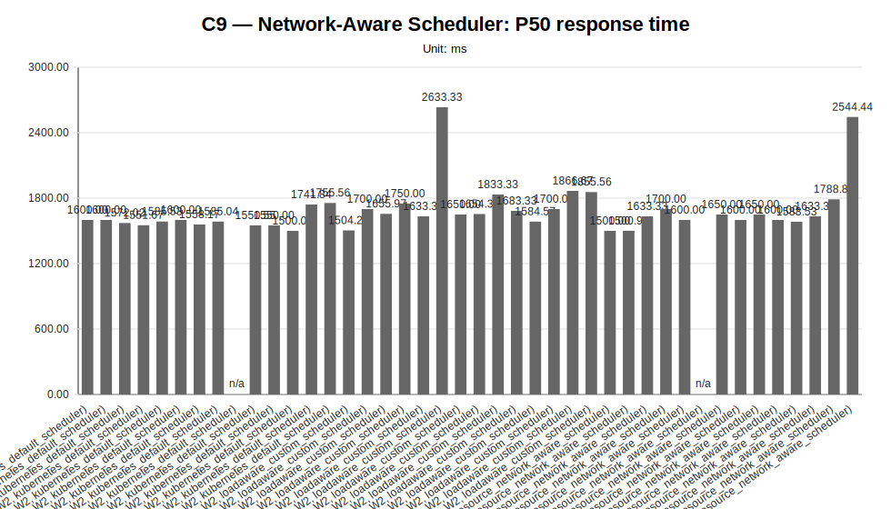
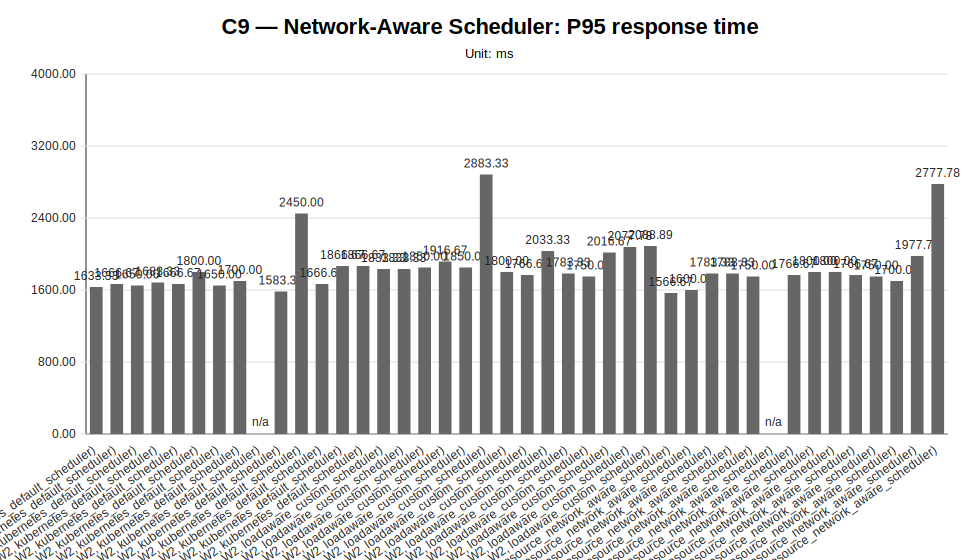
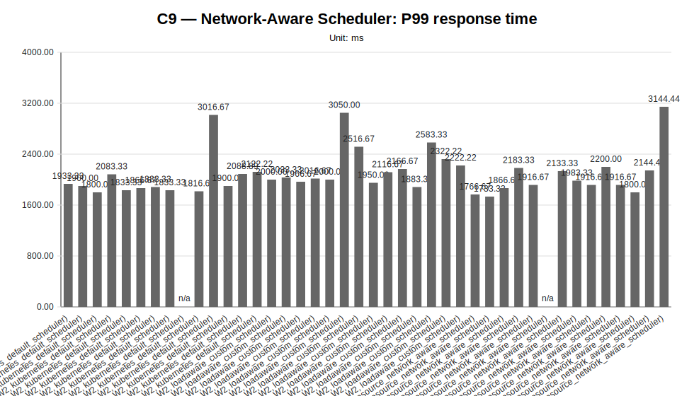
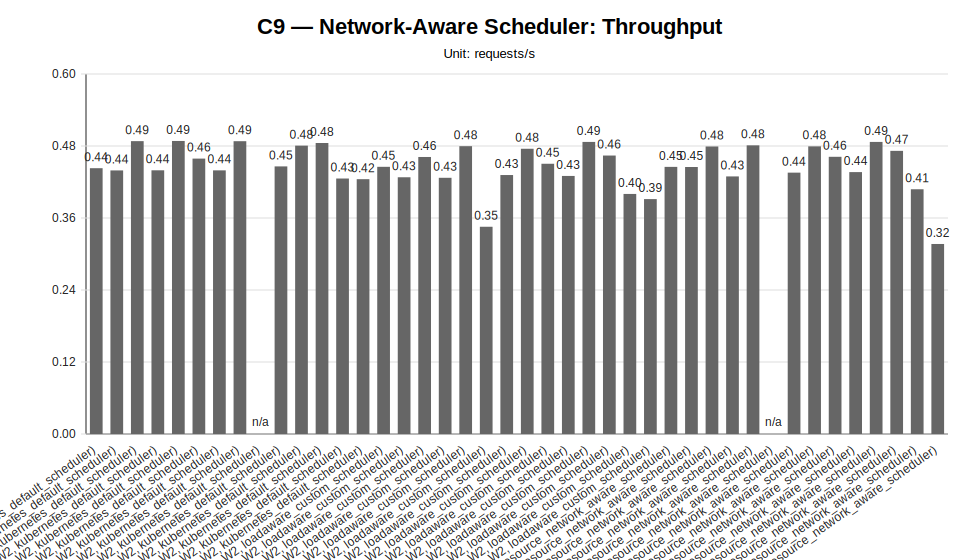
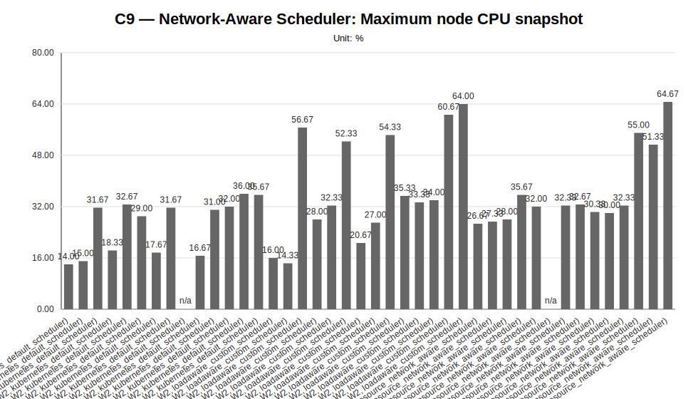
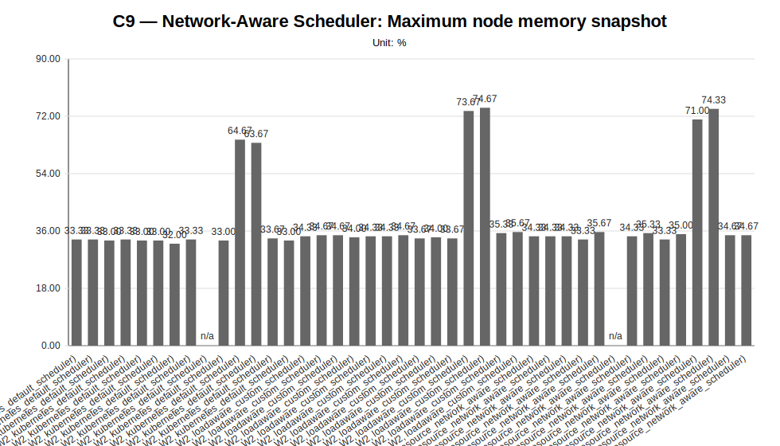
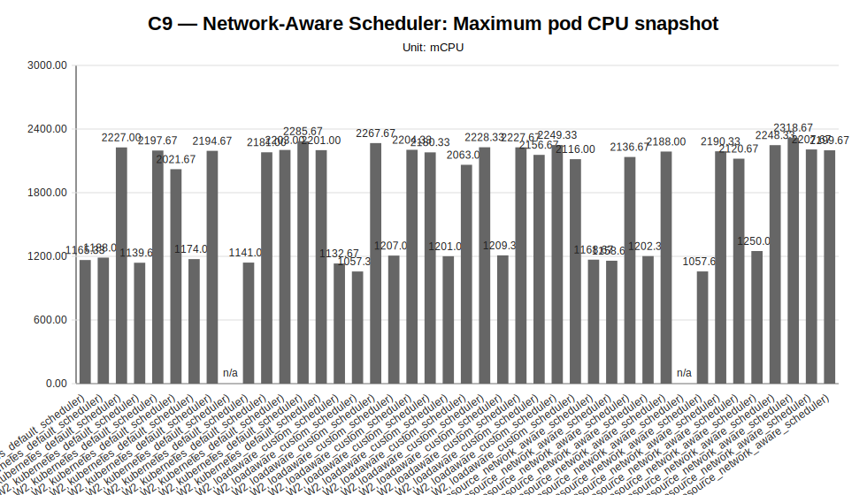
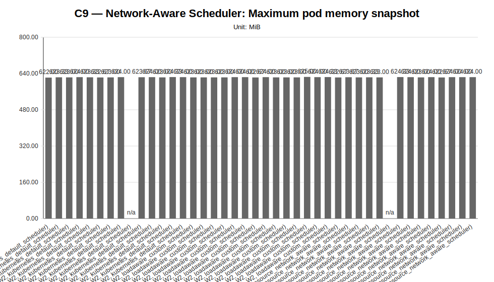

# C9 — Network-Aware Scheduler Sweep Report

**Cycle ID:** `C9`
**Sweep:** `network-aware-scheduler`
**Reporting Profile:** `RP_C9_NETWORK_AWARE_SCHEDULER`
**Reporting ID:** `REP_C9_20260709T201227Z`
**Generated at UTC:** `2026-07-09T20:12:27Z`

[Back to cycle report](../../index.html)

## Scope

This sweep-specific report isolates **Network-Aware Scheduler** so that the varied dimension, fixed dimensions, measured values, unsupported evidence and diagnosis-based reading can be inspected without navigating the full consolidated report.

## Network-Aware Scheduler

**Execution status:** `partially_measured`

**Execution note:** At least one configured scenario has measured benchmark samples, while other scenarios are missing or unsupported.

**Varied dimension:** scheduler mode, latency profile, tenant count, traffic profile and model mix

**Fixed dimensions:** application=LocalAI worker-mode, worker-node-count=4, worker-count-per-tenant=W2, traffic-access=Istio gateway routed, monitoring=enabled, mon-agent=enabled, Mentat=enabled, hard-placement-controls=disabled, cluster-lens=placement evidence captured.

**Reference scenario within the sweep:** `NA_DEFAULT_2T_4N_L0_UNIFORM_M1M1_W2`

| Scenario count | Measured | Unsupported | Missing |
|---|---|---|---|
| 42 | 40 | 2 | 0 |

### Controlled scenario parameters

This table is derived from resolved scenario metadata. A parameter is marked as controlled only when it has the same effective value across all scenarios in the sweep.

| Parameter | Resolved value | Interpretation |
|---|---|---|
| Model | varies across scenarios (2 values) | varied or scenario-specific |
| Worker count | 2 | controlled |
| Placement | runtime_scheduler_decision | controlled |
| Workload | varies across scenarios (3 values) | varied or scenario-specific |
| Topology | varies across scenarios (12 values) | varied or scenario-specific |
| Server manifest | varies across scenarios (12 values) | varied or scenario-specific |
| Prompt | Reply with only READY. | controlled |
| Temperature | 0.1 | controlled |
| Request timeout (s) | 120 | controlled |

### Scenario parameter matrix

| Scenario | Status | Varied value (scheduler mode, latency profile, tenant count, traffic profile and model mix) | Model | Worker count | Placement | Workload | Timeout (s) |
|---|---|---|---|---|---|---|---|
| `NA_DEFAULT_1T_4N_L0_UNIFORM_M1_W2` | measured | NA_DEFAULT_1T_4N_L0_UNIFORM_M1_W2 | llama-3.2-1b-instruct:q4_k_m | 2 | runtime_scheduler_decision | users=2, spawnRate=1.0, runTime=2m | 120 |
| `NA_DEFAULT_1T_4N_L2_UNIFORM_M1_W2` | measured | NA_DEFAULT_1T_4N_L2_UNIFORM_M1_W2 | llama-3.2-1b-instruct:q4_k_m | 2 | runtime_scheduler_decision | users=2, spawnRate=1.0, runTime=2m | 120 |
| `NA_DEFAULT_2T_4N_L0_DIFFERENTIATED_M1M1_W2` | measured | NA_DEFAULT_2T_4N_L0_DIFFERENTIATED_M1M1_W2 | llama-3.2-1b-instruct:q4_k_m | 2 | runtime_scheduler_decision | users=4, spawnRate=2.0, runTime=2m | 120 |
| `NA_DEFAULT_2T_4N_L0_UNIFORM_M1M1_W2` | measured | NA_DEFAULT_2T_4N_L0_UNIFORM_M1M1_W2 | llama-3.2-1b-instruct:q4_k_m | 2 | runtime_scheduler_decision | users=4, spawnRate=2.0, runTime=2m | 120 |
| `NA_DEFAULT_2T_4N_L1_DIFFERENTIATED_M1M1_W2` | measured | NA_DEFAULT_2T_4N_L1_DIFFERENTIATED_M1M1_W2 | llama-3.2-1b-instruct:q4_k_m | 2 | runtime_scheduler_decision | users=4, spawnRate=2.0, runTime=2m | 120 |
| `NA_DEFAULT_2T_4N_L1_DIFFERENTIATED_M1M2_W2` | measured | NA_DEFAULT_2T_4N_L1_DIFFERENTIATED_M1M2_W2 | tenant-a=llama-3.2-1b-instruct:q4_k_m; tenant-b=llama-3.2-1b-instruct:q8_0 | 2 | runtime_scheduler_decision | users=4, spawnRate=2.0, runTime=2m | 120 |
| `NA_DEFAULT_2T_4N_L1_UNIFORM_M1M1_W2` | measured | NA_DEFAULT_2T_4N_L1_UNIFORM_M1M1_W2 | llama-3.2-1b-instruct:q4_k_m | 2 | runtime_scheduler_decision | users=4, spawnRate=2.0, runTime=2m | 120 |
| `NA_DEFAULT_2T_4N_L2_DIFFERENTIATED_M1M1_W2` | measured | NA_DEFAULT_2T_4N_L2_DIFFERENTIATED_M1M1_W2 | llama-3.2-1b-instruct:q4_k_m | 2 | runtime_scheduler_decision | users=4, spawnRate=2.0, runTime=2m | 120 |
| `NA_DEFAULT_2T_4N_L2_DIFFERENTIATED_M1M2_W2` | unsupported_under_current_constraints | NA_DEFAULT_2T_4N_L2_DIFFERENTIATED_M1M2_W2 | tenant-a=llama-3.2-1b-instruct:q4_k_m; tenant-b=llama-3.2-1b-instruct:q8_0 | 2 | runtime_scheduler_decision | users=4, spawnRate=2.0, runTime=2m | 120 |
| `NA_DEFAULT_2T_4N_L2_UNIFORM_M1M1_W2` | measured | NA_DEFAULT_2T_4N_L2_UNIFORM_M1M1_W2 | llama-3.2-1b-instruct:q4_k_m | 2 | runtime_scheduler_decision | users=4, spawnRate=2.0, runTime=2m | 120 |
| `NA_DEFAULT_2T_4N_L3_DIFFERENTIATED_M1M1_W2` | measured | NA_DEFAULT_2T_4N_L3_DIFFERENTIATED_M1M1_W2 | llama-3.2-1b-instruct:q4_k_m | 2 | runtime_scheduler_decision | users=4, spawnRate=2.0, runTime=2m | 120 |
| `NA_DEFAULT_2T_4N_L3_DIFFERENTIATED_M1M2_W2` | measured | NA_DEFAULT_2T_4N_L3_DIFFERENTIATED_M1M2_W2 | tenant-a=llama-3.2-1b-instruct:q4_k_m; tenant-b=llama-3.2-1b-instruct:q8_0 | 2 | runtime_scheduler_decision | users=4, spawnRate=2.0, runTime=2m | 120 |
| `NA_DEFAULT_3T_4N_L1_DIFFERENTIATED_M1M1M1_W2` | measured | NA_DEFAULT_3T_4N_L1_DIFFERENTIATED_M1M1M1_W2 | llama-3.2-1b-instruct:q4_k_m | 2 | runtime_scheduler_decision | users=6, spawnRate=3.0, runTime=2m | 120 |
| `NA_DEFAULT_3T_4N_L2_DIFFERENTIATED_M1M1M1_W2` | measured | NA_DEFAULT_3T_4N_L2_DIFFERENTIATED_M1M1M1_W2 | llama-3.2-1b-instruct:q4_k_m | 2 | runtime_scheduler_decision | users=6, spawnRate=3.0, runTime=2m | 120 |
| `NA_LOADAWARE_1T_4N_L0_UNIFORM_M1_W2` | measured | NA_LOADAWARE_1T_4N_L0_UNIFORM_M1_W2 | llama-3.2-1b-instruct:q4_k_m | 2 | runtime_scheduler_decision | users=2, spawnRate=1.0, runTime=2m | 120 |
| `NA_LOADAWARE_1T_4N_L2_UNIFORM_M1_W2` | measured | NA_LOADAWARE_1T_4N_L2_UNIFORM_M1_W2 | llama-3.2-1b-instruct:q4_k_m | 2 | runtime_scheduler_decision | users=2, spawnRate=1.0, runTime=2m | 120 |
| `NA_LOADAWARE_2T_4N_L0_DIFFERENTIATED_M1M1_W2` | measured | NA_LOADAWARE_2T_4N_L0_DIFFERENTIATED_M1M1_W2 | llama-3.2-1b-instruct:q4_k_m | 2 | runtime_scheduler_decision | users=4, spawnRate=2.0, runTime=2m | 120 |
| `NA_LOADAWARE_2T_4N_L0_UNIFORM_M1M1_W2` | measured | NA_LOADAWARE_2T_4N_L0_UNIFORM_M1M1_W2 | llama-3.2-1b-instruct:q4_k_m | 2 | runtime_scheduler_decision | users=4, spawnRate=2.0, runTime=2m | 120 |
| `NA_LOADAWARE_2T_4N_L1_DIFFERENTIATED_M1M1_W2` | measured | NA_LOADAWARE_2T_4N_L1_DIFFERENTIATED_M1M1_W2 | llama-3.2-1b-instruct:q4_k_m | 2 | runtime_scheduler_decision | users=4, spawnRate=2.0, runTime=2m | 120 |
| `NA_LOADAWARE_2T_4N_L1_DIFFERENTIATED_M1M2_W2` | measured | NA_LOADAWARE_2T_4N_L1_DIFFERENTIATED_M1M2_W2 | tenant-a=llama-3.2-1b-instruct:q4_k_m; tenant-b=llama-3.2-1b-instruct:q8_0 | 2 | runtime_scheduler_decision | users=4, spawnRate=2.0, runTime=2m | 120 |
| `NA_LOADAWARE_2T_4N_L1_UNIFORM_M1M1_W2` | measured | NA_LOADAWARE_2T_4N_L1_UNIFORM_M1M1_W2 | llama-3.2-1b-instruct:q4_k_m | 2 | runtime_scheduler_decision | users=4, spawnRate=2.0, runTime=2m | 120 |
| `NA_LOADAWARE_2T_4N_L2_DIFFERENTIATED_M1M1_W2` | measured | NA_LOADAWARE_2T_4N_L2_DIFFERENTIATED_M1M1_W2 | llama-3.2-1b-instruct:q4_k_m | 2 | runtime_scheduler_decision | users=4, spawnRate=2.0, runTime=2m | 120 |
| `NA_LOADAWARE_2T_4N_L2_DIFFERENTIATED_M1M2_W2` | measured | NA_LOADAWARE_2T_4N_L2_DIFFERENTIATED_M1M2_W2 | tenant-a=llama-3.2-1b-instruct:q4_k_m; tenant-b=llama-3.2-1b-instruct:q8_0 | 2 | runtime_scheduler_decision | users=4, spawnRate=2.0, runTime=2m | 120 |
| `NA_LOADAWARE_2T_4N_L2_UNIFORM_M1M1_W2` | measured | NA_LOADAWARE_2T_4N_L2_UNIFORM_M1M1_W2 | llama-3.2-1b-instruct:q4_k_m | 2 | runtime_scheduler_decision | users=4, spawnRate=2.0, runTime=2m | 120 |
| `NA_LOADAWARE_2T_4N_L3_DIFFERENTIATED_M1M1_W2` | measured | NA_LOADAWARE_2T_4N_L3_DIFFERENTIATED_M1M1_W2 | llama-3.2-1b-instruct:q4_k_m | 2 | runtime_scheduler_decision | users=4, spawnRate=2.0, runTime=2m | 120 |
| `NA_LOADAWARE_2T_4N_L3_DIFFERENTIATED_M1M2_W2` | measured | NA_LOADAWARE_2T_4N_L3_DIFFERENTIATED_M1M2_W2 | tenant-a=llama-3.2-1b-instruct:q4_k_m; tenant-b=llama-3.2-1b-instruct:q8_0 | 2 | runtime_scheduler_decision | users=4, spawnRate=2.0, runTime=2m | 120 |
| `NA_LOADAWARE_3T_4N_L1_DIFFERENTIATED_M1M1M1_W2` | measured | NA_LOADAWARE_3T_4N_L1_DIFFERENTIATED_M1M1M1_W2 | llama-3.2-1b-instruct:q4_k_m | 2 | runtime_scheduler_decision | users=6, spawnRate=3.0, runTime=2m | 120 |
| `NA_LOADAWARE_3T_4N_L2_DIFFERENTIATED_M1M1M1_W2` | measured | NA_LOADAWARE_3T_4N_L2_DIFFERENTIATED_M1M1M1_W2 | llama-3.2-1b-instruct:q4_k_m | 2 | runtime_scheduler_decision | users=6, spawnRate=3.0, runTime=2m | 120 |
| `NA_NETAWARE_1T_4N_L0_UNIFORM_M1_W2` | measured | NA_NETAWARE_1T_4N_L0_UNIFORM_M1_W2 | llama-3.2-1b-instruct:q4_k_m | 2 | runtime_scheduler_decision | users=2, spawnRate=1.0, runTime=2m | 120 |
| `NA_NETAWARE_1T_4N_L2_UNIFORM_M1_W2` | measured | NA_NETAWARE_1T_4N_L2_UNIFORM_M1_W2 | llama-3.2-1b-instruct:q4_k_m | 2 | runtime_scheduler_decision | users=2, spawnRate=1.0, runTime=2m | 120 |
| `NA_NETAWARE_2T_4N_L0_DIFFERENTIATED_M1M1_W2` | measured | NA_NETAWARE_2T_4N_L0_DIFFERENTIATED_M1M1_W2 | llama-3.2-1b-instruct:q4_k_m | 2 | runtime_scheduler_decision | users=4, spawnRate=2.0, runTime=2m | 120 |
| `NA_NETAWARE_2T_4N_L0_UNIFORM_M1M1_W2` | measured | NA_NETAWARE_2T_4N_L0_UNIFORM_M1M1_W2 | llama-3.2-1b-instruct:q4_k_m | 2 | runtime_scheduler_decision | users=4, spawnRate=2.0, runTime=2m | 120 |
| `NA_NETAWARE_2T_4N_L1_DIFFERENTIATED_M1M1_W2` | measured | NA_NETAWARE_2T_4N_L1_DIFFERENTIATED_M1M1_W2 | llama-3.2-1b-instruct:q4_k_m | 2 | runtime_scheduler_decision | users=4, spawnRate=2.0, runTime=2m | 120 |
| `NA_NETAWARE_2T_4N_L1_DIFFERENTIATED_M1M2_W2` | unsupported_under_current_constraints | NA_NETAWARE_2T_4N_L1_DIFFERENTIATED_M1M2_W2 | tenant-a=llama-3.2-1b-instruct:q4_k_m; tenant-b=llama-3.2-1b-instruct:q8_0 | 2 | runtime_scheduler_decision | users=4, spawnRate=2.0, runTime=2m | 120 |
| `NA_NETAWARE_2T_4N_L1_UNIFORM_M1M1_W2` | measured | NA_NETAWARE_2T_4N_L1_UNIFORM_M1M1_W2 | llama-3.2-1b-instruct:q4_k_m | 2 | runtime_scheduler_decision | users=4, spawnRate=2.0, runTime=2m | 120 |
| `NA_NETAWARE_2T_4N_L2_DIFFERENTIATED_M1M1_W2` | measured | NA_NETAWARE_2T_4N_L2_DIFFERENTIATED_M1M1_W2 | llama-3.2-1b-instruct:q4_k_m | 2 | runtime_scheduler_decision | users=4, spawnRate=2.0, runTime=2m | 120 |
| `NA_NETAWARE_2T_4N_L2_DIFFERENTIATED_M1M2_W2` | measured | NA_NETAWARE_2T_4N_L2_DIFFERENTIATED_M1M2_W2 | tenant-a=llama-3.2-1b-instruct:q4_k_m; tenant-b=llama-3.2-1b-instruct:q8_0 | 2 | runtime_scheduler_decision | users=4, spawnRate=2.0, runTime=2m | 120 |
| `NA_NETAWARE_2T_4N_L2_UNIFORM_M1M1_W2` | measured | NA_NETAWARE_2T_4N_L2_UNIFORM_M1M1_W2 | llama-3.2-1b-instruct:q4_k_m | 2 | runtime_scheduler_decision | users=4, spawnRate=2.0, runTime=2m | 120 |
| `NA_NETAWARE_2T_4N_L3_DIFFERENTIATED_M1M1_W2` | measured | NA_NETAWARE_2T_4N_L3_DIFFERENTIATED_M1M1_W2 | llama-3.2-1b-instruct:q4_k_m | 2 | runtime_scheduler_decision | users=4, spawnRate=2.0, runTime=2m | 120 |
| `NA_NETAWARE_2T_4N_L3_DIFFERENTIATED_M1M2_W2` | measured | NA_NETAWARE_2T_4N_L3_DIFFERENTIATED_M1M2_W2 | tenant-a=llama-3.2-1b-instruct:q4_k_m; tenant-b=llama-3.2-1b-instruct:q8_0 | 2 | runtime_scheduler_decision | users=4, spawnRate=2.0, runTime=2m | 120 |
| `NA_NETAWARE_3T_4N_L1_DIFFERENTIATED_M1M1M1_W2` | measured | NA_NETAWARE_3T_4N_L1_DIFFERENTIATED_M1M1M1_W2 | llama-3.2-1b-instruct:q4_k_m | 2 | runtime_scheduler_decision | users=6, spawnRate=3.0, runTime=2m | 120 |
| `NA_NETAWARE_3T_4N_L2_DIFFERENTIATED_M1M1M1_W2` | measured | NA_NETAWARE_3T_4N_L2_DIFFERENTIATED_M1M1M1_W2 | llama-3.2-1b-instruct:q4_k_m | 2 | runtime_scheduler_decision | users=6, spawnRate=3.0, runTime=2m | 120 |

### Measurement summary

This compact table reports the core indicators used to read the sweep at a glance. Detailed percentiles, deltas and resource snapshots are reported in the following extended table.

| Scenario | Description | Status | Sample count | Mean response time (ms) | P95 response time (ms) | Throughput (requests/s) | Unsupported evidence |
|---|---|---|---|---|---|---|---|
| `NA_DEFAULT_1T_4N_L0_UNIFORM_M1_W2` | NA_DEFAULT_1T_4N_L0_UNIFORM_M1_W2 (1T_4N_L0_UNIFORM_M1_W2, kubernetes_default_scheduler) | measured | 3 | 1576.35 | 1633.33 | 0.4430 |  |
| `NA_DEFAULT_1T_4N_L2_UNIFORM_M1_W2` | NA_DEFAULT_1T_4N_L2_UNIFORM_M1_W2 (1T_4N_L2_UNIFORM_M1_W2, kubernetes_default_scheduler) | measured | 3 | 1612.57 | 1666.67 | 0.4393 |  |
| `NA_DEFAULT_2T_4N_L0_DIFFERENTIATED_M1M1_W2` | NA_DEFAULT_2T_4N_L0_DIFFERENTIATED_M1M1_W2 (2T_4N_L0_DIFFERENTIATED_M1M1_W2, kubernetes_default_scheduler) | measured | 6 | 1560.96 | 1650.00 | 0.4881 |  |
| `NA_DEFAULT_2T_4N_L0_UNIFORM_M1M1_W2` | NA_DEFAULT_2T_4N_L0_UNIFORM_M1M1_W2 (2T_4N_L0_UNIFORM_M1M1_W2, kubernetes_default_scheduler) | measured | 6 | 1594.85 | 1683.33 | 0.4395 |  |
| `NA_DEFAULT_2T_4N_L1_DIFFERENTIATED_M1M1_W2` | NA_DEFAULT_2T_4N_L1_DIFFERENTIATED_M1M1_W2 (2T_4N_L1_DIFFERENTIATED_M1M1_W2, kubernetes_default_scheduler) | measured | 6 | 1578.58 | 1666.67 | 0.4884 |  |
| `NA_DEFAULT_2T_4N_L1_DIFFERENTIATED_M1M2_W2` | NA_DEFAULT_2T_4N_L1_DIFFERENTIATED_M1M2_W2 (2T_4N_L1_DIFFERENTIATED_M1M2_W2, kubernetes_default_scheduler) | measured | 6 | 1639.31 | 1800.00 | 0.4590 |  |
| `NA_DEFAULT_2T_4N_L1_UNIFORM_M1M1_W2` | NA_DEFAULT_2T_4N_L1_UNIFORM_M1M1_W2 (2T_4N_L1_UNIFORM_M1M1_W2, kubernetes_default_scheduler) | measured | 6 | 1597.35 | 1650.00 | 0.4394 |  |
| `NA_DEFAULT_2T_4N_L2_DIFFERENTIATED_M1M1_W2` | NA_DEFAULT_2T_4N_L2_DIFFERENTIATED_M1M1_W2 (2T_4N_L2_DIFFERENTIATED_M1M1_W2, kubernetes_default_scheduler) | measured | 6 | 1582.89 | 1700.00 | 0.4880 |  |
| `NA_DEFAULT_2T_4N_L2_DIFFERENTIATED_M1M2_W2` | NA_DEFAULT_2T_4N_L2_DIFFERENTIATED_M1M2_W2 (2T_4N_L2_DIFFERENTIATED_M1M2_W2, kubernetes_default_scheduler) | unsupported_under_current_constraints | 0 | n/a | n/a | n/a | application_not_ready, localai_deployment, pending_pod, smoke_validation_failure |
| `NA_DEFAULT_2T_4N_L2_UNIFORM_M1M1_W2` | NA_DEFAULT_2T_4N_L2_UNIFORM_M1M1_W2 (2T_4N_L2_UNIFORM_M1M1_W2, kubernetes_default_scheduler) | measured | 6 | 1546.91 | 1583.33 | 0.4460 |  |
| `NA_DEFAULT_2T_4N_L3_DIFFERENTIATED_M1M1_W2` | NA_DEFAULT_2T_4N_L3_DIFFERENTIATED_M1M1_W2 (2T_4N_L3_DIFFERENTIATED_M1M1_W2, kubernetes_default_scheduler) | measured | 6 | 1624.96 | 2450.00 | 0.4806 |  |
| `NA_DEFAULT_2T_4N_L3_DIFFERENTIATED_M1M2_W2` | NA_DEFAULT_2T_4N_L3_DIFFERENTIATED_M1M2_W2 (2T_4N_L3_DIFFERENTIATED_M1M2_W2, kubernetes_default_scheduler) | measured | 6 | 1517.01 | 1666.67 | 0.4850 |  |
| `NA_DEFAULT_3T_4N_L1_DIFFERENTIATED_M1M1M1_W2` | NA_DEFAULT_3T_4N_L1_DIFFERENTIATED_M1M1M1_W2 (3T_4N_L1_DIFFERENTIATED_M1M1M1_W2, kubernetes_default_scheduler) | measured | 9 | 1752.69 | 1866.67 | 0.4258 |  |
| `NA_DEFAULT_3T_4N_L2_DIFFERENTIATED_M1M1M1_W2` | NA_DEFAULT_3T_4N_L2_DIFFERENTIATED_M1M1M1_W2 (3T_4N_L2_DIFFERENTIATED_M1M1M1_W2, kubernetes_default_scheduler) | measured | 9 | 1763.28 | 1866.67 | 0.4247 |  |
| `NA_LOADAWARE_1T_4N_L0_UNIFORM_M1_W2` | NA_LOADAWARE_1T_4N_L0_UNIFORM_M1_W2 (1T_4N_L0_UNIFORM_M1_W2, loadaware_custom_scheduler) | measured | 3 | 1556.68 | 1833.33 | 0.4453 |  |
| `NA_LOADAWARE_1T_4N_L2_UNIFORM_M1_W2` | NA_LOADAWARE_1T_4N_L2_UNIFORM_M1_W2 (1T_4N_L2_UNIFORM_M1_W2, loadaware_custom_scheduler) | measured | 3 | 1725.44 | 1833.33 | 0.4279 |  |
| `NA_LOADAWARE_2T_4N_L0_DIFFERENTIATED_M1M1_W2` | NA_LOADAWARE_2T_4N_L0_DIFFERENTIATED_M1M1_W2 (2T_4N_L0_DIFFERENTIATED_M1M1_W2, loadaware_custom_scheduler) | measured | 6 | 1675.18 | 1850.00 | 0.4617 |  |
| `NA_LOADAWARE_2T_4N_L0_UNIFORM_M1M1_W2` | NA_LOADAWARE_2T_4N_L0_UNIFORM_M1M1_W2 (2T_4N_L0_UNIFORM_M1M1_W2, loadaware_custom_scheduler) | measured | 6 | 1740.15 | 1916.67 | 0.4270 |  |
| `NA_LOADAWARE_2T_4N_L1_DIFFERENTIATED_M1M1_W2` | NA_LOADAWARE_2T_4N_L1_DIFFERENTIATED_M1M1_W2 (2T_4N_L1_DIFFERENTIATED_M1M1_W2, loadaware_custom_scheduler) | measured | 6 | 1662.22 | 1850.00 | 0.4797 |  |
| `NA_LOADAWARE_2T_4N_L1_DIFFERENTIATED_M1M2_W2` | NA_LOADAWARE_2T_4N_L1_DIFFERENTIATED_M1M2_W2 (2T_4N_L1_DIFFERENTIATED_M1M2_W2, loadaware_custom_scheduler) | measured | 6 | 2626.94 | 2883.33 | 0.3454 |  |
| `NA_LOADAWARE_2T_4N_L1_UNIFORM_M1M1_W2` | NA_LOADAWARE_2T_4N_L1_UNIFORM_M1M1_W2 (2T_4N_L1_UNIFORM_M1M1_W2, loadaware_custom_scheduler) | measured | 6 | 1674.82 | 1800.00 | 0.4316 |  |
| `NA_LOADAWARE_2T_4N_L2_DIFFERENTIATED_M1M1_W2` | NA_LOADAWARE_2T_4N_L2_DIFFERENTIATED_M1M1_W2 (2T_4N_L2_DIFFERENTIATED_M1M1_W2, loadaware_custom_scheduler) | measured | 6 | 1659.21 | 1766.67 | 0.4754 |  |
| `NA_LOADAWARE_2T_4N_L2_DIFFERENTIATED_M1M2_W2` | NA_LOADAWARE_2T_4N_L2_DIFFERENTIATED_M1M2_W2 (2T_4N_L2_DIFFERENTIATED_M1M2_W2, loadaware_custom_scheduler) | measured | 6 | 1852.90 | 2033.33 | 0.4504 |  |
| `NA_LOADAWARE_2T_4N_L2_UNIFORM_M1M1_W2` | NA_LOADAWARE_2T_4N_L2_UNIFORM_M1M1_W2 (2T_4N_L2_UNIFORM_M1M1_W2, loadaware_custom_scheduler) | measured | 6 | 1698.67 | 1783.33 | 0.4301 |  |
| `NA_LOADAWARE_2T_4N_L3_DIFFERENTIATED_M1M1_W2` | NA_LOADAWARE_2T_4N_L3_DIFFERENTIATED_M1M1_W2 (2T_4N_L3_DIFFERENTIATED_M1M1_W2, loadaware_custom_scheduler) | measured | 6 | 1618.20 | 1750.00 | 0.4868 |  |
| `NA_LOADAWARE_2T_4N_L3_DIFFERENTIATED_M1M2_W2` | NA_LOADAWARE_2T_4N_L3_DIFFERENTIATED_M1M2_W2 (2T_4N_L3_DIFFERENTIATED_M1M2_W2, loadaware_custom_scheduler) | measured | 6 | 1738.43 | 2016.67 | 0.4641 |  |
| `NA_LOADAWARE_3T_4N_L1_DIFFERENTIATED_M1M1M1_W2` | NA_LOADAWARE_3T_4N_L1_DIFFERENTIATED_M1M1M1_W2 (3T_4N_L1_DIFFERENTIATED_M1M1M1_W2, loadaware_custom_scheduler) | measured | 9 | 1896.56 | 2077.78 | 0.4001 |  |
| `NA_LOADAWARE_3T_4N_L2_DIFFERENTIATED_M1M1M1_W2` | NA_LOADAWARE_3T_4N_L2_DIFFERENTIATED_M1M1M1_W2 (3T_4N_L2_DIFFERENTIATED_M1M1M1_W2, loadaware_custom_scheduler) | measured | 9 | 1881.03 | 2088.89 | 0.3915 |  |
| `NA_NETAWARE_1T_4N_L0_UNIFORM_M1_W2` | NA_NETAWARE_1T_4N_L0_UNIFORM_M1_W2 (1T_4N_L0_UNIFORM_M1_W2, localai_resource_network_aware_scheduler) | measured | 3 | 1525.49 | 1566.67 | 0.4452 |  |
| `NA_NETAWARE_1T_4N_L2_UNIFORM_M1_W2` | NA_NETAWARE_1T_4N_L2_UNIFORM_M1_W2 (1T_4N_L2_UNIFORM_M1_W2, localai_resource_network_aware_scheduler) | measured | 3 | 1535.15 | 1600.00 | 0.4450 |  |
| `NA_NETAWARE_2T_4N_L0_DIFFERENTIATED_M1M1_W2` | NA_NETAWARE_2T_4N_L0_DIFFERENTIATED_M1M1_W2 (2T_4N_L0_DIFFERENTIATED_M1M1_W2, localai_resource_network_aware_scheduler) | measured | 6 | 1650.95 | 1783.33 | 0.4792 |  |
| `NA_NETAWARE_2T_4N_L0_UNIFORM_M1M1_W2` | NA_NETAWARE_2T_4N_L0_UNIFORM_M1M1_W2 (2T_4N_L0_UNIFORM_M1M1_W2, localai_resource_network_aware_scheduler) | measured | 6 | 1708.81 | 1783.33 | 0.4293 |  |
| `NA_NETAWARE_2T_4N_L1_DIFFERENTIATED_M1M1_W2` | NA_NETAWARE_2T_4N_L1_DIFFERENTIATED_M1M1_W2 (2T_4N_L1_DIFFERENTIATED_M1M1_W2, localai_resource_network_aware_scheduler) | measured | 6 | 1615.14 | 1750.00 | 0.4811 |  |
| `NA_NETAWARE_2T_4N_L1_DIFFERENTIATED_M1M2_W2` | NA_NETAWARE_2T_4N_L1_DIFFERENTIATED_M1M2_W2 (2T_4N_L1_DIFFERENTIATED_M1M2_W2, localai_resource_network_aware_scheduler) | unsupported_under_current_constraints | 0 | n/a | n/a | n/a | application_not_ready, localai_deployment, pending_pod, smoke_validation_failure |
| `NA_NETAWARE_2T_4N_L1_UNIFORM_M1M1_W2` | NA_NETAWARE_2T_4N_L1_UNIFORM_M1M1_W2 (2T_4N_L1_UNIFORM_M1M1_W2, localai_resource_network_aware_scheduler) | measured | 6 | 1651.31 | 1766.67 | 0.4356 |  |
| `NA_NETAWARE_2T_4N_L2_DIFFERENTIATED_M1M1_W2` | NA_NETAWARE_2T_4N_L2_DIFFERENTIATED_M1M1_W2 (2T_4N_L2_DIFFERENTIATED_M1M1_W2, localai_resource_network_aware_scheduler) | measured | 6 | 1648.73 | 1800.00 | 0.4794 |  |
| `NA_NETAWARE_2T_4N_L2_DIFFERENTIATED_M1M2_W2` | NA_NETAWARE_2T_4N_L2_DIFFERENTIATED_M1M2_W2 (2T_4N_L2_DIFFERENTIATED_M1M2_W2, localai_resource_network_aware_scheduler) | measured | 6 | 1663.45 | 1800.00 | 0.4620 |  |
| `NA_NETAWARE_2T_4N_L2_UNIFORM_M1M1_W2` | NA_NETAWARE_2T_4N_L2_UNIFORM_M1M1_W2 (2T_4N_L2_UNIFORM_M1M1_W2, localai_resource_network_aware_scheduler) | measured | 6 | 1625.74 | 1766.67 | 0.4365 |  |
| `NA_NETAWARE_2T_4N_L3_DIFFERENTIATED_M1M1_W2` | NA_NETAWARE_2T_4N_L3_DIFFERENTIATED_M1M1_W2 (2T_4N_L3_DIFFERENTIATED_M1M1_W2, localai_resource_network_aware_scheduler) | measured | 6 | 1607.24 | 1750.00 | 0.4868 |  |
| `NA_NETAWARE_2T_4N_L3_DIFFERENTIATED_M1M2_W2` | NA_NETAWARE_2T_4N_L3_DIFFERENTIATED_M1M2_W2 (2T_4N_L3_DIFFERENTIATED_M1M2_W2, localai_resource_network_aware_scheduler) | measured | 6 | 1592.43 | 1700.00 | 0.4719 |  |
| `NA_NETAWARE_3T_4N_L1_DIFFERENTIATED_M1M1M1_W2` | NA_NETAWARE_3T_4N_L1_DIFFERENTIATED_M1M1M1_W2 (3T_4N_L1_DIFFERENTIATED_M1M1M1_W2, localai_resource_network_aware_scheduler) | measured | 9 | 1814.36 | 1977.78 | 0.4079 |  |
| `NA_NETAWARE_3T_4N_L2_DIFFERENTIATED_M1M1M1_W2` | NA_NETAWARE_3T_4N_L2_DIFFERENTIATED_M1M1M1_W2 (3T_4N_L2_DIFFERENTIATED_M1M1M1_W2, localai_resource_network_aware_scheduler) | measured | 9 | 2560.57 | 2777.78 | 0.3167 |  |

### Extended measurement metrics

This secondary table keeps the additional metrics aligned with the technical diagnosis while avoiding an excessively wide primary summary table.

| Scenario | P50 response time (ms) | P99 response time (ms) | Mean response time delta (%) | P95 response time delta (%) | Throughput delta (%) | Max node CPU snapshot (%) | Max node memory snapshot (%) | Max pod CPU snapshot (mCPU) | Max pod memory snapshot (MiB) |
|---|---|---|---|---|---|---|---|---|---|
| `NA_DEFAULT_1T_4N_L0_UNIFORM_M1_W2` | 1600.00 | 1933.33 | -1.16 | -2.97 | 0.80 | 14.00 | 33.33 | 1165.33 | 622.00 |
| `NA_DEFAULT_1T_4N_L2_UNIFORM_M1_W2` | 1600.00 | 1900.00 | 1.11 | -0.99 | -0.05 | 15.00 | 33.33 | 1188.00 | 623.33 |
| `NA_DEFAULT_2T_4N_L0_DIFFERENTIATED_M1M1_W2` | 1572.02 | 1800.00 | -2.13 | -1.98 | 11.06 | 31.67 | 33.00 | 2227.00 | 623.00 |
| `NA_DEFAULT_2T_4N_L0_UNIFORM_M1M1_W2` | 1551.67 | 2083.33 | 0.00 | 0.00 | 0.00 | 18.33 | 33.33 | 1139.67 | 624.00 |
| `NA_DEFAULT_2T_4N_L1_DIFFERENTIATED_M1M1_W2` | 1585.53 | 1833.33 | -1.02 | -0.99 | 11.13 | 32.67 | 33.00 | 2197.67 | 623.33 |
| `NA_DEFAULT_2T_4N_L1_DIFFERENTIATED_M1M2_W2` | 1600.00 | 1866.67 | 2.79 | 6.93 | 4.44 | 29.00 | 33.00 | 2021.67 | 622.67 |
| `NA_DEFAULT_2T_4N_L1_UNIFORM_M1M1_W2` | 1558.17 | 1883.33 | 0.16 | -1.98 | -0.02 | 17.67 | 32.00 | 1174.00 | 623.00 |
| `NA_DEFAULT_2T_4N_L2_DIFFERENTIATED_M1M1_W2` | 1585.04 | 1833.33 | -0.75 | 0.99 | 11.04 | 31.67 | 33.33 | 2194.67 | 624.00 |
| `NA_DEFAULT_2T_4N_L2_DIFFERENTIATED_M1M2_W2` | n/a | n/a | n/a | n/a | n/a | n/a | n/a | n/a | n/a |
| `NA_DEFAULT_2T_4N_L2_UNIFORM_M1M1_W2` | 1550.55 | 1816.67 | -3.01 | -5.94 | 1.48 | 16.67 | 33.00 | 1141.00 | 623.67 |
| `NA_DEFAULT_2T_4N_L3_DIFFERENTIATED_M1M1_W2` | 1550.00 | 3016.67 | 1.89 | 45.54 | 9.35 | 31.00 | 64.67 | 2181.00 | 624.00 |
| `NA_DEFAULT_2T_4N_L3_DIFFERENTIATED_M1M2_W2` | 1500.00 | 1900.00 | -4.88 | -0.99 | 10.35 | 32.00 | 63.67 | 2203.00 | 623.00 |
| `NA_DEFAULT_3T_4N_L1_DIFFERENTIATED_M1M1M1_W2` | 1741.84 | 2088.89 | 9.90 | 10.89 | -3.12 | 36.00 | 33.67 | 2285.67 | 624.33 |
| `NA_DEFAULT_3T_4N_L2_DIFFERENTIATED_M1M1M1_W2` | 1755.56 | 2122.22 | 10.56 | 10.89 | -3.37 | 35.67 | 33.00 | 2201.00 | 624.00 |
| `NA_LOADAWARE_1T_4N_L0_UNIFORM_M1_W2` | 1504.27 | 2000.00 | -2.39 | 8.91 | 1.32 | 16.00 | 34.33 | 1132.67 | 623.00 |
| `NA_LOADAWARE_1T_4N_L2_UNIFORM_M1_W2` | 1700.00 | 2033.33 | 8.19 | 8.91 | -2.64 | 14.33 | 34.67 | 1057.33 | 623.00 |
| `NA_LOADAWARE_2T_4N_L0_DIFFERENTIATED_M1M1_W2` | 1655.97 | 1966.67 | 5.04 | 9.90 | 5.05 | 56.67 | 34.67 | 2267.67 | 623.00 |
| `NA_LOADAWARE_2T_4N_L0_UNIFORM_M1M1_W2` | 1750.00 | 2016.67 | 9.11 | 13.86 | -2.84 | 28.00 | 34.00 | 1207.00 | 623.00 |
| `NA_LOADAWARE_2T_4N_L1_DIFFERENTIATED_M1M1_W2` | 1633.33 | 2000.00 | 4.22 | 9.90 | 9.15 | 32.33 | 34.33 | 2204.33 | 624.00 |
| `NA_LOADAWARE_2T_4N_L1_DIFFERENTIATED_M1M2_W2` | 2633.33 | 3050.00 | 64.71 | 71.29 | -21.41 | 52.33 | 34.33 | 2180.33 | 624.00 |
| `NA_LOADAWARE_2T_4N_L1_UNIFORM_M1M1_W2` | 1650.00 | 2516.67 | 5.01 | 6.93 | -1.80 | 20.67 | 34.67 | 1201.00 | 622.67 |
| `NA_LOADAWARE_2T_4N_L2_DIFFERENTIATED_M1M1_W2` | 1654.36 | 1950.00 | 4.04 | 4.95 | 8.17 | 27.00 | 33.67 | 2063.00 | 624.00 |
| `NA_LOADAWARE_2T_4N_L2_DIFFERENTIATED_M1M2_W2` | 1833.33 | 2116.67 | 16.18 | 20.79 | 2.48 | 54.33 | 34.00 | 2228.33 | 623.00 |
| `NA_LOADAWARE_2T_4N_L2_UNIFORM_M1M1_W2` | 1683.33 | 2166.67 | 6.51 | 5.94 | -2.14 | 35.33 | 33.67 | 1209.33 | 623.00 |
| `NA_LOADAWARE_2T_4N_L3_DIFFERENTIATED_M1M1_W2` | 1584.57 | 1883.33 | 1.46 | 3.96 | 10.76 | 33.33 | 73.67 | 2227.67 | 623.00 |
| `NA_LOADAWARE_2T_4N_L3_DIFFERENTIATED_M1M2_W2` | 1700.00 | 2583.33 | 9.00 | 19.80 | 5.60 | 34.00 | 74.67 | 2156.67 | 625.00 |
| `NA_LOADAWARE_3T_4N_L1_DIFFERENTIATED_M1M1M1_W2` | 1866.67 | 2322.22 | 18.92 | 23.43 | -8.96 | 60.67 | 35.33 | 2249.33 | 624.00 |
| `NA_LOADAWARE_3T_4N_L2_DIFFERENTIATED_M1M1M1_W2` | 1855.56 | 2222.22 | 17.94 | 24.09 | -10.92 | 64.00 | 35.67 | 2116.00 | 624.33 |
| `NA_NETAWARE_1T_4N_L0_UNIFORM_M1_W2` | 1500.00 | 1766.67 | -4.35 | -6.93 | 1.30 | 26.67 | 34.33 | 1168.67 | 622.67 |
| `NA_NETAWARE_1T_4N_L2_UNIFORM_M1_W2` | 1500.90 | 1733.33 | -3.74 | -4.95 | 1.25 | 27.33 | 34.33 | 1158.67 | 623.67 |
| `NA_NETAWARE_2T_4N_L0_DIFFERENTIATED_M1M1_W2` | 1633.33 | 1866.67 | 3.52 | 5.94 | 9.03 | 28.00 | 34.33 | 2136.67 | 623.00 |
| `NA_NETAWARE_2T_4N_L0_UNIFORM_M1M1_W2` | 1700.00 | 2183.33 | 7.15 | 5.94 | -2.32 | 35.67 | 33.33 | 1202.33 | 623.33 |
| `NA_NETAWARE_2T_4N_L1_DIFFERENTIATED_M1M1_W2` | 1600.00 | 1916.67 | 1.27 | 3.96 | 9.47 | 32.00 | 35.67 | 2188.00 | 623.00 |
| `NA_NETAWARE_2T_4N_L1_DIFFERENTIATED_M1M2_W2` | n/a | n/a | n/a | n/a | n/a | n/a | n/a | n/a | n/a |
| `NA_NETAWARE_2T_4N_L1_UNIFORM_M1M1_W2` | 1650.00 | 2133.33 | 3.54 | 4.95 | -0.89 | 32.33 | 34.33 | 1057.67 | 624.33 |
| `NA_NETAWARE_2T_4N_L2_DIFFERENTIATED_M1M1_W2` | 1600.00 | 1983.33 | 3.38 | 6.93 | 9.08 | 32.67 | 35.33 | 2190.33 | 624.00 |
| `NA_NETAWARE_2T_4N_L2_DIFFERENTIATED_M1M2_W2` | 1650.00 | 1916.67 | 4.30 | 6.93 | 5.12 | 30.33 | 33.33 | 2120.67 | 623.00 |
| `NA_NETAWARE_2T_4N_L2_UNIFORM_M1M1_W2` | 1600.00 | 2200.00 | 1.94 | 4.95 | -0.68 | 30.00 | 35.00 | 1250.00 | 624.00 |
| `NA_NETAWARE_2T_4N_L3_DIFFERENTIATED_M1M1_W2` | 1583.53 | 1916.67 | 0.78 | 3.96 | 10.76 | 32.33 | 71.00 | 2248.33 | 622.67 |
| `NA_NETAWARE_2T_4N_L3_DIFFERENTIATED_M1M2_W2` | 1633.33 | 1800.00 | -0.15 | 0.99 | 7.37 | 55.00 | 74.33 | 2318.67 | 624.00 |
| `NA_NETAWARE_3T_4N_L1_DIFFERENTIATED_M1M1M1_W2` | 1788.89 | 2144.44 | 13.76 | 17.49 | -7.19 | 51.33 | 34.67 | 2207.67 | 624.00 |
| `NA_NETAWARE_3T_4N_L2_DIFFERENTIATED_M1M1M1_W2` | 2544.44 | 3144.44 | 60.55 | 65.02 | -27.94 | 64.67 | 34.67 | 2199.67 | 624.00 |

### Network-aware latency profile context

This table makes the active latency profile explicit for each logical scenario. It separates annotation-controlled inter-group latency profiles from generic network-emulation labels so that placement and response-time observations can be read against the intended network-cost model.

| Logical scenario | Alias | Latency profile | Profile role | Implementation | Intra-group delay ms | Inter-group delay ms | Jitter ms | Packet loss % | Annotation controlled | Worker groups | Scheduler modes | Variants |
|---|---|---|---|---|---|---|---|---|---|---|---|---|
| `1T_4N_L0_UNIFORM_M1_W2` | L0 | `L0_NONE` | network_latency_injection_profile | linux_tc_netem | n/a | 0 | 0 | 0.0 | not_declared | n/a | default, loadaware, netaware | 3 |
| `1T_4N_L2_UNIFORM_M1_W2` | L2 | `L2_INTER_GROUP_HIGH` | network_aware_inter_group_latency_profile | annotation_controlled_inter_group_latency_matrix | 0 | 150 | 15 | 0.0 | yes | worker-group-a: 1,2; worker-group-b: 3,4 | default, loadaware, netaware | 3 |
| `2T_4N_L0_DIFFERENTIATED_M1M1_W2` | L0 | `L0_NONE` | network_latency_injection_profile | linux_tc_netem | n/a | 0 | 0 | 0.0 | not_declared | n/a | default, loadaware, netaware | 3 |
| `2T_4N_L0_UNIFORM_M1M1_W2` | L0 | `L0_NONE` | network_latency_injection_profile | linux_tc_netem | n/a | 0 | 0 | 0.0 | not_declared | n/a | default, loadaware, netaware | 3 |
| `2T_4N_L1_DIFFERENTIATED_M1M1_W2` | L1 | `L1_INTER_GROUP_MODERATE` | network_aware_inter_group_latency_profile | annotation_controlled_inter_group_latency_matrix | 0 | 50 | 5 | 0.0 | yes | worker-group-a: 1,2; worker-group-b: 3,4 | default, loadaware, netaware | 3 |
| `2T_4N_L1_DIFFERENTIATED_M1M2_W2` | L1 | `L1_INTER_GROUP_MODERATE` | network_aware_inter_group_latency_profile | annotation_controlled_inter_group_latency_matrix | 0 | 50 | 5 | 0.0 | yes | worker-group-a: 1,2; worker-group-b: 3,4 | default, loadaware, netaware | 3 |
| `2T_4N_L1_UNIFORM_M1M1_W2` | L1 | `L1_INTER_GROUP_MODERATE` | network_aware_inter_group_latency_profile | annotation_controlled_inter_group_latency_matrix | 0 | 50 | 5 | 0.0 | yes | worker-group-a: 1,2; worker-group-b: 3,4 | default, loadaware, netaware | 3 |
| `2T_4N_L2_DIFFERENTIATED_M1M1_W2` | L2 | `L2_INTER_GROUP_HIGH` | network_aware_inter_group_latency_profile | annotation_controlled_inter_group_latency_matrix | 0 | 150 | 15 | 0.0 | yes | worker-group-a: 1,2; worker-group-b: 3,4 | default, loadaware, netaware | 3 |
| `2T_4N_L2_DIFFERENTIATED_M1M2_W2` | L2 | `L2_INTER_GROUP_HIGH` | network_aware_inter_group_latency_profile | annotation_controlled_inter_group_latency_matrix | 0 | 150 | 15 | 0.0 | yes | worker-group-a: 1,2; worker-group-b: 3,4 | default, loadaware, netaware | 3 |
| `2T_4N_L2_UNIFORM_M1M1_W2` | L2 | `L2_INTER_GROUP_HIGH` | network_aware_inter_group_latency_profile | annotation_controlled_inter_group_latency_matrix | 0 | 150 | 15 | 0.0 | yes | worker-group-a: 1,2; worker-group-b: 3,4 | default, loadaware, netaware | 3 |
| `2T_4N_L3_DIFFERENTIATED_M1M1_W2` | L3 | `L3_INTER_GROUP_EXTREME` | network_aware_inter_group_latency_profile | annotation_controlled_inter_group_latency_matrix | 0 | 300 | 30 | 0.0 | yes | worker-group-a: 1,2; worker-group-b: 3,4 | default, loadaware, netaware | 3 |
| `2T_4N_L3_DIFFERENTIATED_M1M2_W2` | L3 | `L3_INTER_GROUP_EXTREME` | network_aware_inter_group_latency_profile | annotation_controlled_inter_group_latency_matrix | 0 | 300 | 30 | 0.0 | yes | worker-group-a: 1,2; worker-group-b: 3,4 | default, loadaware, netaware | 3 |
| `3T_4N_L1_DIFFERENTIATED_M1M1M1_W2` | L1 | `L1_INTER_GROUP_MODERATE` | network_aware_inter_group_latency_profile | annotation_controlled_inter_group_latency_matrix | 0 | 50 | 5 | 0.0 | yes | worker-group-a: 1,2; worker-group-b: 3,4 | default, loadaware, netaware | 3 |
| `3T_4N_L2_DIFFERENTIATED_M1M1M1_W2` | L2 | `L2_INTER_GROUP_HIGH` | network_aware_inter_group_latency_profile | annotation_controlled_inter_group_latency_matrix | 0 | 150 | 15 | 0.0 | yes | worker-group-a: 1,2; worker-group-b: 3,4 | default, loadaware, netaware | 3 |

### Cluster-lens placement evidence summary

This table reports the primary cluster-lens and Kubernetes placement evidence selected for each variant. The primary stage is used as the stable reporting entry point, while stage-specific captures remain preserved under the variant artifact tree.

| Scenario | Logical scenario | Mode | Captured stage | Primary stage | Stage selection | Status | Validation | K8s nodes | Lens nodes | Node edges | App edges | LocalAI pods | Scheduled | Unscheduled | Observed nodes | Observed schedulers | Summary | Signature |
|---|---|---|---|---|---|---|---|---|---|---|---|---|---|---|---|---|---|---|
| `NA_DEFAULT_1T_4N_L0_UNIFORM_M1_W2` | `1T_4N_L0_UNIFORM_M1_W2` | default | missing | pre-benchmark | missing | missing | n/a | n/a | n/a | n/a | n/a | n/a | n/a | n/a | n/a | NA | `not_available` | `not_available` |
| `NA_DEFAULT_1T_4N_L2_UNIFORM_M1_W2` | `1T_4N_L2_UNIFORM_M1_W2` | default | missing | pre-benchmark | missing | missing | n/a | n/a | n/a | n/a | n/a | n/a | n/a | n/a | n/a | NA | `not_available` | `not_available` |
| `NA_DEFAULT_2T_4N_L0_DIFFERENTIATED_M1M1_W2` | `2T_4N_L0_DIFFERENTIATED_M1M1_W2` | default | missing | pre-benchmark | missing | missing | n/a | n/a | n/a | n/a | n/a | n/a | n/a | n/a | n/a | NA | `not_available` | `not_available` |
| `NA_DEFAULT_2T_4N_L0_UNIFORM_M1M1_W2` | `2T_4N_L0_UNIFORM_M1M1_W2` | default | missing | pre-benchmark | missing | missing | n/a | n/a | n/a | n/a | n/a | n/a | n/a | n/a | n/a | NA | `not_available` | `not_available` |
| `NA_DEFAULT_2T_4N_L1_DIFFERENTIATED_M1M1_W2` | `2T_4N_L1_DIFFERENTIATED_M1M1_W2` | default | missing | pre-benchmark | missing | missing | n/a | n/a | n/a | n/a | n/a | n/a | n/a | n/a | n/a | NA | `not_available` | `not_available` |
| `NA_DEFAULT_2T_4N_L1_DIFFERENTIATED_M1M2_W2` | `2T_4N_L1_DIFFERENTIATED_M1M2_W2` | default | missing | pre-benchmark | missing | missing | n/a | n/a | n/a | n/a | n/a | n/a | n/a | n/a | n/a | NA | `not_available` | `not_available` |
| `NA_DEFAULT_2T_4N_L1_UNIFORM_M1M1_W2` | `2T_4N_L1_UNIFORM_M1M1_W2` | default | missing | pre-benchmark | missing | missing | n/a | n/a | n/a | n/a | n/a | n/a | n/a | n/a | n/a | NA | `not_available` | `not_available` |
| `NA_DEFAULT_2T_4N_L2_DIFFERENTIATED_M1M1_W2` | `2T_4N_L2_DIFFERENTIATED_M1M1_W2` | default | missing | pre-benchmark | missing | missing | n/a | n/a | n/a | n/a | n/a | n/a | n/a | n/a | n/a | NA | `not_available` | `not_available` |
| `NA_DEFAULT_2T_4N_L2_DIFFERENTIATED_M1M2_W2` | `2T_4N_L2_DIFFERENTIATED_M1M2_W2` | default | missing | pre-benchmark | missing | missing | n/a | n/a | n/a | n/a | n/a | n/a | n/a | n/a | n/a | NA | `not_available` | `not_available` |
| `NA_DEFAULT_2T_4N_L2_UNIFORM_M1M1_W2` | `2T_4N_L2_UNIFORM_M1M1_W2` | default | missing | pre-benchmark | missing | missing | n/a | n/a | n/a | n/a | n/a | n/a | n/a | n/a | n/a | NA | `not_available` | `not_available` |
| `NA_DEFAULT_2T_4N_L3_DIFFERENTIATED_M1M1_W2` | `2T_4N_L3_DIFFERENTIATED_M1M1_W2` | default | post-rescheduling | pre-benchmark | fallback_stage | captured | True | 5 | 5 | 20 | 16 | 6 | 6 | 0 | 4 | default-scheduler | `results/experimental-cycles/C9/variants/NA_DEFAULT_2T_4N_L3_DIFFERENTIATED_M1M1_W2/network-aware-scheduler/cluster-lens/stages/post-rescheduling/cluster-lens-placement-summary.json` | `results/experimental-cycles/C9/variants/NA_DEFAULT_2T_4N_L3_DIFFERENTIATED_M1M1_W2/network-aware-scheduler/cluster-lens/stages/post-rescheduling/cluster-lens-placement-signature.csv` |
| `NA_DEFAULT_2T_4N_L3_DIFFERENTIATED_M1M2_W2` | `2T_4N_L3_DIFFERENTIATED_M1M2_W2` | default | post-rescheduling | pre-benchmark | fallback_stage | captured | True | 5 | 5 | 20 | 16 | 6 | 6 | 0 | 4 | default-scheduler | `results/experimental-cycles/C9/variants/NA_DEFAULT_2T_4N_L3_DIFFERENTIATED_M1M2_W2/network-aware-scheduler/cluster-lens/stages/post-rescheduling/cluster-lens-placement-summary.json` | `results/experimental-cycles/C9/variants/NA_DEFAULT_2T_4N_L3_DIFFERENTIATED_M1M2_W2/network-aware-scheduler/cluster-lens/stages/post-rescheduling/cluster-lens-placement-signature.csv` |
| `NA_DEFAULT_3T_4N_L1_DIFFERENTIATED_M1M1M1_W2` | `3T_4N_L1_DIFFERENTIATED_M1M1M1_W2` | default | missing | pre-benchmark | missing | missing | n/a | n/a | n/a | n/a | n/a | n/a | n/a | n/a | n/a | NA | `not_available` | `not_available` |
| `NA_DEFAULT_3T_4N_L2_DIFFERENTIATED_M1M1M1_W2` | `3T_4N_L2_DIFFERENTIATED_M1M1M1_W2` | default | missing | pre-benchmark | missing | missing | n/a | n/a | n/a | n/a | n/a | n/a | n/a | n/a | n/a | NA | `not_available` | `not_available` |
| `NA_LOADAWARE_1T_4N_L0_UNIFORM_M1_W2` | `1T_4N_L0_UNIFORM_M1_W2` | loadaware | missing | post-rescheduling | missing | missing | n/a | n/a | n/a | n/a | n/a | n/a | n/a | n/a | n/a | NA | `not_available` | `not_available` |
| `NA_LOADAWARE_1T_4N_L2_UNIFORM_M1_W2` | `1T_4N_L2_UNIFORM_M1_W2` | loadaware | missing | post-rescheduling | missing | missing | n/a | n/a | n/a | n/a | n/a | n/a | n/a | n/a | n/a | NA | `not_available` | `not_available` |
| `NA_LOADAWARE_2T_4N_L0_DIFFERENTIATED_M1M1_W2` | `2T_4N_L0_DIFFERENTIATED_M1M1_W2` | loadaware | missing | post-rescheduling | missing | missing | n/a | n/a | n/a | n/a | n/a | n/a | n/a | n/a | n/a | NA | `not_available` | `not_available` |
| `NA_LOADAWARE_2T_4N_L0_UNIFORM_M1M1_W2` | `2T_4N_L0_UNIFORM_M1M1_W2` | loadaware | missing | post-rescheduling | missing | missing | n/a | n/a | n/a | n/a | n/a | n/a | n/a | n/a | n/a | NA | `not_available` | `not_available` |
| `NA_LOADAWARE_2T_4N_L1_DIFFERENTIATED_M1M1_W2` | `2T_4N_L1_DIFFERENTIATED_M1M1_W2` | loadaware | missing | post-rescheduling | missing | missing | n/a | n/a | n/a | n/a | n/a | n/a | n/a | n/a | n/a | NA | `not_available` | `not_available` |
| `NA_LOADAWARE_2T_4N_L1_DIFFERENTIATED_M1M2_W2` | `2T_4N_L1_DIFFERENTIATED_M1M2_W2` | loadaware | missing | post-rescheduling | missing | missing | n/a | n/a | n/a | n/a | n/a | n/a | n/a | n/a | n/a | NA | `not_available` | `not_available` |
| `NA_LOADAWARE_2T_4N_L1_UNIFORM_M1M1_W2` | `2T_4N_L1_UNIFORM_M1M1_W2` | loadaware | missing | post-rescheduling | missing | missing | n/a | n/a | n/a | n/a | n/a | n/a | n/a | n/a | n/a | NA | `not_available` | `not_available` |
| `NA_LOADAWARE_2T_4N_L2_DIFFERENTIATED_M1M1_W2` | `2T_4N_L2_DIFFERENTIATED_M1M1_W2` | loadaware | missing | post-rescheduling | missing | missing | n/a | n/a | n/a | n/a | n/a | n/a | n/a | n/a | n/a | NA | `not_available` | `not_available` |
| `NA_LOADAWARE_2T_4N_L2_DIFFERENTIATED_M1M2_W2` | `2T_4N_L2_DIFFERENTIATED_M1M2_W2` | loadaware | missing | post-rescheduling | missing | missing | n/a | n/a | n/a | n/a | n/a | n/a | n/a | n/a | n/a | NA | `not_available` | `not_available` |
| `NA_LOADAWARE_2T_4N_L2_UNIFORM_M1M1_W2` | `2T_4N_L2_UNIFORM_M1M1_W2` | loadaware | missing | post-rescheduling | missing | missing | n/a | n/a | n/a | n/a | n/a | n/a | n/a | n/a | n/a | NA | `not_available` | `not_available` |
| `NA_LOADAWARE_2T_4N_L3_DIFFERENTIATED_M1M1_W2` | `2T_4N_L3_DIFFERENTIATED_M1M1_W2` | loadaware | post-rescheduling | post-rescheduling | configured_primary_stage | captured | True | 5 | 5 | 20 | 16 | 6 | 6 | 0 | 3 | scheduler-plugins-scheduler | `results/experimental-cycles/C9/variants/NA_LOADAWARE_2T_4N_L3_DIFFERENTIATED_M1M1_W2/network-aware-scheduler/cluster-lens/stages/post-rescheduling/cluster-lens-placement-summary.json` | `results/experimental-cycles/C9/variants/NA_LOADAWARE_2T_4N_L3_DIFFERENTIATED_M1M1_W2/network-aware-scheduler/cluster-lens/stages/post-rescheduling/cluster-lens-placement-signature.csv` |
| `NA_LOADAWARE_2T_4N_L3_DIFFERENTIATED_M1M2_W2` | `2T_4N_L3_DIFFERENTIATED_M1M2_W2` | loadaware | post-rescheduling | post-rescheduling | configured_primary_stage | captured | True | 5 | 5 | 20 | 16 | 6 | 6 | 0 | 2 | scheduler-plugins-scheduler | `results/experimental-cycles/C9/variants/NA_LOADAWARE_2T_4N_L3_DIFFERENTIATED_M1M2_W2/network-aware-scheduler/cluster-lens/stages/post-rescheduling/cluster-lens-placement-summary.json` | `results/experimental-cycles/C9/variants/NA_LOADAWARE_2T_4N_L3_DIFFERENTIATED_M1M2_W2/network-aware-scheduler/cluster-lens/stages/post-rescheduling/cluster-lens-placement-signature.csv` |
| `NA_LOADAWARE_3T_4N_L1_DIFFERENTIATED_M1M1M1_W2` | `3T_4N_L1_DIFFERENTIATED_M1M1M1_W2` | loadaware | missing | post-rescheduling | missing | missing | n/a | n/a | n/a | n/a | n/a | n/a | n/a | n/a | n/a | NA | `not_available` | `not_available` |
| `NA_LOADAWARE_3T_4N_L2_DIFFERENTIATED_M1M1M1_W2` | `3T_4N_L2_DIFFERENTIATED_M1M1M1_W2` | loadaware | missing | post-rescheduling | missing | missing | n/a | n/a | n/a | n/a | n/a | n/a | n/a | n/a | n/a | NA | `not_available` | `not_available` |
| `NA_NETAWARE_1T_4N_L0_UNIFORM_M1_W2` | `1T_4N_L0_UNIFORM_M1_W2` | netaware | missing | post-rescheduling | missing | missing | n/a | n/a | n/a | n/a | n/a | n/a | n/a | n/a | n/a | NA | `not_available` | `not_available` |
| `NA_NETAWARE_1T_4N_L2_UNIFORM_M1_W2` | `1T_4N_L2_UNIFORM_M1_W2` | netaware | missing | post-rescheduling | missing | missing | n/a | n/a | n/a | n/a | n/a | n/a | n/a | n/a | n/a | NA | `not_available` | `not_available` |
| `NA_NETAWARE_2T_4N_L0_DIFFERENTIATED_M1M1_W2` | `2T_4N_L0_DIFFERENTIATED_M1M1_W2` | netaware | missing | post-rescheduling | missing | missing | n/a | n/a | n/a | n/a | n/a | n/a | n/a | n/a | n/a | NA | `not_available` | `not_available` |
| `NA_NETAWARE_2T_4N_L0_UNIFORM_M1M1_W2` | `2T_4N_L0_UNIFORM_M1M1_W2` | netaware | missing | post-rescheduling | missing | missing | n/a | n/a | n/a | n/a | n/a | n/a | n/a | n/a | n/a | NA | `not_available` | `not_available` |
| `NA_NETAWARE_2T_4N_L1_DIFFERENTIATED_M1M1_W2` | `2T_4N_L1_DIFFERENTIATED_M1M1_W2` | netaware | missing | post-rescheduling | missing | missing | n/a | n/a | n/a | n/a | n/a | n/a | n/a | n/a | n/a | NA | `not_available` | `not_available` |
| `NA_NETAWARE_2T_4N_L1_DIFFERENTIATED_M1M2_W2` | `2T_4N_L1_DIFFERENTIATED_M1M2_W2` | netaware | missing | post-rescheduling | missing | missing | n/a | n/a | n/a | n/a | n/a | n/a | n/a | n/a | n/a | NA | `not_available` | `not_available` |
| `NA_NETAWARE_2T_4N_L1_UNIFORM_M1M1_W2` | `2T_4N_L1_UNIFORM_M1M1_W2` | netaware | missing | post-rescheduling | missing | missing | n/a | n/a | n/a | n/a | n/a | n/a | n/a | n/a | n/a | NA | `not_available` | `not_available` |
| `NA_NETAWARE_2T_4N_L2_DIFFERENTIATED_M1M1_W2` | `2T_4N_L2_DIFFERENTIATED_M1M1_W2` | netaware | missing | post-rescheduling | missing | missing | n/a | n/a | n/a | n/a | n/a | n/a | n/a | n/a | n/a | NA | `not_available` | `not_available` |
| `NA_NETAWARE_2T_4N_L2_DIFFERENTIATED_M1M2_W2` | `2T_4N_L2_DIFFERENTIATED_M1M2_W2` | netaware | missing | post-rescheduling | missing | missing | n/a | n/a | n/a | n/a | n/a | n/a | n/a | n/a | n/a | NA | `not_available` | `not_available` |
| `NA_NETAWARE_2T_4N_L2_UNIFORM_M1M1_W2` | `2T_4N_L2_UNIFORM_M1M1_W2` | netaware | missing | post-rescheduling | missing | missing | n/a | n/a | n/a | n/a | n/a | n/a | n/a | n/a | n/a | NA | `not_available` | `not_available` |
| `NA_NETAWARE_2T_4N_L3_DIFFERENTIATED_M1M1_W2` | `2T_4N_L3_DIFFERENTIATED_M1M1_W2` | netaware | post-rescheduling | post-rescheduling | configured_primary_stage | captured | True | 5 | 5 | 20 | 16 | 6 | 6 | 0 | 3 | scheduler-plugins-scheduler | `results/experimental-cycles/C9/variants/NA_NETAWARE_2T_4N_L3_DIFFERENTIATED_M1M1_W2/network-aware-scheduler/cluster-lens/stages/post-rescheduling/cluster-lens-placement-summary.json` | `results/experimental-cycles/C9/variants/NA_NETAWARE_2T_4N_L3_DIFFERENTIATED_M1M1_W2/network-aware-scheduler/cluster-lens/stages/post-rescheduling/cluster-lens-placement-signature.csv` |
| `NA_NETAWARE_2T_4N_L3_DIFFERENTIATED_M1M2_W2` | `2T_4N_L3_DIFFERENTIATED_M1M2_W2` | netaware | post-rescheduling | post-rescheduling | configured_primary_stage | captured | True | 5 | 5 | 20 | 16 | 6 | 6 | 0 | 3 | scheduler-plugins-scheduler | `results/experimental-cycles/C9/variants/NA_NETAWARE_2T_4N_L3_DIFFERENTIATED_M1M2_W2/network-aware-scheduler/cluster-lens/stages/post-rescheduling/cluster-lens-placement-summary.json` | `results/experimental-cycles/C9/variants/NA_NETAWARE_2T_4N_L3_DIFFERENTIATED_M1M2_W2/network-aware-scheduler/cluster-lens/stages/post-rescheduling/cluster-lens-placement-signature.csv` |
| `NA_NETAWARE_3T_4N_L1_DIFFERENTIATED_M1M1M1_W2` | `3T_4N_L1_DIFFERENTIATED_M1M1M1_W2` | netaware | missing | post-rescheduling | missing | missing | n/a | n/a | n/a | n/a | n/a | n/a | n/a | n/a | n/a | NA | `not_available` | `not_available` |
| `NA_NETAWARE_3T_4N_L2_DIFFERENTIATED_M1M1M1_W2` | `3T_4N_L2_DIFFERENTIATED_M1M1M1_W2` | netaware | missing | post-rescheduling | missing | missing | n/a | n/a | n/a | n/a | n/a | n/a | n/a | n/a | n/a | NA | `not_available` | `not_available` |

### Cluster-lens tenant placement

This table expands the placement summary by tenant, exposing master nodes, worker nodes, co-location and scheduler names. It is the direct evidence used to determine whether NETAWARE differs from DEFAULT and LOADAWARE under the same logical scenario.

| Scenario | Logical scenario | Mode | Tenant | Namespaces | Master nodes | Worker nodes | Distinct tenant nodes | Master-worker co-located | Unscheduled pods | Schedulers |
|---|---|---|---|---|---|---|---|---|---|---|
| `NA_DEFAULT_1T_4N_L0_UNIFORM_M1_W2` | `1T_4N_L0_UNIFORM_M1_W2` | default | not_available | n/a | n/a | n/a | n/a | n/a | n/a | n/a |
| `NA_DEFAULT_1T_4N_L2_UNIFORM_M1_W2` | `1T_4N_L2_UNIFORM_M1_W2` | default | not_available | n/a | n/a | n/a | n/a | n/a | n/a | n/a |
| `NA_DEFAULT_2T_4N_L0_DIFFERENTIATED_M1M1_W2` | `2T_4N_L0_DIFFERENTIATED_M1M1_W2` | default | not_available | n/a | n/a | n/a | n/a | n/a | n/a | n/a |
| `NA_DEFAULT_2T_4N_L0_UNIFORM_M1M1_W2` | `2T_4N_L0_UNIFORM_M1M1_W2` | default | not_available | n/a | n/a | n/a | n/a | n/a | n/a | n/a |
| `NA_DEFAULT_2T_4N_L1_DIFFERENTIATED_M1M1_W2` | `2T_4N_L1_DIFFERENTIATED_M1M1_W2` | default | not_available | n/a | n/a | n/a | n/a | n/a | n/a | n/a |
| `NA_DEFAULT_2T_4N_L1_DIFFERENTIATED_M1M2_W2` | `2T_4N_L1_DIFFERENTIATED_M1M2_W2` | default | not_available | n/a | n/a | n/a | n/a | n/a | n/a | n/a |
| `NA_DEFAULT_2T_4N_L1_UNIFORM_M1M1_W2` | `2T_4N_L1_UNIFORM_M1M1_W2` | default | not_available | n/a | n/a | n/a | n/a | n/a | n/a | n/a |
| `NA_DEFAULT_2T_4N_L2_DIFFERENTIATED_M1M1_W2` | `2T_4N_L2_DIFFERENTIATED_M1M1_W2` | default | not_available | n/a | n/a | n/a | n/a | n/a | n/a | n/a |
| `NA_DEFAULT_2T_4N_L2_DIFFERENTIATED_M1M2_W2` | `2T_4N_L2_DIFFERENTIATED_M1M2_W2` | default | not_available | n/a | n/a | n/a | n/a | n/a | n/a | n/a |
| `NA_DEFAULT_2T_4N_L2_UNIFORM_M1M1_W2` | `2T_4N_L2_UNIFORM_M1M1_W2` | default | not_available | n/a | n/a | n/a | n/a | n/a | n/a | n/a |
| `NA_DEFAULT_2T_4N_L3_DIFFERENTIATED_M1M1_W2` | `2T_4N_L3_DIFFERENTIATED_M1M1_W2` | default | `tenant-a` | genai-tenant-a | genai-pb-worker-03 | genai-pb-worker-03, genai-pb-worker-01 | 2 | True | NA | default-scheduler |
| `NA_DEFAULT_2T_4N_L3_DIFFERENTIATED_M1M1_W2` | `2T_4N_L3_DIFFERENTIATED_M1M1_W2` | default | `tenant-b` | genai-tenant-b | genai-pb-worker-02 | genai-pb-worker-02, genai-pb-worker-04 | 2 | True | NA | default-scheduler |
| `NA_DEFAULT_2T_4N_L3_DIFFERENTIATED_M1M2_W2` | `2T_4N_L3_DIFFERENTIATED_M1M2_W2` | default | `tenant-a` | genai-tenant-a | genai-pb-worker-02 | genai-pb-worker-02, genai-pb-worker-01 | 2 | True | NA | default-scheduler |
| `NA_DEFAULT_2T_4N_L3_DIFFERENTIATED_M1M2_W2` | `2T_4N_L3_DIFFERENTIATED_M1M2_W2` | default | `tenant-b` | genai-tenant-b | genai-pb-worker-03 | genai-pb-worker-03, genai-pb-worker-04 | 2 | True | NA | default-scheduler |
| `NA_DEFAULT_3T_4N_L1_DIFFERENTIATED_M1M1M1_W2` | `3T_4N_L1_DIFFERENTIATED_M1M1M1_W2` | default | not_available | n/a | n/a | n/a | n/a | n/a | n/a | n/a |
| `NA_DEFAULT_3T_4N_L2_DIFFERENTIATED_M1M1M1_W2` | `3T_4N_L2_DIFFERENTIATED_M1M1M1_W2` | default | not_available | n/a | n/a | n/a | n/a | n/a | n/a | n/a |
| `NA_LOADAWARE_1T_4N_L0_UNIFORM_M1_W2` | `1T_4N_L0_UNIFORM_M1_W2` | loadaware | not_available | n/a | n/a | n/a | n/a | n/a | n/a | n/a |
| `NA_LOADAWARE_1T_4N_L2_UNIFORM_M1_W2` | `1T_4N_L2_UNIFORM_M1_W2` | loadaware | not_available | n/a | n/a | n/a | n/a | n/a | n/a | n/a |
| `NA_LOADAWARE_2T_4N_L0_DIFFERENTIATED_M1M1_W2` | `2T_4N_L0_DIFFERENTIATED_M1M1_W2` | loadaware | not_available | n/a | n/a | n/a | n/a | n/a | n/a | n/a |
| `NA_LOADAWARE_2T_4N_L0_UNIFORM_M1M1_W2` | `2T_4N_L0_UNIFORM_M1M1_W2` | loadaware | not_available | n/a | n/a | n/a | n/a | n/a | n/a | n/a |
| `NA_LOADAWARE_2T_4N_L1_DIFFERENTIATED_M1M1_W2` | `2T_4N_L1_DIFFERENTIATED_M1M1_W2` | loadaware | not_available | n/a | n/a | n/a | n/a | n/a | n/a | n/a |
| `NA_LOADAWARE_2T_4N_L1_DIFFERENTIATED_M1M2_W2` | `2T_4N_L1_DIFFERENTIATED_M1M2_W2` | loadaware | not_available | n/a | n/a | n/a | n/a | n/a | n/a | n/a |
| `NA_LOADAWARE_2T_4N_L1_UNIFORM_M1M1_W2` | `2T_4N_L1_UNIFORM_M1M1_W2` | loadaware | not_available | n/a | n/a | n/a | n/a | n/a | n/a | n/a |
| `NA_LOADAWARE_2T_4N_L2_DIFFERENTIATED_M1M1_W2` | `2T_4N_L2_DIFFERENTIATED_M1M1_W2` | loadaware | not_available | n/a | n/a | n/a | n/a | n/a | n/a | n/a |
| `NA_LOADAWARE_2T_4N_L2_DIFFERENTIATED_M1M2_W2` | `2T_4N_L2_DIFFERENTIATED_M1M2_W2` | loadaware | not_available | n/a | n/a | n/a | n/a | n/a | n/a | n/a |
| `NA_LOADAWARE_2T_4N_L2_UNIFORM_M1M1_W2` | `2T_4N_L2_UNIFORM_M1M1_W2` | loadaware | not_available | n/a | n/a | n/a | n/a | n/a | n/a | n/a |
| `NA_LOADAWARE_2T_4N_L3_DIFFERENTIATED_M1M1_W2` | `2T_4N_L3_DIFFERENTIATED_M1M1_W2` | loadaware | `tenant-a` | genai-tenant-a | genai-pb-worker-02 | genai-pb-worker-02, genai-pb-worker-03 | 2 | True | NA | scheduler-plugins-scheduler |
| `NA_LOADAWARE_2T_4N_L3_DIFFERENTIATED_M1M1_W2` | `2T_4N_L3_DIFFERENTIATED_M1M1_W2` | loadaware | `tenant-b` | genai-tenant-b | genai-pb-worker-02 | genai-pb-worker-01, genai-pb-worker-03 | 3 | False | NA | scheduler-plugins-scheduler |
| `NA_LOADAWARE_2T_4N_L3_DIFFERENTIATED_M1M2_W2` | `2T_4N_L3_DIFFERENTIATED_M1M2_W2` | loadaware | `tenant-a` | genai-tenant-a | genai-pb-worker-01 | genai-pb-worker-02, genai-pb-worker-01 | 2 | True | NA | scheduler-plugins-scheduler |
| `NA_LOADAWARE_2T_4N_L3_DIFFERENTIATED_M1M2_W2` | `2T_4N_L3_DIFFERENTIATED_M1M2_W2` | loadaware | `tenant-b` | genai-tenant-b | genai-pb-worker-01 | genai-pb-worker-02 | 2 | False | NA | scheduler-plugins-scheduler |
| `NA_LOADAWARE_3T_4N_L1_DIFFERENTIATED_M1M1M1_W2` | `3T_4N_L1_DIFFERENTIATED_M1M1M1_W2` | loadaware | not_available | n/a | n/a | n/a | n/a | n/a | n/a | n/a |
| `NA_LOADAWARE_3T_4N_L2_DIFFERENTIATED_M1M1M1_W2` | `3T_4N_L2_DIFFERENTIATED_M1M1M1_W2` | loadaware | not_available | n/a | n/a | n/a | n/a | n/a | n/a | n/a |
| `NA_NETAWARE_1T_4N_L0_UNIFORM_M1_W2` | `1T_4N_L0_UNIFORM_M1_W2` | netaware | not_available | n/a | n/a | n/a | n/a | n/a | n/a | n/a |
| `NA_NETAWARE_1T_4N_L2_UNIFORM_M1_W2` | `1T_4N_L2_UNIFORM_M1_W2` | netaware | not_available | n/a | n/a | n/a | n/a | n/a | n/a | n/a |
| `NA_NETAWARE_2T_4N_L0_DIFFERENTIATED_M1M1_W2` | `2T_4N_L0_DIFFERENTIATED_M1M1_W2` | netaware | not_available | n/a | n/a | n/a | n/a | n/a | n/a | n/a |
| `NA_NETAWARE_2T_4N_L0_UNIFORM_M1M1_W2` | `2T_4N_L0_UNIFORM_M1M1_W2` | netaware | not_available | n/a | n/a | n/a | n/a | n/a | n/a | n/a |
| `NA_NETAWARE_2T_4N_L1_DIFFERENTIATED_M1M1_W2` | `2T_4N_L1_DIFFERENTIATED_M1M1_W2` | netaware | not_available | n/a | n/a | n/a | n/a | n/a | n/a | n/a |
| `NA_NETAWARE_2T_4N_L1_DIFFERENTIATED_M1M2_W2` | `2T_4N_L1_DIFFERENTIATED_M1M2_W2` | netaware | not_available | n/a | n/a | n/a | n/a | n/a | n/a | n/a |
| `NA_NETAWARE_2T_4N_L1_UNIFORM_M1M1_W2` | `2T_4N_L1_UNIFORM_M1M1_W2` | netaware | not_available | n/a | n/a | n/a | n/a | n/a | n/a | n/a |
| `NA_NETAWARE_2T_4N_L2_DIFFERENTIATED_M1M1_W2` | `2T_4N_L2_DIFFERENTIATED_M1M1_W2` | netaware | not_available | n/a | n/a | n/a | n/a | n/a | n/a | n/a |
| `NA_NETAWARE_2T_4N_L2_DIFFERENTIATED_M1M2_W2` | `2T_4N_L2_DIFFERENTIATED_M1M2_W2` | netaware | not_available | n/a | n/a | n/a | n/a | n/a | n/a | n/a |
| `NA_NETAWARE_2T_4N_L2_UNIFORM_M1M1_W2` | `2T_4N_L2_UNIFORM_M1M1_W2` | netaware | not_available | n/a | n/a | n/a | n/a | n/a | n/a | n/a |
| `NA_NETAWARE_2T_4N_L3_DIFFERENTIATED_M1M1_W2` | `2T_4N_L3_DIFFERENTIATED_M1M1_W2` | netaware | `tenant-a` | genai-tenant-a | genai-pb-worker-02 | genai-pb-worker-02, genai-pb-worker-04 | 2 | True | NA | scheduler-plugins-scheduler |
| `NA_NETAWARE_2T_4N_L3_DIFFERENTIATED_M1M1_W2` | `2T_4N_L3_DIFFERENTIATED_M1M1_W2` | netaware | `tenant-b` | genai-tenant-b | genai-pb-worker-02 | genai-pb-worker-03, genai-pb-worker-04 | 3 | False | NA | scheduler-plugins-scheduler |
| `NA_NETAWARE_2T_4N_L3_DIFFERENTIATED_M1M2_W2` | `2T_4N_L3_DIFFERENTIATED_M1M2_W2` | netaware | `tenant-a` | genai-tenant-a | genai-pb-worker-04 | genai-pb-worker-04 | 1 | True | NA | scheduler-plugins-scheduler |
| `NA_NETAWARE_2T_4N_L3_DIFFERENTIATED_M1M2_W2` | `2T_4N_L3_DIFFERENTIATED_M1M2_W2` | netaware | `tenant-b` | genai-tenant-b | genai-pb-worker-01 | genai-pb-worker-03, genai-pb-worker-01 | 2 | True | NA | scheduler-plugins-scheduler |
| `NA_NETAWARE_3T_4N_L1_DIFFERENTIATED_M1M1M1_W2` | `3T_4N_L1_DIFFERENTIATED_M1M1M1_W2` | netaware | not_available | n/a | n/a | n/a | n/a | n/a | n/a | n/a |
| `NA_NETAWARE_3T_4N_L2_DIFFERENTIATED_M1M1M1_W2` | `3T_4N_L2_DIFFERENTIATED_M1M1M1_W2` | netaware | not_available | n/a | n/a | n/a | n/a | n/a | n/a | n/a |

### Scheduler comparison

This table groups the DEFAULT, LOADAWARE and NETAWARE variants of each logical scenario. Latency deltas are computed for the network-aware variant relative to the default and load-aware variants, so negative values indicate lower latency for NETAWARE.

| Logical scenario | Default variant | Load-aware variant | Network-aware variant | Default status | Load-aware status | Network-aware status | Mean default | Mean load-aware | Mean network-aware | Network-aware vs default % | Network-aware vs load-aware % | P95 default | P95 load-aware | P95 network-aware | RPS default | RPS load-aware | RPS network-aware | Telemetry | Placement evidence | Placement pods | Interpretation |
|---|---|---|---|---|---|---|---|---|---|---|---|---|---|---|---|---|---|---|---|---|---|
| `1T_4N_L0_UNIFORM_M1_W2` | `NA_DEFAULT_1T_4N_L0_UNIFORM_M1_W2` | `NA_LOADAWARE_1T_4N_L0_UNIFORM_M1_W2` | `NA_NETAWARE_1T_4N_L0_UNIFORM_M1_W2` | measured | measured | measured | 1576.35 | 1556.68 | 1525.49 | -3.23 | -2.00 | 1633.33 | 1833.33 | 1566.67 | 0.4430 | 0.4453 | 0.4452 | incomplete | missing | n/a | mean_latency_neutral_or_mixed |
| `1T_4N_L2_UNIFORM_M1_W2` | `NA_DEFAULT_1T_4N_L2_UNIFORM_M1_W2` | `NA_LOADAWARE_1T_4N_L2_UNIFORM_M1_W2` | `NA_NETAWARE_1T_4N_L2_UNIFORM_M1_W2` | measured | measured | measured | 1612.57 | 1725.44 | 1535.15 | -4.80 | -11.03 | 1666.67 | 1833.33 | 1600.00 | 0.4393 | 0.4279 | 0.4450 | incomplete | missing | n/a | netaware_lower_mean_latency_than_loadaware |
| `2T_4N_L0_DIFFERENTIATED_M1M1_W2` | `NA_DEFAULT_2T_4N_L0_DIFFERENTIATED_M1M1_W2` | `NA_LOADAWARE_2T_4N_L0_DIFFERENTIATED_M1M1_W2` | `NA_NETAWARE_2T_4N_L0_DIFFERENTIATED_M1M1_W2` | measured | measured | measured | 1560.96 | 1675.18 | 1650.95 | 5.77 | -1.45 | 1650.00 | 1850.00 | 1783.33 | 0.4881 | 0.4617 | 0.4792 | incomplete | missing | n/a | netaware_higher_mean_latency |
| `2T_4N_L0_UNIFORM_M1M1_W2` | `NA_DEFAULT_2T_4N_L0_UNIFORM_M1M1_W2` | `NA_LOADAWARE_2T_4N_L0_UNIFORM_M1M1_W2` | `NA_NETAWARE_2T_4N_L0_UNIFORM_M1M1_W2` | measured | measured | measured | 1594.85 | 1740.15 | 1708.81 | 7.15 | -1.80 | 1683.33 | 1916.67 | 1783.33 | 0.4395 | 0.4270 | 0.4293 | incomplete | missing | n/a | netaware_higher_mean_latency |
| `2T_4N_L1_DIFFERENTIATED_M1M1_W2` | `NA_DEFAULT_2T_4N_L1_DIFFERENTIATED_M1M1_W2` | `NA_LOADAWARE_2T_4N_L1_DIFFERENTIATED_M1M1_W2` | `NA_NETAWARE_2T_4N_L1_DIFFERENTIATED_M1M1_W2` | measured | measured | measured | 1578.58 | 1662.22 | 1615.14 | 2.32 | -2.83 | 1666.67 | 1850.00 | 1750.00 | 0.4884 | 0.4797 | 0.4811 | incomplete | missing | n/a | mean_latency_neutral_or_mixed |
| `2T_4N_L1_DIFFERENTIATED_M1M2_W2` | `NA_DEFAULT_2T_4N_L1_DIFFERENTIATED_M1M2_W2` | `NA_LOADAWARE_2T_4N_L1_DIFFERENTIATED_M1M2_W2` | `NA_NETAWARE_2T_4N_L1_DIFFERENTIATED_M1M2_W2` | measured | measured | unsupported_under_current_constraints | 1639.31 | 2626.94 | n/a | n/a | n/a | 1800.00 | 2883.33 | n/a | 0.4590 | 0.3454 | n/a | incomplete | missing | n/a | insufficient_measured_evidence |
| `2T_4N_L1_UNIFORM_M1M1_W2` | `NA_DEFAULT_2T_4N_L1_UNIFORM_M1M1_W2` | `NA_LOADAWARE_2T_4N_L1_UNIFORM_M1M1_W2` | `NA_NETAWARE_2T_4N_L1_UNIFORM_M1M1_W2` | measured | measured | measured | 1597.35 | 1674.82 | 1651.31 | 3.38 | -1.40 | 1650.00 | 1800.00 | 1766.67 | 0.4394 | 0.4316 | 0.4356 | incomplete | missing | n/a | mean_latency_neutral_or_mixed |
| `2T_4N_L2_DIFFERENTIATED_M1M1_W2` | `NA_DEFAULT_2T_4N_L2_DIFFERENTIATED_M1M1_W2` | `NA_LOADAWARE_2T_4N_L2_DIFFERENTIATED_M1M1_W2` | `NA_NETAWARE_2T_4N_L2_DIFFERENTIATED_M1M1_W2` | measured | measured | measured | 1582.89 | 1659.21 | 1648.73 | 4.16 | -0.63 | 1700.00 | 1766.67 | 1800.00 | 0.4880 | 0.4754 | 0.4794 | incomplete | missing | n/a | mean_latency_neutral_or_mixed |
| `2T_4N_L2_DIFFERENTIATED_M1M2_W2` | `NA_DEFAULT_2T_4N_L2_DIFFERENTIATED_M1M2_W2` | `NA_LOADAWARE_2T_4N_L2_DIFFERENTIATED_M1M2_W2` | `NA_NETAWARE_2T_4N_L2_DIFFERENTIATED_M1M2_W2` | unsupported_under_current_constraints | measured | measured | n/a | 1852.90 | 1663.45 | n/a | -10.22 | n/a | 2033.33 | 1800.00 | n/a | 0.4504 | 0.4620 | incomplete | missing | n/a | insufficient_measured_evidence |
| `2T_4N_L2_UNIFORM_M1M1_W2` | `NA_DEFAULT_2T_4N_L2_UNIFORM_M1M1_W2` | `NA_LOADAWARE_2T_4N_L2_UNIFORM_M1M1_W2` | `NA_NETAWARE_2T_4N_L2_UNIFORM_M1M1_W2` | measured | measured | measured | 1546.91 | 1698.67 | 1625.74 | 5.10 | -4.29 | 1583.33 | 1783.33 | 1766.67 | 0.4460 | 0.4301 | 0.4365 | incomplete | missing | n/a | netaware_higher_mean_latency |
| `2T_4N_L3_DIFFERENTIATED_M1M1_W2` | `NA_DEFAULT_2T_4N_L3_DIFFERENTIATED_M1M1_W2` | `NA_LOADAWARE_2T_4N_L3_DIFFERENTIATED_M1M1_W2` | `NA_NETAWARE_2T_4N_L3_DIFFERENTIATED_M1M1_W2` | measured | measured | measured | 1624.96 | 1618.20 | 1607.24 | -1.09 | -0.68 | 2450.00 | 1750.00 | 1750.00 | 0.4806 | 0.4868 | 0.4868 | complete | captured | 6 | mean_latency_neutral_or_mixed |
| `2T_4N_L3_DIFFERENTIATED_M1M2_W2` | `NA_DEFAULT_2T_4N_L3_DIFFERENTIATED_M1M2_W2` | `NA_LOADAWARE_2T_4N_L3_DIFFERENTIATED_M1M2_W2` | `NA_NETAWARE_2T_4N_L3_DIFFERENTIATED_M1M2_W2` | measured | measured | measured | 1517.01 | 1738.43 | 1592.43 | 4.97 | -8.40 | 1666.67 | 2016.67 | 1700.00 | 0.4850 | 0.4641 | 0.4719 | complete | captured | 6 | netaware_lower_mean_latency_than_loadaware |
| `3T_4N_L1_DIFFERENTIATED_M1M1M1_W2` | `NA_DEFAULT_3T_4N_L1_DIFFERENTIATED_M1M1M1_W2` | `NA_LOADAWARE_3T_4N_L1_DIFFERENTIATED_M1M1M1_W2` | `NA_NETAWARE_3T_4N_L1_DIFFERENTIATED_M1M1M1_W2` | measured | measured | measured | 1752.69 | 1896.56 | 1814.36 | 3.52 | -4.33 | 1866.67 | 2077.78 | 1977.78 | 0.4258 | 0.4001 | 0.4079 | incomplete | missing | n/a | mean_latency_neutral_or_mixed |
| `3T_4N_L2_DIFFERENTIATED_M1M1M1_W2` | `NA_DEFAULT_3T_4N_L2_DIFFERENTIATED_M1M1M1_W2` | `NA_LOADAWARE_3T_4N_L2_DIFFERENTIATED_M1M1M1_W2` | `NA_NETAWARE_3T_4N_L2_DIFFERENTIATED_M1M1M1_W2` | measured | measured | measured | 1763.28 | 1881.03 | 2560.57 | 45.22 | 36.13 | 1866.67 | 2088.89 | 2777.78 | 0.4247 | 0.3915 | 0.3167 | incomplete | missing | n/a | netaware_higher_mean_latency |

### Network-aware telemetry evidence

This table reports whether the scheduler-decision evidence contains the node/deployment annotations, gateway traffic key, cluster-lens placement capture and scheduler assignment checks needed to interpret NetworkAwareLocalAi decisions.

| Scenario | Logical scenario | Mode | Telemetry status | Placement evidence | Placement pods | Gateway traffic key | Missing node prefixes | Missing deployment prefixes | Scheduler mismatches | Placement categories |
|---|---|---|---|---|---|---|---|---|---|---|
| `NA_DEFAULT_1T_4N_L0_UNIFORM_M1_W2` | 1T_4N_L0_UNIFORM_M1_W2 | default | incomplete | missing | n/a | traffic.localai-gateway-istio | none | none | 0 | fully_spread, server_worker_split |
| `NA_DEFAULT_1T_4N_L2_UNIFORM_M1_W2` | 1T_4N_L2_UNIFORM_M1_W2 | default | incomplete | missing | n/a | traffic.localai-gateway-istio | none | none | 0 | fully_spread, latency_sensitive_split, server_worker_split |
| `NA_DEFAULT_2T_4N_L0_DIFFERENTIATED_M1M1_W2` | 2T_4N_L0_DIFFERENTIATED_M1M1_W2 | default | incomplete | missing | n/a | traffic.localai-gateway-istio | none | none | 0 | server_worker_colocated, server_worker_partially_colocated, server_worker_split |
| `NA_DEFAULT_2T_4N_L0_UNIFORM_M1M1_W2` | 2T_4N_L0_UNIFORM_M1M1_W2 | default | incomplete | missing | n/a | traffic.localai-gateway-istio | none | none | 0 | server_worker_colocated, server_worker_partially_colocated, server_worker_split |
| `NA_DEFAULT_2T_4N_L1_DIFFERENTIATED_M1M1_W2` | 2T_4N_L1_DIFFERENTIATED_M1M1_W2 | default | incomplete | missing | n/a | traffic.localai-gateway-istio | none | none | 0 | latency_sensitive_split, server_worker_colocated, server_worker_partially_colocated, server_worker_split |
| `NA_DEFAULT_2T_4N_L1_DIFFERENTIATED_M1M2_W2` | 2T_4N_L1_DIFFERENTIATED_M1M2_W2 | default | incomplete | missing | n/a | traffic.localai-gateway-istio | none | none | 0 | latency_sensitive_split, server_worker_colocated, server_worker_partially_colocated, server_worker_split |
| `NA_DEFAULT_2T_4N_L1_UNIFORM_M1M1_W2` | 2T_4N_L1_UNIFORM_M1M1_W2 | default | incomplete | missing | n/a | traffic.localai-gateway-istio | none | none | 0 | latency_sensitive_split, server_worker_colocated, server_worker_partially_colocated, server_worker_split |
| `NA_DEFAULT_2T_4N_L2_DIFFERENTIATED_M1M1_W2` | 2T_4N_L2_DIFFERENTIATED_M1M1_W2 | default | incomplete | missing | n/a | traffic.localai-gateway-istio | none | none | 0 | latency_sensitive_split, server_worker_colocated, server_worker_partially_colocated, server_worker_split |
| `NA_DEFAULT_2T_4N_L2_DIFFERENTIATED_M1M2_W2` | 2T_4N_L2_DIFFERENTIATED_M1M2_W2 | default | incomplete | missing | n/a | traffic.localai-gateway-istio | network-latency., packet-loss., network-bandwidth. | traffic. | 0 | n/a |
| `NA_DEFAULT_2T_4N_L2_UNIFORM_M1M1_W2` | 2T_4N_L2_UNIFORM_M1M1_W2 | default | incomplete | missing | n/a | traffic.localai-gateway-istio | none | none | 0 | latency_sensitive_split, server_worker_colocated, server_worker_partially_colocated, server_worker_split |
| `NA_DEFAULT_2T_4N_L3_DIFFERENTIATED_M1M1_W2` | 2T_4N_L3_DIFFERENTIATED_M1M1_W2 | default | complete | captured | 6 | traffic.localai-gateway-istio | none | none | 0 | latency_sensitive_split, server_worker_colocated, server_worker_partially_colocated, server_worker_split |
| `NA_DEFAULT_2T_4N_L3_DIFFERENTIATED_M1M2_W2` | 2T_4N_L3_DIFFERENTIATED_M1M2_W2 | default | complete | captured | 6 | traffic.localai-gateway-istio | none | none | 0 | latency_sensitive_split, server_worker_colocated, server_worker_partially_colocated, server_worker_split |
| `NA_DEFAULT_3T_4N_L1_DIFFERENTIATED_M1M1M1_W2` | 3T_4N_L1_DIFFERENTIATED_M1M1M1_W2 | default | incomplete | missing | n/a | traffic.localai-gateway-istio | none | none | 0 | latency_sensitive_split, resource_contention_risk, server_worker_colocated, server_worker_partially_colocated, server_worker_split, tenant_interference_risk |
| `NA_DEFAULT_3T_4N_L2_DIFFERENTIATED_M1M1M1_W2` | 3T_4N_L2_DIFFERENTIATED_M1M1M1_W2 | default | incomplete | missing | n/a | traffic.localai-gateway-istio | none | none | 0 | latency_sensitive_split, resource_contention_risk, server_worker_colocated, server_worker_partially_colocated, server_worker_split, tenant_interference_risk |
| `NA_LOADAWARE_1T_4N_L0_UNIFORM_M1_W2` | 1T_4N_L0_UNIFORM_M1_W2 | loadaware | incomplete | missing | n/a | traffic.localai-gateway-istio | none | none | 0 | server_worker_colocated, server_worker_partially_colocated, server_worker_split |
| `NA_LOADAWARE_1T_4N_L2_UNIFORM_M1_W2` | 1T_4N_L2_UNIFORM_M1_W2 | loadaware | incomplete | missing | n/a | traffic.localai-gateway-istio | none | none | 0 | latency_sensitive_split, server_worker_colocated, server_worker_partially_colocated, server_worker_split |
| `NA_LOADAWARE_2T_4N_L0_DIFFERENTIATED_M1M1_W2` | 2T_4N_L0_DIFFERENTIATED_M1M1_W2 | loadaware | incomplete | missing | n/a | traffic.localai-gateway-istio | none | none | 0 | resource_contention_risk, server_worker_colocated, server_worker_partially_colocated, server_worker_split |
| `NA_LOADAWARE_2T_4N_L0_UNIFORM_M1M1_W2` | 2T_4N_L0_UNIFORM_M1M1_W2 | loadaware | incomplete | missing | n/a | traffic.localai-gateway-istio | none | none | 0 | fully_spread, resource_contention_risk, server_worker_colocated, server_worker_partially_colocated, server_worker_split, tenant_interference_risk |
| `NA_LOADAWARE_2T_4N_L1_DIFFERENTIATED_M1M1_W2` | 2T_4N_L1_DIFFERENTIATED_M1M1_W2 | loadaware | incomplete | missing | n/a | traffic.localai-gateway-istio | none | none | 0 | fully_spread, latency_sensitive_split, resource_contention_risk, server_worker_colocated, server_worker_partially_colocated, server_worker_split, tenant_interference_risk |
| `NA_LOADAWARE_2T_4N_L1_DIFFERENTIATED_M1M2_W2` | 2T_4N_L1_DIFFERENTIATED_M1M2_W2 | loadaware | incomplete | missing | n/a | traffic.localai-gateway-istio | none | none | 0 | fully_spread, latency_sensitive_split, resource_contention_risk, server_worker_split, tenant_interference_risk |
| `NA_LOADAWARE_2T_4N_L1_UNIFORM_M1M1_W2` | 2T_4N_L1_UNIFORM_M1M1_W2 | loadaware | incomplete | missing | n/a | traffic.localai-gateway-istio | none | none | 0 | fully_spread, latency_sensitive_split, resource_contention_risk, server_worker_colocated, server_worker_partially_colocated, server_worker_split, tenant_interference_risk |
| `NA_LOADAWARE_2T_4N_L2_DIFFERENTIATED_M1M1_W2` | 2T_4N_L2_DIFFERENTIATED_M1M1_W2 | loadaware | incomplete | missing | n/a | traffic.localai-gateway-istio | none | none | 0 | fully_spread, latency_sensitive_split, resource_contention_risk, server_worker_colocated, server_worker_partially_colocated, server_worker_split, tenant_interference_risk |
| `NA_LOADAWARE_2T_4N_L2_DIFFERENTIATED_M1M2_W2` | 2T_4N_L2_DIFFERENTIATED_M1M2_W2 | loadaware | incomplete | missing | n/a | traffic.localai-gateway-istio | none | none | 0 | fully_spread, latency_sensitive_split, resource_contention_risk, server_worker_split, tenant_interference_risk |
| `NA_LOADAWARE_2T_4N_L2_UNIFORM_M1M1_W2` | 2T_4N_L2_UNIFORM_M1M1_W2 | loadaware | incomplete | missing | n/a | traffic.localai-gateway-istio | none | none | 0 | latency_sensitive_split, resource_contention_risk, server_worker_colocated, server_worker_partially_colocated, server_worker_split, tenant_interference_risk |
| `NA_LOADAWARE_2T_4N_L3_DIFFERENTIATED_M1M1_W2` | 2T_4N_L3_DIFFERENTIATED_M1M1_W2 | loadaware | complete | captured | 6 | traffic.localai-gateway-istio | none | none | 0 | fully_spread, latency_sensitive_split, resource_contention_risk, server_worker_colocated, server_worker_partially_colocated, server_worker_split, tenant_interference_risk |
| `NA_LOADAWARE_2T_4N_L3_DIFFERENTIATED_M1M2_W2` | 2T_4N_L3_DIFFERENTIATED_M1M2_W2 | loadaware | complete | captured | 6 | traffic.localai-gateway-istio | none | none | 0 | latency_sensitive_split, resource_contention_risk, server_worker_colocated, server_worker_partially_colocated, server_worker_split, tenant_interference_risk |
| `NA_LOADAWARE_3T_4N_L1_DIFFERENTIATED_M1M1M1_W2` | 3T_4N_L1_DIFFERENTIATED_M1M1M1_W2 | loadaware | incomplete | missing | n/a | traffic.localai-gateway-istio | none | none | 0 | latency_sensitive_split, resource_contention_risk, server_worker_colocated, server_worker_partially_colocated, server_worker_split, tenant_interference_risk |
| `NA_LOADAWARE_3T_4N_L2_DIFFERENTIATED_M1M1M1_W2` | 3T_4N_L2_DIFFERENTIATED_M1M1M1_W2 | loadaware | incomplete | missing | n/a | traffic.localai-gateway-istio | none | none | 0 | latency_sensitive_split, resource_contention_risk, server_worker_colocated, server_worker_partially_colocated, server_worker_split, tenant_interference_risk |
| `NA_NETAWARE_1T_4N_L0_UNIFORM_M1_W2` | 1T_4N_L0_UNIFORM_M1_W2 | netaware | incomplete | missing | n/a | traffic.localai-gateway-istio | none | none | 0 | resource_contention_risk, server_worker_colocated |
| `NA_NETAWARE_1T_4N_L2_UNIFORM_M1_W2` | 1T_4N_L2_UNIFORM_M1_W2 | netaware | incomplete | missing | n/a | traffic.localai-gateway-istio | none | none | 0 | resource_contention_risk, server_worker_colocated |
| `NA_NETAWARE_2T_4N_L0_DIFFERENTIATED_M1M1_W2` | 2T_4N_L0_DIFFERENTIATED_M1M1_W2 | netaware | incomplete | missing | n/a | traffic.localai-gateway-istio | none | none | 0 | fully_spread, server_worker_split, tenant_interference_risk |
| `NA_NETAWARE_2T_4N_L0_UNIFORM_M1M1_W2` | 2T_4N_L0_UNIFORM_M1M1_W2 | netaware | incomplete | missing | n/a | traffic.localai-gateway-istio | none | none | 0 | resource_contention_risk, server_worker_colocated, server_worker_partially_colocated, server_worker_split, tenant_interference_risk |
| `NA_NETAWARE_2T_4N_L1_DIFFERENTIATED_M1M1_W2` | 2T_4N_L1_DIFFERENTIATED_M1M1_W2 | netaware | incomplete | missing | n/a | traffic.localai-gateway-istio | none | none | 0 | fully_spread, latency_sensitive_split, resource_contention_risk, server_worker_colocated, server_worker_partially_colocated, server_worker_split, tenant_interference_risk |
| `NA_NETAWARE_2T_4N_L1_DIFFERENTIATED_M1M2_W2` | 2T_4N_L1_DIFFERENTIATED_M1M2_W2 | netaware | incomplete | missing | n/a | traffic.localai-gateway-istio | network-latency., packet-loss., network-bandwidth. | traffic. | 0 | n/a |
| `NA_NETAWARE_2T_4N_L1_UNIFORM_M1M1_W2` | 2T_4N_L1_UNIFORM_M1M1_W2 | netaware | incomplete | missing | n/a | traffic.localai-gateway-istio | none | none | 0 | latency_sensitive_split, server_worker_colocated, server_worker_partially_colocated, server_worker_split, tenant_interference_risk |
| `NA_NETAWARE_2T_4N_L2_DIFFERENTIATED_M1M1_W2` | 2T_4N_L2_DIFFERENTIATED_M1M1_W2 | netaware | incomplete | missing | n/a | traffic.localai-gateway-istio | none | none | 0 | latency_sensitive_split, resource_contention_risk, server_worker_colocated, server_worker_partially_colocated, server_worker_split, tenant_interference_risk |
| `NA_NETAWARE_2T_4N_L2_DIFFERENTIATED_M1M2_W2` | 2T_4N_L2_DIFFERENTIATED_M1M2_W2 | netaware | incomplete | missing | n/a | traffic.localai-gateway-istio | none | none | 0 | latency_sensitive_split, resource_contention_risk, server_worker_colocated, server_worker_partially_colocated, server_worker_split, tenant_interference_risk |
| `NA_NETAWARE_2T_4N_L2_UNIFORM_M1M1_W2` | 2T_4N_L2_UNIFORM_M1M1_W2 | netaware | incomplete | missing | n/a | traffic.localai-gateway-istio | none | none | 0 | latency_sensitive_split, server_worker_colocated, server_worker_partially_colocated, server_worker_split, tenant_interference_risk |
| `NA_NETAWARE_2T_4N_L3_DIFFERENTIATED_M1M1_W2` | 2T_4N_L3_DIFFERENTIATED_M1M1_W2 | netaware | complete | captured | 6 | traffic.localai-gateway-istio | none | none | 0 | fully_spread, latency_sensitive_split, resource_contention_risk, server_worker_colocated, server_worker_partially_colocated, server_worker_split, tenant_interference_risk |
| `NA_NETAWARE_2T_4N_L3_DIFFERENTIATED_M1M2_W2` | 2T_4N_L3_DIFFERENTIATED_M1M2_W2 | netaware | complete | captured | 6 | traffic.localai-gateway-istio | none | none | 0 | latency_sensitive_split, resource_contention_risk, server_worker_colocated, server_worker_partially_colocated, server_worker_split |
| `NA_NETAWARE_3T_4N_L1_DIFFERENTIATED_M1M1M1_W2` | 3T_4N_L1_DIFFERENTIATED_M1M1M1_W2 | netaware | incomplete | missing | n/a | traffic.localai-gateway-istio | none | none | 0 | fully_spread, latency_sensitive_split, resource_contention_risk, server_worker_split, tenant_interference_risk |
| `NA_NETAWARE_3T_4N_L2_DIFFERENTIATED_M1M1M1_W2` | 3T_4N_L2_DIFFERENTIATED_M1M1M1_W2 | netaware | incomplete | missing | n/a | traffic.localai-gateway-istio | none | none | 0 | fully_spread, latency_sensitive_split, resource_contention_risk, server_worker_split, tenant_interference_risk |

### Scheduler-comparison scenario context

This table keeps the paired resource-aware-scheduler dimensions explicit: each logical scenario is evaluated with Kubernetes default scheduling and with the load-aware custom scheduler while latency injection remains disabled.

| Scenario | Class | Tenants | Worker nodes | Latency profile | Traffic profile | Model mix | Workers per tenant | Scheduler/placement profile | Composition | Execution status |
|---|---|---|---|---|---|---|---|---|---|---|
| `NA_DEFAULT_1T_4N_L0_UNIFORM_M1_W2` | single-tenant-isolation | 1 | 4 | L0_NONE | TR_C9_1T_UNIFORM_GATEWAY | M1 | 2 | RUNTIME_SCHEDULER_DECISION | infra/k8s/compositions/network-aware-scheduler/default-scheduler/single-tenant-m1-w2 | measured |
| `NA_DEFAULT_1T_4N_L2_UNIFORM_M1_W2` | single-tenant-isolation | 1 | 4 | L2_INTER_GROUP_HIGH | TR_C9_1T_UNIFORM_GATEWAY | M1 | 2 | RUNTIME_SCHEDULER_DECISION | infra/k8s/compositions/network-aware-scheduler/default-scheduler/single-tenant-m1-w2 | measured |
| `NA_DEFAULT_2T_4N_L0_DIFFERENTIATED_M1M1_W2` | official | 2 | 4 | L0_NONE | TR_C9_2T_DIFFERENTIATED_GATEWAY | M1M1 | 2 | RUNTIME_SCHEDULER_DECISION | infra/k8s/compositions/network-aware-scheduler/default-scheduler/two-tenants-m1m1-w2 | measured |
| `NA_DEFAULT_2T_4N_L0_UNIFORM_M1M1_W2` | official | 2 | 4 | L0_NONE | TR_C9_2T_UNIFORM_GATEWAY | M1M1 | 2 | RUNTIME_SCHEDULER_DECISION | infra/k8s/compositions/network-aware-scheduler/default-scheduler/two-tenants-m1m1-w2 | measured |
| `NA_DEFAULT_2T_4N_L1_DIFFERENTIATED_M1M1_W2` | official | 2 | 4 | L1_INTER_GROUP_MODERATE | TR_C9_2T_DIFFERENTIATED_GATEWAY | M1M1 | 2 | RUNTIME_SCHEDULER_DECISION | infra/k8s/compositions/network-aware-scheduler/default-scheduler/two-tenants-m1m1-w2 | measured |
| `NA_DEFAULT_2T_4N_L1_DIFFERENTIATED_M1M2_W2` | mixed-model | 2 | 4 | L1_INTER_GROUP_MODERATE | TR_C9_2T_DIFFERENTIATED_GATEWAY | M1M2 | 2 | RUNTIME_SCHEDULER_DECISION | infra/k8s/compositions/network-aware-scheduler/default-scheduler/two-tenants-m1m2-w2 | measured |
| `NA_DEFAULT_2T_4N_L1_UNIFORM_M1M1_W2` | official | 2 | 4 | L1_INTER_GROUP_MODERATE | TR_C9_2T_UNIFORM_GATEWAY | M1M1 | 2 | RUNTIME_SCHEDULER_DECISION | infra/k8s/compositions/network-aware-scheduler/default-scheduler/two-tenants-m1m1-w2 | measured |
| `NA_DEFAULT_2T_4N_L2_DIFFERENTIATED_M1M1_W2` | official | 2 | 4 | L2_INTER_GROUP_HIGH | TR_C9_2T_DIFFERENTIATED_GATEWAY | M1M1 | 2 | RUNTIME_SCHEDULER_DECISION | infra/k8s/compositions/network-aware-scheduler/default-scheduler/two-tenants-m1m1-w2 | measured |
| `NA_DEFAULT_2T_4N_L2_DIFFERENTIATED_M1M2_W2` | mixed-model | 2 | 4 | L2_INTER_GROUP_HIGH | TR_C9_2T_DIFFERENTIATED_GATEWAY | M1M2 | 2 | RUNTIME_SCHEDULER_DECISION | infra/k8s/compositions/network-aware-scheduler/default-scheduler/two-tenants-m1m2-w2 | unsupported_under_current_constraints |
| `NA_DEFAULT_2T_4N_L2_UNIFORM_M1M1_W2` | official | 2 | 4 | L2_INTER_GROUP_HIGH | TR_C9_2T_UNIFORM_GATEWAY | M1M1 | 2 | RUNTIME_SCHEDULER_DECISION | infra/k8s/compositions/network-aware-scheduler/default-scheduler/two-tenants-m1m1-w2 | measured |
| `NA_DEFAULT_2T_4N_L3_DIFFERENTIATED_M1M1_W2` | official | 2 | 4 | L3_INTER_GROUP_EXTREME | TR_C9_2T_DIFFERENTIATED_GATEWAY | M1M1 | 2 | RUNTIME_SCHEDULER_DECISION | infra/k8s/compositions/network-aware-scheduler/default-scheduler/two-tenants-m1m1-w2 | measured |
| `NA_DEFAULT_2T_4N_L3_DIFFERENTIATED_M1M2_W2` | mixed-model | 2 | 4 | L3_INTER_GROUP_EXTREME | TR_C9_2T_DIFFERENTIATED_GATEWAY | M1M2 | 2 | RUNTIME_SCHEDULER_DECISION | infra/k8s/compositions/network-aware-scheduler/default-scheduler/two-tenants-m1m2-w2 | measured |
| `NA_DEFAULT_3T_4N_L1_DIFFERENTIATED_M1M1M1_W2` | three-tenant | 3 | 4 | L1_INTER_GROUP_MODERATE | TR_C9_3T_DIFFERENTIATED_GATEWAY | M1M1M1 | 2 | RUNTIME_SCHEDULER_DECISION | infra/k8s/compositions/network-aware-scheduler/default-scheduler/three-tenants-m1m1m1-w2 | measured |
| `NA_DEFAULT_3T_4N_L2_DIFFERENTIATED_M1M1M1_W2` | three-tenant | 3 | 4 | L2_INTER_GROUP_HIGH | TR_C9_3T_DIFFERENTIATED_GATEWAY | M1M1M1 | 2 | RUNTIME_SCHEDULER_DECISION | infra/k8s/compositions/network-aware-scheduler/default-scheduler/three-tenants-m1m1m1-w2 | measured |
| `NA_LOADAWARE_1T_4N_L0_UNIFORM_M1_W2` | single-tenant-isolation | 1 | 4 | L0_NONE | TR_C9_1T_UNIFORM_GATEWAY | M1 | 2 | RUNTIME_SCHEDULER_DECISION | infra/k8s/compositions/network-aware-scheduler/loadaware-scheduler/single-tenant-m1-w2 | measured |
| `NA_LOADAWARE_1T_4N_L2_UNIFORM_M1_W2` | single-tenant-isolation | 1 | 4 | L2_INTER_GROUP_HIGH | TR_C9_1T_UNIFORM_GATEWAY | M1 | 2 | RUNTIME_SCHEDULER_DECISION | infra/k8s/compositions/network-aware-scheduler/loadaware-scheduler/single-tenant-m1-w2 | measured |
| `NA_LOADAWARE_2T_4N_L0_DIFFERENTIATED_M1M1_W2` | official | 2 | 4 | L0_NONE | TR_C9_2T_DIFFERENTIATED_GATEWAY | M1M1 | 2 | RUNTIME_SCHEDULER_DECISION | infra/k8s/compositions/network-aware-scheduler/loadaware-scheduler/two-tenants-m1m1-w2 | measured |
| `NA_LOADAWARE_2T_4N_L0_UNIFORM_M1M1_W2` | official | 2 | 4 | L0_NONE | TR_C9_2T_UNIFORM_GATEWAY | M1M1 | 2 | RUNTIME_SCHEDULER_DECISION | infra/k8s/compositions/network-aware-scheduler/loadaware-scheduler/two-tenants-m1m1-w2 | measured |
| `NA_LOADAWARE_2T_4N_L1_DIFFERENTIATED_M1M1_W2` | official | 2 | 4 | L1_INTER_GROUP_MODERATE | TR_C9_2T_DIFFERENTIATED_GATEWAY | M1M1 | 2 | RUNTIME_SCHEDULER_DECISION | infra/k8s/compositions/network-aware-scheduler/loadaware-scheduler/two-tenants-m1m1-w2 | measured |
| `NA_LOADAWARE_2T_4N_L1_DIFFERENTIATED_M1M2_W2` | mixed-model | 2 | 4 | L1_INTER_GROUP_MODERATE | TR_C9_2T_DIFFERENTIATED_GATEWAY | M1M2 | 2 | RUNTIME_SCHEDULER_DECISION | infra/k8s/compositions/network-aware-scheduler/loadaware-scheduler/two-tenants-m1m2-w2 | measured |
| `NA_LOADAWARE_2T_4N_L1_UNIFORM_M1M1_W2` | official | 2 | 4 | L1_INTER_GROUP_MODERATE | TR_C9_2T_UNIFORM_GATEWAY | M1M1 | 2 | RUNTIME_SCHEDULER_DECISION | infra/k8s/compositions/network-aware-scheduler/loadaware-scheduler/two-tenants-m1m1-w2 | measured |
| `NA_LOADAWARE_2T_4N_L2_DIFFERENTIATED_M1M1_W2` | official | 2 | 4 | L2_INTER_GROUP_HIGH | TR_C9_2T_DIFFERENTIATED_GATEWAY | M1M1 | 2 | RUNTIME_SCHEDULER_DECISION | infra/k8s/compositions/network-aware-scheduler/loadaware-scheduler/two-tenants-m1m1-w2 | measured |
| `NA_LOADAWARE_2T_4N_L2_DIFFERENTIATED_M1M2_W2` | mixed-model | 2 | 4 | L2_INTER_GROUP_HIGH | TR_C9_2T_DIFFERENTIATED_GATEWAY | M1M2 | 2 | RUNTIME_SCHEDULER_DECISION | infra/k8s/compositions/network-aware-scheduler/loadaware-scheduler/two-tenants-m1m2-w2 | measured |
| `NA_LOADAWARE_2T_4N_L2_UNIFORM_M1M1_W2` | official | 2 | 4 | L2_INTER_GROUP_HIGH | TR_C9_2T_UNIFORM_GATEWAY | M1M1 | 2 | RUNTIME_SCHEDULER_DECISION | infra/k8s/compositions/network-aware-scheduler/loadaware-scheduler/two-tenants-m1m1-w2 | measured |
| `NA_LOADAWARE_2T_4N_L3_DIFFERENTIATED_M1M1_W2` | official | 2 | 4 | L3_INTER_GROUP_EXTREME | TR_C9_2T_DIFFERENTIATED_GATEWAY | M1M1 | 2 | RUNTIME_SCHEDULER_DECISION | infra/k8s/compositions/network-aware-scheduler/loadaware-scheduler/two-tenants-m1m1-w2 | measured |
| `NA_LOADAWARE_2T_4N_L3_DIFFERENTIATED_M1M2_W2` | mixed-model | 2 | 4 | L3_INTER_GROUP_EXTREME | TR_C9_2T_DIFFERENTIATED_GATEWAY | M1M2 | 2 | RUNTIME_SCHEDULER_DECISION | infra/k8s/compositions/network-aware-scheduler/loadaware-scheduler/two-tenants-m1m2-w2 | measured |
| `NA_LOADAWARE_3T_4N_L1_DIFFERENTIATED_M1M1M1_W2` | three-tenant | 3 | 4 | L1_INTER_GROUP_MODERATE | TR_C9_3T_DIFFERENTIATED_GATEWAY | M1M1M1 | 2 | RUNTIME_SCHEDULER_DECISION | infra/k8s/compositions/network-aware-scheduler/loadaware-scheduler/three-tenants-m1m1m1-w2 | measured |
| `NA_LOADAWARE_3T_4N_L2_DIFFERENTIATED_M1M1M1_W2` | three-tenant | 3 | 4 | L2_INTER_GROUP_HIGH | TR_C9_3T_DIFFERENTIATED_GATEWAY | M1M1M1 | 2 | RUNTIME_SCHEDULER_DECISION | infra/k8s/compositions/network-aware-scheduler/loadaware-scheduler/three-tenants-m1m1m1-w2 | measured |
| `NA_NETAWARE_1T_4N_L0_UNIFORM_M1_W2` | single-tenant-isolation | 1 | 4 | L0_NONE | TR_C9_1T_UNIFORM_GATEWAY | M1 | 2 | RUNTIME_SCHEDULER_DECISION | infra/k8s/compositions/network-aware-scheduler/networkaware-scheduler/single-tenant-m1-w2 | measured |
| `NA_NETAWARE_1T_4N_L2_UNIFORM_M1_W2` | single-tenant-isolation | 1 | 4 | L2_INTER_GROUP_HIGH | TR_C9_1T_UNIFORM_GATEWAY | M1 | 2 | RUNTIME_SCHEDULER_DECISION | infra/k8s/compositions/network-aware-scheduler/networkaware-scheduler/single-tenant-m1-w2 | measured |
| `NA_NETAWARE_2T_4N_L0_DIFFERENTIATED_M1M1_W2` | official | 2 | 4 | L0_NONE | TR_C9_2T_DIFFERENTIATED_GATEWAY | M1M1 | 2 | RUNTIME_SCHEDULER_DECISION | infra/k8s/compositions/network-aware-scheduler/networkaware-scheduler/two-tenants-m1m1-w2 | measured |
| `NA_NETAWARE_2T_4N_L0_UNIFORM_M1M1_W2` | official | 2 | 4 | L0_NONE | TR_C9_2T_UNIFORM_GATEWAY | M1M1 | 2 | RUNTIME_SCHEDULER_DECISION | infra/k8s/compositions/network-aware-scheduler/networkaware-scheduler/two-tenants-m1m1-w2 | measured |
| `NA_NETAWARE_2T_4N_L1_DIFFERENTIATED_M1M1_W2` | official | 2 | 4 | L1_INTER_GROUP_MODERATE | TR_C9_2T_DIFFERENTIATED_GATEWAY | M1M1 | 2 | RUNTIME_SCHEDULER_DECISION | infra/k8s/compositions/network-aware-scheduler/networkaware-scheduler/two-tenants-m1m1-w2 | measured |
| `NA_NETAWARE_2T_4N_L1_DIFFERENTIATED_M1M2_W2` | mixed-model | 2 | 4 | L1_INTER_GROUP_MODERATE | TR_C9_2T_DIFFERENTIATED_GATEWAY | M1M2 | 2 | RUNTIME_SCHEDULER_DECISION | infra/k8s/compositions/network-aware-scheduler/networkaware-scheduler/two-tenants-m1m2-w2 | unsupported_under_current_constraints |
| `NA_NETAWARE_2T_4N_L1_UNIFORM_M1M1_W2` | official | 2 | 4 | L1_INTER_GROUP_MODERATE | TR_C9_2T_UNIFORM_GATEWAY | M1M1 | 2 | RUNTIME_SCHEDULER_DECISION | infra/k8s/compositions/network-aware-scheduler/networkaware-scheduler/two-tenants-m1m1-w2 | measured |
| `NA_NETAWARE_2T_4N_L2_DIFFERENTIATED_M1M1_W2` | official | 2 | 4 | L2_INTER_GROUP_HIGH | TR_C9_2T_DIFFERENTIATED_GATEWAY | M1M1 | 2 | RUNTIME_SCHEDULER_DECISION | infra/k8s/compositions/network-aware-scheduler/networkaware-scheduler/two-tenants-m1m1-w2 | measured |
| `NA_NETAWARE_2T_4N_L2_DIFFERENTIATED_M1M2_W2` | mixed-model | 2 | 4 | L2_INTER_GROUP_HIGH | TR_C9_2T_DIFFERENTIATED_GATEWAY | M1M2 | 2 | RUNTIME_SCHEDULER_DECISION | infra/k8s/compositions/network-aware-scheduler/networkaware-scheduler/two-tenants-m1m2-w2 | measured |
| `NA_NETAWARE_2T_4N_L2_UNIFORM_M1M1_W2` | official | 2 | 4 | L2_INTER_GROUP_HIGH | TR_C9_2T_UNIFORM_GATEWAY | M1M1 | 2 | RUNTIME_SCHEDULER_DECISION | infra/k8s/compositions/network-aware-scheduler/networkaware-scheduler/two-tenants-m1m1-w2 | measured |
| `NA_NETAWARE_2T_4N_L3_DIFFERENTIATED_M1M1_W2` | official | 2 | 4 | L3_INTER_GROUP_EXTREME | TR_C9_2T_DIFFERENTIATED_GATEWAY | M1M1 | 2 | RUNTIME_SCHEDULER_DECISION | infra/k8s/compositions/network-aware-scheduler/networkaware-scheduler/two-tenants-m1m1-w2 | measured |
| `NA_NETAWARE_2T_4N_L3_DIFFERENTIATED_M1M2_W2` | mixed-model | 2 | 4 | L3_INTER_GROUP_EXTREME | TR_C9_2T_DIFFERENTIATED_GATEWAY | M1M2 | 2 | RUNTIME_SCHEDULER_DECISION | infra/k8s/compositions/network-aware-scheduler/networkaware-scheduler/two-tenants-m1m2-w2 | measured |
| `NA_NETAWARE_3T_4N_L1_DIFFERENTIATED_M1M1M1_W2` | three-tenant | 3 | 4 | L1_INTER_GROUP_MODERATE | TR_C9_3T_DIFFERENTIATED_GATEWAY | M1M1M1 | 2 | RUNTIME_SCHEDULER_DECISION | infra/k8s/compositions/network-aware-scheduler/networkaware-scheduler/three-tenants-m1m1m1-w2 | measured |
| `NA_NETAWARE_3T_4N_L2_DIFFERENTIATED_M1M1M1_W2` | three-tenant | 3 | 4 | L2_INTER_GROUP_HIGH | TR_C9_3T_DIFFERENTIATED_GATEWAY | M1M1M1 | 2 | RUNTIME_SCHEDULER_DECISION | infra/k8s/compositions/network-aware-scheduler/networkaware-scheduler/three-tenants-m1m1m1-w2 | measured |

### Tenant traffic context

This table exposes the tenant-level traffic configuration used by the multi-tenant Locust runner. It is required to interpret uniform and differentiated traffic pairs without collapsing tenants into a single aggregate.

| Scenario | Tenant | Namespace | Role | Model scenario | Model | Workers | Users | Spawn rate | Run time | Wait time (s) |
|---|---|---|---|---|---|---|---|---|---|---|
| `NA_DEFAULT_1T_4N_L0_UNIFORM_M1_W2` | `tenant-a` | genai-tenant-a | primary_benchmark_tenant | M1 | llama-3.2-1b-instruct:q4_k_m | 2 | 2 | 1 | 2m | 3 |
| `NA_DEFAULT_1T_4N_L2_UNIFORM_M1_W2` | `tenant-a` | genai-tenant-a | primary_benchmark_tenant | M1 | llama-3.2-1b-instruct:q4_k_m | 2 | 2 | 1 | 2m | 3 |
| `NA_DEFAULT_2T_4N_L0_DIFFERENTIATED_M1M1_W2` | `tenant-a` | genai-tenant-a | primary_benchmark_tenant | M1 | llama-3.2-1b-instruct:q4_k_m | 2 | 3 | 1 | 2m | 2 |
| `NA_DEFAULT_2T_4N_L0_DIFFERENTIATED_M1M1_W2` | `tenant-b` | genai-tenant-b | concurrent_tenant | M1 | llama-3.2-1b-instruct:q4_k_m | 2 | 1 | 1 | 2m | 6 |
| `NA_DEFAULT_2T_4N_L0_UNIFORM_M1M1_W2` | `tenant-a` | genai-tenant-a | primary_benchmark_tenant | M1 | llama-3.2-1b-instruct:q4_k_m | 2 | 2 | 1 | 2m | 3 |
| `NA_DEFAULT_2T_4N_L0_UNIFORM_M1M1_W2` | `tenant-b` | genai-tenant-b | concurrent_tenant | M1 | llama-3.2-1b-instruct:q4_k_m | 2 | 2 | 1 | 2m | 3 |
| `NA_DEFAULT_2T_4N_L1_DIFFERENTIATED_M1M1_W2` | `tenant-a` | genai-tenant-a | primary_benchmark_tenant | M1 | llama-3.2-1b-instruct:q4_k_m | 2 | 3 | 1 | 2m | 2 |
| `NA_DEFAULT_2T_4N_L1_DIFFERENTIATED_M1M1_W2` | `tenant-b` | genai-tenant-b | concurrent_tenant | M1 | llama-3.2-1b-instruct:q4_k_m | 2 | 1 | 1 | 2m | 6 |
| `NA_DEFAULT_2T_4N_L1_DIFFERENTIATED_M1M2_W2` | `tenant-a` | genai-tenant-a | primary_benchmark_tenant | M1 | llama-3.2-1b-instruct:q4_k_m | 2 | 3 | 1 | 2m | 2 |
| `NA_DEFAULT_2T_4N_L1_DIFFERENTIATED_M1M2_W2` | `tenant-b` | genai-tenant-b | concurrent_tenant | M2 | llama-3.2-1b-instruct:q8_0 | 2 | 1 | 1 | 2m | 6 |
| `NA_DEFAULT_2T_4N_L1_UNIFORM_M1M1_W2` | `tenant-a` | genai-tenant-a | primary_benchmark_tenant | M1 | llama-3.2-1b-instruct:q4_k_m | 2 | 2 | 1 | 2m | 3 |
| `NA_DEFAULT_2T_4N_L1_UNIFORM_M1M1_W2` | `tenant-b` | genai-tenant-b | concurrent_tenant | M1 | llama-3.2-1b-instruct:q4_k_m | 2 | 2 | 1 | 2m | 3 |
| `NA_DEFAULT_2T_4N_L2_DIFFERENTIATED_M1M1_W2` | `tenant-a` | genai-tenant-a | primary_benchmark_tenant | M1 | llama-3.2-1b-instruct:q4_k_m | 2 | 3 | 1 | 2m | 2 |
| `NA_DEFAULT_2T_4N_L2_DIFFERENTIATED_M1M1_W2` | `tenant-b` | genai-tenant-b | concurrent_tenant | M1 | llama-3.2-1b-instruct:q4_k_m | 2 | 1 | 1 | 2m | 6 |
| `NA_DEFAULT_2T_4N_L2_DIFFERENTIATED_M1M2_W2` | `tenant-a` | genai-tenant-a | primary_benchmark_tenant | M1 | llama-3.2-1b-instruct:q4_k_m | 2 | 3 | 1 | 2m | 2 |
| `NA_DEFAULT_2T_4N_L2_DIFFERENTIATED_M1M2_W2` | `tenant-b` | genai-tenant-b | concurrent_tenant | M2 | llama-3.2-1b-instruct:q8_0 | 2 | 1 | 1 | 2m | 6 |
| `NA_DEFAULT_2T_4N_L2_UNIFORM_M1M1_W2` | `tenant-a` | genai-tenant-a | primary_benchmark_tenant | M1 | llama-3.2-1b-instruct:q4_k_m | 2 | 2 | 1 | 2m | 3 |
| `NA_DEFAULT_2T_4N_L2_UNIFORM_M1M1_W2` | `tenant-b` | genai-tenant-b | concurrent_tenant | M1 | llama-3.2-1b-instruct:q4_k_m | 2 | 2 | 1 | 2m | 3 |
| `NA_DEFAULT_2T_4N_L3_DIFFERENTIATED_M1M1_W2` | `tenant-a` | genai-tenant-a | primary_benchmark_tenant | M1 | llama-3.2-1b-instruct:q4_k_m | 2 | 3 | 1 | 2m | 2 |
| `NA_DEFAULT_2T_4N_L3_DIFFERENTIATED_M1M1_W2` | `tenant-b` | genai-tenant-b | concurrent_tenant | M1 | llama-3.2-1b-instruct:q4_k_m | 2 | 1 | 1 | 2m | 6 |
| `NA_DEFAULT_2T_4N_L3_DIFFERENTIATED_M1M2_W2` | `tenant-a` | genai-tenant-a | primary_benchmark_tenant | M1 | llama-3.2-1b-instruct:q4_k_m | 2 | 3 | 1 | 2m | 2 |
| `NA_DEFAULT_2T_4N_L3_DIFFERENTIATED_M1M2_W2` | `tenant-b` | genai-tenant-b | concurrent_tenant | M2 | llama-3.2-1b-instruct:q8_0 | 2 | 1 | 1 | 2m | 6 |
| `NA_DEFAULT_3T_4N_L1_DIFFERENTIATED_M1M1M1_W2` | `tenant-a` | genai-tenant-a | primary_benchmark_tenant | M1 | llama-3.2-1b-instruct:q4_k_m | 2 | 3 | 1 | 2m | 2 |
| `NA_DEFAULT_3T_4N_L1_DIFFERENTIATED_M1M1M1_W2` | `tenant-b` | genai-tenant-b | concurrent_tenant | M1 | llama-3.2-1b-instruct:q4_k_m | 2 | 2 | 1 | 2m | 4 |
| `NA_DEFAULT_3T_4N_L1_DIFFERENTIATED_M1M1M1_W2` | `tenant-c` | genai-tenant-c | concurrent_tenant | M1 | llama-3.2-1b-instruct:q4_k_m | 2 | 1 | 1 | 2m | 8 |
| `NA_DEFAULT_3T_4N_L2_DIFFERENTIATED_M1M1M1_W2` | `tenant-a` | genai-tenant-a | primary_benchmark_tenant | M1 | llama-3.2-1b-instruct:q4_k_m | 2 | 3 | 1 | 2m | 2 |
| `NA_DEFAULT_3T_4N_L2_DIFFERENTIATED_M1M1M1_W2` | `tenant-b` | genai-tenant-b | concurrent_tenant | M1 | llama-3.2-1b-instruct:q4_k_m | 2 | 2 | 1 | 2m | 4 |
| `NA_DEFAULT_3T_4N_L2_DIFFERENTIATED_M1M1M1_W2` | `tenant-c` | genai-tenant-c | concurrent_tenant | M1 | llama-3.2-1b-instruct:q4_k_m | 2 | 1 | 1 | 2m | 8 |
| `NA_LOADAWARE_1T_4N_L0_UNIFORM_M1_W2` | `tenant-a` | genai-tenant-a | primary_benchmark_tenant | M1 | llama-3.2-1b-instruct:q4_k_m | 2 | 2 | 1 | 2m | 3 |
| `NA_LOADAWARE_1T_4N_L2_UNIFORM_M1_W2` | `tenant-a` | genai-tenant-a | primary_benchmark_tenant | M1 | llama-3.2-1b-instruct:q4_k_m | 2 | 2 | 1 | 2m | 3 |
| `NA_LOADAWARE_2T_4N_L0_DIFFERENTIATED_M1M1_W2` | `tenant-a` | genai-tenant-a | primary_benchmark_tenant | M1 | llama-3.2-1b-instruct:q4_k_m | 2 | 3 | 1 | 2m | 2 |
| `NA_LOADAWARE_2T_4N_L0_DIFFERENTIATED_M1M1_W2` | `tenant-b` | genai-tenant-b | concurrent_tenant | M1 | llama-3.2-1b-instruct:q4_k_m | 2 | 1 | 1 | 2m | 6 |
| `NA_LOADAWARE_2T_4N_L0_UNIFORM_M1M1_W2` | `tenant-a` | genai-tenant-a | primary_benchmark_tenant | M1 | llama-3.2-1b-instruct:q4_k_m | 2 | 2 | 1 | 2m | 3 |
| `NA_LOADAWARE_2T_4N_L0_UNIFORM_M1M1_W2` | `tenant-b` | genai-tenant-b | concurrent_tenant | M1 | llama-3.2-1b-instruct:q4_k_m | 2 | 2 | 1 | 2m | 3 |
| `NA_LOADAWARE_2T_4N_L1_DIFFERENTIATED_M1M1_W2` | `tenant-a` | genai-tenant-a | primary_benchmark_tenant | M1 | llama-3.2-1b-instruct:q4_k_m | 2 | 3 | 1 | 2m | 2 |
| `NA_LOADAWARE_2T_4N_L1_DIFFERENTIATED_M1M1_W2` | `tenant-b` | genai-tenant-b | concurrent_tenant | M1 | llama-3.2-1b-instruct:q4_k_m | 2 | 1 | 1 | 2m | 6 |
| `NA_LOADAWARE_2T_4N_L1_DIFFERENTIATED_M1M2_W2` | `tenant-a` | genai-tenant-a | primary_benchmark_tenant | M1 | llama-3.2-1b-instruct:q4_k_m | 2 | 3 | 1 | 2m | 2 |
| `NA_LOADAWARE_2T_4N_L1_DIFFERENTIATED_M1M2_W2` | `tenant-b` | genai-tenant-b | concurrent_tenant | M2 | llama-3.2-1b-instruct:q8_0 | 2 | 1 | 1 | 2m | 6 |
| `NA_LOADAWARE_2T_4N_L1_UNIFORM_M1M1_W2` | `tenant-a` | genai-tenant-a | primary_benchmark_tenant | M1 | llama-3.2-1b-instruct:q4_k_m | 2 | 2 | 1 | 2m | 3 |
| `NA_LOADAWARE_2T_4N_L1_UNIFORM_M1M1_W2` | `tenant-b` | genai-tenant-b | concurrent_tenant | M1 | llama-3.2-1b-instruct:q4_k_m | 2 | 2 | 1 | 2m | 3 |
| `NA_LOADAWARE_2T_4N_L2_DIFFERENTIATED_M1M1_W2` | `tenant-a` | genai-tenant-a | primary_benchmark_tenant | M1 | llama-3.2-1b-instruct:q4_k_m | 2 | 3 | 1 | 2m | 2 |
| `NA_LOADAWARE_2T_4N_L2_DIFFERENTIATED_M1M1_W2` | `tenant-b` | genai-tenant-b | concurrent_tenant | M1 | llama-3.2-1b-instruct:q4_k_m | 2 | 1 | 1 | 2m | 6 |
| `NA_LOADAWARE_2T_4N_L2_DIFFERENTIATED_M1M2_W2` | `tenant-a` | genai-tenant-a | primary_benchmark_tenant | M1 | llama-3.2-1b-instruct:q4_k_m | 2 | 3 | 1 | 2m | 2 |
| `NA_LOADAWARE_2T_4N_L2_DIFFERENTIATED_M1M2_W2` | `tenant-b` | genai-tenant-b | concurrent_tenant | M2 | llama-3.2-1b-instruct:q8_0 | 2 | 1 | 1 | 2m | 6 |
| `NA_LOADAWARE_2T_4N_L2_UNIFORM_M1M1_W2` | `tenant-a` | genai-tenant-a | primary_benchmark_tenant | M1 | llama-3.2-1b-instruct:q4_k_m | 2 | 2 | 1 | 2m | 3 |
| `NA_LOADAWARE_2T_4N_L2_UNIFORM_M1M1_W2` | `tenant-b` | genai-tenant-b | concurrent_tenant | M1 | llama-3.2-1b-instruct:q4_k_m | 2 | 2 | 1 | 2m | 3 |
| `NA_LOADAWARE_2T_4N_L3_DIFFERENTIATED_M1M1_W2` | `tenant-a` | genai-tenant-a | primary_benchmark_tenant | M1 | llama-3.2-1b-instruct:q4_k_m | 2 | 3 | 1 | 2m | 2 |
| `NA_LOADAWARE_2T_4N_L3_DIFFERENTIATED_M1M1_W2` | `tenant-b` | genai-tenant-b | concurrent_tenant | M1 | llama-3.2-1b-instruct:q4_k_m | 2 | 1 | 1 | 2m | 6 |
| `NA_LOADAWARE_2T_4N_L3_DIFFERENTIATED_M1M2_W2` | `tenant-a` | genai-tenant-a | primary_benchmark_tenant | M1 | llama-3.2-1b-instruct:q4_k_m | 2 | 3 | 1 | 2m | 2 |
| `NA_LOADAWARE_2T_4N_L3_DIFFERENTIATED_M1M2_W2` | `tenant-b` | genai-tenant-b | concurrent_tenant | M2 | llama-3.2-1b-instruct:q8_0 | 2 | 1 | 1 | 2m | 6 |
| `NA_LOADAWARE_3T_4N_L1_DIFFERENTIATED_M1M1M1_W2` | `tenant-a` | genai-tenant-a | primary_benchmark_tenant | M1 | llama-3.2-1b-instruct:q4_k_m | 2 | 3 | 1 | 2m | 2 |
| `NA_LOADAWARE_3T_4N_L1_DIFFERENTIATED_M1M1M1_W2` | `tenant-b` | genai-tenant-b | concurrent_tenant | M1 | llama-3.2-1b-instruct:q4_k_m | 2 | 2 | 1 | 2m | 4 |
| `NA_LOADAWARE_3T_4N_L1_DIFFERENTIATED_M1M1M1_W2` | `tenant-c` | genai-tenant-c | concurrent_tenant | M1 | llama-3.2-1b-instruct:q4_k_m | 2 | 1 | 1 | 2m | 8 |
| `NA_LOADAWARE_3T_4N_L2_DIFFERENTIATED_M1M1M1_W2` | `tenant-a` | genai-tenant-a | primary_benchmark_tenant | M1 | llama-3.2-1b-instruct:q4_k_m | 2 | 3 | 1 | 2m | 2 |
| `NA_LOADAWARE_3T_4N_L2_DIFFERENTIATED_M1M1M1_W2` | `tenant-b` | genai-tenant-b | concurrent_tenant | M1 | llama-3.2-1b-instruct:q4_k_m | 2 | 2 | 1 | 2m | 4 |
| `NA_LOADAWARE_3T_4N_L2_DIFFERENTIATED_M1M1M1_W2` | `tenant-c` | genai-tenant-c | concurrent_tenant | M1 | llama-3.2-1b-instruct:q4_k_m | 2 | 1 | 1 | 2m | 8 |
| `NA_NETAWARE_1T_4N_L0_UNIFORM_M1_W2` | `tenant-a` | genai-tenant-a | primary_benchmark_tenant | M1 | llama-3.2-1b-instruct:q4_k_m | 2 | 2 | 1 | 2m | 3 |
| `NA_NETAWARE_1T_4N_L2_UNIFORM_M1_W2` | `tenant-a` | genai-tenant-a | primary_benchmark_tenant | M1 | llama-3.2-1b-instruct:q4_k_m | 2 | 2 | 1 | 2m | 3 |
| `NA_NETAWARE_2T_4N_L0_DIFFERENTIATED_M1M1_W2` | `tenant-a` | genai-tenant-a | primary_benchmark_tenant | M1 | llama-3.2-1b-instruct:q4_k_m | 2 | 3 | 1 | 2m | 2 |
| `NA_NETAWARE_2T_4N_L0_DIFFERENTIATED_M1M1_W2` | `tenant-b` | genai-tenant-b | concurrent_tenant | M1 | llama-3.2-1b-instruct:q4_k_m | 2 | 1 | 1 | 2m | 6 |
| `NA_NETAWARE_2T_4N_L0_UNIFORM_M1M1_W2` | `tenant-a` | genai-tenant-a | primary_benchmark_tenant | M1 | llama-3.2-1b-instruct:q4_k_m | 2 | 2 | 1 | 2m | 3 |
| `NA_NETAWARE_2T_4N_L0_UNIFORM_M1M1_W2` | `tenant-b` | genai-tenant-b | concurrent_tenant | M1 | llama-3.2-1b-instruct:q4_k_m | 2 | 2 | 1 | 2m | 3 |
| `NA_NETAWARE_2T_4N_L1_DIFFERENTIATED_M1M1_W2` | `tenant-a` | genai-tenant-a | primary_benchmark_tenant | M1 | llama-3.2-1b-instruct:q4_k_m | 2 | 3 | 1 | 2m | 2 |
| `NA_NETAWARE_2T_4N_L1_DIFFERENTIATED_M1M1_W2` | `tenant-b` | genai-tenant-b | concurrent_tenant | M1 | llama-3.2-1b-instruct:q4_k_m | 2 | 1 | 1 | 2m | 6 |
| `NA_NETAWARE_2T_4N_L1_DIFFERENTIATED_M1M2_W2` | `tenant-a` | genai-tenant-a | primary_benchmark_tenant | M1 | llama-3.2-1b-instruct:q4_k_m | 2 | 3 | 1 | 2m | 2 |
| `NA_NETAWARE_2T_4N_L1_DIFFERENTIATED_M1M2_W2` | `tenant-b` | genai-tenant-b | concurrent_tenant | M2 | llama-3.2-1b-instruct:q8_0 | 2 | 1 | 1 | 2m | 6 |
| `NA_NETAWARE_2T_4N_L1_UNIFORM_M1M1_W2` | `tenant-a` | genai-tenant-a | primary_benchmark_tenant | M1 | llama-3.2-1b-instruct:q4_k_m | 2 | 2 | 1 | 2m | 3 |
| `NA_NETAWARE_2T_4N_L1_UNIFORM_M1M1_W2` | `tenant-b` | genai-tenant-b | concurrent_tenant | M1 | llama-3.2-1b-instruct:q4_k_m | 2 | 2 | 1 | 2m | 3 |
| `NA_NETAWARE_2T_4N_L2_DIFFERENTIATED_M1M1_W2` | `tenant-a` | genai-tenant-a | primary_benchmark_tenant | M1 | llama-3.2-1b-instruct:q4_k_m | 2 | 3 | 1 | 2m | 2 |
| `NA_NETAWARE_2T_4N_L2_DIFFERENTIATED_M1M1_W2` | `tenant-b` | genai-tenant-b | concurrent_tenant | M1 | llama-3.2-1b-instruct:q4_k_m | 2 | 1 | 1 | 2m | 6 |
| `NA_NETAWARE_2T_4N_L2_DIFFERENTIATED_M1M2_W2` | `tenant-a` | genai-tenant-a | primary_benchmark_tenant | M1 | llama-3.2-1b-instruct:q4_k_m | 2 | 3 | 1 | 2m | 2 |
| `NA_NETAWARE_2T_4N_L2_DIFFERENTIATED_M1M2_W2` | `tenant-b` | genai-tenant-b | concurrent_tenant | M2 | llama-3.2-1b-instruct:q8_0 | 2 | 1 | 1 | 2m | 6 |
| `NA_NETAWARE_2T_4N_L2_UNIFORM_M1M1_W2` | `tenant-a` | genai-tenant-a | primary_benchmark_tenant | M1 | llama-3.2-1b-instruct:q4_k_m | 2 | 2 | 1 | 2m | 3 |
| `NA_NETAWARE_2T_4N_L2_UNIFORM_M1M1_W2` | `tenant-b` | genai-tenant-b | concurrent_tenant | M1 | llama-3.2-1b-instruct:q4_k_m | 2 | 2 | 1 | 2m | 3 |
| `NA_NETAWARE_2T_4N_L3_DIFFERENTIATED_M1M1_W2` | `tenant-a` | genai-tenant-a | primary_benchmark_tenant | M1 | llama-3.2-1b-instruct:q4_k_m | 2 | 3 | 1 | 2m | 2 |
| `NA_NETAWARE_2T_4N_L3_DIFFERENTIATED_M1M1_W2` | `tenant-b` | genai-tenant-b | concurrent_tenant | M1 | llama-3.2-1b-instruct:q4_k_m | 2 | 1 | 1 | 2m | 6 |
| `NA_NETAWARE_2T_4N_L3_DIFFERENTIATED_M1M2_W2` | `tenant-a` | genai-tenant-a | primary_benchmark_tenant | M1 | llama-3.2-1b-instruct:q4_k_m | 2 | 3 | 1 | 2m | 2 |
| `NA_NETAWARE_2T_4N_L3_DIFFERENTIATED_M1M2_W2` | `tenant-b` | genai-tenant-b | concurrent_tenant | M2 | llama-3.2-1b-instruct:q8_0 | 2 | 1 | 1 | 2m | 6 |
| `NA_NETAWARE_3T_4N_L1_DIFFERENTIATED_M1M1M1_W2` | `tenant-a` | genai-tenant-a | primary_benchmark_tenant | M1 | llama-3.2-1b-instruct:q4_k_m | 2 | 3 | 1 | 2m | 2 |
| `NA_NETAWARE_3T_4N_L1_DIFFERENTIATED_M1M1M1_W2` | `tenant-b` | genai-tenant-b | concurrent_tenant | M1 | llama-3.2-1b-instruct:q4_k_m | 2 | 2 | 1 | 2m | 4 |
| `NA_NETAWARE_3T_4N_L1_DIFFERENTIATED_M1M1M1_W2` | `tenant-c` | genai-tenant-c | concurrent_tenant | M1 | llama-3.2-1b-instruct:q4_k_m | 2 | 1 | 1 | 2m | 8 |
| `NA_NETAWARE_3T_4N_L2_DIFFERENTIATED_M1M1M1_W2` | `tenant-a` | genai-tenant-a | primary_benchmark_tenant | M1 | llama-3.2-1b-instruct:q4_k_m | 2 | 3 | 1 | 2m | 2 |
| `NA_NETAWARE_3T_4N_L2_DIFFERENTIATED_M1M1M1_W2` | `tenant-b` | genai-tenant-b | concurrent_tenant | M1 | llama-3.2-1b-instruct:q4_k_m | 2 | 2 | 1 | 2m | 4 |
| `NA_NETAWARE_3T_4N_L2_DIFFERENTIATED_M1M1M1_W2` | `tenant-c` | genai-tenant-c | concurrent_tenant | M1 | llama-3.2-1b-instruct:q4_k_m | 2 | 1 | 1 | 2m | 8 |

### Scheduler decision table

This table reports the runtime pod-to-node mapping captured from Kubernetes for both default and load-aware variants. It connects scheduler decisions to application performance, resource balance and placement classification.

| Scenario | Tenant | Namespace | Deployment | Pod | Role | Node | Phase | Restarts | Placement categories | Risk |
|---|---|---|---|---|---|---|---|---|---|---|
| `NA_DEFAULT_1T_4N_L0_UNIFORM_M1_W2` | `tenant-a` | genai-tenant-a | localai-rpc-a | localai-rpc-a-6dc79f5758-6cv6k | rpc-worker | genai-pb-worker-02 | Running | 0 | fully_spread, server_worker_split | warning |
| `NA_DEFAULT_1T_4N_L0_UNIFORM_M1_W2` | `tenant-a` | genai-tenant-a | localai-rpc-b | localai-rpc-b-554bcc665d-ldglh | rpc-worker | genai-pb-worker-03 | Running | 0 | fully_spread, server_worker_split | warning |
| `NA_DEFAULT_1T_4N_L0_UNIFORM_M1_W2` | `tenant-a` | genai-tenant-a | localai-server | localai-server-6868b64654-glpb9 | server | genai-pb-worker-04 | Running | 0 | fully_spread, server_worker_split | warning |
| `NA_DEFAULT_1T_4N_L2_UNIFORM_M1_W2` | `tenant-a` | genai-tenant-a | localai-rpc-a | localai-rpc-a-6dc79f5758-287bw | rpc-worker | genai-pb-worker-01 | Running | 0 | fully_spread, latency_sensitive_split, server_worker_split | critical |
| `NA_DEFAULT_1T_4N_L2_UNIFORM_M1_W2` | `tenant-a` | genai-tenant-a | localai-rpc-b | localai-rpc-b-554bcc665d-4rh9n | rpc-worker | genai-pb-worker-02 | Running | 0 | fully_spread, latency_sensitive_split, server_worker_split | critical |
| `NA_DEFAULT_1T_4N_L2_UNIFORM_M1_W2` | `tenant-a` | genai-tenant-a | localai-server | localai-server-6868b64654-lm7dj | server | genai-pb-worker-03 | Running | 0 | fully_spread, latency_sensitive_split, server_worker_split | critical |
| `NA_DEFAULT_2T_4N_L0_DIFFERENTIATED_M1M1_W2` | `tenant-a` | genai-tenant-a | localai-rpc-a | localai-rpc-a-6dc79f5758-vpsrc | rpc-worker | genai-pb-worker-04 | Running | 0 | server_worker_colocated, server_worker_partially_colocated, server_worker_split | warning |
| `NA_DEFAULT_2T_4N_L0_DIFFERENTIATED_M1M1_W2` | `tenant-a` | genai-tenant-a | localai-rpc-b | localai-rpc-b-554bcc665d-fxrjv | rpc-worker | genai-pb-worker-02 | Running | 0 | server_worker_partially_colocated, server_worker_split | warning |
| `NA_DEFAULT_2T_4N_L0_DIFFERENTIATED_M1M1_W2` | `tenant-a` | genai-tenant-a | localai-server | localai-server-6868b64654-wn8wq | server | genai-pb-worker-04 | Running | 0 | server_worker_colocated, server_worker_partially_colocated, server_worker_split | warning |
| `NA_DEFAULT_2T_4N_L0_DIFFERENTIATED_M1M1_W2` | `tenant-b` | genai-tenant-b | localai-rpc-a | localai-rpc-a-6fcb858b9b-fhlcz | rpc-worker | genai-pb-worker-03 | Running | 0 | server_worker_colocated, server_worker_partially_colocated, server_worker_split | warning |
| `NA_DEFAULT_2T_4N_L0_DIFFERENTIATED_M1M1_W2` | `tenant-b` | genai-tenant-b | localai-rpc-b | localai-rpc-b-759f4fdb6d-6sxrp | rpc-worker | genai-pb-worker-01 | Running | 0 | server_worker_partially_colocated, server_worker_split | warning |
| `NA_DEFAULT_2T_4N_L0_DIFFERENTIATED_M1M1_W2` | `tenant-b` | genai-tenant-b | localai-server | localai-server-5b4f9f48bd-24b2n | server | genai-pb-worker-03 | Running | 0 | server_worker_colocated, server_worker_partially_colocated, server_worker_split | warning |
| `NA_DEFAULT_2T_4N_L0_UNIFORM_M1M1_W2` | `tenant-a` | genai-tenant-a | localai-rpc-a | localai-rpc-a-6dc79f5758-28bht | rpc-worker | genai-pb-worker-01 | Running | 0 | server_worker_colocated, server_worker_partially_colocated, server_worker_split | warning |
| `NA_DEFAULT_2T_4N_L0_UNIFORM_M1M1_W2` | `tenant-a` | genai-tenant-a | localai-rpc-b | localai-rpc-b-554bcc665d-z9w9g | rpc-worker | genai-pb-worker-02 | Running | 0 | server_worker_partially_colocated, server_worker_split | warning |
| `NA_DEFAULT_2T_4N_L0_UNIFORM_M1M1_W2` | `tenant-a` | genai-tenant-a | localai-server | localai-server-6868b64654-878nr | server | genai-pb-worker-01 | Running | 0 | server_worker_colocated, server_worker_partially_colocated, server_worker_split | warning |
| `NA_DEFAULT_2T_4N_L0_UNIFORM_M1M1_W2` | `tenant-b` | genai-tenant-b | localai-rpc-a | localai-rpc-a-6fcb858b9b-94zcp | rpc-worker | genai-pb-worker-04 | Running | 0 | server_worker_colocated, server_worker_partially_colocated, server_worker_split | warning |
| `NA_DEFAULT_2T_4N_L0_UNIFORM_M1M1_W2` | `tenant-b` | genai-tenant-b | localai-rpc-b | localai-rpc-b-759f4fdb6d-zgfn5 | rpc-worker | genai-pb-worker-03 | Running | 0 | server_worker_partially_colocated, server_worker_split | warning |
| `NA_DEFAULT_2T_4N_L0_UNIFORM_M1M1_W2` | `tenant-b` | genai-tenant-b | localai-server | localai-server-5b4f9f48bd-pt2tg | server | genai-pb-worker-04 | Running | 0 | server_worker_colocated, server_worker_partially_colocated, server_worker_split | warning |
| `NA_DEFAULT_2T_4N_L1_DIFFERENTIATED_M1M1_W2` | `tenant-a` | genai-tenant-a | localai-rpc-a | localai-rpc-a-6dc79f5758-79rp2 | rpc-worker | genai-pb-worker-03 | Running | 0 | latency_sensitive_split, server_worker_colocated, server_worker_partially_colocated, server_worker_split | critical |
| `NA_DEFAULT_2T_4N_L1_DIFFERENTIATED_M1M1_W2` | `tenant-a` | genai-tenant-a | localai-rpc-b | localai-rpc-b-554bcc665d-4m79n | rpc-worker | genai-pb-worker-02 | Running | 0 | latency_sensitive_split, server_worker_partially_colocated, server_worker_split | critical |
| `NA_DEFAULT_2T_4N_L1_DIFFERENTIATED_M1M1_W2` | `tenant-a` | genai-tenant-a | localai-server | localai-server-6868b64654-7xfm2 | server | genai-pb-worker-03 | Running | 0 | latency_sensitive_split, server_worker_colocated, server_worker_partially_colocated, server_worker_split | critical |
| `NA_DEFAULT_2T_4N_L1_DIFFERENTIATED_M1M1_W2` | `tenant-b` | genai-tenant-b | localai-rpc-a | localai-rpc-a-6fcb858b9b-8hw46 | rpc-worker | genai-pb-worker-01 | Running | 0 | latency_sensitive_split, server_worker_colocated, server_worker_partially_colocated, server_worker_split | critical |
| `NA_DEFAULT_2T_4N_L1_DIFFERENTIATED_M1M1_W2` | `tenant-b` | genai-tenant-b | localai-rpc-b | localai-rpc-b-759f4fdb6d-nf9xm | rpc-worker | genai-pb-worker-04 | Running | 0 | latency_sensitive_split, server_worker_partially_colocated, server_worker_split | critical |
| `NA_DEFAULT_2T_4N_L1_DIFFERENTIATED_M1M1_W2` | `tenant-b` | genai-tenant-b | localai-server | localai-server-5b4f9f48bd-xw2tn | server | genai-pb-worker-01 | Running | 0 | latency_sensitive_split, server_worker_colocated, server_worker_partially_colocated, server_worker_split | critical |
| `NA_DEFAULT_2T_4N_L1_DIFFERENTIATED_M1M2_W2` | `tenant-a` | genai-tenant-a | localai-rpc-a | localai-rpc-a-6dc79f5758-tkkh8 | rpc-worker | genai-pb-worker-02 | Running | 0 | latency_sensitive_split, server_worker_colocated, server_worker_partially_colocated, server_worker_split | critical |
| `NA_DEFAULT_2T_4N_L1_DIFFERENTIATED_M1M2_W2` | `tenant-a` | genai-tenant-a | localai-rpc-b | localai-rpc-b-554bcc665d-7zxq4 | rpc-worker | genai-pb-worker-01 | Running | 0 | latency_sensitive_split, server_worker_partially_colocated, server_worker_split | critical |
| `NA_DEFAULT_2T_4N_L1_DIFFERENTIATED_M1M2_W2` | `tenant-a` | genai-tenant-a | localai-server | localai-server-6868b64654-fv7g4 | server | genai-pb-worker-02 | Running | 0 | latency_sensitive_split, server_worker_colocated, server_worker_partially_colocated, server_worker_split | critical |
| `NA_DEFAULT_2T_4N_L1_DIFFERENTIATED_M1M2_W2` | `tenant-b` | genai-tenant-b | localai-rpc-a | localai-rpc-a-6fcb858b9b-gbxnb | rpc-worker | genai-pb-worker-03 | Running | 0 | latency_sensitive_split, server_worker_colocated, server_worker_partially_colocated, server_worker_split | critical |
| `NA_DEFAULT_2T_4N_L1_DIFFERENTIATED_M1M2_W2` | `tenant-b` | genai-tenant-b | localai-rpc-b | localai-rpc-b-759f4fdb6d-vqvq7 | rpc-worker | genai-pb-worker-04 | Running | 0 | latency_sensitive_split, server_worker_partially_colocated, server_worker_split | critical |
| `NA_DEFAULT_2T_4N_L1_DIFFERENTIATED_M1M2_W2` | `tenant-b` | genai-tenant-b | localai-server | localai-server-7c56b8865c-tn5zp | server | genai-pb-worker-03 | Running | 0 | latency_sensitive_split, server_worker_colocated, server_worker_partially_colocated, server_worker_split | critical |
| `NA_DEFAULT_2T_4N_L1_UNIFORM_M1M1_W2` | `tenant-a` | genai-tenant-a | localai-rpc-a | localai-rpc-a-6dc79f5758-nj295 | rpc-worker | genai-pb-worker-04 | Running | 0 | latency_sensitive_split, server_worker_colocated, server_worker_partially_colocated, server_worker_split | critical |
| `NA_DEFAULT_2T_4N_L1_UNIFORM_M1M1_W2` | `tenant-a` | genai-tenant-a | localai-rpc-b | localai-rpc-b-554bcc665d-6wx64 | rpc-worker | genai-pb-worker-03 | Running | 0 | latency_sensitive_split, server_worker_partially_colocated, server_worker_split | critical |
| `NA_DEFAULT_2T_4N_L1_UNIFORM_M1M1_W2` | `tenant-a` | genai-tenant-a | localai-server | localai-server-6868b64654-fs7w5 | server | genai-pb-worker-04 | Running | 0 | latency_sensitive_split, server_worker_colocated, server_worker_partially_colocated, server_worker_split | critical |
| `NA_DEFAULT_2T_4N_L1_UNIFORM_M1M1_W2` | `tenant-b` | genai-tenant-b | localai-rpc-a | localai-rpc-a-6fcb858b9b-xxpn6 | rpc-worker | genai-pb-worker-01 | Running | 0 | latency_sensitive_split, server_worker_colocated, server_worker_partially_colocated, server_worker_split | critical |
| `NA_DEFAULT_2T_4N_L1_UNIFORM_M1M1_W2` | `tenant-b` | genai-tenant-b | localai-rpc-b | localai-rpc-b-759f4fdb6d-kbstv | rpc-worker | genai-pb-worker-02 | Running | 0 | latency_sensitive_split, server_worker_partially_colocated, server_worker_split | critical |
| `NA_DEFAULT_2T_4N_L1_UNIFORM_M1M1_W2` | `tenant-b` | genai-tenant-b | localai-server | localai-server-5b4f9f48bd-zhthq | server | genai-pb-worker-01 | Running | 0 | latency_sensitive_split, server_worker_colocated, server_worker_partially_colocated, server_worker_split | critical |
| `NA_DEFAULT_2T_4N_L2_DIFFERENTIATED_M1M1_W2` | `tenant-a` | genai-tenant-a | localai-rpc-a | localai-rpc-a-6dc79f5758-vzwqk | rpc-worker | genai-pb-worker-03 | Running | 0 | latency_sensitive_split, server_worker_colocated, server_worker_partially_colocated, server_worker_split | critical |
| `NA_DEFAULT_2T_4N_L2_DIFFERENTIATED_M1M1_W2` | `tenant-a` | genai-tenant-a | localai-rpc-b | localai-rpc-b-554bcc665d-ppbzf | rpc-worker | genai-pb-worker-02 | Running | 0 | latency_sensitive_split, server_worker_partially_colocated, server_worker_split | critical |
| `NA_DEFAULT_2T_4N_L2_DIFFERENTIATED_M1M1_W2` | `tenant-a` | genai-tenant-a | localai-server | localai-server-6868b64654-zz2qm | server | genai-pb-worker-03 | Running | 0 | latency_sensitive_split, server_worker_colocated, server_worker_partially_colocated, server_worker_split | critical |
| `NA_DEFAULT_2T_4N_L2_DIFFERENTIATED_M1M1_W2` | `tenant-b` | genai-tenant-b | localai-rpc-a | localai-rpc-a-6fcb858b9b-tn886 | rpc-worker | genai-pb-worker-01 | Running | 0 | latency_sensitive_split, server_worker_colocated, server_worker_partially_colocated, server_worker_split | critical |
| `NA_DEFAULT_2T_4N_L2_DIFFERENTIATED_M1M1_W2` | `tenant-b` | genai-tenant-b | localai-rpc-b | localai-rpc-b-759f4fdb6d-wt97p | rpc-worker | genai-pb-worker-04 | Running | 0 | latency_sensitive_split, server_worker_partially_colocated, server_worker_split | critical |
| `NA_DEFAULT_2T_4N_L2_DIFFERENTIATED_M1M1_W2` | `tenant-b` | genai-tenant-b | localai-server | localai-server-5b4f9f48bd-dx966 | server | genai-pb-worker-01 | Running | 0 | latency_sensitive_split, server_worker_colocated, server_worker_partially_colocated, server_worker_split | critical |
| `NA_DEFAULT_2T_4N_L2_UNIFORM_M1M1_W2` | `tenant-a` | genai-tenant-a | localai-rpc-a | localai-rpc-a-6dc79f5758-sg6mz | rpc-worker | genai-pb-worker-04 | Running | 0 | latency_sensitive_split, server_worker_colocated, server_worker_partially_colocated, server_worker_split | critical |
| `NA_DEFAULT_2T_4N_L2_UNIFORM_M1M1_W2` | `tenant-a` | genai-tenant-a | localai-rpc-b | localai-rpc-b-554bcc665d-mjw5l | rpc-worker | genai-pb-worker-01 | Running | 0 | latency_sensitive_split, server_worker_partially_colocated, server_worker_split | critical |
| `NA_DEFAULT_2T_4N_L2_UNIFORM_M1M1_W2` | `tenant-a` | genai-tenant-a | localai-server | localai-server-6868b64654-nw97n | server | genai-pb-worker-04 | Running | 0 | latency_sensitive_split, server_worker_colocated, server_worker_partially_colocated, server_worker_split | critical |
| `NA_DEFAULT_2T_4N_L2_UNIFORM_M1M1_W2` | `tenant-b` | genai-tenant-b | localai-rpc-a | localai-rpc-a-6fcb858b9b-fscvr | rpc-worker | genai-pb-worker-02 | Running | 0 | latency_sensitive_split, server_worker_colocated, server_worker_partially_colocated, server_worker_split | critical |
| `NA_DEFAULT_2T_4N_L2_UNIFORM_M1M1_W2` | `tenant-b` | genai-tenant-b | localai-rpc-b | localai-rpc-b-759f4fdb6d-zq5wn | rpc-worker | genai-pb-worker-03 | Running | 0 | latency_sensitive_split, server_worker_partially_colocated, server_worker_split | critical |
| `NA_DEFAULT_2T_4N_L2_UNIFORM_M1M1_W2` | `tenant-b` | genai-tenant-b | localai-server | localai-server-5b4f9f48bd-xljqf | server | genai-pb-worker-02 | Running | 0 | latency_sensitive_split, server_worker_colocated, server_worker_partially_colocated, server_worker_split | critical |
| `NA_DEFAULT_2T_4N_L3_DIFFERENTIATED_M1M1_W2` | `tenant-a` | genai-tenant-a | localai-rpc-a | localai-rpc-a-6dc79f5758-j5x5t | rpc-worker | genai-pb-worker-03 | Running | 0 | latency_sensitive_split, server_worker_colocated, server_worker_partially_colocated, server_worker_split | critical |
| `NA_DEFAULT_2T_4N_L3_DIFFERENTIATED_M1M1_W2` | `tenant-a` | genai-tenant-a | localai-rpc-b | localai-rpc-b-554bcc665d-zqgph | rpc-worker | genai-pb-worker-01 | Running | 0 | latency_sensitive_split, server_worker_partially_colocated, server_worker_split | critical |
| `NA_DEFAULT_2T_4N_L3_DIFFERENTIATED_M1M1_W2` | `tenant-a` | genai-tenant-a | localai-server | localai-server-6868b64654-84qht | server | genai-pb-worker-03 | Running | 0 | latency_sensitive_split, server_worker_colocated, server_worker_partially_colocated, server_worker_split | critical |
| `NA_DEFAULT_2T_4N_L3_DIFFERENTIATED_M1M1_W2` | `tenant-b` | genai-tenant-b | localai-rpc-a | localai-rpc-a-6fcb858b9b-mdfwv | rpc-worker | genai-pb-worker-02 | Running | 0 | latency_sensitive_split, server_worker_colocated, server_worker_partially_colocated, server_worker_split | critical |
| `NA_DEFAULT_2T_4N_L3_DIFFERENTIATED_M1M1_W2` | `tenant-b` | genai-tenant-b | localai-rpc-b | localai-rpc-b-759f4fdb6d-dg4wz | rpc-worker | genai-pb-worker-04 | Running | 0 | latency_sensitive_split, server_worker_partially_colocated, server_worker_split | critical |
| `NA_DEFAULT_2T_4N_L3_DIFFERENTIATED_M1M1_W2` | `tenant-b` | genai-tenant-b | localai-server | localai-server-5b4f9f48bd-hlwcj | server | genai-pb-worker-02 | Running | 0 | latency_sensitive_split, server_worker_colocated, server_worker_partially_colocated, server_worker_split | critical |
| `NA_DEFAULT_2T_4N_L3_DIFFERENTIATED_M1M2_W2` | `tenant-a` | genai-tenant-a | localai-rpc-a | localai-rpc-a-6dc79f5758-bf6s6 | rpc-worker | genai-pb-worker-02 | Running | 0 | latency_sensitive_split, server_worker_colocated, server_worker_partially_colocated, server_worker_split | critical |
| `NA_DEFAULT_2T_4N_L3_DIFFERENTIATED_M1M2_W2` | `tenant-a` | genai-tenant-a | localai-rpc-b | localai-rpc-b-554bcc665d-6vdnt | rpc-worker | genai-pb-worker-01 | Running | 0 | latency_sensitive_split, server_worker_partially_colocated, server_worker_split | critical |
| `NA_DEFAULT_2T_4N_L3_DIFFERENTIATED_M1M2_W2` | `tenant-a` | genai-tenant-a | localai-server | localai-server-6868b64654-5g2rp | server | genai-pb-worker-02 | Running | 0 | latency_sensitive_split, server_worker_colocated, server_worker_partially_colocated, server_worker_split | critical |
| `NA_DEFAULT_2T_4N_L3_DIFFERENTIATED_M1M2_W2` | `tenant-b` | genai-tenant-b | localai-rpc-a | localai-rpc-a-6fcb858b9b-k9jrm | rpc-worker | genai-pb-worker-03 | Running | 0 | latency_sensitive_split, server_worker_colocated, server_worker_partially_colocated, server_worker_split | critical |
| `NA_DEFAULT_2T_4N_L3_DIFFERENTIATED_M1M2_W2` | `tenant-b` | genai-tenant-b | localai-rpc-b | localai-rpc-b-759f4fdb6d-bg5p9 | rpc-worker | genai-pb-worker-04 | Running | 0 | latency_sensitive_split, server_worker_partially_colocated, server_worker_split | critical |
| `NA_DEFAULT_2T_4N_L3_DIFFERENTIATED_M1M2_W2` | `tenant-b` | genai-tenant-b | localai-server | localai-server-7c56b8865c-qlmbn | server | genai-pb-worker-03 | Running | 0 | latency_sensitive_split, server_worker_colocated, server_worker_partially_colocated, server_worker_split | critical |
| `NA_DEFAULT_3T_4N_L1_DIFFERENTIATED_M1M1M1_W2` | `tenant-a` | genai-tenant-a | localai-rpc-a | localai-rpc-a-6dc79f5758-lwld2 | rpc-worker | genai-pb-worker-03 | Running | 0 | latency_sensitive_split, resource_contention_risk, server_worker_colocated, server_worker_partially_colocated, server_worker_split, tenant_interference_risk | critical |
| `NA_DEFAULT_3T_4N_L1_DIFFERENTIATED_M1M1M1_W2` | `tenant-a` | genai-tenant-a | localai-rpc-b | localai-rpc-b-554bcc665d-4ns6t | rpc-worker | genai-pb-worker-04 | Running | 0 | latency_sensitive_split, resource_contention_risk, server_worker_colocated, server_worker_partially_colocated, server_worker_split, tenant_interference_risk | critical |
| `NA_DEFAULT_3T_4N_L1_DIFFERENTIATED_M1M1M1_W2` | `tenant-a` | genai-tenant-a | localai-server | localai-server-6868b64654-kwg69 | server | genai-pb-worker-03 | Running | 0 | latency_sensitive_split, resource_contention_risk, server_worker_colocated, server_worker_partially_colocated, server_worker_split, tenant_interference_risk | critical |
| `NA_DEFAULT_3T_4N_L1_DIFFERENTIATED_M1M1M1_W2` | `tenant-b` | genai-tenant-b | localai-rpc-a | localai-rpc-a-6fcb858b9b-gfxp4 | rpc-worker | genai-pb-worker-01 | Running | 0 | latency_sensitive_split, server_worker_colocated, server_worker_partially_colocated, server_worker_split | critical |
| `NA_DEFAULT_3T_4N_L1_DIFFERENTIATED_M1M1M1_W2` | `tenant-b` | genai-tenant-b | localai-rpc-b | localai-rpc-b-759f4fdb6d-dtmtx | rpc-worker | genai-pb-worker-02 | Running | 0 | latency_sensitive_split, server_worker_partially_colocated, server_worker_split | critical |
| `NA_DEFAULT_3T_4N_L1_DIFFERENTIATED_M1M1M1_W2` | `tenant-b` | genai-tenant-b | localai-server | localai-server-5b4f9f48bd-f6t8k | server | genai-pb-worker-01 | Running | 0 | latency_sensitive_split, server_worker_colocated, server_worker_partially_colocated, server_worker_split | critical |
| `NA_DEFAULT_3T_4N_L1_DIFFERENTIATED_M1M1M1_W2` | `tenant-c` | genai-tenant-c | localai-rpc-a | localai-rpc-a-65c7494cd-qvv9z | rpc-worker | genai-pb-worker-04 | Running | 0 | latency_sensitive_split, resource_contention_risk, server_worker_colocated, server_worker_partially_colocated, server_worker_split, tenant_interference_risk | critical |
| `NA_DEFAULT_3T_4N_L1_DIFFERENTIATED_M1M1M1_W2` | `tenant-c` | genai-tenant-c | localai-rpc-b | localai-rpc-b-5647b979db-cnjdc | rpc-worker | genai-pb-worker-03 | Running | 0 | latency_sensitive_split, resource_contention_risk, server_worker_colocated, server_worker_partially_colocated, server_worker_split, tenant_interference_risk | critical |
| `NA_DEFAULT_3T_4N_L1_DIFFERENTIATED_M1M1M1_W2` | `tenant-c` | genai-tenant-c | localai-server | localai-server-c758f8fc8-kq7pt | server | genai-pb-worker-04 | Running | 0 | latency_sensitive_split, resource_contention_risk, server_worker_colocated, server_worker_partially_colocated, server_worker_split, tenant_interference_risk | critical |
| `NA_DEFAULT_3T_4N_L2_DIFFERENTIATED_M1M1M1_W2` | `tenant-a` | genai-tenant-a | localai-rpc-a | localai-rpc-a-6dc79f5758-cxxdk | rpc-worker | genai-pb-worker-02 | Running | 0 | latency_sensitive_split, resource_contention_risk, server_worker_colocated, server_worker_partially_colocated, server_worker_split, tenant_interference_risk | critical |
| `NA_DEFAULT_3T_4N_L2_DIFFERENTIATED_M1M1M1_W2` | `tenant-a` | genai-tenant-a | localai-rpc-b | localai-rpc-b-554bcc665d-t64cj | rpc-worker | genai-pb-worker-04 | Running | 0 | latency_sensitive_split, resource_contention_risk, server_worker_colocated, server_worker_partially_colocated, server_worker_split, tenant_interference_risk | critical |
| `NA_DEFAULT_3T_4N_L2_DIFFERENTIATED_M1M1M1_W2` | `tenant-a` | genai-tenant-a | localai-server | localai-server-6868b64654-hpx29 | server | genai-pb-worker-02 | Running | 0 | latency_sensitive_split, resource_contention_risk, server_worker_colocated, server_worker_partially_colocated, server_worker_split, tenant_interference_risk | critical |
| `NA_DEFAULT_3T_4N_L2_DIFFERENTIATED_M1M1M1_W2` | `tenant-b` | genai-tenant-b | localai-rpc-a | localai-rpc-a-6fcb858b9b-pbtlc | rpc-worker | genai-pb-worker-01 | Running | 0 | latency_sensitive_split, server_worker_colocated, server_worker_partially_colocated, server_worker_split | critical |
| `NA_DEFAULT_3T_4N_L2_DIFFERENTIATED_M1M1M1_W2` | `tenant-b` | genai-tenant-b | localai-rpc-b | localai-rpc-b-759f4fdb6d-nwhw4 | rpc-worker | genai-pb-worker-03 | Running | 0 | latency_sensitive_split, server_worker_partially_colocated, server_worker_split | critical |
| `NA_DEFAULT_3T_4N_L2_DIFFERENTIATED_M1M1M1_W2` | `tenant-b` | genai-tenant-b | localai-server | localai-server-5b4f9f48bd-xq2k6 | server | genai-pb-worker-01 | Running | 0 | latency_sensitive_split, server_worker_colocated, server_worker_partially_colocated, server_worker_split | critical |
| `NA_DEFAULT_3T_4N_L2_DIFFERENTIATED_M1M1M1_W2` | `tenant-c` | genai-tenant-c | localai-rpc-a | localai-rpc-a-65c7494cd-hhl87 | rpc-worker | genai-pb-worker-04 | Running | 0 | latency_sensitive_split, resource_contention_risk, server_worker_colocated, server_worker_partially_colocated, server_worker_split, tenant_interference_risk | critical |
| `NA_DEFAULT_3T_4N_L2_DIFFERENTIATED_M1M1M1_W2` | `tenant-c` | genai-tenant-c | localai-rpc-b | localai-rpc-b-5647b979db-vrf2n | rpc-worker | genai-pb-worker-02 | Running | 0 | latency_sensitive_split, resource_contention_risk, server_worker_colocated, server_worker_partially_colocated, server_worker_split, tenant_interference_risk | critical |
| `NA_DEFAULT_3T_4N_L2_DIFFERENTIATED_M1M1M1_W2` | `tenant-c` | genai-tenant-c | localai-server | localai-server-c758f8fc8-bmftg | server | genai-pb-worker-04 | Running | 0 | latency_sensitive_split, resource_contention_risk, server_worker_colocated, server_worker_partially_colocated, server_worker_split, tenant_interference_risk | critical |
| `NA_LOADAWARE_1T_4N_L0_UNIFORM_M1_W2` | `tenant-a` | genai-tenant-a | localai-rpc-a | localai-rpc-a-5995b6cff7-6xn74 | rpc-worker | genai-pb-worker-03 | Running | 0 | server_worker_colocated, server_worker_partially_colocated, server_worker_split | warning |
| `NA_LOADAWARE_1T_4N_L0_UNIFORM_M1_W2` | `tenant-a` | genai-tenant-a | localai-rpc-b | localai-rpc-b-b7ff97cbf-zcknc | rpc-worker | genai-pb-worker-04 | Running | 0 | server_worker_partially_colocated, server_worker_split | warning |
| `NA_LOADAWARE_1T_4N_L0_UNIFORM_M1_W2` | `tenant-a` | genai-tenant-a | localai-server | localai-server-68df7b4f57-gbggr | server | genai-pb-worker-03 | Running | 0 | server_worker_colocated, server_worker_partially_colocated, server_worker_split | warning |
| `NA_LOADAWARE_1T_4N_L2_UNIFORM_M1_W2` | `tenant-a` | genai-tenant-a | localai-rpc-a | localai-rpc-a-5995b6cff7-n84kz | rpc-worker | genai-pb-worker-04 | Running | 0 | latency_sensitive_split, server_worker_partially_colocated, server_worker_split | critical |
| `NA_LOADAWARE_1T_4N_L2_UNIFORM_M1_W2` | `tenant-a` | genai-tenant-a | localai-rpc-b | localai-rpc-b-b7ff97cbf-qspmz | rpc-worker | genai-pb-worker-01 | Running | 0 | latency_sensitive_split, server_worker_colocated, server_worker_partially_colocated, server_worker_split | critical |
| `NA_LOADAWARE_1T_4N_L2_UNIFORM_M1_W2` | `tenant-a` | genai-tenant-a | localai-server | localai-server-68df7b4f57-kb86f | server | genai-pb-worker-01 | Running | 0 | latency_sensitive_split, server_worker_colocated, server_worker_partially_colocated, server_worker_split | critical |
| `NA_LOADAWARE_2T_4N_L0_DIFFERENTIATED_M1M1_W2` | `tenant-a` | genai-tenant-a | localai-rpc-a | localai-rpc-a-5995b6cff7-tfwhb | rpc-worker | genai-pb-worker-04 | Running | 0 | resource_contention_risk, server_worker_colocated | warning |
| `NA_LOADAWARE_2T_4N_L0_DIFFERENTIATED_M1M1_W2` | `tenant-a` | genai-tenant-a | localai-rpc-b | localai-rpc-b-b7ff97cbf-dpwfk | rpc-worker | genai-pb-worker-04 | Running | 0 | resource_contention_risk, server_worker_colocated | warning |
| `NA_LOADAWARE_2T_4N_L0_DIFFERENTIATED_M1M1_W2` | `tenant-a` | genai-tenant-a | localai-server | localai-server-68df7b4f57-7s7lr | server | genai-pb-worker-04 | Running | 0 | resource_contention_risk, server_worker_colocated | warning |
| `NA_LOADAWARE_2T_4N_L0_DIFFERENTIATED_M1M1_W2` | `tenant-b` | genai-tenant-b | localai-rpc-a | localai-rpc-a-5bd47c6f7f-q4sbh | rpc-worker | genai-pb-worker-03 | Running | 0 | server_worker_partially_colocated, server_worker_split | warning |
| `NA_LOADAWARE_2T_4N_L0_DIFFERENTIATED_M1M1_W2` | `tenant-b` | genai-tenant-b | localai-rpc-b | localai-rpc-b-865cbfcb4c-5ggn5 | rpc-worker | genai-pb-worker-02 | Running | 0 | server_worker_colocated, server_worker_partially_colocated, server_worker_split | warning |
| `NA_LOADAWARE_2T_4N_L0_DIFFERENTIATED_M1M1_W2` | `tenant-b` | genai-tenant-b | localai-server | localai-server-7f79cb78dc-lkgpp | server | genai-pb-worker-02 | Running | 0 | server_worker_colocated, server_worker_partially_colocated, server_worker_split | warning |
| `NA_LOADAWARE_2T_4N_L0_UNIFORM_M1M1_W2` | `tenant-a` | genai-tenant-a | localai-rpc-a | localai-rpc-a-5995b6cff7-gpc8n | rpc-worker | genai-pb-worker-04 | Running | 0 | resource_contention_risk, server_worker_colocated, server_worker_partially_colocated, server_worker_split, tenant_interference_risk | warning |
| `NA_LOADAWARE_2T_4N_L0_UNIFORM_M1M1_W2` | `tenant-a` | genai-tenant-a | localai-rpc-b | localai-rpc-b-b7ff97cbf-wnklq | rpc-worker | genai-pb-worker-03 | Running | 0 | resource_contention_risk, server_worker_partially_colocated, server_worker_split, tenant_interference_risk | warning |
| `NA_LOADAWARE_2T_4N_L0_UNIFORM_M1M1_W2` | `tenant-a` | genai-tenant-a | localai-server | localai-server-68df7b4f57-kdp57 | server | genai-pb-worker-04 | Running | 0 | resource_contention_risk, server_worker_colocated, server_worker_partially_colocated, server_worker_split, tenant_interference_risk | warning |
| `NA_LOADAWARE_2T_4N_L0_UNIFORM_M1M1_W2` | `tenant-b` | genai-tenant-b | localai-rpc-a | localai-rpc-a-5bd47c6f7f-r2dsw | rpc-worker | genai-pb-worker-03 | Running | 0 | fully_spread, resource_contention_risk, server_worker_split, tenant_interference_risk | warning |
| `NA_LOADAWARE_2T_4N_L0_UNIFORM_M1M1_W2` | `tenant-b` | genai-tenant-b | localai-rpc-b | localai-rpc-b-865cbfcb4c-mb47p | rpc-worker | genai-pb-worker-04 | Running | 0 | fully_spread, resource_contention_risk, server_worker_colocated, server_worker_split, tenant_interference_risk | warning |
| `NA_LOADAWARE_2T_4N_L0_UNIFORM_M1M1_W2` | `tenant-b` | genai-tenant-b | localai-server | localai-server-7f79cb78dc-wd5g9 | server | genai-pb-worker-01 | Running | 0 | fully_spread, resource_contention_risk, server_worker_split, tenant_interference_risk | warning |
| `NA_LOADAWARE_2T_4N_L1_DIFFERENTIATED_M1M1_W2` | `tenant-a` | genai-tenant-a | localai-rpc-a | localai-rpc-a-5995b6cff7-79l6j | rpc-worker | genai-pb-worker-04 | Running | 0 | latency_sensitive_split, resource_contention_risk, server_worker_partially_colocated, server_worker_split, tenant_interference_risk | critical |
| `NA_LOADAWARE_2T_4N_L1_DIFFERENTIATED_M1M1_W2` | `tenant-a` | genai-tenant-a | localai-rpc-b | localai-rpc-b-b7ff97cbf-dgsdk | rpc-worker | genai-pb-worker-02 | Running | 0 | latency_sensitive_split, resource_contention_risk, server_worker_colocated, server_worker_partially_colocated, server_worker_split, tenant_interference_risk | critical |
| `NA_LOADAWARE_2T_4N_L1_DIFFERENTIATED_M1M1_W2` | `tenant-a` | genai-tenant-a | localai-server | localai-server-68df7b4f57-7hn5l | server | genai-pb-worker-02 | Running | 0 | latency_sensitive_split, resource_contention_risk, server_worker_colocated, server_worker_partially_colocated, server_worker_split, tenant_interference_risk | critical |
| `NA_LOADAWARE_2T_4N_L1_DIFFERENTIATED_M1M1_W2` | `tenant-b` | genai-tenant-b | localai-rpc-a | localai-rpc-a-5bd47c6f7f-qhdf9 | rpc-worker | genai-pb-worker-04 | Running | 0 | fully_spread, latency_sensitive_split, resource_contention_risk, server_worker_split, tenant_interference_risk | critical |
| `NA_LOADAWARE_2T_4N_L1_DIFFERENTIATED_M1M1_W2` | `tenant-b` | genai-tenant-b | localai-rpc-b | localai-rpc-b-865cbfcb4c-z4d2h | rpc-worker | genai-pb-worker-03 | Running | 0 | fully_spread, latency_sensitive_split, resource_contention_risk, server_worker_split, tenant_interference_risk | critical |
| `NA_LOADAWARE_2T_4N_L1_DIFFERENTIATED_M1M1_W2` | `tenant-b` | genai-tenant-b | localai-server | localai-server-7f79cb78dc-pbzsf | server | genai-pb-worker-02 | Running | 0 | fully_spread, latency_sensitive_split, resource_contention_risk, server_worker_colocated, server_worker_split, tenant_interference_risk | critical |
| `NA_LOADAWARE_2T_4N_L1_DIFFERENTIATED_M1M2_W2` | `tenant-a` | genai-tenant-a | localai-rpc-a | localai-rpc-a-5995b6cff7-7g9d8 | rpc-worker | genai-pb-worker-01 | Running | 0 | latency_sensitive_split, resource_contention_risk, server_worker_split, tenant_interference_risk | critical |
| `NA_LOADAWARE_2T_4N_L1_DIFFERENTIATED_M1M2_W2` | `tenant-a` | genai-tenant-a | localai-rpc-b | localai-rpc-b-b7ff97cbf-vfxm7 | rpc-worker | genai-pb-worker-01 | Running | 0 | latency_sensitive_split, resource_contention_risk, server_worker_split, tenant_interference_risk | critical |
| `NA_LOADAWARE_2T_4N_L1_DIFFERENTIATED_M1M2_W2` | `tenant-a` | genai-tenant-a | localai-server | localai-server-68df7b4f57-m8s8v | server | genai-pb-worker-04 | Running | 0 | latency_sensitive_split, resource_contention_risk, server_worker_split, tenant_interference_risk | critical |
| `NA_LOADAWARE_2T_4N_L1_DIFFERENTIATED_M1M2_W2` | `tenant-b` | genai-tenant-b | localai-rpc-a | localai-rpc-a-5bd47c6f7f-5bkbz | rpc-worker | genai-pb-worker-01 | Running | 0 | fully_spread, latency_sensitive_split, resource_contention_risk, server_worker_split, tenant_interference_risk | critical |
| `NA_LOADAWARE_2T_4N_L1_DIFFERENTIATED_M1M2_W2` | `tenant-b` | genai-tenant-b | localai-rpc-b | localai-rpc-b-865cbfcb4c-899gc | rpc-worker | genai-pb-worker-02 | Running | 0 | fully_spread, latency_sensitive_split, resource_contention_risk, server_worker_split, tenant_interference_risk | critical |
| `NA_LOADAWARE_2T_4N_L1_DIFFERENTIATED_M1M2_W2` | `tenant-b` | genai-tenant-b | localai-server | localai-server-6f54d9fd8b-g285s | server | genai-pb-worker-04 | Running | 0 | fully_spread, latency_sensitive_split, resource_contention_risk, server_worker_split, tenant_interference_risk | critical |
| `NA_LOADAWARE_2T_4N_L1_UNIFORM_M1M1_W2` | `tenant-a` | genai-tenant-a | localai-rpc-a | localai-rpc-a-5995b6cff7-zv4d8 | rpc-worker | genai-pb-worker-01 | Running | 0 | latency_sensitive_split, resource_contention_risk, server_worker_colocated, server_worker_partially_colocated, server_worker_split, tenant_interference_risk | critical |
| `NA_LOADAWARE_2T_4N_L1_UNIFORM_M1M1_W2` | `tenant-a` | genai-tenant-a | localai-rpc-b | localai-rpc-b-b7ff97cbf-hskzr | rpc-worker | genai-pb-worker-03 | Running | 0 | latency_sensitive_split, resource_contention_risk, server_worker_partially_colocated, server_worker_split, tenant_interference_risk | critical |
| `NA_LOADAWARE_2T_4N_L1_UNIFORM_M1M1_W2` | `tenant-a` | genai-tenant-a | localai-server | localai-server-68df7b4f57-wx9xm | server | genai-pb-worker-01 | Running | 0 | latency_sensitive_split, resource_contention_risk, server_worker_colocated, server_worker_partially_colocated, server_worker_split, tenant_interference_risk | critical |
| `NA_LOADAWARE_2T_4N_L1_UNIFORM_M1M1_W2` | `tenant-b` | genai-tenant-b | localai-rpc-a | localai-rpc-a-5bd47c6f7f-6ch4q | rpc-worker | genai-pb-worker-04 | Running | 0 | fully_spread, latency_sensitive_split, resource_contention_risk, server_worker_split, tenant_interference_risk | critical |
| `NA_LOADAWARE_2T_4N_L1_UNIFORM_M1M1_W2` | `tenant-b` | genai-tenant-b | localai-rpc-b | localai-rpc-b-865cbfcb4c-8hjh7 | rpc-worker | genai-pb-worker-03 | Running | 0 | fully_spread, latency_sensitive_split, resource_contention_risk, server_worker_split, tenant_interference_risk | critical |
| `NA_LOADAWARE_2T_4N_L1_UNIFORM_M1M1_W2` | `tenant-b` | genai-tenant-b | localai-server | localai-server-7f79cb78dc-njr8h | server | genai-pb-worker-01 | Running | 0 | fully_spread, latency_sensitive_split, resource_contention_risk, server_worker_colocated, server_worker_split, tenant_interference_risk | critical |
| `NA_LOADAWARE_2T_4N_L2_DIFFERENTIATED_M1M1_W2` | `tenant-a` | genai-tenant-a | localai-rpc-a | localai-rpc-a-5995b6cff7-48k5h | rpc-worker | genai-pb-worker-03 | Running | 0 | latency_sensitive_split, resource_contention_risk, server_worker_partially_colocated, server_worker_split, tenant_interference_risk | critical |
| `NA_LOADAWARE_2T_4N_L2_DIFFERENTIATED_M1M1_W2` | `tenant-a` | genai-tenant-a | localai-rpc-b | localai-rpc-b-b7ff97cbf-bmrhl | rpc-worker | genai-pb-worker-01 | Running | 0 | latency_sensitive_split, resource_contention_risk, server_worker_colocated, server_worker_partially_colocated, server_worker_split, tenant_interference_risk | critical |
| `NA_LOADAWARE_2T_4N_L2_DIFFERENTIATED_M1M1_W2` | `tenant-a` | genai-tenant-a | localai-server | localai-server-68df7b4f57-nw4qz | server | genai-pb-worker-01 | Running | 0 | latency_sensitive_split, resource_contention_risk, server_worker_colocated, server_worker_partially_colocated, server_worker_split, tenant_interference_risk | critical |
| `NA_LOADAWARE_2T_4N_L2_DIFFERENTIATED_M1M1_W2` | `tenant-b` | genai-tenant-b | localai-rpc-a | localai-rpc-a-5bd47c6f7f-b9pjq | rpc-worker | genai-pb-worker-02 | Running | 0 | fully_spread, latency_sensitive_split, resource_contention_risk, server_worker_split, tenant_interference_risk | critical |
| `NA_LOADAWARE_2T_4N_L2_DIFFERENTIATED_M1M1_W2` | `tenant-b` | genai-tenant-b | localai-rpc-b | localai-rpc-b-865cbfcb4c-zd9xx | rpc-worker | genai-pb-worker-04 | Running | 0 | fully_spread, latency_sensitive_split, resource_contention_risk, server_worker_split, tenant_interference_risk | critical |
| `NA_LOADAWARE_2T_4N_L2_DIFFERENTIATED_M1M1_W2` | `tenant-b` | genai-tenant-b | localai-server | localai-server-7f79cb78dc-hngd2 | server | genai-pb-worker-01 | Running | 0 | fully_spread, latency_sensitive_split, resource_contention_risk, server_worker_colocated, server_worker_split, tenant_interference_risk | critical |
| `NA_LOADAWARE_2T_4N_L2_DIFFERENTIATED_M1M2_W2` | `tenant-a` | genai-tenant-a | localai-rpc-a | localai-rpc-a-5995b6cff7-26zpk | rpc-worker | genai-pb-worker-03 | Running | 0 | latency_sensitive_split, resource_contention_risk, server_worker_split, tenant_interference_risk | critical |
| `NA_LOADAWARE_2T_4N_L2_DIFFERENTIATED_M1M2_W2` | `tenant-a` | genai-tenant-a | localai-rpc-b | localai-rpc-b-b7ff97cbf-j28cw | rpc-worker | genai-pb-worker-03 | Running | 0 | latency_sensitive_split, resource_contention_risk, server_worker_split, tenant_interference_risk | critical |
| `NA_LOADAWARE_2T_4N_L2_DIFFERENTIATED_M1M2_W2` | `tenant-a` | genai-tenant-a | localai-server | localai-server-68df7b4f57-b2ncc | server | genai-pb-worker-02 | Running | 0 | latency_sensitive_split, resource_contention_risk, server_worker_split, tenant_interference_risk | critical |
| `NA_LOADAWARE_2T_4N_L2_DIFFERENTIATED_M1M2_W2` | `tenant-b` | genai-tenant-b | localai-rpc-a | localai-rpc-a-5bd47c6f7f-97vrz | rpc-worker | genai-pb-worker-03 | Running | 0 | fully_spread, latency_sensitive_split, resource_contention_risk, server_worker_split, tenant_interference_risk | critical |
| `NA_LOADAWARE_2T_4N_L2_DIFFERENTIATED_M1M2_W2` | `tenant-b` | genai-tenant-b | localai-rpc-b | localai-rpc-b-865cbfcb4c-wp2rl | rpc-worker | genai-pb-worker-01 | Running | 0 | fully_spread, latency_sensitive_split, resource_contention_risk, server_worker_split, tenant_interference_risk | critical |
| `NA_LOADAWARE_2T_4N_L2_DIFFERENTIATED_M1M2_W2` | `tenant-b` | genai-tenant-b | localai-server | localai-server-6f54d9fd8b-x2zr7 | server | genai-pb-worker-02 | Running | 0 | fully_spread, latency_sensitive_split, resource_contention_risk, server_worker_split, tenant_interference_risk | critical |
| `NA_LOADAWARE_2T_4N_L2_UNIFORM_M1M1_W2` | `tenant-a` | genai-tenant-a | localai-rpc-a | localai-rpc-a-5995b6cff7-jqhjw | rpc-worker | genai-pb-worker-01 | Running | 0 | latency_sensitive_split, resource_contention_risk, server_worker_colocated, server_worker_partially_colocated, server_worker_split, tenant_interference_risk | critical |
| `NA_LOADAWARE_2T_4N_L2_UNIFORM_M1M1_W2` | `tenant-a` | genai-tenant-a | localai-rpc-b | localai-rpc-b-b7ff97cbf-ww5pl | rpc-worker | genai-pb-worker-02 | Running | 0 | latency_sensitive_split, resource_contention_risk, server_worker_partially_colocated, server_worker_split, tenant_interference_risk | critical |
| `NA_LOADAWARE_2T_4N_L2_UNIFORM_M1M1_W2` | `tenant-a` | genai-tenant-a | localai-server | localai-server-68df7b4f57-mmtds | server | genai-pb-worker-01 | Running | 0 | latency_sensitive_split, resource_contention_risk, server_worker_colocated, server_worker_partially_colocated, server_worker_split, tenant_interference_risk | critical |
| `NA_LOADAWARE_2T_4N_L2_UNIFORM_M1M1_W2` | `tenant-b` | genai-tenant-b | localai-rpc-a | localai-rpc-a-5bd47c6f7f-5w9lv | rpc-worker | genai-pb-worker-02 | Running | 0 | latency_sensitive_split, resource_contention_risk, server_worker_split, tenant_interference_risk | critical |
| `NA_LOADAWARE_2T_4N_L2_UNIFORM_M1M1_W2` | `tenant-b` | genai-tenant-b | localai-rpc-b | localai-rpc-b-865cbfcb4c-sll4b | rpc-worker | genai-pb-worker-02 | Running | 0 | latency_sensitive_split, resource_contention_risk, server_worker_split, tenant_interference_risk | critical |
| `NA_LOADAWARE_2T_4N_L2_UNIFORM_M1M1_W2` | `tenant-b` | genai-tenant-b | localai-server | localai-server-7f79cb78dc-6656k | server | genai-pb-worker-01 | Running | 0 | latency_sensitive_split, resource_contention_risk, server_worker_colocated, server_worker_split, tenant_interference_risk | critical |
| `NA_LOADAWARE_2T_4N_L3_DIFFERENTIATED_M1M1_W2` | `tenant-a` | genai-tenant-a | localai-rpc-a | localai-rpc-a-5995b6cff7-ws4db | rpc-worker | genai-pb-worker-02 | Running | 0 | latency_sensitive_split, resource_contention_risk, server_worker_colocated, server_worker_partially_colocated, server_worker_split, tenant_interference_risk | critical |
| `NA_LOADAWARE_2T_4N_L3_DIFFERENTIATED_M1M1_W2` | `tenant-a` | genai-tenant-a | localai-rpc-b | localai-rpc-b-b7ff97cbf-wv9b9 | rpc-worker | genai-pb-worker-03 | Running | 0 | latency_sensitive_split, resource_contention_risk, server_worker_partially_colocated, server_worker_split, tenant_interference_risk | critical |
| `NA_LOADAWARE_2T_4N_L3_DIFFERENTIATED_M1M1_W2` | `tenant-a` | genai-tenant-a | localai-server | localai-server-68df7b4f57-nkbm9 | server | genai-pb-worker-02 | Running | 0 | latency_sensitive_split, resource_contention_risk, server_worker_colocated, server_worker_partially_colocated, server_worker_split, tenant_interference_risk | critical |
| `NA_LOADAWARE_2T_4N_L3_DIFFERENTIATED_M1M1_W2` | `tenant-b` | genai-tenant-b | localai-rpc-a | localai-rpc-a-5bd47c6f7f-qqjlt | rpc-worker | genai-pb-worker-01 | Running | 0 | fully_spread, latency_sensitive_split, resource_contention_risk, server_worker_split, tenant_interference_risk | critical |
| `NA_LOADAWARE_2T_4N_L3_DIFFERENTIATED_M1M1_W2` | `tenant-b` | genai-tenant-b | localai-rpc-b | localai-rpc-b-865cbfcb4c-pjbpm | rpc-worker | genai-pb-worker-03 | Running | 0 | fully_spread, latency_sensitive_split, resource_contention_risk, server_worker_split, tenant_interference_risk | critical |
| `NA_LOADAWARE_2T_4N_L3_DIFFERENTIATED_M1M1_W2` | `tenant-b` | genai-tenant-b | localai-server | localai-server-7f79cb78dc-q7wvv | server | genai-pb-worker-02 | Running | 0 | fully_spread, latency_sensitive_split, resource_contention_risk, server_worker_colocated, server_worker_split, tenant_interference_risk | critical |
| `NA_LOADAWARE_2T_4N_L3_DIFFERENTIATED_M1M2_W2` | `tenant-a` | genai-tenant-a | localai-rpc-a | localai-rpc-a-5995b6cff7-5k9xj | rpc-worker | genai-pb-worker-02 | Running | 0 | latency_sensitive_split, resource_contention_risk, server_worker_partially_colocated, server_worker_split, tenant_interference_risk | critical |
| `NA_LOADAWARE_2T_4N_L3_DIFFERENTIATED_M1M2_W2` | `tenant-a` | genai-tenant-a | localai-rpc-b | localai-rpc-b-b7ff97cbf-499mq | rpc-worker | genai-pb-worker-01 | Running | 0 | latency_sensitive_split, resource_contention_risk, server_worker_colocated, server_worker_partially_colocated, server_worker_split, tenant_interference_risk | critical |
| `NA_LOADAWARE_2T_4N_L3_DIFFERENTIATED_M1M2_W2` | `tenant-a` | genai-tenant-a | localai-server | localai-server-68df7b4f57-7mlsq | server | genai-pb-worker-01 | Running | 0 | latency_sensitive_split, resource_contention_risk, server_worker_colocated, server_worker_partially_colocated, server_worker_split, tenant_interference_risk | critical |
| `NA_LOADAWARE_2T_4N_L3_DIFFERENTIATED_M1M2_W2` | `tenant-b` | genai-tenant-b | localai-rpc-a | localai-rpc-a-5bd47c6f7f-gn9bc | rpc-worker | genai-pb-worker-02 | Running | 0 | latency_sensitive_split, resource_contention_risk, server_worker_split, tenant_interference_risk | critical |
| `NA_LOADAWARE_2T_4N_L3_DIFFERENTIATED_M1M2_W2` | `tenant-b` | genai-tenant-b | localai-rpc-b | localai-rpc-b-865cbfcb4c-ps74t | rpc-worker | genai-pb-worker-02 | Running | 0 | latency_sensitive_split, resource_contention_risk, server_worker_split, tenant_interference_risk | critical |
| `NA_LOADAWARE_2T_4N_L3_DIFFERENTIATED_M1M2_W2` | `tenant-b` | genai-tenant-b | localai-server | localai-server-6f54d9fd8b-l4rvs | server | genai-pb-worker-01 | Running | 0 | latency_sensitive_split, resource_contention_risk, server_worker_colocated, server_worker_split, tenant_interference_risk | critical |
| `NA_LOADAWARE_3T_4N_L1_DIFFERENTIATED_M1M1M1_W2` | `tenant-a` | genai-tenant-a | localai-rpc-a | localai-rpc-a-5995b6cff7-cddrj | rpc-worker | genai-pb-worker-02 | Running | 0 | latency_sensitive_split, resource_contention_risk, server_worker_split, tenant_interference_risk | critical |
| `NA_LOADAWARE_3T_4N_L1_DIFFERENTIATED_M1M1M1_W2` | `tenant-a` | genai-tenant-a | localai-rpc-b | localai-rpc-b-b7ff97cbf-6zx6m | rpc-worker | genai-pb-worker-02 | Running | 0 | latency_sensitive_split, resource_contention_risk, server_worker_split, tenant_interference_risk | critical |
| `NA_LOADAWARE_3T_4N_L1_DIFFERENTIATED_M1M1M1_W2` | `tenant-a` | genai-tenant-a | localai-server | localai-server-68df7b4f57-bbq8v | server | genai-pb-worker-03 | Running | 0 | latency_sensitive_split, resource_contention_risk, server_worker_colocated, server_worker_split, tenant_interference_risk | critical |
| `NA_LOADAWARE_3T_4N_L1_DIFFERENTIATED_M1M1M1_W2` | `tenant-b` | genai-tenant-b | localai-rpc-a | localai-rpc-a-5bd47c6f7f-jbc2j | rpc-worker | genai-pb-worker-03 | Running | 0 | latency_sensitive_split, resource_contention_risk, server_worker_colocated, server_worker_partially_colocated, server_worker_split, tenant_interference_risk | critical |
| `NA_LOADAWARE_3T_4N_L1_DIFFERENTIATED_M1M1M1_W2` | `tenant-b` | genai-tenant-b | localai-rpc-b | localai-rpc-b-865cbfcb4c-j6r8d | rpc-worker | genai-pb-worker-02 | Running | 0 | latency_sensitive_split, resource_contention_risk, server_worker_partially_colocated, server_worker_split, tenant_interference_risk | critical |
| `NA_LOADAWARE_3T_4N_L1_DIFFERENTIATED_M1M1M1_W2` | `tenant-b` | genai-tenant-b | localai-server | localai-server-7f79cb78dc-sx8dg | server | genai-pb-worker-03 | Running | 0 | latency_sensitive_split, resource_contention_risk, server_worker_colocated, server_worker_partially_colocated, server_worker_split, tenant_interference_risk | critical |
| `NA_LOADAWARE_3T_4N_L1_DIFFERENTIATED_M1M1M1_W2` | `tenant-c` | genai-tenant-c | localai-rpc-a | localai-rpc-a-67dd499c89-8hdhk | rpc-worker | genai-pb-worker-01 | Running | 0 | latency_sensitive_split, server_worker_split | critical |
| `NA_LOADAWARE_3T_4N_L1_DIFFERENTIATED_M1M1M1_W2` | `tenant-c` | genai-tenant-c | localai-rpc-b | localai-rpc-b-77d5f5c4cc-qjz78 | rpc-worker | genai-pb-worker-01 | Running | 0 | latency_sensitive_split, server_worker_split | critical |
| `NA_LOADAWARE_3T_4N_L1_DIFFERENTIATED_M1M1M1_W2` | `tenant-c` | genai-tenant-c | localai-server | localai-server-66d4fd69cc-lp6rh | server | genai-pb-worker-04 | Running | 0 | latency_sensitive_split, server_worker_split | critical |
| `NA_LOADAWARE_3T_4N_L2_DIFFERENTIATED_M1M1M1_W2` | `tenant-a` | genai-tenant-a | localai-rpc-a | localai-rpc-a-5995b6cff7-pm4lv | rpc-worker | genai-pb-worker-04 | Running | 0 | latency_sensitive_split, resource_contention_risk, server_worker_split, tenant_interference_risk | critical |
| `NA_LOADAWARE_3T_4N_L2_DIFFERENTIATED_M1M1M1_W2` | `tenant-a` | genai-tenant-a | localai-rpc-b | localai-rpc-b-b7ff97cbf-jds58 | rpc-worker | genai-pb-worker-04 | Running | 0 | latency_sensitive_split, resource_contention_risk, server_worker_split, tenant_interference_risk | critical |
| `NA_LOADAWARE_3T_4N_L2_DIFFERENTIATED_M1M1M1_W2` | `tenant-a` | genai-tenant-a | localai-server | localai-server-68df7b4f57-tb64w | server | genai-pb-worker-02 | Running | 0 | latency_sensitive_split, resource_contention_risk, server_worker_colocated, server_worker_split, tenant_interference_risk | critical |
| `NA_LOADAWARE_3T_4N_L2_DIFFERENTIATED_M1M1M1_W2` | `tenant-b` | genai-tenant-b | localai-rpc-a | localai-rpc-a-5bd47c6f7f-78h2f | rpc-worker | genai-pb-worker-04 | Running | 0 | latency_sensitive_split, resource_contention_risk, server_worker_partially_colocated, server_worker_split, tenant_interference_risk | critical |
| `NA_LOADAWARE_3T_4N_L2_DIFFERENTIATED_M1M1M1_W2` | `tenant-b` | genai-tenant-b | localai-rpc-b | localai-rpc-b-865cbfcb4c-d48vm | rpc-worker | genai-pb-worker-02 | Running | 0 | latency_sensitive_split, resource_contention_risk, server_worker_colocated, server_worker_partially_colocated, server_worker_split, tenant_interference_risk | critical |
| `NA_LOADAWARE_3T_4N_L2_DIFFERENTIATED_M1M1M1_W2` | `tenant-b` | genai-tenant-b | localai-server | localai-server-7f79cb78dc-lgp5q | server | genai-pb-worker-02 | Running | 0 | latency_sensitive_split, resource_contention_risk, server_worker_colocated, server_worker_partially_colocated, server_worker_split, tenant_interference_risk | critical |
| `NA_LOADAWARE_3T_4N_L2_DIFFERENTIATED_M1M1M1_W2` | `tenant-c` | genai-tenant-c | localai-rpc-a | localai-rpc-a-67dd499c89-52szk | rpc-worker | genai-pb-worker-03 | Running | 0 | latency_sensitive_split, server_worker_colocated, server_worker_partially_colocated, server_worker_split | critical |
| `NA_LOADAWARE_3T_4N_L2_DIFFERENTIATED_M1M1M1_W2` | `tenant-c` | genai-tenant-c | localai-rpc-b | localai-rpc-b-77d5f5c4cc-lqxhq | rpc-worker | genai-pb-worker-01 | Running | 0 | latency_sensitive_split, server_worker_partially_colocated, server_worker_split | critical |
| `NA_LOADAWARE_3T_4N_L2_DIFFERENTIATED_M1M1M1_W2` | `tenant-c` | genai-tenant-c | localai-server | localai-server-66d4fd69cc-qt78n | server | genai-pb-worker-03 | Running | 0 | latency_sensitive_split, server_worker_colocated, server_worker_partially_colocated, server_worker_split | critical |
| `NA_NETAWARE_1T_4N_L0_UNIFORM_M1_W2` | `tenant-a` | genai-tenant-a | localai-rpc-a | localai-rpc-a-867c455fb4-p9gbz | rpc-worker | genai-pb-worker-02 | Running | 0 | resource_contention_risk, server_worker_colocated | warning |
| `NA_NETAWARE_1T_4N_L0_UNIFORM_M1_W2` | `tenant-a` | genai-tenant-a | localai-rpc-b | localai-rpc-b-84db8cfbfd-9ztg5 | rpc-worker | genai-pb-worker-02 | Running | 0 | resource_contention_risk, server_worker_colocated | warning |
| `NA_NETAWARE_1T_4N_L0_UNIFORM_M1_W2` | `tenant-a` | genai-tenant-a | localai-server | localai-server-7ff4b896d-fg7vk | server | genai-pb-worker-02 | Running | 0 | resource_contention_risk, server_worker_colocated | warning |
| `NA_NETAWARE_1T_4N_L2_UNIFORM_M1_W2` | `tenant-a` | genai-tenant-a | localai-rpc-a | localai-rpc-a-867c455fb4-zjdr6 | rpc-worker | genai-pb-worker-04 | Running | 0 | resource_contention_risk, server_worker_colocated | warning |
| `NA_NETAWARE_1T_4N_L2_UNIFORM_M1_W2` | `tenant-a` | genai-tenant-a | localai-rpc-b | localai-rpc-b-84db8cfbfd-4kwx8 | rpc-worker | genai-pb-worker-04 | Running | 0 | resource_contention_risk, server_worker_colocated | warning |
| `NA_NETAWARE_1T_4N_L2_UNIFORM_M1_W2` | `tenant-a` | genai-tenant-a | localai-server | localai-server-7ff4b896d-s5kgt | server | genai-pb-worker-04 | Running | 0 | resource_contention_risk, server_worker_colocated | warning |
| `NA_NETAWARE_2T_4N_L0_DIFFERENTIATED_M1M1_W2` | `tenant-a` | genai-tenant-a | localai-rpc-a | localai-rpc-a-867c455fb4-9c9dq | rpc-worker | genai-pb-worker-04 | Running | 0 | fully_spread, server_worker_split, tenant_interference_risk | warning |
| `NA_NETAWARE_2T_4N_L0_DIFFERENTIATED_M1M1_W2` | `tenant-a` | genai-tenant-a | localai-rpc-b | localai-rpc-b-84db8cfbfd-ghdlh | rpc-worker | genai-pb-worker-03 | Running | 0 | fully_spread, server_worker_split, tenant_interference_risk | warning |
| `NA_NETAWARE_2T_4N_L0_DIFFERENTIATED_M1M1_W2` | `tenant-a` | genai-tenant-a | localai-server | localai-server-7ff4b896d-csr42 | server | genai-pb-worker-02 | Running | 0 | fully_spread, server_worker_split, tenant_interference_risk | warning |
| `NA_NETAWARE_2T_4N_L0_DIFFERENTIATED_M1M1_W2` | `tenant-b` | genai-tenant-b | localai-rpc-a | localai-rpc-a-f97cff9dd-5lg9m | rpc-worker | genai-pb-worker-03 | Running | 0 | fully_spread, server_worker_split, tenant_interference_risk | warning |
| `NA_NETAWARE_2T_4N_L0_DIFFERENTIATED_M1M1_W2` | `tenant-b` | genai-tenant-b | localai-rpc-b | localai-rpc-b-ddb4c7d4b-6fdfl | rpc-worker | genai-pb-worker-01 | Running | 0 | fully_spread, server_worker_split, tenant_interference_risk | warning |
| `NA_NETAWARE_2T_4N_L0_DIFFERENTIATED_M1M1_W2` | `tenant-b` | genai-tenant-b | localai-server | localai-server-75ccc5b7b-wrm2h | server | genai-pb-worker-02 | Running | 0 | fully_spread, server_worker_split, tenant_interference_risk | warning |
| `NA_NETAWARE_2T_4N_L0_UNIFORM_M1M1_W2` | `tenant-a` | genai-tenant-a | localai-rpc-a | localai-rpc-a-867c455fb4-64nsm | rpc-worker | genai-pb-worker-01 | Running | 0 | resource_contention_risk, server_worker_colocated, server_worker_partially_colocated, server_worker_split, tenant_interference_risk | warning |
| `NA_NETAWARE_2T_4N_L0_UNIFORM_M1M1_W2` | `tenant-a` | genai-tenant-a | localai-rpc-b | localai-rpc-b-84db8cfbfd-r7cvz | rpc-worker | genai-pb-worker-02 | Running | 0 | resource_contention_risk, server_worker_partially_colocated, server_worker_split, tenant_interference_risk | warning |
| `NA_NETAWARE_2T_4N_L0_UNIFORM_M1M1_W2` | `tenant-a` | genai-tenant-a | localai-server | localai-server-7ff4b896d-npcdh | server | genai-pb-worker-01 | Running | 0 | resource_contention_risk, server_worker_colocated, server_worker_partially_colocated, server_worker_split, tenant_interference_risk | warning |
| `NA_NETAWARE_2T_4N_L0_UNIFORM_M1M1_W2` | `tenant-b` | genai-tenant-b | localai-rpc-a | localai-rpc-a-f97cff9dd-2vlm8 | rpc-worker | genai-pb-worker-02 | Running | 0 | resource_contention_risk, server_worker_split, tenant_interference_risk | warning |
| `NA_NETAWARE_2T_4N_L0_UNIFORM_M1M1_W2` | `tenant-b` | genai-tenant-b | localai-rpc-b | localai-rpc-b-ddb4c7d4b-2q227 | rpc-worker | genai-pb-worker-02 | Running | 0 | resource_contention_risk, server_worker_split, tenant_interference_risk | warning |
| `NA_NETAWARE_2T_4N_L0_UNIFORM_M1M1_W2` | `tenant-b` | genai-tenant-b | localai-server | localai-server-75ccc5b7b-kttgh | server | genai-pb-worker-01 | Running | 0 | resource_contention_risk, server_worker_colocated, server_worker_split, tenant_interference_risk | warning |
| `NA_NETAWARE_2T_4N_L1_DIFFERENTIATED_M1M1_W2` | `tenant-a` | genai-tenant-a | localai-rpc-a | localai-rpc-a-867c455fb4-r8ll6 | rpc-worker | genai-pb-worker-02 | Running | 0 | latency_sensitive_split, resource_contention_risk, server_worker_colocated, server_worker_partially_colocated, server_worker_split, tenant_interference_risk | critical |
| `NA_NETAWARE_2T_4N_L1_DIFFERENTIATED_M1M1_W2` | `tenant-a` | genai-tenant-a | localai-rpc-b | localai-rpc-b-84db8cfbfd-hdmmg | rpc-worker | genai-pb-worker-01 | Running | 0 | latency_sensitive_split, resource_contention_risk, server_worker_partially_colocated, server_worker_split, tenant_interference_risk | critical |
| `NA_NETAWARE_2T_4N_L1_DIFFERENTIATED_M1M1_W2` | `tenant-a` | genai-tenant-a | localai-server | localai-server-7ff4b896d-6md8b | server | genai-pb-worker-02 | Running | 0 | latency_sensitive_split, resource_contention_risk, server_worker_colocated, server_worker_partially_colocated, server_worker_split, tenant_interference_risk | critical |
| `NA_NETAWARE_2T_4N_L1_DIFFERENTIATED_M1M1_W2` | `tenant-b` | genai-tenant-b | localai-rpc-a | localai-rpc-a-f97cff9dd-4tthj | rpc-worker | genai-pb-worker-04 | Running | 0 | fully_spread, latency_sensitive_split, resource_contention_risk, server_worker_split, tenant_interference_risk | critical |
| `NA_NETAWARE_2T_4N_L1_DIFFERENTIATED_M1M1_W2` | `tenant-b` | genai-tenant-b | localai-rpc-b | localai-rpc-b-ddb4c7d4b-62fn6 | rpc-worker | genai-pb-worker-03 | Running | 0 | fully_spread, latency_sensitive_split, resource_contention_risk, server_worker_split, tenant_interference_risk | critical |
| `NA_NETAWARE_2T_4N_L1_DIFFERENTIATED_M1M1_W2` | `tenant-b` | genai-tenant-b | localai-server | localai-server-75ccc5b7b-qd695 | server | genai-pb-worker-02 | Running | 0 | fully_spread, latency_sensitive_split, resource_contention_risk, server_worker_colocated, server_worker_split, tenant_interference_risk | critical |
| `NA_NETAWARE_2T_4N_L1_UNIFORM_M1M1_W2` | `tenant-a` | genai-tenant-a | localai-rpc-a | localai-rpc-a-867c455fb4-r8h2m | rpc-worker | genai-pb-worker-02 | Running | 0 | latency_sensitive_split, server_worker_partially_colocated, server_worker_split, tenant_interference_risk | critical |
| `NA_NETAWARE_2T_4N_L1_UNIFORM_M1M1_W2` | `tenant-a` | genai-tenant-a | localai-rpc-b | localai-rpc-b-84db8cfbfd-q4rv2 | rpc-worker | genai-pb-worker-01 | Running | 0 | latency_sensitive_split, server_worker_colocated, server_worker_partially_colocated, server_worker_split, tenant_interference_risk | critical |
| `NA_NETAWARE_2T_4N_L1_UNIFORM_M1M1_W2` | `tenant-a` | genai-tenant-a | localai-server | localai-server-7ff4b896d-h55gz | server | genai-pb-worker-01 | Running | 0 | latency_sensitive_split, server_worker_colocated, server_worker_partially_colocated, server_worker_split, tenant_interference_risk | critical |
| `NA_NETAWARE_2T_4N_L1_UNIFORM_M1M1_W2` | `tenant-b` | genai-tenant-b | localai-rpc-a | localai-rpc-a-f97cff9dd-c5xxz | rpc-worker | genai-pb-worker-02 | Running | 0 | latency_sensitive_split, server_worker_partially_colocated, server_worker_split, tenant_interference_risk | critical |
| `NA_NETAWARE_2T_4N_L1_UNIFORM_M1M1_W2` | `tenant-b` | genai-tenant-b | localai-rpc-b | localai-rpc-b-ddb4c7d4b-9d8gh | rpc-worker | genai-pb-worker-04 | Running | 0 | latency_sensitive_split, server_worker_colocated, server_worker_partially_colocated, server_worker_split, tenant_interference_risk | critical |
| `NA_NETAWARE_2T_4N_L1_UNIFORM_M1M1_W2` | `tenant-b` | genai-tenant-b | localai-server | localai-server-75ccc5b7b-xj286 | server | genai-pb-worker-04 | Running | 0 | latency_sensitive_split, server_worker_colocated, server_worker_partially_colocated, server_worker_split, tenant_interference_risk | critical |
| `NA_NETAWARE_2T_4N_L2_DIFFERENTIATED_M1M1_W2` | `tenant-a` | genai-tenant-a | localai-rpc-a | localai-rpc-a-867c455fb4-jzmvc | rpc-worker | genai-pb-worker-03 | Running | 0 | latency_sensitive_split, resource_contention_risk, server_worker_colocated, server_worker_partially_colocated, server_worker_split, tenant_interference_risk | critical |
| `NA_NETAWARE_2T_4N_L2_DIFFERENTIATED_M1M1_W2` | `tenant-a` | genai-tenant-a | localai-rpc-b | localai-rpc-b-84db8cfbfd-tbj2s | rpc-worker | genai-pb-worker-04 | Running | 0 | latency_sensitive_split, resource_contention_risk, server_worker_colocated, server_worker_partially_colocated, server_worker_split, tenant_interference_risk | critical |
| `NA_NETAWARE_2T_4N_L2_DIFFERENTIATED_M1M1_W2` | `tenant-a` | genai-tenant-a | localai-server | localai-server-7ff4b896d-t9vzz | server | genai-pb-worker-04 | Running | 0 | latency_sensitive_split, resource_contention_risk, server_worker_colocated, server_worker_partially_colocated, server_worker_split, tenant_interference_risk | critical |
| `NA_NETAWARE_2T_4N_L2_DIFFERENTIATED_M1M1_W2` | `tenant-b` | genai-tenant-b | localai-rpc-a | localai-rpc-a-f97cff9dd-tnjxt | rpc-worker | genai-pb-worker-03 | Running | 0 | latency_sensitive_split, resource_contention_risk, server_worker_colocated, server_worker_partially_colocated, server_worker_split, tenant_interference_risk | critical |
| `NA_NETAWARE_2T_4N_L2_DIFFERENTIATED_M1M1_W2` | `tenant-b` | genai-tenant-b | localai-rpc-b | localai-rpc-b-ddb4c7d4b-dld9l | rpc-worker | genai-pb-worker-02 | Running | 0 | latency_sensitive_split, resource_contention_risk, server_worker_partially_colocated, server_worker_split, tenant_interference_risk | critical |
| `NA_NETAWARE_2T_4N_L2_DIFFERENTIATED_M1M1_W2` | `tenant-b` | genai-tenant-b | localai-server | localai-server-75ccc5b7b-n7pzg | server | genai-pb-worker-03 | Running | 0 | latency_sensitive_split, resource_contention_risk, server_worker_colocated, server_worker_partially_colocated, server_worker_split, tenant_interference_risk | critical |
| `NA_NETAWARE_2T_4N_L2_DIFFERENTIATED_M1M2_W2` | `tenant-a` | genai-tenant-a | localai-rpc-a | localai-rpc-a-867c455fb4-jp66l | rpc-worker | genai-pb-worker-04 | Running | 0 | latency_sensitive_split, resource_contention_risk, server_worker_colocated, server_worker_partially_colocated, server_worker_split, tenant_interference_risk | critical |
| `NA_NETAWARE_2T_4N_L2_DIFFERENTIATED_M1M2_W2` | `tenant-a` | genai-tenant-a | localai-rpc-b | localai-rpc-b-84db8cfbfd-kwqgb | rpc-worker | genai-pb-worker-01 | Running | 0 | latency_sensitive_split, resource_contention_risk, server_worker_partially_colocated, server_worker_split, tenant_interference_risk | critical |
| `NA_NETAWARE_2T_4N_L2_DIFFERENTIATED_M1M2_W2` | `tenant-a` | genai-tenant-a | localai-server | localai-server-7ff4b896d-c57lr | server | genai-pb-worker-04 | Running | 0 | latency_sensitive_split, resource_contention_risk, server_worker_colocated, server_worker_partially_colocated, server_worker_split, tenant_interference_risk | critical |
| `NA_NETAWARE_2T_4N_L2_DIFFERENTIATED_M1M2_W2` | `tenant-b` | genai-tenant-b | localai-rpc-a | localai-rpc-a-f97cff9dd-4c55n | rpc-worker | genai-pb-worker-03 | Running | 0 | latency_sensitive_split, resource_contention_risk, server_worker_split, tenant_interference_risk | critical |
| `NA_NETAWARE_2T_4N_L2_DIFFERENTIATED_M1M2_W2` | `tenant-b` | genai-tenant-b | localai-rpc-b | localai-rpc-b-ddb4c7d4b-wllqv | rpc-worker | genai-pb-worker-03 | Running | 0 | latency_sensitive_split, resource_contention_risk, server_worker_split, tenant_interference_risk | critical |
| `NA_NETAWARE_2T_4N_L2_DIFFERENTIATED_M1M2_W2` | `tenant-b` | genai-tenant-b | localai-server | localai-server-5d9599d9b5-vzr4d | server | genai-pb-worker-04 | Running | 0 | latency_sensitive_split, resource_contention_risk, server_worker_colocated, server_worker_split, tenant_interference_risk | critical |
| `NA_NETAWARE_2T_4N_L2_UNIFORM_M1M1_W2` | `tenant-a` | genai-tenant-a | localai-rpc-a | localai-rpc-a-867c455fb4-dhmnn | rpc-worker | genai-pb-worker-04 | Running | 0 | latency_sensitive_split, server_worker_partially_colocated, server_worker_split, tenant_interference_risk | critical |
| `NA_NETAWARE_2T_4N_L2_UNIFORM_M1M1_W2` | `tenant-a` | genai-tenant-a | localai-rpc-b | localai-rpc-b-84db8cfbfd-8zc4x | rpc-worker | genai-pb-worker-03 | Running | 0 | latency_sensitive_split, server_worker_colocated, server_worker_partially_colocated, server_worker_split, tenant_interference_risk | critical |
| `NA_NETAWARE_2T_4N_L2_UNIFORM_M1M1_W2` | `tenant-a` | genai-tenant-a | localai-server | localai-server-7ff4b896d-wxvbs | server | genai-pb-worker-03 | Running | 0 | latency_sensitive_split, server_worker_colocated, server_worker_partially_colocated, server_worker_split, tenant_interference_risk | critical |
| `NA_NETAWARE_2T_4N_L2_UNIFORM_M1M1_W2` | `tenant-b` | genai-tenant-b | localai-rpc-a | localai-rpc-a-f97cff9dd-smdnx | rpc-worker | genai-pb-worker-04 | Running | 0 | latency_sensitive_split, server_worker_partially_colocated, server_worker_split, tenant_interference_risk | critical |
| `NA_NETAWARE_2T_4N_L2_UNIFORM_M1M1_W2` | `tenant-b` | genai-tenant-b | localai-rpc-b | localai-rpc-b-ddb4c7d4b-4c98s | rpc-worker | genai-pb-worker-01 | Running | 0 | latency_sensitive_split, server_worker_colocated, server_worker_partially_colocated, server_worker_split, tenant_interference_risk | critical |
| `NA_NETAWARE_2T_4N_L2_UNIFORM_M1M1_W2` | `tenant-b` | genai-tenant-b | localai-server | localai-server-75ccc5b7b-twzw5 | server | genai-pb-worker-01 | Running | 0 | latency_sensitive_split, server_worker_colocated, server_worker_partially_colocated, server_worker_split, tenant_interference_risk | critical |
| `NA_NETAWARE_2T_4N_L3_DIFFERENTIATED_M1M1_W2` | `tenant-a` | genai-tenant-a | localai-rpc-a | localai-rpc-a-867c455fb4-966vd | rpc-worker | genai-pb-worker-02 | Running | 0 | latency_sensitive_split, resource_contention_risk, server_worker_colocated, server_worker_partially_colocated, server_worker_split, tenant_interference_risk | critical |
| `NA_NETAWARE_2T_4N_L3_DIFFERENTIATED_M1M1_W2` | `tenant-a` | genai-tenant-a | localai-rpc-b | localai-rpc-b-84db8cfbfd-sxvwl | rpc-worker | genai-pb-worker-04 | Running | 0 | latency_sensitive_split, resource_contention_risk, server_worker_partially_colocated, server_worker_split, tenant_interference_risk | critical |
| `NA_NETAWARE_2T_4N_L3_DIFFERENTIATED_M1M1_W2` | `tenant-a` | genai-tenant-a | localai-server | localai-server-7ff4b896d-n7dsg | server | genai-pb-worker-02 | Running | 0 | latency_sensitive_split, resource_contention_risk, server_worker_colocated, server_worker_partially_colocated, server_worker_split, tenant_interference_risk | critical |
| `NA_NETAWARE_2T_4N_L3_DIFFERENTIATED_M1M1_W2` | `tenant-b` | genai-tenant-b | localai-rpc-a | localai-rpc-a-f97cff9dd-mnrhq | rpc-worker | genai-pb-worker-03 | Running | 0 | fully_spread, latency_sensitive_split, resource_contention_risk, server_worker_split, tenant_interference_risk | critical |
| `NA_NETAWARE_2T_4N_L3_DIFFERENTIATED_M1M1_W2` | `tenant-b` | genai-tenant-b | localai-rpc-b | localai-rpc-b-ddb4c7d4b-nkq8q | rpc-worker | genai-pb-worker-04 | Running | 0 | fully_spread, latency_sensitive_split, resource_contention_risk, server_worker_split, tenant_interference_risk | critical |
| `NA_NETAWARE_2T_4N_L3_DIFFERENTIATED_M1M1_W2` | `tenant-b` | genai-tenant-b | localai-server | localai-server-75ccc5b7b-28z5x | server | genai-pb-worker-02 | Running | 0 | fully_spread, latency_sensitive_split, resource_contention_risk, server_worker_colocated, server_worker_split, tenant_interference_risk | critical |
| `NA_NETAWARE_2T_4N_L3_DIFFERENTIATED_M1M2_W2` | `tenant-a` | genai-tenant-a | localai-rpc-a | localai-rpc-a-867c455fb4-7pzwq | rpc-worker | genai-pb-worker-04 | Running | 0 | resource_contention_risk, server_worker_colocated | warning |
| `NA_NETAWARE_2T_4N_L3_DIFFERENTIATED_M1M2_W2` | `tenant-a` | genai-tenant-a | localai-rpc-b | localai-rpc-b-84db8cfbfd-vwxq5 | rpc-worker | genai-pb-worker-04 | Running | 0 | resource_contention_risk, server_worker_colocated | warning |
| `NA_NETAWARE_2T_4N_L3_DIFFERENTIATED_M1M2_W2` | `tenant-a` | genai-tenant-a | localai-server | localai-server-7ff4b896d-88qmp | server | genai-pb-worker-04 | Running | 0 | resource_contention_risk, server_worker_colocated | warning |
| `NA_NETAWARE_2T_4N_L3_DIFFERENTIATED_M1M2_W2` | `tenant-b` | genai-tenant-b | localai-rpc-a | localai-rpc-a-f97cff9dd-j8v26 | rpc-worker | genai-pb-worker-03 | Running | 0 | latency_sensitive_split, server_worker_partially_colocated, server_worker_split | critical |
| `NA_NETAWARE_2T_4N_L3_DIFFERENTIATED_M1M2_W2` | `tenant-b` | genai-tenant-b | localai-rpc-b | localai-rpc-b-ddb4c7d4b-q4f5n | rpc-worker | genai-pb-worker-01 | Running | 0 | latency_sensitive_split, server_worker_colocated, server_worker_partially_colocated, server_worker_split | critical |
| `NA_NETAWARE_2T_4N_L3_DIFFERENTIATED_M1M2_W2` | `tenant-b` | genai-tenant-b | localai-server | localai-server-5d9599d9b5-6zjm4 | server | genai-pb-worker-01 | Running | 0 | latency_sensitive_split, server_worker_colocated, server_worker_partially_colocated, server_worker_split | critical |
| `NA_NETAWARE_3T_4N_L1_DIFFERENTIATED_M1M1M1_W2` | `tenant-a` | genai-tenant-a | localai-rpc-a | localai-rpc-a-867c455fb4-cb4jt | rpc-worker | genai-pb-worker-02 | Running | 0 | latency_sensitive_split, resource_contention_risk, server_worker_split, tenant_interference_risk | critical |
| `NA_NETAWARE_3T_4N_L1_DIFFERENTIATED_M1M1M1_W2` | `tenant-a` | genai-tenant-a | localai-rpc-b | localai-rpc-b-84db8cfbfd-4vwxd | rpc-worker | genai-pb-worker-02 | Running | 0 | latency_sensitive_split, resource_contention_risk, server_worker_split, tenant_interference_risk | critical |
| `NA_NETAWARE_3T_4N_L1_DIFFERENTIATED_M1M1M1_W2` | `tenant-a` | genai-tenant-a | localai-server | localai-server-7ff4b896d-96mzw | server | genai-pb-worker-04 | Running | 0 | latency_sensitive_split, resource_contention_risk, server_worker_split, tenant_interference_risk | critical |
| `NA_NETAWARE_3T_4N_L1_DIFFERENTIATED_M1M1M1_W2` | `tenant-b` | genai-tenant-b | localai-rpc-a | localai-rpc-a-f97cff9dd-lss99 | rpc-worker | genai-pb-worker-03 | Running | 0 | latency_sensitive_split, resource_contention_risk, server_worker_split, tenant_interference_risk | critical |
| `NA_NETAWARE_3T_4N_L1_DIFFERENTIATED_M1M1M1_W2` | `tenant-b` | genai-tenant-b | localai-rpc-b | localai-rpc-b-ddb4c7d4b-5f49z | rpc-worker | genai-pb-worker-03 | Running | 0 | latency_sensitive_split, resource_contention_risk, server_worker_split, tenant_interference_risk | critical |
| `NA_NETAWARE_3T_4N_L1_DIFFERENTIATED_M1M1M1_W2` | `tenant-b` | genai-tenant-b | localai-server | localai-server-75ccc5b7b-q2d6r | server | genai-pb-worker-04 | Running | 0 | latency_sensitive_split, resource_contention_risk, server_worker_split, tenant_interference_risk | critical |
| `NA_NETAWARE_3T_4N_L1_DIFFERENTIATED_M1M1M1_W2` | `tenant-c` | genai-tenant-c | localai-rpc-a | localai-rpc-a-869d8c585b-nhgjk | rpc-worker | genai-pb-worker-03 | Running | 0 | fully_spread, latency_sensitive_split, resource_contention_risk, server_worker_split, tenant_interference_risk | critical |
| `NA_NETAWARE_3T_4N_L1_DIFFERENTIATED_M1M1M1_W2` | `tenant-c` | genai-tenant-c | localai-rpc-b | localai-rpc-b-54d69c9cd-h5td5 | rpc-worker | genai-pb-worker-02 | Running | 0 | fully_spread, latency_sensitive_split, resource_contention_risk, server_worker_split, tenant_interference_risk | critical |
| `NA_NETAWARE_3T_4N_L1_DIFFERENTIATED_M1M1M1_W2` | `tenant-c` | genai-tenant-c | localai-server | localai-server-5d6c8fbcc6-l8dcr | server | genai-pb-worker-04 | Running | 0 | fully_spread, latency_sensitive_split, resource_contention_risk, server_worker_split, tenant_interference_risk | critical |
| `NA_NETAWARE_3T_4N_L2_DIFFERENTIATED_M1M1M1_W2` | `tenant-a` | genai-tenant-a | localai-rpc-a | localai-rpc-a-867c455fb4-nwbcz | rpc-worker | genai-pb-worker-01 | Running | 0 | latency_sensitive_split, resource_contention_risk, server_worker_split, tenant_interference_risk | critical |
| `NA_NETAWARE_3T_4N_L2_DIFFERENTIATED_M1M1M1_W2` | `tenant-a` | genai-tenant-a | localai-rpc-b | localai-rpc-b-84db8cfbfd-nffcr | rpc-worker | genai-pb-worker-01 | Running | 0 | latency_sensitive_split, resource_contention_risk, server_worker_split, tenant_interference_risk | critical |
| `NA_NETAWARE_3T_4N_L2_DIFFERENTIATED_M1M1M1_W2` | `tenant-a` | genai-tenant-a | localai-server | localai-server-7ff4b896d-nfcv7 | server | genai-pb-worker-03 | Running | 0 | latency_sensitive_split, resource_contention_risk, server_worker_split, tenant_interference_risk | critical |
| `NA_NETAWARE_3T_4N_L2_DIFFERENTIATED_M1M1M1_W2` | `tenant-b` | genai-tenant-b | localai-rpc-a | localai-rpc-a-f97cff9dd-fjhmv | rpc-worker | genai-pb-worker-01 | Running | 0 | fully_spread, latency_sensitive_split, resource_contention_risk, server_worker_split, tenant_interference_risk | critical |
| `NA_NETAWARE_3T_4N_L2_DIFFERENTIATED_M1M1M1_W2` | `tenant-b` | genai-tenant-b | localai-rpc-b | localai-rpc-b-ddb4c7d4b-tsdfw | rpc-worker | genai-pb-worker-04 | Running | 0 | fully_spread, latency_sensitive_split, resource_contention_risk, server_worker_split, tenant_interference_risk | critical |
| `NA_NETAWARE_3T_4N_L2_DIFFERENTIATED_M1M1M1_W2` | `tenant-b` | genai-tenant-b | localai-server | localai-server-75ccc5b7b-szw4x | server | genai-pb-worker-03 | Running | 0 | fully_spread, latency_sensitive_split, resource_contention_risk, server_worker_split, tenant_interference_risk | critical |
| `NA_NETAWARE_3T_4N_L2_DIFFERENTIATED_M1M1M1_W2` | `tenant-c` | genai-tenant-c | localai-rpc-a | localai-rpc-a-869d8c585b-npq86 | rpc-worker | genai-pb-worker-04 | Running | 0 | latency_sensitive_split, resource_contention_risk, server_worker_split, tenant_interference_risk | critical |
| `NA_NETAWARE_3T_4N_L2_DIFFERENTIATED_M1M1M1_W2` | `tenant-c` | genai-tenant-c | localai-rpc-b | localai-rpc-b-54d69c9cd-7bvvd | rpc-worker | genai-pb-worker-04 | Running | 0 | latency_sensitive_split, resource_contention_risk, server_worker_split, tenant_interference_risk | critical |
| `NA_NETAWARE_3T_4N_L2_DIFFERENTIATED_M1M1M1_W2` | `tenant-c` | genai-tenant-c | localai-server | localai-server-5d6c8fbcc6-6lctn | server | genai-pb-worker-02 | Running | 0 | latency_sensitive_split, resource_contention_risk, server_worker_split, tenant_interference_risk | critical |

### Placement classification summary

This table summarizes placement categories and risk levels derived from scheduler evidence. It is intentionally distinct from the pairwise performance table because resource-aware scheduling can improve placement quality even when latency is neutral or regressive.

| Scenario | Evidence status | Capture mode | Risk level | Scenario categories | Scheduled pods | Unscheduled pods | Nodes with LocalAI pods | Negative evidence items | Evidence artifact |
|---|---|---|---|---|---|---|---|---|---|
| `NA_DEFAULT_1T_4N_L0_UNIFORM_M1_W2` | captured | kubectl_runtime_capture | warning | fully_spread, server_worker_split | 3 | 0 | 3 | 1 | results/experimental-cycles/C9/scheduler/NA_DEFAULT_1T_4N_L0_UNIFORM_M1_W2/network-aware-scheduler-decision-evidence.json |
| `NA_DEFAULT_1T_4N_L2_UNIFORM_M1_W2` | captured | kubectl_runtime_capture | critical | fully_spread, latency_sensitive_split, server_worker_split | 3 | 0 | 3 | 2 | results/experimental-cycles/C9/scheduler/NA_DEFAULT_1T_4N_L2_UNIFORM_M1_W2/network-aware-scheduler-decision-evidence.json |
| `NA_DEFAULT_2T_4N_L0_DIFFERENTIATED_M1M1_W2` | captured | kubectl_runtime_capture | warning | server_worker_colocated, server_worker_partially_colocated, server_worker_split | 6 | 0 | 4 | 4 | results/experimental-cycles/C9/scheduler/NA_DEFAULT_2T_4N_L0_DIFFERENTIATED_M1M1_W2/network-aware-scheduler-decision-evidence.json |
| `NA_DEFAULT_2T_4N_L0_UNIFORM_M1M1_W2` | captured | kubectl_runtime_capture | warning | server_worker_colocated, server_worker_partially_colocated, server_worker_split | 6 | 0 | 4 | 4 | results/experimental-cycles/C9/scheduler/NA_DEFAULT_2T_4N_L0_UNIFORM_M1M1_W2/network-aware-scheduler-decision-evidence.json |
| `NA_DEFAULT_2T_4N_L1_DIFFERENTIATED_M1M1_W2` | captured | kubectl_runtime_capture | critical | latency_sensitive_split, server_worker_colocated, server_worker_partially_colocated, server_worker_split | 6 | 0 | 4 | 6 | results/experimental-cycles/C9/scheduler/NA_DEFAULT_2T_4N_L1_DIFFERENTIATED_M1M1_W2/network-aware-scheduler-decision-evidence.json |
| `NA_DEFAULT_2T_4N_L1_DIFFERENTIATED_M1M2_W2` | captured | kubectl_runtime_capture | critical | latency_sensitive_split, server_worker_colocated, server_worker_partially_colocated, server_worker_split | 6 | 0 | 4 | 6 | results/experimental-cycles/C9/scheduler/NA_DEFAULT_2T_4N_L1_DIFFERENTIATED_M1M2_W2/network-aware-scheduler-decision-evidence.json |
| `NA_DEFAULT_2T_4N_L1_UNIFORM_M1M1_W2` | captured | kubectl_runtime_capture | critical | latency_sensitive_split, server_worker_colocated, server_worker_partially_colocated, server_worker_split | 6 | 0 | 4 | 6 | results/experimental-cycles/C9/scheduler/NA_DEFAULT_2T_4N_L1_UNIFORM_M1M1_W2/network-aware-scheduler-decision-evidence.json |
| `NA_DEFAULT_2T_4N_L2_DIFFERENTIATED_M1M1_W2` | captured | kubectl_runtime_capture | critical | latency_sensitive_split, server_worker_colocated, server_worker_partially_colocated, server_worker_split | 6 | 0 | 4 | 6 | results/experimental-cycles/C9/scheduler/NA_DEFAULT_2T_4N_L2_DIFFERENTIATED_M1M1_W2/network-aware-scheduler-decision-evidence.json |
| `NA_DEFAULT_2T_4N_L2_DIFFERENTIATED_M1M2_W2` | not_collected | not_collected | not_classified | not_classified | not_collected | not_collected | not_collected | 0 | not_available |
| `NA_DEFAULT_2T_4N_L2_UNIFORM_M1M1_W2` | captured | kubectl_runtime_capture | critical | latency_sensitive_split, server_worker_colocated, server_worker_partially_colocated, server_worker_split | 6 | 0 | 4 | 6 | results/experimental-cycles/C9/scheduler/NA_DEFAULT_2T_4N_L2_UNIFORM_M1M1_W2/network-aware-scheduler-decision-evidence.json |
| `NA_DEFAULT_2T_4N_L3_DIFFERENTIATED_M1M1_W2` | captured | kubectl_runtime_capture | critical | latency_sensitive_split, server_worker_colocated, server_worker_partially_colocated, server_worker_split | 6 | 0 | 4 | 6 | results/experimental-cycles/C9/scheduler/NA_DEFAULT_2T_4N_L3_DIFFERENTIATED_M1M1_W2/network-aware-scheduler-decision-evidence.json |
| `NA_DEFAULT_2T_4N_L3_DIFFERENTIATED_M1M2_W2` | captured | kubectl_runtime_capture | critical | latency_sensitive_split, server_worker_colocated, server_worker_partially_colocated, server_worker_split | 6 | 0 | 4 | 6 | results/experimental-cycles/C9/scheduler/NA_DEFAULT_2T_4N_L3_DIFFERENTIATED_M1M2_W2/network-aware-scheduler-decision-evidence.json |
| `NA_DEFAULT_3T_4N_L1_DIFFERENTIATED_M1M1M1_W2` | captured | kubectl_runtime_capture | critical | latency_sensitive_split, resource_contention_risk, server_worker_colocated, server_worker_partially_colocated, server_worker_split, tenant_interference_risk | 9 | 0 | 4 | 17 | results/experimental-cycles/C9/scheduler/NA_DEFAULT_3T_4N_L1_DIFFERENTIATED_M1M1M1_W2/network-aware-scheduler-decision-evidence.json |
| `NA_DEFAULT_3T_4N_L2_DIFFERENTIATED_M1M1M1_W2` | captured | kubectl_runtime_capture | critical | latency_sensitive_split, resource_contention_risk, server_worker_colocated, server_worker_partially_colocated, server_worker_split, tenant_interference_risk | 9 | 0 | 4 | 17 | results/experimental-cycles/C9/scheduler/NA_DEFAULT_3T_4N_L2_DIFFERENTIATED_M1M1M1_W2/network-aware-scheduler-decision-evidence.json |
| `NA_LOADAWARE_1T_4N_L0_UNIFORM_M1_W2` | captured | kubectl_runtime_capture | warning | server_worker_colocated, server_worker_partially_colocated, server_worker_split | 3 | 0 | 2 | 2 | results/experimental-cycles/C9/scheduler/NA_LOADAWARE_1T_4N_L0_UNIFORM_M1_W2/network-aware-scheduler-decision-evidence.json |
| `NA_LOADAWARE_1T_4N_L2_UNIFORM_M1_W2` | captured | kubectl_runtime_capture | critical | latency_sensitive_split, server_worker_colocated, server_worker_partially_colocated, server_worker_split | 3 | 0 | 2 | 3 | results/experimental-cycles/C9/scheduler/NA_LOADAWARE_1T_4N_L2_UNIFORM_M1_W2/network-aware-scheduler-decision-evidence.json |
| `NA_LOADAWARE_2T_4N_L0_DIFFERENTIATED_M1M1_W2` | captured | kubectl_runtime_capture | warning | resource_contention_risk, server_worker_colocated, server_worker_partially_colocated, server_worker_split | 6 | 0 | 3 | 4 | results/experimental-cycles/C9/scheduler/NA_LOADAWARE_2T_4N_L0_DIFFERENTIATED_M1M1_W2/network-aware-scheduler-decision-evidence.json |
| `NA_LOADAWARE_2T_4N_L0_UNIFORM_M1M1_W2` | captured | kubectl_runtime_capture | warning | fully_spread, resource_contention_risk, server_worker_colocated, server_worker_partially_colocated, server_worker_split, tenant_interference_risk | 6 | 0 | 3 | 10 | results/experimental-cycles/C9/scheduler/NA_LOADAWARE_2T_4N_L0_UNIFORM_M1M1_W2/network-aware-scheduler-decision-evidence.json |
| `NA_LOADAWARE_2T_4N_L1_DIFFERENTIATED_M1M1_W2` | captured | kubectl_runtime_capture | critical | fully_spread, latency_sensitive_split, resource_contention_risk, server_worker_colocated, server_worker_partially_colocated, server_worker_split, tenant_interference_risk | 6 | 0 | 3 | 12 | results/experimental-cycles/C9/scheduler/NA_LOADAWARE_2T_4N_L1_DIFFERENTIATED_M1M1_W2/network-aware-scheduler-decision-evidence.json |
| `NA_LOADAWARE_2T_4N_L1_DIFFERENTIATED_M1M2_W2` | captured | kubectl_runtime_capture | critical | fully_spread, latency_sensitive_split, resource_contention_risk, server_worker_split, tenant_interference_risk | 6 | 0 | 3 | 11 | results/experimental-cycles/C9/scheduler/NA_LOADAWARE_2T_4N_L1_DIFFERENTIATED_M1M2_W2/network-aware-scheduler-decision-evidence.json |
| `NA_LOADAWARE_2T_4N_L1_UNIFORM_M1M1_W2` | captured | kubectl_runtime_capture | critical | fully_spread, latency_sensitive_split, resource_contention_risk, server_worker_colocated, server_worker_partially_colocated, server_worker_split, tenant_interference_risk | 6 | 0 | 3 | 12 | results/experimental-cycles/C9/scheduler/NA_LOADAWARE_2T_4N_L1_UNIFORM_M1M1_W2/network-aware-scheduler-decision-evidence.json |
| `NA_LOADAWARE_2T_4N_L2_DIFFERENTIATED_M1M1_W2` | captured | kubectl_runtime_capture | critical | fully_spread, latency_sensitive_split, resource_contention_risk, server_worker_colocated, server_worker_partially_colocated, server_worker_split, tenant_interference_risk | 6 | 0 | 4 | 11 | results/experimental-cycles/C9/scheduler/NA_LOADAWARE_2T_4N_L2_DIFFERENTIATED_M1M1_W2/network-aware-scheduler-decision-evidence.json |
| `NA_LOADAWARE_2T_4N_L2_DIFFERENTIATED_M1M2_W2` | captured | kubectl_runtime_capture | critical | fully_spread, latency_sensitive_split, resource_contention_risk, server_worker_split, tenant_interference_risk | 6 | 0 | 3 | 11 | results/experimental-cycles/C9/scheduler/NA_LOADAWARE_2T_4N_L2_DIFFERENTIATED_M1M2_W2/network-aware-scheduler-decision-evidence.json |
| `NA_LOADAWARE_2T_4N_L2_UNIFORM_M1M1_W2` | captured | kubectl_runtime_capture | critical | latency_sensitive_split, resource_contention_risk, server_worker_colocated, server_worker_partially_colocated, server_worker_split, tenant_interference_risk | 6 | 0 | 2 | 13 | results/experimental-cycles/C9/scheduler/NA_LOADAWARE_2T_4N_L2_UNIFORM_M1M1_W2/network-aware-scheduler-decision-evidence.json |
| `NA_LOADAWARE_2T_4N_L3_DIFFERENTIATED_M1M1_W2` | captured | kubectl_runtime_capture | critical | fully_spread, latency_sensitive_split, resource_contention_risk, server_worker_colocated, server_worker_partially_colocated, server_worker_split, tenant_interference_risk | 6 | 0 | 3 | 12 | results/experimental-cycles/C9/scheduler/NA_LOADAWARE_2T_4N_L3_DIFFERENTIATED_M1M1_W2/network-aware-scheduler-decision-evidence.json |
| `NA_LOADAWARE_2T_4N_L3_DIFFERENTIATED_M1M2_W2` | captured | kubectl_runtime_capture | critical | latency_sensitive_split, resource_contention_risk, server_worker_colocated, server_worker_partially_colocated, server_worker_split, tenant_interference_risk | 6 | 0 | 2 | 13 | results/experimental-cycles/C9/scheduler/NA_LOADAWARE_2T_4N_L3_DIFFERENTIATED_M1M2_W2/network-aware-scheduler-decision-evidence.json |
| `NA_LOADAWARE_3T_4N_L1_DIFFERENTIATED_M1M1M1_W2` | captured | kubectl_runtime_capture | critical | latency_sensitive_split, resource_contention_risk, server_worker_colocated, server_worker_partially_colocated, server_worker_split, tenant_interference_risk | 9 | 0 | 4 | 15 | results/experimental-cycles/C9/scheduler/NA_LOADAWARE_3T_4N_L1_DIFFERENTIATED_M1M1M1_W2/network-aware-scheduler-decision-evidence.json |
| `NA_LOADAWARE_3T_4N_L2_DIFFERENTIATED_M1M1M1_W2` | captured | kubectl_runtime_capture | critical | latency_sensitive_split, resource_contention_risk, server_worker_colocated, server_worker_partially_colocated, server_worker_split, tenant_interference_risk | 9 | 0 | 4 | 16 | results/experimental-cycles/C9/scheduler/NA_LOADAWARE_3T_4N_L2_DIFFERENTIATED_M1M1M1_W2/network-aware-scheduler-decision-evidence.json |
| `NA_NETAWARE_1T_4N_L0_UNIFORM_M1_W2` | captured | kubectl_runtime_capture | warning | resource_contention_risk, server_worker_colocated | 3 | 0 | 1 | 2 | results/experimental-cycles/C9/scheduler/NA_NETAWARE_1T_4N_L0_UNIFORM_M1_W2/network-aware-scheduler-decision-evidence.json |
| `NA_NETAWARE_1T_4N_L2_UNIFORM_M1_W2` | captured | kubectl_runtime_capture | warning | resource_contention_risk, server_worker_colocated | 3 | 0 | 1 | 2 | results/experimental-cycles/C9/scheduler/NA_NETAWARE_1T_4N_L2_UNIFORM_M1_W2/network-aware-scheduler-decision-evidence.json |
| `NA_NETAWARE_2T_4N_L0_DIFFERENTIATED_M1M1_W2` | captured | kubectl_runtime_capture | warning | fully_spread, server_worker_split, tenant_interference_risk | 6 | 0 | 4 | 6 | results/experimental-cycles/C9/scheduler/NA_NETAWARE_2T_4N_L0_DIFFERENTIATED_M1M1_W2/network-aware-scheduler-decision-evidence.json |
| `NA_NETAWARE_2T_4N_L0_UNIFORM_M1M1_W2` | captured | kubectl_runtime_capture | warning | resource_contention_risk, server_worker_colocated, server_worker_partially_colocated, server_worker_split, tenant_interference_risk | 6 | 0 | 2 | 11 | results/experimental-cycles/C9/scheduler/NA_NETAWARE_2T_4N_L0_UNIFORM_M1M1_W2/network-aware-scheduler-decision-evidence.json |
| `NA_NETAWARE_2T_4N_L1_DIFFERENTIATED_M1M1_W2` | captured | kubectl_runtime_capture | critical | fully_spread, latency_sensitive_split, resource_contention_risk, server_worker_colocated, server_worker_partially_colocated, server_worker_split, tenant_interference_risk | 6 | 0 | 4 | 11 | results/experimental-cycles/C9/scheduler/NA_NETAWARE_2T_4N_L1_DIFFERENTIATED_M1M1_W2/network-aware-scheduler-decision-evidence.json |
| `NA_NETAWARE_2T_4N_L1_DIFFERENTIATED_M1M2_W2` | not_collected | not_collected | not_classified | not_classified | not_collected | not_collected | not_collected | 0 | not_available |
| `NA_NETAWARE_2T_4N_L1_UNIFORM_M1M1_W2` | captured | kubectl_runtime_capture | critical | latency_sensitive_split, server_worker_colocated, server_worker_partially_colocated, server_worker_split, tenant_interference_risk | 6 | 0 | 3 | 9 | results/experimental-cycles/C9/scheduler/NA_NETAWARE_2T_4N_L1_UNIFORM_M1M1_W2/network-aware-scheduler-decision-evidence.json |
| `NA_NETAWARE_2T_4N_L2_DIFFERENTIATED_M1M1_W2` | captured | kubectl_runtime_capture | critical | latency_sensitive_split, resource_contention_risk, server_worker_colocated, server_worker_partially_colocated, server_worker_split, tenant_interference_risk | 6 | 0 | 3 | 12 | results/experimental-cycles/C9/scheduler/NA_NETAWARE_2T_4N_L2_DIFFERENTIATED_M1M1_W2/network-aware-scheduler-decision-evidence.json |
| `NA_NETAWARE_2T_4N_L2_DIFFERENTIATED_M1M2_W2` | captured | kubectl_runtime_capture | critical | latency_sensitive_split, resource_contention_risk, server_worker_colocated, server_worker_partially_colocated, server_worker_split, tenant_interference_risk | 6 | 0 | 3 | 11 | results/experimental-cycles/C9/scheduler/NA_NETAWARE_2T_4N_L2_DIFFERENTIATED_M1M2_W2/network-aware-scheduler-decision-evidence.json |
| `NA_NETAWARE_2T_4N_L2_UNIFORM_M1M1_W2` | captured | kubectl_runtime_capture | critical | latency_sensitive_split, server_worker_colocated, server_worker_partially_colocated, server_worker_split, tenant_interference_risk | 6 | 0 | 3 | 9 | results/experimental-cycles/C9/scheduler/NA_NETAWARE_2T_4N_L2_UNIFORM_M1M1_W2/network-aware-scheduler-decision-evidence.json |
| `NA_NETAWARE_2T_4N_L3_DIFFERENTIATED_M1M1_W2` | captured | kubectl_runtime_capture | critical | fully_spread, latency_sensitive_split, resource_contention_risk, server_worker_colocated, server_worker_partially_colocated, server_worker_split, tenant_interference_risk | 6 | 0 | 3 | 12 | results/experimental-cycles/C9/scheduler/NA_NETAWARE_2T_4N_L3_DIFFERENTIATED_M1M1_W2/network-aware-scheduler-decision-evidence.json |
| `NA_NETAWARE_2T_4N_L3_DIFFERENTIATED_M1M2_W2` | captured | kubectl_runtime_capture | critical | latency_sensitive_split, resource_contention_risk, server_worker_colocated, server_worker_partially_colocated, server_worker_split | 6 | 0 | 3 | 5 | results/experimental-cycles/C9/scheduler/NA_NETAWARE_2T_4N_L3_DIFFERENTIATED_M1M2_W2/network-aware-scheduler-decision-evidence.json |
| `NA_NETAWARE_3T_4N_L1_DIFFERENTIATED_M1M1M1_W2` | captured | kubectl_runtime_capture | critical | fully_spread, latency_sensitive_split, resource_contention_risk, server_worker_split, tenant_interference_risk | 9 | 0 | 3 | 18 | results/experimental-cycles/C9/scheduler/NA_NETAWARE_3T_4N_L1_DIFFERENTIATED_M1M1M1_W2/network-aware-scheduler-decision-evidence.json |
| `NA_NETAWARE_3T_4N_L2_DIFFERENTIATED_M1M1M1_W2` | captured | kubectl_runtime_capture | critical | fully_spread, latency_sensitive_split, resource_contention_risk, server_worker_split, tenant_interference_risk | 9 | 0 | 4 | 17 | results/experimental-cycles/C9/scheduler/NA_NETAWARE_3T_4N_L2_DIFFERENTIATED_M1M1M1_W2/network-aware-scheduler-decision-evidence.json |

### Per-tenant benchmark metrics

This table reports tenant-scoped Locust measurements when multi-tenant summaries are available. Tenant-level rows are necessary to detect asymmetric effects in paired scheduler experiments.

| Scenario | Tenant | Namespace | Locust status | Users | Spawn rate | Run time | Wait time (s) | Requests | Failures | Mean response time (ms) | P95 response time (ms) | P99 response time (ms) | Throughput (requests/s) |
|---|---|---|---|---|---|---|---|---|---|---|---|---|---|
| `NA_DEFAULT_1T_4N_L0_UNIFORM_M1_W2` | `tenant-a` | genai-tenant-a | passed | 2 | 1.0 | 2m | 3.0 | 52 | 0 | 1583.72 | 1700.00 | 2000.00 | 0.4420 |
| `NA_DEFAULT_1T_4N_L0_UNIFORM_M1_W2` | `tenant-a` | genai-tenant-a | passed | 2 | 1.0 | 2m | 3.0 | 52 | 0 | 1572.08 | 1600.00 | 1900.00 | 0.4438 |
| `NA_DEFAULT_1T_4N_L0_UNIFORM_M1_W2` | `tenant-a` | genai-tenant-a | passed | 2 | 1.0 | 2m | 3.0 | 52 | 0 | 1573.26 | 1600.00 | 1900.00 | 0.4433 |
| `NA_DEFAULT_1T_4N_L2_UNIFORM_M1_W2` | `tenant-a` | genai-tenant-a | passed | 2 | 1.0 | 2m | 3.0 | 52 | 0 | 1610.83 | 1600.00 | 1900.00 | 0.4396 |
| `NA_DEFAULT_1T_4N_L2_UNIFORM_M1_W2` | `tenant-a` | genai-tenant-a | passed | 2 | 1.0 | 2m | 3.0 | 52 | 0 | 1614.04 | 1700.00 | 1900.00 | 0.4391 |
| `NA_DEFAULT_1T_4N_L2_UNIFORM_M1_W2` | `tenant-a` | genai-tenant-a | passed | 2 | 1.0 | 2m | 3.0 | 52 | 0 | 1612.84 | 1700.00 | 1900.00 | 0.4391 |
| `NA_DEFAULT_2T_4N_L0_DIFFERENTIATED_M1M1_W2` | `tenant-a` | genai-tenant-a | passed | 3 | 1.0 | 2m | 2.0 | 99 | 0 | 1558.61 | 1600.00 | 1900.00 | 0.8398 |
| `NA_DEFAULT_2T_4N_L0_DIFFERENTIATED_M1M1_W2` | `tenant-b` | genai-tenant-b | passed | 1 | 1.0 | 2m | 6.0 | 16 | 0 | 1539.45 | 1700.00 | 1700.00 | 0.1394 |
| `NA_DEFAULT_2T_4N_L0_DIFFERENTIATED_M1M1_W2` | `tenant-a` | genai-tenant-a | passed | 3 | 1.0 | 2m | 2.0 | 100 | 0 | 1573.93 | 1600.00 | 1900.00 | 0.8366 |
| `NA_DEFAULT_2T_4N_L0_DIFFERENTIATED_M1M1_W2` | `tenant-b` | genai-tenant-b | passed | 1 | 1.0 | 2m | 6.0 | 16 | 0 | 1544.56 | 1700.00 | 1700.00 | 0.1393 |
| `NA_DEFAULT_2T_4N_L0_DIFFERENTIATED_M1M1_W2` | `tenant-a` | genai-tenant-a | passed | 3 | 1.0 | 2m | 2.0 | 99 | 0 | 1580.56 | 1600.00 | 1900.00 | 0.8345 |
| `NA_DEFAULT_2T_4N_L0_DIFFERENTIATED_M1M1_W2` | `tenant-b` | genai-tenant-b | passed | 1 | 1.0 | 2m | 6.0 | 16 | 0 | 1568.64 | 1700.00 | 1700.00 | 0.1389 |
| `NA_DEFAULT_2T_4N_L0_UNIFORM_M1M1_W2` | `tenant-a` | genai-tenant-a | passed | 2 | 1.0 | 2m | 3.0 | 51 | 0 | 1650.07 | 1700.00 | 2600.00 | 0.4333 |
| `NA_DEFAULT_2T_4N_L0_UNIFORM_M1M1_W2` | `tenant-b` | genai-tenant-b | passed | 2 | 1.0 | 2m | 3.0 | 52 | 0 | 1545.93 | 1600.00 | 2400.00 | 0.4448 |
| `NA_DEFAULT_2T_4N_L0_UNIFORM_M1M1_W2` | `tenant-a` | genai-tenant-a | passed | 2 | 1.0 | 2m | 3.0 | 52 | 0 | 1648.67 | 1800.00 | 1900.00 | 0.4360 |
| `NA_DEFAULT_2T_4N_L0_UNIFORM_M1M1_W2` | `tenant-b` | genai-tenant-b | passed | 2 | 1.0 | 2m | 3.0 | 53 | 0 | 1540.02 | 1700.00 | 1800.00 | 0.4433 |
| `NA_DEFAULT_2T_4N_L0_UNIFORM_M1M1_W2` | `tenant-a` | genai-tenant-a | passed | 2 | 1.0 | 2m | 3.0 | 51 | 0 | 1647.48 | 1700.00 | 2000.00 | 0.4329 |
| `NA_DEFAULT_2T_4N_L0_UNIFORM_M1M1_W2` | `tenant-b` | genai-tenant-b | passed | 2 | 1.0 | 2m | 3.0 | 52 | 0 | 1536.93 | 1600.00 | 1800.00 | 0.4470 |
| `NA_DEFAULT_2T_4N_L1_DIFFERENTIATED_M1M1_W2` | `tenant-a` | genai-tenant-a | passed | 3 | 1.0 | 2m | 2.0 | 99 | 0 | 1552.75 | 1600.00 | 1900.00 | 0.8414 |
| `NA_DEFAULT_2T_4N_L1_DIFFERENTIATED_M1M1_W2` | `tenant-b` | genai-tenant-b | passed | 1 | 1.0 | 2m | 6.0 | 16 | 0 | 1591.64 | 1700.00 | 1700.00 | 0.1384 |
| `NA_DEFAULT_2T_4N_L1_DIFFERENTIATED_M1M1_W2` | `tenant-a` | genai-tenant-a | passed | 3 | 1.0 | 2m | 2.0 | 99 | 0 | 1572.68 | 1600.00 | 2000.00 | 0.8367 |
| `NA_DEFAULT_2T_4N_L1_DIFFERENTIATED_M1M1_W2` | `tenant-b` | genai-tenant-b | passed | 1 | 1.0 | 2m | 6.0 | 16 | 0 | 1588.11 | 1700.00 | 1700.00 | 0.1385 |
| `NA_DEFAULT_2T_4N_L1_DIFFERENTIATED_M1M1_W2` | `tenant-a` | genai-tenant-a | passed | 3 | 1.0 | 2m | 2.0 | 99 | 0 | 1573.24 | 1600.00 | 1900.00 | 0.8368 |
| `NA_DEFAULT_2T_4N_L1_DIFFERENTIATED_M1M1_W2` | `tenant-b` | genai-tenant-b | passed | 1 | 1.0 | 2m | 6.0 | 16 | 0 | 1593.07 | 1800.00 | 1800.00 | 0.1384 |
| `NA_DEFAULT_2T_4N_L1_DIFFERENTIATED_M1M2_W2` | `tenant-a` | genai-tenant-a | passed | 3 | 1.0 | 2m | 2.0 | 94 | 0 | 1780.25 | 2000.00 | 2100.00 | 0.7900 |
| `NA_DEFAULT_2T_4N_L1_DIFFERENTIATED_M1M2_W2` | `tenant-b` | genai-tenant-b | passed | 1 | 1.0 | 2m | 6.0 | 16 | 0 | 1415.35 | 1500.00 | 1500.00 | 0.1419 |
| `NA_DEFAULT_2T_4N_L1_DIFFERENTIATED_M1M2_W2` | `tenant-a` | genai-tenant-a | passed | 3 | 1.0 | 2m | 2.0 | 92 | 0 | 1875.54 | 2100.00 | 2200.00 | 0.7703 |
| `NA_DEFAULT_2T_4N_L1_DIFFERENTIATED_M1M2_W2` | `tenant-b` | genai-tenant-b | passed | 1 | 1.0 | 2m | 6.0 | 16 | 0 | 1434.75 | 1500.00 | 1500.00 | 0.1415 |
| `NA_DEFAULT_2T_4N_L1_DIFFERENTIATED_M1M2_W2` | `tenant-a` | genai-tenant-a | passed | 3 | 1.0 | 2m | 2.0 | 92 | 0 | 1881.84 | 2100.00 | 2300.00 | 0.7692 |
| `NA_DEFAULT_2T_4N_L1_DIFFERENTIATED_M1M2_W2` | `tenant-b` | genai-tenant-b | passed | 1 | 1.0 | 2m | 6.0 | 16 | 0 | 1448.10 | 1600.00 | 1600.00 | 0.1412 |
| `NA_DEFAULT_2T_4N_L1_UNIFORM_M1M1_W2` | `tenant-a` | genai-tenant-a | passed | 2 | 1.0 | 2m | 3.0 | 52 | 0 | 1542.66 | 1600.00 | 1800.00 | 0.4464 |
| `NA_DEFAULT_2T_4N_L1_UNIFORM_M1M1_W2` | `tenant-b` | genai-tenant-b | passed | 2 | 1.0 | 2m | 3.0 | 51 | 0 | 1648.67 | 1700.00 | 1900.00 | 0.4327 |
| `NA_DEFAULT_2T_4N_L1_UNIFORM_M1M1_W2` | `tenant-a` | genai-tenant-a | passed | 2 | 1.0 | 2m | 3.0 | 52 | 0 | 1542.66 | 1600.00 | 1800.00 | 0.4463 |
| `NA_DEFAULT_2T_4N_L1_UNIFORM_M1M1_W2` | `tenant-b` | genai-tenant-b | passed | 2 | 1.0 | 2m | 3.0 | 51 | 0 | 1657.21 | 1700.00 | 2000.00 | 0.4322 |
| `NA_DEFAULT_2T_4N_L1_UNIFORM_M1M1_W2` | `tenant-a` | genai-tenant-a | passed | 2 | 1.0 | 2m | 3.0 | 53 | 0 | 1535.45 | 1600.00 | 1800.00 | 0.4433 |
| `NA_DEFAULT_2T_4N_L1_UNIFORM_M1M1_W2` | `tenant-b` | genai-tenant-b | passed | 2 | 1.0 | 2m | 3.0 | 52 | 0 | 1657.43 | 1700.00 | 2000.00 | 0.4353 |
| `NA_DEFAULT_2T_4N_L2_DIFFERENTIATED_M1M1_W2` | `tenant-a` | genai-tenant-a | passed | 3 | 1.0 | 2m | 2.0 | 99 | 0 | 1552.33 | 1600.00 | 2000.00 | 0.8409 |
| `NA_DEFAULT_2T_4N_L2_DIFFERENTIATED_M1M1_W2` | `tenant-b` | genai-tenant-b | passed | 1 | 1.0 | 2m | 6.0 | 16 | 0 | 1595.33 | 1800.00 | 1800.00 | 0.1383 |
| `NA_DEFAULT_2T_4N_L2_DIFFERENTIATED_M1M1_W2` | `tenant-a` | genai-tenant-a | passed | 3 | 1.0 | 2m | 2.0 | 100 | 0 | 1563.27 | 1600.00 | 1900.00 | 0.8382 |
| `NA_DEFAULT_2T_4N_L2_DIFFERENTIATED_M1M1_W2` | `tenant-b` | genai-tenant-b | passed | 1 | 1.0 | 2m | 6.0 | 16 | 0 | 1604.07 | 1700.00 | 1700.00 | 0.1381 |
| `NA_DEFAULT_2T_4N_L2_DIFFERENTIATED_M1M1_W2` | `tenant-a` | genai-tenant-a | passed | 3 | 1.0 | 2m | 2.0 | 99 | 0 | 1580.98 | 1800.00 | 1900.00 | 0.8342 |
| `NA_DEFAULT_2T_4N_L2_DIFFERENTIATED_M1M1_W2` | `tenant-b` | genai-tenant-b | passed | 1 | 1.0 | 2m | 6.0 | 16 | 0 | 1601.36 | 1700.00 | 1700.00 | 0.1382 |
| `NA_DEFAULT_2T_4N_L2_UNIFORM_M1M1_W2` | `tenant-a` | genai-tenant-a | passed | 2 | 1.0 | 2m | 3.0 | 52 | 0 | 1560.02 | 1600.00 | 1800.00 | 0.4448 |
| `NA_DEFAULT_2T_4N_L2_UNIFORM_M1M1_W2` | `tenant-b` | genai-tenant-b | passed | 2 | 1.0 | 2m | 3.0 | 52 | 0 | 1532.25 | 1600.00 | 1800.00 | 0.4477 |
| `NA_DEFAULT_2T_4N_L2_UNIFORM_M1M1_W2` | `tenant-a` | genai-tenant-a | passed | 2 | 1.0 | 2m | 3.0 | 52 | 0 | 1563.93 | 1600.00 | 1900.00 | 0.4443 |
| `NA_DEFAULT_2T_4N_L2_UNIFORM_M1M1_W2` | `tenant-b` | genai-tenant-b | passed | 2 | 1.0 | 2m | 3.0 | 52 | 0 | 1529.25 | 1600.00 | 1800.00 | 0.4477 |
| `NA_DEFAULT_2T_4N_L2_UNIFORM_M1M1_W2` | `tenant-a` | genai-tenant-a | passed | 2 | 1.0 | 2m | 3.0 | 52 | 0 | 1565.76 | 1600.00 | 1800.00 | 0.4438 |
| `NA_DEFAULT_2T_4N_L2_UNIFORM_M1M1_W2` | `tenant-b` | genai-tenant-b | passed | 2 | 1.0 | 2m | 3.0 | 52 | 0 | 1530.25 | 1500.00 | 1800.00 | 0.4475 |
| `NA_DEFAULT_2T_4N_L3_DIFFERENTIATED_M1M1_W2` | `tenant-a` | genai-tenant-a | passed | 3 | 1.0 | 2m | 2.0 | 97 | 0 | 1651.52 | 2300.00 | 3000.00 | 0.8185 |
| `NA_DEFAULT_2T_4N_L3_DIFFERENTIATED_M1M1_W2` | `tenant-b` | genai-tenant-b | passed | 1 | 1.0 | 2m | 6.0 | 16 | 0 | 1674.22 | 3100.00 | 3100.00 | 0.1369 |
| `NA_DEFAULT_2T_4N_L3_DIFFERENTIATED_M1M1_W2` | `tenant-a` | genai-tenant-a | passed | 3 | 1.0 | 2m | 2.0 | 99 | 0 | 1586.18 | 1600.00 | 1900.00 | 0.8334 |
| `NA_DEFAULT_2T_4N_L3_DIFFERENTIATED_M1M1_W2` | `tenant-b` | genai-tenant-b | passed | 1 | 1.0 | 2m | 6.0 | 16 | 0 | 1502.49 | 1600.00 | 1600.00 | 0.1401 |
| `NA_DEFAULT_2T_4N_L3_DIFFERENTIATED_M1M1_W2` | `tenant-a` | genai-tenant-a | passed | 3 | 1.0 | 2m | 2.0 | 97 | 0 | 1657.42 | 1800.00 | 4200.00 | 0.8183 |
| `NA_DEFAULT_2T_4N_L3_DIFFERENTIATED_M1M1_W2` | `tenant-b` | genai-tenant-b | passed | 1 | 1.0 | 2m | 6.0 | 16 | 0 | 1677.93 | 4300.00 | 4300.00 | 0.1368 |
| `NA_DEFAULT_2T_4N_L3_DIFFERENTIATED_M1M2_W2` | `tenant-a` | genai-tenant-a | passed | 3 | 1.0 | 2m | 2.0 | 99 | 0 | 1590.47 | 1600.00 | 1900.00 | 0.8323 |
| `NA_DEFAULT_2T_4N_L3_DIFFERENTIATED_M1M2_W2` | `tenant-b` | genai-tenant-b | passed | 1 | 1.0 | 2m | 6.0 | 16 | 0 | 1415.47 | 1500.00 | 1500.00 | 0.1419 |
| `NA_DEFAULT_2T_4N_L3_DIFFERENTIATED_M1M2_W2` | `tenant-a` | genai-tenant-a | passed | 3 | 1.0 | 2m | 2.0 | 98 | 0 | 1615.28 | 1600.00 | 2500.00 | 0.8265 |
| `NA_DEFAULT_2T_4N_L3_DIFFERENTIATED_M1M2_W2` | `tenant-b` | genai-tenant-b | passed | 1 | 1.0 | 2m | 6.0 | 16 | 0 | 1447.71 | 2000.00 | 2000.00 | 0.1413 |
| `NA_DEFAULT_2T_4N_L3_DIFFERENTIATED_M1M2_W2` | `tenant-a` | genai-tenant-a | passed | 3 | 1.0 | 2m | 2.0 | 98 | 0 | 1617.81 | 1800.00 | 2000.00 | 0.8260 |
| `NA_DEFAULT_2T_4N_L3_DIFFERENTIATED_M1M2_W2` | `tenant-b` | genai-tenant-b | passed | 1 | 1.0 | 2m | 6.0 | 16 | 0 | 1415.31 | 1500.00 | 1500.00 | 0.1419 |
| `NA_DEFAULT_3T_4N_L1_DIFFERENTIATED_M1M1M1_W2` | `tenant-a` | genai-tenant-a | passed | 3 | 1.0 | 2m | 2.0 | 98 | 0 | 1604.32 | 1700.00 | 2000.00 | 0.8289 |
| `NA_DEFAULT_3T_4N_L1_DIFFERENTIATED_M1M1M1_W2` | `tenant-b` | genai-tenant-b | passed | 2 | 1.0 | 2m | 4.0 | 40 | 0 | 2027.10 | 2200.00 | 2700.00 | 0.3390 |
| `NA_DEFAULT_3T_4N_L1_DIFFERENTIATED_M1M1M1_W2` | `tenant-c` | genai-tenant-c | passed | 1 | 1.0 | 2m | 8.0 | 13 | 0 | 1618.71 | 1700.00 | 1700.00 | 0.1110 |
| `NA_DEFAULT_3T_4N_L1_DIFFERENTIATED_M1M1M1_W2` | `tenant-a` | genai-tenant-a | passed | 3 | 1.0 | 2m | 2.0 | 98 | 0 | 1606.19 | 1700.00 | 2000.00 | 0.8288 |
| `NA_DEFAULT_3T_4N_L1_DIFFERENTIATED_M1M1M1_W2` | `tenant-b` | genai-tenant-b | passed | 2 | 1.0 | 2m | 4.0 | 40 | 0 | 2010.85 | 2100.00 | 2500.00 | 0.3401 |
| `NA_DEFAULT_3T_4N_L1_DIFFERENTIATED_M1M1M1_W2` | `tenant-c` | genai-tenant-c | passed | 1 | 1.0 | 2m | 8.0 | 13 | 0 | 1610.11 | 1600.00 | 1600.00 | 0.1111 |
| `NA_DEFAULT_3T_4N_L1_DIFFERENTIATED_M1M1M1_W2` | `tenant-a` | genai-tenant-a | passed | 3 | 1.0 | 2m | 2.0 | 97 | 0 | 1624.09 | 1700.00 | 2000.00 | 0.8247 |
| `NA_DEFAULT_3T_4N_L1_DIFFERENTIATED_M1M1M1_W2` | `tenant-b` | genai-tenant-b | passed | 2 | 1.0 | 2m | 4.0 | 40 | 0 | 2027.67 | 2400.00 | 2600.00 | 0.3384 |
| `NA_DEFAULT_3T_4N_L1_DIFFERENTIATED_M1M1M1_W2` | `tenant-c` | genai-tenant-c | passed | 1 | 1.0 | 2m | 8.0 | 13 | 0 | 1645.14 | 1700.00 | 1700.00 | 0.1107 |
| `NA_DEFAULT_3T_4N_L2_DIFFERENTIATED_M1M1M1_W2` | `tenant-a` | genai-tenant-a | passed | 3 | 1.0 | 2m | 2.0 | 98 | 0 | 1610.90 | 1700.00 | 2100.00 | 0.8276 |
| `NA_DEFAULT_3T_4N_L2_DIFFERENTIATED_M1M1M1_W2` | `tenant-b` | genai-tenant-b | passed | 2 | 1.0 | 2m | 4.0 | 40 | 0 | 2001.83 | 2100.00 | 2600.00 | 0.3406 |
| `NA_DEFAULT_3T_4N_L2_DIFFERENTIATED_M1M1M1_W2` | `tenant-c` | genai-tenant-c | passed | 1 | 1.0 | 2m | 8.0 | 13 | 0 | 1619.59 | 1700.00 | 1700.00 | 0.1110 |
| `NA_DEFAULT_3T_4N_L2_DIFFERENTIATED_M1M1M1_W2` | `tenant-a` | genai-tenant-a | passed | 3 | 1.0 | 2m | 2.0 | 97 | 0 | 1639.88 | 1700.00 | 2100.00 | 0.8210 |
| `NA_DEFAULT_3T_4N_L2_DIFFERENTIATED_M1M1M1_W2` | `tenant-b` | genai-tenant-b | passed | 2 | 1.0 | 2m | 4.0 | 40 | 0 | 2003.02 | 2200.00 | 2600.00 | 0.3399 |
| `NA_DEFAULT_3T_4N_L2_DIFFERENTIATED_M1M1M1_W2` | `tenant-c` | genai-tenant-c | passed | 1 | 1.0 | 2m | 8.0 | 13 | 0 | 1676.77 | 1800.00 | 1800.00 | 0.1103 |
| `NA_DEFAULT_3T_4N_L2_DIFFERENTIATED_M1M1M1_W2` | `tenant-a` | genai-tenant-a | passed | 3 | 1.0 | 2m | 2.0 | 97 | 0 | 1642.02 | 1800.00 | 2000.00 | 0.8202 |
| `NA_DEFAULT_3T_4N_L2_DIFFERENTIATED_M1M1M1_W2` | `tenant-b` | genai-tenant-b | passed | 2 | 1.0 | 2m | 4.0 | 40 | 0 | 1986.66 | 2100.00 | 2500.00 | 0.3413 |
| `NA_DEFAULT_3T_4N_L2_DIFFERENTIATED_M1M1M1_W2` | `tenant-c` | genai-tenant-c | passed | 1 | 1.0 | 2m | 8.0 | 13 | 0 | 1688.85 | 1700.00 | 1700.00 | 0.1101 |
| `NA_LOADAWARE_1T_4N_L0_UNIFORM_M1_W2` | `tenant-a` | genai-tenant-a | passed | 2 | 1.0 | 2m | 3.0 | 52 | 0 | 1541.88 | 1600.00 | 1800.00 | 0.4464 |
| `NA_LOADAWARE_1T_4N_L0_UNIFORM_M1_W2` | `tenant-a` | genai-tenant-a | passed | 2 | 1.0 | 2m | 3.0 | 52 | 0 | 1594.51 | 2300.00 | 2400.00 | 0.4418 |
| `NA_LOADAWARE_1T_4N_L0_UNIFORM_M1_W2` | `tenant-a` | genai-tenant-a | passed | 2 | 1.0 | 2m | 3.0 | 52 | 0 | 1533.65 | 1600.00 | 1800.00 | 0.4476 |
| `NA_LOADAWARE_1T_4N_L2_UNIFORM_M1_W2` | `tenant-a` | genai-tenant-a | passed | 2 | 1.0 | 2m | 3.0 | 50 | 0 | 1734.84 | 1800.00 | 2000.00 | 0.4276 |
| `NA_LOADAWARE_1T_4N_L2_UNIFORM_M1_W2` | `tenant-a` | genai-tenant-a | passed | 2 | 1.0 | 2m | 3.0 | 50 | 0 | 1743.42 | 1900.00 | 2200.00 | 0.4271 |
| `NA_LOADAWARE_1T_4N_L2_UNIFORM_M1_W2` | `tenant-a` | genai-tenant-a | passed | 2 | 1.0 | 2m | 3.0 | 51 | 0 | 1698.07 | 1800.00 | 1900.00 | 0.4289 |
| `NA_LOADAWARE_2T_4N_L0_DIFFERENTIATED_M1M1_W2` | `tenant-a` | genai-tenant-a | passed | 3 | 1.0 | 2m | 2.0 | 94 | 0 | 1766.44 | 2200.00 | 2300.00 | 0.7925 |
| `NA_LOADAWARE_2T_4N_L0_DIFFERENTIATED_M1M1_W2` | `tenant-b` | genai-tenant-b | passed | 1 | 1.0 | 2m | 6.0 | 16 | 0 | 1540.67 | 1700.00 | 1700.00 | 0.1394 |
| `NA_LOADAWARE_2T_4N_L0_DIFFERENTIATED_M1M1_W2` | `tenant-a` | genai-tenant-a | passed | 3 | 1.0 | 2m | 2.0 | 92 | 0 | 1819.26 | 1900.00 | 2200.00 | 0.7823 |
| `NA_LOADAWARE_2T_4N_L0_DIFFERENTIATED_M1M1_W2` | `tenant-b` | genai-tenant-b | passed | 1 | 1.0 | 2m | 6.0 | 16 | 0 | 1547.64 | 1700.00 | 1700.00 | 0.1393 |
| `NA_LOADAWARE_2T_4N_L0_DIFFERENTIATED_M1M1_W2` | `tenant-a` | genai-tenant-a | passed | 3 | 1.0 | 2m | 2.0 | 93 | 0 | 1840.82 | 1900.00 | 2200.00 | 0.7774 |
| `NA_LOADAWARE_2T_4N_L0_DIFFERENTIATED_M1M1_W2` | `tenant-b` | genai-tenant-b | passed | 1 | 1.0 | 2m | 6.0 | 16 | 0 | 1536.26 | 1700.00 | 1700.00 | 0.1395 |
| `NA_LOADAWARE_2T_4N_L0_UNIFORM_M1M1_W2` | `tenant-a` | genai-tenant-a | passed | 2 | 1.0 | 2m | 3.0 | 51 | 0 | 1684.63 | 1900.00 | 1900.00 | 0.4312 |
| `NA_LOADAWARE_2T_4N_L0_UNIFORM_M1M1_W2` | `tenant-b` | genai-tenant-b | passed | 2 | 1.0 | 2m | 3.0 | 50 | 0 | 1766.98 | 2000.00 | 2000.00 | 0.4248 |
| `NA_LOADAWARE_2T_4N_L0_UNIFORM_M1M1_W2` | `tenant-a` | genai-tenant-a | passed | 2 | 1.0 | 2m | 3.0 | 51 | 0 | 1696.93 | 1900.00 | 2000.00 | 0.4315 |
| `NA_LOADAWARE_2T_4N_L0_UNIFORM_M1M1_W2` | `tenant-b` | genai-tenant-b | passed | 2 | 1.0 | 2m | 3.0 | 50 | 0 | 1791.78 | 1900.00 | 2300.00 | 0.4225 |
| `NA_LOADAWARE_2T_4N_L0_UNIFORM_M1M1_W2` | `tenant-a` | genai-tenant-a | passed | 2 | 1.0 | 2m | 3.0 | 51 | 0 | 1698.67 | 1800.00 | 1900.00 | 0.4297 |
| `NA_LOADAWARE_2T_4N_L0_UNIFORM_M1M1_W2` | `tenant-b` | genai-tenant-b | passed | 2 | 1.0 | 2m | 3.0 | 50 | 0 | 1801.90 | 2000.00 | 2000.00 | 0.4221 |
| `NA_LOADAWARE_2T_4N_L1_DIFFERENTIATED_M1M1_W2` | `tenant-a` | genai-tenant-a | passed | 3 | 1.0 | 2m | 2.0 | 98 | 0 | 1625.49 | 1800.00 | 2100.00 | 0.8247 |
| `NA_LOADAWARE_2T_4N_L1_DIFFERENTIATED_M1M1_W2` | `tenant-b` | genai-tenant-b | passed | 1 | 1.0 | 2m | 6.0 | 16 | 0 | 1679.92 | 1900.00 | 1900.00 | 0.1368 |
| `NA_LOADAWARE_2T_4N_L1_DIFFERENTIATED_M1M1_W2` | `tenant-a` | genai-tenant-a | passed | 3 | 1.0 | 2m | 2.0 | 97 | 0 | 1637.29 | 1800.00 | 2100.00 | 0.8216 |
| `NA_LOADAWARE_2T_4N_L1_DIFFERENTIATED_M1M1_W2` | `tenant-b` | genai-tenant-b | passed | 1 | 1.0 | 2m | 6.0 | 16 | 0 | 1694.31 | 1900.00 | 1900.00 | 0.1365 |
| `NA_LOADAWARE_2T_4N_L1_DIFFERENTIATED_M1M1_W2` | `tenant-a` | genai-tenant-a | passed | 3 | 1.0 | 2m | 2.0 | 98 | 0 | 1634.07 | 1800.00 | 2100.00 | 0.8226 |
| `NA_LOADAWARE_2T_4N_L1_DIFFERENTIATED_M1M1_W2` | `tenant-b` | genai-tenant-b | passed | 1 | 1.0 | 2m | 6.0 | 16 | 0 | 1702.25 | 1900.00 | 1900.00 | 0.1363 |
| `NA_LOADAWARE_2T_4N_L1_DIFFERENTIATED_M1M2_W2` | `tenant-a` | genai-tenant-a | passed | 3 | 1.0 | 2m | 2.0 | 66 | 0 | 3276.21 | 3600.00 | 3800.00 | 0.5640 |
| `NA_LOADAWARE_2T_4N_L1_DIFFERENTIATED_M1M2_W2` | `tenant-b` | genai-tenant-b | passed | 1 | 1.0 | 2m | 6.0 | 15 | 0 | 1901.94 | 2000.00 | 2000.00 | 0.1332 |
| `NA_LOADAWARE_2T_4N_L1_DIFFERENTIATED_M1M2_W2` | `tenant-a` | genai-tenant-a | passed | 3 | 1.0 | 2m | 2.0 | 65 | 0 | 3408.72 | 3800.00 | 4100.00 | 0.5509 |
| `NA_LOADAWARE_2T_4N_L1_DIFFERENTIATED_M1M2_W2` | `tenant-b` | genai-tenant-b | passed | 1 | 1.0 | 2m | 6.0 | 15 | 0 | 1923.83 | 2100.00 | 2100.00 | 0.1328 |
| `NA_LOADAWARE_2T_4N_L1_DIFFERENTIATED_M1M2_W2` | `tenant-a` | genai-tenant-a | passed | 3 | 1.0 | 2m | 2.0 | 66 | 0 | 3322.28 | 3600.00 | 4100.00 | 0.5592 |
| `NA_LOADAWARE_2T_4N_L1_DIFFERENTIATED_M1M2_W2` | `tenant-b` | genai-tenant-b | passed | 1 | 1.0 | 2m | 6.0 | 15 | 0 | 1928.65 | 2200.00 | 2200.00 | 0.1327 |
| `NA_LOADAWARE_2T_4N_L1_UNIFORM_M1M1_W2` | `tenant-a` | genai-tenant-a | passed | 2 | 1.0 | 2m | 3.0 | 51 | 0 | 1673.71 | 1700.00 | 2200.00 | 0.4304 |
| `NA_LOADAWARE_2T_4N_L1_UNIFORM_M1M1_W2` | `tenant-b` | genai-tenant-b | passed | 2 | 1.0 | 2m | 3.0 | 52 | 0 | 1631.71 | 1700.00 | 2100.00 | 0.4369 |
| `NA_LOADAWARE_2T_4N_L1_UNIFORM_M1M1_W2` | `tenant-a` | genai-tenant-a | passed | 2 | 1.0 | 2m | 3.0 | 50 | 0 | 1710.09 | 1900.00 | 2900.00 | 0.4283 |
| `NA_LOADAWARE_2T_4N_L1_UNIFORM_M1M1_W2` | `tenant-b` | genai-tenant-b | passed | 2 | 1.0 | 2m | 3.0 | 51 | 0 | 1696.82 | 2000.00 | 3700.00 | 0.4322 |
| `NA_LOADAWARE_2T_4N_L1_UNIFORM_M1M1_W2` | `tenant-a` | genai-tenant-a | passed | 2 | 1.0 | 2m | 3.0 | 51 | 0 | 1688.77 | 1700.00 | 2200.00 | 0.4288 |
| `NA_LOADAWARE_2T_4N_L1_UNIFORM_M1M1_W2` | `tenant-b` | genai-tenant-b | passed | 2 | 1.0 | 2m | 3.0 | 51 | 0 | 1647.81 | 1800.00 | 2000.00 | 0.4332 |
| `NA_LOADAWARE_2T_4N_L2_DIFFERENTIATED_M1M1_W2` | `tenant-a` | genai-tenant-a | passed | 3 | 1.0 | 2m | 2.0 | 97 | 0 | 1667.14 | 1700.00 | 2100.00 | 0.8145 |
| `NA_LOADAWARE_2T_4N_L2_DIFFERENTIATED_M1M1_W2` | `tenant-b` | genai-tenant-b | passed | 1 | 1.0 | 2m | 6.0 | 16 | 0 | 1639.74 | 1800.00 | 1800.00 | 0.1375 |
| `NA_LOADAWARE_2T_4N_L2_DIFFERENTIATED_M1M1_W2` | `tenant-a` | genai-tenant-a | passed | 3 | 1.0 | 2m | 2.0 | 96 | 0 | 1671.69 | 1700.00 | 2100.00 | 0.8138 |
| `NA_LOADAWARE_2T_4N_L2_DIFFERENTIATED_M1M1_W2` | `tenant-b` | genai-tenant-b | passed | 1 | 1.0 | 2m | 6.0 | 16 | 0 | 1647.08 | 1800.00 | 1800.00 | 0.1373 |
| `NA_LOADAWARE_2T_4N_L2_DIFFERENTIATED_M1M1_W2` | `tenant-a` | genai-tenant-a | passed | 3 | 1.0 | 2m | 2.0 | 96 | 0 | 1678.97 | 1800.00 | 2100.00 | 0.8121 |
| `NA_LOADAWARE_2T_4N_L2_DIFFERENTIATED_M1M1_W2` | `tenant-b` | genai-tenant-b | passed | 1 | 1.0 | 2m | 6.0 | 16 | 0 | 1650.62 | 1800.00 | 1800.00 | 0.1373 |
| `NA_LOADAWARE_2T_4N_L2_DIFFERENTIATED_M1M2_W2` | `tenant-a` | genai-tenant-a | passed | 3 | 1.0 | 2m | 2.0 | 92 | 0 | 1839.87 | 2100.00 | 2300.00 | 0.7767 |
| `NA_LOADAWARE_2T_4N_L2_DIFFERENTIATED_M1M2_W2` | `tenant-b` | genai-tenant-b | passed | 1 | 1.0 | 2m | 6.0 | 16 | 0 | 1801.40 | 2000.00 | 2000.00 | 0.1345 |
| `NA_LOADAWARE_2T_4N_L2_DIFFERENTIATED_M1M2_W2` | `tenant-a` | genai-tenant-a | passed | 3 | 1.0 | 2m | 2.0 | 90 | 0 | 1911.94 | 2100.00 | 2300.00 | 0.7633 |
| `NA_LOADAWARE_2T_4N_L2_DIFFERENTIATED_M1M2_W2` | `tenant-b` | genai-tenant-b | passed | 1 | 1.0 | 2m | 6.0 | 15 | 0 | 1816.24 | 1900.00 | 1900.00 | 0.1347 |
| `NA_LOADAWARE_2T_4N_L2_DIFFERENTIATED_M1M2_W2` | `tenant-a` | genai-tenant-a | passed | 3 | 1.0 | 2m | 2.0 | 90 | 0 | 1933.72 | 2100.00 | 2200.00 | 0.7585 |
| `NA_LOADAWARE_2T_4N_L2_DIFFERENTIATED_M1M2_W2` | `tenant-b` | genai-tenant-b | passed | 1 | 1.0 | 2m | 6.0 | 15 | 0 | 1814.24 | 2000.00 | 2000.00 | 0.1347 |
| `NA_LOADAWARE_2T_4N_L2_UNIFORM_M1M1_W2` | `tenant-a` | genai-tenant-a | passed | 2 | 1.0 | 2m | 3.0 | 51 | 0 | 1695.32 | 1800.00 | 2200.00 | 0.4295 |
| `NA_LOADAWARE_2T_4N_L2_UNIFORM_M1M1_W2` | `tenant-b` | genai-tenant-b | passed | 2 | 1.0 | 2m | 3.0 | 51 | 0 | 1666.21 | 1700.00 | 2100.00 | 0.4327 |
| `NA_LOADAWARE_2T_4N_L2_UNIFORM_M1M1_W2` | `tenant-a` | genai-tenant-a | passed | 2 | 1.0 | 2m | 3.0 | 50 | 0 | 1723.98 | 1800.00 | 2200.00 | 0.4288 |
| `NA_LOADAWARE_2T_4N_L2_UNIFORM_M1M1_W2` | `tenant-b` | genai-tenant-b | passed | 2 | 1.0 | 2m | 3.0 | 50 | 0 | 1697.27 | 1800.00 | 2100.00 | 0.4304 |
| `NA_LOADAWARE_2T_4N_L2_UNIFORM_M1M1_W2` | `tenant-a` | genai-tenant-a | passed | 2 | 1.0 | 2m | 3.0 | 50 | 0 | 1718.98 | 1800.00 | 2200.00 | 0.4290 |
| `NA_LOADAWARE_2T_4N_L2_UNIFORM_M1M1_W2` | `tenant-b` | genai-tenant-b | passed | 2 | 1.0 | 2m | 3.0 | 51 | 0 | 1690.25 | 1800.00 | 2200.00 | 0.4303 |
| `NA_LOADAWARE_2T_4N_L3_DIFFERENTIATED_M1M1_W2` | `tenant-a` | genai-tenant-a | passed | 3 | 1.0 | 2m | 2.0 | 99 | 0 | 1555.84 | 1700.00 | 1900.00 | 0.8403 |
| `NA_LOADAWARE_2T_4N_L3_DIFFERENTIATED_M1M1_W2` | `tenant-b` | genai-tenant-b | passed | 1 | 1.0 | 2m | 6.0 | 16 | 0 | 1666.22 | 1800.00 | 1800.00 | 0.1370 |
| `NA_LOADAWARE_2T_4N_L3_DIFFERENTIATED_M1M1_W2` | `tenant-a` | genai-tenant-a | passed | 3 | 1.0 | 2m | 2.0 | 99 | 0 | 1581.77 | 1700.00 | 2000.00 | 0.8347 |
| `NA_LOADAWARE_2T_4N_L3_DIFFERENTIATED_M1M1_W2` | `tenant-b` | genai-tenant-b | passed | 1 | 1.0 | 2m | 6.0 | 16 | 0 | 1660.30 | 1800.00 | 1800.00 | 0.1371 |
| `NA_LOADAWARE_2T_4N_L3_DIFFERENTIATED_M1M1_W2` | `tenant-a` | genai-tenant-a | passed | 3 | 1.0 | 2m | 2.0 | 99 | 0 | 1582.74 | 1700.00 | 2000.00 | 0.8343 |
| `NA_LOADAWARE_2T_4N_L3_DIFFERENTIATED_M1M1_W2` | `tenant-b` | genai-tenant-b | passed | 1 | 1.0 | 2m | 6.0 | 16 | 0 | 1662.32 | 1800.00 | 1800.00 | 0.1370 |
| `NA_LOADAWARE_2T_4N_L3_DIFFERENTIATED_M1M2_W2` | `tenant-a` | genai-tenant-a | passed | 3 | 1.0 | 2m | 2.0 | 95 | 0 | 1734.69 | 1900.00 | 2200.00 | 0.7996 |
| `NA_LOADAWARE_2T_4N_L3_DIFFERENTIATED_M1M2_W2` | `tenant-b` | genai-tenant-b | passed | 1 | 1.0 | 2m | 6.0 | 16 | 0 | 1668.17 | 1800.00 | 1800.00 | 0.1370 |
| `NA_LOADAWARE_2T_4N_L3_DIFFERENTIATED_M1M2_W2` | `tenant-a` | genai-tenant-a | passed | 3 | 1.0 | 2m | 2.0 | 93 | 0 | 1797.04 | 2200.00 | 5100.00 | 0.7866 |
| `NA_LOADAWARE_2T_4N_L3_DIFFERENTIATED_M1M2_W2` | `tenant-b` | genai-tenant-b | passed | 1 | 1.0 | 2m | 6.0 | 16 | 0 | 1696.80 | 1900.00 | 1900.00 | 0.1365 |
| `NA_LOADAWARE_2T_4N_L3_DIFFERENTIATED_M1M2_W2` | `tenant-a` | genai-tenant-a | passed | 3 | 1.0 | 2m | 2.0 | 93 | 0 | 1782.92 | 2100.00 | 2300.00 | 0.7898 |
| `NA_LOADAWARE_2T_4N_L3_DIFFERENTIATED_M1M2_W2` | `tenant-b` | genai-tenant-b | passed | 1 | 1.0 | 2m | 6.0 | 16 | 0 | 1750.99 | 2200.00 | 2200.00 | 0.1354 |
| `NA_LOADAWARE_3T_4N_L1_DIFFERENTIATED_M1M1M1_W2` | `tenant-a` | genai-tenant-a | passed | 3 | 1.0 | 2m | 2.0 | 89 | 0 | 1975.66 | 2300.00 | 2700.00 | 0.7507 |
| `NA_LOADAWARE_3T_4N_L1_DIFFERENTIATED_M1M1M1_W2` | `tenant-b` | genai-tenant-b | passed | 2 | 1.0 | 2m | 4.0 | 42 | 0 | 1714.27 | 1800.00 | 2100.00 | 0.3575 |
| `NA_LOADAWARE_3T_4N_L1_DIFFERENTIATED_M1M1M1_W2` | `tenant-c` | genai-tenant-c | passed | 1 | 1.0 | 2m | 8.0 | 12 | 0 | 1860.73 | 2100.00 | 2100.00 | 0.1087 |
| `NA_LOADAWARE_3T_4N_L1_DIFFERENTIATED_M1M1M1_W2` | `tenant-a` | genai-tenant-a | passed | 3 | 1.0 | 2m | 2.0 | 86 | 0 | 2085.09 | 2200.00 | 2400.00 | 0.7305 |
| `NA_LOADAWARE_3T_4N_L1_DIFFERENTIATED_M1M1M1_W2` | `tenant-b` | genai-tenant-b | passed | 2 | 1.0 | 2m | 4.0 | 42 | 0 | 1713.65 | 1800.00 | 2100.00 | 0.3571 |
| `NA_LOADAWARE_3T_4N_L1_DIFFERENTIATED_M1M1M1_W2` | `tenant-c` | genai-tenant-c | passed | 1 | 1.0 | 2m | 8.0 | 12 | 0 | 1886.32 | 2100.00 | 2100.00 | 0.1084 |
| `NA_LOADAWARE_3T_4N_L1_DIFFERENTIATED_M1M1M1_W2` | `tenant-a` | genai-tenant-a | passed | 3 | 1.0 | 2m | 2.0 | 86 | 0 | 2112.11 | 2300.00 | 2800.00 | 0.7257 |
| `NA_LOADAWARE_3T_4N_L1_DIFFERENTIATED_M1M1M1_W2` | `tenant-b` | genai-tenant-b | passed | 2 | 1.0 | 2m | 4.0 | 42 | 0 | 1739.90 | 1800.00 | 2300.00 | 0.3554 |
| `NA_LOADAWARE_3T_4N_L1_DIFFERENTIATED_M1M1M1_W2` | `tenant-c` | genai-tenant-c | passed | 1 | 1.0 | 2m | 8.0 | 12 | 0 | 1981.35 | 2300.00 | 2300.00 | 0.1073 |
| `NA_LOADAWARE_3T_4N_L2_DIFFERENTIATED_M1M1M1_W2` | `tenant-a` | genai-tenant-a | passed | 3 | 1.0 | 2m | 2.0 | 87 | 0 | 2047.98 | 2400.00 | 2500.00 | 0.7366 |
| `NA_LOADAWARE_3T_4N_L2_DIFFERENTIATED_M1M1M1_W2` | `tenant-b` | genai-tenant-b | passed | 2 | 1.0 | 2m | 4.0 | 41 | 0 | 1791.34 | 1900.00 | 2400.00 | 0.3490 |
| `NA_LOADAWARE_3T_4N_L2_DIFFERENTIATED_M1M1M1_W2` | `tenant-c` | genai-tenant-c | passed | 1 | 1.0 | 2m | 8.0 | 13 | 0 | 1628.61 | 1800.00 | 1800.00 | 0.1109 |
| `NA_LOADAWARE_3T_4N_L2_DIFFERENTIATED_M1M1M1_W2` | `tenant-a` | genai-tenant-a | passed | 3 | 1.0 | 2m | 2.0 | 84 | 0 | 2209.65 | 2500.00 | 2600.00 | 0.7083 |
| `NA_LOADAWARE_3T_4N_L2_DIFFERENTIATED_M1M1M1_W2` | `tenant-b` | genai-tenant-b | passed | 2 | 1.0 | 2m | 4.0 | 41 | 0 | 1845.44 | 2000.00 | 2100.00 | 0.3460 |
| `NA_LOADAWARE_3T_4N_L2_DIFFERENTIATED_M1M1M1_W2` | `tenant-c` | genai-tenant-c | passed | 1 | 1.0 | 2m | 8.0 | 13 | 0 | 1653.33 | 1800.00 | 1800.00 | 0.1106 |
| `NA_LOADAWARE_3T_4N_L2_DIFFERENTIATED_M1M1M1_W2` | `tenant-a` | genai-tenant-a | passed | 3 | 1.0 | 2m | 2.0 | 83 | 0 | 2229.01 | 2500.00 | 2600.00 | 0.7050 |
| `NA_LOADAWARE_3T_4N_L2_DIFFERENTIATED_M1M1M1_W2` | `tenant-b` | genai-tenant-b | passed | 2 | 1.0 | 2m | 4.0 | 41 | 0 | 1835.80 | 2000.00 | 2300.00 | 0.3466 |
| `NA_LOADAWARE_3T_4N_L2_DIFFERENTIATED_M1M1M1_W2` | `tenant-c` | genai-tenant-c | passed | 1 | 1.0 | 2m | 8.0 | 13 | 0 | 1688.07 | 1900.00 | 1900.00 | 0.1101 |
| `NA_NETAWARE_1T_4N_L0_UNIFORM_M1_W2` | `tenant-a` | genai-tenant-a | passed | 2 | 1.0 | 2m | 3.0 | 53 | 0 | 1516.98 | 1500.00 | 1700.00 | 0.4459 |
| `NA_NETAWARE_1T_4N_L0_UNIFORM_M1_W2` | `tenant-a` | genai-tenant-a | passed | 2 | 1.0 | 2m | 3.0 | 53 | 0 | 1528.51 | 1600.00 | 1800.00 | 0.4451 |
| `NA_NETAWARE_1T_4N_L0_UNIFORM_M1_W2` | `tenant-a` | genai-tenant-a | passed | 2 | 1.0 | 2m | 3.0 | 53 | 0 | 1530.99 | 1600.00 | 1800.00 | 0.4446 |
| `NA_NETAWARE_1T_4N_L2_UNIFORM_M1_W2` | `tenant-a` | genai-tenant-a | passed | 2 | 1.0 | 2m | 3.0 | 52 | 0 | 1525.23 | 1600.00 | 1700.00 | 0.4477 |
| `NA_NETAWARE_1T_4N_L2_UNIFORM_M1_W2` | `tenant-a` | genai-tenant-a | passed | 2 | 1.0 | 2m | 3.0 | 53 | 0 | 1538.71 | 1600.00 | 1700.00 | 0.4438 |
| `NA_NETAWARE_1T_4N_L2_UNIFORM_M1_W2` | `tenant-a` | genai-tenant-a | passed | 2 | 1.0 | 2m | 3.0 | 53 | 0 | 1541.49 | 1600.00 | 1800.00 | 0.4436 |
| `NA_NETAWARE_2T_4N_L0_DIFFERENTIATED_M1M1_W2` | `tenant-a` | genai-tenant-a | passed | 3 | 1.0 | 2m | 2.0 | 97 | 0 | 1626.38 | 1800.00 | 2000.00 | 0.8241 |
| `NA_NETAWARE_2T_4N_L0_DIFFERENTIATED_M1M1_W2` | `tenant-b` | genai-tenant-b | passed | 1 | 1.0 | 2m | 6.0 | 16 | 0 | 1649.52 | 1700.00 | 1700.00 | 0.1373 |
| `NA_NETAWARE_2T_4N_L0_DIFFERENTIATED_M1M1_W2` | `tenant-a` | genai-tenant-a | passed | 3 | 1.0 | 2m | 2.0 | 97 | 0 | 1650.33 | 1900.00 | 2000.00 | 0.8188 |
| `NA_NETAWARE_2T_4N_L0_DIFFERENTIATED_M1M1_W2` | `tenant-b` | genai-tenant-b | passed | 1 | 1.0 | 2m | 6.0 | 16 | 0 | 1673.80 | 1700.00 | 1700.00 | 0.1369 |
| `NA_NETAWARE_2T_4N_L0_DIFFERENTIATED_M1M1_W2` | `tenant-a` | genai-tenant-a | passed | 3 | 1.0 | 2m | 2.0 | 97 | 0 | 1638.93 | 1800.00 | 2000.00 | 0.8212 |
| `NA_NETAWARE_2T_4N_L0_DIFFERENTIATED_M1M1_W2` | `tenant-b` | genai-tenant-b | passed | 1 | 1.0 | 2m | 6.0 | 16 | 0 | 1666.74 | 1800.00 | 1800.00 | 0.1370 |
| `NA_NETAWARE_2T_4N_L0_UNIFORM_M1M1_W2` | `tenant-a` | genai-tenant-a | passed | 2 | 1.0 | 2m | 3.0 | 50 | 0 | 1707.15 | 1800.00 | 2200.00 | 0.4300 |
| `NA_NETAWARE_2T_4N_L0_UNIFORM_M1M1_W2` | `tenant-b` | genai-tenant-b | passed | 2 | 1.0 | 2m | 3.0 | 51 | 0 | 1678.26 | 1700.00 | 2100.00 | 0.4316 |
| `NA_NETAWARE_2T_4N_L0_UNIFORM_M1M1_W2` | `tenant-a` | genai-tenant-a | passed | 2 | 1.0 | 2m | 3.0 | 50 | 0 | 1734.39 | 1800.00 | 2200.00 | 0.4266 |
| `NA_NETAWARE_2T_4N_L0_UNIFORM_M1M1_W2` | `tenant-b` | genai-tenant-b | passed | 2 | 1.0 | 2m | 3.0 | 51 | 0 | 1711.68 | 1800.00 | 2200.00 | 0.4295 |
| `NA_NETAWARE_2T_4N_L0_UNIFORM_M1M1_W2` | `tenant-a` | genai-tenant-a | passed | 2 | 1.0 | 2m | 3.0 | 50 | 0 | 1723.11 | 1800.00 | 2300.00 | 0.4286 |
| `NA_NETAWARE_2T_4N_L0_UNIFORM_M1M1_W2` | `tenant-b` | genai-tenant-b | passed | 2 | 1.0 | 2m | 3.0 | 51 | 0 | 1698.25 | 1800.00 | 2100.00 | 0.4295 |
| `NA_NETAWARE_2T_4N_L1_DIFFERENTIATED_M1M1_W2` | `tenant-a` | genai-tenant-a | passed | 3 | 1.0 | 2m | 2.0 | 98 | 0 | 1609.62 | 1600.00 | 2000.00 | 0.8278 |
| `NA_NETAWARE_2T_4N_L1_DIFFERENTIATED_M1M1_W2` | `tenant-b` | genai-tenant-b | passed | 1 | 1.0 | 2m | 6.0 | 16 | 0 | 1591.01 | 1700.00 | 1700.00 | 0.1385 |
| `NA_NETAWARE_2T_4N_L1_DIFFERENTIATED_M1M1_W2` | `tenant-a` | genai-tenant-a | passed | 3 | 1.0 | 2m | 2.0 | 97 | 0 | 1637.65 | 1900.00 | 2100.00 | 0.8216 |
| `NA_NETAWARE_2T_4N_L1_DIFFERENTIATED_M1M1_W2` | `tenant-b` | genai-tenant-b | passed | 1 | 1.0 | 2m | 6.0 | 16 | 0 | 1617.82 | 1900.00 | 1900.00 | 0.1379 |
| `NA_NETAWARE_2T_4N_L1_DIFFERENTIATED_M1M1_W2` | `tenant-a` | genai-tenant-a | passed | 3 | 1.0 | 2m | 2.0 | 97 | 0 | 1633.56 | 1700.00 | 2100.00 | 0.8223 |
| `NA_NETAWARE_2T_4N_L1_DIFFERENTIATED_M1M1_W2` | `tenant-b` | genai-tenant-b | passed | 1 | 1.0 | 2m | 6.0 | 16 | 0 | 1601.17 | 1700.00 | 1700.00 | 0.1383 |
| `NA_NETAWARE_2T_4N_L1_UNIFORM_M1M1_W2` | `tenant-a` | genai-tenant-a | passed | 2 | 1.0 | 2m | 3.0 | 50 | 0 | 1693.06 | 1800.00 | 2200.00 | 0.4323 |
| `NA_NETAWARE_2T_4N_L1_UNIFORM_M1M1_W2` | `tenant-b` | genai-tenant-b | passed | 2 | 1.0 | 2m | 3.0 | 51 | 0 | 1599.72 | 1700.00 | 2100.00 | 0.4403 |
| `NA_NETAWARE_2T_4N_L1_UNIFORM_M1M1_W2` | `tenant-a` | genai-tenant-a | passed | 2 | 1.0 | 2m | 3.0 | 50 | 0 | 1702.50 | 1900.00 | 2300.00 | 0.4315 |
| `NA_NETAWARE_2T_4N_L1_UNIFORM_M1M1_W2` | `tenant-b` | genai-tenant-b | passed | 2 | 1.0 | 2m | 3.0 | 51 | 0 | 1608.35 | 1700.00 | 1900.00 | 0.4398 |
| `NA_NETAWARE_2T_4N_L1_UNIFORM_M1M1_W2` | `tenant-a` | genai-tenant-a | passed | 2 | 1.0 | 2m | 3.0 | 50 | 0 | 1707.41 | 1800.00 | 2200.00 | 0.4304 |
| `NA_NETAWARE_2T_4N_L1_UNIFORM_M1M1_W2` | `tenant-b` | genai-tenant-b | passed | 2 | 1.0 | 2m | 3.0 | 52 | 0 | 1596.85 | 1700.00 | 2100.00 | 0.4391 |
| `NA_NETAWARE_2T_4N_L2_DIFFERENTIATED_M1M1_W2` | `tenant-a` | genai-tenant-a | passed | 3 | 1.0 | 2m | 2.0 | 97 | 0 | 1639.79 | 1800.00 | 2100.00 | 0.8210 |
| `NA_NETAWARE_2T_4N_L2_DIFFERENTIATED_M1M1_W2` | `tenant-b` | genai-tenant-b | passed | 1 | 1.0 | 2m | 6.0 | 16 | 0 | 1656.17 | 1800.00 | 1800.00 | 0.1372 |
| `NA_NETAWARE_2T_4N_L2_DIFFERENTIATED_M1M1_W2` | `tenant-a` | genai-tenant-a | passed | 3 | 1.0 | 2m | 2.0 | 98 | 0 | 1637.91 | 1700.00 | 2200.00 | 0.8216 |
| `NA_NETAWARE_2T_4N_L2_DIFFERENTIATED_M1M1_W2` | `tenant-b` | genai-tenant-b | passed | 1 | 1.0 | 2m | 6.0 | 16 | 0 | 1655.62 | 1800.00 | 1800.00 | 0.1372 |
| `NA_NETAWARE_2T_4N_L2_DIFFERENTIATED_M1M1_W2` | `tenant-a` | genai-tenant-a | passed | 3 | 1.0 | 2m | 2.0 | 97 | 0 | 1633.09 | 1800.00 | 2100.00 | 0.8226 |
| `NA_NETAWARE_2T_4N_L2_DIFFERENTIATED_M1M1_W2` | `tenant-b` | genai-tenant-b | passed | 1 | 1.0 | 2m | 6.0 | 16 | 0 | 1669.83 | 1900.00 | 1900.00 | 0.1369 |
| `NA_NETAWARE_2T_4N_L2_DIFFERENTIATED_M1M2_W2` | `tenant-a` | genai-tenant-a | passed | 3 | 1.0 | 2m | 2.0 | 99 | 0 | 1579.85 | 1600.00 | 2000.00 | 0.8346 |
| `NA_NETAWARE_2T_4N_L2_DIFFERENTIATED_M1M2_W2` | `tenant-b` | genai-tenant-b | passed | 1 | 1.0 | 2m | 6.0 | 16 | 0 | 1481.37 | 1600.00 | 1600.00 | 0.1405 |
| `NA_NETAWARE_2T_4N_L2_DIFFERENTIATED_M1M2_W2` | `tenant-a` | genai-tenant-a | passed | 3 | 1.0 | 2m | 2.0 | 96 | 0 | 1676.90 | 2000.00 | 2000.00 | 0.8117 |
| `NA_NETAWARE_2T_4N_L2_DIFFERENTIATED_M1M2_W2` | `tenant-b` | genai-tenant-b | passed | 1 | 1.0 | 2m | 6.0 | 16 | 0 | 1494.48 | 1600.00 | 1600.00 | 0.1403 |
| `NA_NETAWARE_2T_4N_L2_DIFFERENTIATED_M1M2_W2` | `tenant-a` | genai-tenant-a | passed | 3 | 1.0 | 2m | 2.0 | 83 | 0 | 2230.40 | 2400.00 | 2700.00 | 0.7050 |
| `NA_NETAWARE_2T_4N_L2_DIFFERENTIATED_M1M2_W2` | `tenant-b` | genai-tenant-b | passed | 1 | 1.0 | 2m | 6.0 | 16 | 0 | 1517.72 | 1600.00 | 1600.00 | 0.1398 |
| `NA_NETAWARE_2T_4N_L2_UNIFORM_M1M1_W2` | `tenant-a` | genai-tenant-a | passed | 2 | 1.0 | 2m | 3.0 | 52 | 0 | 1591.81 | 1700.00 | 2100.00 | 0.4395 |
| `NA_NETAWARE_2T_4N_L2_UNIFORM_M1M1_W2` | `tenant-b` | genai-tenant-b | passed | 2 | 1.0 | 2m | 3.0 | 52 | 0 | 1654.21 | 1800.00 | 2200.00 | 0.4359 |
| `NA_NETAWARE_2T_4N_L2_UNIFORM_M1M1_W2` | `tenant-a` | genai-tenant-a | passed | 2 | 1.0 | 2m | 3.0 | 52 | 0 | 1595.73 | 1700.00 | 2300.00 | 0.4388 |
| `NA_NETAWARE_2T_4N_L2_UNIFORM_M1M1_W2` | `tenant-b` | genai-tenant-b | passed | 2 | 1.0 | 2m | 3.0 | 51 | 0 | 1663.64 | 1800.00 | 2400.00 | 0.4307 |
| `NA_NETAWARE_2T_4N_L2_UNIFORM_M1M1_W2` | `tenant-a` | genai-tenant-a | passed | 2 | 1.0 | 2m | 3.0 | 52 | 0 | 1580.84 | 1700.00 | 2000.00 | 0.4396 |
| `NA_NETAWARE_2T_4N_L2_UNIFORM_M1M1_W2` | `tenant-b` | genai-tenant-b | passed | 2 | 1.0 | 2m | 3.0 | 52 | 0 | 1668.22 | 1900.00 | 2200.00 | 0.4342 |
| `NA_NETAWARE_2T_4N_L3_DIFFERENTIATED_M1M1_W2` | `tenant-a` | genai-tenant-a | passed | 3 | 1.0 | 2m | 2.0 | 99 | 0 | 1568.12 | 1600.00 | 2000.00 | 0.8380 |
| `NA_NETAWARE_2T_4N_L3_DIFFERENTIATED_M1M1_W2` | `tenant-b` | genai-tenant-b | passed | 1 | 1.0 | 2m | 6.0 | 16 | 0 | 1644.05 | 1900.00 | 1900.00 | 0.1374 |
| `NA_NETAWARE_2T_4N_L3_DIFFERENTIATED_M1M1_W2` | `tenant-a` | genai-tenant-a | passed | 3 | 1.0 | 2m | 2.0 | 99 | 0 | 1575.33 | 1700.00 | 2000.00 | 0.8357 |
| `NA_NETAWARE_2T_4N_L3_DIFFERENTIATED_M1M1_W2` | `tenant-b` | genai-tenant-b | passed | 1 | 1.0 | 2m | 6.0 | 16 | 0 | 1638.34 | 1800.00 | 1800.00 | 0.1376 |
| `NA_NETAWARE_2T_4N_L3_DIFFERENTIATED_M1M1_W2` | `tenant-a` | genai-tenant-a | passed | 3 | 1.0 | 2m | 2.0 | 99 | 0 | 1582.43 | 1700.00 | 2000.00 | 0.8346 |
| `NA_NETAWARE_2T_4N_L3_DIFFERENTIATED_M1M1_W2` | `tenant-b` | genai-tenant-b | passed | 1 | 1.0 | 2m | 6.0 | 16 | 0 | 1635.20 | 1800.00 | 1800.00 | 0.1376 |
| `NA_NETAWARE_2T_4N_L3_DIFFERENTIATED_M1M2_W2` | `tenant-a` | genai-tenant-a | passed | 3 | 1.0 | 2m | 2.0 | 96 | 0 | 1685.96 | 1800.00 | 1800.00 | 0.8104 |
| `NA_NETAWARE_2T_4N_L3_DIFFERENTIATED_M1M2_W2` | `tenant-b` | genai-tenant-b | passed | 1 | 1.0 | 2m | 6.0 | 16 | 0 | 1467.82 | 1600.00 | 1600.00 | 0.1408 |
| `NA_NETAWARE_2T_4N_L3_DIFFERENTIATED_M1M2_W2` | `tenant-a` | genai-tenant-a | passed | 3 | 1.0 | 2m | 2.0 | 95 | 0 | 1731.69 | 1800.00 | 2000.00 | 0.8005 |
| `NA_NETAWARE_2T_4N_L3_DIFFERENTIATED_M1M2_W2` | `tenant-b` | genai-tenant-b | passed | 1 | 1.0 | 2m | 6.0 | 16 | 0 | 1463.47 | 1600.00 | 1600.00 | 0.1409 |
| `NA_NETAWARE_2T_4N_L3_DIFFERENTIATED_M1M2_W2` | `tenant-a` | genai-tenant-a | passed | 3 | 1.0 | 2m | 2.0 | 94 | 0 | 1742.48 | 1800.00 | 2200.00 | 0.7981 |
| `NA_NETAWARE_2T_4N_L3_DIFFERENTIATED_M1M2_W2` | `tenant-b` | genai-tenant-b | passed | 1 | 1.0 | 2m | 6.0 | 16 | 0 | 1463.14 | 1600.00 | 1600.00 | 0.1409 |
| `NA_NETAWARE_3T_4N_L1_DIFFERENTIATED_M1M1M1_W2` | `tenant-a` | genai-tenant-a | passed | 3 | 1.0 | 2m | 2.0 | 91 | 0 | 1863.99 | 2000.00 | 2100.00 | 0.7727 |
| `NA_NETAWARE_3T_4N_L1_DIFFERENTIATED_M1M1M1_W2` | `tenant-b` | genai-tenant-b | passed | 2 | 1.0 | 2m | 4.0 | 42 | 0 | 1640.12 | 1800.00 | 2000.00 | 0.3621 |
| `NA_NETAWARE_3T_4N_L1_DIFFERENTIATED_M1M1M1_W2` | `tenant-c` | genai-tenant-c | passed | 1 | 1.0 | 2m | 8.0 | 12 | 0 | 1862.52 | 2200.00 | 2200.00 | 0.1087 |
| `NA_NETAWARE_3T_4N_L1_DIFFERENTIATED_M1M1M1_W2` | `tenant-a` | genai-tenant-a | passed | 3 | 1.0 | 2m | 2.0 | 89 | 0 | 2011.67 | 2200.00 | 2400.00 | 0.7437 |
| `NA_NETAWARE_3T_4N_L1_DIFFERENTIATED_M1M1M1_W2` | `tenant-b` | genai-tenant-b | passed | 2 | 1.0 | 2m | 4.0 | 42 | 0 | 1640.29 | 1800.00 | 2100.00 | 0.3625 |
| `NA_NETAWARE_3T_4N_L1_DIFFERENTIATED_M1M1M1_W2` | `tenant-c` | genai-tenant-c | passed | 1 | 1.0 | 2m | 8.0 | 12 | 0 | 1820.81 | 1900.00 | 1900.00 | 0.1092 |
| `NA_NETAWARE_3T_4N_L1_DIFFERENTIATED_M1M1M1_W2` | `tenant-a` | genai-tenant-a | passed | 3 | 1.0 | 2m | 2.0 | 87 | 0 | 2028.86 | 2200.00 | 2400.00 | 0.7407 |
| `NA_NETAWARE_3T_4N_L1_DIFFERENTIATED_M1M1M1_W2` | `tenant-b` | genai-tenant-b | passed | 2 | 1.0 | 2m | 4.0 | 42 | 0 | 1649.65 | 1700.00 | 2200.00 | 0.3622 |
| `NA_NETAWARE_3T_4N_L1_DIFFERENTIATED_M1M1M1_W2` | `tenant-c` | genai-tenant-c | passed | 1 | 1.0 | 2m | 8.0 | 12 | 0 | 1811.31 | 2000.00 | 2000.00 | 0.1093 |
| `NA_NETAWARE_3T_4N_L2_DIFFERENTIATED_M1M1M1_W2` | `tenant-a` | genai-tenant-a | passed | 3 | 1.0 | 2m | 2.0 | 61 | 0 | 3769.14 | 4100.00 | 4400.00 | 0.5146 |
| `NA_NETAWARE_3T_4N_L2_DIFFERENTIATED_M1M1M1_W2` | `tenant-b` | genai-tenant-b | passed | 2 | 1.0 | 2m | 4.0 | 38 | 0 | 2196.55 | 2500.00 | 3200.00 | 0.3297 |
| `NA_NETAWARE_3T_4N_L2_DIFFERENTIATED_M1M1M1_W2` | `tenant-c` | genai-tenant-c | passed | 1 | 1.0 | 2m | 8.0 | 13 | 0 | 1659.07 | 1800.00 | 1800.00 | 0.1105 |
| `NA_NETAWARE_3T_4N_L2_DIFFERENTIATED_M1M1M1_W2` | `tenant-a` | genai-tenant-a | passed | 3 | 1.0 | 2m | 2.0 | 60 | 0 | 3841.33 | 4100.00 | 4700.00 | 0.5090 |
| `NA_NETAWARE_3T_4N_L2_DIFFERENTIATED_M1M1M1_W2` | `tenant-b` | genai-tenant-b | passed | 2 | 1.0 | 2m | 4.0 | 38 | 0 | 2215.47 | 2400.00 | 3100.00 | 0.3282 |
| `NA_NETAWARE_3T_4N_L2_DIFFERENTIATED_M1M1M1_W2` | `tenant-c` | genai-tenant-c | passed | 1 | 1.0 | 2m | 8.0 | 13 | 0 | 1648.45 | 1800.00 | 1800.00 | 0.1106 |
| `NA_NETAWARE_3T_4N_L2_DIFFERENTIATED_M1M1M1_W2` | `tenant-a` | genai-tenant-a | passed | 3 | 1.0 | 2m | 2.0 | 60 | 0 | 3843.80 | 4200.00 | 4500.00 | 0.5091 |
| `NA_NETAWARE_3T_4N_L2_DIFFERENTIATED_M1M1M1_W2` | `tenant-b` | genai-tenant-b | passed | 2 | 1.0 | 2m | 4.0 | 38 | 0 | 2224.04 | 2400.00 | 3100.00 | 0.3278 |
| `NA_NETAWARE_3T_4N_L2_DIFFERENTIATED_M1M1M1_W2` | `tenant-c` | genai-tenant-c | passed | 1 | 1.0 | 2m | 8.0 | 13 | 0 | 1647.25 | 1700.00 | 1700.00 | 0.1106 |

### Placement negative evidence

This table lists warning or critical placement evidence such as tenant interference risk, resource-contention risk, missing workers or unscheduled pods. Empty evidence is reported explicitly rather than inferred from aggregate latency alone.

| Scenario | Category | Severity | Message | Tenant | Node |
|---|---|---|---|---|---|
| `NA_DEFAULT_1T_4N_L0_UNIFORM_M1_W2` | server_worker_split | warning | At least one tenant RPC worker is scheduled on a node that does not host the tenant server. | tenant-a | not_declared |
| `NA_DEFAULT_1T_4N_L2_UNIFORM_M1_W2` | server_worker_split | warning | At least one tenant RPC worker is scheduled on a node that does not host the tenant server. | tenant-a | not_declared |
| `NA_DEFAULT_1T_4N_L2_UNIFORM_M1_W2` | latency_sensitive_split | critical | Latency injection is enabled while server and RPC workers are split across nodes. | tenant-a | not_declared |
| `NA_DEFAULT_2T_4N_L0_DIFFERENTIATED_M1M1_W2` | server_worker_split | warning | At least one tenant RPC worker is scheduled on a node that does not host the tenant server. | tenant-a | not_declared |
| `NA_DEFAULT_2T_4N_L0_DIFFERENTIATED_M1M1_W2` | server_worker_partially_colocated | warning | Some RPC workers are colocated with the server while others are remote. | tenant-a | not_declared |
| `NA_DEFAULT_2T_4N_L0_DIFFERENTIATED_M1M1_W2` | server_worker_split | warning | At least one tenant RPC worker is scheduled on a node that does not host the tenant server. | tenant-b | not_declared |
| `NA_DEFAULT_2T_4N_L0_DIFFERENTIATED_M1M1_W2` | server_worker_partially_colocated | warning | Some RPC workers are colocated with the server while others are remote. | tenant-b | not_declared |
| `NA_DEFAULT_2T_4N_L0_UNIFORM_M1M1_W2` | server_worker_split | warning | At least one tenant RPC worker is scheduled on a node that does not host the tenant server. | tenant-a | not_declared |
| `NA_DEFAULT_2T_4N_L0_UNIFORM_M1M1_W2` | server_worker_partially_colocated | warning | Some RPC workers are colocated with the server while others are remote. | tenant-a | not_declared |
| `NA_DEFAULT_2T_4N_L0_UNIFORM_M1M1_W2` | server_worker_split | warning | At least one tenant RPC worker is scheduled on a node that does not host the tenant server. | tenant-b | not_declared |
| `NA_DEFAULT_2T_4N_L0_UNIFORM_M1M1_W2` | server_worker_partially_colocated | warning | Some RPC workers are colocated with the server while others are remote. | tenant-b | not_declared |
| `NA_DEFAULT_2T_4N_L1_DIFFERENTIATED_M1M1_W2` | server_worker_split | warning | At least one tenant RPC worker is scheduled on a node that does not host the tenant server. | tenant-a | not_declared |
| `NA_DEFAULT_2T_4N_L1_DIFFERENTIATED_M1M1_W2` | server_worker_partially_colocated | warning | Some RPC workers are colocated with the server while others are remote. | tenant-a | not_declared |
| `NA_DEFAULT_2T_4N_L1_DIFFERENTIATED_M1M1_W2` | latency_sensitive_split | critical | Latency injection is enabled while server and RPC workers are split across nodes. | tenant-a | not_declared |
| `NA_DEFAULT_2T_4N_L1_DIFFERENTIATED_M1M1_W2` | server_worker_split | warning | At least one tenant RPC worker is scheduled on a node that does not host the tenant server. | tenant-b | not_declared |
| `NA_DEFAULT_2T_4N_L1_DIFFERENTIATED_M1M1_W2` | server_worker_partially_colocated | warning | Some RPC workers are colocated with the server while others are remote. | tenant-b | not_declared |
| `NA_DEFAULT_2T_4N_L1_DIFFERENTIATED_M1M1_W2` | latency_sensitive_split | critical | Latency injection is enabled while server and RPC workers are split across nodes. | tenant-b | not_declared |
| `NA_DEFAULT_2T_4N_L1_DIFFERENTIATED_M1M2_W2` | server_worker_split | warning | At least one tenant RPC worker is scheduled on a node that does not host the tenant server. | tenant-a | not_declared |
| `NA_DEFAULT_2T_4N_L1_DIFFERENTIATED_M1M2_W2` | server_worker_partially_colocated | warning | Some RPC workers are colocated with the server while others are remote. | tenant-a | not_declared |
| `NA_DEFAULT_2T_4N_L1_DIFFERENTIATED_M1M2_W2` | latency_sensitive_split | critical | Latency injection is enabled while server and RPC workers are split across nodes. | tenant-a | not_declared |
| `NA_DEFAULT_2T_4N_L1_DIFFERENTIATED_M1M2_W2` | server_worker_split | warning | At least one tenant RPC worker is scheduled on a node that does not host the tenant server. | tenant-b | not_declared |
| `NA_DEFAULT_2T_4N_L1_DIFFERENTIATED_M1M2_W2` | server_worker_partially_colocated | warning | Some RPC workers are colocated with the server while others are remote. | tenant-b | not_declared |
| `NA_DEFAULT_2T_4N_L1_DIFFERENTIATED_M1M2_W2` | latency_sensitive_split | critical | Latency injection is enabled while server and RPC workers are split across nodes. | tenant-b | not_declared |
| `NA_DEFAULT_2T_4N_L1_UNIFORM_M1M1_W2` | server_worker_split | warning | At least one tenant RPC worker is scheduled on a node that does not host the tenant server. | tenant-a | not_declared |
| `NA_DEFAULT_2T_4N_L1_UNIFORM_M1M1_W2` | server_worker_partially_colocated | warning | Some RPC workers are colocated with the server while others are remote. | tenant-a | not_declared |
| `NA_DEFAULT_2T_4N_L1_UNIFORM_M1M1_W2` | latency_sensitive_split | critical | Latency injection is enabled while server and RPC workers are split across nodes. | tenant-a | not_declared |
| `NA_DEFAULT_2T_4N_L1_UNIFORM_M1M1_W2` | server_worker_split | warning | At least one tenant RPC worker is scheduled on a node that does not host the tenant server. | tenant-b | not_declared |
| `NA_DEFAULT_2T_4N_L1_UNIFORM_M1M1_W2` | server_worker_partially_colocated | warning | Some RPC workers are colocated with the server while others are remote. | tenant-b | not_declared |
| `NA_DEFAULT_2T_4N_L1_UNIFORM_M1M1_W2` | latency_sensitive_split | critical | Latency injection is enabled while server and RPC workers are split across nodes. | tenant-b | not_declared |
| `NA_DEFAULT_2T_4N_L2_DIFFERENTIATED_M1M1_W2` | server_worker_split | warning | At least one tenant RPC worker is scheduled on a node that does not host the tenant server. | tenant-a | not_declared |
| `NA_DEFAULT_2T_4N_L2_DIFFERENTIATED_M1M1_W2` | server_worker_partially_colocated | warning | Some RPC workers are colocated with the server while others are remote. | tenant-a | not_declared |
| `NA_DEFAULT_2T_4N_L2_DIFFERENTIATED_M1M1_W2` | latency_sensitive_split | critical | Latency injection is enabled while server and RPC workers are split across nodes. | tenant-a | not_declared |
| `NA_DEFAULT_2T_4N_L2_DIFFERENTIATED_M1M1_W2` | server_worker_split | warning | At least one tenant RPC worker is scheduled on a node that does not host the tenant server. | tenant-b | not_declared |
| `NA_DEFAULT_2T_4N_L2_DIFFERENTIATED_M1M1_W2` | server_worker_partially_colocated | warning | Some RPC workers are colocated with the server while others are remote. | tenant-b | not_declared |
| `NA_DEFAULT_2T_4N_L2_DIFFERENTIATED_M1M1_W2` | latency_sensitive_split | critical | Latency injection is enabled while server and RPC workers are split across nodes. | tenant-b | not_declared |
| `NA_DEFAULT_2T_4N_L2_UNIFORM_M1M1_W2` | server_worker_split | warning | At least one tenant RPC worker is scheduled on a node that does not host the tenant server. | tenant-a | not_declared |
| `NA_DEFAULT_2T_4N_L2_UNIFORM_M1M1_W2` | server_worker_partially_colocated | warning | Some RPC workers are colocated with the server while others are remote. | tenant-a | not_declared |
| `NA_DEFAULT_2T_4N_L2_UNIFORM_M1M1_W2` | latency_sensitive_split | critical | Latency injection is enabled while server and RPC workers are split across nodes. | tenant-a | not_declared |
| `NA_DEFAULT_2T_4N_L2_UNIFORM_M1M1_W2` | server_worker_split | warning | At least one tenant RPC worker is scheduled on a node that does not host the tenant server. | tenant-b | not_declared |
| `NA_DEFAULT_2T_4N_L2_UNIFORM_M1M1_W2` | server_worker_partially_colocated | warning | Some RPC workers are colocated with the server while others are remote. | tenant-b | not_declared |

### Diagnosis-based reading

- **At least one measured triplet shows lower network-aware latency.** (status: `network_aware_improvement_observed`, confidence: `medium`).
  - Implication: The network-aware signal may be useful when topology and gateway traffic make network cost observable.
- **C9 scheduler triplet evidence is available.** (confidence: `medium`).
  - Implication: The network-aware signal may be useful when topology and gateway traffic make network cost observable.

### Charts

#### Mean response time

#### P50 response time

#### P95 response time

#### P99 response time

#### Throughput

#### Maximum node CPU snapshot

#### Maximum node memory snapshot

#### Maximum pod CPU snapshot

#### Maximum pod memory snapshot

### Reading notes

- Measured scenarios: **40**.
- Unsupported scenarios under current constraints: **2**.
- Percentage deltas are computed against the family reference scenario; positive latency deltas indicate worse response time, while positive throughput deltas indicate higher request throughput.
- Unsupported scenarios are infrastructure/constraint observations and must not be interpreted as measured latency regressions.
- A `not_executed` sweep means that neither measurement CSV files nor unsupported-scenario evidence were found for any configured scenario in that family.
